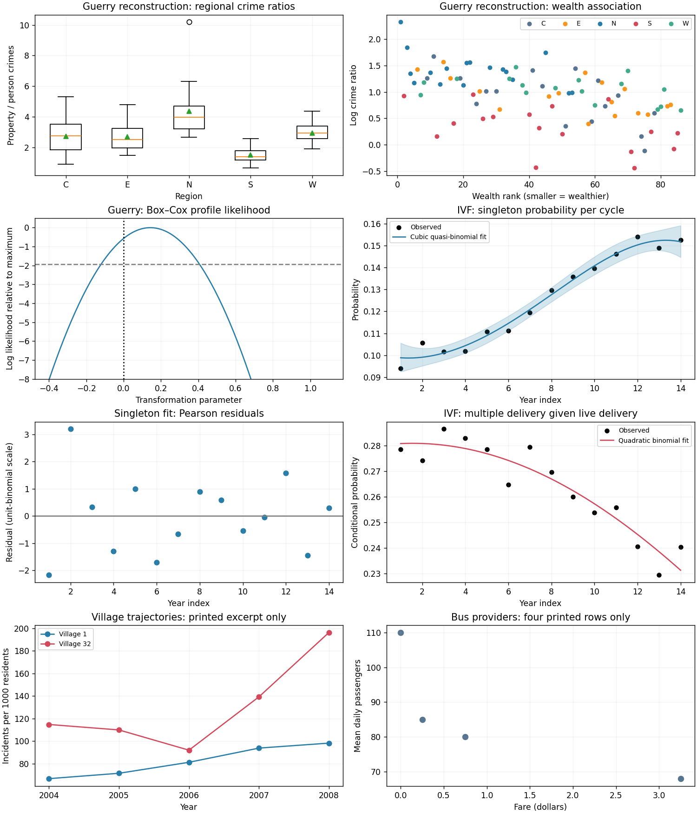

<h1 id="2/c/solution">Solution</h1>

↑ **Parent:** [C](../c.md)

The correct denominator is the number of live deliveries $B_i=S_i+T_i+H_i$, not treatment cycles and not babies. Define $M_i=T_i+H_i$ and use $M_i\mid B_i\sim\operatorname{Bin}(B_i,q_i)$; this is the distinction in [denominators in grouped birth-outcome models](../../../../../../denominators-in-grouped-birth-outcome-models.md). The observed conditional multiple-delivery proportion is $661/2373=0.2786$ initially and $1147/4773=0.2403$ finally.

A constant logit has residual [deviance](../../../../../../exponential-family-deviance.md) $87.48$ on 13 degrees of freedom. A linear-year fit gives $\widehat\eta=-1.02533-0.020879u$, deviance $16.46$ on 12 degrees of freedom ($p=0.171$), and annual odds ratio $0.97934$. A quadratic term improves the deviance by $5.814$ on one degree of freedom ($p=0.0159$), whereas a further cubic improvement is only $1.390$ ($p=0.238$). A supported parsimonious binomial model is

$$
\boxed{\operatorname{logit}(\widehat q_i)=-0.999606-0.020027u_i-0.0016823u_i^2.}
$$

Its residual deviance is $10.651$ on 11 degrees of freedom ($p=0.473$), and Pearson statistic is $10.647$, with no detected excess dispersion. The binomial standard errors are $0.014445,0.002515,0.000699$; approximate 95% [Wald confidence intervals](../../../../../../wald-confidence-interval.md) are $[-1.02792,-0.97129]$, $[-0.02496,-0.01510]$, and $[-0.003052,-0.000313]$. The annual odds multiplier is $\exp\{\beta_1+\beta_2(2u+1)\}$, describing near-flat early behaviour and a stronger later reduction, rather than a uniform annual decrease.

As a secondary check, modelling the triplet-or-higher share alone among deliveries needs curvature: its quadratic logit has residual deviance $12.905$ on 11 degrees of freedom, compared with $92.834$ for a straight line. **Multiple delivery became less likely conditional on a live delivery, especially later in the series; higher-order multiples declined particularly strongly.** This conditional probability is separate from the probability of any successful live delivery per cycle.

**[Figure 1](#2/c/image-guerry-reconstruction-and-complete-ivf-analyses-with-clearly-labelled-bus-and-village-excerpts). Guerry reconstruction and complete IVF analyses, with clearly labelled bus and village excerpts**.

## ↑ Ancestors (11)

1. [C](../c.md)
2. [2](../../2.md)
3. [Paper 102](../../../paper-102-split.md)
4. [Iii](../../../split.md)
5. [2009](../../../../split.md)
6. [Past exam of the mathematics course of the University of Cambridge](../../../../../split.md)
7. [Mathematics course of the University of Cambridge](../../../../../../mathematics-course-of-the-university-of-cambridge.md)
8. [Course of the University of Cambridge](../../../../../../course-of-the-university-of-cambridge.md)
9. [University of Cambridge](../../../../../../university-of-cambridge-split.md)
10. [List of universities](../../../../../../list-of-universities.md)
11. [Codex Wiki](../../../../../../split.md)
