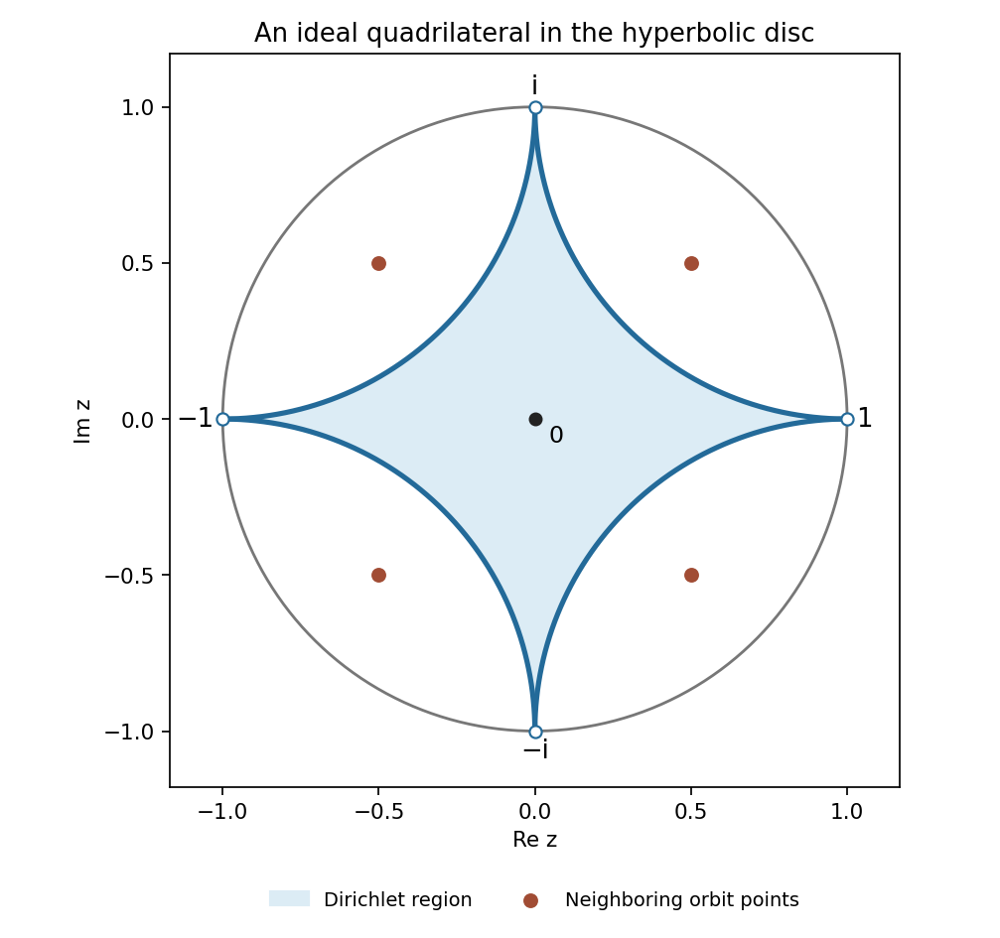

# Paper 11

↑ **Parent:** [Iii](../iii.md)

[https://www.maths.cam.ac.uk/postgrad/part-iii/files/pastpapers/2009/Paper11.pdf](https://www.maths.cam.ac.uk/postgrad/part-iii/files/pastpapers/2009/Paper11.pdf)

**Table of contents**

- [1](#1)
  - [Solution](#1/solution)
- [2](#2)
  - [Solution](#2/solution)
- [3](#3)
  - [Solution](#3/solution)
- [4](#4)
  - [Solution](#4/solution)
- [5](#5)
  - [Solution](#5/solution)

## 1

↑ **Parent:** [Paper 11](paper-11.md)

<h3 id="1/solution">Solution</h3>

↑ **Parent:** [1](#1)

On any [compact set](../../../topology.md#compact-space) avoiding the integers, write

$$
\frac1{z-n}+\frac1n=\frac{z}{n(z-n)}.
$$

For all sufficiently large $|n|$, uniformly on that [compact set](../../../topology.md#compact-space) this is $O(|n|^{-2})$. The summands in the higher series are $O(|n|^{-k})$ for $k\ge2$. The [Weierstrass M-test](../../../probability-and-statistics.md#weierstrass-m-test) therefore gives [locally uniform convergence](../../../real-analysis.md#locally-uniform-convergence) away from the integer [poles](../../../isolated-singularity.md#pole) and permits termwise differentiation. Near an integer $m$, isolate its singular summand; all the others converge uniformly on a small [neighborhood](../../../topology.md#neighbourhood-mathematics). Thus **the first function has a simple [pole](../../../isolated-singularity.md#pole) of [residue](../../../analysis.md#residue) one at each integer, and the $k$th function has a [pole](../../../isolated-singularity.md#pole) of order $k$ there with principal part $(z-m)^{-k}$**. There are no other singularities, so all are [meromorphic functions](../../../isolated-singularity.md#meromorphic-function).

Pairing positive and negative indices is legitimate because the regularized first series converges absolutely. It becomes

$$
\varepsilon_1(z)=\frac1z+\sum_{n=1}^{\infty}\frac{2z}{z^2-n^2}.
$$

Here is a direct derivation of its [cotangent partial-fraction expansion](../../../geometry-and-topology.md#cotangent-partial-fraction-expansion). Fix $z\notin\mathbb Z$ and integrate $F(\zeta)=\pi\cot(\pi\zeta)/(\zeta^2-z^2)$ around the square with real and imaginary coordinates $\pm R$, $R=N+1/2$, taking $N$ large enough to enclose $\pm z$. On the vertical sides $|\cot\pi\zeta|\le1$, and on the horizontal sides it is at most $\coth(\pi R)$. Thus the [cotangent](../../../geometry-and-topology.md#cotangent) is uniformly bounded and $|\zeta^2-z^2|\ge R^2-|z|^2$, so the contour integral is $O(R^{-1})\to0$.

The [residues](../../../analysis.md#residue) at integers are $1/(n^2-z^2)$; the two [residues](../../../analysis.md#residue) at $z$ and $-z$ sum to $\pi\cot(\pi z)/z$. The [residue theorem](../../../analysis.md#residue-theorem) and [absolute convergence](../../../real-analysis.md#absolute-convergence) of the integer [residue](../../../analysis.md#residue) sum consequently give

$$
0=\frac{\pi\cot\pi z}{z}+\sum_{n\in\mathbb Z}\frac1{n^2-z^2},
\qquad\varepsilon_1(z)=\pi\cot\pi z.
$$

Using the exponential definitions of [sine](../../../geometry-and-topology.md#sine) and [cosine](../../../geometry-and-topology.md#cosine) now yields, for $w=e^{2\pi iz}$,

$$
\boxed{\varphi_1(w)=\pi i\frac{w+1}{w-1},\qquad
\varepsilon_1(z)=\varphi_1(e^{2\pi iz}).}
$$

The same [locally uniform convergence](../../../real-analysis.md#locally-uniform-convergence) gives $\varepsilon_k'=-k\varepsilon_{k+1}$, including $k=1$. Hence if $\varepsilon_k(z)=\varphi_k(e^{2\pi iz})$, the [chain rule](../../../calculus.md#chain-rule) gives

$$
\boxed{\varphi_{k+1}(w)=-\frac{2\pi i}{k}\,w\varphi_k'(w).}
$$

This is a [rational function](../../../isolated-singularity.md#rational-function) whenever $\varphi_k$ is, proving the requested descent for every $k$ by induction, with

$$
\boxed{\varphi_2(w)=-\frac{4\pi^2w}{(w-1)^2}.}
$$

In particular periodicity is a consequence of the explicit descent, rather than an assumption about the summation order.

Finally, for $|z|<1$ expand each paired summand as a [geometric series](../../../real-analysis.md#geometric-series):

$$
\frac{2z}{z^2-n^2}=-2\sum_{j=0}^{\infty}\frac{z^{2j+1}}{n^{2j+2}}.
$$

On $|z|\le r<1$ the double series converges absolutely, since its absolute sum is at most $2r\sum_{n\ge1}n^{-2}/(1-r^2)$. Interchanging the sums and using the [Riemann zeta function](../../../analytic-number-theory.md#riemann-zeta-function) gives the [Laurent series](../../../analysis.md#laurent-series)

$$
\boxed{\varepsilon_1(z)=\frac1z-2\sum_{j=0}^{\infty}\zeta(2j+2)z^{2j+1},\qquad0<|z|<1.}
$$

Thus the $z^{-1}$ coefficient is one; the positive odd coefficients are $-2\zeta(2j+2)$, and all other coefficients vanish.

## 2

↑ **Parent:** [Paper 11](paper-11.md)

<h3 id="2/solution">Solution</h3>

↑ **Parent:** [2](#2)

Zeros are counted with their prescribed finite multiplicities, and the function is not identically zero. The criterion for [zero sets in the unit disc](../../../complex-analysis.md#zero-sets-in-the-unit-disc) is **local finiteness: no point of the disc is an accumulation point of the zero sequence, and no point has infinite [multiplicity](../../../polynomial.md#multiplicity-mathematics)**. Necessity follows from the [identity theorem for holomorphic functions](../../../complex-analysis.md#identity-theorem). For sufficiency, factor a finite number of zeros at zero as $z^m$. For an infinite sequence of remaining zeros $a_n$, local finiteness implies $|a_n|\to1$. With [Weierstrass elementary factors](../../../real-analysis.md#weierstrass-elementary-factor)

$$
E_n(t)=(1-t)\exp\left(\sum_{j=1}^n\frac{t^j}{j}\right),
$$

use $f(z)=z^m\prod_nE_n(z/a_n)$. On each [compact](../../../topology.md#compact-space) subdisc, eventually $|z/a_n|\le q<1$ and the logarithm of the tail factor is $-\sum_{j>n}(z/a_n)^j/j$, bounded in modulus by $q^{n+1}/((n+1)(1-q))$. These bounds are summable, so [infinite product convergence from logarithmic tails](../../../real-analysis.md#infinite-product-convergence-from-logarithmic-tails) gives [locally uniform convergence](../../../real-analysis.md#locally-uniform-convergence) and nonvanishing away from the listed zeros. Its finite initial factors give exactly their multiplicities. For a finite sequence an ordinary [polynomial](../../../polynomial.md) suffices.

Use the curvature-minus-one [hyperbolic metric](../../../geometry-and-topology.md#hyperbolic-metric), with length element $2|dz|/(1-|z|^2)$. Integrating radially gives

$$
\rho(0,a)=\log\frac{1+|a|}{1-|a|},\qquad
\frac12(1-|a|)\le e^{-\rho(0,a)}=\frac{1-|a|}{1+|a|}\le1-|a|.
$$

Therefore the printed sum condition is equivalent to the [Blaschke condition](../../../complex-analysis.md#blaschke-condition) $\sum_n(1-|a_n|)<\infty$.

To prove necessity for bounded $f$, first suppose $f(0)\ne0$ and choose a radius $r<1$ with no zero on its circle. Remove the finitely many factors $(z-a_n)$ for $|a_n|<r$. The logarithm of the modulus of the remaining zero-free function is [harmonic](../../../partial-differential-equation.md#harmonic-function) on the closed disc. Its [mean value property](../../../partial-differential-equation.md#mean-value-property-for-harmonic-functions), together with the mean of $\log|re^{i\theta}-a|$ being $\log r$ for $|a|<r$ (expand the logarithm in powers of $a/(re^{i\theta})$), proves [Jensen's formula](../../../complex-analysis.md#jensen-s-formula)

$$
\sum_{|a_n|<r}\log\frac r{|a_n|}
=\frac1{2\pi}\int_0^{2\pi}\log|f(re^{i\theta})|\,d\theta-\log|f(0)|
\le\log\|f\|_\infty-\log|f(0)|.
$$

Let $r\uparrow1$ through such radii. Each summand increases to $-\log|a_n|$, and $-\log t\ge1-t$ for $0<t\le1$ by integration of $1/t\ge1$. Consequently $\sum_n(1-|a_n|)<\infty$. If $f$ has order $m$ at zero, apply the argument to $f/z^m$, which is still bounded: outside $|z|=1/2$ it is bounded by $2^m\|f\|_\infty$, and inside use the [maximum modulus principle](../../../complex-analysis.md#maximum-modulus-principle). Add the finite contribution of the zeros at zero.

For sufficiency use a [Blaschke product](../../../complex-analysis.md#blaschke-product). For $a\ne0$ its normalized [Blaschke factor](../../../group-theory.md#blaschke-factor) is

$$
b_a(z)=\frac{|a|}{a}\frac{a-z}{1-\overline az},\qquad
1-b_a(z)=(1-|a|)\frac{1+(|a|/a)z}{1-\overline az}.
$$

On $|z|\le R<1$, $|1-b_a(z)|\le(1-|a|)(1+R)/(1-R)$. The [Blaschke condition](../../../complex-analysis.md#blaschke-condition) thus makes the product converge locally uniformly; outside the specified zeros, the tail logarithms converge absolutely and the product is nonzero. Each factor has modulus at most one in the disc, so the limit is bounded by one. A factor $z^m$ supplies any finite [multiplicity](../../../polynomial.md#multiplicity-mathematics) at zero. This proves

$$
\boxed{\text{A nonzero bounded holomorphic function with exactly these zeros exists}
\iff\sum_ne^{-\rho(0,a_n)}<\infty.}
$$

For the elementary inequality, put $H(t)=\log((1+t)/(1-t))-2t$. Then $H(0)=0$ and

$$
H'(t)=\frac2{1-t^2}-2=\frac{2t^2}{1-t^2}\ge0,
$$

so $\boxed{\log((1+t)/(1-t))\ge2t}$ for $0\le t<1$.

For any point $w$ not among the zeros, the [pseudohyperbolic distance](../../../geometry-and-topology.md#pseudohyperbolic-distance) formula gives

$$
|b_a(w)|=\left|\frac{w-a}{1-\overline aw}\right|
=\tanh\frac{\rho(w,a)}2=\frac{1-e^{-\rho(w,a)}}{1+e^{-\rho(w,a)}}.
$$

Apply the proved inequality with $t=e^{-\rho(w,a)}$ to obtain $\log|b_a(w)|\le-2e^{-\rho(w,a)}$. Sum over finite products and pass to the limit, including factors at zero. This gives

$$
\boxed{|B(w)|\le\exp\left(-2\sum_ne^{-\rho(w,a_n)}\right).}
$$

The sum is finite: the [triangle inequality](../../../topological-analysis.md#triangle-inequality) gives $e^{-\rho(w,a_n)}\le e^{\rho(0,w)}e^{-\rho(0,a_n)}$. If $w$ is itself a zero, $B(w)=0$ and the same bound is immediate, so no substitution at the excluded value $t=1$ is needed. A unimodular constant in $B$ has no effect.

If “zeros at the points” is interpreted as a set without assigned multiplicities, first delete repeated entries throughout. Otherwise infinitely repeating a single zero would invalidate the claimed necessity of the series condition; the standard zero-sequence convention counts multiplicities.

## 3

↑ **Parent:** [Paper 11](paper-11.md)

<h3 id="3/solution">Solution</h3>

↑ **Parent:** [3](#3)

The prescribed-pole form of [Runge theorem](../../../complex-analysis.md#runge-s-theorem) is as follows. Let $K\subset\mathbb C$ be [compact](../../../topology.md#compact-space), let $f$ be [holomorphic](../../../complex-analysis.md#complex-differentiability-at-a-point) on a [neighborhood](../../../topology.md#neighbourhood-mathematics) of $K$, and let $S\subset\widehat{\mathbb C}\setminus K$ meet every [connected component](../../../geometry-and-topology.md#connected-component) of that complement. Then, for every $\epsilon>0$, there is a [rational function](../../../isolated-singularity.md#rational-function) $R$, all of whose [poles](../../../isolated-singularity.md#pole) belong to $S$, with $\sup_K|f-R|<\epsilon$. A [pole](../../../isolated-singularity.md#pole) at infinity means a [polynomial](../../../polynomial.md) part is allowed. In particular, if the complement is [connected](../../../geometry-and-topology.md#connected-space), choose $S=\{\infty\}$ and obtain the [polynomial Runge theorem](../../../complex-analysis.md#polynomial-runge-theorem).

First approximate using [poles](../../../isolated-singularity.md#pole) anywhere off $K$. Choose a bounded polygonal [neighborhood](../../../topology.md#neighbourhood-mathematics) $V$ of $K$ whose closure lies in the [neighborhood](../../../topology.md#neighbourhood-mathematics) on which $f$ is [holomorphic](../../../complex-analysis.md#complex-differentiability-at-a-point), and whose boundary is disjoint from $K$. Such a $V$ comes from a sufficiently fine finite grid covering a small closed [neighborhood](../../../topology.md#neighbourhood-mathematics) of $K$. Orient the outer boundary positively and boundaries of holes negatively. The [Cauchy integral formula](../../../analysis.md#cauchy-integral-formula) gives

$$
f(z)=\frac1{2\pi i}\int_{\partial V}\frac{f(\zeta)}{\zeta-z}\,d\zeta,\qquad z\in K.
$$

Because $\partial V$ and $K$ have positive distance, the integrand is [uniformly continuous](../../../topological-analysis.md#uniform-continuity) on their product, separately along each boundary edge. Its [Riemann sums](../../../real-analysis.md#riemann-sum) converge uniformly for $z\in K$. Those sums are [rational functions](../../../isolated-singularity.md#rational-function) $\sum_jc_j/(\zeta_j-z)$ with [poles](../../../isolated-singularity.md#pole) $\zeta_j\notin K$. Thus arbitrary exterior [poles](../../../isolated-singularity.md#pole) suffice.

To move them to the prescribed set, let $A$ be the uniform closure on $K$ of [rational functions](../../../isolated-singularity.md#rational-function) with [poles](../../../isolated-singularity.md#pole) only in $S$. It is a closed unital algebra; it contains the coordinate function when $\infty\in S$. Define

$$
E=\{a\in\mathbb C\setminus K:(z-a)^{-1}\in A\}.
$$

This set is open relative to $\mathbb C\setminus K$. Indeed, if $a\in E$ and $|b-a|<\operatorname{dist}(a,K)$, the uniformly convergent expansion

$$
\frac1{z-b}=\sum_{j=0}^{\infty}\frac{(b-a)^j}{(z-a)^{j+1}}
$$

places the new reciprocal in $A$, using its algebra and closedness properties. It is also relatively closed: if $a_m\in E$ tends to $a\notin K$, then $(z-a_m)^{-1}$ tends uniformly on $K$ to $(z-a)^{-1}$. Each bounded component contains a finite selected [pole](../../../isolated-singularity.md#pole) and hence meets $E$. The unbounded component also meets $E$ if it contains a finite selected [pole](../../../isolated-singularity.md#pole); if its selected [pole](../../../isolated-singularity.md#pole) is infinity, take $|a|>\sup_K|z|$ and use

$$
\frac1{z-a}=-\frac1a\sum_{j=0}^{\infty}\left(\frac za\right)^j,
$$

a uniform [polynomial](../../../polynomial.md) expansion. Being both open and closed and meeting every component, $E$ is all of $\mathbb C\setminus K$. Every initial Cauchy-sum reciprocal therefore belongs to $A$, and so does $f$. This proves [Runge theorem](../../../complex-analysis.md#runge-s-theorem), including its prescribed-pole assertion, rather than merely [polynomial](../../../polynomial.md) approximation on a special [compact set](../../../topology.md#compact-space).

For the requested [pointwise polynomial approximation of a half-plane sign](../../../complex-analysis.md#pointwise-polynomial-approximation-of-a-half-plane-sign), take $n\ge2$ and

$$
K_n^+=\{x+iy:|x|\le n,\ 1/n\le y\le n\},\qquad
K_n^0=[-n,n],\qquad K_n^-=\{x+iy:|x|\le n,\ -n\le y\le-1/n\},
$$

These three [compact sets](../../../topology.md#compact-space) are disjoint, and their union $K_n$ has [connected](../../../geometry-and-topology.md#connected-space) complement: there are horizontal gaps above and below the segment, and every complementary point can be joined through these gaps or around a rectangle to the exterior of $[-n,n]^2$. Define $h_n$ to be $1,0,-1$ on disjoint open [neighborhoods](../../../topology.md#neighbourhood-mathematics) of these three sets. It is [holomorphic](../../../complex-analysis.md#complex-differentiability-at-a-point) on their union. By the [polynomial Runge theorem](../../../complex-analysis.md#polynomial-runge-theorem), choose $P_n$ with $\sup_{K_n}|P_n-h_n|<1/n$.

For every fixed point with positive imaginary part, both coordinate bounds and $1/n\le\operatorname{Im}z$ eventually hold, so it lies in $K_n^+$ for all large $n$; the reflected assertion holds for negative imaginary part. Every real point eventually lies in $K_n^0$. Consequently

$$
\boxed{\lim_{n\to\infty}P_n(z)=\operatorname{sgn}(\operatorname{Im}z),\quad\operatorname{sgn}(0)=0.}
$$

The discontinuity of the limit does not contradict holomorphicity of the approximating functions: this convergence is pointwise, and is not locally uniform near the real axis.

Finally, identify $K^*$ as the [holomorphic convex hull](../../../complex-analysis.md#holomorphic-convex-hull) relative to $\Omega$. If $U$ is a component of $\widehat{\mathbb C}\setminus K$ lying entirely in $\Omega$, it cannot contain infinity and is bounded. Its boundary lies in $K$, and its closure is [compact](../../../topology.md#compact-space) in $\Omega$. For any [holomorphic](../../../complex-analysis.md#complex-differentiability-at-a-point) $f$ on $\Omega$, the [maximum modulus principle](../../../complex-analysis.md#maximum-modulus-principle) on $U$ gives $|f(w)|\le\sup_{\partial U}|f|\le\sup_K|f|$. Thus $U\subseteq K^*$, as is $K$ itself.

Conversely let $w\in\Omega\setminus K$ lie in a complementary component $U$ that is not entirely in $\Omega$. If it contains a finite point $a\notin\Omega$, form the [uniform algebra](../../../banach-algebra.md#uniform-algebra) on $K$ generated by constants and $(z-a)^{-1}$. The same open-and-closed reciprocal argument above, now only on the [connected component](../../../geometry-and-topology.md#connected-component) $U$, shows that $(z-w)^{-1}$ is in its uniform closure. Its approximants have [poles](../../../isolated-singularity.md#pole) only at $a$ and are [holomorphic](../../../complex-analysis.md#complex-differentiability-at-a-point) on $\Omega$. If the available point outside $\Omega$ is infinity, use the [polynomial](../../../polynomial.md) algebra and its large-pole expansion instead. Hence in either case choose $h\in\mathcal O(\Omega)$ with

$$
\sup_{z\in K}\left|\frac1{z-w}-h(z)\right|<\frac1{2\max_{z\in K}|z-w|}.
$$

The function $F(z)=1-(z-w)h(z)$ is [holomorphic](../../../complex-analysis.md#complex-differentiability-at-a-point) on $\Omega$, has $F(w)=1$, and satisfies $\sup_K|F|<1/2$. It separates $w$ from the hull, so $w\notin K^*$. Combining the two inclusions proves

$$
\boxed{K^*=K\ \cup\!\!\bigcup_{\substack{U\text{ component of }\widehat{\mathbb C}\setminus K\\U\subset\Omega}}U.}
$$

Here $\mathbb P$ denotes the [Riemann sphere](../../../complex-analysis.md#riemann-sphere); using it ensures that the unbounded component, which contains infinity, is not accidentally filled. The empty [compact set](../../../topology.md#compact-space) has empty hull by the usual convention; the separation argument above concerns nonempty $K$.

## 4

↑ **Parent:** [Paper 11](paper-11.md)

<h3 id="4/solution">Solution</h3>

↑ **Parent:** [4](#4)

The [Schwarz-Pick lemma](../../../analysis.md#schwarz-pick-theorem) says that every [holomorphic](../../../complex-analysis.md#complex-differentiability-at-a-point) self-map $F$ of the [unit disc](../../../topology.md#unit-disc) contracts [pseudohyperbolic distance](../../../geometry-and-topology.md#pseudohyperbolic-distance) and therefore [hyperbolic distance](../../../geometry-and-topology.md#hyperbolic-distance):

$$
\left|\frac{F(z)-F(w)}{1-\overline{F(w)}F(z)}\right|
\le\left|\frac{z-w}{1-\overline wz}\right|,\qquad
\rho(F(z),F(w))\le\rho(z,w).
$$

Its infinitesimal form is

$$
\boxed{\frac{|F'(w)|}{1-|F(w)|^2}\le\frac1{1-|w|^2}.}
$$

Equality for distinct points in the distance inequality, or at one point in the [derivative](../../../calculus.md#derivative) inequality, holds exactly when $F$ is a disc [Möbius transformation](../../../group-theory.md#mobius-transformation).

For completeness, first prove the [Schwarz lemma](../../../analysis.md#schwarz-lemma). If $H:\mathbb D\to\mathbb D$ is [holomorphic](../../../complex-analysis.md#complex-differentiability-at-a-point) and $H(0)=0$, the quotient $H(z)/z$ extends holomorphically at zero. On $|z|=r<1$ its modulus is at most $1/r$. The [maximum modulus principle](../../../complex-analysis.md#maximum-modulus-principle), followed by $r\uparrow1$, gives $|H(z)|\le|z|$ and $|H'(0)|\le1$. Equality at a nonzero point or in the [derivative](../../../calculus.md#derivative) forces that quotient to be a constant of modulus one, again by the [maximum modulus principle](../../../complex-analysis.md#maximum-modulus-principle); hence $H(z)=e^{i\theta}z$.

Now let $\phi_a(z)=(z-a)/(1-\overline az)$ and apply this result to $H=\phi_{F(w)}\circ F\circ\phi_w^{-1}$, which fixes zero. The modulus inequality is exactly the displayed distance inequality, and $\rho=\log((1+\delta)/(1-\delta))$ is increasing in $\delta$, giving hyperbolic contraction. Also $|\phi_a'(a)|=(1-|a|^2)^{-1}$ and $|({\phi_w^{-1}})'(0)|=1-|w|^2$, so the [chain rule](../../../calculus.md#chain-rule) proves the [derivative](../../../calculus.md#derivative) inequality. The equality statement follows from the rotation case of the [Schwarz lemma](../../../analysis.md#schwarz-lemma) after undoing the two automorphisms. Conversely a disc automorphism preserves the distance and attains equality.

There is a maximum of the [derivative](../../../calculus.md#derivative) modulus in the given annulus family, which is nonempty because it contains the constant function one. Indeed the functions are bounded by $e$, and [Cauchy estimates](../../../analysis.md#cauchy-estimate) bound their [derivatives](../../../calculus.md#derivative) at zero. Take a sequence whose [derivative](../../../calculus.md#derivative) moduli approach the finite supremum. By [Montel theorem](../../../complex-dynamics.md#montel-s-theorem) it has a subsequence converging locally uniformly to a [holomorphic function](../../../complex-analysis.md#holomorphic-function) $f$, with $f(0)=1$ and $e^{-1}\le|f|\le e$. The upper equality cannot occur at an interior point, because the [maximum modulus principle](../../../complex-analysis.md#maximum-modulus-principle) would force a constant of modulus $e$, contrary to $f(0)=1$. The lower equality is excluded by applying the same argument to $1/f$, which is [holomorphic](../../../complex-analysis.md#complex-differentiability-at-a-point) because $|f|\ge e^{-1}$. Thus the limit still maps into the open annulus. [Locally uniform convergence](../../../real-analysis.md#locally-uniform-convergence) gives convergence of [derivatives](../../../calculus.md#derivative) by the [Cauchy integral formula](../../../analysis.md#cauchy-integral-formula), so this limit attains the supremum.

To compute it and all extremizers, the nonvanishing function $f$ on the [simply connected](../../../algebraic-topology.md#simply-connected-space) disc has a [holomorphic logarithm](../../../complex-analysis.md#holomorphic-logarithm) $h$ with $h(0)=0$. One can construct it by integrating $f'/f$ from zero; differentiation shows $e^h/f$ is constant, hence one. Its real part obeys $-1<\operatorname{Re}h<1$. The map

$$
T(h)=\tan\frac{\pi h}{4}
$$

is a [biholomorphism](../../../complex-analysis.md#biholomorphism) from this vertical strip onto the disc. To check the inverse explicitly, for $|z|<1$ the ratio $(1+iz)/(1-iz)$ has positive real part, so its logarithm with value zero at zero has imaginary part in $(-\pi/2,\pi/2)$. Therefore

$$
s(z)=\frac4\pi\arctan z=\frac{2}{\pi i}\log\frac{1+iz}{1-iz}
$$

has real part between minus one and one, and direct substitution gives $T(s(z))=z$. The strip restriction removes the period ambiguity of the [tangent](../../../geometry-and-topology.md#tangent), so these are inverse maps.

Applying the [Schwarz lemma](../../../analysis.md#schwarz-lemma) to $T\circ h$ gives $(\pi/4)|h'(0)|\le1$. Since $f'(0)=h'(0)$, the exact maximum is

$$
\boxed{\max_{f\in\mathcal F}|f'(0)|=\frac4\pi.}
$$

It is attained by $f(z)=\exp((4/\pi)\arctan z)$. The equality case requires $T(h(z))=e^{i\theta}z$, and hence all maximizing functions are

$$
\boxed{f_\theta(z)=\exp\left(\frac4\pi\arctan(e^{i\theta}z)\right),\qquad\theta\in\mathbb R.}
$$

Their [derivatives](../../../calculus.md#derivative) are $(4/\pi)e^{i\theta}$, so **the extremizer is not unique**: there is exactly this circle of distinct functions, with the parameter considered modulo $2\pi$. This is the [extremal derivative of a disc map into a symmetric annulus](../../../analysis.md#extremal-derivative-of-a-disc-map-into-a-symmetric-annulus) for $L=1$.

## 5

↑ **Parent:** [Paper 11](paper-11.md)

<h3 id="5/solution">Solution</h3>

↑ **Parent:** [5](#5)

Represent a transformation by

$$
M(u,v)=\begin{pmatrix}u&v\\\overline v&\overline u\end{pmatrix},\qquad\det M=|u|^2-|v|^2=1.
$$

Multiplication preserves this form and [determinant](../../../linear-algebra.md#determinant), and the inverse has the same form with parameters $(\overline u,-v)$. To check the congruence condition, [complex conjugation](../../../complex-analysis.md#complex-conjugation) is the identity modulo $2\mathbb Z[i]$. Thus $u+v\equiv1$ says exactly that $M$ fixes the column $(1,1)^T$ modulo two. Products and inverses preserve this property. The identity belongs to the set, and changing the common sign of $(u,v)$ does not change either the transformation or its congruence. Hence **these transformations form a [group](../../../group.md)**.

Because $|u|>|v|$, the denominator has no zero in the disc. Direct calculation gives

$$
1-|g(z)|^2=\frac{1-|z|^2}{|\overline vz+\overline u|^2},\qquad
|g'(z)|=\frac1{|\overline vz+\overline u|^2}.
$$

The inverse also maps the disc into itself, so $g$ is a disc automorphism, and these identities show that it preserves the [hyperbolic metric](../../../geometry-and-topology.md#hyperbolic-metric) $2|dz|/(1-|z|^2)$.

The action is properly discontinuous. If $C\subset\mathbb D$ is [compact](../../../topology.md#compact-space), put $R=\max_{z\in C}\rho(0,z)$. If $gC\cap C\ne\varnothing$, choose $z,w\in C$ with $w=gz$. Then

$$
\rho(0,g0)\le\rho(0,w)+\rho(w,g0)=\rho(0,w)+\rho(z,0)\le2R.
$$

Since $g0=v/\overline u$ and $|u|^2-|v|^2=1$, its distance bound gives $|v/u|\le\tanh R<1$ and therefore $|u|^2=1/(1-|v/u|^2)\le\cosh^2R$. There are only finitely many [Gaussian integers](../../../commutative-algebra.md#gaussian-integer) $u,v$ with these bounds, so only finitely many $g$ satisfy $gC\cap C\ne\varnothing$. This proves the required [properly discontinuous group action](../../../geometric-group-theory.md#properly-discontinuous-group-action) directly.

If $g0=0$, then $v=0$ and $u$ is one of the [Gaussian units](../../../electromagnetism.md#gaussian-units) $1,-1,i,-i$. The congruence $u-1\in2\mathbb Z[i]$ leaves only $u=\pm1$. Both give the identity transformation. Thus **the [point stabilizer](../../../group-theory.md#stabilizer-subgroup) of zero is trivial**.

The closed [Dirichlet region](../../../geometric-group-theory.md#dirichlet-domain) centered at zero is the set of $z$ with $\rho(z,0)\le\rho(z,g0)$ for every $g$. For a nonidentity element, $v\ne0$. Write

$$
N=|v|^2\in\mathbb Z_{\ge1},\qquad uv=m+in,\qquad
q=g0=\frac{uv}{|u|^2}=\frac{m+in}{N+1}.
$$

The distance inequality is equivalent, by [pseudohyperbolic distance](../../../geometry-and-topology.md#pseudohyperbolic-distance), to $|z|\le|(z-q)/(1-\overline qz)|$. Squaring and subtracting yields

$$
|z-q|^2-|z|^2|1-\overline qz|^2
=(1-|z|^2)\bigl[|q|^2(1+|z|^2)-2\operatorname{Re}(z\overline q)\bigr].
$$

Since $|z|<1$ and $|q|^2=N/(N+1)$, the bisector half-plane is exactly

$$
2(mx+ny)\le N(1+x^2+y^2),\qquad z=x+iy.
$$

For $u=1+i$ or $1-i$ and $v=i$ or $-i$, all the [group](../../../group.md) conditions hold and the products $uv$ are the four numbers $\pm1\pm i$, with $N=1$. Their four inequalities force

$$
2(|x|+|y|)\le1+x^2+y^2.
$$

Conversely, for any [group](../../../group.md) element $m^2+n^2=|uv|^2=N(N+1)<(N+1)^2$. As $m,n$ are integers, $|m|,|n|\le N$. Thus every point satisfying those four inequalities satisfies every other one:

$$
2(mx+ny)\le2N(|x|+|y|)\le N(1+x^2+y^2).
$$

This proves, with no missing bisectors, the [Gaussian-integer disc group with an ideal-square Dirichlet domain](../../../geometric-group-theory.md#gaussian-integer-disc-group-with-an-ideal-square-dirichlet-domain) formula

$$
\boxed{D_G(0)=\{x+iy:x^2+y^2<1,\ 2(|x|+|y|)\le1+x^2+y^2\}.}
$$

Equivalently it is the part of the [unit disc](../../../topology.md#unit-disc) outside all four open circles of radius one centered at $1+i,1-i,-1+i,-1-i$. Its sides are the inward arcs of those circles. They meet the unit circle orthogonally, and their ideal vertices are $\boxed{1,i,-1,-i}$; these vertices themselves lie outside the open disc.

**[Figure 1](#5/image-origin-centered-dirichlet-region-and-the-four-neighboring-orbit-points). Origin-centered Dirichlet region and the four neighboring orbit points**.

The origin has trivial [point stabilizer](../../../group-theory.md#stabilizer-subgroup) and the [group orbit](../../../group-theory.md#orbit-of-a-group-action) is locally finite by the discontinuity proof, so this closed bisector intersection has translates covering the disc with disjoint interiors, as in the definition of a [Dirichlet domain](../../../geometric-group-theory.md#dirichlet-domain). Side identifications are allowed on its boundary.

## ↑ Ancestors (8)

1. [Iii](../iii.md)
2. [2009](../../2009.md)
3. [Past exam of the mathematics course of the University of Cambridge](../../../past-exam-of-the-mathematics-course-of-the-university-of-cambridge.md)
4. [Mathematics course of the University of Cambridge](../../../university-of-cambridge.md#mathematics-course-of-the-university-of-cambridge)
5. [Course of the University of Cambridge](../../../university-of-cambridge.md#course-of-the-university-of-cambridge)
6. [University of Cambridge](../../../university-of-cambridge.md)
7. [List of universities](../../../README.md#list-of-universities)
8. [Codex Wiki](../../../README.md)
