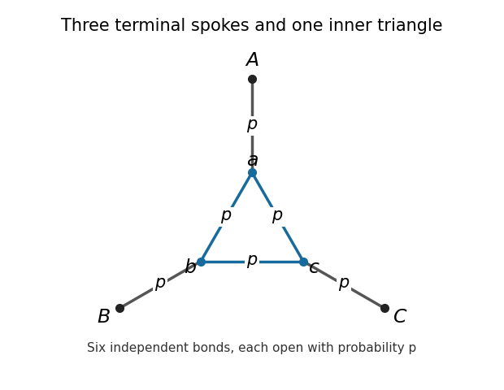

<h1 id="4/ii/solution">Solution</h1>

↑ **Parent:** [Ii](../ii.md)

Group the [martini lattice](../../../../../../martini-lattice.md) into independent three-terminal cells. A cell has terminals $A,B,C$, an inner triangle with vertices $a,b,c$, and the three spokes $Aa,Bb,Cc$. All six bonds are independently open with parameter $p$. The cells arise from the vertices in the decorated class of the [honeycomb lattice](../../../../../../honeycomb-lattice.md); they have disjoint bond sets and meet only at terminals. The terminal positions form a [triangular lattice](../../../../../../triangular-lattice.md), with cells occupying one orientation of its triangular faces.

**[Figure 1](#4/ii/image-the-six-bond-martini-cell-three-terminal-spokes-and-an-inner-triangle). The six-bond martini cell: three terminal spokes and an inner triangle**.

A cell induces one of five connection partitions of its terminals. Let $P_3(p)$ be the [probability](../../../../../../probability.md) that all three terminals are connected, and $P_0(p)$ the [probability](../../../../../../probability.md) that no pair is connected. Each of the three remaining pair partitions has equal [probability](../../../../../../probability.md) by symmetry. The [three-terminal cell partition duality](../../../../../../three-terminal-cell-partition-duality.md) gives a particularly useful exact criterion. Draw dual terminals on the three intervening boundary arcs. The dual cell has a triangle of these three terminals and a central vertex joined to all three: its outer bonds cross the primal spokes, and its inner spokes cross the primal triangle bonds. A primal connection separates the corresponding dual boundary arcs, and conversely a dual connection separates primal terminals. Consequently duality swaps the all-connected and all-separate partitions, and permutes the three pair partitions. For example, if $A,B$ connect and $C$ is isolated, the dual terminal between $A,B$ is isolated while the other two dual terminals connect. It follows that $P_3=P_0$ makes the entire symmetric cell partition law invariant under this duality.

The triangular arrangement of cells is itself self-dual: the dual terminals lie in the complementary triangular gaps, and reflection and translation identify their cell arrangement with the original one. The induced partitions of distinct cells are independent in both models. At a parameter satisfying $P_3=P_0$, the primal model at $p$ and the complementary [dual bond percolation](../../../../../../dual-bond-percolation.md) model at $1-p$ therefore have the same coarse connection law. Replacing a cell by its terminal partition preserves infinite connectivity, since the cells have uniformly bounded size. This gives a rigorous link between the finite calculation and the infinite model, rather than assuming that a symmetric-looking cell is critical.

For all three terminals to connect, all three spokes must be open and the inner triangle must be connected. The latter event requires two or three of its edges. Therefore

$$
P_3(p)=p^3\bigl(3p^2(1-p)+p^3\bigr)=3p^5-2p^6.
$$

To compute $P_0$, condition on the number of open spokes. Zero or one open spoke cannot connect a pair of terminals. If exactly two spokes are open, the two attached inner vertices must not connect: their direct triangle bond is closed, and the two-edge route through the third inner vertex is not fully open. These independent requirements have [probability](../../../../../../probability.md) $(1-p)(1-p^2)$. If all three spokes are open, all three triangle bonds must be closed. Hence

$$
P_0(p)=(1-p)^3+3p(1-p)^2+3p^2(1-p)^2(1-p^2)+p^3(1-p)^3.
$$

Subtracting and factoring gives

$$
P_3(p)-P_0(p)=2p^6-6p^5+3p^4+3p^3-1=(2p^2-1)(p^4-3p^3+2p^2+1).
$$

The second factor equals $1+p^2(p-1)(p-2)$ and is at least $1$ on $[0,1]$. Thus the unique equality parameter is $p_0=1/\sqrt2$.

Finally part (i) proves $c+c^*=1$. If $p_0>c$, the primal model percolates while $1-p_0<c^*$ makes the dual model subcritical, contradicting their identical coarse connection laws. If $p_0<c$, the same contradiction arises with the roles reversed. Therefore **the critical probability is**

$$
\boxed{p_c^b(\Lambda)=\frac1{\sqrt2}.}
$$

The local partition transformation is the mechanism underlying this exact value; see [Ziff's original cell–dual-cell paper](https://journals.aps.org/pre/abstract/10.1103/PhysRevE.73.016134).

## ↑ Ancestors (11)

1. [Ii](../ii.md)
2. [4](../../4.md)
3. [Paper 15](../../../paper-15-split.md)
4. [Iii](../../../split.md)
5. [2009](../../../../split.md)
6. [Past exam of the mathematics course of the University of Cambridge](../../../../../split.md)
7. [Mathematics course of the University of Cambridge](../../../../../../mathematics-course-of-the-university-of-cambridge.md)
8. [Course of the University of Cambridge](../../../../../../course-of-the-university-of-cambridge.md)
9. [University of Cambridge](../../../../../../university-of-cambridge-split.md)
10. [List of universities](../../../../../../list-of-universities.md)
11. [Codex Wiki](../../../../../../split.md)
