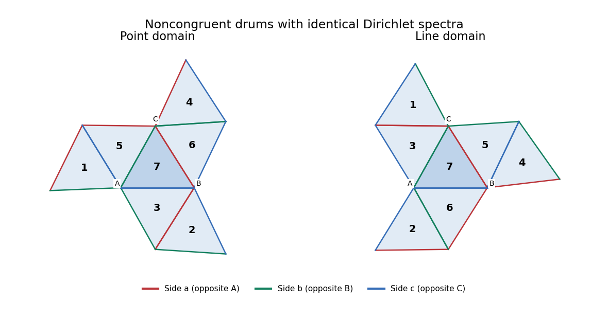

<h1 id="2/solution">Solution</h1>

↑ **Parent:** [2](../2.md)

We construct a family by [seven-triangle Dirichlet transplantation](../../../../../seven-triangle-dirichlet-transplantation.md). Start with a scalene [triangle](../../../../../triangle.md) $\tau$ sufficiently close to an [equilateral triangle](../../../../../equilateral-triangle.md). Its three side lengths are the three independent parameters; restrict to an open set where its angles $\alpha,\beta,\gamma$ are distinct and lie between $\pi/4$ and $\pi/2$. Label the sides $a,b,c$ opposite the corresponding vertices $A,B,C$.

For each of two [planar domains](../../../../../planar-domain.md), begin with tile $7$ and attach the remaining congruent copies by [Euclidean reflection](../../../../../reflection-mathematics.md) across the indicated sides. The attachment tables are

$$
\begin{array}{c|cc}
\text{side}&\text{point domain }\Omega_P&\text{line domain }\Omega_L\\\hline
 a&(2,3),(6,7)&(1,3),(5,7)\\
 b&(4,6),(5,7)&(2,6),(3,7)\\
 c&(1,5),(3,7)&(4,5),(6,7)
\end{array}
$$

For example, $(6,7)$ in the first $a$ row means to reflect tile $7$ across its $a$ side to obtain tile $6$. Both attachment [graphs](../../../../../graph-split.md) are trees: there is a central tile with three arms, each consisting of two tiles. Every side not used in the table is an exterior boundary side.

At the [equilateral triangle](../../../../../equilateral-triangle.md), these seven reflected tile interiors are disjoint; at each central vertex four sectors of angle $\pi/3$ meet, leaving an exterior gap $2\pi/3$. Other boundary vertices have angles $\pi/3$ or $2\pi/3$, and distinct nonincident pieces are separated. The positive angular gaps and separations persist under sufficiently small perturbations of the three side lengths. Thus this construction really gives connected polygonal [planar domains](../../../../../planar-domain.md) on an open three-dimensional parameter set. Their only reentrant vertices are the central vertices $A,B,C$, with interior angles $4\alpha,4\beta,4\gamma$; all other boundary angles are one or two triangle angles and are less than $\pi$.

Because these three reentrant angles are distinct, an [isometry](../../../../../isometry.md) of the two [planar domains](../../../../../planar-domain.md) would send each labelled central vertex to its counterpart. A planar [isometry](../../../../../isometry.md) is the restriction of a Euclidean rigid motion: its differential preserves the Euclidean connection, hence is constant on the connected domain. After aligning the central triangles, such a motion fixes three noncollinear points and is the identity. But the domains are not identical. On the arm attached to side $a$, the point construction attaches the last tile across side $b$, whereas the line construction attaches it across side $c$. The former side is therefore interior in one domain and exterior in the other. This proves **the two domains are nonisometric throughout this three-parameter family**.

**[Figure 1](#2/image-two-noncongruent-seven-triangle-domains-with-identical-dirichlet-spectra-matching-colours-label-matching-sides). Two noncongruent seven-triangle domains with identical Dirichlet spectra; matching colours label matching sides**.

We now prove equality of the [Dirichlet Laplacian](../../../../../dirichlet-laplacian.md) [spectra](../../../../../spectrum-functional-analysis.md), including multiplicities. Index $1,\ldots,7$ by the nonzero binary vectors $x=(x_1,x_2,x_3)$, with integer label $x_1+2x_2+4x_3$. The transformations

$$
 s_a(x)=(x_1+x_2,x_2,x_3),\qquad
 s_b(x)=(x_1,x_2+x_3,x_3),\qquad
 s_c(x)=(x_1,x_2,x_3+x_1)
$$

are involutions over $\mathbb F_2$. Their point permutations $P_s$ are precisely the transpositions in the left attachment table, with the remaining points fixed. On covectors the inverse-transpose transformations give permutations $Q_s$ with exactly the right table. Let $B$ be the point-line [incidence matrix of a set system](../../../../../incidence-matrix-of-a-set-system.md) of the [Fano plane](../../../../../fano-plane.md):

$$
B_{y,x}=\begin{cases}1,&y\cdot x=0,\\0,&y\cdot x=1.\end{cases}
$$

The incidence relation is invariant under transforming $x$ and its covector $y$ contragrediently, so $BP_s=Q_sB$ for all three sides. Each point lies on three lines, and two distinct points lie on exactly one common line. Consequently

$$
B^TB=2I+J,
$$

where $J$ is the all-ones [matrix](../../../../../matrix.md). Its [eigenvalues](../../../../../eigenvalue.md) are $9$ once and $2$ six times, so $B$ is invertible.

The [Dirichlet boundary condition](../../../../../dirichlet-boundary-condition.md) requires a sign change at an unglued side. Give each tile the sign $(-1)^{\text{distance from tile }7}$ and put

$$
D=\operatorname{diag}(1,1,-1,1,-1,-1,1).
$$

The signs alternate across each glued side in both domains. The signed side matrices are therefore

$$
S_s=-DP_sD,\qquad T_s=-DQ_sD.
$$

They have entry $+1$ across a glued pair and entry $-1$ on a fixed exterior tile. The invertible [seven-triangle Dirichlet transplantation](../../../../../seven-triangle-dirichlet-transplantation.md) matrix $C=DBD$ satisfies

$$
\boxed{CS_s=T_sC\qquad(s=a,b,c).}
$$

This is an actual [Dirichlet boundary condition](../../../../../dirichlet-boundary-condition.md) intertwiner, not merely the unsigned incidence relation.

To justify the spectral conclusion even at the reentrant corners, use the closed [Dirichlet energy](../../../../../dirichlet-energy.md) form. Pull a function on either domain back to its seven reference triangles and write its components as a vector $F$. The form domain consists of $H^1$ components whose side traces agree on glued pairs and vanish on exterior sides; equivalently $F=S_sF$ on each side for the point domain, and $G=T_sG$ for the line domain. These trace conditions exactly characterize $H_0^1$ of the glued polygon. Both its $L^2$ norm and its [Dirichlet energy](../../../../../dirichlet-energy.md) are the sums of their seven reference-tile integrals.

Since the signed side matrices are symmetric, the intertwining identities also give $S_sC^TC=C^TCS_s$. Thus $(C^TC)^{-1/2}$ commutes with every $S_s$, and the polar factor

$$
U=C(C^TC)^{-1/2}
$$

is an orthogonal [matrix](../../../../../matrix.md) with $US_s=T_sU$. Multiplication of the component vector by this constant [matrix](../../../../../matrix.md) preserves the $L^2$ [inner product](../../../../../inner-product.md) and the integrated squared [gradients](../../../../../gradient.md), and maps the two form domains bijectively. The [self-adjoint operators](../../../../../self-adjoint-operator.md) associated with these forms are consequently [unitarily equivalent](../../../../../unitary-equivalence.md), so their [eigenvalues](../../../../../eigenvalue.md) and multiplicities agree. The [eigenfunctions](../../../../../eigenfunction.md) are smooth in the interiors; no unwarranted smoothness at polygonal corners is required. We have proved

$$
\boxed{\operatorname{Spec}_D(\Omega_P)=\operatorname{Spec}_D(\Omega_L),
\qquad\Omega_P\not\cong\Omega_L.}
$$

## ↑ Ancestors (10)

1. [2](../2.md)
2. [Paper 22](../../paper-22-split.md)
3. [Iii](../../split.md)
4. [2009](../../../split.md)
5. [Past exam of the mathematics course of the University of Cambridge](../../../../split.md)
6. [Mathematics course of the University of Cambridge](../../../../../mathematics-course-of-the-university-of-cambridge.md)
7. [Course of the University of Cambridge](../../../../../course-of-the-university-of-cambridge.md)
8. [University of Cambridge](../../../../../university-of-cambridge-split.md)
9. [List of universities](../../../../../list-of-universities.md)
10. [Codex Wiki](../../../../../split.md)
