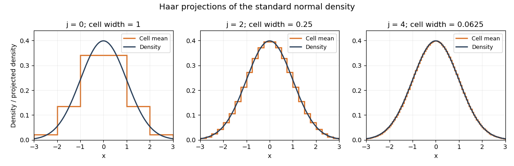

# Paper 33

↑ **Parent:** [Iii](../iii.md)

[https://www.maths.cam.ac.uk/postgrad/part-iii/files/pastpapers/2009/Paper33.pdf](https://www.maths.cam.ac.uk/postgrad/part-iii/files/pastpapers/2009/Paper33.pdf)

**Table of contents**

- [1](#1)
  - [Solution](#1/solution)
- [2](#2)
  - [Solution](#2/solution)
- [3](#3)
  - [Solution](#3/solution)
- [4](#4)
  - [Solution](#4/solution)

## 1

↑ **Parent:** [Paper 33](paper-33.md)

<h3 id="1/solution">Solution</h3>

↑ **Parent:** [1](#1)

Write $Ph=\mathbb E h(X)$ and $P_nh=n^{-1}\sum_{i=1}^nh(X_i)$ for the population and [empirical measure](../../../probability-theory.md#empirical-measure). The [empirical distribution function](../../../probability-theory.md#empirical-distribution-function) is

$$
\boxed{F_n(t)=\frac1n\sum_{i=1}^n\mathbf1_{\{X_i\le t\}}.}
$$

Fix $\varepsilon>0$ and a finite cover by [function brackets](../../../convergence-of-random-variables.md#bracketing-of-a-function-class) $[l_r,u_r]$ of $L^1(P)$ width below $\varepsilon$. If $h$ belongs to the $r$th bracket, then

$$
P_nh-Ph\le(P_nu_r-Pu_r)+P(u_r-h)\le|P_nu_r-Pu_r|+\varepsilon,
$$

and, using $l_r$ instead, $Ph-P_nh\le|P_nl_r-Pl_r|+\varepsilon$. Thus

$$
\sup_{h\in\mathcal H}|P_nh-Ph|
\le\varepsilon+\max_r\max\{|P_nl_r-Pl_r|,|P_nu_r-Pu_r|\}.
$$

The [strong law of large numbers](../../../convergence-of-random-variables.md#strong-law-of-large-numbers) applies to every integrable endpoint because the sample consists of [independent and identically distributed random variables](../../../random-variable.md#independent-and-identically-distributed-random-variables). For this finite collection the maximum tends to zero on a common probability-one event. Apply the argument for $\varepsilon=1/m$, $m=1,2,\ldots$, and intersect those countably many events. On the resulting event the limsup is at most $1/m$ for every $m$, proving the [uniform strong law from finite L1 bracketing](../../../convergence-of-random-variables.md#uniform-strong-law-from-finite-l1-bracketing). This pathwise argument also avoids assuming without justification that an arbitrary uncountable supremum is measurable.

For the [Glivenko-Cantelli theorem](../../../convergence-of-random-variables.md#glivenko-cantelli-theorem), take $h_t(x)=\mathbf1_{\{x\le t\}}$. Here is a finite bracketing construction which also handles atoms of the distribution. Choose $0<\delta<\varepsilon$ and divide the possible values of $F(t)$ into finitely many bins $[r\delta,(r+1)\delta)$, including the final value one. For each nonempty parameter set $T_r=\{t:r\delta\le F(t)<(r+1)\delta\}$, set $l_r=\inf_{t\in T_r}h_t$ and $u_r=\sup_{t\in T_r}h_t$ pointwise. These functions are indicators of rays, possibly with an open endpoint, so they are measurable. Monotonicity of $h_t$ and monotone limits at the extreme thresholds give $Pl_r=\inf_{t\in T_r}F(t)$ and $Pu_r=\sup_{t\in T_r}F(t)$. Hence $P(u_r-l_r)\le\delta<\varepsilon$. No continuity of $F$ is required. Applying the proved uniform law gives

$$
\boxed{\sup_{t\in\mathbb R}|F_n(t)-F(t)|\longrightarrow0\quad\text{almost surely}.}
$$

For an uncountable class of [continuous functions](../../../calculus.md#continuous-function), use $\mathcal H=\{h_a(x)=a\sin x:0\le a\le1\}$. The functions are distinct, bounded and integrable for every probability law. Moreover $\sup_{0\le a\le1}|P_nh_a-Ph_a|=|P_n\sin-P\sin|\to0$ by the [strong law of large numbers](../../../convergence-of-random-variables.md#strong-law-of-large-numbers). This supplies the requested example without additional compactness machinery.

## 2

↑ **Parent:** [Paper 33](paper-33.md)

<h3 id="2/solution">Solution</h3>

↑ **Parent:** [2](#2)

For a normalized [kernel for density estimation](../../../nonparametric-statistics.md#kernel-for-density-estimation) $K$, with $\int K=1$, the [kernel density estimator](../../../nonparametric-statistics.md#kernel-density-estimation) is

$$
\boxed{\widehat f_{n,h}(x)=\frac1{nh}\sum_{i=1}^nK\!\left(\frac{x-X_i}{h}\right).}
$$

It replaces each atom of the [empirical measure](../../../probability-theory.md#empirical-measure) by a translated, scaled copy of $K$: averaging these small probability-density bumps gives a smooth approximation to the sampling density. Integral one is part of the probability-kernel convention; without it, the estimator generally targets $f(x)\int K$.

**The printed bandwidth assumption is insufficient for the claimed normal limit.** The additional condition $nh_n\to\infty$ is needed at points with positive density. For a counterexample, take a [normal distribution](../../../probability-theory.md#normal-distribution) density $f$, $x=0$, the [unit-width box kernel](../../../nonparametric-statistics.md#unit-width-box-kernel) and $h_n=n^{-2}$. Then $nh_n^3\to0$, but the probability that any observation lies in the window is at most $n\|f\|_\infty h_n\to0$. On the complementary event the estimator is zero, and $\sqrt{nh_n}(\widehat f_{n,h_n}(0)-f(0))=-f(0)/\sqrt n\to0$. The limit in probability is therefore zero, whereas the stated normal limit has positive variance.

We now prove the intended [pointwise central limit theorem for a kernel density estimator](../../../nonparametric-statistics.md#pointwise-central-limit-theorem-for-a-kernel-density-estimator) under $h=h_n\to0$, $nh\to\infty$ and $nh^3\to0$. The first condition also follows from the last one. A [mean value theorem](../../../calculus.md#mean-value-theorem) bound, with $L=\|f'\|_\infty$, gives the [bias of a kernel density estimator](../../../nonparametric-statistics.md#bias-of-a-kernel-density-estimator)

$$
|\mathbb E\widehat f_{n,h}(x)-f(x)|
=\left|\int K(u)(f(x-hu)-f(x))\,du\right|
\le Lh\int|u|K(u)\,du.
$$

Thus the bias multiplied by $\sqrt{nh}$ tends to zero.

The [Lindeberg-Feller central limit theorem](../../../convergence-of-random-variables.md#lindeberg-feller-central-limit-theorem) says that independent centered variables in each row of a triangular array have sum converging in distribution to $N(0,\sigma^2)$ if the sum of their variances tends to $\sigma^2>0$ and, for every $\eta>0$, the sum of their truncated second moments $\mathbb E[Z_{n,i}^2\mathbf1_{\{|Z_{n,i}|>\eta\}}]$ tends to zero. Put $Y_{n,i}=K((x-X_i)/h)$ and $Z_{n,i}=(Y_{n,i}-\mathbb EY_{n,i})/\sqrt{nh}$. The [independence](../../../random-variable.md#independent-random-variables) hypothesis holds within each row. A change of variable gives

$$
\sum_{i=1}^n\operatorname{Var}(Z_{n,i})
=\frac{\operatorname{Var}(Y_{n,1})}{h}
=\int K(u)^2f(x-hu)\,du-h\left(\int K(u)f(x-hu)\,du\right)^2
\longrightarrow f(x)\|K\|_2^2.
$$

Continuity of $f$ at $x$ and the compact support and boundedness of $K$ justify the limit. Also $|Z_{n,i}|\le2\|K\|_\infty/\sqrt{nh}\to0$, so the [Lindeberg condition](../../../convergence-of-random-variables.md#lindeberg-condition) is eventually identically zero for every $\eta$. The sum is exactly $\sqrt{nh}(\widehat f_{n,h}(x)-\mathbb E\widehat f_{n,h}(x))$. Combining the centered limit with the negligible bias by the [Slutsky theorem](../../../statistical-inference.md#slutsky-theorem) proves

$$
\boxed{\sqrt{nh_n}(\widehat f_{n,h_n}(x)-f(x))\xrightarrow{d}N(0,f(x)\|K\|_2^2).}
$$

If $f(x)=0$, the centered variance tends to zero, and the [Chebyshev inequality](../../../probability-inequality.md#chebyshev-inequality) proves the corresponding degenerate limit directly.

For $f(x)>0$, let $q_\beta$ be the supplied $\beta$-quantile of this limiting [normal distribution](../../../probability-theory.md#normal-distribution). Inverting the limiting central probability gives the [confidence interval](../../../statistical-inference.md#confidence-interval)

$$
\boxed{\left[\widehat f_{n,h_n}(x)-\frac{q_{1-\alpha/2}}{\sqrt{nh_n}},\quad
\widehat f_{n,h_n}(x)-\frac{q_{\alpha/2}}{\sqrt{nh_n}}\right].}
$$

Continuity of the limiting distribution gives asymptotic coverage $1-\alpha$. Equivalently, its half-width is $z_{1-\alpha/2}\sqrt{f(x)\|K\|_2^2/(nh_n)}$ under the stipulated oracle quantiles. A degenerate limit at $f(x)=0$ does not by itself justify this nominal-coverage normal interval.

## 3

↑ **Parent:** [Paper 33](paper-33.md)

<h3 id="3/solution">Solution</h3>

↑ **Parent:** [3](#3)

Let $\phi$ be the [scaling function](../../../fourier-analysis.md#scaling-function) and $\psi$ an [orthonormal wavelet](../../../fourier-analysis.md#orthonormal-wavelet), with $\phi_{j,k}(x)=2^{j/2}\phi(2^jx-k)$ and $\psi_{j,k}(x)=2^{j/2}\psi(2^jx-k)$. For $f\in L^2(\mathbb R)$, the [wavelet series](../../../fourier-analysis.md#wavelet-series) at a coarse level $j_0$ is

$$
f=\sum_{k\in\mathbb Z}\langle f,\phi_{j_0,k}\rangle\phi_{j_0,k}
+\sum_{j\ge j_0}\sum_{k\in\mathbb Z}\langle f,\psi_{j,k}\rangle\psi_{j,k}.
$$

The series converges in the [L2 norm](../../../real-analysis.md#l2-norm). Its coarse part captures broad variation and successive wavelet levels add finer detail. Truncating at levels $j<J$ produces the [orthogonal projection](../../../hilbert-space.md#orthogonal-projection) onto $V_J$; [Parseval identity](../../../fourier-analysis.md#parseval-identity) makes its squared approximation error the sum of the omitted squared coefficients. Merely square-integrable functions need not have pointwise convergence.

For the [Haar wavelet](../../../fourier-analysis.md#haar-wavelet), use the cell convention $I_{j,k}=(k2^{-j},(k+1)2^{-j}]$ and let $I_j(x)$ be the unique such interval containing $x$. The [Haar scaling functions](../../../fourier-analysis.md#haar-scaling-function) are $2^{j/2}\mathbf1_{I_{j,k}}$, so the [Haar projection](../../../fourier-analysis.md#haar-projection) is

$$
K_jf(x)=2^j\int_{I_j(x)}f(t)\,dt.
$$

For a merely locally integrable function this cell-average formula remains defined, even if a global $L^2$ orthogonal projection is unavailable. If $\|f'\|_\infty=L$, the [mean value theorem](../../../calculus.md#mean-value-theorem) gives [Lipschitz continuity](../../../real-analysis.md#lipschitz-continuity) and, since $|t-x|\le2^{-j}$ on the cell,

$$
|K_jf(x)-f(x)|\le2^j\int_{I_j(x)}L|t-x|\,dt\le L2^{-j}.
$$

Thus the requested bound holds with $\boxed{c=\|f'\|_\infty}$, by the [Haar projection error for a Lipschitz function](../../../fourier-analysis.md#haar-projection-error-for-a-lipschitz-function).

To estimate a density, replace each scaling or wavelet coefficient $\int f\phi_{j,k}$ or $\int f\psi_{j,k}$ by the sample average of that basis function. The finite-resolution [Haar density estimator](../../../nonparametric-statistics.md#haar-density-estimator) is therefore

$$
\widehat f_j^W(x)=\sum_k\left(\frac1n\sum_{i=1}^n\phi_{j,k}(X_i)\right)\phi_{j,k}(x)
=\frac{2^j}{n}\sum_{i=1}^n\mathbf1_{I_j(x)}(X_i).
$$

It is the [histogram](../../../probability-and-statistics.md#histogram) on the dyadic cells, is nonnegative, and integrates to one. Its expectation is $K_jf(x)$. A density with bounded derivative is bounded: the [Lipschitz density height bound](../../../continuous-probability-distribution.md#lipschitz-density-height-bound) gives $f(x)^2\le L$ by integrating the triangular lower envelope $(f(x)-L|t-x|)_+$. The case $L=0$ cannot be a probability density on the whole real line. Hence $B=\|f\|_\infty<\infty$.

The cell probability is $p_j(x)=\int_{I_j(x)}f\le B2^{-j}$. The sample count has a [binomial distribution](../../../discrete-probability-distribution.md#binomial-distribution), so

$$
\operatorname{Var}(\widehat f_j^W(x))=\frac{2^{2j}}n p_j(x)(1-p_j(x))\le\frac{B2^j}n.
$$

The [Cauchy-Schwarz inequality](../../../probability-and-statistics.md#cauchy-schwarz-inequality) bounds the mean centered absolute deviation by the square root of this variance. Adding the projection bias gives

$$
\mathbb E|\widehat f_j^W(x)-f(x)|\le L2^{-j}+\sqrt{\frac{B2^j}n}.
$$

Choose $j_n=\lfloor(\log_2n)/3\rfloor$, so $2^{j_n}\asymp n^{1/3}$. The two terms have the same order, and

$$
\boxed{\mathbb E|\widehat f_{j_n}^W(x)-f(x)|=O(n^{-1/3}).}
$$

This is a [bias-variance tradeoff](../../../statistical-modelling.md#bias-variance-tradeoff): refining the cells decreases the averaging bias but increases the sampling variance.

**[Figure 1](#3/image-haar-projections-of-the-standard-normal-density-at-three-resolutions). Haar projections of the standard normal density at three resolutions**.

The [Haar projection](../../../fourier-analysis.md#haar-projection) averages this [normal distribution](../../../probability-theory.md#normal-distribution) density on each cell; the finer cells follow its variation more closely. A [Haar density estimator](../../../nonparametric-statistics.md#haar-density-estimator) replaces these exact cell probabilities by empirical frequencies and therefore also introduces sampling noise.

## 4

↑ **Parent:** [Paper 33](paper-33.md)

<h3 id="4/solution">Solution</h3>

↑ **Parent:** [4](#4)

The [Nadaraya–Watson estimator](../../../nonparametric-statistics.md#nadaraya-watson-estimator) is

$$
\boxed{\widehat m_n(h,x)=\frac{\sum_{i=1}^nY_iK((x-X_i)/h)}{\sum_{i=1}^nK((x-X_i)/h)}.}
$$

For the [unit-width box kernel](../../../nonparametric-statistics.md#unit-width-box-kernel), it averages the responses with design points in $[x-h/2,x+h/2]$. Define it to be zero if that window contains no observations; the supplied small-denominator bound must refer to a defined estimator.

Write $g=f^X$, $D_n=(nh)^{-1}\sum_i\mathbf1_{\{|X_i-x|\le h/2\}}$ and $U_n=(nh)^{-1}\sum_iY_i\mathbf1_{\{|X_i-x|\le h/2\}}$. Set $G_n=U_n-m(x)D_n$. On $D_n>\delta$,

$$
|\widehat m_n-m(x)|=|G_n|/D_n\le|G_n|/\delta.
$$

This is the [absolute error bound for a ratio estimator with a controlled denominator](../../../statistical-inference.md#absolute-error-bound-for-a-ratio-estimator-with-a-controlled-denominator); it does not require the numerator and denominator to be independent.

The [conditional expectation](../../../measure-theory.md#conditional-expectation) definition of the [regression function](../../../statistical-learning.md#regression-function) gives

$$
\mathbb EG_n=\frac1h\int_{-h/2}^{h/2}(m(x+u)-m(x))g(x+u)\,du.
$$

At this interior point, the [Taylor theorem](../../../calculus.md#taylor-theorem) expansions are $m(x+u)-m(x)=m'(x)u+\tfrac12m''(x)u^2+o(u^2)$ and $g(x+u)=g(x)+g'(x)u+o(|u|)$. Multiplying and using the symmetric interval removes the odd linear term. More precisely,

$$
\mathbb EG_n=\frac{h^2}{12}\left(m'(x)g'(x)+\tfrac12m''(x)g(x)\right)+o(h^2)=O(h^2).
$$

This cancellation underlies the [interior absolute-error rate of the Nadaraya-Watson estimator](../../../nonparametric-statistics.md#interior-absolute-error-rate-of-the-nadaraya-watson-estimator).

For the variance, [independence](../../../random-variable.md#independent-random-variables) between observations gives

$$
\operatorname{Var}(G_n)\le\frac1{nh^2}\mathbb E[(Y-m(x))^2\mathbf1_{\{|X-x|\le h/2\}}].
$$

Conditional on $X=t$, the second moment is $V(t)+(m(t)-m(x))^2$. The bounded [conditional variance](../../../variance.md#conditional-variance), local boundedness of $m$, and boundedness of $g$ consequently make the expectation at most $Ch$. Thus $\operatorname{Var}(G_n)=O((nh)^{-1})$. By the [Cauchy-Schwarz inequality](../../../probability-and-statistics.md#cauchy-schwarz-inequality),

$$
\mathbb E[|\widehat m_n-m(x)|\mathbf1_{\{D_n>\delta\}}]
\le\delta^{-1}\left(|\mathbb EG_n|+\sqrt{\operatorname{Var}(G_n)}\right)
=O(h^2+(nh)^{-1/2}).
$$

The auxiliary result supplied in the question makes the expected error on $D_n\le\delta$ equal to $o(n^{-2/5})$. Combining both events, with $h_n\asymp n^{-1/5}$, proves

$$
\boxed{\mathbb E|\widehat m_n(h_n,x)-m(x)|=O(n^{-2/5}).}
$$

Both the squared-bandwidth bias and the inverse-square-root window-count error have this order. The supplied separate consistency result for the design-density estimator is not needed once the stronger small-denominator expectation bound is used.

## ↑ Ancestors (8)

1. [Iii](../iii.md)
2. [2009](../../2009.md)
3. [Past exam of the mathematics course of the University of Cambridge](../../../past-exam-of-the-mathematics-course-of-the-university-of-cambridge.md)
4. [Mathematics course of the University of Cambridge](../../../university-of-cambridge.md#mathematics-course-of-the-university-of-cambridge)
5. [Course of the University of Cambridge](../../../university-of-cambridge.md#course-of-the-university-of-cambridge)
6. [University of Cambridge](../../../university-of-cambridge.md)
7. [List of universities](../../../README.md#list-of-universities)
8. [Codex Wiki](../../../README.md)
