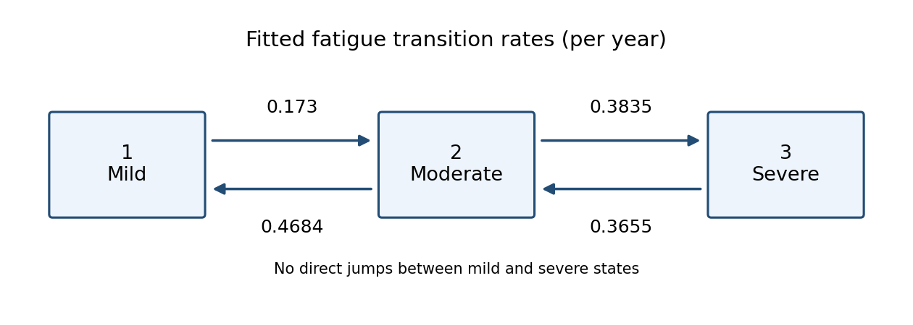

<h1 id="5/i/solution">Solution</h1>

↑ **Parent:** [I](../i.md)

The fitted [continuous-time multi-state model](../../../../../../continuous-time-multi-state-model.md) allows only adjacent fatigue-state jumps. Its four [transition intensities](../../../../../../transition-intensity.md), in reciprocal years, are shown here:

**[Figure 1](#5/i/image-estimated-fatigue-transition-intensities-mild-to-moderate-0-173-moderate-to-mild-0-4684-moderate-to-severe-0-3835-and-severe-to-moderate-0-3655-per-year). Estimated fatigue transition intensities: mild to moderate 0.173, moderate to mild 0.4684, moderate to severe 0.3835, and severe to moderate 0.3655 per year**.

In state $2$, the total exit intensity is $\lambda_2=q_{21}+q_{23}=0.4684+0.3835=0.8519$. By the [holding time](../../../../../../holding-time.md) law for a [continuous-time Markov chain](../../../../../../continuous-time-markov-chain.md), the time until the next jump has an [exponential distribution](../../../../../../exponential-distribution.md) with this rate. Therefore

$$
\boxed{\widehat{\mathbb E}T_2=\frac1{0.8519}=1.17385\text{ years}.}
$$

The printed interval for $q_{22}=-\lambda_2$ gives the interval $(0.7219,1.005)$ for $\lambda_2$. Taking reciprocals reverses the endpoints, so the transformed $95\%$ [confidence interval](../../../../../../confidence-interval.md) for the mean [holding time](../../../../../../holding-time.md) is

$$
\boxed{\left(\frac1{1.005},\frac1{0.7219}\right)=(0.9950,1.3852)\text{ years}.}
$$

For the next jump's destination, competing outgoing intensities give

$$
\boxed{\Pr\{2\to1\mid\text{a jump out of }2\}=\frac{q_{21}}{q_{21}+q_{23}}=\frac{0.4684}{0.8519}=0.54983.}
$$

Indeed the density of a first jump to $1$ at time $t$ is $q_{21}e^{-\lambda_2t}$; integrating gives the ratio above. This is a conditional next-jump probability, not a [transition probability](../../../../../../transition-probability.md) of being mild at a fixed later visit.

## ↑ Ancestors (11)

1. [I](../i.md)
2. [5](../../5.md)
3. [Paper 38](../../../paper-38-split.md)
4. [Iii](../../../split.md)
5. [2009](../../../../split.md)
6. [Past exam of the mathematics course of the University of Cambridge](../../../../../split.md)
7. [Mathematics course of the University of Cambridge](../../../../../../mathematics-course-of-the-university-of-cambridge.md)
8. [Course of the University of Cambridge](../../../../../../course-of-the-university-of-cambridge.md)
9. [University of Cambridge](../../../../../../university-of-cambridge-split.md)
10. [List of universities](../../../../../../list-of-universities.md)
11. [Codex Wiki](../../../../../../split.md)
