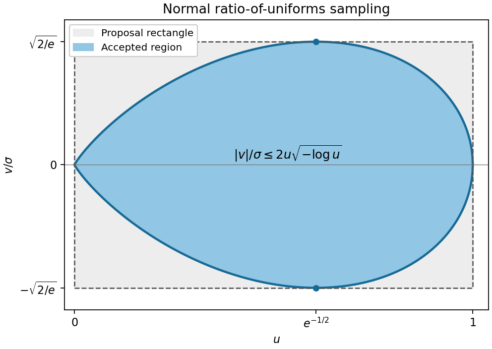

<h1 id="3/c/solution">Solution</h1>

↑ **Parent:** [C](../c.md)

For $\sigma>0$, use the unnormalized [normal density](../../../../../../normal-density.md) $h(x)=e^{-x^2/(2\sigma^2)}$. Its ratio region is

$$
0<u\le1,\qquad |v|\le2\sigma u\sqrt{-\log u}.
$$

The bound on $u$ is one because $h$ is maximized at zero. To bound $|v|$, maximize $x\sqrt{h(x)}=xe^{-x^2/(4\sigma^2)}$ for $x\ge0$. Its derivative vanishes at $x=\sqrt2\sigma$, giving $b=\sigma\sqrt{2/e}$. Thus the [normal ratio-of-uniforms envelope](../../../../../../normal-ratio-of-uniforms-envelope.md) is $0<u<1$, $-b<v<b$.

Draw [independent](../../../../../../independent-random-variables.md) $U_1,U_2\sim\operatorname{Unif}(0,1)$, set $u=U_1$ and $v=b(2U_2-1)$, and accept precisely when

$$
u^2\le\exp\left(-\frac{v^2}{2\sigma^2u^2}\right),
$$

returning $X=v/u$. Equivalently compare logarithms to avoid underflow. Since $Z=\sigma\sqrt{2\pi}$, the region area is $\sigma\sqrt{\pi/2}$ and the rectangle area is $2\sigma\sqrt{2/e}$. Therefore

$$
\boxed{r=\frac{\sqrt{\pi e}}4\approx0.7306.}
$$

It is [independent](../../../../../../independent-random-variables.md) of the normal scale. In the diagram the vertical coordinate is normalized by $\sigma$, so the same shape works for every positive scale.

**[Figure 1](#3/c/image-normal-ratio-of-uniforms-region-and-its-minimum-axis-aligned-rejection-rectangle). Normal ratio-of-uniforms region and its minimum axis-aligned rejection rectangle**.

## ↑ Ancestors (11)

1. [C](../c.md)
2. [3](../../3.md)
3. [Paper 40](../../../paper-40-split.md)
4. [Iii](../../../split.md)
5. [2009](../../../../split.md)
6. [Past exam of the mathematics course of the University of Cambridge](../../../../../split.md)
7. [Mathematics course of the University of Cambridge](../../../../../../mathematics-course-of-the-university-of-cambridge.md)
8. [Course of the University of Cambridge](../../../../../../course-of-the-university-of-cambridge.md)
9. [University of Cambridge](../../../../../../university-of-cambridge-split.md)
10. [List of universities](../../../../../../list-of-universities.md)
11. [Codex Wiki](../../../../../../split.md)
