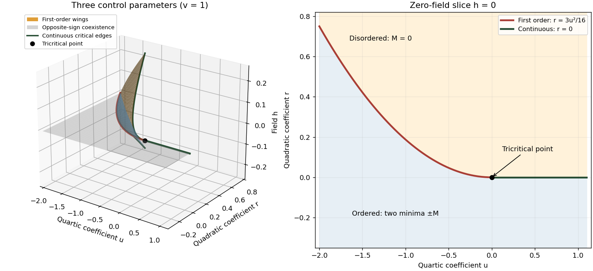

<h1 id="1/solution">Solution</h1>

↑ **Parent:** [1](../1.md)

A [phase diagram](../../../../../phase-diagram.md) partitions a space of control parameters into regions with distinct equilibrium phases. Its boundaries mark nonanalyticities of the thermodynamic-limit [free energy](../../../../../thermodynamic-free-energy.md); a [first-order phase transition](../../../../../first-order-phase-transition.md) has a jump in a first derivative, whereas a [continuous phase transition](../../../../../continuous-phase-transition.md) has a continuously vanishing [order parameter](../../../../../order-parameter.md) and singular fluctuations.

An explicit three-parameter example is the scalar [Landau free energy](../../../../../landau-free-energy.md)

$$
V(M;r,u,h)=\frac r2M^2+\frac u4M^4+\frac v6M^6-hM,\qquad v>0,
$$

with parameter axes $(r,u,h)$. These can be realized locally by the temperature, single-ion anisotropy and magnetic field of the [Blume–Capel model](../../../../../blume-capel-model.md). The three dimensions here refer to control-parameter space, not necessarily to three spatial dimensions. At $h=0$, minimizing this potential gives a [continuous phase transition](../../../../../continuous-phase-transition.md) at $r=0$ for $u>0$. For $u<0$, coexistence occurs at $r=3u^2/(16v)$, where

$$
V(M)=\frac v6M^2\left(M^2+\frac{3u}{4v}\right)^2.
$$

There are three [global minima](../../../../../global-minimum.md), $M=0$ and $M=\pm\sqrt{-3u/(4v)}$. Their [order parameter](../../../../../order-parameter.md) jump decreases to zero as $u\uparrow0$. Thus **$(r,u,h)=(0,0,0)$ is a tricritical point.** The two transition curves in the $h=0$ plane meet there.

In the three-dimensional [phase diagram](../../../../../phase-diagram.md), crossing $h=0$ inside the ordered region switches between opposite signs of $M$, so that region is itself a [first-order phase transition](../../../../../first-order-phase-transition.md) sheet. For $u<0$, two [tricritical wings](../../../../../tricritical-wing.md) at opposite nonzero fields separate weakly and strongly magnetized phases. Their [wing critical edges](../../../../../tricritical-wing-critical-edge.md) can be obtained rather than merely sketched: require $V'=V''=V'''=0$. Since $V'''=6uM+20vM^3$, the nonzero solutions satisfy

$$
M_c^2=-\frac{3u}{10v},\qquad r_c=\frac{9u^2}{20v},\qquad h_c=\frac{6u^2M_c}{25v}.
$$

The fourth derivative there is $-12u>0$, giving ordinary continuous critical endpoints. The wings meet the zero-field coexistence sheet along the [tricritical three-phase line](../../../../../tricritical-three-phase-line.md) and terminate at these edges. Their exact [tricritical wing coexistence factorization](../../../../../tricritical-wing-coexistence-factorization.md) supplies the surfaces in the figure: for two nonnegative minima $a\leq b$, set $s=a+b$, $p=ab$ and

$$
u=\frac{2v}{3}(-2s^2+3p),\quad r=\frac v3(s^4-s^2p+3p^2),\quad h=\frac v3s^3p.
$$

Direct expansion gives $V(M)-V(a)=(v/6)(M-a)^2(M-b)^2[(M+s)^2+p]\geq0$, proving that these surfaces describe coexistence of global, not merely local, minima.

**[Figure 1](#1/image-tricritical-phase-diagram-of-the-sextic-scalar-free-energy-first-order-sheets-critical-edges-and-the-zero-field-slice). Tricritical phase diagram of the sextic scalar free energy: first-order sheets, critical edges and the zero-field slice**.

For the unheaded [Ising model](../../../../../ising-model.md) calculation, assume ferromagnetic exchange $J>0$ and let $M$ denote the mean [Ising spin](../../../../../ising-spin-variable.md). On the hypercubic lattice the [coordination number of a lattice](../../../../../coordination-number-of-a-lattice.md) is $z=2D$, even though the original positive-direction bond sum counts each bond only once. The [mean-field approximation](../../../../../mean-field-approximation.md) neglects products of deviations from $M$:

$$
\sigma_i\sigma_j\simeq M\sigma_i+M\sigma_j-M^2.
$$

There are $ND$ bonds, so the approximate energy is $H_{\rm MF}=-2DJM\sum_i\sigma_i+NDJM^2$. Each independent [Ising spin](../../../../../ising-spin-variable.md) therefore sees the effective field $2DJM$. With $\beta_{\rm th}=1/(k_BT)$, averaging its two Boltzmann weights gives the [self-consistency equation](../../../../../self-consistency-equation.md)

$$
\boxed{M=\frac{e^{2\beta_{\rm th}DJM}-e^{-2\beta_{\rm th}DJM}}{e^{2\beta_{\rm th}DJM}+e^{-2\beta_{\rm th}DJM}}
=\tanh\left(\frac{2DJM}{k_BT}\right).}
$$

The slope of its right side at zero is $T_c/T$, where

$$
\boxed{T_c=\frac{2DJ}{k_B}.}
$$

Above $T_c$, $\tanh x<x$ for $x>0$ excludes a nonzero solution. Below $T_c$ the initial slope exceeds one, and concavity of the hyperbolic tangent on the positive axis gives one positive solution and its negative partner. The [Ising auxiliary mean-field free energy](../../../../../ising-auxiliary-mean-field-free-energy.md) $DJM^2-k_BT\log[2\cosh(2\beta_{\rm th}DJM)]$ has positive quartic coefficient near $T_c$, while its quadratic coefficient changes sign there. Its stable minima therefore move continuously away from zero; this is a [continuous phase transition](../../../../../continuous-phase-transition.md) in the [mean-field theory of the Ising model](../../../../../mean-field-theory-of-the-ising-model.md).

Put $\tau=(T_c-T)/T_c>0$ and $c=T_c/T=(1-\tau)^{-1}$. The [Taylor expansion](../../../../../taylor-expansion.md) $\tanh x=x-x^3/3+O(x^5)$ gives, on the nonzero branch,

$$
0=c-1-\frac{c^3}{3}M^2+O(M^4),\qquad
M^2=\frac{3(c-1)}{c^3}+O((c-1)^2)=3\tau+O(\tau^2).
$$

Consequently **$M\sim\sqrt{3}\,\tau^{1/2}$ and the mean-field order-parameter exponent is $\beta=1/2$.** The inverse-temperature symbol $\beta_{\rm th}$ used above is distinct from this [order-parameter critical exponent](../../../../../order-parameter-critical-exponent.md).

## ↑ Ancestors (10)

1. [1](../1.md)
2. [Paper 43](../../paper-43-split.md)
3. [Iii](../../split.md)
4. [2009](../../../split.md)
5. [Past exam of the mathematics course of the University of Cambridge](../../../../split.md)
6. [Mathematics course of the University of Cambridge](../../../../../mathematics-course-of-the-university-of-cambridge.md)
7. [Course of the University of Cambridge](../../../../../course-of-the-university-of-cambridge.md)
8. [University of Cambridge](../../../../../university-of-cambridge-split.md)
9. [List of universities](../../../../../list-of-universities.md)
10. [Codex Wiki](../../../../../split.md)
