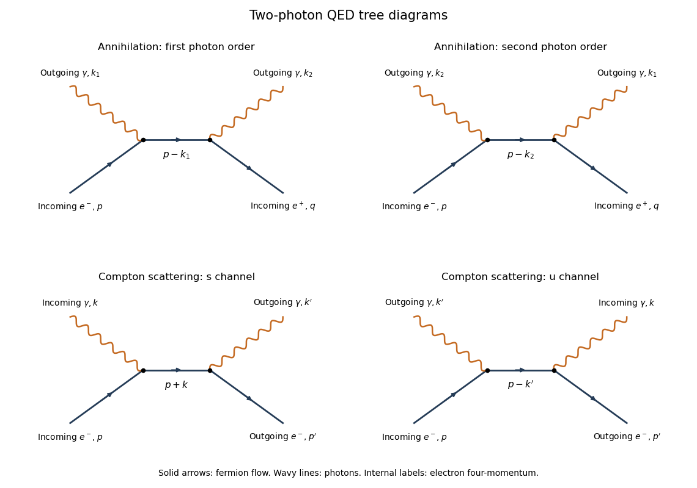

# Paper 44

↑ **Parent:** [Iii](../iii.md)

[https://www.maths.cam.ac.uk/postgrad/part-iii/files/pastpapers/2009/Paper44.pdf](https://www.maths.cam.ac.uk/postgrad/part-iii/files/pastpapers/2009/Paper44.pdf)

**Table of contents**

- [1](#1)
  - [Solution](#1/solution)
- [2](#2)
  - [Solution](#2/solution)
- [3](#3)
  - [Solution](#3/solution)
- [4](#4)
  - [Solution](#4/solution)

## 1

↑ **Parent:** [Paper 44](paper-44.md)

<h3 id="1/solution">Solution</h3>

↑ **Parent:** [1](#1)

Use natural units $\hbar=c=1$ and the [Minkowski metric](../../../special-relativity.md#minkowski-metric) $g=\operatorname{diag}(1,-1,-1,-1)$. The [canonical momentum](../../../classical-mechanics.md#canonical-momentum) is $\pi=\partial\mathcal L/\partial\dot\phi=\dot\phi$, and the [Legendre transform in mechanics](../../../classical-mechanics.md#legendre-transform-in-mechanics) gives

$$
H=\frac12\int d^3x\,[\pi^2+(\nabla\phi)^2+m^2\phi^2].
$$

For [canonical quantization of a real scalar field](../../../scalar-field-theory.md#canonical-quantization-of-a-real-scalar-field), impose the equal-time [canonical commutation relations](../../../quantum-mechanics.md#canonical-commutation-relation)

$$
[\phi(t,\mathbf x),\pi(t,\mathbf y)]=i\delta^3(\mathbf x-\mathbf y),\qquad
[\phi(t,\mathbf x),\phi(t,\mathbf y)]=[\pi(t,\mathbf x),\pi(t,\mathbf y)]=0.
$$

The [Heisenberg picture](../../../quantum-mechanics.md#heisenberg-picture) equation $\dot O=i[H,O]$ then gives $\dot\phi=\pi$. For the other equation, the momentum term commutes with $\pi$; commuting the gradient term past $\pi$ and integrating the derivative of the [Dirac delta function](../../../distribution-theory.md#dirac-delta-function) by parts gives $\dot\pi=\nabla^2\phi-m^2\phi$. Consequently

$$
\boxed{(\Box+m^2)\phi=0,\qquad\Box=\partial_t^2-\nabla^2.}
$$

The [Fourier transform](../../../analysis.md#fourier-transform) reduces this [Klein-Gordon equation](../../../wave-equation.md#klein-gordon-equation) to oscillators of frequency $E_{\mathbf p}=\sqrt{\mathbf p^2+m^2}$. Hermiticity of the [real scalar field](../../../scalar-field-theory.md#real-scalar-field) pairs their positive- and negative-frequency coefficients, so its general mode expansion can be normalized as

$$
\phi(x)=\int\frac{d^3p}{(2\pi)^3\sqrt{2E_{\mathbf p}}}
[a(\mathbf p)e^{-ip\cdot x}+a^\dagger(\mathbf p)e^{ip\cdot x}],\qquad p^0=E_{\mathbf p}.
$$

To verify its normalization rather than guess the oscillator algebra, use [scalar field oscillator inversion](../../../scalar-field-theory.md#scalar-field-oscillator-inversion) at $t=0$:

$$
a(\mathbf p)=\int d^3x\,e^{-i\mathbf p\cdot\mathbf x}
\left[\sqrt{E_{\mathbf p}/2}\,\phi(0,\mathbf x)+\frac{i}{\sqrt{2E_{\mathbf p}}}\pi(0,\mathbf x)\right].
$$

Its adjoint has the conjugate phase and the opposite sign in front of $i\pi$. The two mixed field-momentum [commutators](../../../lie-algebra.md#commutator) give

$$
[a(\mathbf p),a^\dagger(\mathbf q)]
=\frac{E_{\mathbf p}+E_{\mathbf q}}{2\sqrt{E_{\mathbf p}E_{\mathbf q}}}
\int d^3x\,e^{i(\mathbf q-\mathbf p)\cdot\mathbf x}
=\boxed{(2\pi)^3\delta^3(\mathbf p-\mathbf q)}.
$$

The [Fourier representation of the Dirac delta function](../../../distribution-theory.md#fourier-representation-of-the-dirac-delta-function) sets the energies equal in the last step. Similarly, $[a(\mathbf p),a(\mathbf q)]$ has a factor $E_{\mathbf q}-E_{\mathbf p}$ multiplying $\delta^3(\mathbf p+\mathbf q)$ and vanishes; the two-creator commutator vanishes as well.

Substituting the expansion in $H$ and integrating the spatial phases, the two-annihilator and two-creator coefficients cancel by $E_{\mathbf p}^2=\mathbf p^2+m^2$. The [free real scalar Hamiltonian in oscillator variables](../../../scalar-field-theory.md#free-real-scalar-hamiltonian-in-oscillator-variables) is

$$
H=\frac12\int\frac{d^3p}{(2\pi)^3}E_{\mathbf p}
[a^\dagger(\mathbf p)a(\mathbf p)+a(\mathbf p)a^\dagger(\mathbf p)].
$$

It differs from $:H:=\int d^3p\,E_{\mathbf p}a^\dagger a/(2\pi)^3$ by its constant [vacuum energy](../../../perturbative-quantum-field-theory.md#vacuum-energy); [normal ordering](../../../perturbative-quantum-field-theory.md#normal-ordering) removes that constant. Using the oscillator commutators, for either Hamiltonian,

$$
\boxed{[H,a(\mathbf p)]=-E_{\mathbf p}a(\mathbf p),\qquad
[H,a^\dagger(\mathbf p)]=E_{\mathbf p}a^\dagger(\mathbf p).}
$$

Choose the [Fock vacuum](../../../quantum-field-theory.md#fock-vacuum) annihilated by every $a(\mathbf p)$. Each [creation operator](../../../quantum-mechanics.md#creation-operator) adds a particle of energy $E_{\mathbf p}$ and momentum $\mathbf p$; its [annihilation operator](../../../quantum-mechanics.md#annihilation-operator) removes one. Their mutual commutativity gives [bosonic Fock space](../../../quantum-field-theory.md#bosonic-fock-space) and symmetric many-particle states. Thus the scalar mass-shell frequency has a particle interpretation, rather than merely describing a classical oscillation.

For $t=x^0-y^0$ and $\mathbf r=\mathbf x-\mathbf y$, vacuum contraction and [time ordering](../../../perturbative-quantum-field-theory.md#time-ordering) give the [Feynman propagator](../../../quantum-field-theory.md#feynman-propagator)

$$
D_F(t,\mathbf r)=\int\frac{d^3p}{(2\pi)^3}\frac{e^{i\mathbf p\cdot\mathbf r}}{2E_{\mathbf p}}
[\theta(t)e^{-iE_{\mathbf p}t}+\theta(-t)e^{iE_{\mathbf p}t}].
$$

In the [scalar Feynman propagator pole prescription](../../../quantum-field-theory.md#scalar-feynman-propagator-pole-prescription), the integral of $i e^{-ip^0t}/((p^0)^2-E_{\mathbf p}^2+i0)$ has poles at $E_{\mathbf p}-i0$ and $-E_{\mathbf p}+i0$. Close clockwise below for $t>0$ and counterclockwise above for $t<0$. The [residue theorem](../../../analysis.md#residue-theorem) gives exactly the corresponding term above, proving

$$
\boxed{D_F(x-y)=\int\frac{d^4p}{(2\pi)^4}\frac{i\,e^{-ip\cdot(x-y)}}{p^2-m^2+i0}.}
$$

As a direct check of the distributional source, $g_E(t)=e^{-iE|t|}/(2E)$ is continuous, but $g'_E(0^+)-g'_E(0^-)=-i$. The [derivative jump of a free scalar time-ordered two-point function](../../../quantum-field-theory.md#derivative-jump-of-a-free-scalar-time-ordered-two-point-function) therefore gives $(\partial_t^2+E^2)g_E=-i\delta(t)$. Spatial Fourier inversion yields

$$
\boxed{(\Box+m^2)D_F(x-y)=-i\delta^4(x-y).}
$$

## 2

↑ **Parent:** [Paper 44](paper-44.md)

<h3 id="2/solution">Solution</h3>

↑ **Parent:** [2](#2)

The supplied matrices are the [chiral gamma-matrix representation](../../../algebra.md#chiral-gamma-matrix-representation). The [Pauli matrix multiplication law](../../../algebra.md#pauli-matrix-multiplication-law) implies $\{\sigma^i,\sigma^j\}=2\delta^{ij}I_2$. Block multiplication gives $(\gamma^0)^2=I_4$, $\{\gamma^0,\gamma^i\}=0$, and $\{\gamma^i,\gamma^j\}=-2\delta^{ij}I_4$. Hence their [Clifford algebra](../../../algebra.md#clifford-algebra) relation is

$$
\boxed{\{\gamma^\mu,\gamma^\nu\}=2g^{\mu\nu}I_4.}
$$

Since partial derivatives commute, multiplying the [Dirac equation](../../../relativistic-quantum-field.md#dirac-equation) by $i\gamma^\nu\partial_\nu+m$ gives

$$
0=(i\gamma^\nu\partial_\nu+m)(i\gamma^\mu\partial_\mu-m)\psi
=-(g^{\mu\nu}\partial_\mu\partial_\nu+m^2)\psi.
$$

Thus every component of the [Dirac spinor](../../../relativistic-quantum-field.md#dirac-spinor) satisfies $\boxed{(\Box+m^2)\psi=0}$, the [Klein-Gordon equation](../../../wave-equation.md#klein-gordon-equation) with the same mass.

For a [Lorentz transformation](../../../special-relativity.md#lorentz-transformation) $x'=\Lambda x$, set $\psi'(x')=S(\Lambda)\psi(x)$. The derivative transforms as $\partial'_\mu=(\Lambda^{-1})^\nu{}_{\mu}\partial_\nu$. With the given spinor-matrix identity,

$$
S^{-1}(i\gamma^\mu\partial'_\mu-m)\psi'
=[i\Lambda^\mu{}_{\rho}\gamma^\rho(\Lambda^{-1})^\nu{}_{\mu}\partial_\nu-m]\psi
=(i\gamma^\nu\partial_\nu-m)\psi=0.
$$

This proves the [Lorentz covariance of the Dirac operator](../../../relativistic-quantum-field.md#lorentz-covariance-of-the-dirac-operator) explicitly.

For [parity](../../../quantum-mechanics.md#parity), let $x_P=(x^0,-\mathbf x)$ and $\psi_P(x)=\gamma^0\psi(x_P)$. Spatial differentiation brings a minus sign, which is canceled by $\gamma^i\gamma^0=-\gamma^0\gamma^i$. Therefore

$$
(i\gamma^\mu\partial_\mu-m)\psi_P(x)
=\gamma^0[(i\gamma^\mu\partial_\mu-m)\psi](x_P)=0.
$$

Since $\gamma^0$ is Hermitian and squares to one, the [Dirac adjoint](../../../relativistic-quantum-field.md#dirac-adjoint) transforms as

$$
\boxed{\bar\psi_P(x)=\bar\psi(x_P)\gamma^0.}
$$

The [chirality matrix](../../../algebra.md#chirality-matrix) $\gamma^5=i\gamma^0\gamma^1\gamma^2\gamma^3$ anticommutes with $\gamma^0$. The [parity transformation of a Dirac bilinear](../../../quantum-field-theory.md#parity-transformation-of-a-dirac-bilinear) consequently gives

$$
\boxed{\bar\psi_P\psi_P(x)=\bar\psi\psi(x_P),\qquad
\bar\psi_P\gamma^5\psi_P(x)=-\bar\psi\gamma^5\psi(x_P).}
$$

The first bilinear is a [Lorentz scalar](../../../special-relativity.md#lorentz-scalar) even under [parity](../../../quantum-mechanics.md#parity), and the second is a [pseudoscalar](../../../quantum-mechanics.md#pseudoscalar).

In this representation, $\gamma^5=\operatorname{diag}(-I_2,I_2)$. Its square is one, so the [chiral projectors](../../../relativistic-quantum-field.md#chiral-projector) $P_\pm=(1\pm\gamma^5)/2$ are idempotent, mutually orthogonal and sum to the identity. They select $\psi_L=P_-\psi$ and $\psi_R=P_+\psi$, the two [Weyl spinors](../../../relativistic-quantum-field.md#weyl-spinor). Because $\gamma^\mu P_\pm=P_\mp\gamma^\mu$, a solution of the [massless Dirac equation](../../../relativistic-quantum-field.md#massless-dirac-equation) has each chiral component solving that equation separately. In two-component form,

$$
i(\partial_t-\boldsymbol\sigma\cdot\nabla)\psi_L=0,\qquad
i(\partial_t+\boldsymbol\sigma\cdot\nabla)\psi_R=0.
$$

The two [chirality](../../../relativistic-quantum-field.md#chirality-physics) sectors are thus independent under massless propagation and proper [Lorentz transformations](../../../special-relativity.md#lorentz-transformation). A nonzero [Dirac mass term](../../../relativistic-quantum-field.md#dirac-mass-term) couples them, while [parity](../../../quantum-mechanics.md#parity) exchanges them. This explains why the projectors are particularly useful in the massless theory.

## 3

↑ **Parent:** [Paper 44](paper-44.md)

<h3 id="3/solution">Solution</h3>

↑ **Parent:** [3](#3)

The interaction contains no time derivatives, so $\pi=\dot\phi$. The [Legendre transform in mechanics](../../../classical-mechanics.md#legendre-transform-in-mechanics) gives

$$
\mathcal H=\pi\dot\phi-\mathcal L
=\frac12\pi^2+\frac12(\nabla\phi)^2+\frac12m^2\phi^2+\frac{\lambda}{4!}\phi^4.
$$

Thus

$$
\boxed{\mathcal H_0=\tfrac12\pi^2+\tfrac12(\nabla\phi)^2+\tfrac12m^2\phi^2,
\qquad\mathcal H_I=\frac{\lambda}{4!}\phi^4,\qquad H=H_0+H_I.}
$$

Here $H_0=\int\mathcal H_0$ is the free [Hamiltonian operator](../../../quantum-mechanics.md#hamiltonian-quantum-mechanics) of mass $m$, and $H_I=\int\mathcal H_I$ is the [interaction Hamiltonian](../../../quantum-field-theory.md#interaction-hamiltonian).

In the [interaction picture](../../../quantum-mechanics.md#interaction-picture), operators evolve with $H_0$ and the states with $H_I(t)=e^{iH_0t}H_Ie^{-iH_0t}$. With $U_I(t_0,t_0)=I$, the state evolution satisfies $i\partial_tU_I(t,t_0)=H_I(t)U_I(t,t_0)$. Integrating once and iterating gives the [Dyson series](../../../perturbative-quantum-field-theory.md#dyson-series)

$$
U_I(t,t_0)=I+\sum_{r\ge1}(-i)^r\int_{t_0<t_r<\cdots<t_1<t}dt_1\cdots dt_r\,
H_I(t_1)\cdots H_I(t_r).
$$

Equivalently it is the [time ordering](../../../perturbative-quantum-field-theory.md#time-ordering) of the exponential. Taking the infinite-time scattering limit, with adiabatic switching understood, gives the [scattering matrix](../../../quantum-mechanics.md#s-matrix)

$$
\boxed{S=T\exp\!\left[-i\int d^4x\,\mathcal H_I(\phi_I(x))\right].}
$$

The field in the interaction is the free interaction-picture field, which is essential for applying the free-field contractions.

Use [relativistic normalization of a one-particle state](../../../quantum-field-theory.md#relativistic-normalization-of-a-one-particle-state), $|\mathbf p\rangle=\sqrt{2E_{\mathbf p}}a^\dagger(\mathbf p)|0\rangle$, so each external scalar contraction contributes its plane-wave phase without an extra $1/\sqrt{2E}$ factor. For the connected on-shell two-to-two [scattering amplitude](../../../quantum-mechanics.md#scattering-amplitude), the first [Dyson series](../../../perturbative-quantum-field-theory.md#dyson-series) term is $-i\lambda\int d^4x\,\phi_I(x)^4/4!$. The [Wick theorem](../../../perturbative-quantum-field-theory.md#wick-s-theorem) gives $4!$ ways to attach the two incoming and two outgoing external particles to the four fields, canceling the denominator. Consequently

$$
\langle p_3,p_4|(S-I)|p_1,p_2\rangle_{\mathrm{connected}}
=-i\lambda\int d^4x\,e^{i(p_3+p_4-p_1-p_2)\cdot x}+O(\lambda^2)
=i(2\pi)^4\delta^4(p_3+p_4-p_1-p_2)\mathcal A,
$$

where

$$
\boxed{\mathcal A=-\lambda+O(\lambda^2).}
$$

The delta function expresses [four-momentum conservation](../../../special-relativity.md#four-momentum-conservation). The connected scattering convention removes spectator, vacuum and external self-energy contributions; equivalently at this order one can normal-order the interaction and keep the physical external mass fixed. These contributions should not be mistaken for additional connected four-point diagrams.

## 4

↑ **Parent:** [Paper 44](paper-44.md)

<h3 id="4/solution">Solution</h3>

↑ **Parent:** [4](#4)

Take incoming electron momentum $p$ and positron momentum $q$, with outgoing photon momenta $k_1,k_2$, so $p+q=k_1+k_2$. The leading [electron-positron annihilation into two photons](../../../perturbative-quantum-field-theory.md#electron-positron-annihilation-into-two-photons) has two [tree-level Feynman diagrams](../../../perturbative-quantum-field-theory.md#tree-level-feynman-diagram), differing by the order in which the two outgoing photons attach to the charged-fermion line.

**[Figure 1](#4/image-the-two-photon-orders-in-electron-positron-annihilation-and-the-s-and-u-channels-of-compton-scattering). The two photon orders in electron-positron annihilation and the s and u channels of Compton scattering**.

The arrows indicate [fermion flow](../../../perturbative-quantum-field-theory.md#fermion-flow). An incoming positron has the opposite flow direction to its physical momentum; the lower row uses an outgoing electron instead.

The required [QED Feynman rules](../../../perturbative-quantum-field-theory.md#qed-feynman-rules), with interaction $-e\bar\psi\gamma^\mu\psi A_\mu$, are a vertex $-ie\gamma^\mu$, a [Dirac propagator](../../../quantum-field-theory.md#dirac-propagator) $i(\not r+m)/(r^2-m^2+i0)$, an incoming electron spinor $u(p)$, an incoming positron adjoint $\bar v(q)$, and an outgoing photon polarization $\epsilon^*_\mu(k)$. Here [Feynman slash notation](../../../algebra.md#feynman-slash-notation) means $\not a=\gamma^\mu a_\mu$, and the external [Dirac equations](../../../relativistic-quantum-field.md#dirac-equation) are $(\not p-m)u(p)=0$ and $\bar v(q)(\not q+m)=0$.

Put $\mathcal S(r)=(\not r+m)/(r^2-m^2+i0)$, omitting only the propagator's overall factor $i$. Multiplying the two vertices and the propagator gives

$$
\boxed{\mathcal M=-e^2\bar v(q)\left[
\not\epsilon_2^*\mathcal S(p-k_1)\not\epsilon_1^*
+\not\epsilon_1^*\mathcal S(p-k_2)\not\epsilon_2^*
\right]u(p).}
$$

The diagrammatic expression is $i\mathcal M$. The relative sign is plus because the two photons are bosons; exchanging their attachments does not exchange external fermions. The amplitude is of order $e^2$.

A physical [photon polarization vector](../../../quantum-mechanics.md#photon-polarization-vector) obeys $k^2=0$ and $k\cdot\epsilon=0$, with the gauge equivalence $\epsilon\sim\epsilon+\alpha k$. One can choose a transverse representative with $\epsilon^0=0$ and normalize $\epsilon^*\cdot\epsilon=-1$. There are two physical transverse polarizations.

To prove the requested [two-photon fermion Ward identity](../../../perturbative-quantum-field-theory.md#two-photon-fermion-ward-identity), replace $\epsilon_1^*$ by $k_1$. Away from an internal pole, $\mathcal S(r)$ is the inverse of $\not r-m$, with the boundary prescription understood. The first term simplifies because

$$
\not k_1=(\not p-m)-(\not p-\not k_1-m),\qquad
\mathcal S(p-k_1)\not k_1u(p)=-u(p).
$$

For the second term, [four-momentum conservation](../../../special-relativity.md#four-momentum-conservation) gives $k_1=(p-k_2)+q$, so

$$
\bar v(q)\not k_1\mathcal S(p-k_2)
=\bar v(q)[(\not p-\not k_2-m)+(\not q+m)]\mathcal S(p-k_2)
=\bar v(q).
$$

The two contributions are therefore $-\bar v\not\epsilon_2^*u$ and $+\bar v\not\epsilon_2^*u$, which cancel. Interchanging the photon labels proves the other contraction vanishes. By linearity, **adding a multiple of either photon momentum to its polarization leaves the summed amplitude unchanged**. This is [gauge invariance](../../../relativistic-quantum-field.md#gauge-invariance): longitudinal gauge representatives do not describe an additional physical photon state. An individual diagram does not generally have this property.

For [Compton scattering](../../../physics.md#compton-scattering), let $p,k$ be incoming electron and photon momenta and $p',k'$ the outgoing ones. The diagrams in the lower row have intermediate electron momenta $p+k$ and $p-k'$ respectively. The same [QED Feynman rules](../../../perturbative-quantum-field-theory.md#qed-feynman-rules) give

$$
\boxed{\mathcal M_C=-e^2\bar u(p')\left[
\not\epsilon'^*\mathcal S(p+k)\not\epsilon
+\not\epsilon\mathcal S(p-k')\not\epsilon'^*
\right]u(p).}
$$

Their denominators are $(p+k)^2-m^2+i0$ and $(p-k')^2-m^2+i0$, the $s$- and $u$-channel denominators. In annihilation the two exchanged-electron channels instead carry $p-k_1$ and $p-k_2$. [Crossing symmetry](../../../quantum-mechanics.md#crossing-symmetry) relates the two expressions by moving the positron to an outgoing electron and one outgoing photon to an incoming photon, with the corresponding momentum and polarization replacements. There is no two-photon contact vertex for the minimally coupled Dirac electron. Both processes require the sum of the two photon orders to satisfy the [Ward identity](../../../perturbative-quantum-field-theory.md#ward-identity).

## ↑ Ancestors (8)

1. [Iii](../iii.md)
2. [2009](../../2009.md)
3. [Past exam of the mathematics course of the University of Cambridge](../../../past-exam-of-the-mathematics-course-of-the-university-of-cambridge.md)
4. [Mathematics course of the University of Cambridge](../../../university-of-cambridge.md#mathematics-course-of-the-university-of-cambridge)
5. [Course of the University of Cambridge](../../../university-of-cambridge.md#course-of-the-university-of-cambridge)
6. [University of Cambridge](../../../university-of-cambridge.md)
7. [List of universities](../../../README.md#list-of-universities)
8. [Codex Wiki](../../../README.md)
