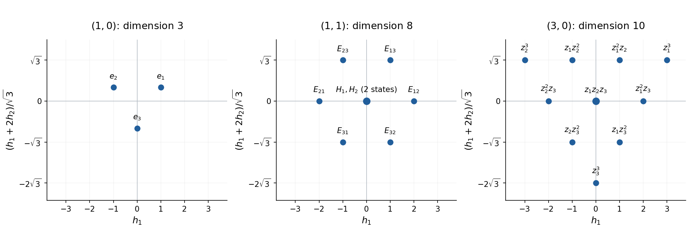

<h1 id="4/solution">Solution</h1>

↑ **Parent:** [4](../4.md)

Start with a nonzero [highest-weight vector](../../../../../highest-weight-vector.md) $v_0=|n\rangle$ and set $v_r=E_-^rv_0$. The [sl2 highest-weight lowering formula](../../../../../sl2-highest-weight-lowering-formula.md) follows inductively from the [commutator](../../../../../commutator.md) relations:

$$
Hv_r=(n-2r)v_r,\qquad E_+v_r=r(n-r+1)v_{r-1},\qquad E_-v_r=v_{r+1}.
$$

Indeed $[H,E_-]=-2E_-$ gives the weight formula, and $E_+E_-=E_-E_++H$ turns the coefficient $r(n-r+1)$ at step $r$ into $(r+1)(n-r)$ at step $r+1$. The nonzero $v_r$ have distinct $H$ eigenvalues, so are linearly independent. Finite dimensionality therefore forces a last nonzero vector $v_N$. Applying $E_+$ to $v_{N+1}=0$ gives $(N+1)(n-N)v_N=0$, hence $N=n$. This also proves that no earlier vector can vanish. Thus the cyclic [highest-weight representation](../../../../../highest-weight-representation.md) generated by $|n\rangle$ is

$$
\boxed{V_n=\operatorname{span}\{v_0,v_1,\ldots,v_n\},\qquad\dim V_n=n+1.}
$$

It is irreducible: spectral projections in $H$ select a weight vector from any nonzero invariant subspace, and its nonzero raising and lowering coefficients then generate the whole string. This gives the [classification of finite-dimensional sl2 representations](../../../../../classification-of-finite-dimensional-sl2-representations.md) used for each root direction below.

For the [SU(3) Lie algebra](../../../../../su-3-lie-algebra.md), the repeated-index relation is the trace constraint $\sum_iT^i{}_i=0$. The displayed generators are a basis of its complexification, not nine independent generators or three individually vanishing diagonal elements. Realize them by [matrix units](../../../../../matrix-unit.md) as $T^i{}_j=E_{ij}-\delta^i{}_jI/3$; the compact real algebra is obtained from anti-Hermitian combinations. Then

$$
H_1=\operatorname{diag}(1,-1,0),\qquad H_2=\operatorname{diag}(0,1,-1),
$$

and $E_{1+}=E_{12}$, $E_{1-}=E_{21}$, $E_{2+}=E_{23}$, $E_{2-}=E_{32}$. Substituting into the given commutators gives

$$
\begin{aligned}
[E_{1+},E_{1-}]&=T^1{}_1-T^2{}_2=H_1,&[H_1,E_{1\pm}]&=\pm2E_{1\pm},\\
[E_{2+},E_{2-}]&=T^2{}_2-T^3{}_3=H_2,&[H_2,E_{2\pm}]&=\pm2E_{2\pm}.
\end{aligned}
$$

Thus both root pairs obey the required [sl2 Lie algebra](../../../../../sl2-lie-algebra.md) relations. More generally, their [Cartan matrix](../../../../../cartan-matrix.md) is

$$
[H_i,E_{j\pm}]=\pm C_{ij}E_{j\pm},\qquad C=\begin{pmatrix}2&-1\\-1&2\end{pmatrix}.
$$

A [weight vector](../../../../../weight-vector.md) with eigenvalues $(h_1,h_2)$ moves by $(-2,1)$ under $E_{1-}$ and by $(1,-2)$ under $E_{2-}$. The third negative-root operator is $[E_{2-},E_{1-}]=E_{31}$ and moves it by $(-1,-1)$. In the required [weight diagram](../../../../../weight-diagram.md) coordinates

$$
x=h_1,\qquad y=\frac{h_1+2h_2}{\sqrt3},
$$

these moves are $(-2,0)$, $(1,-\sqrt3)$ and $(-1,-\sqrt3)$ respectively. Successive lowerings from a [highest-weight vector](../../../../../highest-weight-vector.md), with linear dependencies removed, construct the following bases.

For [Dynkin labels](../../../../../dynkin-label.md) $(1,0)$, use the defining action of [SU(3)](../../../../../su-3-group.md) on $\mathbb C^3$. Its highest vector is $e_1$; lowering gives $e_2=E_{21}e_1$ and $e_3=E_{32}e_2$. There are no further independent vectors. The [weight diagram of the defining SU(3) representation](../../../../../weight-diagram-of-the-defining-su-3-representation.md), in the present rescaled coordinates, is

$$
\begin{array}{c|c|c}
\text{basis}&(h_1,h_2)&(x,y)\\\hline
e_1&(1,0)&(1,1/\sqrt3)\\
e_2&(-1,1)&(-1,1/\sqrt3)\\
e_3&(0,-1)&(0,-2/\sqrt3)
\end{array}
$$

and $\boxed{\dim R(1,0)=3}$. Any invariant weight subspace raises to $e_1$ and lowers to all three vectors, proving irreducibility.

For $(1,1)$, use the [adjoint representation of SU(3)](../../../../../adjoint-representation-of-su-3.md) on traceless matrices, with $X$ acting by $Y\mapsto[X,Y]$. The highest vector is $E_{13}$: both $[E_{12},E_{13}]$ and $[E_{23},E_{13}]$ vanish, while $[H_i,E_{13}]=E_{13}$. Lowering gives $[E_{21},E_{13}]=E_{23}$ and $[E_{32},E_{13}]=-E_{12}$. Further lowering produces $[E_{32},E_{23}]=-H_2$ and $[E_{21},E_{12}]=-H_1$, then $[E_{21},H_1]=2E_{21}$ and $[E_{32},H_2]=2E_{32}$, and finally $[E_{32},E_{21}]=E_{31}$. Consequently the basis is the six off-diagonal matrix units together with $H_1,H_2$:

$$
\begin{array}{c|c|c}
\text{basis}&(h_1,h_2)&(x,y)\\\hline
E_{12}&(2,-1)&(2,0)\\
E_{21}&(-2,1)&(-2,0)\\
E_{23}&(-1,2)&(-1,\sqrt3)\\
E_{32}&(1,-2)&(1,-\sqrt3)\\
E_{13}&(1,1)&(1,\sqrt3)\\
E_{31}&(-1,-1)&(-1,-\sqrt3)\\
H_1,H_2&(0,0)&(0,0)
\end{array}
$$

The six nonzero weights have [weight multiplicity](../../../../../weight-multiplicity.md) one, and zero has multiplicity two. Thus $\boxed{\dim R(1,1)=6+2=8}$. Its irreducibility follows also because an adjoint-invariant subspace is an ideal and $\mathfrak{sl}_3(\mathbb C)$ is a [simple Lie algebra](../../../../../simple-lie-algebra.md).

For $(3,0)$, take the [symmetric cubic representation of SU(3)](../../../../../symmetric-cubic-representation-of-su-3.md), $\operatorname{Sym}^3\mathbb C^3$, realized by homogeneous degree-three polynomials. Here

$$
T^i{}_j=z_i\partial_{z_j}-\frac{\delta^i{}_j}{3}N,\qquad
N=\sum_kz_k\partial_{z_k},
$$

so $z_1^3$ is a [highest-weight vector](../../../../../highest-weight-vector.md) with eigenvalues $(3,0)$. For $a+b+c=3$,

$$
E_{2-}^{\,c}E_{1-}^{\,b+c}z_1^3
=\frac{3!}{a!}\frac{(b+c)!}{b!}\,z_1^az_2^bz_3^c,
$$

which is nonzero and constructs every monomial. These monomials form a basis and have distinct weights $(a-b,b-c)$. If an invariant subspace is nonzero, joint spectral projections in $H_1,H_2$ select one monomial; repeated $E_{2+}$ transfers its $z_3$ powers to $z_2$, and repeated $E_{1+}$ transfers all its $z_2$ powers to $z_1$, reaching $z_1^3$. Lowering then generates the whole basis, proving irreducibility without merely assuming the dimension formula. The plotted weights are

$$
\begin{array}{c|c|c}
c&y=(a+b-2c)/\sqrt3&\text{allowed }x=a-b\\\hline
0&\sqrt3&-3,-1,1,3\\
1&0&-2,0,2\\
2&-\sqrt3&-1,1\\
3&-2\sqrt3&0
\end{array}
$$

with multiplicity one at every point. Hence $\boxed{\dim R(3,0)=\binom{5}{2}=10}$.

**[Figure 1](#4/image-su-3-weights-in-the-three-requested-representations-with-the-two-independent-zero-weight-octet-states-marked). SU(3) weights in the three requested representations, with the two independent zero-weight octet states marked**.

For approximate [flavor symmetry](../../../../../flavor-symmetry.md), identify $e_1,e_2,e_3$ with the [up quark](../../../../../up-quark.md), [down quark](../../../../../down-quark.md) and [strange quark](../../../../../strange-quark.md). The defining representation is their flavour triplet. The [baryon octet](../../../../../baryon-octet.md) realizes $R(1,1)$ and contains the spin-$1/2$ nucleons and the $\Lambda,\Sigma,\Xi$ multiplets; its central double weight distinguishes $\Lambda$ and $\Sigma^0$. The [baryon decuplet](../../../../../baryon-decuplet.md) realizes the symmetric flavour representation $R(3,0)$, containing the spin-$3/2$ $\Delta,\Sigma^*,\Xi^*,\Omega$ multiplets. In standard [isospin](../../../../../isospin.md) and [flavor hypercharge](../../../../../flavor-hypercharge.md) normalization, $I_3=h_1/2$ and $Y=(h_1+2h_2)/3$, so these plots use $x=2I_3$ and $y=\sqrt3Y$. Three-quark spin and flavour combine subject to the [Pauli constraint on three-quark flavour multiplets](../../../../../pauli-constraint-on-three-quark-flavour-multiplets.md) and the antisymmetric [three-quark colour singlet](../../../../../three-quark-colour-singlet.md). The adjoint flavour representation also describes a meson octet. A distinct, exact colour [SU(3)](../../../../../su-3-group.md) gauge symmetry places [quarks](../../../../../quark.md) in its defining representation and [gluons](../../../../../gluon.md) in its adjoint octet; colour and flavour here are different physical group actions.

## ↑ Ancestors (10)

1. [4](../4.md)
2. [Paper 45](../../paper-45-split.md)
3. [Iii](../../split.md)
4. [2009](../../../split.md)
5. [Past exam of the mathematics course of the University of Cambridge](../../../../split.md)
6. [Mathematics course of the University of Cambridge](../../../../../mathematics-course-of-the-university-of-cambridge.md)
7. [Course of the University of Cambridge](../../../../../course-of-the-university-of-cambridge.md)
8. [University of Cambridge](../../../../../university-of-cambridge-split.md)
9. [List of universities](../../../../../list-of-universities.md)
10. [Codex Wiki](../../../../../split.md)
