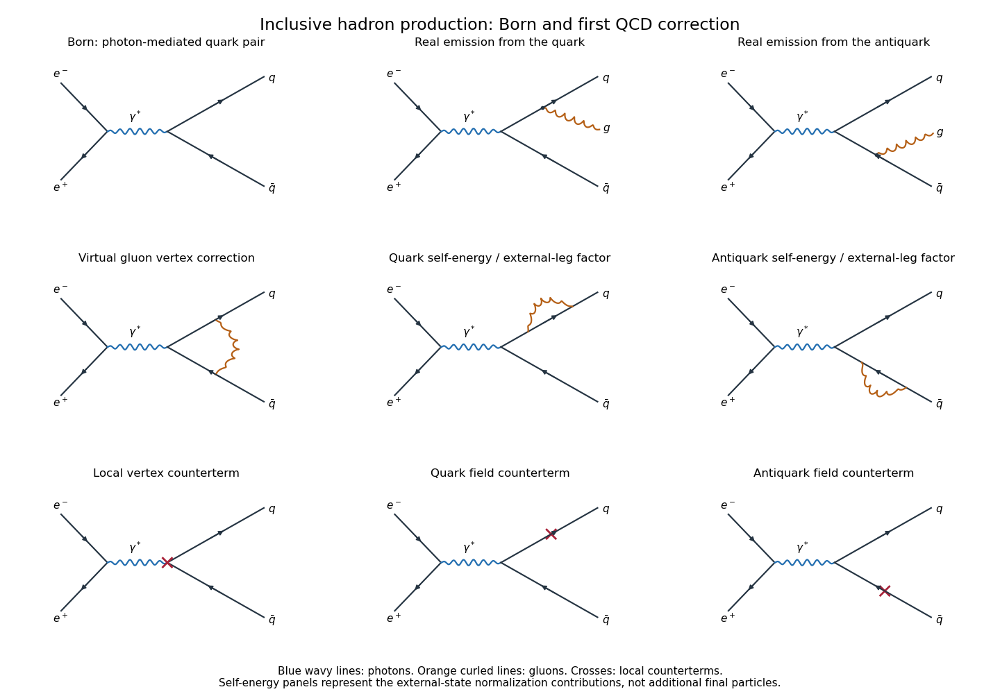

# Paper 47

↑ **Parent:** [Iii](../iii.md)

[https://www.maths.cam.ac.uk/postgrad/part-iii/files/pastpapers/2009/Paper47.pdf](https://www.maths.cam.ac.uk/postgrad/part-iii/files/pastpapers/2009/Paper47.pdf)

**Table of contents**

- [1](#1)
  - [Solution](#1/solution)
- [2](#2)
  - [Solution](#2/solution)
- [3](#3)
  - [Solution](#3/solution)
- [4](#4)
  - [a](#4/a)
    - [Solution](#4/a/solution)
  - [b](#4/b)
    - [Solution](#4/b/solution)
  - [c](#4/c)
    - [Solution](#4/c/solution)
  - [Solution](#4/solution)

## 1

↑ **Parent:** [Paper 47](paper-47.md)

<h3 id="1/solution">Solution</h3>

↑ **Parent:** [1](#1)

Use [Minkowski metric](../../../special-relativity.md#minkowski-metric) signature $+---$ and natural units. With no lepton mixing, choose the [weak charged current](../../../standard-model.md#charged-current) convention

$$
J^\alpha=\sum_{\ell=e,\mu,\tau}\overline\nu_\ell\gamma^\alpha(1-\gamma_5)\ell.
$$

Its conjugate convention exchanges $J$ and $J^\dagger$ without changing the interaction. The relevant [four-fermion interaction](../../../quantum-field-theory.md#four-fermion-interaction) gives the [muon decay](../../../standard-model.md#muon-decay) amplitude, up to an overall phase,

$$
\boxed{\mathcal M=\frac{G_F}{\sqrt2}
[\overline u(k)\gamma^\alpha(1-\gamma_5)v(q)]
[\overline u(q')\gamma_\alpha(1-\gamma_5)u(p)].}
$$

Here $G_F$ is the [Fermi constant](../../../quantum-field-theory.md#fermi-constant); the factors $1-\gamma_5$ are twice the left [chiral projector](../../../relativistic-quantum-field.md#chiral-projector), so there is no additional factor of two to insert.

For the final-spin sum let $\rho_\mu=(\not p+m)(1+\gamma_5\not s)/2$, where $m=m_\mu$. It already describes the specified initial polarization; there is no further initial-spin average. The two [gamma matrix](../../../algebra.md#gamma-matrices) traces are

$$
\sum_{\mathrm{final\ spins}}|\mathcal M|^2
=\frac{G_F^2}{2}L^{\alpha\beta}H_{\alpha\beta},
\qquad
L^{\alpha\beta}=\operatorname{tr}[(\not k+m_e)\gamma^\alpha(1-\gamma_5)\not q\gamma^\beta(1-\gamma_5)],
$$

$$
H_{\alpha\beta}=\operatorname{tr}[\not q'\gamma_\alpha(1-\gamma_5)\rho_\mu\gamma_\beta(1-\gamma_5)].
$$

The electron-mass term vanishes in its chiral trace. In the muon trace, anticommutation with $\gamma_5$ gives

$$
(1-\gamma_5)\rho_\mu\gamma_\beta(1-\gamma_5)
=(\not p-m\not s)\gamma_\beta(1-\gamma_5).
$$

For the [chiral fermion trace contraction](../../../relativistic-quantum-field.md#chiral-fermion-trace-contraction), define

$$
K^{\alpha\beta}(a,b)=a^\alpha b^\beta+a^\beta b^\alpha-g^{\alpha\beta}a\cdot b
+i\epsilon^{\alpha\beta\rho\sigma}a_\rho b_\sigma.
$$

The supplied trace conventions imply $L^{\alpha\beta}=8K^{\alpha\beta}(k,q)$ and $H_{\alpha\beta}=4K_{\alpha\beta}(q',r)$, where $r=p-ms$. The factor four in the second trace follows from the polarization projector. The symmetric parts contract to $2[(a\cdot c)(b\cdot d)+(a\cdot d)(b\cdot c)]$. The [Levi-Civita symbol](../../../calculus.md#levi-civita-symbol) contraction, including $i^2=-1$, contributes $2[(a\cdot c)(b\cdot d)-(a\cdot d)(b\cdot c)]$. Mixed symmetric-antisymmetric contractions vanish. Thus $K^{\alpha\beta}(a,b)K_{\alpha\beta}(c,d)=4(a\cdot c)(b\cdot d)$, and

$$
\boxed{\sum|\mathcal M|^2=64G_F^2(k\cdot q')\,q\cdot(p-ms),
\qquad A=64,\quad B=-64.}
$$

Now neglect $m_e$ as well. Put $Q=p-k$ and $c=\widehat{\mathbf k}\cdot\mathbf s$. The given moment integral over two-neutrino [relativistic two-body phase space](../../../quantum-mechanics.md#relativistic-two-body-phase-space) yields

$$
\int\frac{d^3q\,d^3q'}{|\mathbf q|\,|\mathbf q'|}
\delta^4(Q-q-q')\,(k\cdot q')(r\cdot q)
=\frac\pi3(k\cdot Q)(r\cdot Q)+\frac\pi6(k\cdot r)Q^2.
$$

In the [muon](../../../standard-model.md#muon) rest frame, $k\cdot Q=mE$, $k\cdot r=mE(1+c)$, $r\cdot Q=m^2-mE(1+c)$ and $Q^2=m^2-2mE$. Substitution gives

$$
\frac{\pi m^3E}{6}\left[(3-2x)+(1-2x)c\right],\qquad x=2E/m.
$$

Combining this with the [Lorentz-invariant phase-space measure](../../../quantum-mechanics.md#lorentz-invariant-phase-space-measure), whose one-particle denominator is $(2\pi)^3\,2E$, and $d^3k=E^2\,dE\,d\Omega$, gives the [polarized muon decay](../../../standard-model.md#polarized-muon-decay) distribution

$$
\boxed{\frac{d\Gamma}{dx\,d\Omega}
=\frac{G_F^2m^5}{384\pi^4}x^2
\left[(3-2x)+(1-2x)\widehat{\mathbf k}\cdot\mathbf s\right],
\quad 0\leq x\leq1.}
$$

Consequently $C=-2$, $D=-2$, $E=1$. Integration over the electron direction removes the polarization term, and $\int_0^1x^2(3-2x)\,dx=1/2$, recovering $\Gamma=G_F^2m^5/(192\pi^3)$.

The [spin](../../../quantum-mechanics.md#spin) vector is axial and the momentum direction is polar: under [parity](../../../quantum-mechanics.md#parity), $\mathbf s$ stays unchanged while $\widehat{\mathbf k}$ reverses. Their scalar product therefore changes sign. Its nonzero coefficient demonstrates **[parity](../../../quantum-mechanics.md#parity) violation in [polarized muon decay](../../../standard-model.md#polarized-muon-decay)**, arising from the left-chiral [weak charged current](../../../standard-model.md#charged-current). At the upper endpoint the negative muon's electron is preferentially emitted opposite the spin, providing a sign check on the result.

## 2

↑ **Parent:** [Paper 47](paper-47.md)

<h3 id="2/solution">Solution</h3>

↑ **Parent:** [2](#2)

Set $s=q^2$. The angular integral of the [electron-positron annihilation into a muon pair](../../../perturbative-quantum-field-theory.md#electron-positron-annihilation-into-a-muon-pair) differential cross-section is

$$
\int d\Omega(1+\cos^2\theta)=2\pi\int_{-1}^1(1+z^2)\,dz=\frac{16\pi}3.
$$

Therefore

$$
\boxed{\sigma_{\mu\mu}(s)=\frac{4\pi\alpha^2}{3s}.}
$$

The printed comparison of $\sqrt{s}$ with a quantity in $\mathrm{GeV}^2$ has inconsistent units: the high-energy condition means an energy large compared with particle masses, or equivalently an energy-squared large compared with their squared masses.

At leading order, [inclusive electron-positron annihilation into hadrons](../../../quantum-mechanics.md#inclusive-electron-positron-annihilation-into-hadrons) proceeds through $e^+e^-\to\gamma^*\to q\overline q$, as in the first panel below. The [photon](../../../quantum-mechanics.md#photon) couples to each [quark](../../../standard-model.md#quark) with strength $eQ_f$; the corresponding contribution is $Q_f^2$ times the muon-pair rate per colour. Summing over the three orthogonal final colours and active flavours gives the [hadronic R ratio](../../../quantum-mechanics.md#hadronic-r-ratio)

$$
\boxed{\sigma_{\mathrm{LO}}(s)=\frac{4\pi\alpha^2}{3s}
N_c\sum_{f\ \mathrm{active}}Q_f^2,\qquad
R_{\mathrm{LO}}=N_c\sum_fQ_f^2,\quad N_c=3.}
$$

For massless $u,d,s$ flavours this gives $R=2$, with charm included $R=10/3$, and with bottom as well $R=11/3$.

The approximation assumes unpolarized beams and negligible electron mass; active quark masses are small relative to $\sqrt{s}$, and heavy flavours below threshold are excluded. Photon exchange dominates, so $Z$ exchange and photon-$Z$ interference are neglected; this is appropriate sufficiently below the [Z boson](../../../standard-model.md#z-boson) scale, not at arbitrary high energy. The coupling $\alpha$ must be evaluated consistently in numerator and reference rate. We also neglect higher-order QED radiation. Relating the inclusive partonic calculation to hadrons invokes [quark-hadron duality](../../../standard-model.md#quark-hadron-duality): the energy should be in a perturbative continuum region, away from thresholds and narrow resonances, with power-suppressed nonperturbative effects neglected. An exclusive hadron channel cannot be obtained merely by multiplying the parton rate by the colour count.

**[Figure 1](#2/image-born-hadronic-production-real-and-virtual-first-order-qcd-corrections-and-their-local-counterterms). Born hadronic production, real and virtual first-order QCD corrections, and their local counterterms**.

At next order in [QCD](../../../standard-model.md#quantum-chromodynamics), the real-emission amplitudes are the two distinct diagrams for $e^+e^-\to\gamma^*\to q\overline qg$, with the [gluon](../../../standard-model.md#gluon) emitted from the quark or antiquark. They must be added before squaring, including their interference. Each amplitude is order $eg_s$ at the hadronic current vertex and gives a relative order-$g_s^2$ contribution to the rate.

The virtual order-$g_s^2$ amplitudes consist of the gluon correction to the photon-quark vertex and the quark and antiquark self-energy/external-state normalization contributions. The figure also shows the corresponding local vertex and field counterterms. In an amputated on-shell calculation the external-leg terms are represented by wave-function factors, rather than counted as extra final states. There is no gluon attachment to an electron, since it carries no colour. Gluon self-energy insertions and additional non-Abelian vertices enter at higher orders here. The rate correction is the Born-virtual interference $2\operatorname{Re}(\mathcal M_0^*\mathcal M_{\mathrm{virt}})$ plus the integrated squared real-emission amplitude, not the square of the one-loop amplitude.

Use [dimensional regularization](../../../perturbative-quantum-field-theory.md#dimensional-regularization), $d=4-2\varepsilon$, to keep ultraviolet and infrared singularities in a common scheme. [Ultraviolet divergences](../../../perturbative-quantum-field-theory.md#ultraviolet-divergence) in the virtual quark and vertex contributions are removed by consistent [wave-function renormalization](../../../perturbative-quantum-field-theory.md#wave-function-renormalization) and local counterterms; the conserved electromagnetic-current identity relates the vertex and field renormalizations. One uses a renormalized [QCD coupling](../../../standard-model.md#strong-coupling-constant) $g_s(\mu)$; its running changes this first correction only at the next perturbative order. In the massless on-shell scheme some external self-energy integrals are scaleless and vanish, but that statement combines ultraviolet and infrared poles and must not be used to discard the associated normalization terms inconsistently.

The remaining [infrared divergences](../../../quantum-field-theory.md#infrared-divergence) occur when a gluon is soft, and [collinear divergences](../../../quantum-field-theory.md#collinear-divergence) occur when it is parallel to a massless quark. They appear in both virtual diagrams and the real-emission phase-space integral. For the fully inclusive total rate, unresolved final states are summed and [real-virtual infrared cancellation in inclusive QCD](../../../standard-model.md#real-virtual-infrared-cancellation-in-inclusive-qcd) removes their poles. A resolved jet rate instead needs an [infrared-safe observable](../../../quantum-field-theory.md#infrared-safe-observable) and a resolution prescription. An isolated real or virtual correction is not a finite physical inclusive cross-section.

Define the dimensionless constant $A$ with the conventional loop factor extracted. Then the requested form is

$$
\boxed{\frac{\sigma_{\mathrm{LO+NLO}}}{\sigma_{\mathrm{LO}}}
=1+A\frac{g_s^2(\mu)}{16\pi^2}+O(g_s^4)
=1+A\frac{\alpha_s(\mu)}{4\pi}+O(\alpha_s^2).}
$$

Fixed numerical and colour factors are contained in $A$; choosing another extracted prefactor simply redefines that constant. No explicit loop coefficient is required to establish the form.

The Born and virtual processes give two energetic [particle jets](../../../standard-model.md#jet-particle-physics). Hard, well-separated real radiation gives a [three-jet event](../../../standard-model.md#three-jet-event); unresolved radiation changes jet widths and event-shape distributions, while the combined terms correct the inclusive rate. **Resolved three-jet events in electron-positron annihilation provided the direct gluon signature**, observed at PETRA in 1979. Their interpretation is energetic quark, antiquark and gluon fragmentation, with approximately planar three-body momentum balance. The primary institutional account is [https://www.desy.de/news/news_search/index_eng.html?openDirectAnchor=1643&printversion=1](https://www.desy.de/news/news_search/index_eng.html?openDirectAnchor=1643&printversion=1) .

## 3

↑ **Parent:** [Paper 47](paper-47.md)

<h3 id="3/solution">Solution</h3>

↑ **Parent:** [3](#3)

Write $t=\log\mu$ and use $\alpha_i=g_i^2/(4\pi)$. The [renormalization-group beta function](../../../perturbative-quantum-field-theory.md#beta-function-physics) implies

$$
\frac{d\alpha_i}{dt}=\frac{\beta_i}{2\pi}\alpha_i^2,
\qquad
\frac{d\alpha_i^{-1}}{dt}=-\frac{\beta_i}{2\pi}.
$$

Integrating the one-loop [running coupling](../../../perturbative-quantum-field-theory.md#running-coupling) equation gives

$$
\boxed{\alpha_i^{-1}(\mu)=\alpha_i^{-1}(M_Z)
-\frac{\beta_i}{2\pi}\log\frac\mu{M_Z}.}
$$

Here the sign of $\beta_i$ is the sign convention in the question: a negative coefficient makes the inverse coupling increase towards high energy.

For [gauge coupling unification](../../../perturbative-quantum-field-theory.md#gauge-coupling-unification), let $L=\log(M_{\mathrm{GUT}}/M_Z)/(2\pi)$ and let $a_G$ be the common inverse coupling at the unification scale. The normalized [hypercharge](../../../standard-model.md#hypercharge) coupling is $(5/3)\alpha_1$, so

$$
\frac35\alpha_1^{-1}(M_Z)=a_G+\frac35\beta_1L,
\qquad
\alpha_2^{-1}(M_Z)=a_G+\beta_2L,
\qquad
\alpha_3^{-1}(M_Z)=a_G+\beta_3L.
$$

Subtract the second relation from the first to determine $L$, then subtract it from the third. Provided $3\beta_1/5-\beta_2\ne0$, this proves

$$
\boxed{\alpha_3^{-1}(M_Z)=\alpha_2^{-1}(M_Z)
+\frac{\beta_3-\beta_2}{3\beta_1/5-\beta_2}
\left[\frac35\alpha_1^{-1}(M_Z)-\alpha_2^{-1}(M_Z)\right].}
$$

The factors $3/5$ belong to the inverse normalized coupling; dropping them changes the prediction.

Use the [Standard Model](../../../standard-model.md) gauge group $SU(3)_C\times SU(2)_L\times U(1)_Y$ and convention $Q=T_3+Y$. One fermion family and one complex [Higgs doublet](../../../standard-model.md#higgs-field) have the following [Standard Model representations](../../../standard-model.md#standard-model-representation). The left-handed quark and lepton doublets contain two [Weyl spinors](../../../relativistic-quantum-field.md#weyl-spinor) each; the right-handed fields are single Weyl species.

$$
\begin{array}{c|ccc|c|c}
\text{field}&SU(3)_C&SU(2)_L&Y&\text{spin}&\text{chirality}\\\hline
Q_L=(u_L,d_L)&\mathbf3&\mathbf2&1/6&1/2&L\\
u_R&\mathbf3&\mathbf1&2/3&1/2&R\\
d_R&\mathbf3&\mathbf1&-1/3&1/2&R\\
L_L=(\nu_L,e_L)&\mathbf1&\mathbf2&-1/2&1/2&L\\
e_R&\mathbf1&\mathbf1&-1&1/2&R\\
\phi&\mathbf1&\mathbf2&1/2&0&\text{not applicable}
\end{array}
$$

The row $u_R$ denotes the right-handed [up quark](../../../standard-model.md#up-quark). Equivalently an all-left-handed table replaces the three right-handed fields by $u_R^c:(\overline{\mathbf3},\mathbf1)_{-2/3}$, $d_R^c:(\overline{\mathbf3},\mathbf1)_{1/3}$, and $e_R^c:(\mathbf1,\mathbf1)_1$; these are alternative descriptions, not extra fermions. The minimal model has no [right-handed neutrino](../../../standard-model.md#right-handed-neutrino). For completeness, the family-independent gauge fields are the spin-one [gluons](../../../standard-model.md#gluon) $(\mathbf8,\mathbf1)_0$, weak gauge bosons $(\mathbf1,\mathbf3)_0$, and hypercharge gauge boson $(\mathbf1,\mathbf1)_0$; they are not counted once per family.

For the [Standard Model one-loop gauge coefficients](../../../perturbative-quantum-field-theory.md#standard-model-one-loop-gauge-coefficients), include three fermion families and one Higgs doublet. With $T(\mathbf N)=1/2$, the colour [Dynkin index](../../../semisimple-lie-algebra.md#dynkin-index) sum in one family is

$$
\sum_{f,\,\text{one family}}T_3(f)=2\cdot\frac12+\frac12+\frac12=2.
$$

The first factor two counts the two members of $Q_L$; the colour trace is already included in the [Dynkin index](../../../semisimple-lie-algebra.md#dynkin-index). There is no coloured scalar. Hence

$$
\boxed{\beta_3=-11+\frac23(3\cdot2)=-7.}
$$

For $SU(2)_L$, the three colours of $Q_L$ and the lepton doublet give $3(1/2)+1/2=2$ per family. The Higgs contributes $T_2(\phi)=1/2$. Thus

$$
\boxed{\beta_2=-\frac{22}3+\frac23(3\cdot2)+\frac13\frac12=-\frac{19}6.}
$$

For $U(1)_Y$, sum squared [hypercharges](../../../standard-model.md#hypercharge) over every colour and doublet component. One family contributes

$$
6\left(\frac16\right)^2+3\left(\frac23\right)^2
+3\left(-\frac13\right)^2+2\left(-\frac12\right)^2+(-1)^2
=\frac{10}3.
$$

The two complex Higgs components contribute $2(1/2)^2=1/2$. There is no Abelian gauge self-interaction term, so

$$
\boxed{\beta_1=\frac23\left(3\cdot\frac{10}3\right)+\frac13\frac12=\frac{41}6.}
$$

This $\beta_1$ is for the unnormalized coupling $g_Y$ used in the question. For $g_1^{\mathrm{GUT}}=\sqrt{5/3}\,g_Y$, the corresponding coefficient is $(3/5)\beta_1=41/10$. This distinction is required for a consistent unification calculation.

## 4

↑ **Parent:** [Paper 47](paper-47.md)

<h3 id="4/a">a</h3>

↑ **Parent:** [4](#4)

<h4 id="4/a/solution">Solution</h4>

↑ **Parent:** [A](#4/a)

Define $\Pi^\mu{}_{\nu}=\operatorname{diag}(1,-1,-1,-1)$ and $x_P=(x^0,-\mathbf x)$. In a conventional intrinsic-phase choice, the charged [W boson](../../../standard-model.md#w-boson) transforms under [CP symmetry](../../../quantum-field-theory.md#cp-symmetry) as

$$
\boxed{W^{+\mu}(x)\longmapsto-\Pi^\mu{}_{\nu}W^{-\nu}(x_P).}
$$

Thus its time component maps to minus the conjugate time component, and its spatial components map to plus the conjugate spatial components. Charge is exchanged, the Lorentz index undergoes [parity](../../../quantum-mechanics.md#parity), and the overall minus sign is a consistent phase convention shared with the charged-current transformation. The analogous formula exchanges $W^-$ with $W^+$.

<h3 id="4/b">b</h3>

↑ **Parent:** [4](#4)

<h4 id="4/b/solution">Solution</h4>

↑ **Parent:** [B](#4/b)

Here $\overline u$ is the [Dirac field](../../../relativistic-quantum-field.md#dirac-field)'s adjoint, not a second independently defined charge-conjugate field. [Charge conjugation of a Dirac field](../../../quantum-field-theory.md#charge-conjugation-of-a-dirac-field) gives $u\mapsto C\overline u^T$ and $\overline u\mapsto-u^T C^{-1}$; [parity](../../../quantum-mechanics.md#parity) gives $u(x)\mapsto\gamma^0u(x_P)$ and $\overline u(x)\mapsto\overline u(x_P)\gamma^0$. With the product convention $\widehat{CP}=\widehat C\widehat P$, therefore,

$$
\boxed{u(x)\longmapsto\gamma^0C\overline u(x_P)^T,\qquad
\overline u(x)\longmapsto-u(x_P)^T C^{-1}\gamma^0.}
$$

Reversing the convention for the operator product changes an overall intrinsic phase, which does not change the bilinear transformations when used consistently. The transpose also exchanges the fundamental colour index with its conjugate.

<h3 id="4/c">c</h3>

↑ **Parent:** [4](#4)

<h4 id="4/c/solution">Solution</h4>

↑ **Parent:** [C](#4/c)

In the usual real-vacuum phase convention the complex scalar [Higgs doublet](../../../standard-model.md#higgs-field) obeys

$$
\boxed{\phi(x)\longmapsto\phi^*(x_P).}
$$

[Charge conjugation](../../../quantum-field-theory.md#charge-conjugation) complex-conjugates the doublet, while [parity](../../../quantum-mechanics.md#parity) changes its argument without a Lorentz-index factor because it has spin zero. A fixed gauge rotation or intrinsic scalar phase may be included in an equivalent convention; the displayed choice leaves the standard real neutral Higgs expectation value invariant.

<h3 id="4/solution">Solution</h3>

↑ **Parent:** [4](#4)

An experimentally observed example of [CP violation](../../../quantum-field-theory.md#cp-violation) is the long-lived neutral [kaon](../../../physics.md#kaon) decay $K_L\to\pi^+\pi^-$. The two-pion spin-zero final state is CP even, whereas $K_L$ would be the CP-odd neutral-kaon state in the CP-conserving limit. Its two-pion decay reveals CP violation. The historical experimental account is [https://cern-courier.web.cern.ch/a/cp-violations-early-days/](https://cern-courier.web.cern.ch/a/cp-violations-early-days/) .

For the [CKM matrix](../../../standard-model.md#cabibbo-kobayashi-maskawa-matrix), diagonalize the up- and down-quark mass matrices independently by biunitary transformations. Write

$$
u'_L=L_u u_L,\qquad d'_L=L_d d_L,\qquad
u'_R=R_u u_R,\qquad d'_R=R_d d_R,
$$

with $L_u^\dagger M'_uR_u$ and $L_d^\dagger M'_dR_d$ positive diagonal matrices. Only the left transformations enter the [weak charged current](../../../standard-model.md#charged-current), because its [chiral projector](../../../relativistic-quantum-field.md#chiral-projector) removes the right-handed fields. Substitution gives

$$
\boxed{V=L_u^\dagger L_d,\qquad
\mathcal L_{qW}=-\frac g{2\sqrt2}\sum_{ij}
\overline u_i\gamma^\mu(1-\gamma_5)V_{ij}d_jW^+_\mu+\mathrm{h.c.}}
$$

The matrix is unitary but need not be diagonal: the two left mass diagonalizations generally differ.

Using the field transformations in the subparts and reordering the anticommuting [Dirac fields](../../../relativistic-quantum-field.md#dirac-field), the charged bilinear transforms as

$$
\overline u_i\gamma^\mu(1-\gamma_5)d_j
\longmapsto-\Pi^\mu{}_{\nu}\overline d_j\gamma^\nu(1-\gamma_5)u_i(x_P),
$$

where the fields on the right are both evaluated at $x_P$. The [W boson](../../../standard-model.md#w-boson) contributes its second minus sign and Lorentz parity factor, so the product maps into its Hermitian-conjugate product. Crucially [CP symmetry](../../../quantum-field-theory.md#cp-symmetry) acts unitarily: it does not separately complex-conjugate the numerical coefficient $V_{ij}$. Thus the transformed interaction is

$$
\mathcal L_{qW}^{CP}(x)=-\frac g{2\sqrt2}\sum_{ij}
\left[V_{ij}\,\overline d_j\gamma^\mu(1-\gamma_5)u_iW^-_\mu
+V_{ij}^*\,\overline u_i\gamma^\mu(1-\gamma_5)d_jW^+_\mu\right](x_P).
$$

Comparing with the original interaction requires $V_{ij}=V_{ij}^*$ in this canonical CP convention. The physical condition is [quark rephasing and CP conservation](../../../standard-model.md#quark-rephasing-and-cp-conservation):

$$
\boxed{\text{CP conservation requires that }V\text{ can be made real by allowed quark phase choices.}}
$$

A merely complex-looking matrix in an arbitrary mass-eigenstate phase convention is not itself proof of [CP violation](../../../quantum-field-theory.md#cp-violation).

For [CKM parameter counting](../../../standard-model.md#ckm-parameter-counting), a unitary $N\times N$ matrix has $N^2$ real parameters: $N(N-1)/2$ mixing angles and $N(N+1)/2$ phases. Rephasing the $N$ up and $N$ down mass eigenfields removes $2N-1$ phases, since their common phase cancels out of $V$. For generic nondegenerate masses this leaves

$$
\boxed{N_{\mathrm{CP\ phases}}=\frac{(N-1)(N-2)}2.}
$$

There is one physical phase for three families and none for one or two. Degenerate masses would permit additional transformations, so the generic count need not apply unchanged.

For the QCD part of the [gauge covariant derivative](../../../relativistic-quantum-field.md#gauge-covariant-derivative), define the Hermitian colour matrix $\mathcal A_\mu=A_\mu^aT^a$ and choose

$$
\boxed{D_\mu u=(\partial_\mu+ig_s\mathcal A_\mu)u.}
$$

This sign convention agrees with the field-strength definition $\mathcal F_{\mu\nu}=-i[D_\mu,D_\nu]/g_s$ in the source. The kinetic term contains $-g_s\overline u\gamma^\mu\mathcal A_\mu u$. A vector bilinear under CP changes sign, gains the Lorentz parity matrix, and transposes its colour matrix upon exchanging quark and antiquark. Invariance of this interaction therefore requires the [CP transformation of a non-Abelian gauge connection](../../../relativistic-quantum-field.md#cp-transformation-of-a-non-abelian-gauge-connection):

$$
\boxed{\mathcal A_\mu(x)\longmapsto
-\Pi_\mu{}^\nu\mathcal A_\nu(x_P)^T.}
$$

Both the time/spatial distinction and the colour transpose are essential; individual colour components need not all share one charge-conjugation sign.

The same [gauge covariant derivative](../../../relativistic-quantum-field.md#gauge-covariant-derivative) gives

$$
\mathcal F_{\mu\nu}=\partial_\mu\mathcal A_\nu-\partial_\nu\mathcal A_\mu
+ig_s[\mathcal A_\mu,\mathcal A_\nu].
$$

Apply the transformation above and the chain rule $\partial_\mu f(x_P)=\Pi_\mu{}^\alpha(\partial_\alpha f)(x_P)$. The transpose reverses commutator order, $[X^T,Y^T]=-[X,Y]^T$, so the nonlinear term transforms with the same overall minus sign as the derivatives. This proves the [CP transformation of non-Abelian field strength](../../../relativistic-quantum-field.md#cp-transformation-of-non-abelian-field-strength):

$$
\boxed{\mathcal F_{\mu\nu}(x)\longmapsto
-\Pi_\mu{}^\alpha\Pi_\nu{}^\beta\mathcal F_{\alpha\beta}(x_P)^T.}
$$

Finally $\operatorname{tr}(T^aT^b)=\delta^{ab}/2$ rewrites the theta density as $2\theta\epsilon^{\mu\nu\rho\sigma}\operatorname{tr}(\mathcal F_{\mu\nu}\mathcal F_{\rho\sigma})$. The two minus signs cancel, and transposition followed by cyclicity leaves the colour trace unchanged. But the four parity matrices acting on the [Levi-Civita symbol](../../../calculus.md#levi-civita-symbol) contribute $\det\Pi=-1$. Hence

$$
\boxed{\mathcal L_\theta(x)\longmapsto-\mathcal L_\theta(x_P).}
$$

The density is C even and P odd, therefore CP odd. **A generic fixed nonzero theta coefficient violates [CP symmetry](../../../quantum-field-theory.md#cp-symmetry).** This is the source of the [Strong CP problem](../../../relativistic-quantum-field.md#strong-cp-problem), separate from the charged-current phase in the [CKM matrix](../../../standard-model.md#cabibbo-kobayashi-maskawa-matrix).

## ↑ Ancestors (8)

1. [Iii](../iii.md)
2. [2009](../../2009.md)
3. [Past exam of the mathematics course of the University of Cambridge](../../../past-exam-of-the-mathematics-course-of-the-university-of-cambridge.md)
4. [Mathematics course of the University of Cambridge](../../../university-of-cambridge.md#mathematics-course-of-the-university-of-cambridge)
5. [Course of the University of Cambridge](../../../university-of-cambridge.md#course-of-the-university-of-cambridge)
6. [University of Cambridge](../../../university-of-cambridge.md)
7. [List of universities](../../../README.md#list-of-universities)
8. [Codex Wiki](../../../README.md)
