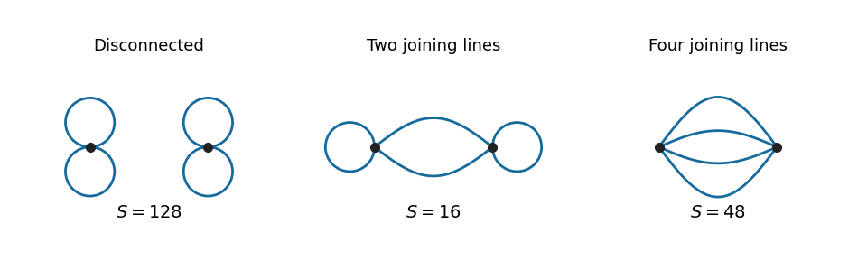
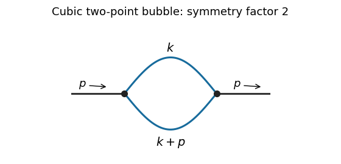

# Paper 48

↑ **Parent:** [Iii](../iii.md)

[https://www.maths.cam.ac.uk/postgrad/part-iii/files/pastpapers/2009/Paper48.pdf](https://www.maths.cam.ac.uk/postgrad/part-iii/files/pastpapers/2009/Paper48.pdf)

**Table of contents**

- [1](#1)
  - [a](#1/a)
    - [Solution](#1/a/solution)
  - [b](#1/b)
    - [Solution](#1/b/solution)
- [2](#2)
  - [Solution](#2/solution)
- [3](#3)
  - [Solution](#3/solution)
- [4](#4)
  - [Solution](#4/solution)

## 1

↑ **Parent:** [Paper 48](paper-48.md)

<h3 id="1/a">a</h3>

↑ **Parent:** [1](#1)

<h4 id="1/a/solution">Solution</h4>

↑ **Parent:** [A](#1/a)

Use [position eigenstates](../../../quantum-mechanics.md#position-eigenstate) normalized by $\langle q|q'\rangle=\delta(q-q')$, and the free [Hamiltonian operator](../../../quantum-mechanics.md#hamiltonian-quantum-mechanics) $\widehat H=\widehat p^2/(2m)$. The time-sliced [path integral](../../../quantum-field-theory.md#path-integral) is the matrix element of the [time-evolution operator](../../../quantum-mechanics.md#time-evolution-operator):

$$
\boxed{\mathcal I[q^{(i)},q^{(f)}]=\langle q^{(f)}|e^{-iT\widehat H/\hbar}|q^{(i)}\rangle.}
$$

Insert [momentum eigenstates](../../../quantum-mechanics.md#momentum-eigenstate), with $\langle q|p\rangle=(2\pi\hbar)^{-1/2}e^{ipq/\hbar}$. The [free-particle propagator](../../../quantum-mechanics.md#free-particle-propagator) becomes

$$
\mathcal I=\int_{-\infty}^{\infty}\frac{dp}{2\pi\hbar}\exp\!\left(\frac{ip\Delta q}{\hbar}-\frac{iTp^2}{2m\hbar}\right),\qquad\Delta q=q^{(f)}-q^{(i)}.
$$

Complete the square in the exponent:

$$
\frac{ip\Delta q}{\hbar}-\frac{iTp^2}{2m\hbar}=-\frac{iT}{2m\hbar}\left(p-\frac{m\Delta q}{T}\right)^2+\frac{im(\Delta q)^2}{2\hbar T}.
$$

The [Fresnel integral](../../../analysis.md#fresnel-integral), defined by the damping prescription $T\to T-i0$, gives, for $T>0$,

$$
\boxed{\mathcal I=\left(\frac{m}{2\pi i\hbar T}\right)^{1/2}\exp\!\left(\frac{im(\Delta q)^2}{2\hbar T}\right).}
$$

The square-root branch is $i^{-1/2}=e^{-i\pi/4}$; it is fixed by the regulated [Gaussian integral](../../../calculus.md#gaussian-integral) and the short-time [Dirac delta distribution](../../../distribution-theory.md#dirac-delta-function) limit, rather than an arbitrary phase.

The [Euler-Lagrange equation](../../../analysis.md#euler-lagrange-equation) for the [free particle](../../../quantum-mechanics.md#free-particle) is $m\ddot q=0$. Its unique classical path satisfying the endpoint [boundary conditions](../../../differential-equation.md#boundary-condition) is $q_{\rm cl}(t)=q^{(i)}+\Delta q\,t/T$. Therefore its classical [action](../../../classical-mechanics.md#action) is

$$
\boxed{S_{\rm cl}=\int_0^T\frac m2\left(\frac{\Delta q}{T}\right)^2dt=\frac{m(\Delta q)^2}{2T}.}
$$

Substituting into the operator result yields $\mathcal I=C(T)e^{iS_{\rm cl}/\hbar}$, with $C(T)=(m/(2\pi i\hbar T))^{1/2}$ independent of the endpoint positions.

The same independence is transparent directly in the [path integral](../../../quantum-field-theory.md#path-integral). Write $q=q_{\rm cl}+\eta$, with $\eta(0)=\eta(T)=0$. The cross term in the [action](../../../classical-mechanics.md#action) is $m\dot q_{\rm cl}\int_0^T\dot\eta\,dt=0$, so $S[q]=S_{\rm cl}+(m/2)\int_0^T\dot\eta^2dt$. The fluctuation integral depends only on $m,T,\hbar$. Because the [action](../../../classical-mechanics.md#action) is quadratic, the factorization is exact; the [semiclassical propagator](../../../quantum-mechanics.md#semiclassical-propagator) already equals the full answer.

<h3 id="1/b">b</h3>

↑ **Parent:** [1](#1)

<h4 id="1/b/solution">Solution</h4>

↑ **Parent:** [B](#1/b)

Put $I_0=\sqrt{2\pi/m^2}$ and assume $m^2>0$. The normalized free [Gaussian integral](../../../calculus.md#gaussian-integral) has covariance $\Delta=1/m^2$. Expanding the interaction exponential and using [Wick's theorem](../../../perturbative-quantum-field-theory.md#wick-s-theorem) gives the [Feynman rules](../../../perturbative-quantum-field-theory.md#feynman-rule): a quartic vertex contributes $-\lambda$, each internal [propagator](../../../quantum-field-theory.md#propagator) contributes $\Delta$, and each [vacuum diagram](../../../perturbative-quantum-field-theory.md#vacuum-feynman-diagram) is divided by its [Feynman-diagram symmetry factor](../../../perturbative-quantum-field-theory.md#feynman-diagram-symmetry-factor). Multiply the resulting sum by $I_0$. Because we are expanding $I$, rather than $\log I$, disconnected [vacuum diagrams](../../../perturbative-quantum-field-theory.md#vacuum-feynman-diagram) must also be included.

At order $\lambda^2$ there are two quartic vertices and four internal [propagators](../../../quantum-field-theory.md#propagator). Let $r$ be the number of edges joining the two vertices. The remaining half-edges must pair at their own vertex, so $r$ is even. The possibilities $r=0,2,4$ exhaust the [vacuum diagrams](../../../perturbative-quantum-field-theory.md#vacuum-feynman-diagram):

**[Figure 1](#1/b/image-all-three-second-order-quartic-vacuum-diagrams-and-their-symmetry-factors). All three second-order quartic vacuum diagrams and their symmetry factors**.

For $r=0$, each vertex has three possible pairings, giving $N_0=9$ [Wick contractions](../../../perturbative-quantum-field-theory.md#wick-contraction). For $r=2$, choose the two half-edges at each vertex, then pair the chosen half-edges across the vertices: $N_2=\binom42^2 2!=72$. The remaining two half-edges at each vertex form a self-loop. For $r=4$, all half-edges pair across the vertices, giving $N_4=4!=24$. The common denominator from the expansion is $2!(4!)^2=1152$, so the [Feynman-diagram symmetry factors](../../../perturbative-quantum-field-theory.md#feynman-diagram-symmetry-factor) are

$$
S_0=\frac{1152}{9}=128,\qquad S_2=\frac{1152}{72}=16,\qquad S_4=\frac{1152}{24}=48.
$$

Each [vacuum diagram](../../../perturbative-quantum-field-theory.md#vacuum-feynman-diagram) has the same factor $I_0\lambda^2\Delta^4$ before division by its [Feynman-diagram symmetry factor](../../../perturbative-quantum-field-theory.md#feynman-diagram-symmetry-factor). Consequently the **coefficient of $\lambda^2$** is

$$
\boxed{\frac{I_0}{m^8}\left(\frac1{128}+\frac1{16}+\frac1{48}\right)=\frac{35}{384m^8}\sqrt{\frac{2\pi}{m^2}}.}
$$

As an independent check, the eighth moment obtained from the [Gaussian moment pairing theorem](../../../probability-theory.md#isserlis-s-theorem) is $\langle x^8\rangle_0=7!!/m^8=105/m^8$, and $105/[2!(4!)^2]=35/384$. The first terms of the [zero-dimensional quartic perturbation series](../../../quantum-field-theory.md#zero-dimensional-quartic-perturbation-series) are therefore

$$
\frac{I}{I_0}=1-\frac{\lambda}{8m^4}+\frac{35\lambda^2}{384m^8}+O(\lambda^3).
$$

Strictly, the printed phrase “Taylor expansion” means a formal expansion or a right-sided [asymptotic expansion](../../../analysis.md#asymptotic-expansion). The general coefficient has absolute successive ratio $(4v+3)(4v+1)/[24(v+1)m^4]\to\infty$, so the [power series](../../../real-analysis.md#power-series) has zero radius of convergence. Nevertheless, for $\lambda\geq0$ the remainder after any fixed truncation of $e^{-\lambda x^4/4!}$ is bounded by the next absolute term, and its [Gaussian integral](../../../calculus.md#gaussian-integral) is finite. This proves the displayed [asymptotic expansion](../../../analysis.md#asymptotic-expansion) as $\lambda\downarrow0$. For negative real $\lambda$ the defining integral diverges.

## 2

↑ **Parent:** [Paper 48](paper-48.md)

<h3 id="2/solution">Solution</h3>

↑ **Parent:** [2](#2)

The [superficial degree of divergence](../../../perturbative-quantum-field-theory.md#superficial-degree-of-divergence) is the power of a common large-momentum scale obtained by scaling all independent internal momenta together, before cancellations or subtraction of divergent subdiagrams. In a [scalar field theory](../../../scalar-field-theory.md) with a standard quadratic kinetic term and non-derivative interactions, each [loop momentum](../../../perturbative-quantum-field-theory.md#loop-momentum) integral supplies $d$ powers of momentum and each internal [propagator](../../../quantum-field-theory.md#propagator) supplies minus two. Thus

$$
D=dL-2I.
$$

For a connected [Feynman diagram](../../../perturbative-quantum-field-theory.md#feynman-diagram), counting vertex half-edges and applying the stated identity for the [loop order](../../../perturbative-quantum-field-theory.md#loop-order) gives

$$
2I+E=\sum_n nV_n,\qquad I=L+V-1,\qquad V=\sum_n V_n.
$$

It follows that $D=(d-2)L-2V+2$. Meanwhile, $\sum_n(n-4)V_n=2I+E-4V=2L-2V+E-2$. Substitution proves

$$
\boxed{D=(d-4)L+\sum_n(n-4)V_n-E+4.}
$$

This [power counting in quantum field theory](../../../perturbative-quantum-field-theory.md#power-counting-in-quantum-field-theory) concerns the overall scaling: even a [Feynman diagram](../../../perturbative-quantum-field-theory.md#feynman-diagram) with $D<0$ can contain divergent subdiagrams, and cancellations may improve convergence when $D\geq0$.

The canonical [mass dimensions](../../../perturbative-quantum-field-theory.md#mass-dimension) are $[\phi]=(d-2)/2$ and $[g_n]=d-n(d-2)/2$. A finite polynomial [scalar field theory](../../../scalar-field-theory.md) has power-counting [renormalizability](../../../perturbative-quantum-field-theory.md#renormalizable-quantum-field-theory) when its interactions have nonnegative [mass dimensions](../../../perturbative-quantum-field-theory.md#mass-dimension) and the allowed local [counterterms](../../../perturbative-quantum-field-theory.md#counterterm) form a finite set closed under subtraction of divergent subdiagrams. For $d>2$, non-derivative interactions therefore satisfy $n\leq2d/(d-2)$. Equivalently,

$$
D=d-\frac{d-2}{2}E-\sum_n[g_n]V_n,
$$

so adding vertices of such interactions cannot force an indefinitely increasing number of external legs or derivatives in divergent [counterterms](../../../perturbative-quantum-field-theory.md#counterterm). In dimensions $d\leq2$ a fixed finite polynomial still has this favorable [power counting in quantum field theory](../../../perturbative-quantum-field-theory.md#power-counting-in-quantum-field-theory); the displayed upper bound on $n$ is intended only for $d>2$.

For [six-dimensional cubic scalar field theory](../../../scalar-field-theory.md#six-dimensional-cubic-scalar-field-theory), $3V=2I+E$ and $L=I-V+1$ yield

$$
\boxed{D=6-2E.}
$$

The coupling $g$ has zero [mass dimension](../../../perturbative-quantum-field-theory.md#mass-dimension). The possible overall divergences have $E\leq3$: vacuum energy, a linear [tadpole diagram](../../../perturbative-quantum-field-theory.md#tadpole-diagram) term, a mass term, a kinetic term, and a cubic interaction. These are finitely many local [counterterms](../../../perturbative-quantum-field-theory.md#counterterm). Divergent subdiagrams of higher-point [Feynman diagrams](../../../perturbative-quantum-field-theory.md#feynman-diagram) are removed by the same [counterterms](../../../perturbative-quantum-field-theory.md#counterterm), establishing [perturbative renormalizability of cubic scalar theory in six dimensions](../../../scalar-field-theory.md#perturbative-renormalizability-of-cubic-scalar-theory-in-six-dimensions). A real cubic potential is unbounded below, so this claim is one of [perturbative quantum field theory](../../../perturbative-quantum-field-theory.md), not a claim that the polynomial defines a stable nonperturbative vacuum.

After [Wick rotation](../../../perturbative-quantum-field-theory.md#wick-rotation), use the [Euclidean action](../../../perturbative-quantum-field-theory.md#euclidean-action) with positive kinetic and mass terms and interaction $g\phi^3/3!$. The Euclidean momentum-space [Feynman rules](../../../perturbative-quantum-field-theory.md#feynman-rule) are: an internal [scalar propagator](../../../scalar-field-theory.md#scalar-propagator) $1/(k^2+m^2)$, a vertex $-g$, momentum conservation at each vertex, integration $d^6k/(2\pi)^6$ for each independent loop, and division by the [Feynman-diagram symmetry factor](../../../perturbative-quantum-field-theory.md#feynman-diagram-symmetry-factor). Strip the overall momentum-conserving delta function and external [propagators](../../../quantum-field-theory.md#propagator) when computing an [amputated Green's function](../../../critical-phenomenon.md#amputated-connected-correlation-function).

The [one-particle-irreducible two-point vertex](../../../perturbative-quantum-field-theory.md#one-particle-irreducible-two-point-vertex) at one loop is the bubble:

**[Figure 2](#2/image-one-loop-cubic-scalar-two-point-bubble-with-symmetry-factor-two). One-loop cubic scalar two-point bubble with symmetry factor two**.

Interchanging its two internal lines is an automorphism, giving [Feynman-diagram symmetry factor](../../../perturbative-quantum-field-theory.md#feynman-diagram-symmetry-factor) two. In the normalization of the printed Minkowski [amputated Green's function](../../../critical-phenomenon.md#amputated-connected-correlation-function), the two vertices contribute $(-ig)^2$, the two internal [propagators](../../../quantum-field-theory.md#propagator) contribute $(-i)^2$, and [Wick rotation](../../../perturbative-quantum-field-theory.md#wick-rotation) supplies the overall $i$ already factored out there. Thus the Euclidean bubble contribution is

$$
\boxed{\widehat F_2^{(1)}(p)=\frac{g^2}{2}\int\frac{d^6k}{(2\pi)^6}\frac1{(k^2+m^2)((k+p)^2+m^2)}.}
$$

For this [self-energy](../../../perturbative-quantum-field-theory.md#self-energy) calculation we impose a vanishing [one-point function](../../../critical-phenomenon.md#one-point-correlation-function), so [tadpole diagram](../../../perturbative-quantum-field-theory.md#tadpole-diagram) insertions are canceled by the linear [counterterm](../../../perturbative-quantum-field-theory.md#counterterm). Without that convention a connected but [one-particle-reducible Feynman diagram](../../../perturbative-quantum-field-theory.md#one-particle-reducible-feynman-diagram) with a tadpole insertion is also possible: both external legs attach to one vertex, a zero-momentum line joins it to a second vertex, and that second vertex has a self-loop. Its amputated contribution is $g^2/(2m^2)\int d^6k/[(2\pi)^6(k^2+m^2)]$, independent of $p$. It is not the bubble drawn above; keeping it without a tadpole subtraction would add this constant to the full amputated answer.

To find the bubble's local divergence, put $K=k^2+m^2$ and expand at large $|k|$:

$$
\frac1{K(K+2k\cdot p+p^2)}=\frac1{K^2}-\frac{2k\cdot p+p^2}{K^3}+\frac{(2k\cdot p+p^2)^2}{K^4}+\cdots.
$$

Odd terms vanish under the angular integral. Rotational symmetry gives $\langle(k\cdot p)^2\rangle=k^2p^2/6$. The terms through order $p^2$ are therefore

$$
\frac1{K^2}+p^2\left(-\frac1{K^3}+\frac{2k^2}{3K^4}\right),
$$

and the $p^2$ coefficient approaches $-1/(3k^6)$. Terms of order $p^4$ and higher are integrable at infinity in six dimensions; subtracting the two displayed terms leaves an ultraviolet-convergent integral. Hence the divergent part is **a local polynomial $A p^2+B$**, with momentum-independent coefficients. For example, when $m^2>0$ its logarithmically divergent coefficient is

$$
A_{\rm div}=-\frac{g^2}{768\pi^3}\log\frac{\Lambda^2}{m^2}.
$$

Changing the reference scale in this logarithm only changes a finite local term.

At zero external momentum the spherical [ultraviolet cutoff](../../../quantum-field-theory.md#ultraviolet-cutoff) and $\operatorname{Vol}(S^5)=\pi^3$ give

$$
B_\Lambda=\widehat F_2^{(1)}(0)=\frac{g^2}{128\pi^3}\int_0^\Lambda\frac{k^5\,dk}{(k^2+m^2)^2}.
$$

With $u=k^2$, integrate $u^2/(u+m^2)^2=1-2m^2/(u+m^2)+m^4/(u+m^2)^2$. This gives the [momentum-cutoff two-point function in six-dimensional cubic scalar theory](../../../scalar-field-theory.md#momentum-cutoff-two-point-function-in-six-dimensional-cubic-scalar-theory)

$$
\boxed{B_\Lambda=\frac{g^2}{256\pi^3}\left[\Lambda^2-2m^2\log\left(1+\frac{\Lambda^2}{m^2}\right)+\frac{m^2\Lambda^2}{\Lambda^2+m^2}\right].}
$$

In particular, the divergent part of this constant is

$$
\boxed{B_{\rm div}=\frac{g^2}{256\pi^3}\left[\Lambda^2-2m^2\log\frac{\Lambda^2}{m^2}\right],}
$$

while the last term in $B_\Lambda$ tends to a finite constant. For $m=0$ the zero-momentum integral gives $B_\Lambda=g^2\Lambda^2/(256\pi^3)$ directly. The finite parts of a local subtraction can depend on the [regularization](../../../statistical-learning.md#regularization) prescription; the conclusion about mass and kinetic [counterterms](../../../perturbative-quantum-field-theory.md#counterterm) does not.

## 3

↑ **Parent:** [Paper 48](paper-48.md)

<h3 id="3/solution">Solution</h3>

↑ **Parent:** [3](#3)

Let $\phi_B=Z_\phi^{1/2}\phi$ define the renormalized field in [Phi-fourth theory](../../../scalar-field-theory.md#quartic-interaction). For an $n$-point [correlation function](../../../critical-phenomenon.md#correlation-function), with no composite operator insertions, this implies

$$
G_{n,B}=Z_\phi^{n/2}G_n.
$$

The bare [correlation function](../../../critical-phenomenon.md#correlation-function) is independent of the arbitrary [renormalization scale](../../../perturbative-quantum-field-theory.md#renormalization-scale) $\mu$ when the bare parameters and external momenta are fixed. Define

$$
\widehat\beta_\lambda=\left.\mu\frac{d\lambda}{d\mu}\right|_B,\qquad \gamma_{m^2}=\left.\mu\frac{d\log m^2}{d\mu}\right|_B,\qquad \gamma_\phi=\left.\frac12\mu\frac{d\log Z_\phi}{d\mu}\right|_B.
$$

The definitions of the [running mass](../../../perturbative-quantum-field-theory.md#running-mass) and [wave-function renormalization](../../../perturbative-quantum-field-theory.md#wave-function-renormalization) functions specify their signs and the factor of two. Differentiating $Z_\phi^{n/2}G_n$ using the [chain rule](../../../calculus.md#chain-rule) yields the **Callan–Symanzik equation**

$$
\boxed{\left[\mu\partial_\mu+\widehat\beta_\lambda\partial_\lambda+m^2\gamma_{m^2}\partial_{m^2}+n\gamma_\phi\right]G_n=0.}
$$

Here $\widehat\beta_\lambda$ denotes the [renormalization-group beta function](../../../perturbative-quantum-field-theory.md#beta-function-physics) itself, not the function multiplied by an additional $\lambda$. The [Callan-Symanzik equation](../../../perturbative-quantum-field-theory.md#callan-symanzik-equation) concerns dependence on the arbitrary reference scale, with the displayed external momenta kept fixed.

For the [minimal subtraction scheme](../../../perturbative-quantum-field-theory.md#minimal-subtraction-scheme) in [dimensional regularization](../../../perturbative-quantum-field-theory.md#dimensional-regularization), write

$$
F(\lambda,\epsilon)=\lambda+\sum_{k\geq1}\frac{f_k(\lambda)}{\epsilon^k},\qquad H(\lambda,\epsilon)=1+\sum_{k\geq1}\frac{b_k(\lambda)}{\epsilon^k},
$$

so $\lambda_B=\mu^\epsilon F$ and $m_B^2=m^2H$. The $\mu^\epsilon$ factor gives the engineering contribution $-\epsilon\lambda$ to the [renormalization-group beta function](../../../perturbative-quantum-field-theory.md#beta-function-physics). Put $\widehat\beta_\lambda=-\epsilon\lambda+\beta_\lambda$. Scale independence of the bare coupling then gives

$$
0=\epsilon F+\widehat\beta_\lambda\partial_\lambda F
=\epsilon(F-\lambda F')+\beta_\lambda F'.
$$

The coefficient of $\epsilon^0$ is $f_1-\lambda f_1'+\beta_\lambda$. Its vanishing proves the first of the [simple-pole formulas for minimal-subtraction renormalization group functions](../../../perturbative-quantum-field-theory.md#simple-pole-formulas-for-minimal-subtraction-renormalization-group-functions):

$$
\boxed{\beta_\lambda=\widehat\beta_\lambda+\epsilon\lambda=(\lambda\partial_\lambda-1)f_1(\lambda).}
$$

The coefficients of $\epsilon^{-k}$, $k\geq1$, also vanish and impose $(\lambda\partial_\lambda-1)f_{k+1}=\beta_\lambda f_k'$. These relations explain how the higher poles are consistent with a finite [renormalization-group beta function](../../../perturbative-quantum-field-theory.md#beta-function-physics).

For the mass, differentiate the second bare-parameter relation:

$$
0=\gamma_{m^2}H+\widehat\beta_\lambda H'.
$$

Its finite coefficient is $\gamma_{m^2}-\lambda b_1'$. Therefore

$$
\boxed{\gamma_{m^2}=\lambda\partial_\lambda b_1(\lambda).}
$$

The higher poles impose $\lambda b_{k+1}'=\gamma_{m^2}b_k+\beta_\lambda b_k'$. The formulas for the [running mass](../../../perturbative-quantum-field-theory.md#running-mass) and [renormalization-group beta function](../../../perturbative-quantum-field-theory.md#beta-function-physics) thus follow directly from bare-parameter independence rather than from an identification with diagram coefficients by name.

At the specified [loop order](../../../perturbative-quantum-field-theory.md#loop-order), $f_1=3\lambda^2/(16\pi^2)$ and $b_1=\lambda/(16\pi^2)$. There is no [wave-function renormalization](../../../perturbative-quantum-field-theory.md#wave-function-renormalization) at this order. Hence

$$
\boxed{\beta_\lambda=\frac{3\lambda^2}{16\pi^2}+O(\lambda^3),\qquad \gamma_{m^2}=\frac{\lambda}{16\pi^2}+O(\lambda^2),\qquad \gamma_\phi=0+O(\lambda^2).}
$$

The regulated [renormalization-group beta function](../../../perturbative-quantum-field-theory.md#beta-function-physics) is $\widehat\beta_\lambda=-\epsilon\lambda+3\lambda^2/(16\pi^2)+O(\lambda^3)$; after removing the regulator, $\widehat\beta_\lambda=\beta_\lambda$.

Now take $m^2=0$ and the four-dimensional limit. This massless surface is preserved since $\mu\,dm^2/d\mu=m^2\gamma_{m^2}$. Set $b=3/(16\pi^2)$, choose a reference scale $\mu_0$, and define the [running coupling](../../../perturbative-quantum-field-theory.md#running-coupling) by

$$
\frac{d\lambda(\mu)}{d\log\mu}=b\lambda(\mu)^2,\qquad \lambda(\mu_0)=\lambda_0.
$$

Differentiating $1/\lambda$ gives $d(1/\lambda)/d\log\mu=-b$, so

$$
\boxed{\lambda(\mu)=\frac{\lambda_0}{1-b\lambda_0\log(\mu/\mu_0)}.}
$$

The zero-coupling solution is obtained by continuity. At one-loop accuracy $\gamma_\phi=0$, and the [chain rule](../../../calculus.md#chain-rule) turns the massless [Callan-Symanzik equation](../../../perturbative-quantum-field-theory.md#callan-symanzik-equation) into

$$
\frac{d}{d\log\mu}G_n(p_1,\ldots,p_n;0,\lambda(\mu),\mu)=0.
$$

Thus the **one-loop solution along a running-coupling trajectory** is

$$
\boxed{G_n(p_1,\ldots,p_n;0,\lambda(\mu),\mu)=G_n(p_1,\ldots,p_n;0,\lambda_0,\mu_0).}
$$

For a prescribed endpoint coupling $\lambda$, substitute $\lambda_0=\lambda/[1+b\lambda\log(\mu/\mu_0)]$ on the right. The reference [correlation function](../../../critical-phenomenon.md#correlation-function) supplies arbitrary boundary data; the [Callan-Symanzik equation](../../../perturbative-quantum-field-theory.md#callan-symanzik-equation) determines their scale evolution, not their full momentum dependence. The [running coupling](../../../perturbative-quantum-field-theory.md#running-coupling) formula is used on a branch on which its denominator is nonzero and the retained perturbative approximation is appropriate.

If one keeps $\epsilon\ne0$, the same characteristic calculation uses $d\lambda/d\log\mu=-\epsilon\lambda+b\lambda^2$. Writing $r=\mu/\mu_0$ gives $\lambda(\mu)=\lambda_0r^{-\epsilon}/[1-(b\lambda_0/\epsilon)(1-r^{-\epsilon})]$, which tends to the displayed four-dimensional result as $\epsilon\to0$.

With a nonzero [anomalous dimension](../../../critical-phenomenon.md#anomalous-dimension), the characteristic equation instead reads $dG_n/d\log\mu=-n\gamma_\phi(\lambda(\mu))G_n$. Integration proves the [characteristic solution of the massless Callan-Symanzik equation](../../../perturbative-quantum-field-theory.md#characteristic-solution-of-the-massless-callan-symanzik-equation):

$$
G_n(\boldsymbol p;0,\lambda(\mu),\mu)=\exp\left[-n\int_{\mu_0}^{\mu}\gamma_\phi(\lambda(\nu))\frac{d\nu}{\nu}\right]G_n(\boldsymbol p;0,\lambda_0,\mu_0).
$$

For the stipulated $\gamma_\phi=c\lambda^2$ and the same one-loop [renormalization-group beta function](../../../perturbative-quantum-field-theory.md#beta-function-physics), change variables using $d\log\nu=d\lambda/(b\lambda^2)$. The exponent's integral becomes $(c/b)(\lambda(\mu)-\lambda_0)$. Therefore the **modified explicit solution** is

$$
\boxed{G_n(\boldsymbol p;0,\lambda(\mu),\mu)=\exp\left[-\frac{nc}{b}\big(\lambda(\mu)-\lambda_0\big)\right]G_n(\boldsymbol p;0,\lambda_0,\mu_0).}
$$

Equivalently its multiplicative factor is $\exp[-nc\lambda_0^2\log r/(1-b\lambda_0\log r)]$. This solves the equation with the stated truncated [renormalization-group beta function](../../../perturbative-quantum-field-theory.md#beta-function-physics) and [anomalous dimension](../../../critical-phenomenon.md#anomalous-dimension); it does not introduce additional higher-order coefficients that were not specified.

## 4

↑ **Parent:** [Paper 48](paper-48.md)

<h3 id="4/solution">Solution</h3>

↑ **Parent:** [4](#4)

A [Non-Abelian gauge theory](../../../relativistic-quantum-field.md#yang-mills-theory) describes fields with a local redundancy, not an independent physical degree of freedom for each component of its [gauge field](../../../relativistic-quantum-field.md#gauge-field). Take a compact [gauge group](../../../relativistic-quantum-field.md#gauge-group) with Hermitian generators $T^a$ and [Lie algebra structure constants](../../../lie-algebra.md#structure-constant-of-a-lie-algebra) defined by $[T^a,T^b]=if^{abc}T^c$. In a mostly-plus [metric signature](../../../topology.md#metric-signature), the pure [Yang-Mills theory](../../../relativistic-quantum-field.md#yang-mills-theory) has

$$
\mathcal L_{\rm YM}=-\frac14F^a_{\mu\nu}F^{a\mu\nu},\qquad F^a_{\mu\nu}=\partial_\mu A^a_\nu-\partial_\nu A^a_\mu+g f^{abc}A^b_\mu A^c_\nu.
$$

With the matter [gauge covariant derivative](../../../relativistic-quantum-field.md#gauge-covariant-derivative) $D_\mu=\partial_\mu-igA_\mu$, a finite [gauge transformation](../../../electromagnetism.md#gauge-transformation) acts as $A_\mu\mapsto UA_\mu U^{-1}-(i/g)(\partial_\mu U)U^{-1}$. Expanding $U=e^{ig\omega^aT^a}$ gives

$$
\delta A^a_\mu=(D_\mu\omega)^a=\partial_\mu\omega^a+g f^{abc}A^b_\mu\omega^c.
$$

The [Yang-Mills action](../../../relativistic-quantum-field.md#yang-mills-action) is constant along each [gauge orbit](../../../relativistic-quantum-field.md#gauge-orbit). Consequently a naive [functional integral](../../../quantum-field-theory.md#functional-measure) $\int\mathcal DA\,e^{iS[A]}$ repeatedly integrates the same physical configuration and contains the infinite formal volume of the local [gauge group](../../../relativistic-quantum-field.md#gauge-group). At quadratic order the same problem appears as noninvertibility: the free kinetic operator annihilates $A_\mu=\partial_\mu\omega$, so no unique [gauge-boson propagator](../../../relativistic-quantum-field.md#gauge-boson-propagator) exists. In canonical language the [Gauss law constraint in gauge theory](../../../relativistic-quantum-field.md#gauss-law-constraint-in-gauge-theory) and the absence of an independent momentum for the time component show that the field components cannot all be independent oscillators. In covariant quantization, time-like and longitudinal polarizations must not be counted as additional physical states.

The [Faddeev-Popov determinant](../../../relativistic-quantum-field.md#faddeev-popov-determinant) implements a local quotient by the [gauge orbit](../../../relativistic-quantum-field.md#gauge-orbit). Choose $G^a[A]=\partial^\mu A^a_\mu$ and first impose $G^a[A]=f^a(x)$ for a specified function $f$. This is the [Lorenz gauge](../../../electromagnetism.md#lorenz-gauge-condition) condition when $f=0$. Its infinitesimal change is

$$
\delta G^a=\partial^\mu(D_\mu\omega)^a,\qquad (D_\mu)^{ab}=\delta^{ab}\partial_\mu+g f^{acb}A^c_\mu.
$$

The direct [Faddeev-Popov operator](../../../relativistic-quantum-field.md#faddeev-popov-operator) is therefore $M_0^{ab}=\partial^\mu(D_\mu)^{ab}$. Locally, if the condition cuts each orbit once and residual zero modes have been removed by boundary conditions, changing variables from $\omega$ to $G[A^\omega]-f$ proves the [Faddeev-Popov gauge-orbit identity](../../../relativistic-quantum-field.md#faddeev-popov-gauge-orbit-identity)

$$
1=\Delta_{\rm FP}[A]\int\mathcal D\omega\,\delta\big(G[A^\omega]-f\big),\qquad \Delta_{\rm FP}[A]=\det M_0[A].
$$

The determinant is the [functional Jacobian](../../../quantum-field-theory.md#functional-jacobian) of this change of variables. A finite-dimensional version is $\int d\omega\,\delta(G(\omega)-f)=1/|\det(\partial G/\partial\omega)|$ near a unique root; the perturbative determinant has a fixed sign or phase, absorbed into normalization. This is the same change-of-variables mechanism used in [Bastianelli's derivation of the Faddeev–Popov construction](https://www-th.bo.infn.it/people/bastianelli/AdQFT-2-Path-integral-and-gauge-fixing-24-25.pdf).

Insert the identity into the normalized [functional integral](../../../quantum-field-theory.md#functional-measure) for a [gauge-invariant](../../../relativistic-quantum-field.md#gauge-invariance) observable $\mathcal O[A]$:

$$
Z\langle\mathcal O\rangle=\frac1{\operatorname{Vol}\mathcal G}\int\mathcal DA\,\mathcal O[A]e^{iS[A]}\Delta_{\rm FP}[A]\int\mathcal D\omega\,\delta(G[A^\omega]-f).
$$

For each fixed $\omega$, change the integration variable from $A$ to $A^\omega$. The action, observable and measure are invariant, and the determinant is the orbit Jacobian at the resulting gauge slice. The integrand is now independent of the separately integrated orbit parameter. Its integral is $\operatorname{Vol}\mathcal G$, canceling the denominator. Thus, up to normalization,

$$
Z\langle\mathcal O\rangle=\int\mathcal DA\,\Delta_{\rm FP}[A]\delta(G[A]-f)\,\mathcal O[A]e^{iS[A]}.
$$

This assumes an anomaly-free measure and a local perturbative gauge slice; it is not an assertion of a globally unique representative on every [gauge orbit](../../../relativistic-quantum-field.md#gauge-orbit).

Average over $f$ with weight $\exp[-i\int d^4x\,f^af^a/(2\xi)]$. The delta functional sets $f=G[A]$, so the average produces the [covariant gauge](../../../relativistic-quantum-field.md#covariant-gauge) term

$$
\mathcal L_{\rm gf}=-\frac1{2\xi}(\partial^\mu A^a_\mu)^2.
$$

Next represent the [Faddeev-Popov determinant](../../../relativistic-quantum-field.md#faddeev-popov-determinant) by a [Grassmann Gaussian integral](../../../quantum-field-theory.md#grassmann-gaussian-integral). Choose $M=-M_0=-\partial^\mu D_\mu$; changing $M_0$ to $-M_0$ changes the regulated determinant by a field-independent factor that is absorbed in normalization. For a [Faddeev-Popov ghost field](../../../relativistic-quantum-field.md#faddeev-popov-ghost) $c$ and independent [antighost field](../../../relativistic-quantum-field.md#faddeev-popov-antighost-field) $\bar c$,

$$
\det M\ \propto\ \int\mathcal D\bar c\,\mathcal Dc\,\exp\left(i\int d^4x\,\bar c^a M^{ab}c^b\right).
$$

To see why it is a determinant rather than its reciprocal, diagonalize a finite-dimensional quadratic form formally: for each Grassmann pair only the term proportional to $\bar c_jc_j$ survives integration, supplying one eigenvalue. Multiplying the surviving eigenvalues gives $\det M$, with an overall factor of $i$ per pair. The functional version is defined with the same regulator as the rest of the theory.

Combining these steps gives the **gauge-fixed Yang–Mills Lagrangian**

$$
\boxed{\mathcal L_{\rm tot}=-\frac14F^a_{\mu\nu}F^{a\mu\nu}-\frac1{2\xi}(\partial^\mu A^a_\mu)^2-\bar c^a\partial^\mu(D_\mu c)^a.}
$$

This is the [gauge-fixed Yang-Mills Lagrangian in a covariant gauge](../../../relativistic-quantum-field.md#gauge-fixed-yang-mills-lagrangian-in-a-covariant-gauge). Integrating its ghost term by parts gives

$$
\mathcal L_{\rm gh}=(\partial^\mu\bar c^a)(\partial_\mu c^a)+g f^{abc}(\partial^\mu\bar c^a)A^b_\mu c^c.
$$

The second term is the [ghost-gluon vertex](../../../relativistic-quantum-field.md#ghost-gluon-vertex) in the antighost convention chosen here. The [Faddeev-Popov ghosts](../../../relativistic-quantum-field.md#faddeev-popov-ghost) are anticommuting Lorentz scalars introduced to represent a determinant; they are not extra asymptotic particles. A closed [ghost loop](../../../relativistic-quantum-field.md#ghost-loop) has a minus sign from their [Grassmann parity](../../../linear-algebra.md#grassmann-parity). In a [Non-Abelian gauge theory](../../../relativistic-quantum-field.md#yang-mills-theory) the determinant depends on $A$, so these loops are essential. In an Abelian gauge theory $D_\mu$ in the adjoint sector reduces to $\partial_\mu$, the determinant is field independent, and its ghost sector decouples.

The quadratic [gauge field](../../../relativistic-quantum-field.md#gauge-field) kernel at non-null momentum is

$$
K^{\mu\nu}_{ab}(k)=\delta_{ab}\left[-k^2\eta^{\mu\nu}+(1-\xi^{-1})k^\mu k^\nu\right].
$$

Define the mixed-index [longitudinal projector of a vector field](../../../relativistic-quantum-field.md#longitudinal-projector-of-a-vector-field) $P_L{}^\mu{}_\nu=k^\mu k_\nu/k^2$ and [transverse projector of a vector field](../../../relativistic-quantum-field.md#transverse-projector-of-a-vector-field) $P_T=1-P_L$. The kernel is $-k^2(P_T+\xi^{-1}P_L)$ and hence has inverse $-k^{-2}(P_T+\xi P_L)$. Multiplying by $i$ gives the [gauge-boson propagator](../../../relativistic-quantum-field.md#gauge-boson-propagator), off its poles,

$$
\boxed{D^{ab}_{\mu\nu}(k)=-\frac{i\delta^{ab}}{k^2}\left[\eta_{\mu\nu}-(1-\xi)\frac{k_\mu k_\nu}{k^2}\right].}
$$

The vacuum [Feynman i-epsilon prescription](../../../quantum-field-theory.md#feynman-i-epsilon-prescription) completes this off-pole formula; with the mostly-plus convention its physical transverse denominator is $k^2-i0$. The choice $\xi=1$ is [Feynman gauge](../../../relativistic-quantum-field.md#feynman-gauge); $\xi\to0$ is [covariant Landau gauge](../../../relativistic-quantum-field.md#landau-gauge-quantum-field-theory). The invertible quadratic kernel supplies perturbation theory, while the ghost determinant ensures the gauge-orbit measure has been accounted for.

The consistency of the unphysical sector is organized by [BRST symmetry](../../../relativistic-quantum-field.md#brst-symmetry). Introduce a bosonic [Nakanishi-Lautrup field](../../../relativistic-quantum-field.md#nakanishi-lautrup-field) $B^a$ and a [left-acting BRST differential](../../../relativistic-quantum-field.md#left-acting-brst-differential)

$$
sA^a_\mu=(D_\mu c)^a,\qquad sc^a=-\frac g2f^{abc}c^bc^c,\qquad s\bar c^a=B^a,\qquad sB^a=0.
$$

The [graded Leibniz rule](../../../commutative-algebra.md#graded-leibniz-rule) and the [Jacobi identity](../../../lie-algebra.md#jacobi-identity) give $s^2=0$: for example $s^2A=D(sc)+g[Dc,c]=0$ since $D[c,c]=2[Dc,c]$, and $s^2c$ vanishes by the [graded Jacobi identity](../../../lie-algebra.md#graded-jacobi-identity). Nilpotence on $\bar c$ and $B$ is immediate. Using the odd [antighost field](../../../relativistic-quantum-field.md#faddeev-popov-antighost-field), the same [graded Leibniz rule](../../../commutative-algebra.md#graded-leibniz-rule) gives

$$
s\left[\bar c^a\left(G^a+\frac\xi2B^a\right)\right]=B^aG^a+\frac\xi2B^aB^a-\bar c^a\partial^\mu(D_\mu c)^a.
$$

Eliminating $B^a$ by its algebraic field equation $B^a=-G^a/\xi$ recovers the displayed gauge-fixing and ghost terms. Thus they are [BRST-exact](../../../relativistic-quantum-field.md#brst-exact-operator) together, and the total action preserves [BRST symmetry](../../../relativistic-quantum-field.md#brst-symmetry). At the level of states, the [BRST charge](../../../relativistic-quantum-field.md#brst-charge) $Q$ implements physical states as the ghost-number-zero [BRST cohomology](../../../relativistic-quantum-field.md#brst-cohomology) $\ker Q/\operatorname{im}Q$. This prescription removes longitudinal, time-like and ghost excitations from physical amplitudes while allowing them on internal lines. For a [BRST-closed](../../../relativistic-quantum-field.md#brst-closed-operator) observable, changing $\xi$ inserts $s(\bar c^aB^a/2)$; its expectation vanishes by the BRST change-of-variables identity when the measure preserves the symmetry. This explains the independence of physical quantities from the arbitrary gauge parameter.

Finally, a local condition such as [Lorenz gauge](../../../electromagnetism.md#lorenz-gauge-condition) can have several solutions on the same [gauge orbit](../../../relativistic-quantum-field.md#gauge-orbit), the [Gribov ambiguity](../../../relativistic-quantum-field.md#gribov-ambiguity). The preceding [Faddeev-Popov gauge-orbit identity](../../../relativistic-quantum-field.md#faddeev-popov-gauge-orbit-identity) and perturbative [gauge fixing](../../../relativistic-quantum-field.md#gauge-fixing) construction apply in a neighborhood where the linearized operator is invertible after residual modes are excluded. They resolve perturbative gauge overcounting and supply consistent covariant [Feynman rules](../../../perturbative-quantum-field-theory.md#feynman-rule); they do not by themselves prove a globally unique nonperturbative gauge fixing.

## ↑ Ancestors (8)

1. [Iii](../iii.md)
2. [2009](../../2009.md)
3. [Past exam of the mathematics course of the University of Cambridge](../../../past-exam-of-the-mathematics-course-of-the-university-of-cambridge.md)
4. [Mathematics course of the University of Cambridge](../../../university-of-cambridge.md#mathematics-course-of-the-university-of-cambridge)
5. [Course of the University of Cambridge](../../../university-of-cambridge.md#course-of-the-university-of-cambridge)
6. [University of Cambridge](../../../university-of-cambridge.md)
7. [List of universities](../../../README.md#list-of-universities)
8. [Codex Wiki](../../../README.md)
