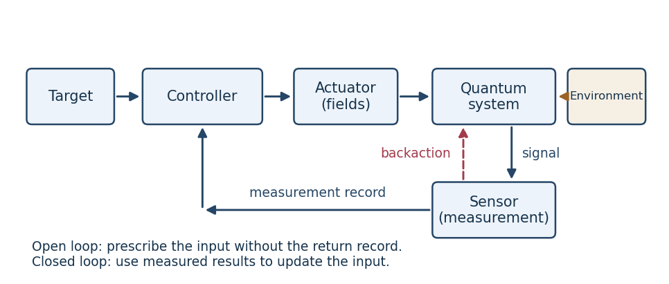

# Paper 52

↑ **Parent:** [Iii](../iii.md)

[https://www.maths.cam.ac.uk/postgrad/part-iii/files/pastpapers/2009/Paper52.pdf](https://www.maths.cam.ac.uk/postgrad/part-iii/files/pastpapers/2009/Paper52.pdf)

**Table of contents**

- [1](#1)
  - [a](#1/a)
    - [Solution](#1/a/solution)
  - [b](#1/b)
    - [Solution](#1/b/solution)
  - [c](#1/c)
    - [Solution](#1/c/solution)
  - [d](#1/d)
    - [Solution](#1/d/solution)
  - [e](#1/e)
    - [Solution](#1/e/solution)
- [2](#2)
  - [a](#2/a)
    - [Solution](#2/a/solution)
  - [b](#2/b)
    - [Solution](#2/b/solution)
  - [c](#2/c)
    - [Solution](#2/c/solution)
  - [d](#2/d)
    - [Solution](#2/d/solution)
  - [e](#2/e)
    - [Solution](#2/e/solution)
  - [f](#2/f)
    - [Solution](#2/f/solution)
- [3](#3)
  - [a](#3/a)
    - [Solution](#3/a/solution)
  - [b](#3/b)
    - [Solution](#3/b/solution)
  - [c](#3/c)
    - [Solution](#3/c/solution)
  - [d](#3/d)
    - [Solution](#3/d/solution)
  - [e](#3/e)
    - [Solution](#3/e/solution)
  - [f](#3/f)
    - [Solution](#3/f/solution)

## 1

↑ **Parent:** [Paper 52](paper-52.md)

<h3 id="1/a">a</h3>

↑ **Parent:** [1](#1)

<h4 id="1/a/solution">Solution</h4>

↑ **Parent:** [A](#1/a)

The target specifies the desired output; the controller selects a [control input](../../../control-theory.md#control-input); an actuator realizes it on the system; and the sensor returns a measured output. The environment supplies additional interactions and disturbances. A simple loop is:

**[Figure 1](#1/a/image-quantum-control-loop-showing-the-measurement-record-and-measurement-backaction). Quantum control loop, showing the measurement record and measurement backaction**.

For a quantum sensor, a [measurement in quantum mechanics](../../../quantum-measurement.md) has statistical outcomes and generally changes the state through [measurement backaction](../../../quantum-measurement.md#measurement-backaction). For example, outcome $m$ of an instrument with operator $K_m$ has [probability](../../../probability-theory.md#probability) and conditional state

$$
p_m=\operatorname{Tr}(K_m\rho K_m^\dagger),\qquad
\rho_m=\frac{K_m\rho K_m^\dagger}{p_m}.
$$

A single unknown [quantum state](../../../quantum-mechanics.md#quantum-state) cannot generally supply its complete instantaneous state vector to a controller. Noncommuting [observables](../../../quantum-mechanics.md#observable) cannot be read simultaneously with arbitrary precision, and reliable [quantum state tomography](../../../quantum-measurement.md#quantum-state-tomography) normally needs many reproducible preparations. A conditional state estimate can instead be updated from a continuous record, with its disturbance included in the model.

Quantum actuators change a [Quantum Hamiltonian](../../../quantum-mechanics.md#hamiltonian-quantum-mechanics) through applied electromagnetic fields, tunable interactions or couplings to auxiliary systems. A closed-system actuator implements [unitary operators](../../../vector-space.md#unitary-operator), so it preserves the [spectrum](../../../linear-operator-theory.md#spectrum-functional-analysis) and [purity of a density operator](../../../quantum-theory.md#purity-of-a-density-operator); it cannot arbitrarily overwrite a state as a classical assignment operation could. Dissipative actuators or [measurement in quantum measurements](../../../quantum-measurement.md) can change these invariants, but their dynamics must be accounted for.

The environment can entangle with the system, causing [decoherence](../../../quantum-theory.md#quantum-decoherence) and dissipation when unobserved degrees of freedom are traced out. It is consequently part of the dynamical model, rather than just an additive classical disturbance. Conversely, [Markovian reservoir engineering](../../../control-theory.md#markovian-reservoir-engineering) uses such coupling constructively to prepare and stabilize states.

In [open-loop control](../../../control-theory.md#open-loop-control) the applied waveform is prescribed without using measurements from the current evolution. In [closed-loop control](../../../control-theory.md#closed-loop-control) it depends on the available measurement record or inferred state. [Measurement-based quantum feedback](../../../control-theory.md#measurement-based-quantum-feedback) is one realization of the latter; experimental adaptation across repeated preparations is another. The measurement record is classical information, but its production has quantum backaction.

<h3 id="1/b">b</h3>

↑ **Parent:** [1](#1)

<h4 id="1/b/solution">Solution</h4>

↑ **Parent:** [B](#1/b)

Three standard objectives are state preparation, [observable](../../../quantum-mechanics.md#observable) optimization and process implementation. All optimizations are over admissible [control inputs](../../../control-theory.md#control-input) and a specified final time $T$.

For state preparation, steer an initial [density operator](../../../quantum-theory.md#density-matrix) to a target $\rho_d$. An exact goal is $\rho_f(T)=\rho_d$, or one may minimize the squared [Hilbert-Schmidt distance](../../../compact-operator.md#hilbert-schmidt-distance)

$$
\boxed{J_{\mathrm{state}}(f)=\tfrac12\operatorname{Tr}[(\rho_f(T)-\rho_d)^2].}
$$

For a pure target $\rho_d=|\psi_d\rangle\langle\psi_d|$, maximizing $\langle\psi_d|\rho_f(T)|\psi_d\rangle$ is a useful alternative. The target must be physically attainable: [Hamiltonian engineering](../../../control-theory.md#hamiltonian-engineering) alone preserves the initial [spectrum](../../../linear-operator-theory.md#spectrum-functional-analysis) of the [density operator](../../../quantum-theory.md#density-matrix).

For an [observable](../../../quantum-mechanics.md#observable) objective, choose a [Hermitian operator](../../../hilbert-space.md#hermitian-operator) $O$ and maximize its expected final value:

$$
\boxed{J_O(f)=\operatorname{Tr}[O\rho_f(T)]\quad\text{to be maximized}.}
$$

Population transfer is a special case with $O$ the projector onto the desired level or subspace; suppressing an unwanted population reverses the sign or minimizes this quantity.

For coherent process engineering, implement a target [unitary operator](../../../vector-space.md#unitary-operator) $V$ on every input, rather than merely arranging one state transfer. If the propagator is $U_f(T)$, a phase-insensitive error is

$$
\boxed{J_{\mathrm{gate}}(f)=1-\frac{|\operatorname{Tr}[V^\dagger U_f(T)]|^2}{N^2}.}
$$

The error vanishes precisely when $U_f(T)=e^{i\phi}V$: equality in the [Hilbert-Schmidt inner product](../../../compact-operator.md#hilbert-schmidt-inner-product) [Cauchy-Schwarz inequality](../../../probability-and-statistics.md#cauchy-schwarz-inequality) bound makes the two operators proportional. For an open-system process, the analogous objective compares the implemented [quantum channel](../../../quantum-information-theory.md#quantum-channel) with the target channel. These objectives can be supplemented by pulse-energy, amplitude, bandwidth and duration constraints in [quantum optimal control](../../../control-theory.md#quantum-optimal-control).

<h3 id="1/c">c</h3>

↑ **Parent:** [1](#1)

<h4 id="1/c/solution">Solution</h4>

↑ **Parent:** [C](#1/c)

A [reachable set](../../../control-theory.md#reachable-set) consists of states obtainable from one specified initial state using admissible inputs and allowed durations. [Controllability](../../../control-theory.md#controllability) means that every target in the declared state space is reachable from every initial state there; the declared space and time convention are essential.

For a closed quantum system, let $U_f$ solve the controlled [Schrödinger equation](../../../physics.md#schrodinger-equation) with $U_f(0)=I$. The propagator and state reachable sets are

$$
\mathcal R_U=\{U_f(T):f\text{ admissible},\ T\text{ allowed}\},\qquad
\mathcal R_\rho(\rho_0)=\{U\rho_0U^\dagger:U\in\mathcal R_U\}.
$$

A pure-state version acts on normalized vectors up to global phase. [Pure-state controllability](../../../control-theory.md#pure-state-controllability) makes every pure target accessible; [unitary operator controllability](../../../control-theory.md#unitary-operator-controllability) permits every desired coherent process, with global phase treated according to the definition.

For [mixed states](../../../quantum-theory.md#mixed-state), [density operator controllability](../../../control-theory.md#density-operator-controllability) means transitivity on each [unitary orbit of a density operator](../../../quantum-theory.md#unitary-orbit-of-a-density-operator), not access to all [density operators](../../../quantum-theory.md#density-matrix) regardless of [spectrum](../../../linear-operator-theory.md#spectrum-functional-analysis). The [Dynamical Lie algebra](../../../control-theory.md#dynamical-lie-algebra) generated by $-iH_0,-iH_1,\ldots$ describes the accessible connected unitary transformations under the usual unconstrained-time control assumptions. Conserved quantities or restricted controls can shrink the [reachable set](../../../control-theory.md#reachable-set). Thus successful preparation of one state is weaker than implementation of an arbitrary gate on all inputs, and coherent [controllability](../../../control-theory.md#controllability) does not imply purification.

<h3 id="1/d">d</h3>

↑ **Parent:** [1](#1)

<h4 id="1/d/solution">Solution</h4>

↑ **Parent:** [D](#1/d)

[Hamiltonian engineering](../../../control-theory.md#hamiltonian-engineering) chooses accessible interactions so that their actual or effective [Quantum Hamiltonian](../../../quantum-mechanics.md#hamiltonian-quantum-mechanics) produces the desired evolution. A typical model is $H_f(t)=H_0+\sum_kf_k(t)H_k$; the controls may change frequencies, amplitudes, phases or coupling strengths. Three standard model-based [open-loop control](../../../control-theory.md#open-loop-control) approaches illustrate different mechanisms.

In [resonant quantum control](../../../control-theory.md#resonant-quantum-control), select a transition with a near-resonant field. In a rotating frame, after neglecting rapidly oscillating terms in a justified regime, an effective two-level drive can be $H_{\mathrm{eff}}(t)=\Omega(t)\sigma_x/2$. When its axis is fixed,

$$
U(T)=\exp\left[-\frac{i\sigma_x}{2}\int_0^T\Omega(t)\,dt\right].
$$

The pulse area sets the rotation angle and the drive phase selects the transverse axis. A resonant pulse of area $\pi$ swaps the two level populations. This requires knowledge of transition frequencies, couplings and the validity of the selective-drive approximation.

In [adiabatic quantum control](../../../control-theory.md#adiabatic-quantum-control), design a slowly varying [Quantum Hamiltonian](../../../quantum-mechanics.md#hamiltonian-quantum-mechanics) whose desired instantaneous eigenstate connects the initial and final states. For a nondegenerate eigenstate separated by a gap, the [quantum adiabatic theorem](../../../quantum-theory.md#adiabatic-theorem) explains why sufficiently slow evolution follows that state up to a phase. The relative size of matrix elements of $\dot H$ and squared spectral gaps controls the approximation; degeneracies or rapid changes invalidate simple following. This engineers a state path rather than a prescribed resonant rotation.

In [average Hamiltonian engineering](../../../control-theory.md#average-hamiltonian-engineering), apply a predetermined sequence of fast pulses $P_j$ and let the system evolve for intervals $\tau_j$ in the corresponding frames. For cycle length $T_c=\sum_j\tau_j$, the leading effective generator is

$$
\overline H^{(0)}=\frac1{T_c}\sum_j\tau_j P_j^\dagger H_0P_j.
$$

Choose the sequence to cancel unwanted terms or retain desired couplings. For instance, equal intervals under $H_0=\omega\sigma_z/2$ and its $\sigma_x$ conjugate cancel the leading generator because $\sigma_x\sigma_z\sigma_x=-\sigma_z$. Noncommuting terms produce higher-order [commutator](../../../lie-algebra.md#commutator) corrections, so fast cycling, finite pulse errors and the accuracy of the model matter. All three methods determine a waveform or sequence before its execution; none automatically corrects an unknown mismatch during that run.

<h3 id="1/e">e</h3>

↑ **Parent:** [1](#1)

<h4 id="1/e/solution">Solution</h4>

↑ **Parent:** [E](#1/e)

Replace evaluation in a possibly inaccurate dynamical model by an experimental objective. Parametrize an admissible pulse as $f(t;a)$, with $a$ collecting time-slice amplitudes or basis-function coefficients. Prepare the same initial state, apply the pulse, measure performance, and update $a$ before the next run. This is [adaptive experimental quantum control](../../../control-theory.md#adaptive-experimental-quantum-control): the loop closes through experimental results, even though each individual pulse is applied open loop.

For example, minimize

$$
\boxed{J_{\mathrm{exp}}(a)=1-\operatorname{Tr}[\rho_d\rho_a(T)]
+\eta\int_0^T\|f(t;a)\|^2\,dt,\qquad a\in\mathcal A,}
$$

for a pure target $\rho_d$, with a nonempty closed [convex set](../../../mathematical-optimization.md#convex-set) $\mathcal A$ enforcing amplitude and bandwidth bounds. The overlap is an experimentally estimable [probability](../../../probability-theory.md#probability). An [observable](../../../quantum-mechanics.md#observable) objective can use its measured expectation instead; a gate objective generally needs more input states and measurement settings. The true dynamics constrain the physically produced $\rho_a(T)$, but no accurate formula for those dynamics is required to evaluate this objective.

A direct search compares measured scores for candidate pulses, accepts improvements and refines the search region. Alternatively estimate a [gradient](../../../calculus.md#gradient) experimentally by finite differences,

$$
\widehat{\partial_{a_k}J}=
\frac{\widehat J(a+\varepsilon e_k)-\widehat J(a-\varepsilon e_k)}{2\varepsilon},
\qquad a_{n+1}=\Pi_{\mathcal A}(a_n-\gamma_n\widehat{\nabla J}),
$$

where $\Pi_{\mathcal A}$ is the [Euclidean projection onto a convex set](../../../mathematical-optimization.md#euclidean-projection-onto-a-convex-set). Population-based searches can also explore several candidates in parallel. These methods use experimental data rather than simulated propagation or a model-derived adjoint [gradient](../../../calculus.md#gradient).

Each score needs enough repeated preparations to manage measurement noise; uncertainty in score differences should determine replication and stopping decisions. Excessively small finite-difference steps amplify that noise. A model-based pulse can provide a useful starting point, but adaptation corrects its systematic mismatch using the device itself. This mitigates model uncertainty, not arbitrary fluctuations: reproducible preparation, calibrated measurements and sufficiently slow drift remain necessary. Nor does a local numerical search guarantee a global optimum.

## 2

↑ **Parent:** [Paper 52](paper-52.md)

<h3 id="2/a">a</h3>

↑ **Parent:** [2](#2)

<h4 id="2/a/solution">Solution</h4>

↑ **Parent:** [A](#2/a)

A basis of [Hermitian matrices](../../../hilbert-space.md#hermitian-operator) is a real basis for the Hermitian subspace, but it also supplies a complex basis for all matrices. Indeed every operator has the decomposition

$$
A=B+iC,\qquad B=\frac{A+A^\dagger}{2},\qquad
C=\frac{A-A^\dagger}{2i},
$$

with $B,C$ Hermitian. Expand each in the given real basis, then combine their coefficients to expand $A$. Orthogonality for the [Hilbert-Schmidt inner product](../../../compact-operator.md#hilbert-schmidt-inner-product) determines those complex coefficients uniquely:

$$
\operatorname{Tr}(\sigma_jA)=\sum_k a_k\operatorname{Tr}(\sigma_j\sigma_k)=a_j.
$$

Consequently

$$
\boxed{A=\sum_{k=1}^{N^2}\operatorname{Tr}(\sigma_kA)\sigma_k.}
$$

If $A$ is Hermitian, cyclicity of the [trace](../../../linear-algebra.md#matrix-trace) gives

$$
a_j^*=\operatorname{Tr}[(\sigma_jA)^\dagger]
=\operatorname{Tr}(A\sigma_j)=\operatorname{Tr}(\sigma_jA)=a_j.
$$

Thus its coordinate vector is real. The product $\sigma_jA$ need not itself be Hermitian; [trace](../../../linear-algebra.md#matrix-trace) cyclicity is what justifies the conclusion.

<h3 id="2/b">b</h3>

↑ **Parent:** [2](#2)

<h4 id="2/b/solution">Solution</h4>

↑ **Parent:** [B](#2/b)

A [density operator](../../../quantum-theory.md#density-matrix) is Hermitian, [positive semidefinite](../../../linear-algebra.md#positive-semidefinite-matrix) and has [trace](../../../linear-algebra.md#matrix-trace) one. Part (a) therefore makes all its coordinates real, and the identity basis vector fixes the final coordinate:

$$
\boxed{r_{N^2}=\operatorname{Tr}(\rho I/\sqrt N)=1/\sqrt N.}
$$

The remaining basis vectors are traceless by orthogonality to $I/\sqrt N$. The [Generalized Bloch representation](../../../quantum-theory.md#generalized-bloch-representation) is consequently

$$
\rho=\frac IN+\sum_{k=1}^{N^2-1}s_k\sigma_k.
$$

Using orthonormality to expand the squared [Hilbert-Schmidt norm](../../../compact-operator.md#hilbert-schmidt-norm) gives the [purity bound for generalized Bloch vectors](../../../quantum-theory.md#purity-bound-for-generalized-bloch-vectors):

$$
\operatorname{Tr}(\rho^2)=\sum_{k=1}^{N^2}r_k^2
=\frac1N+\|s\|^2.
$$

If $p_1,\ldots,p_N$ are its nonnegative [eigenvalues](../../../linear-operator-theory.md#eigenvalue), then $\sum_jp_j=1$ and

$$
1-\operatorname{Tr}(\rho^2)=\left(\sum_jp_j\right)^2-\sum_jp_j^2
=2\sum_{j<k}p_jp_k\geq0.
$$

It follows that

$$
\boxed{\|s\|\leq\sqrt{1-1/N}.}
$$

Equality requires every pairwise product $p_jp_k$ to vanish, so exactly one [eigenvalue](../../../linear-operator-theory.md#eigenvalue) equals one and all others are zero. Conversely, a rank-one projector has precisely that [spectrum](../../../linear-operator-theory.md#spectrum-functional-analysis) and attains equality. Thus equality holds exactly for a [pure state](../../../quantum-theory.md#pure-state). This normalization is different from the commonly used unit-radius qubit [Bloch vector](../../../quantum-theory.md#bloch-vector).

<h3 id="2/c">c</h3>

↑ **Parent:** [2](#2)

<h4 id="2/c/solution">Solution</h4>

↑ **Parent:** [C](#2/c)

For $N=2$, take the normalized [Pauli operators](../../../quantum-circuit.md#pauli-operator) as the traceless basis. The matrix associated with a vector $s$ is $\rho=I/2+s\cdot\sigma$, where these basis matrices are the usual Pauli matrices divided by $\sqrt2$. Their multiplication relations give

$$
(s\cdot\sigma)^2=\frac{\|s\|^2}{2}I,
\qquad
\operatorname{spec}\rho=\left\{\frac12+\frac{\|s\|}{\sqrt2},\
\frac12-\frac{\|s\|}{\sqrt2}\right\}.
$$

At radius $1/\sqrt2$, these [eigenvalues](../../../linear-operator-theory.md#eigenvalue) are one and zero. Every sphere point therefore gives a positive rank-one projector. Any other orthonormal Hermitian basis merely changes the real coordinates by an [orthogonal transformation](../../../linear-algebra.md#orthogonal-transformation), so the result is basis independent.

For every $N>2$, choose a rank-one projector $P$ and consider the Hermitian trace-one matrix

$$
A=\frac2N I-P.
$$

Its [eigenvalues](../../../linear-operator-theory.md#eigenvalue) are $2/N-1$ once and $2/N$ with multiplicity $N-1$. They sum to one and satisfy

$$
\operatorname{Tr}(A^2)=\left(\frac2N-1\right)^2+(N-1)\frac4{N^2}=1.
$$

By orthonormality its traceless coordinate vector has squared length $1-1/N$, so it is on the specified sphere. But $2/N-1<0$, so $A$ is not a [density operator](../../../quantum-theory.md#density-matrix). Thus **for $N>2$, the [pure states](../../../quantum-theory.md#pure-state) occupy a proper subset of the sphere**; positivity excludes some of its points. In fact, this example is the antipodal [Bloch vector](../../../quantum-theory.md#bloch-vector) to that of $P$.

The usual assertion presumes $N\geq2$. If the trivial dimension $N=1$ is admitted, the radius-zero sphere consists of the single coordinate point, also corresponding to the single [pure state](../../../quantum-theory.md#pure-state), so that dimension is an additional trivial exception.

<h3 id="2/d">d</h3>

↑ **Parent:** [2](#2)

<h4 id="2/d/solution">Solution</h4>

↑ **Parent:** [D](#2/d)

Let $\mathcal G=-i[H,\cdot]+\sum_d\mathcal D[V_d]$ denote the [Lindbladian](../../../quantum-information-theory.md#lindbladian). Substituting $\rho=\sum_n r_n\sigma_n$ and projecting with the [Hilbert-Schmidt inner product](../../../compact-operator.md#hilbert-schmidt-inner-product) gives

$$
\dot r_m=\sum_n\operatorname{Tr}[\sigma_m\mathcal G(\sigma_n)]r_n.
$$

For the [Quantum Hamiltonian](../../../quantum-mechanics.md#hamiltonian-quantum-mechanics) term, cyclicity of the [trace](../../../linear-algebra.md#matrix-trace) yields

$$
\begin{aligned}
\operatorname{Tr}(\sigma_m[-iH,\sigma_n])
&=-i\operatorname{Tr}(\sigma_mH\sigma_n-\sigma_m\sigma_nH)\\
&=i\operatorname{Tr}[H(\sigma_m\sigma_n-\sigma_n\sigma_m)]
=L_{mn}.
\end{aligned}
$$

For each [Lindblad dissipator](../../../quantum-information-theory.md#lindblad-dissipator), the same cyclic rearrangement gives

$$
\begin{aligned}
\operatorname{Tr}[\sigma_m\mathcal D[V_d](\sigma_n)]
&=\operatorname{Tr}(V_d^\dagger\sigma_mV_d\sigma_n)\\
&\quad-\frac12\operatorname{Tr}[V_d^\dagger V_d(\sigma_n\sigma_m+\sigma_m\sigma_n)]
=D_{mn}^{(d)}.
\end{aligned}
$$

These are the required coefficient matrices, so $\dot r=(L+\sum_dD^{(d)})r$. They are real because both generators map [Hermitian matrices](../../../hilbert-space.md#hermitian-operator) to [Hermitian matrices](../../../hilbert-space.md#hermitian-operator), whose coordinates are real by (a).

The [trace](../../../linear-algebra.md#matrix-trace) of a [commutator](../../../lie-algebra.md#commutator) vanishes. Also

$$
\operatorname{Tr}[\mathcal D[V](\rho)]
=\operatorname{Tr}(V^\dagger V\rho)
-\tfrac12\operatorname{Tr}(V^\dagger V\rho+\rho V^\dagger V)=0.
$$

Thus the last row of $L+\sum_dD^{(d)}$ is zero and $\boxed{\dot r_{N^2}=0}$. It is [trace](../../../linear-algebra.md#matrix-trace) preservation, not preservation of the [purity of a density operator](../../../quantum-theory.md#purity-of-a-density-operator), that produces this constant coordinate.

Write $G=L+\sum_dD^{(d)}$ and $n=N^2-1$. Since $r_{N^2}=1/\sqrt N$, the remaining coordinates obey the [Affine Bloch equation](../../../quantum-theory.md#affine-bloch-equation)

$$
\boxed{\dot s=As+c,\qquad A_{mn}=G_{mn},\quad
c_m=G_{m,N^2}/\sqrt N\quad(1\leq m,n\leq n).}
$$

Because $[H,I]=0$ and $\mathcal D[V](I)=[V,V^\dagger]$, its offset can also be written

$$
c_m=\frac1N\operatorname{Tr}\left[\sigma_m\sum_d[V_d,V_d^\dagger]\right].
$$

It vanishes for unital dynamics, but need not vanish for a general dissipative evolution.

<h3 id="2/e">e</h3>

↑ **Parent:** [2](#2)

<h4 id="2/e/solution">Solution</h4>

↑ **Parent:** [E](#2/e)

For a Hermitian [Quantum Hamiltonian](../../../quantum-mechanics.md#hamiltonian-quantum-mechanics), $[\sigma_m,\sigma_n]^\dagger=-[\sigma_m,\sigma_n]$. Consequently

$$
L_{mn}^*=-i\operatorname{Tr}([\sigma_m,\sigma_n]^\dagger H)
=i\operatorname{Tr}(H[\sigma_m,\sigma_n])=L_{mn}.
$$

Swapping $m,n$ changes the sign of the [commutator](../../../lie-algebra.md#commutator), so $L_{nm}=-L_{mn}$. The generator is therefore real and antisymmetric. Its last column vanishes because the identity commutes with $H$, so $c=0$ and the traceless block satisfies $A^T=-A$.

For constant $H$, the [Bloch vector](../../../quantum-theory.md#bloch-vector) evolves by $s(t)=R(t)s(0)$ with $R(t)=e^{At}$. Direct differentiation gives

$$
\frac d{dt}(R^TR)=R^T(A^T+A)R=0,
\qquad R(0)=I.
$$

Hence $R^TR=I$. Its [determinant](../../../linear-algebra.md#determinant) is continuously connected to one and cannot change between the two possible values $\pm1$, so $\det R=1$. This proves that the evolution is a rotation in the [special orthogonal group](../../../linear-algebra.md#special-orthogonal-group). A time-dependent Hermitian [Quantum Hamiltonian](../../../quantum-mechanics.md#hamiltonian-quantum-mechanics) has the same conclusion from $\dot R=A(t)R$.

These [Hamiltonian rotations of Bloch vectors](../../../quantum-theory.md#hamiltonian-rotations-of-bloch-vectors) preserve the Euclidean norm and [purity of a density operator](../../../quantum-theory.md#purity-of-a-density-operator). For $N>2$, not every rotation of the ambient sphere is a physical unitary conjugation: the higher-dimensional positivity constraints and full [spectrum](../../../linear-operator-theory.md#spectrum-functional-analysis) of the [density operator](../../../quantum-theory.md#density-matrix) impose further restrictions.

<h3 id="2/f">f</h3>

↑ **Parent:** [2](#2)

<h4 id="2/f/solution">Solution</h4>

↑ **Parent:** [F](#2/f)

[Density operator controllability](../../../control-theory.md#density-operator-controllability) cannot defeat unitary invariants: it grants access to the [unitary orbit of a density operator](../../../quantum-theory.md#unitary-orbit-of-a-density-operator), whose members have the same [eigenvalues](../../../linear-operator-theory.md#eigenvalue), rather than to every [density operator](../../../quantum-theory.md#density-matrix). In the [Hilbert-Schmidt inner product](../../../compact-operator.md#hilbert-schmidt-inner-product) orthonormal normalization of this question,

$$
\|s_0\|^2=\frac{(0.5)^2+(0.5)^2}{2}=\frac14,
\qquad
\|s_1\|^2=\frac12.
$$

[Quantum Hamiltonian](../../../quantum-mechanics.md#hamiltonian-quantum-mechanics) evolution preserves this norm, so **the target is not reachable from the stated initial state**. Equivalently, their values of [purity of a density operator](../../../quantum-theory.md#purity-of-a-density-operator) are $1/2+1/4=3/4$ and $1/2+1/2=1$: the initial state is a [mixed state](../../../quantum-theory.md#mixed-state) and the target a [pure state](../../../quantum-theory.md#pure-state). Dissipation, an appropriate measurement protocol or an auxiliary system with additional resources would be needed to change the [spectrum](../../../linear-operator-theory.md#spectrum-functional-analysis); freely controlling the closed-system [Quantum Hamiltonian](../../../quantum-mechanics.md#hamiltonian-quantum-mechanics) alone does not suffice.

## 3

↑ **Parent:** [Paper 52](paper-52.md)

<h3 id="3/a">a</h3>

↑ **Parent:** [3](#3)

<h4 id="3/a/solution">Solution</h4>

↑ **Parent:** [A](#3/a)

A [steady state](../../../dynamical-systems.md#steady-state) is a time-independent physical state: its derivative vanishes. With $n=N^2-1$, the [Affine Bloch equation](../../../quantum-theory.md#affine-bloch-equation) therefore requires

$$
\boxed{As_*=-c.}
$$

As a real linear equation, it has a solution exactly when $\operatorname{rank}A=\operatorname{rank}[A\mid-c]$. If $s_p$ is one solution, all algebraic solutions are $s_p+\ker A$, an affine set of dimension $n-\operatorname{rank}A$. Physical [steady states](../../../dynamical-systems.md#steady-state) are its intersection with the set of [Bloch vectors](../../../quantum-theory.md#bloch-vector) corresponding to positive [trace](../../../linear-algebra.md#matrix-trace)-one [density operators](../../../quantum-theory.md#density-matrix). An arbitrary affine equation need not have a [steady state](../../../dynamical-systems.md#steady-state): $A=0$, $c\ne0$ is a counterexample.

The equation here comes from a finite-dimensional time-independent [Lindblad equation](../../../quantum-information-theory.md#lindblad-equation), however, so it always has at least one physical [steady state](../../../dynamical-systems.md#steady-state). To prove this, start from any [density operator](../../../quantum-theory.md#density-matrix) and average its trajectory:

$$
\overline\rho_T=\frac1T\int_0^T\rho(t)\,dt.
$$

These averages remain positive with [trace](../../../linear-algebra.md#matrix-trace) one. That set is a [compact set](../../../topology.md#compact-space), so some sequence has a limit $\rho_*$. If $\mathcal L$ is the time-independent generator, then

$$
\mathcal L(\overline\rho_T)=\frac{\rho(T)-\rho(0)}T\longrightarrow0,
$$

because [density operators](../../../quantum-theory.md#density-matrix) are bounded. Continuity gives $\mathcal L(\rho_*)=0$. This proves directly that [Finite-dimensional Lindbladians have stationary states](../../../quantum-information-theory.md#finite-dimensional-lindbladians-have-stationary-states).

If $A$ has full rank, its algebraic solution $s_*=-A^{-1}c$ is unique and existence makes that solution physical. For these Lindblad dynamics the converse also holds, even for a boundary [steady state](../../../dynamical-systems.md#steady-state). If $A$ is singular, choose a nonzero traceless Hermitian stationary direction $X$. The two parts of its [positive-negative decomposition](../../../hilbert-space.md#positive-negative-decomposition-of-a-hermitian-operator) have the same [trace](../../../linear-algebra.md#matrix-trace) $\tau>0$, so $X=\tau(\rho_+-\rho_-)$ for two [density operators](../../../quantum-theory.md#density-matrix). Time-average their trajectories along a common convergent subsequence. Their limits are stationary by the preceding argument, and their difference remains $X/\tau$, since $X$ itself is stationary. The limits are therefore distinct physical stationary states.

Thus **the finite-dimensional physical Bloch equation has a unique [steady state](../../../dynamical-systems.md#steady-state) exactly when $\operatorname{rank}A=n$**. These [steady states of an affine Bloch equation](../../../quantum-theory.md#steady-states-of-an-affine-bloch-equation) must be distinguished from convergence to that [steady state](../../../dynamical-systems.md#steady-state), which requires the additional spectral condition in (b). The possibly nonorthonormal coordinate basis does not affect existence or uniqueness, since it still gives an invertible parametrization of the traceless Hermitian space.

<h3 id="3/b">b</h3>

↑ **Parent:** [3](#3)

<h4 id="3/b/solution">Solution</h4>

↑ **Parent:** [B](#3/b)

Subtract a [steady state](../../../dynamical-systems.md#steady-state) to obtain $e(t)=s(t)-s_*$ with $\dot e=Ae$, hence $e(t)=e^{At}e(0)$. The [steady state](../../../dynamical-systems.md#steady-state) attracts every initial condition exactly when

$$
\boxed{\operatorname{Re}\mu<0\quad\text{for every eigenvalue }\mu\text{ of }A.}
$$

In other words, $A$ must be a [Hurwitz stable matrix](../../../dynamical-systems.md#hurwitz-stable-matrix). To see sufficiency without assuming diagonalizability, each block in its [Jordan normal form](../../../linear-operator-theory.md#jordan-normal-form) contributes terms of the form $t^k e^{\mu t}$ with finite $k$. Negative real part makes every such term tend to zero, so the whole [matrix exponential](../../../linear-operator-theory.md#matrix-exponential) tends to zero.

For necessity, an eigenmode with positive real part grows, and a mode with zero real part persists or oscillates instead of decaying. For a complex [eigenvalue](../../../linear-operator-theory.md#eigenvalue) of a real matrix, take the real and imaginary parts of its eigenvector to obtain real nondecaying solutions. Thus any [eigenvalue](../../../linear-operator-theory.md#eigenvalue) in the closed right half-plane prevents convergence of all deviations. Physical [density operators](../../../quantum-theory.md#density-matrix) span the trace-one affine space, so convergence from all physical initial states also forces decay on every traceless direction.

This gives global [asymptotic stability](../../../dynamical-systems.md#asymptotic-stability) for the affine linear system and uniqueness of its [steady state](../../../dynamical-systems.md#steady-state). A merely negative-semidefinite symmetric part proves only nonincrease of a particular norm, not this necessary-and-sufficient condition.

<h3 id="3/c">c</h3>

↑ **Parent:** [3](#3)

<h4 id="3/c/solution">Solution</h4>

↑ **Parent:** [C](#3/c)

Take the driving and feedback strengths to be real, so the feedback [Quantum Hamiltonian](../../../quantum-mechanics.md#hamiltonian-quantum-mechanics) is Hermitian. The lowering operator satisfies $\sigma^2=(\sigma^\dagger)^2=0$. Using the supplied convention for $\sigma_y$,

$$
\sigma^\dagger\sigma_y=i\sigma^\dagger\sigma,\qquad
\sigma_y\sigma=-i\sigma^\dagger\sigma.
$$

The additional [Quantum Hamiltonian](../../../quantum-mechanics.md#hamiltonian-quantum-mechanics) term is consequently

$$
\tfrac12(M^\dagger F+FM)
=\tfrac\lambda2(\sigma^\dagger\sigma_y+\sigma_y\sigma)=0.
$$

With no drift [Quantum Hamiltonian](../../../quantum-mechanics.md#hamiltonian-quantum-mechanics), the total [Quantum Hamiltonian](../../../quantum-mechanics.md#hamiltonian-quantum-mechanics) is just $\alpha\sigma_y$. The feedback-modified [Lindblad operator](../../../quantum-information-theory.md#lindblad-operator) is

$$
K=\sigma-i\lambda\sigma_y=(1+\lambda)\sigma-\lambda\sigma^\dagger
=\begin{pmatrix}0&1+\lambda\\-\lambda&0\end{pmatrix}.
$$

Substitution into the measurement-feedback equation gives

$$
\boxed{\dot\rho=-i[\alpha\sigma_y,\rho]+\mathcal D[K]\rho.}
$$

Thus the feedback affects the [Lindblad dissipator](../../../quantum-information-theory.md#lindblad-dissipator) even though its extra coherent [Quantum Hamiltonian](../../../quantum-mechanics.md#hamiltonian-quantum-mechanics) contribution cancels. This is a concrete mechanism of [Markovian reservoir engineering](../../../control-theory.md#markovian-reservoir-engineering), rather than merely a classical control force added to an unchanged dissipative equation.

<h3 id="3/d">d</h3>

↑ **Parent:** [3](#3)

<h4 id="3/d/solution">Solution</h4>

↑ **Parent:** [D](#3/d)

First fix a source convention needed for physical coordinates. The PDF's displayed definition of $\sigma_z$ omits a factor of $i$: half the [commutator](../../../lie-algebra.md#commutator) of the two Hermitian transverse matrices is anti-Hermitian and cannot supply a real Bloch coordinate. The Hermitian choice consistent with the supplied dynamical matrix is

$$
\sigma_z=\frac{[\sigma_x,\sigma_y]}{2i}
=\begin{pmatrix}-1&0\\0&1\end{pmatrix}.
$$

With this convention the three Pauli expectation values use the unit-radius normalization, unlike the orthonormal coordinates of Question 2. For example, writing $K=\begin{pmatrix}0&a\\b&0\end{pmatrix}$ with $a=1+\lambda$, $b=-\lambda$, the dissipator gives rates $-(a-b)^2/2$ for $x$, $-(a+b)^2/2$ for $y$, and population equation $\dot z=b^2-a^2-(a^2+b^2)z$. The [Quantum Hamiltonian](../../../quantum-mechanics.md#hamiltonian-quantum-mechanics) adds $2\alpha z$ to $\dot x$ and $-2\alpha x$ to $\dot z$. This independently reproduces the supplied real Bloch dynamics.

Put $q=2\lambda+1$. Since $y$ decays independently, every [steady state](../../../dynamical-systems.md#steady-state) has $y_*=0$. The reduced steady-state equations are

$$
q^2x_*-4\alpha z_*=0,\qquad
4\alpha x_*+(q^2+1)z_*=-2q.
$$

Their coefficient [determinant](../../../linear-algebra.md#determinant) is

$$
D=q^2(q^2+1)+16\alpha^2.
$$

It is strictly positive unless $q=0$ and $\alpha=0$. Inverting this two-by-two system gives

$$
\boxed{x_*=-\frac{8\alpha q}{D},\qquad
z_*=-\frac{2q^3}{D}.}
$$

Thus the reduced system has a unique [steady state](../../../dynamical-systems.md#steady-state) except at $\alpha=0$, $\lambda=-1/2$. At that exceptional point the equations reduce to $\dot x=0$, $\dot z=-z/2$, so every $(x,0)$ is stationary; physical coordinates restrict $-1\leq x\leq1$.

As a consistency check on positivity in the nonsingular case,

$$
1-x_*^2-z_*^2=
\frac{[16\alpha^2+q^2(q^2-1)]^2}{D^2}\geq0.
$$

The calculated state is therefore in the unit Bloch disk. The original PDF correctly labels the second steady-state expression as $z_*$; the TeX conversion's repeated $x_*$ is another transcription defect, not a second formula for $x_*$.

<h3 id="3/e">e</h3>

↑ **Parent:** [3](#3)

<h4 id="3/e/solution">Solution</h4>

↑ **Parent:** [E](#3/e)

Write $S=\sin\theta_d$, $C=\cos\theta_d$. The chosen feedback parameters give $q=-C$ and $\alpha=SC/4$. Substitute the desired state directly into the dynamics, rather than dividing by a [determinant](../../../linear-algebra.md#determinant) that can vanish:

$$
\dot x\big|_{(S,C)}=-\tfrac12 C^2S+2(SC/4)C=0,
$$

$$
\dot z\big|_{(S,C)}=-2(SC/4)S-\tfrac12(C^2+1)C+C
=\tfrac C2(1-S^2-C^2)=0.
$$

Taking $y=0$ makes its derivative zero as well. Hence **the prescribed state is stationary for every target angle**, including the equator. It is pure because $S^2+C^2=1$ in this Pauli normalization.

For $C\ne0$, $D=C^2(C^2+1)+S^2C^2=2C^2$, and the expressions in (d) reduce to $x_*=S$, $z_*=C$, confirming uniqueness. For $C=0$, both $q$ and $\alpha$ vanish and $D=0$. The desired equatorial state is still stationary by direct substitution, but belongs to the whole stationary segment $(x,0)$; the singular formula cannot be used to claim unique stabilization.

<h3 id="3/f">f</h3>

↑ **Parent:** [3](#3)

<h4 id="3/f/solution">Solution</h4>

↑ **Parent:** [F](#3/f)

With $q=2\lambda+1$, the reduced coefficient matrix and its symmetric part are

$$
A=\begin{pmatrix}-q^2/2&2\alpha\\-2\alpha&-(q^2+1)/2\end{pmatrix},
\qquad
A_s=\frac{A+A^T}{2}
=-\frac12\begin{pmatrix}q^2&0\\0&q^2+1\end{pmatrix}.
$$

Its diagonal entries are both strictly negative exactly when $q\ne0$, equivalently $\boxed{\lambda\ne-1/2}$. The coherent driving cancels from the symmetric part because it is a rotation generator.

For a [steady state](../../../dynamical-systems.md#steady-state) $s_*$ put $e=s-s_*$. Differentiating the squared Euclidean distance gives

$$
\frac d{dt}\|e\|^2=e^T(A+A^T)e
=-q^2e_x^2-(q^2+1)e_z^2
\leq-q^2\|e\|^2.
$$

For $q\ne0$ the derivative is strictly negative whenever $e\ne0$. Integrating the inequality proves the [symmetric-part contraction criterion](../../../dynamical-systems.md#symmetric-part-contraction-criterion) here explicitly:

$$
\boxed{\|s(t)-s_*\|\leq e^{-q^2t/2}\|s(0)-s_*\|.}
$$

Thus every nonstationary initial state approaches the unique [steady state](../../../dynamical-systems.md#steady-state), with strictly decreasing distance; the [steady state](../../../dynamical-systems.md#steady-state) itself has constant zero distance. If the decoupled $y$ coordinate is retained, it contributes $-e_y^2$ to the squared-distance derivative and also decays, so the conclusion holds for the full qubit state.

For the target-dependent settings in (e), $q=-\cos\theta_d$. Every nonequatorial target is therefore globally attractive. At an equatorial target, $q=\alpha=0$: $x(t)=x(0)$, $z(t)=z(0)e^{-t/2}$, and $y(t)=y(0)e^{-t/2}$. A general state approaches $(x(0),0,0)$ rather than the specified pure target $x=\pm1$. This proves the equatorial exception, not merely failure of a sufficient estimate.

The parameter dependence matters: $q=0$ alone does not exclude attractivity for every possible driving strength. If $\alpha\ne0$, the reduced matrix has negative [trace](../../../linear-algebra.md#matrix-trace) and positive [determinant](../../../linear-algebra.md#determinant) $4\alpha^2$, so both [eigenvalues](../../../linear-operator-theory.md#eigenvalue) have negative real parts even though its symmetric part is only semidefinite. The nonattractive case asserted for the equatorial target also uses its prescribed $\alpha=0$.

## ↑ Ancestors (8)

1. [Iii](../iii.md)
2. [2009](../../2009.md)
3. [Past exam of the mathematics course of the University of Cambridge](../../../past-exam-of-the-mathematics-course-of-the-university-of-cambridge.md)
4. [Mathematics course of the University of Cambridge](../../../university-of-cambridge.md#mathematics-course-of-the-university-of-cambridge)
5. [Course of the University of Cambridge](../../../university-of-cambridge.md#course-of-the-university-of-cambridge)
6. [University of Cambridge](../../../university-of-cambridge.md)
7. [List of universities](../../../README.md#list-of-universities)
8. [Codex Wiki](../../../README.md)
