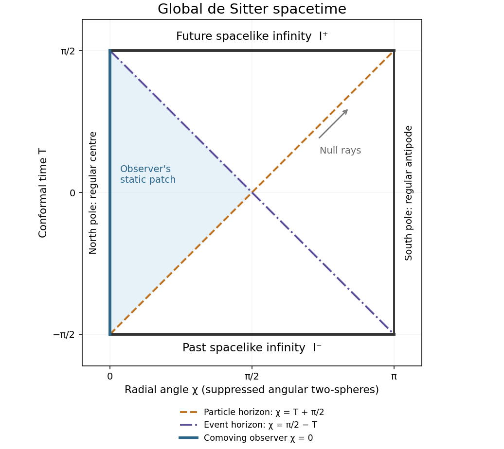

<h1 id="4/solution">Solution</h1>

↑ **Parent:** [4](../4.md)

Use the original PDF's spatial Ricci component $R_{\chi\chi}=a\ddot a+2\dot a^2+2$; the converted TeX's $2\dot a\ddot a$ is a transcription defect. Continue with $c=1$ and signature $(-,+,+,+)$. Tracing the vacuum [Einstein field equations](../../../../../einstein-field-equations.md) with a [cosmological constant](../../../../../cosmological-constant.md) gives $R=4\Lambda$, and hence $R_{ab}=\Lambda g_{ab}$. The time component therefore gives $\ddot a=(\Lambda/3)a$. Substituting this into the spatial component gives

$$
\boxed{\dot a^2+1=\frac\Lambda3a^2.}
$$

The left side is strictly positive, so **$\Lambda>0$** is necessary for a real positive closed [scale factor](../../../../../scale-factor-cosmology.md). Define $\ell=\sqrt{3/\Lambda}$. The acceleration equation has solution $a=Ae^{t/\ell}+Be^{-t/\ell}$, and the first integral fixes $4AB=\ell^2$. Taking the positive scale-factor branch and shifting the origin to the minimum gives

$$
\boxed{a(t)=\ell\cosh(t/\ell).}
$$

The universe contracts for $t<0$, has its nonzero minimum $a=\ell$ at $t=0$, and expands for $t>0$. The minimum is a smooth bounce, not a curvature singularity.

Introduce the dimensionless time $\tau=t/\ell$. Then the [closed slicing of de Sitter spacetime](../../../../../closed-slicing-of-de-sitter-spacetime.md) is

$$
ds^2=\ell^2[-d\tau^2+\cosh^2\tau\,d\Omega_3^2],\qquad
 d\Omega_3^2=d\chi^2+\sin^2\chi(d\theta^2+\sin^2\theta\,d\phi^2).
$$

One can identify it explicitly: in five-dimensional Minkowski space, set $X^0=\ell\sinh\tau$ and $X^I=\ell\cosh\tau\,n^I$, where $\sum_{I=1}^4(n^I)^2=1$. These coordinates satisfy $-(X^0)^2+\sum_I(X^I)^2=\ell^2$, and their induced metric is the one above. Thus the solution is **global [de Sitter spacetime](../../../../../de-sitter-spacetime.md)**, with spherical spatial topology and both contracting and expanding parts.

The time entering the printed compactification formula is this rescaled time. Write

$$
T=2\arctan(e^\tau)-\frac\pi2.
$$

Direct differentiation and elementary trigonometry give $dT/d\tau=\operatorname{sech}\tau$, $\sin T=\tanh\tau$ and $\cos T=\operatorname{sech}\tau$. Therefore

$$
\boxed{ds^2=\frac{\ell^2}{\cos^2T}\left[-dT^2+d\chi^2+\sin^2\chi\,d\Omega_2^2\right].}
$$

Multiplying by $(\cos T/\ell)^2$ gives the metric of a finite-time slab of the [Einstein static universe](../../../../../einstein-static-universe.md), often called the Einstein cylinder. This is a [conformal transformation](../../../../../conformal-map.md) of the metric and does not assert that the transformed matter content remains vacuum. The coordinate ranges are

$$
\boxed{-\frac\pi2<T<\frac\pi2,\quad0\leq\chi\leq\pi,\quad0\leq\theta\leq\pi,\quad\phi\in[0,2\pi).}
$$

The angular-coordinate degeneracies at the poles are the usual regular spherical ones.

Radial null lines satisfy $d\chi=\pm dT$, so the [Penrose diagram](../../../../../penrose-diagram.md) is the square displayed below. Every interior point represents an angular two-sphere. Its top and bottom are the spacelike conformal infinities $\mathcal I^+$ and $\mathcal I^-$ at $T=\pi/2$ and $T=-\pi/2$; they are excluded from the physical spacetime and are not curvature singularities. The vertical sides $\chi=0$ and $\chi=\pi$ represent the regular north and south poles of the three-sphere, not spatial edges of the universe.

**[Figure 1](#4/image-global-de-sitter-penrose-diagram-with-spacelike-conformal-infinities-and-a-comoving-observer-s-particle-and-event-horizons). Global de Sitter Penrose diagram with spacelike conformal infinities and a comoving observer's particle and event horizons**.

A [particle horizon](../../../../../particle-horizon.md) at an observer's current time bounds the comoving sources whose light could have reached that observer over the available past conformal interval. Here the cosmological past extends to $t=-\infty$, but its conformal duration is finite. For a comoving observer at $\chi=0$,

$$
\boxed{\chi_p(t)=\int_{-\infty}^t\frac{dt'}{a(t')}=T+\frac\pi2.}
$$

Since $0<\chi_p<\pi$ at every finite time, a particle horizon exists. The corresponding null boundary in the diagram is $\chi=T+\pi/2$, emerging from the observer's past endpoint at $\mathcal I^-$. The antipodal point never has enough time to send a signal received at a finite proper time.

An [observer event horizon](../../../../../observer-event-horizon.md) bounds the events that can ever send a signal to the observer's future-inextendible worldline. The remaining conformal time fixes its distance:

$$
\boxed{\chi_e(t)=\int_t^\infty\frac{dt'}{a(t')}=\frac\pi2-T.}
$$

This too lies strictly between zero and $\pi$ at finite time, so the observer has a cosmological event horizon. Its null line ends at the observer's future endpoint on $\mathcal I^+$. Both horizon spheres have areal radius $a\sin\chi=\ell$, though their comoving angular positions differ except at $T=0$. These are the [cosmological horizons in global de Sitter spacetime](../../../../../cosmological-horizons-in-global-de-sitter-spacetime.md); changing the comoving observer relocates them by an isometry.

A [Cauchy horizon](../../../../../cauchy-horizon.md) is the boundary of the domain determined by data on a chosen partial [Cauchy hypersurface](../../../../../cauchy-surface.md); beyond it an inextendible causal curve can avoid that initial surface. Each complete constant-$T$ three-sphere here is a [Cauchy hypersurface](../../../../../cauchy-surface.md). To see this directly, a causal curve in the conformal metric has spatial speed at most one when parameterized by $T$. On any finite interior time interval its path therefore has a limit in the complete compact three-sphere. If an inextendible curve stopped at an interior time, that limit would allow its continuation, a contradiction. Its time range consequently extends between both conformal ends, and monotonicity makes it cross any complete constant-$T$ sphere exactly once. Its [domain of dependence](../../../../../domain-of-dependence.md) is the entire physical spacetime.

Thus **particle and cosmological event horizons exist for every comoving observer, while the complete global Cauchy slices have no [Cauchy horizons](../../../../../cauchy-horizon.md).** Horizons of a restricted static patch or a deliberately partial initial surface are relative to that restriction; they do not alter the global Cauchy conclusion.

## ↑ Ancestors (10)

1. [4](../4.md)
2. [Paper 54](../../paper-54-split.md)
3. [Iii](../../split.md)
4. [2009](../../../split.md)
5. [Past exam of the mathematics course of the University of Cambridge](../../../../split.md)
6. [Mathematics course of the University of Cambridge](../../../../../mathematics-course-of-the-university-of-cambridge.md)
7. [Course of the University of Cambridge](../../../../../course-of-the-university-of-cambridge.md)
8. [University of Cambridge](../../../../../university-of-cambridge-split.md)
9. [List of universities](../../../../../list-of-universities.md)
10. [Codex Wiki](../../../../../split.md)
