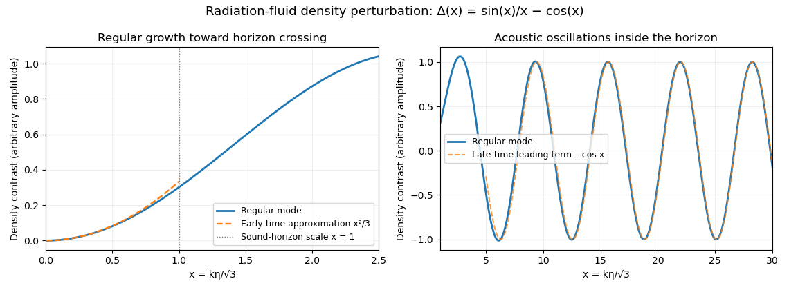

<h1 id="4/c/solution">Solution</h1>

↑ **Parent:** [C](../c.md)

For [radiation in cosmology](../../../../../../radiation-in-cosmology.md), $w=1/3$, and the Fourier mode of the [comoving-gauge density contrast](../../../../../../comoving-gauge-density-contrast.md) satisfies

$$
\Delta_k''+\left(\frac{k^2}{3}-\frac2{\eta^2}\right)\Delta_k=0.
$$

Set $x=k\eta/\sqrt3$, the ratio to the radiation [sound horizon](../../../../../../sound-horizon.md) scale. The [radiation-era comoving density mode](../../../../../../radiation-era-comoving-density-mode.md) has the exact basis

$$
\boxed{\Delta_k=A\left(\frac{\sin x}{x}-\cos x\right)
+B\left(\frac{\cos x}{x}+\sin x\right).}
$$

Direct differentiation verifies the equation. For $x\ll1$, the first function is $x^2/3+O(x^4)$ and the second is $x^{-1}+O(x)$, so the outside-horizon solutions grow as $\eta^2$ or decay as $\eta^{-1}$. Regularity at early time removes the second one: $B=0$. For $x\gg1$, the regular solution is $-A\cos x+O(x^{-1})$, a constant-amplitude acoustic oscillation. A regular mode thus grows while outside the sound horizon and oscillates after entering it.

**[Figure 1](#4/c/image-the-regular-radiation-fluid-density-mode-grows-outside-the-sound-horizon-and-oscillates-inside-it). The regular radiation-fluid density mode grows outside the sound horizon and oscillates inside it**.

The amplitude is arbitrary; the plotted mode sets $A=1$. The [radiation-era comoving density mode](../../../../../../radiation-era-comoving-density-mode.md) approaches the early-time quadratic growth and the late-time cosine shown alongside it.

## ↑ Ancestors (11)

1. [C](../c.md)
2. [4](../../4.md)
3. [Paper 55](../../../paper-55-split.md)
4. [Iii](../../../split.md)
5. [2009](../../../../split.md)
6. [Past exam of the mathematics course of the University of Cambridge](../../../../../split.md)
7. [Mathematics course of the University of Cambridge](../../../../../../mathematics-course-of-the-university-of-cambridge.md)
8. [Course of the University of Cambridge](../../../../../../course-of-the-university-of-cambridge.md)
9. [University of Cambridge](../../../../../../university-of-cambridge-split.md)
10. [List of universities](../../../../../../list-of-universities.md)
11. [Codex Wiki](../../../../../../split.md)
