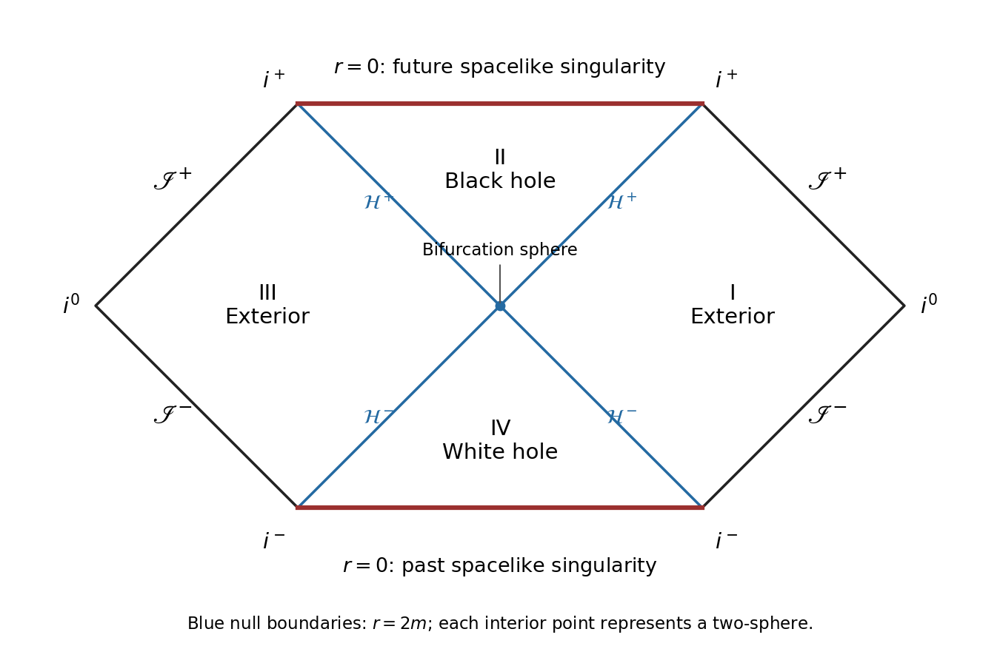

# Paper 56

↑ **Parent:** [Iii](../iii.md)

[https://www.maths.cam.ac.uk/postgrad/part-iii/files/pastpapers/2009/Paper56.pdf](https://www.maths.cam.ac.uk/postgrad/part-iii/files/pastpapers/2009/Paper56.pdf)

**Table of contents**

- [1](#1)
  - [a](#1/a)
    - [Solution](#1/a/solution)
  - [b](#1/b)
    - [Solution](#1/b/solution)
  - [c](#1/c)
    - [Solution](#1/c/solution)
  - [d](#1/d)
    - [Solution](#1/d/solution)
  - [e](#1/e)
    - [Solution](#1/e/solution)
  - [f](#1/f)
    - [Solution](#1/f/solution)
  - [g](#1/g)
    - [Solution](#1/g/solution)
- [2](#2)
  - [a](#2/a)
    - [Solution](#2/a/solution)
  - [b](#2/b)
    - [Solution](#2/b/solution)
  - [c](#2/c)
    - [i](#2/c/i)
      - [Solution](#2/c/i/solution)
    - [ii](#2/c/ii)
      - [Solution](#2/c/ii/solution)
  - [d](#2/d)
    - [i](#2/d/i)
      - [Solution](#2/d/i/solution)
    - [ii](#2/d/ii)
      - [Solution](#2/d/ii/solution)
  - [e](#2/e)
    - [Solution](#2/e/solution)
- [3](#3)
  - [a](#3/a)
    - [Solution](#3/a/solution)
  - [b](#3/b)
    - [Solution](#3/b/solution)
  - [c](#3/c)
    - [Solution](#3/c/solution)
  - [d](#3/d)
    - [i](#3/d/i)
      - [Solution](#3/d/i/solution)
    - [ii](#3/d/ii)
      - [Solution](#3/d/ii/solution)
  - [e](#3/e)
    - [Solution](#3/e/solution)
- [4](#4)
  - [a](#4/a)
    - [Solution](#4/a/solution)
  - [b](#4/b)
    - [Solution](#4/b/solution)

## 1

↑ **Parent:** [Paper 56](paper-56.md)

<h3 id="1/a">a</h3>

↑ **Parent:** [1](#1)

<h4 id="1/a/solution">Solution</h4>

↑ **Parent:** [A](#1/a)

Work in geometrized units $G=c=1$, with the stationary [Killing vector field](../../../general-relativity.md#killing-vector-field) $K=\partial_t$ normalized by $K^2\to-1$ at infinity. Put $q=2m\sinh^2\alpha$, $f=F/\sqrt H$, and $R^2=r^2\sqrt H$; $R$ is the [areal radius](../../../general-relativity.md#areal-radius). The [static spherical Komar mass in reciprocal radial gauge](../../../general-relativity.md#static-spherical-komar-mass-in-reciprocal-radial-gauge) gives

$$
M_K(r)=\frac{R^2f'}2.
$$

Indeed the future and outward unit normals to a round sphere are $n=f^{-1/2}\partial_t$ and $s=f^{1/2}\partial_r$, and $s^an^b\nabla_aK_b=-f'/2$. The [Komar mass](../../../general-relativity.md#komar-mass) integral $-(4\pi)^{-1}\int s^an^b\nabla_aK_b\,dA$ is therefore $R^2f'/2$. Since $F'=2m/r^2$ and $H'=-q/r^2$,

$$
R^2f'=2m+\frac{qF}{2H},\qquad
M_K(r)=m+\frac{qF}{4H}.
$$

Taking the asymptotic limit yields

$$
\boxed{M=m\left(1+\frac12\sinh^2\alpha\right)=\frac m2(1+\cosh^2\alpha).}
$$

This agrees with $g_{tt}=-1+(2m+q/2)/r+O(r^{-2})$. The finite-radius [Komar integral](../../../general-relativity.md#komar-charge) need not equal its asymptotic value, because this solution is not vacuum. Restoring $G$ divides the mass expression by $G$ when $m$ has dimensions of length.

<h3 id="1/b">b</h3>

↑ **Parent:** [1](#1)

<h4 id="1/b/solution">Solution</h4>

↑ **Parent:** [B](#1/b)

For radial [null geodesics](../../../special-relativity.md#null-geodesic), the radial metric is $-fdt^2+dr^2/f$. Define the [tortoise coordinate](../../../general-relativity.md#tortoise-coordinate) by

$$
\boxed{r_* =\int^r\frac{\sqrt{H(\rho)}}{F(\rho)}\,d\rho
=\int^r\frac{\sqrt{\rho(\rho+q)}}{\rho-2m}\,d\rho.}
$$

Then the radial metric becomes $f(-dt^2+dr_*^2)=-f\,du\,dv$. Its two null directions have $dt=\pm dr_*$, so $\boxed{u=t-r_*\text{ is constant on outgoing rays},\quad v=t+r_*\text{ on ingoing rays}}$ in the exterior. The radial null curves are null geodesics up to reparametrization: in the two-dimensional radial metric a null tangent's acceleration is proportional to itself, and spherical symmetry introduces no angular acceleration.

<h3 id="1/c">c</h3>

↑ **Parent:** [1](#1)

<h4 id="1/c/solution">Solution</h4>

↑ **Parent:** [C](#1/c)

Since $dt=dv-dr/f$, the inverse-$F$ radial terms cancel. The [Ingoing Eddington-Finkelstein coordinates](../../../general-relativity.md#ingoing-eddington-finkelstein-coordinates) give

$$
\boxed{ds^2=-\frac{F}{\sqrt H}\,dv^2+2\,dv\,dr+r^2\sqrt H\,d\Omega^2.}
$$

At $r=2m$, $H=1+\sinh^2\alpha=\cosh^2\alpha>0$. Thus all coefficients are analytic there, and the determinant of the $(v,r)$ metric block is $-1$, not zero. The angular area is also nonzero. This is an [analytic extension of a spacetime](../../../general-relativity.md#analytic-extension-of-a-spacetime) through the apparent [coordinate singularity](../../../general-relativity.md#coordinate-singularity), into the regular region $0<r<2m$.

<h3 id="1/d">d</h3>

↑ **Parent:** [1](#1)

<h4 id="1/d/solution">Solution</h4>

↑ **Parent:** [D](#1/d)

For an [asymptotically flat spacetime](../../../general-relativity.md#asymptotically-flat-spacetime) with [future null infinity](../../../general-relativity.md#future-null-infinity) $\mathscr I^+$, its [black-hole region](../../../general-relativity.md#black-hole) is

$$
\boxed{\mathcal B=\mathcal M\setminus J^-(\mathscr I^+),}
$$

where the [causal past](../../../general-relativity.md#causal-past) is understood in the conformal completion. Choose the future orientation in the advanced chart so that $-\partial_r$ is future null. For any future causal tangent $X$, the inequality $g(X,-\partial_r)=-X(v)\leq0$ gives $X(v)\geq0$. The causality inequality is

$$
-fX(v)^2+2X(v)X(r)+R^2\gamma_{AB}X^AX^B\leq0.
$$

If $X(v)>0$, it implies $X(r)\leq fX(v)/2$. Inside $r=2m$, $f<0$, so $r$ strictly decreases. If $X(v)=0$, the angular tangent vanishes and future orientation makes $X$ a positive multiple of $-\partial_r$, again decreasing $r$. Thus no future causal curve from $0<r<2m$ can reach the exterior or [future null infinity](../../../general-relativity.md#future-null-infinity): it is inside the [black-hole region](../../../general-relativity.md#black-hole).

Conversely, from any point with $r>2m$, the outgoing radial [null geodesic](../../../special-relativity.md#null-geodesic) has $u$ constant and $dr/dv=f/2>0$. It continues to arbitrarily large $r$, with $r_*\to+\infty$, and reaches the corresponding [future null infinity](../../../general-relativity.md#future-null-infinity). Hence $\boxed{\mathcal B\cap\{r>2m\}=\varnothing}$ in this advanced exterior chart. This argument concerns the black-hole interior covered by ingoing coordinates; the additional white-hole region of the maximal extension has a different future causal orientation.

<h3 id="1/e">e</h3>

↑ **Parent:** [1](#1)

<h4 id="1/e/solution">Solution</h4>

↑ **Parent:** [E](#1/e)

In advanced coordinates, $K=\partial_v$ is a [Killing vector field](../../../general-relativity.md#killing-vector-field) and $K^2=-f$. The normal covector to $r=2m$ is $dr$; raising it gives $g^{ar}\partial_a=\partial_v+f\partial_r$, which equals $K$ on the horizon. Thus $r=2m$ is a [null hypersurface](../../../general-relativity.md#null-hypersurface) normal to $K$, and hence a [Killing horizon](../../../general-relativity.md#killing-horizon).

The [surface gravity](../../../general-relativity.md#surface-gravity) is defined by $\nabla_KK=\kappa K$ on this horizon, equivalently $\nabla_a(K^2)=-2\kappa K_a$. Here $K_a=(-f,1,0,0)$, so the radial component gives $\kappa=f'(2m)/2$. Because $F(2m)=0$,

$$
\boxed{\kappa=\frac12\frac{F'(2m)}{\sqrt{H(2m)}}=\frac1{4m\cosh\alpha}.}
$$

It is positive for all finite real $\alpha$ and $m>0$; the stationary [Killing vector field](../../../general-relativity.md#killing-vector-field) retains its asymptotic normalization.

<h3 id="1/f">f</h3>

↑ **Parent:** [1](#1)

<h4 id="1/f/solution">Solution</h4>

↑ **Parent:** [F](#1/f)

Set $r_H=2m$. Since $f'(r_H)=2\kappa$, the integrand defining the [tortoise coordinate](../../../general-relativity.md#tortoise-coordinate) has a simple pole:

$$
r_* =\frac1{2\kappa}\log|r-r_H|+h(r),
$$

where $h$ is analytic near $r_H$. Define the [Kruskal–Szekeres coordinates](../../../general-relativity.md#kruskal-szekeres-coordinates) in the right exterior by $U=-e^{-\kappa u}$ and $V=e^{\kappa v}$. Then

$$
-UV=e^{2\kappa r_*}=(r-r_H)e^{2\kappa h(r)}.
$$

The right-hand side has positive nonzero derivative at $r_H$. Continuing this relation analytically, rather than retaining an absolute value, makes $r$ an analytic function of $UV$ through both signs. The [Kruskal extension across a simple static horizon](../../../general-relativity.md#kruskal-extension-across-a-simple-static-horizon) has metric

$$
ds^2=\frac{f(r)}{\kappa^2UV}\,dU\,dV+R(r)^2d\Omega^2.
$$

Its radial coefficient tends to $-2e^{-2\kappa h(r_H)}/\kappa$, finite and nonzero, while $R(r_H)^2=4m^2\cosh\alpha$. Therefore both null surfaces $U=0$ and $V=0$ are regular horizon branches, intersecting at a smooth two-sphere $U=V=0$.

The stationary [Killing vector field](../../../general-relativity.md#killing-vector-field) becomes

$$
\boxed{K=\kappa\bigl(V\partial_V-U\partial_U\bigr).}
$$

It is null, tangent and normal on each horizon branch and vanishes on their intersection. This proves that $r=2m$ is a [bifurcate Killing horizon](../../../general-relativity.md#bifurcate-killing-horizon), with [bifurcation surface](../../../general-relativity.md#bifurcation-surface) of area $\boxed{A_H=16\pi m^2\cosh\alpha}$. The exponential definitions specify one exterior; allowing all signs of $U,V$ supplies the remaining quadrants of the extension.

<h3 id="1/g">g</h3>

↑ **Parent:** [1](#1)

<h4 id="1/g/solution">Solution</h4>

↑ **Parent:** [G](#1/g)

There is only one zero of $f$, at $r=2m$, and the [Kruskal–Szekeres coordinates](../../../general-relativity.md#kruskal-szekeres-coordinates) give four quadrants. Both exterior quadrants have $r>2m$, while the future and past interior quadrants have $0<r<2m$. The [tortoise coordinate](../../../general-relativity.md#tortoise-coordinate) is finite at $r=0$: for $q>0$, $dr_*/dr\sim-\sqrt q\,r^{1/2}/(2m)$, and for $q=0$ it is $-r/(2m)$. Throughout each interior $g^{rr}=f<0$, so constant-$r$ hypersurfaces are spacelike. The assumed [curvature singularity](../../../general-relativity.md#curvature-singularity) at $r=0$ therefore forms a spacelike future boundary in the black-hole region and a spacelike past boundary in the white-hole region. At infinity, $f\to1$ and $R/r\to1$, giving two standard asymptotically flat ends.

The resulting [Penrose diagram](../../../general-relativity.md#penrose-diagram) is the same four-region causal diagram as the maximal [Schwarzschild spacetime](../../../general-relativity.md#schwarzschild-spacetime):

**[Figure 1](#1/g/image-maximal-extension-of-the-charged-single-horizon-geometry-with-two-exteriors-a-black-hole-a-white-hole-and-spacelike-singularities). Maximal extension of the charged single-horizon geometry, with two exteriors, a black hole, a white hole and spacelike singularities**.

Each exterior has its own [past null infinity](../../../general-relativity.md#past-null-infinity), [future null infinity](../../../general-relativity.md#future-null-infinity), spatial infinity and timelike infinities. The future and past [event horizons](../../../general-relativity.md#event-horizon) intersect on the [bifurcation surface](../../../general-relativity.md#bifurcation-surface). The diagram describes the eternal analytic solution; a spacetime formed by collapse need not contain its white-hole region or second exterior.

Unlike a nonextreme [Reissner-Nordstrom black hole](../../../general-relativity.md#reissner-nordstrom-spacetime), this electrically charged solution has **one horizon and spacelike singularities, with no inner Cauchy horizon**. A nonextreme Reissner-Nordstrom solution has two distinct horizons, including an inner [Cauchy horizon](../../../general-relativity.md#cauchy-horizon), and a timelike singularity; its ideal maximal extension contains an infinite sequence of exterior and interior blocks. Charge by itself does not determine this causal structure: the metric and field equations of the gravitational theory matter.

## 2

↑ **Parent:** [Paper 56](paper-56.md)

<h3 id="2/a">a</h3>

↑ **Parent:** [2](#2)

<h4 id="2/a/solution">Solution</h4>

↑ **Parent:** [A](#2/a)

An [asymptotically flat spacetime](../../../general-relativity.md#asymptotically-flat-spacetime) is a [stationary spacetime](../../../general-relativity.md#stationary-spacetime) if it admits a complete stationary [Killing vector field](../../../general-relativity.md#killing-vector-field) $K$, with $\mathcal L_Kg=0$, timelike near infinity and normalized there to a unit time translation. It need not remain timelike in an [ergoregion of a stationary spacetime](../../../general-relativity.md#ergoregion-of-a-stationary-spacetime). It is axisymmetric if it admits an axial [Killing vector field](../../../general-relativity.md#killing-vector-field) $\Phi$, whose flow is a rotational $U(1)$ action: its spacelike orbits away from the axis are closed with period $2\pi$, and it vanishes on the regular rotation axis. For a [stationary axisymmetric spacetime](../../../general-relativity.md#stationary-axisymmetric-spacetime), the generators can be chosen to commute, $[K,\Phi]=0$. These are geometric symmetries, not merely time-independent or angle-independent coordinate labels.

<h3 id="2/b">b</h3>

↑ **Parent:** [2](#2)

<h4 id="2/b/solution">Solution</h4>

↑ **Parent:** [B](#2/b)

During [gravitational collapse](../../../astrophysics.md#gravitational-collapse), nonspherical time-dependent multipoles can be lost in [gravitational radiation](../../../general-relativity.md#gravitational-wave) or absorbed by the forming [black hole](../../../general-relativity.md#black-hole). Matter remaining outside must ultimately escape or fall in if the final object is to be an isolated vacuum black hole. Assume that the classical exterior settles to a regular stationary asymptotically flat vacuum geometry, with a connected horizon and the regularity conditions of the [black-hole uniqueness theorem](../../../general-relativity.md#black-hole-uniqueness-theorem). This settling assumption is physical input, rather than a consequence of charge conservation alone.

For a rotating remnant, the [black-hole rigidity theorem](../../../general-relativity.md#black-hole-rigidity-theorem) supplies axial symmetry; the uniqueness theorem then identifies the exterior as [Kerr spacetime](../../../general-relativity.md#kerr-black-hole). The nonrotating equilibrium case is [Schwarzschild spacetime](../../../general-relativity.md#schwarzschild-spacetime). Gravitational radiation carries energy and angular momentum but no net [electric charge](../../../electromagnetism.md#electric-charge). In the intended neutral collapse, with no net charge carried away by expelled matter, charge conservation therefore leaves zero black-hole charge. Initial total neutrality alone would not prove this if oppositely charged matter were expelled; the two-parameter conclusion assumes the uncharged vacuum remnant just described. This leaves

$$
\boxed{M\text{ and }J,\qquad a=J/M,}
$$

as its two intrinsic continuous parameters. The final $M,J$ are what remain after escaping matter and radiation have carried off their shares; they need not equal the star's initial values. A spatial rotation may align the spin axis, and a translation or boost chooses the position and rest frame, so these do not add intrinsic parameters. All higher equilibrium multipoles are fixed by $M,J$; for example Kerr's mass quadrupole is $-J^2/M$. A regular Kerr black hole obeys $|J|\leq M^2$ in geometrized units. This is the content of the [black-hole no-hair theorem](../../../general-relativity.md#black-hole-no-hair-theorem) in vacuum general relativity, with its stated hypotheses, rather than a statement about arbitrary matter theories or an unproved guarantee of dynamical settling. Hawking evaporation is ignored in this classical late-time equilibrium description.

<h3 id="2/c">c</h3>

↑ **Parent:** [2](#2)

<h4 id="2/c/i">i</h4>

↑ **Parent:** [C](#2/c)

<h5 id="2/c/i/solution">Solution</h5>

↑ **Parent:** [I](#2/c/i)

The conserved [Killing energy](../../../general-relativity.md#killing-energy) of a geodesic tangent $p^a$ is $E=-K_ap^a$, where $K=\partial_t$. Conservation follows from $p^a\nabla_ap^b=0$ and the [Killing equation](../../../general-relativity.md#killing-equation). For the [Kerr metric](../../../general-relativity.md#kerr-metric), $K^2=g_{tt}=-(1-2Mr/\Sigma)$. Outside the outer [Kerr ergoregion](../../../general-relativity.md#kerr-ergoregion), $K$ is timelike. Its orthogonal complement is positive definite, so a nonzero causal vector cannot have $K\cdot p=0$. Equivalently, if both are future-directed, $-K\cdot p>0$. Hence

$$
\boxed{E=0\ \Longrightarrow\ \text{the causal geodesic cannot enter }r>r_e(\theta),\quad
r_e=M+\sqrt{M^2-a^2\cos^2\theta}.}
$$

This excludes the open exterior of the stationary-limit surface; on the surface itself a zero-energy null tangent can be proportional to the null stationary vector.

<h4 id="2/c/ii">ii</h4>

↑ **Parent:** [C](#2/c)

<h5 id="2/c/ii/solution">Solution</h5>

↑ **Parent:** [Ii](#2/c/ii)

A [Killing horizon](../../../general-relativity.md#killing-horizon) must be a null hypersurface whose normal is a [Killing vector field](../../../general-relativity.md#killing-vector-field). The outer stationary-limit surface instead has $s=r-r_e(\theta)=0$ and, in [Boyer-Lindquist coordinates](../../../general-relativity.md#boyer-lindquist-coordinates),

$$
g^{ab}\partial_as\,\partial_bs=\frac{\Delta(r_e)+[r_e'(\theta)]^2}{\Sigma}.
$$

On it, $r_e^2-2Mr_e+a^2\cos^2\theta=0$, so $\Delta(r_e)=a^2\sin^2\theta>0$ away from the rotation axis. Its normal is spacelike and the surface timelike. Thus the [Kerr stationary-limit surface is generically timelike](../../../general-relativity.md#kerr-stationary-limit-surface-is-generically-timelike) and **is not a Killing horizon**, despite $K^2=0$ there. For example its stationary null vector is not normal, since $g(K,\partial_\phi)=-2Mar\sin^2\theta/\Sigma\ne0$ away from the axis. The actual outer [Killing horizon](../../../general-relativity.md#killing-horizon) is $r=r_+=M+\sqrt{M^2-a^2}$, generated by $K+\Omega_H\Phi$, with [Kerr horizon angular velocity](../../../general-relativity.md#kerr-horizon-angular-velocity) $\Omega_H=a/(r_+^2+a^2)$. The two surfaces meet on the axis, which does not make the entire stationary-limit surface null.

<h3 id="2/d">d</h3>

↑ **Parent:** [2](#2)

<h4 id="2/d/i">i</h4>

↑ **Parent:** [D](#2/d)

<h5 id="2/d/i/solution">Solution</h5>

↑ **Parent:** [I](#2/d/i)

For the superextreme [Kerr metric](../../../general-relativity.md#kerr-metric),

$$
\Delta=(r-M)^2+a^2-M^2>0
$$

for all real $r$, so there are no coordinate singularities at horizon roots. The only stipulated [curvature singularity](../../../general-relativity.md#curvature-singularity) is $\Sigma=0$, which forces $r=0$, $\theta=\pi/2$. In the supplied Cartesian coordinates this is the [Kerr ring singularity](../../../general-relativity.md#kerr-ring-singularity) $x^2+y^2=a^2$, $z=0$.

Write $\rho^2=x^2+y^2$. The coordinate transformation implies

$$
\rho^2=(r^2+a^2)\sin^2\theta,\qquad z=r\cos\theta,
$$

and hence

$$
r^4-(\rho^2+z^2-a^2)r^2-a^2z^2=0.
$$

The positive-radius Cartesian sheet uses

$$
r^2=\frac12\left[\rho^2+z^2-a^2+
\sqrt{(\rho^2+z^2-a^2)^2+4a^2z^2}\right],\qquad r\geq0.
$$

Its zero set is the disk $z=0$, $\rho\leq a$. At an interior disk point, $\rho<a$, one has $\cos\theta\ne0$, so $\Sigma=a^2\cos^2\theta>0$. The disk interior is therefore not a singularity: in signed $(r,\theta,\phi)$ coordinates, the metric is analytic through $r=0$. In particular, $g_{rr}=\Sigma/\Delta$ is finite and the metric determinant $-\Sigma^2\sin^2\theta$ is nonzero away from the ordinary polar coordinate axis. The polar axes are regular using Cartesian angular charts and $2\pi$ periodicity.

The required [two-sheeted extension of superextremal Kerr spacetime](../../../general-relativity.md#two-sheeted-extension-of-superextremal-kerr-spacetime) is constructed by taking a second Cartesian sheet with the negative root $r\leq0$, cutting both sheets along the disk, and gluing the upper bank of one to the lower bank of the other, and conversely. Signed $r$ then passes continuously through zero as the disk is crossed. The ring is omitted. A useful check near an interior disk point is

$$
z=r\cos\theta,\qquad \cos^2\theta\big|_{r=0}=1-\rho^2/a^2>0,
$$

so signed $r$ is a smooth transverse coordinate there. The apparent factors $z/r$ in the Cartesian metric represent $\cos\theta$ and have regular signed-coordinate limits; they do not justify deleting the whole disk. Identifying the two signs of $r$ on a single Cartesian copy would also identify two physically different metric values, since the Kerr-Schild coefficient changes sign.

Continue the two sheets out to $r\to\pm\infty$. Both ends are asymptotically flat; at the negative-radius end the mass term has the opposite sign, as $g_{tt}=-1+2M/r+O(r^{-2})$. There are no further finite-radius horizon boundaries requiring additional blocks. Removing only the curvature-singular ring, and removing coordinate artifacts with the charts described above, gives the standard maximal analytic extension. The ring cannot be filled by an analytic nondegenerate metric because its curvature diverges. This extension is not globally hyperbolic; analyticity of an extension should not be confused with unique evolution from Cauchy data.

<h4 id="2/d/ii">ii</h4>

↑ **Parent:** [D](#2/d)

<h5 id="2/d/ii/solution">Solution</h5>

↑ **Parent:** [Ii](#2/d/ii)

On the equatorial plane, the [Kerr metric](../../../general-relativity.md#kerr-metric) coefficient simplifies to

$$
g_{\phi\phi}=\frac{(r^2+a^2)^2-a^2\Delta}{r^2}
=r^2+a^2+\frac{2Ma^2}{r}.
$$

Put $r=-\varepsilon$ on the negative-radius sheet. Then $g_{\phi\phi}=\varepsilon^2+a^2-2Ma^2/\varepsilon<0$ for all sufficiently small $\varepsilon>0$. The curve

$$
\boxed{t=t_0,\quad r=-\varepsilon,\quad\theta=\pi/2,\quad
\phi\in[0,2\pi],}
$$

is a [closed timelike curve](../../../general-relativity.md#closed-timelike-curve), since its tangent is $\partial_\phi$ and the angular coordinate is periodic. It never meets the ring at $r=0$. These are the [closed timelike circles in negative-radius Kerr spacetime](../../../general-relativity.md#closed-timelike-circles-in-negative-radius-kerr-spacetime); they need not be geodesics. Along them $\widetilde t$ is also constant, because its difference from $t$ depends only on $r$.

<h3 id="2/e">e</h3>

↑ **Parent:** [2](#2)

<h4 id="2/e/solution">Solution</h4>

↑ **Parent:** [E](#2/e)

For $0<M<a$, the ring is a [naked singularity](../../../general-relativity.md#naked-singularity) and there is no event horizon shielding the extension's [closed timelike curves](../../../general-relativity.md#closed-timelike-curve). The [weak cosmic censorship conjecture](../../../general-relativity.md#weak-cosmic-censorship-conjecture) predicts that such superextreme Kerr geometries are not formed by generic collapse of regular isolated initial data satisfying the appropriate energy conditions. This is a conjectural physical restriction, not a proof from the exact metric alone.

For $M>a>0$, the [closed timelike curves](../../../general-relativity.md#closed-timelike-curve) lie deep inside the ideal analytic extension, beyond the inner [Cauchy horizon](../../../general-relativity.md#cauchy-horizon), so weak cosmic censorship does not itself exclude them. However, that inner horizon is unstable to perturbations, with [mass inflation](../../../general-relativity.md#mass-inflation) expected in realistic collapse. The [strong cosmic censorship conjecture](../../../general-relativity.md#strong-cosmic-censorship-conjecture) is the relevant obstruction to a regular continuation into the ideal chronology-violating region. Thus the exact Kerr extension exhibits such curves mathematically, but neither regular collapse nor the uniqueness theorem establishes that they occur in Nature.

## 3

↑ **Parent:** [Paper 56](paper-56.md)

<h3 id="3/a">a</h3>

↑ **Parent:** [3](#3)

<h4 id="3/a/solution">Solution</h4>

↑ **Parent:** [A](#3/a)

A [null geodesic congruence](../../../geodesic-congruence.md#null-geodesic-congruence) is a smooth family of null geodesics filling a region, with one curve through each point before caustics form. Choose an affine parameter $\lambda$ and tangent $U^a$, so $U^2=0$ and $\nabla_UU=0$. Choose a null partner $N^a$ with $U\cdot N=-1$, transported parallel to $U$ along each generator. The [screen-space projector](../../../geodesic-congruence.md#screen-space-projector)

$$
P^a{}_b=\delta^a{}_b+U^aN_b+N^aU_b
$$

projects onto the positive-definite two-dimensional plane transverse to $U,N$. Define the [optical tensor](../../../geodesic-congruence.md#optical-tensor) and its decomposition by

$$
\widehat B_{ab}=P_a{}^cP_b{}^d\nabla_dU_c
=\frac12\theta P_{ab}+\widehat\sigma_{ab}+\widehat\omega_{ab},
$$

where

$$
\boxed{\theta=P^{ab}\widehat B_{ab},\quad
\widehat\sigma_{ab}=\widehat B_{(ab)}-\tfrac12\theta P_{ab},\quad
\widehat\omega_{ab}=\widehat B_{[ab]}.}
$$

These are respectively the [null expansion](../../../geodesic-congruence.md#null-expansion), [null shear](../../../geodesic-congruence.md#null-shear) and [null twist](../../../geodesic-congruence.md#null-twist), the latter also called rotation. In the [Null Raychaudhuri equation](../../../geodesic-congruence.md#null-raychaudhuri-equation), $\widehat\sigma^2=\widehat\sigma_{ab}\widehat\sigma^{ab}$ and $\widehat\omega^2=\widehat\omega_{ab}\widehat\omega^{ab}$ use the screen metric. The trace convention for $\theta$ is important: it is not half the trace. For an affine null tangent it also equals $\nabla_aU^a$.

<h3 id="3/b">b</h3>

↑ **Parent:** [3](#3)

<h4 id="3/b/solution">Solution</h4>

↑ **Parent:** [B](#3/b)

The [Frobenius theorem](../../../differential-geometry.md#frobenius-theorem) says that [hypersurface orthogonality](../../../differential-geometry.md#hypersurface-orthogonality) of the nonzero covector $U_a$ is equivalent to $U_{[a}\nabla_bU_{c]}=0$, or locally $U_a=h\nabla_aS$ for some nonzero $h$. This immediately makes the screen projection of $\nabla_{[b}U_{a]}$ zero, since its antisymmetric part is a wedge product with $\nabla S$, which is proportional to $U$. Thus hypersurface orthogonality gives zero [null twist](../../../geodesic-congruence.md#null-twist).

For the converse, put $B_{ab}=\nabla_bU_a$. Nullness gives $U^aB_{ab}=\tfrac12\nabla_b(U^2)=0$, and the affine geodesic equation gives $B_{ab}U^b=0$. Resolve both tensor slots in the basis consisting of $U,N$ and the screen. These two identities exclude covector factors of $N$. Consequently

$$
B_{[ab]}=\widehat\omega_{ab}+U_{[a}q_{b]}
$$

for some covector $q$. If $\widehat\omega=0$, wedging this identity with $U$ makes $U_{[a}\nabla_bU_{c]}=0$. Applying [Frobenius theorem](../../../differential-geometry.md#frobenius-theorem) completes the proof:

$$
\boxed{\widehat\omega_{ab}=0\iff\text{the null geodesic congruence is hypersurface-orthogonal}.}
$$

This is the [null twist vanishes exactly for hypersurface-orthogonal geodesics](../../../geodesic-congruence.md#null-twist-vanishes-exactly-for-hypersurface-orthogonal-geodesics) criterion; the geodesic assumption ensures that the screen criterion implies the full Frobenius condition. The resulting hypersurfaces are null, and the congruence follows their null generators.

<h3 id="3/c">c</h3>

↑ **Parent:** [3](#3)

<h4 id="3/c/solution">Solution</h4>

↑ **Parent:** [C](#3/c)

Transport two connecting vectors between neighbouring rays so that they commute with $U$, and project them onto the screen. Their infinitesimal transverse lengths and angles evolve according to the symmetric part of the [optical tensor](../../../geodesic-congruence.md#optical-tensor). The trace part gives uniform fractional dilation, while the trace-free [null shear](../../../geodesic-congruence.md#null-shear) stretches one transverse direction and contracts the other, changing a circular beam to an ellipse without changing its area to first order. With zero [null twist](../../../geodesic-congruence.md#null-twist), there is no antisymmetric rotation of the beam.

If $q_{AB}$ is the metric on an infinitesimal transverse element, then $dq_{AB}/d\lambda=2\widehat B_{(AB)}$. Its area $A$ therefore obeys

$$
\boxed{\frac1A\frac{dA}{d\lambda}=\frac12q^{AB}\frac{dq_{AB}}{d\lambda}=\theta.}
$$

Thus positive [null expansion](../../../geodesic-congruence.md#null-expansion) means a beam's cross-sectional area increases, and negative expansion means it decreases; [null shear](../../../geodesic-congruence.md#null-shear) records the directional distortion rather than this overall area change.

<h3 id="3/d">d</h3>

↑ **Parent:** [3](#3)

<h4 id="3/d/i">i</h4>

↑ **Parent:** [D](#3/d)

<h5 id="3/d/i/solution">Solution</h5>

↑ **Parent:** [I](#3/d/i)

Write the [Schwarzschild metric](../../../general-relativity.md#schwarzschild-spacetime) in [Ingoing Eddington-Finkelstein coordinates](../../../general-relativity.md#ingoing-eddington-finkelstein-coordinates) as $ds^2=-f\,dv^2+2dv\,dr+r^2d\Omega^2$, with $f=1-2M/r$. Ingoing radial [null geodesics](../../../special-relativity.md#null-geodesic) have $v,\theta,\phi$ constant. Since $\Gamma^a{}_{rr}=0$, choose their future affine tangent $U=-E\partial_r$, where $E>0$ is constant along a ray; a common normalization sets $E=1$. The [parallel null partner for ingoing Schwarzschild rays](../../../geodesic-congruence.md#parallel-null-partner-for-ingoing-schwarzschild-rays) is

$$
\boxed{N=\frac1E\left(\partial_v+\frac f2\partial_r\right).}
$$

The radial conditions give $U\cdot N=-EN^v=-1$ and $N^2=-f/E^2+2(E^{-1})(f/(2E))=0$. Parallel transport can be checked explicitly: $\Gamma^v{}_{rv}=0$ and $\Gamma^r{}_{rv}=-f'/2$, so

$$
\nabla_rN^v=0,\qquad
\nabla_rN^r=\frac{f'}{2E}-\frac{f'}2\frac1E=0,
$$

with angular components also zero. Thus $\nabla_UN=0$. The field is regular at $r=2M$ and throughout the regular advanced chart $r>0$; no vector field can be defined at the curvature-singular endpoint. If the affine normalization differs between rays, the same formula works for $E$ constant along each ray, since $\partial_rE=0$.

<h4 id="3/d/ii">ii</h4>

↑ **Parent:** [D](#3/d)

<h5 id="3/d/ii/solution">Solution</h5>

↑ **Parent:** [Ii](#3/d/ii)

For the radial null pair above, the [screen-space projector](../../../geodesic-congruence.md#screen-space-projector) selects the angular tangent plane, with metric $q_{AB}=r^2\gamma_{AB}$. The ingoing covector is $U_a=-E(dv)_a$, and $\Gamma^v{}_{AB}=-r\gamma_{AB}$. Hence the [optical tensor](../../../geodesic-congruence.md#optical-tensor) is

$$
\widehat B_{AB}=\nabla_BU_A=-Er\gamma_{AB}=-\frac Erq_{AB}.
$$

It is purely symmetric and proportional to the screen metric, giving

$$
\boxed{\theta=-\frac{2E}{r},\qquad\widehat\sigma_{ab}=0,\qquad\widehat\omega_{ab}=0.}
$$

For $E=1$, the [null expansion](../../../geodesic-congruence.md#null-expansion) is $-2/r$. The area check $A\propto r^2$ and $dr/d\lambda=-E$ gives $A'/A=-2E/r$, in agreement with the [spherical null expansion in ingoing coordinates](../../../geodesic-congruence.md#spherical-null-expansion-in-ingoing-coordinates). In vacuum, $d\theta/d\lambda=-2E^2/r^2=-\theta^2/2$ also satisfies the [Null Raychaudhuri equation](../../../geodesic-congruence.md#null-raychaudhuri-equation); the ingoing beam focuses at the singularity rather than remaining future complete.

<h3 id="3/e">e</h3>

↑ **Parent:** [3](#3)

<h4 id="3/e/solution">Solution</h4>

↑ **Parent:** [E](#3/e)

The [second law of black-hole mechanics](../../../general-relativity.md#second-law-of-black-hole-mechanics) states that the total area of a classical future [event horizon](../../../general-relativity.md#event-horizon) cannot decrease toward the future, under the appropriate causal and energy assumptions. Use the [null convergence condition](../../../general-relativity.md#null-convergence-condition) $R_{ab}U^aU^b\geq0$; in general relativity the [Einstein field equations](../../../general-relativity.md#einstein-field-equations) imply it from the [null energy condition](../../../general-relativity.md#null-energy-condition). Assume, as allowed here, that the horizon's null generators remain on the horizon and are complete to the future. The horizon is an [achronal boundary](../../../general-relativity.md#achronal-boundary), and its smooth generators are hypersurface-orthogonal, so their [null twist](../../../geodesic-congruence.md#null-twist) is zero. The [Null Raychaudhuri equation](../../../geodesic-congruence.md#null-raychaudhuri-equation) therefore gives

$$
\frac{d\theta}{d\lambda}=-\frac12\theta^2-\widehat\sigma^2-R_{ab}U^aU^b
\leq-\frac12\theta^2.
$$

If some smooth horizon point had $\theta_0<0$, then while the optical description remains regular, $\theta$ stays negative and

$$
\frac{d}{d\lambda}\frac1\theta=-\frac{\theta'}{\theta^2}\geq\frac12.
$$

Thus

$$
\theta(\lambda)\leq\frac{\theta_0}{1+\tfrac12\theta_0(\lambda-\lambda_0)},
$$

forcing focusing no later than $\lambda_0+2/|\theta_0|$.

The assumed geometrical result is that this focusing produces a [conjugate point to a spacelike surface](../../../geodesic-congruence.md#conjugate-point-to-a-spacelike-surface), namely a focal point relative to a small spacelike horizon cross-section through the original point. A null geodesic beyond such a focal point ceases to generate an achronal boundary: a timelike variation connects the cross-section to points just beyond it. Since the cross-section and the generator lie on the achronal horizon, this is impossible. Future completeness ensures that a singular endpoint cannot terminate the generator before the finite focusing parameter. This [future-complete horizon focusing proof of the area theorem](../../../general-relativity.md#future-complete-horizon-focusing-proof-of-the-area-theorem) rules out $\theta_0<0$.

Therefore $\theta\geq0$ on smooth horizon pieces, and the transverse-area identity gives

$$
\boxed{\frac{dA}{d\lambda}=\theta A\geq0.}
$$

Integrating over generators proves area nondecrease between later cross-sections. At crease sets, new generators may enter the horizon from the past, adding area; horizon generators do not leave it toward the future under the stated assumptions. Hence the statement also applies to total horizon area through black-hole mergers. [Hawking's area theorem](../../../general-relativity.md#hawking-s-area-theorem) is classical: quantum stress-energy can violate the null energy condition, so it does not forbid a shrinking evaporating black hole.

## 4

↑ **Parent:** [Paper 56](paper-56.md)

<h3 id="4/a">a</h3>

↑ **Parent:** [4](#4)

<h4 id="4/a/solution">Solution</h4>

↑ **Parent:** [A](#4/a)

Use a real free [Klein-Gordon field](../../../quantum-field-theory.md#klein-gordon-field) on a prescribed four-dimensional [globally hyperbolic spacetime](../../../general-relativity.md#globally-hyperbolic-spacetime), with signature $(-+++)$ and $\hbar=c=1$. A mass $\mu$ and curvature coupling $\xi$ give the quadratic action

$$
S[\phi]=-\frac12\int d^4x\sqrt{-g}\left(g^{ab}\nabla_a\phi\nabla_b\phi+(\mu^2+\xi R)\phi^2\right),
$$

and the field equation $\boxed{(\Box-\mu^2-\xi R)\phi=0}$. Minimal coupling is $\xi=0$; for a massless scalar in four dimensions, conformal coupling is $\xi=1/6$. [Global hyperbolicity](../../../general-relativity.md#globally-hyperbolic-spacetime) supplies a [Cauchy hypersurface](../../../general-relativity.md#cauchy-surface) $\Sigma$ and a well-posed initial-value problem: suitable data $(\phi,n^a\nabla_a\phi)$ on $\Sigma$ determine a unique solution. One assumes appropriate support or decay conditions so no unaccounted flux crosses spatial infinity. The geometry is classical here; quantum backreaction is a further problem.

The real solution space has the conserved [symplectic form on scalar-field solutions](../../../quantum-field-theory.md#symplectic-form-on-scalar-field-solutions)

$$
\Omega(\phi_1,\phi_2)=\int_\Sigma
(\phi_1n^a\nabla_a\phi_2-\phi_2n^a\nabla_a\phi_1)\,d\Sigma.
$$

Its complexification defines the [Klein-Gordon inner product](../../../quantum-field-theory.md#klein-gordon-inner-product)

$$
(u,v)_{KG}=i\int_\Sigma n^a(u^*\nabla_av-v\nabla_au^*)\,d\Sigma.
$$

The divergence of its current is $i(u^*\Box v-v\Box u^*)=0$ by the field equation, proving independence of the chosen [Cauchy hypersurface](../../../general-relativity.md#cauchy-surface). This Hermitian form is not positive definite on the whole complex solution space: conjugating a solution reverses its norm.

Choose a complete positive-norm mode space and basis $u_i$ satisfying

$$
(u_i,u_j)_{KG}=\delta_{ij},\qquad
(u_i^*,u_j^*)_{KG}=-\delta_{ij},\qquad
(u_i,u_j^*)_{KG}=0.
$$

Here completeness means that every real solution expands in these modes and their conjugates. Equivalently, one chooses a compatible [complex structure on the Klein-Gordon solution space](../../../quantum-field-theory.md#complex-structure-on-the-klein-gordon-solution-space); this is extra data, not fixed by the field equation. Quantization replaces the mode coefficients by [annihilation operators](../../../quantum-mechanics.md#annihilation-operator) and [creation operators](../../../quantum-mechanics.md#creation-operator):

$$
\widehat\phi(x)=\sum_i\bigl(a_i u_i(x)+a_i^\dagger u_i(x)^*\bigr),\qquad
\boxed{[a_i,a_j^\dagger]=\delta_{ij},\quad[a_i,a_j]=0.}
$$

In a foliation with induced metric determinant $h$, the canonical momentum is $\pi=\sqrt h\,n^a\nabla_a\phi$. The normalized complete mode expansion implements the equal-time [canonical commutation relations](../../../quantum-mechanics.md#canonical-commutation-relation) $[\widehat\phi(x),\widehat\pi(y)]=i\delta^3(x-y)$ and vanishing field-field and momentum-momentum commutators on $\Sigma$. Propagation by the field equation gives [microcausality](../../../relativistic-quantum-field.md#microcausality): field observables commute at spacelike separation. Thus there is a local quantum field theory before one has selected a particle interpretation.

The chosen positive-mode space completes to a one-particle [Hilbert space](../../../hilbert-space.md) $\mathcal H_1$. Its [bosonic Fock space](../../../quantum-field-theory.md#bosonic-fock-space) is $\bigoplus_{n=0}^\infty\operatorname{Sym}^n\mathcal H_1$. The [Fock vacuum](../../../quantum-field-theory.md#fock-vacuum) obeys $a_i|0\rangle=0$; acting with $a_i^\dagger$ produces multiparticle states, and $N_i=a_i^\dagger a_i$ counts particles in mode $i$. The vacuum two-point function is $W(x,y)=\sum_i u_i(x)u_i(y)^*$. The [Hadamard condition](../../../quantum-field-theory.md#hadamard-condition) restricts physically admissible states by prescribing their local short-distance singularity; it permits renormalization of the [stress-energy tensor](../../../general-relativity.md#stress-energy-tensor) but does not select one unique vacuum.

The particle ambiguity is that there is generally no distinguished choice of positive-mode space. A second complete normalized basis can be

$$
v_i=\sum_j(\alpha_{ij}u_j+\beta_{ij}u_j^*).
$$

The [Bogoliubov transformation](../../../quantum-field-theory.md#bogoliubov-transformation) preserves the mode normalization precisely when

$$
\alpha\alpha^\dagger-\beta\beta^\dagger=I,\qquad
\alpha\beta^T-\beta\alpha^T=0.
$$

Its operators obey $b_i=(v_i,\widehat\phi)_{KG}=\sum_j(\alpha_{ij}^*a_j-\beta_{ij}^*a_j^\dagger)$. Consequently a state with no $a$-particles generally has $b$-particles if $\beta\ne0$. A unitary change of basis within the same positive-mode space has $\beta=0$ and merely relabels modes; a change mixing the positive and negative subspaces changes the vacuum and particle notion. Arbitrary coordinates called “time” do not resolve this choice. This is the [vacuum ambiguity in a nonstationary spacetime](../../../quantum-field-theory.md#vacuum-ambiguity-in-a-nonstationary-spacetime), while the field equation and local commutator remain unchanged.

In the standard stationary setting, a complete future-directed timelike [Killing vector field](../../../general-relativity.md#killing-vector-field) $K$ generates a time-translation symmetry. With a stable positive energy operator and suitable boundary conditions, choose [positive-frequency solutions](../../../quantum-field-theory.md#positive-frequency-solution) by

$$
i\mathcal L_Ku_\omega=\omega u_\omega,\qquad\omega>0.
$$

The [positive stationary Hamiltonian selects a particle splitting](../../../quantum-field-theory.md#positive-stationary-hamiltonian-selects-a-particle-splitting): positive spectral modes define annihilation operators, and the normal-ordered Hamiltonian is $H_K=\sum_i\omega_i a_i^\dagger a_i$. Its ground state is the [vacuum state in a stationary spacetime](../../../quantum-field-theory.md#vacuum-state-in-a-stationary-spacetime). The Killing symmetry transports this splitting unchanged, so no positive-negative mixing is induced by stationary evolution. Degeneracies allow unitary basis changes without changing the vacuum. Stationarity fixes the ground-state particle interpretation relative to this time flow; it does not forbid excited or thermal states.

The qualification is that asymptotic stationarity alone, in the sense used for a Kerr exterior, is insufficient for a global positive-energy construction: $K$ becomes spacelike in an [ergoregion of a stationary spacetime](../../../general-relativity.md#ergoregion-of-a-stationary-spacetime). The usual unambiguous construction applies to a [strictly stationary spacetime](../../../general-relativity.md#strictly-stationary-spacetime) with the stated stability and spectral assumptions, or to appropriate stationary asymptotic regions for scattering. Zero modes or instability need separate treatment. Likewise different observer time flows on different regions need not define the same particles.

For [particle creation by a nonstationary spacetime](../../../quantum-field-theory.md#particle-creation-by-a-nonstationary-spacetime), choose normalized positive-frequency modes $u_j^{\rm in}$ in the stationary early region and $u_i^{\rm out}$ in the stationary late region. Propagate both sets by the [Klein-Gordon equation](../../../wave-equation.md#klein-gordon-equation) through the intermediate time-dependent geometry. Compute their overlaps on any common [Cauchy hypersurface](../../../general-relativity.md#cauchy-surface):

$$
u_i^{\rm out}=\sum_j\left(\alpha_{ij}u_j^{\rm in}+\beta_{ij}u_j^{{\rm in}*}\right),\qquad
\alpha_{ij}=(u_j^{\rm in},u_i^{\rm out})_{KG},\quad
\beta_{ij}=-(u_j^{{\rm in}*},u_i^{\rm out})_{KG}.
$$

The initial [in-vacuum](../../../quantum-field-theory.md#in-vacuum) has $a_j^{\rm in}|0_{\rm in}\rangle=0$. Since $a_i^{\rm out}=\sum_j(\alpha_{ij}^*a_j^{\rm in}-\beta_{ij}^*a_j^{{\rm in}\dagger})$, contracting the in operators yields the [particle number from Bogoliubov coefficients](../../../quantum-field-theory.md#particle-number-from-bogoliubov-coefficients):

$$
\boxed{\langle0_{\rm in}|N_i^{\rm out}|0_{\rm in}\rangle
=\sum_j|\beta_{ij}|^2,\qquad
\langle N_{\rm out}\rangle=\sum_{i,j}|\beta_{ij}|^2.}
$$

Thus the procedure is to fix asymptotic mode choices, solve the classical wave equation, project using the conserved inner product, and take squared negative-frequency overlaps. Particle energy comes from the time-dependent background, so particle creation does not contradict the linear deterministic field equation. For an initial state diagonal in in-mode occupation numbers $n_j$, with no anomalous correlations, the more general expectation is $\sum_j[|\alpha_{ij}|^2n_j+|\beta_{ij}|^2(n_j+1)]$.

For continuous spectra, sums become integrals and normalized wave packets avoid meaningless squares of delta functions. A finite total count requires the appropriate convergence of the double sum or integral. The [bosonic mode mixing implementability](../../../quantum-field-theory.md#bosonic-mode-mixing-implementability) condition is that $\beta$ be Hilbert-Schmidt; otherwise the two Fock representations need not be unitarily equivalent, even though the local field algebra and finite-mode particle calculations still make sense. This distinction between deterministic field evolution and a chosen representation is essential to [quantum field theory in curved spacetime](../../../quantum-field-theory.md#quantum-field-theory-in-curved-spacetime).

<h3 id="4/b">b</h3>

↑ **Parent:** [4](#4)

<h4 id="4/b/solution">Solution</h4>

↑ **Parent:** [B](#4/b)

Classically, the [laws of thermodynamics](../../../thermodynamics.md#laws-of-thermodynamics) and [black-hole thermodynamics](../../../general-relativity.md#black-hole-thermodynamics) have parallel structures, but an ordinary black hole absorbs and does not emit: its temperature would appear to be zero, despite nonzero [surface gravity](../../../general-relativity.md#surface-gravity). [Hawking radiation](../../../general-relativity.md#hawking-radiation) changes this by giving an actual temperature measurable from a thermal particle spectrum. In units $G=\hbar=c=k_B=1$,

$$
\boxed{T_H=\frac\kappa{2\pi}.}
$$

Scattering through the exterior modifies the observed flux by [greybody factors](../../../general-relativity.md#greybody-factor); for rotation and charge the occupation involves $\omega-m_\phi\Omega_H-q\Phi_H$. These transmission and chemical-potential factors do not change the underlying Hawking temperature.

The [Zeroth law of black-hole mechanics](../../../general-relativity.md#zeroth-law-of-black-hole-mechanics) makes $\kappa$ constant on a stationary horizon, so it gives a uniform equilibrium temperature, matching the [zeroth law of thermodynamics](../../../thermodynamics.md#zeroth-law-of-thermodynamics). The full [First law of black-hole mechanics](../../../general-relativity.md#first-law-of-black-hole-mechanics) is

$$
dM=\frac\kappa{8\pi}\,dA+\Omega_H\,dJ+\Phi_H\,dQ.
$$

Comparing it with $dE=T\,dS+\Omega\,dJ+\Phi\,dQ$ and using the actual Hawking temperature fixes

$$
\boxed{S_{BH}=\frac A4,\qquad
dM=T_H\,dS_{BH}+\Omega_H\,dJ+\Phi_H\,dQ.}
$$

With constants restored, $S_{BH}=k_Bc^3A/(4G\hbar)$. If $\kappa$ is defined geometrically with dimensions of inverse length, $T_H=\hbar c\kappa/(2\pi k_B)$; if surface gravity is expressed as an acceleration, the equivalent formula is $\hbar\kappa/(2\pi c k_B)$. The first-law comparison fixes entropy up to an additive constant. This is the [Bekenstein-Hawking entropy](../../../general-relativity.md#bekenstein-hawking-entropy), so the mechanical analogy becomes a quantitative thermodynamic identification, including its normalization.

The classical [second law of black-hole mechanics](../../../general-relativity.md#second-law-of-black-hole-mechanics) then corresponds to increasing black-hole entropy. Quantum evaporation can reduce $A$, because the classical energy-condition hypotheses fail, while outgoing radiation carries entropy. The appropriate thermodynamic statement is the [generalized second law](../../../general-relativity.md#generalized-second-law),

$$
\boxed{S_{\rm gen}=S_{BH}+S_{\rm outside}\text{ does not decrease}.}
$$

Finally, the [third law of black-hole mechanics](../../../general-relativity.md#third-law-of-black-hole-mechanics), that zero surface gravity cannot be achieved by a finite physical process under its regularity assumptions, becomes the unattainability of zero temperature. It does not assert the Nernst entropy formulation: an extremal horizon can have nonzero area. Hawking radiation supplies the physical temperature, the first law fixes entropy, and the generalized second law includes both the black hole and its exterior matter.

## ↑ Ancestors (8)

1. [Iii](../iii.md)
2. [2009](../../2009.md)
3. [Past exam of the mathematics course of the University of Cambridge](../../../past-exam-of-the-mathematics-course-of-the-university-of-cambridge.md)
4. [Mathematics course of the University of Cambridge](../../../university-of-cambridge.md#mathematics-course-of-the-university-of-cambridge)
5. [Course of the University of Cambridge](../../../university-of-cambridge.md#course-of-the-university-of-cambridge)
6. [University of Cambridge](../../../university-of-cambridge.md)
7. [List of universities](../../../README.md#list-of-universities)
8. [Codex Wiki](../../../README.md)
