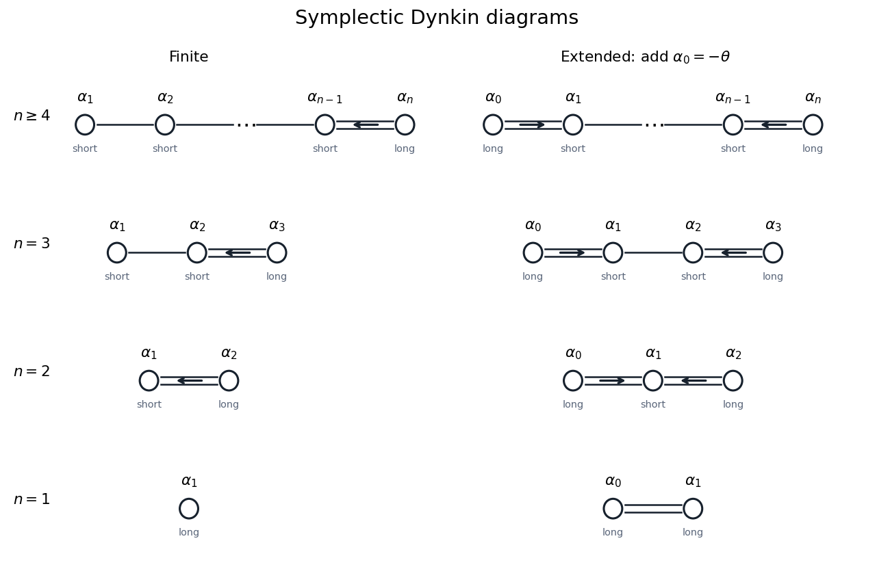
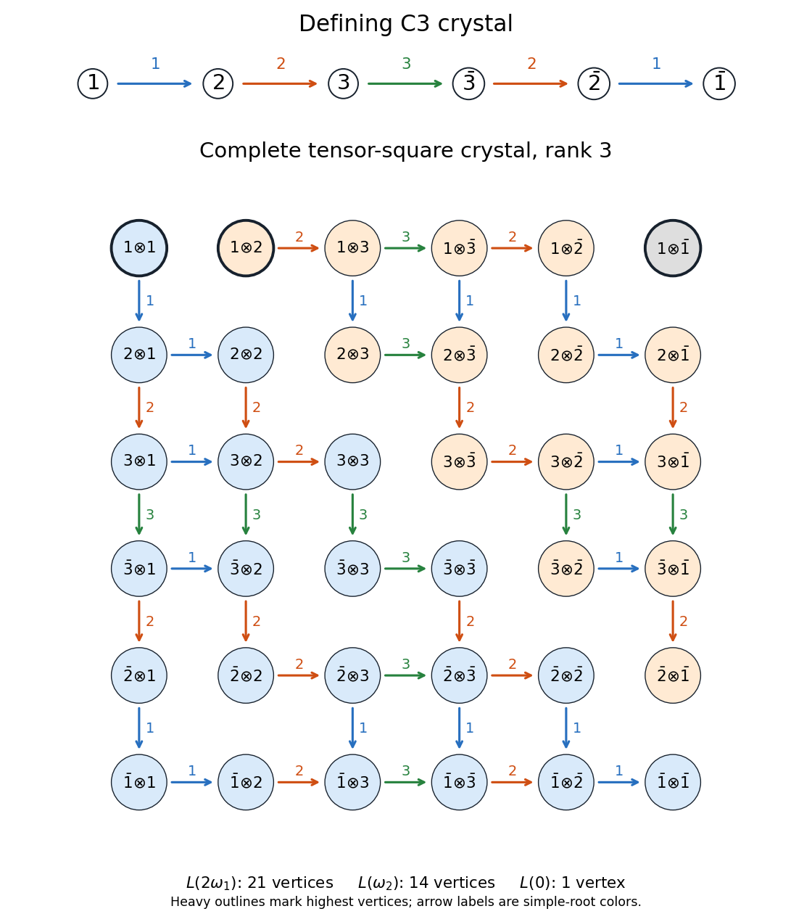
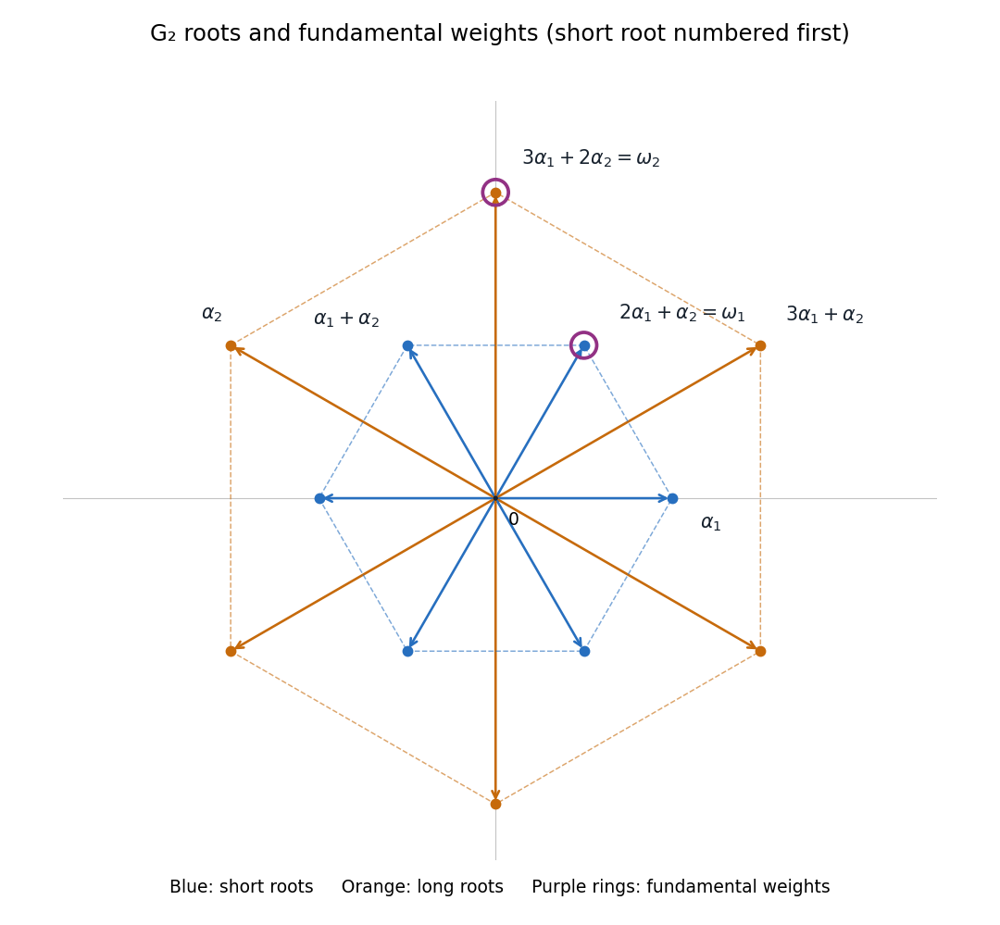

# Paper 6

↑ **Parent:** [Iii](../iii.md)

[https://www.maths.cam.ac.uk/postgrad/part-iii/files/pastpapers/2009/Paper6.pdf](https://www.maths.cam.ac.uk/postgrad/part-iii/files/pastpapers/2009/Paper6.pdf)

**Table of contents**

- [1](#1)
  - [i](#1/i)
    - [Solution](#1/i/solution)
  - [ii](#1/ii)
    - [Solution](#1/ii/solution)
- [2](#2)
  - [Solution](#2/solution)
- [3](#3)
  - [i](#3/i)
    - [Solution](#3/i/solution)
  - [ii](#3/ii)
    - [Solution](#3/ii/solution)
  - [iii](#3/iii)
    - [Solution](#3/iii/solution)
  - [iv](#3/iv)
    - [Solution](#3/iv/solution)
- [4](#4)
  - [i](#4/i)
    - [Solution](#4/i/solution)
  - [ii](#4/ii)
    - [Solution](#4/ii/solution)
- [5](#5)
  - [i](#5/i)
    - [Solution](#5/i/solution)
  - [ii](#5/ii)
    - [Solution](#5/ii/solution)
  - [iii](#5/iii)
    - [Solution](#5/iii/solution)

## 1

↑ **Parent:** [Paper 6](paper-6.md)

<h3 id="1/i">i</h3>

↑ **Parent:** [1](#1)

<h4 id="1/i/solution">Solution</h4>

↑ **Parent:** [I](#1/i)

First consider finite-dimensional [Lie algebra representations](../../../lie-algebra.md#lie-algebra-representation). The operators representing an [abelian Lie algebra](../../../lie-algebra.md#abelian-lie-algebra) commute. They have a common [eigenvector](../../../linear-operator-theory.md#eigenvector): take an [eigenspace](../../../linear-operator-theory.md#eigenspace) for the first operator of a [basis](../../../vector-space.md#basis) of the algebra, observe that every remaining operator preserves it, and repeat inside this nonzero space. The resulting line is an [invariant subspace](../../../representation-theory.md#invariant-subspace), so an [irreducible representation](../../../representation-theory.md#irreducible-representation) must be one-dimensional. Its action has the form $xv=\lambda(x)v$ for a [linear functional](../../../linear-algebra.md#linear-functional) $\lambda$. Conversely, every such functional defines a [Lie algebra representation](../../../lie-algebra.md#lie-algebra-representation), since both the [Lie brackets](../../../lie-algebra.md#lie-bracket) in the algebra and the [commutators](../../../lie-algebra.md#commutator) of its scalar operators vanish. Distinct functionals give nonisomorphic representations. Thus **the irreducibles are precisely the characters $\lambda\in\mathfrak g^*$**.

Even without a finite-dimensional assumption on the module, this conclusion for a finite-dimensional [abelian Lie algebra](../../../lie-algebra.md#abelian-lie-algebra) follows from the [Weak Hilbert Nullstellensatz](../../../algebraic-geometry.md#weak-hilbert-nullstellensatz): its [universal enveloping algebra](../../../lie-algebra.md#universal-enveloping-algebra) is the [polynomial](../../../polynomial.md) algebra $\operatorname{Sym}(\mathfrak g)$. A simple module over a commutative algebra is its quotient by a [maximal ideal](../../../commutative-algebra.md#maximal-ideal), and every [maximal ideal](../../../commutative-algebra.md#maximal-ideal) of this [polynomial](../../../polynomial.md) algebra over $\mathbb C$ has residue field $\mathbb C$.

**Indecomposable does not imply irreducible.** For the one-dimensional [abelian Lie algebra](../../../lie-algebra.md#abelian-lie-algebra) $\mathbb Cx$, let $x$ act on $\mathbb C^2$ by the [Nilpotent Jordan block](../../../linear-operator-theory.md#nilpotent-jordan-block)

$$
N=\begin{pmatrix}0&1\\0&0\end{pmatrix}.
$$

The line spanned by the first coordinate vector is an [invariant subspace](../../../representation-theory.md#invariant-subspace), so the module is reducible. If it were a [direct sum](../../../vector-space.md#direct-sum) of two nonzero submodules, both would have [dimension](../../../vector-space.md#dimension-vector-space) one; nilpotence would force $N$ to act as zero on both, contrary to $N\ne0$. Thus it is an [indecomposable representation](../../../representation-theory.md#indecomposable-representation).

For a finite-dimensional module $V$, put $d=\dim V$ and define its [generalized weight spaces](../../../semisimple-lie-algebra.md#generalized-weight-space-of-a-lie-algebra-representation) intrinsically by

$$
V^\lambda=\{v\in V:(\rho(x)-\lambda(x)I)^d v=0\text{ for every }x\in\mathfrak g\}.
$$

To obtain the decomposition, choose a [basis](../../../vector-space.md#basis) $x_1,\ldots,x_r$ of $\mathfrak g$, split into [generalized eigenspaces](../../../linear-operator-theory.md#generalized-eigenspace) of $\rho(x_1)$, and successively split each piece by $\rho(x_2),\ldots,\rho(x_r)$. All the pieces are submodules because the acting operators commute. On one resulting piece, $\rho(x_j)$ has a unique [eigenvalue](../../../linear-operator-theory.md#eigenvalue) $\lambda_j$. The commuting operators can be simultaneously upper triangularized by repeating the common-eigenvector argument on quotients. Hence on this piece every $\rho(x_j)-\lambda_j I$ is strictly upper triangular. Any [linear combination](../../../vector-space.md#linear-combination) is also strictly upper triangular, and its $d$th power vanishes. Extending $\lambda_j$ linearly therefore identifies the piece with $V^\lambda$. Different tuples give disjoint pieces; if a component has a different tuple from $\lambda$, at least one $\rho(x_j)-\lambda(x_j)I$ is invertible there. Consequently

$$
\boxed{V=\bigoplus_{\lambda\in\mathfrak g^*}V^\lambda,}
$$

with only finitely many nonzero summands. Since the definition uses every $x$ rather than a chosen [basis](../../../vector-space.md#basis), this [generalized-weight decomposition for a nilpotent Lie algebra](../../../semisimple-lie-algebra.md#generalized-weight-decomposition-for-a-nilpotent-lie-algebra) is canonical. Its summands need not be irreducible, as the [Jordan block](../../../linear-operator-theory.md#jordan-block) example already shows.

<h3 id="1/ii">ii</h3>

↑ **Parent:** [1](#1)

<h4 id="1/ii/solution">Solution</h4>

↑ **Parent:** [Ii](#1/ii)

The [derived series of a Lie algebra](../../../lie-algebra.md#derived-series-of-a-lie-algebra) is

$$
\mathfrak b^{(0)}=\mathfrak b,\qquad \mathfrak b^{(j+1)}=[\mathfrak b^{(j)},\mathfrak b^{(j)}].
$$

The algebra is a [solvable Lie algebra](../../../lie-algebra.md#solvable-lie-algebra) if $\mathfrak b^{(m)}=0$ for some $m$. Here a bracket of subspaces means the [linear span](../../../vector-space.md#linear-span) of their [Lie brackets](../../../lie-algebra.md#lie-bracket).

The [Lie theorem](../../../lie-algebra.md#lie-s-theorem) states that a nonzero finite-dimensional representation of a complex [solvable Lie algebra](../../../lie-algebra.md#solvable-lie-algebra) has a common [eigenvector](../../../linear-operator-theory.md#eigenvector); equivalently, its operators can be simultaneously upper triangularized. Applied to an [Irreducible Lie algebra representation](../../../lie-algebra.md#irreducible-lie-algebra-representation), the common [eigenvector](../../../linear-operator-theory.md#eigenvector) gives a nonzero invariant line, which must be the entire module. A scalar action $\rho(x)=\lambda(x)$ respects the [Lie bracket](../../../lie-algebra.md#lie-bracket) exactly when $\lambda([x,y])=0$. Thus, in the finite-dimensional setting,

$$
\boxed{\text{irreducibles are }\mathbb C_\lambda,\qquad \lambda\in(\mathfrak b/[\mathfrak b,\mathfrak b])^*.}
$$

Every functional displayed gives a one-dimensional irreducible, and two such modules are isomorphic exactly when their functionals agree.

The finite-dimensional qualification is essential here, although the printed wording does not repeat it. For example, let $[x,y]=y$ and act on $\mathbb C[t]$ by $xf(t)=tf(t)$ and $yf(t)=f(t-1)$. These operators satisfy $[x,y]f=yf$. A nonzero submodule stable under $x$ is an [ideal](../../../commutative-algebra.md#ideal) $p(t)\mathbb C[t]$. Stability under $y$ forces $p(t)\mid p(t-1)$, so the two [polynomials](../../../polynomial.md), having the same degree and leading coefficient, are equal. In characteristic zero a [polynomial](../../../polynomial.md) invariant under a nonzero shift is constant. The module is therefore an [infinite-dimensional simple module for the two-dimensional affine Lie algebra](../../../lie-algebra.md#infinite-dimensional-simple-module-for-the-two-dimensional-affine-lie-algebra). It rules out extending the one-dimensional classification to unrestricted representations.

## 2

↑ **Parent:** [Paper 6](paper-6.md)

<h3 id="2/solution">Solution</h3>

↑ **Parent:** [2](#2)

Let $B$ be the given [invariant bilinear form on a Lie algebra](../../../lie-algebra.md#invariant-bilinear-form-on-a-lie-algebra). Choose a [basis](../../../vector-space.md#basis) $x_1,\ldots,x_d$ and its $B$-dual [basis](../../../vector-space.md#basis) $x^1,\ldots,x^d$, so $B(x_i,x^j)=\delta_i^j$. The [Casimir element](../../../semisimple-lie-algebra.md#casimir-element) is

$$
\boxed{\Omega_B=\sum_i x_i x^i\in U(\mathfrak g).}
$$

The tensor $\sum_i x_i\otimes x^i$ is the inverse tensor of $B$, so it is independent of the chosen [basis](../../../vector-space.md#basis). Multiplication in the [universal enveloping algebra](../../../lie-algebra.md#universal-enveloping-algebra) therefore makes $\Omega_B$ independent of that choice as well.

For $z\in\mathfrak g$, write $[z,x_i]=\sum_j a_{ji}x_j$. Invariance means $B([z,x],y)+B(x,[z,y])=0$, whence $[z,x^i]=-\sum_j a_{ij}x^j$. Therefore

$$
[z,\Omega_B]=\sum_{i,j}a_{ji}x_jx^i-\sum_{i,j}a_{ij}x_ix^j=0,
$$

by interchanging $i,j$ in the second sum. Since $\mathfrak g$ generates its [universal enveloping algebra](../../../lie-algebra.md#universal-enveloping-algebra), $\Omega_B$ is central. This argument does not require adding a symmetry assumption to the given [bilinear form](../../../linear-algebra.md#bilinear-form).

For the [sl2 Lie algebra](../../../semisimple-lie-algebra.md#sl2-lie-algebra), take

$$
e=\begin{pmatrix}0&1\\0&0\end{pmatrix},\quad f=\begin{pmatrix}0&0\\1&0\end{pmatrix},\quad h=\begin{pmatrix}1&0\\0&-1\end{pmatrix},\qquad B(X,Y)=\operatorname{tr}(XY).
$$

The cyclic identity for the [trace](../../../linear-algebra.md#matrix-trace) gives $B([Z,X],Y)+B(X,[Z,Y])=0$. The form is [nondegenerate](../../../linear-algebra.md#nondegenerate-bilinear-form), since $B(e,f)=1$, $B(h,h)=2$, and all the other pairings except $B(f,e)$ are zero. The dual of $(e,f,h)$ is $(f,e,h/2)$, so

$$
\Omega_B=ef+fe+\tfrac12h^2.
$$

By the [classification of finite-dimensional sl2 representations](../../../semisimple-lie-algebra.md#classification-of-finite-dimensional-sl2-representations), an irreducible of [dimension](../../../vector-space.md#dimension-vector-space) $n$ has a [highest-weight vector](../../../semisimple-lie-algebra.md#highest-weight-vector) $v$ with $ev=0$ and $hv=mv$, where $m=n-1$. Since $ef=fe+h$, one obtains

$$
\Omega_Bv=\left(m+\tfrac12m^2\right)v.
$$

Centrality and the [Schur lemma](../../../representation-theory.md#schur-s-lemma) then give the answer on the entire representation:

$$
\boxed{\Omega_B=\frac{n^2-1}{2}I.}
$$

This [Casimir eigenvalue for sl2](../../../semisimple-lie-algebra.md#casimir-eigenvalue-for-sl2) depends on normalization. Choosing the [Killing form](../../../lie-algebra.md#killing-form) instead, $K=4B$, scales the dual [basis](../../../vector-space.md#basis) and the [Casimir element](../../../semisimple-lie-algebra.md#casimir-element) by $1/4$, giving $(n^2-1)I/8$.

## 3

↑ **Parent:** [Paper 6](paper-6.md)

<h3 id="3/i">i</h3>

↑ **Parent:** [3](#3)

<h4 id="3/i/solution">Solution</h4>

↑ **Parent:** [I](#3/i)

Write $\bar i=2n+1-i$, and let $E_{ab}$ denote a [matrix unit](../../../vector-space.md#matrix-unit). The diagonal [Cartan subalgebra](../../../semisimple-lie-algebra.md#cartan-subalgebra) consists of

$$
t=\operatorname{diag}(t_1,\ldots,t_n,-t_n,\ldots,-t_1),\qquad \varepsilon_i(t)=t_i.
$$

For a [diagonal matrix](../../../linear-algebra.md#diagonal-matrix), $[t,E_{ab}]=(t_a-t_b)E_{ab}$. Substituting into the symplectic relation shows that the following are [root vectors](../../../semisimple-lie-algebra.md#root-vector):

$$
\begin{array}{c|c}
\text{weight}&\text{vector}\\\hline
\varepsilon_i-\varepsilon_j&E_{ij}-E_{\bar j\bar i}\quad(i\ne j)\\
\varepsilon_i+\varepsilon_j&E_{i\bar j}+E_{j\bar i}\quad(i<j)\\
-\varepsilon_i-\varepsilon_j&E_{\bar i j}+E_{\bar j i}\quad(i<j)\\
2\varepsilon_i&E_{i\bar i}\\
-2\varepsilon_i&E_{\bar i i}
\end{array}
$$

The zero [weight space](../../../semisimple-lie-algebra.md#weight-space) is spanned by $H_i=E_{ii}-E_{\bar i\bar i}$. The symplectic equation pairs the remaining entries exactly as in this table; the displayed vectors and the $H_i$ are independent and span the algebra. This proves the [root-space decomposition](../../../semisimple-lie-algebra.md#root-space-decomposition)

$$
\mathfrak g=\mathfrak t\oplus\bigoplus_{\alpha\in R}\mathbb C X_\alpha,\qquad
\boxed{R=\{\pm\varepsilon_i\pm\varepsilon_j:i<j\}\cup\{\pm2\varepsilon_i:1\le i\le n\}.}
$$

There are $2n^2$ [roots of a root system](../../../semisimple-lie-algebra.md#root-of-a-root-system), each with one-dimensional [root space](../../../semisimple-lie-algebra.md#root-space), giving $\dim\mathfrak g=n(2n+1)$.

The upper triangular [root vectors](../../../semisimple-lie-algebra.md#root-vector) select precisely

$$
\boxed{R^+=\{\varepsilon_i-\varepsilon_j,\varepsilon_i+\varepsilon_j:i<j\}\cup\{2\varepsilon_i\}.}
$$

The [simple roots](../../../semisimple-lie-algebra.md#simple-root) of this [Cn root system](../../../semisimple-lie-algebra.md#cn-root-system) are

$$
\alpha_i=\varepsilon_i-\varepsilon_{i+1}\ (1\le i<n),\qquad \alpha_n=2\varepsilon_n.
$$

Indeed, the positive [roots of a root system](../../../semisimple-lie-algebra.md#root-of-a-root-system) have expansions

$$
\begin{aligned}
\varepsilon_i-\varepsilon_j&=\alpha_i+\cdots+\alpha_{j-1},\\
\varepsilon_i+\varepsilon_j&=\alpha_i+\cdots+\alpha_{j-1}+2(\alpha_j+\cdots+\alpha_{n-1})+\alpha_n,\\
2\varepsilon_i&=2(\alpha_i+\cdots+\alpha_{n-1})+\alpha_n.
\end{aligned}
$$

These expansions also identify the [highest root](../../../semisimple-lie-algebra.md#highest-root):

$$
\boxed{\theta=2\varepsilon_1=2\alpha_1+\cdots+2\alpha_{n-1}+\alpha_n.}
$$

Normalize the coordinate [inner product](../../../linear-algebra.md#inner-product) by $(\varepsilon_i,\varepsilon_j)=\delta_{ij}$. The [simple coroots](../../../semisimple-lie-algebra.md#simple-coroot) are $\alpha_i^\vee=\varepsilon_i-\varepsilon_{i+1}$ for $i<n$ and $\alpha_n^\vee=\varepsilon_n$. Solving $\langle\omega_j,\alpha_i^\vee\rangle=\delta_{ij}$ gives the [fundamental weights](../../../semisimple-lie-algebra.md#fundamental-weight)

$$
\boxed{\omega_j=\varepsilon_1+\cdots+\varepsilon_j\quad(1\le j\le n).}
$$

In the sum of the positive [roots of a root system](../../../semisimple-lie-algebra.md#root-of-a-root-system), the pair $(\varepsilon_i-\varepsilon_j)+(\varepsilon_i+\varepsilon_j)$ contributes $2\varepsilon_i$, and the long root contributes another $2\varepsilon_i$. Therefore the [Weyl vector](../../../semisimple-lie-algebra.md#half-sum-of-positive-roots) is

$$
\boxed{\rho=\frac12\sum_{\alpha\in R^+}\alpha=\sum_{i=1}^n(n-i+1)\varepsilon_i=\sum_{j=1}^n\omega_j.}
$$

These are the [Positive-root data for Cn](../../../semisimple-lie-algebra.md#positive-root-data-for-cn).

For $n\ge2$, the finite [Dynkin diagram](../../../semisimple-lie-algebra.md#dynkin-diagram) is a chain of $n$ vertices. The bonds between $\alpha_i$ and $\alpha_{i+1}$ for $i<n-1$ are single. The last bond is double, with its arrow pointing from the [long root](../../../semisimple-lie-algebra.md#long-root) $\alpha_n$ toward the [short root](../../../semisimple-lie-algebra.md#short-root) $\alpha_{n-1}$. For the [Extended Dynkin diagram](../../../semisimple-lie-algebra.md#extended-dynkin-diagram), add $\alpha_0=-\theta=-2\varepsilon_1$ at the other end, doubly bonded to $\alpha_1$, with arrow toward $\alpha_1$. The following [Cn Dynkin diagrams](../../../semisimple-lie-algebra.md#cn-dynkin-diagrams) include both ends and the low-rank cases.

**[Figure 1](#3/i/image-finite-and-extended-cn-dynkin-diagrams-with-arrows-toward-the-short-roots-and-separate-rank-one-and-rank-two-cases). Finite and extended Cn Dynkin diagrams with arrows toward the short roots and separate rank-one and rank-two cases**.

At $n=1$, there is just the root $\alpha_1=2\varepsilon_1$ and one finite vertex. The affine [Cartan matrix](../../../semisimple-lie-algebra.md#cartan-matrix) is $\begin{pmatrix}2&-2\\-2&2\end{pmatrix}$; its two vertices have equal root length, so the double bond has no arrow.

<h3 id="3/ii">ii</h3>

↑ **Parent:** [3](#3)

<h4 id="3/ii/solution">Solution</h4>

↑ **Parent:** [Ii](#3/ii)

Let $U$ be a four-dimensional [symplectic vector space](../../../linear-algebra.md#symplectic-vector-space), with a [symplectic basis](../../../linear-algebra.md#symplectic-basis) $e_1,f_1,e_2,f_2$. Its invariant inverse-form bivector may be chosen as $\eta=e_1\wedge f_1+e_2\wedge f_2$. Put $\mathrm{vol}=e_1\wedge f_1\wedge e_2\wedge f_2$, so $\eta\wedge\eta=2\mathrm{vol}$. Define a [symmetric bilinear form](../../../linear-algebra.md#symmetric-bilinear-form) on the six-dimensional [exterior square](../../../linear-algebra.md#exterior-square) by

$$
\xi\wedge\zeta=B(\xi,\zeta)\mathrm{vol}.
$$

It is symmetric because both factors have degree two. It is [nondegenerate](../../../linear-algebra.md#nondegenerate-bilinear-form): in the six-element wedge [basis](../../../vector-space.md#basis), every $e_a\wedge e_b$ pairs nontrivially with the wedge of the complementary pair and with no other [basis](../../../vector-space.md#basis) vector. Since $B(\eta,\eta)=2$, the [orthogonal complement](../../../hilbert-space.md#orthogonal-complement)

$$
W=\eta^\perp\subset\Lambda^2 U
$$

has [dimension](../../../vector-space.md#dimension-vector-space) five and inherits a [nondegenerate bilinear form](../../../linear-algebra.md#nondegenerate-bilinear-form). It is the [primitive exterior square](../../../linear-algebra.md#primitive-exterior-square), equivalently the [kernel](../../../linear-algebra.md#kernel-of-a-linear-map) of the [symplectic contraction of an exterior square](../../../linear-algebra.md#symplectic-contraction-of-an-exterior-square).

The [symplectic Lie algebra](../../../semisimple-lie-algebra.md#symplectic-lie-algebra) preserves $\eta$. It also preserves $\mathrm{vol}$, since its elements have [trace](../../../linear-algebra.md#matrix-trace) zero and the induced action on $\Lambda^4U$ is multiplication by that [trace](../../../linear-algebra.md#matrix-trace). The [exterior-power Lie algebra representation](../../../lie-algebra.md#exterior-power-lie-algebra-representation) therefore preserves $B$ and $W$, giving a [Lie algebra homomorphism](../../../lie-algebra.md#lie-algebra-homomorphism)

$$
\Phi:\mathfrak{sp}_4\longrightarrow\mathfrak{so}(W,B).
$$

To show injectivity, suppose $A$ acts as zero on $W$. It already acts as zero on the invariant line $\mathbb C\eta$, so it kills all of $\Lambda^2U=W\oplus\mathbb C\eta$. For any [basis](../../../vector-space.md#basis) $u_1,\ldots,u_4$, this means

$$
Au_i\wedge u_j+u_i\wedge Au_j=0\qquad(i\ne j).
$$

If $k\ne i$, choose $j$ distinct from $i,k$; the coefficient of $u_k\wedge u_j$ forces $A_{ki}=0$. Thus $A$ is diagonal. The same identity gives $A_{ii}+A_{jj}=0$ for every pair. Applying this to three distinct indices forces each diagonal entry to vanish. Hence $A=0$ and $\Phi$ is injective.

Finally $\dim\mathfrak{sp}_4=2(2\cdot2+1)=10$ and $\dim\mathfrak{so}(W,B)=5\cdot4/2=10$. Injectivity between these equal-dimensional [vector spaces](../../../vector-space.md) gives surjectivity. Every [nondegenerate](../../../linear-algebra.md#nondegenerate-bilinear-form) complex [symmetric bilinear form](../../../linear-algebra.md#symmetric-bilinear-form) on a five-dimensional space is equivalent to the standard one. We have therefore constructed the [exceptional isomorphism between sp4 and so5](../../../semisimple-lie-algebra.md#exceptional-isomorphism-between-sp4-and-so5):

$$
\boxed{\mathfrak{sp}_4\cong\mathfrak{so}_5.}
$$

<h3 id="3/iii">iii</h3>

↑ **Parent:** [3](#3)

<h4 id="3/iii/solution">Solution</h4>

↑ **Parent:** [Iii](#3/iii)

Identify the [Cartan subalgebra](../../../semisimple-lie-algebra.md#cartan-subalgebra) with the coordinate space $(t_1,\ldots,t_n)$ used above. The [root reflection](../../../semisimple-lie-algebra.md#root-reflection) in any [root of a root system](../../../semisimple-lie-algebra.md#root-of-a-root-system) fixes the perpendicular [hyperplane](../../../vector-space.md#hyperplane). For every root of the [Cn root system](../../../semisimple-lie-algebra.md#cn-root-system), its complete coordinate action is

$$
\begin{array}{c|c}
\alpha& s_\alpha(t)\\\hline
\pm(\varepsilon_i-\varepsilon_j)&t_i\leftrightarrow t_j\\
\pm(\varepsilon_i+\varepsilon_j)&(t_i,t_j)\mapsto(-t_j,-t_i)\\
\pm2\varepsilon_i&t_i\mapsto-t_i
\end{array}
$$

Every unlisted coordinate is fixed, and changing the sign of the root leaves its reflection unchanged. These formulas follow directly from $s_\alpha(t)=t-\alpha(t)\alpha^\vee$, with the [coroot](../../../semisimple-lie-algebra.md#coroot) regarded as a vector of the [Cartan subalgebra](../../../semisimple-lie-algebra.md#cartan-subalgebra).

The [Cn Weyl group](../../../semisimple-lie-algebra.md#cn-weyl-group) is the [signed symmetric group](../../../lie-theory.md#hyperoctahedral-group): its elements permute the $n$ coordinates and independently change their signs. The [Weyl reflections](../../../semisimple-lie-algebra.md#weyl-reflection) associated with the [simple roots](../../../semisimple-lie-algebra.md#simple-root) interchange consecutive coordinates for $i<n$ and negate the last coordinate for $i=n$. Thus

$$
\boxed{W(C_n)\cong(\mathbb Z/2\mathbb Z)^n\rtimes S_n,\qquad |W|=2^n n!.}
$$

<h3 id="3/iv">iv</h3>

↑ **Parent:** [3](#3)

<h4 id="3/iv/solution">Solution</h4>

↑ **Parent:** [Iv](#3/iv)

Use the ordered alphabet

$$
\mathcal A=(1,2,\ldots,n,\bar n,\overline{n-1},\ldots,\bar1),
$$

with [weights](../../../semisimple-lie-algebra.md#weight-representation-theory) $\operatorname{wt}(i)=\varepsilon_i$ and $\operatorname{wt}(\bar i)=-\varepsilon_i$. The [crystal of the defining symplectic representation](../../../semisimple-lie-algebra.md#crystal-of-the-defining-symplectic-representation) is the chain

$$
1\xrightarrow{1}2\xrightarrow{2}\cdots\xrightarrow{n-1}n\xrightarrow{n}\bar n\xrightarrow{n-1}\cdots\xrightarrow{2}\bar2\xrightarrow{1}\bar1.
$$

The label of an arrow is its [simple root](../../../semisimple-lie-algebra.md#simple-root) color; a [Kashiwara operator](../../../semisimple-lie-algebra.md#kashiwara-operator) $\widetilde f_i$ follows an arrow of color $i$ and lowers the [weight](../../../semisimple-lie-algebra.md#weight-representation-theory) by $\alpha_i$.

Here is a grid description of the entire [tensor product of crystals](../../../semisimple-lie-algebra.md#tensor-product-of-crystals), valid for every $n$. Put one vertex $a\otimes b$ at row $a$ and column $b$, in the alphabet order above. Let $P_i$ be the set of chain positions with outgoing color $i$, and $Q_i$ the positions with incoming color $i$:

$$
P_i=\{i,2n-i\},\quad Q_i=\{i+1,2n-i+1\}\quad(i<n),\qquad P_n=\{n\},\quad Q_n=\{n+1\}.
$$

Their indicators are $\varphi_i$ and $\varepsilon_i$. Use the [crystal tensor-product rule](../../../semisimple-lie-algebra.md#crystal-tensor-product-rule)

$$
\widetilde f_i(a\otimes b)=\begin{cases}
\widetilde f_i(a)\otimes b,&\varphi_i(a)>\varepsilon_i(b),\\
a\otimes\widetilde f_i(b),&\varphi_i(a)\le\varepsilon_i(b).
\end{cases}
$$

An arrow is omitted if the selected factor has no outgoing arrow of that color. Thus the complete grid has a downward color-$i$ arrow when $a\in P_i$ and $b\notin Q_i$, and a rightward color-$i$ arrow when $b\in P_i$ and $a\notin P_i$. There are no other arrows. These two coordinate rules specify every vertex and every edge of the requested general-rank drawing. The following figure displays the full grid at $n=3$, including all components, together with the standard chain; increasing $n$ uses exactly the same grid construction.

**[Figure 2](#3/iv/image-defining-c3-crystal-and-its-complete-tensor-square-crystal-with-all-colored-arrows-and-the-three-highest-weight-components). Defining C3 crystal and its complete tensor-square crystal with all colored arrows and the three highest-weight components**.

For completeness, highest vertices can be read from the raising rule, which selects the first factor when $\varphi_i(a)\ge\varepsilon_i(b)$. If $a$ has an incoming edge of color $i$, then $\varphi_i(a)=0$; either the raising operator acts nontrivially on $a$, or $\varepsilon_i(b)=1$ and it acts nontrivially on $b$. Thus a highest vertex must have $a=1$. At $a=1$, all $\varphi_i(a)$ vanish except $\varphi_1(a)=1$. To be highest, the incoming color of $b$, if any, must consequently be $1$. For $n\ge2$, the possibilities are exactly

$$
1\otimes1,\qquad 1\otimes2,\qquad 1\otimes\bar1.
$$

Their [weights](../../../semisimple-lie-algebra.md#weight-representation-theory) are $2\varepsilon_1=2\omega_1$, $\varepsilon_1+\varepsilon_2=\omega_2$, and zero. Each occurs once. Connected highest-weight components of the [crystal basis](../../../semisimple-lie-algebra.md#crystal-basis) describe the [irreducible representations](../../../representation-theory.md#irreducible-representation) in the [tensor product of Lie algebra representations](../../../lie-algebra.md#tensor-product-of-lie-algebra-representations), so

$$
\boxed{V\otimes V\cong L(2\omega_1)\oplus L(\omega_2)\oplus L(0)\qquad(n\ge2).}
$$

This is the [tensor-square decomposition of the defining symplectic representation](../../../semisimple-lie-algebra.md#tensor-square-decomposition-of-the-defining-symplectic-representation). The [symmetric square](../../../linear-algebra.md#symmetric-square) is $L(2\omega_1)$; the [exterior square](../../../linear-algebra.md#exterior-square) is the [direct sum](../../../vector-space.md#direct-sum) of its invariant inverse-form line and the [primitive exterior square](../../../linear-algebra.md#primitive-exterior-square) $L(\omega_2)$. Their [dimensions](../../../vector-space.md#dimension-vector-space) are respectively $n(2n+1)$, $n(2n-1)-1$, and one, summing to $4n^2=\dim(V\otimes V)$. At $n=1$, the chain has two vertices and the highest tensor vertices are only $1\otimes1$ and $1\otimes\bar1$: the decomposition is $L(2\omega_1)\oplus L(0)$, of [dimensions](../../../vector-space.md#dimension-vector-space) three and one.

## 4

↑ **Parent:** [Paper 6](paper-6.md)

<h3 id="4/i">i</h3>

↑ **Parent:** [4](#4)

<h4 id="4/i/solution">Solution</h4>

↑ **Parent:** [I](#4/i)

Let $\mathfrak g$ be a complex [semisimple Lie algebra](../../../semisimple-lie-algebra.md), choose a [Cartan subalgebra](../../../semisimple-lie-algebra.md#cartan-subalgebra) and positive [root system](../../../semisimple-lie-algebra.md#root-system) $R^+$, and put $\rho=\frac12\sum_{\alpha\in R^+}\alpha$. For a [dominant integral weight](../../../semisimple-lie-algebra.md#dominant-integral-weight) $\lambda$, let $L(\lambda)$ be the finite-dimensional [highest-weight representation](../../../semisimple-lie-algebra.md#highest-weight-representation) with [highest weight](../../../semisimple-lie-algebra.md#highest-weight-of-a-representation) $\lambda$. The [Weyl dimension formula](../../../semisimple-lie-algebra.md#weyl-dimension-formula) is

$$
\boxed{\dim L(\lambda)=\prod_{\alpha\in R^+}\frac{\langle\lambda+\rho,\alpha^\vee\rangle}{\langle\rho,\alpha^\vee\rangle}.}
$$

Here $\alpha^\vee=2\alpha/(\alpha,\alpha)$ is the [coroot](../../../semisimple-lie-algebra.md#coroot), the pairing is between a [weight](../../../semisimple-lie-algebra.md#weight-representation-theory) and a [coroot](../../../semisimple-lie-algebra.md#coroot), and $\rho$ is the [Weyl vector](../../../semisimple-lie-algebra.md#half-sum-of-positive-roots). The [inner product](../../../linear-algebra.md#inner-product) can be any [Weyl group](../../../semisimple-lie-algebra.md#weyl-group) invariant normalization on each simple factor: its scaling cancels from the ratios. The dominance condition means that $\langle\lambda,\alpha_i^\vee\rangle$ is a nonnegative [integer](../../../number-theory.md#integer) for each [simple root](../../../semisimple-lie-algebra.md#simple-root).

<h3 id="4/ii">ii</h3>

↑ **Parent:** [4](#4)

<h4 id="4/ii/solution">Solution</h4>

↑ **Parent:** [Ii](#4/ii)

Number the [simple roots](../../../semisimple-lie-algebra.md#simple-root) so that $\alpha_1$ is short and $\alpha_2$ is long. In a Euclidean plane take

$$
\alpha_1=(1,0),\qquad \alpha_2=(-3/2,\sqrt3/2).
$$

Their squared lengths are $1,3$, and their angle is $150^\circ$. The positive [roots of a root system](../../../semisimple-lie-algebra.md#root-of-a-root-system) are

$$
\alpha_1,\quad\alpha_2,\quad\alpha_1+\alpha_2,\quad2\alpha_1+\alpha_2,\quad3\alpha_1+\alpha_2,\quad3\alpha_1+2\alpha_2;
$$

their negatives give the remaining six roots of the [G2 root system](../../../semisimple-lie-algebra.md#g2-root-system). The three short positive [roots of a root system](../../../semisimple-lie-algebra.md#root-of-a-root-system) are $\alpha_1$, $\alpha_1+\alpha_2$, and $2\alpha_1+\alpha_2$.

Solving $\langle\omega_j,\alpha_i^\vee\rangle=\delta_{ij}$ gives the [fundamental weights](../../../semisimple-lie-algebra.md#fundamental-weight)

$$
\boxed{\omega_1=2\alpha_1+\alpha_2=(1/2,\sqrt3/2),\qquad \omega_2=3\alpha_1+2\alpha_2=(0,\sqrt3).}
$$

In this case both [fundamental weights](../../../semisimple-lie-algebra.md#fundamental-weight) are themselves roots; the diagram marks their locations on the two hexagons.

**[Figure 3](#4/ii/image-the-twelve-g2-roots-with-short-first-simple-roots-and-fundamental-weights-marked-on-the-short-and-long-hexagons). The twelve G2 roots with short-first simple roots and fundamental weights marked on the short and long hexagons**.

Let $a=n_1$ and $b=n_2$. Relative to the [simple coroots](../../../semisimple-lie-algebra.md#simple-coroot), the six positive [coroots](../../../semisimple-lie-algebra.md#coroot), in the root order above, have coordinates

$$
(1,0),\quad(0,1),\quad(1,3),\quad(2,3),\quad(1,1),\quad(1,2).
$$

For example, $\alpha_1+\alpha_2$ has squared length one, so its [coroot](../../../semisimple-lie-algebra.md#coroot) is $2\alpha_1+2\alpha_2=\alpha_1^\vee+3\alpha_2^\vee$; the analogous length computation gives each other entry. Since $\rho=\omega_1+\omega_2$, the pairings of $\lambda+\rho$ with these [coroots](../../../semisimple-lie-algebra.md#coroot) are $a+1$, $b+1$, $a+3b+4$, $2a+3b+5$, $a+b+2$, and $a+2b+3$. Their values at $a=b=0$ multiply to $1\cdot1\cdot4\cdot5\cdot2\cdot3=120$. The [Weyl dimension formula](../../../semisimple-lie-algebra.md#weyl-dimension-formula) therefore yields the [G2 dimension polynomial](../../../semisimple-lie-algebra.md#g2-dimension-polynomial)

$$
\boxed{\dim L(a\omega_1+b\omega_2)=\frac{(a+1)(b+1)(a+b+2)(a+2b+3)(a+3b+4)(2a+3b+5)}{120}.}
$$

This holds for all nonnegative [integers](../../../number-theory.md#integer) $a,b$. In particular it gives [dimensions](../../../vector-space.md#dimension-vector-space) $7$ and $14$ for $L(\omega_1)$ and $L(\omega_2)$, and $27$ for $L(2\omega_1)$. Reversing the numbering of the [simple roots](../../../semisimple-lie-algebra.md#simple-root) would interchange $a,b$ in the [polynomial](../../../polynomial.md), so the short-first convention matters.

## 5

↑ **Parent:** [Paper 6](paper-6.md)

<h3 id="5/i">i</h3>

↑ **Parent:** [5](#5)

<h4 id="5/i/solution">Solution</h4>

↑ **Parent:** [I](#5/i)

Use the generators $e,f,h$ of the [sl2 Lie algebra](../../../semisimple-lie-algebra.md#sl2-lie-algebra) with $[h,e]=2e$, $[h,f]=-2f$, and $[e,f]=h$. For a finite-dimensional [Lie algebra representation](../../../lie-algebra.md#lie-algebra-representation), $h$ is diagonalizable with integral [weights](../../../semisimple-lie-algebra.md#weight-representation-theory). Its [formal character of a weight module](../../../semisimple-lie-algebra.md#formal-character-of-a-weight-module) is

$$
\boxed{\operatorname{ch}V=\sum_{m\in\mathbb Z}(\dim V_m)q^m,\qquad V_m=\{v:hv=mv\}.}
$$

Here $q$ is a formal variable; equivalently the expression is $\operatorname{tr}_V(q^h)$, or the formal sum $\sum_m(\dim V_m)e^m$ with $e^m=q^m$. This records every [weight multiplicity](../../../semisimple-lie-algebra.md#weight-multiplicity), rather than only the [dimension](../../../vector-space.md#dimension-vector-space).

The [classification of finite-dimensional sl2 representations](../../../semisimple-lie-algebra.md#classification-of-finite-dimensional-sl2-representations) says that $L_d$, the irreducible of [highest weight](../../../semisimple-lie-algebra.md#highest-weight-of-a-representation) $d\ge0$, has the [weight](../../../semisimple-lie-algebra.md#weight-representation-theory) string $d,d-2,\ldots,-d$, each with multiplicity one. Hence

$$
\operatorname{ch}L_d=q^d+q^{d-2}+\cdots+q^{-d}=\frac{q^{d+1}-q^{-(d+1)}}{q-q^{-1}}.
$$

The quotient denotes the displayed [Laurent polynomial](../../../polynomial.md#laurent-polynomial) and has the removable value $d+1$ at $q=1$. [Formal characters](../../../semisimple-lie-algebra.md#formal-character-of-a-weight-module) are additive on [direct sums](../../../vector-space.md#direct-sum), so these formulas determine the character of every finite-dimensional module.

<h3 id="5/ii">ii</h3>

↑ **Parent:** [5](#5)

<h4 id="5/ii/solution">Solution</h4>

↑ **Parent:** [Ii](#5/ii)

Choose a [Cartan subalgebra](../../../semisimple-lie-algebra.md#cartan-subalgebra), [simple roots](../../../semisimple-lie-algebra.md#simple-root) $\alpha_1,\ldots,\alpha_r$, and [root vectors](../../../semisimple-lie-algebra.md#root-vector) $e_i,f_i$ normalized by $[e_i,f_i]=h_i=\alpha_i^\vee$. Let

$$
\rho^\vee=\tfrac12\sum_{\alpha\in R^+}\alpha^\vee,\qquad h=2\rho^\vee=\sum_i c_i h_i,
\qquad e=\sum_i e_i,\qquad f=\sum_i c_i f_i.
$$

Here the [coroots](../../../semisimple-lie-algebra.md#coroot) lie in the [Cartan subalgebra](../../../semisimple-lie-algebra.md#cartan-subalgebra), and $\alpha_i(\rho^\vee)=1$. This last identity is the [Weyl vector](../../../semisimple-lie-algebra.md#half-sum-of-positive-roots) identity applied to the [dual root system](../../../semisimple-lie-algebra.md#dual-root-system). For distinct [simple roots](../../../semisimple-lie-algebra.md#simple-root), $\alpha_i-\alpha_j$ is not a root, hence $[e_i,f_j]=0$. Consequently

$$
[e,f]=\sum_i c_i h_i=h,\qquad [h,e]=2e,\qquad[h,f]=-2f.
$$

These are exactly the [sl2 Lie algebra](../../../semisimple-lie-algebra.md#sl2-lie-algebra) relations. For nonzero $\mathfrak g$ the resulting homomorphism from $\mathfrak{sl}_2$ is nonzero and therefore injective, since $\mathfrak{sl}_2$ is simple. Its image is a [Principal sl2 subalgebra](../../../semisimple-lie-algebra.md#principal-sl2-subalgebra). Equivalently its raising element is a [principal nilpotent element](../../../semisimple-lie-algebra.md#principal-nilpotent-element), a nilpotent element with [Lie algebra centralizer](../../../lie-algebra.md#centralizer-of-an-element-of-a-lie-algebra) of [dimension](../../../vector-space.md#dimension-vector-space) equal to the rank. The construction works for a [semisimple Lie algebra](../../../semisimple-lie-algebra.md) with several simple factors by taking the triple in every factor, giving one diagonally embedded $\mathfrak{sl}_2$. This is the [construction of a principal sl2 triple](../../../semisimple-lie-algebra.md#construction-of-a-principal-sl2-triple).

For a representation $V$, restrict to this subalgebra and take its [formal character](../../../semisimple-lie-algebra.md#formal-character-of-a-weight-module). If $V_\mu$ is the [weight space](../../../semisimple-lie-algebra.md#weight-space) for the original [Cartan subalgebra](../../../semisimple-lie-algebra.md#cartan-subalgebra), the resulting [q-character of a highest-weight representation](../../../semisimple-lie-algebra.md#q-character-of-a-highest-weight-representation), or the analogous q-character for any finite-dimensional representation, is

$$
\boxed{\operatorname{ch}_q V=\operatorname{tr}_V(q^{2\rho^\vee})=\sum_\mu\dim(V_\mu)\,q^{\mu(2\rho^\vee)}.}
$$

It is independent of conjugating the chosen principal triple. In particular a root $\beta=\sum_i k_i\alpha_i$ has grading $\beta(h)=2\sum_i k_i$. Some conventions use $q^{h/2}$ instead; that convention divides all exponents here by two. The normalization above agrees with the ordinary [sl2 Lie algebra](../../../semisimple-lie-algebra.md#sl2-lie-algebra) character in the preceding part.

<h3 id="5/iii">iii</h3>

↑ **Parent:** [5](#5)

<h4 id="5/iii/solution">Solution</h4>

↑ **Parent:** [Iii](#5/iii)

Under the [Principal sl2 subalgebra](../../../semisimple-lie-algebra.md#principal-sl2-subalgebra), a [root space](../../../semisimple-lie-algebra.md#root-space) of root $\beta$ has $h$-eigenvalue $\beta(2\rho^\vee)=2\operatorname{ht}(\beta)$, where the height is the sum of its simple-root coefficients. The six positive [roots of a root system](../../../semisimple-lie-algebra.md#root-of-a-root-system) of the [G2 root system](../../../semisimple-lie-algebra.md#g2-root-system) have heights

$$
\begin{array}{c|cccccc}
\beta&\alpha_1&\alpha_2&\alpha_1+\alpha_2&2\alpha_1+\alpha_2&3\alpha_1+\alpha_2&3\alpha_1+2\alpha_2\\\hline
\operatorname{ht}(\beta)&1&1&2&3&4&5.
\end{array}
$$

Each positive and negative [root space](../../../semisimple-lie-algebra.md#root-space) has [dimension](../../../vector-space.md#dimension-vector-space) one. The two-dimensional [Cartan subalgebra](../../../semisimple-lie-algebra.md#cartan-subalgebra) contributes two copies of the zero [weight](../../../semisimple-lie-algebra.md#weight-representation-theory). Therefore the [Principal q-character of the G2 adjoint representation](../../../semisimple-lie-algebra.md#principal-q-character-of-the-g2-adjoint-representation) is

$$
\boxed{\operatorname{ch}_q\mathfrak g=q^{10}+q^8+q^6+q^4+2q^2+2+2q^{-2}+q^{-4}+q^{-6}+q^{-8}+q^{-10}.}
$$

Equivalently,

$$
\operatorname{ch}_q\mathfrak g=\operatorname{ch}L_{10}+\operatorname{ch}L_2
=\frac{q^{11}-q^{-11}}{q-q^{-1}}+\frac{q^3-q^{-3}}{q-q^{-1}}.
$$

The [classification of finite-dimensional sl2 representations](../../../semisimple-lie-algebra.md#classification-of-finite-dimensional-sl2-representations) therefore gives the actual restricted-module decomposition $\mathfrak g\cong L_{10}\oplus L_2$, of [dimensions](../../../vector-space.md#dimension-vector-space) $11+3=14$. In the convention using $q^{h/2}$, the same result is $q^5+q^4+q^3+q^2+2q+2+2q^{-1}+q^{-2}+q^{-3}+q^{-4}+q^{-5}$. Both forms encode the same two [weight](../../../semisimple-lie-algebra.md#weight-representation-theory) strings.

## ↑ Ancestors (8)

1. [Iii](../iii.md)
2. [2009](../../2009.md)
3. [Past exam of the mathematics course of the University of Cambridge](../../../past-exam-of-the-mathematics-course-of-the-university-of-cambridge.md)
4. [Mathematics course of the University of Cambridge](../../../university-of-cambridge.md#mathematics-course-of-the-university-of-cambridge)
5. [Course of the University of Cambridge](../../../university-of-cambridge.md#course-of-the-university-of-cambridge)
6. [University of Cambridge](../../../university-of-cambridge.md)
7. [List of universities](../../../README.md#list-of-universities)
8. [Codex Wiki](../../../README.md)
