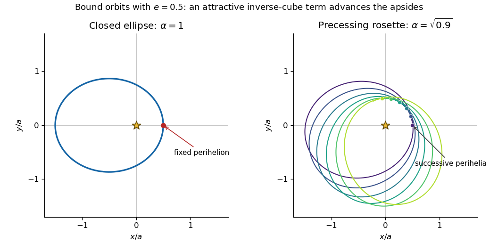

<h1 id="4/solution">Solution</h1>

↑ **Parent:** [4](../4.md)

Write $\mu=GM_\odot$, and interpret the specified radial force field as acceleration, or force per unit test-particle mass. Since it is a [central force](../../../../../central-force.md), the [specific angular momentum](../../../../../specific-angular-momentum.md) $\boldsymbol h=\boldsymbol r\times\boldsymbol v$ is conserved: $\dot{\boldsymbol h}=\boldsymbol r\times\boldsymbol F=0$. For $h=|\boldsymbol h|\ne0$, motion is confined to the fixed plane perpendicular to $\boldsymbol h$. Choose the orientation of the polar angle so that $h=r^2\dot\theta>0$.

To derive the [Binet equation](../../../../../binet-equation.md) here, let $u=1/r$ and differentiate with respect to $\theta$. Then $\dot r=-hu'$ and $\ddot r-r\dot\theta^2=-h^2u^2(u''+u)$. Equating this to the radial acceleration gives

$$
-h^2u^2(u''+u)=-\mu u^2+Cu^3,
\qquad u''+\left(1+\frac C{h^2}\right)u=\frac\mu{h^2}.
$$

Put $K=h^2+C$ and $\alpha=\sqrt{K/h^2}$. For $K>0$, the solution is

$$
u=\frac\mu K\bigl[1+e\cos\alpha(\theta-\theta_0)\bigr].
$$

The radial [potential energy](../../../../../potential-energy.md) per unit mass is $V(r)=-\mu/r+C/(2r^2)$, so the conserved [specific orbital energy](../../../../../specific-orbital-energy.md) is

$$
\mathcal E=\frac{\dot r^2}{2}+\frac K{2r^2}-\frac\mu r.
$$

Substitute the displayed $u$ and $\dot r=-hu'$ to obtain $\mathcal E=\mu^2(e^2-1)/(2K)$. Therefore define

$$
\boxed{a=-\frac\mu{2\mathcal E},\qquad
 e^2=1+\frac{2\mathcal E K}{\mu^2},\qquad
\alpha=\sqrt{1+\frac C{h^2}}.}
$$

For regular bound motion, $K>0$ and $-\mu^2/(2K)\leq\mathcal E<0$, giving $a>0$ and $0\leq e<1$. Since $K/\mu=a(1-e^2)$, choose the angular origin at a [pericentre](../../../../../periapsis.md), so $\theta_0=0$, and obtain

$$
\boxed{r=\frac{a(1-e^2)}{1+e\cos\alpha\theta}.}
$$

The turning radii are $r_{\rm p}=a(1-e)$ and $r_{\rm a}=a(1+e)$. Thus $a$ is the arithmetic mean of the turning radii; when the orbit precesses it should not be interpreted as the semimajor axis of a fixed ellipse. If $K\leq0$, the centrifugal barrier needed for a regular two-turning-point bound orbit is absent, and this bound-orbit parametrization does not apply.

For $\alpha=1$, one has $C=0$ and the orbit is a closed [Kepler orbit](../../../../../kepler-orbit.md): an ellipse of eccentricity $e$ with the Sun at a focus. In addition to $\mathcal E$ and the three components of $\boldsymbol h$, the [Laplace-Runge-Lenz vector](../../../../../laplace-runge-lenz-vector.md)

$$
\boldsymbol A=\boldsymbol v\times\boldsymbol h-\mu\widehat{\boldsymbol r}
$$

is conserved. Indeed,

$$
\frac d{dt}(\boldsymbol v\times\boldsymbol h)
=-\frac\mu{r^3}\boldsymbol r\times(\boldsymbol r\times\boldsymbol v)
=\mu\left(\frac{\boldsymbol v}{r}-\frac{\boldsymbol r(\boldsymbol r\cdot\boldsymbol v)}{r^3}\right)
=\mu\frac{d\widehat{\boldsymbol r}}{dt},
$$

so $\dot{\boldsymbol A}=0$. It points toward the fixed [pericentre](../../../../../periapsis.md). The constraints $\boldsymbol A\cdot\boldsymbol h=0$ and $A^2=\mu^2+2\mathcal E h^2$ leave five generically independent [isolating integrals](../../../../../isolating-integral.md). One may take

$$
\boxed{\mathcal E,\ h_x,\ h_y,\ h_z,\ A_j,}
$$

choosing a component $A_j$ whose differential is independent of the other four on the local region under consideration. The extra integral fixes the apsidal direction in the already fixed orbital plane.

For $\alpha\ne1$, successive [pericentres](../../../../../periapsis.md) are separated by $2\pi/\alpha$ in polar angle. The generic bound orbit is a rosette in that same plane. Its perihelion advance per radial cycle is

$$
\boxed{\Delta\varpi=2\pi\left(\frac1\alpha-1\right).}
$$

For $\alpha<1$ this is prograde; for $\alpha>1$ it is retrograde. If $\alpha$ is rational, the orbit closes after a finite number of radial cycles; if it is irrational and $0<e<1$, its successive radial phases densely fill the accessible annulus. A generic independent set of single-valued [isolating integrals](../../../../../isolating-integral.md) is

$$
\boxed{\mathcal E,\ h_x,\ h_y,\ h_z.}
$$

The apsidal direction is no longer fixed. For irrational frequency ratio, any continuous [integral of motion](../../../../../integral-of-motion.md) must be constant on the whole two-dimensional orbital torus, because one orbit is dense there; there is no further independent continuous integral specifying a fixed apsidal direction. Exceptional closed resonant orbits do not provide a fifth global integral on an open region of phase space. Circular and radial orbits are degenerate cases of these generic counts.

**[Figure 1](#4/image-closed-kepler-ellipse-and-prograde-precessing-bound-orbit-under-an-attractive-inverse-cube-perturbation). Closed Kepler ellipse and prograde precessing bound orbit under an attractive inverse-cube perturbation**.

The plotted precession is enlarged for visibility. Both examples have $e=0.5$ and the same turning radii; the second has $\alpha=\sqrt{0.9}$.

For the precession rate, it is useful to derive the radial period rather than assume an unperturbed angular period. Set $r=a(1-e\cos\chi)$ in the radial energy equation. On a complete radial cycle,

$$
\frac{dt}{d\chi}=\sqrt{\frac{a^3}{\mu}}(1-e\cos\chi),
\qquad P_r=\int_0^{2\pi}\frac{dt}{d\chi}\,d\chi=2\pi\sqrt{\frac{a^3}{\mu}}.
$$

Hence $n=2\pi/P_r=\sqrt{\mu/a^3}$. Also $K=\mu a(1-e^2)$ and $h^2=K-C$, so $\alpha^{-1}=\sqrt{1-C/K}$. For $|C|\ll K$, [inverse-cube perturbation of Kepler apsidal motion](../../../../../inverse-cube-perturbation-of-kepler-apsidal-motion.md) gives

$$
\Delta\varpi=2\pi\left(\sqrt{1-\frac C{\mu a(1-e^2)}}-1\right)
\simeq-\frac{\pi C}{\mu a(1-e^2)},
\qquad\dot\varpi\simeq-\frac n2\frac{C}{\mu a(1-e^2)}.
$$

There is a dimensional issue with the printed parameter: $C$ has units $L^4/T^2$ and $\mu$ has units $L^3/T^2$, so $\eta=aC/\mu$ has units $L^2$. Retaining that definition literally, the requested expression is

$$
\boxed{\dot\varpi\simeq-\frac{n\eta}{2a^2(1-e^2)},\qquad
\Delta\varpi\simeq-\frac{\pi\eta}{a^2(1-e^2)}.}
$$

A dimensionless perturbation coefficient would instead be $\widetilde\eta=C/(\mu a)=\eta/a^2$. In that convention the rate is $-n\widetilde\eta/[2(1-e^2)]$. These two conventions must not be conflated.

Use the stated residual precession and period. The advance in one radial cycle is

$$
\Delta\varpi=40''\frac{0.24}{100}=0.096''
=0.096\frac\pi{180\times3600}=4.6542\times10^{-7}\ \mathrm{rad}.
$$

With $e=0.206$, the small-perturbation estimate becomes

$$
\boxed{\widetilde\eta=-\frac{1-e^2}{\pi}\Delta\varpi\simeq-1.42\times10^{-7},\qquad
\eta\simeq-1.42\times10^{-7}a^2.}
$$

The negative sign is required: an additional attractive inverse-cube acceleration advances perihelion, whereas the positive-$C$ term would make it regress. If a length-unit estimate of the printed $\eta$ is desired, $P_r=0.24\,\mathrm{yr}$ and the solar value $\mu\simeq1.3271\times10^{20}\,\mathrm{m^3\,s^{-2}}$ give $a\simeq5.78\times10^{10}\,\mathrm m\simeq0.386\,\mathrm{au}$ through the radial-period law. Thus

$$
\boxed{\eta\simeq-4.73\times10^{14}\,\mathrm{m^2}\simeq-2.12\times10^{-8}\,\mathrm{au^2}.}
$$

The dimensionless value is the estimate obtainable directly from the supplied period, eccentricity and advance; the dimensional value additionally uses the solar gravitational parameter to set the length scale.

## ↑ Ancestors (10)

1. [4](../4.md)
2. [Paper 62](../../paper-62-split.md)
3. [Iii](../../split.md)
4. [2009](../../../split.md)
5. [Past exam of the mathematics course of the University of Cambridge](../../../../split.md)
6. [Mathematics course of the University of Cambridge](../../../../../mathematics-course-of-the-university-of-cambridge.md)
7. [Course of the University of Cambridge](../../../../../course-of-the-university-of-cambridge.md)
8. [University of Cambridge](../../../../../university-of-cambridge-split.md)
9. [List of universities](../../../../../list-of-universities.md)
10. [Codex Wiki](../../../../../split.md)
