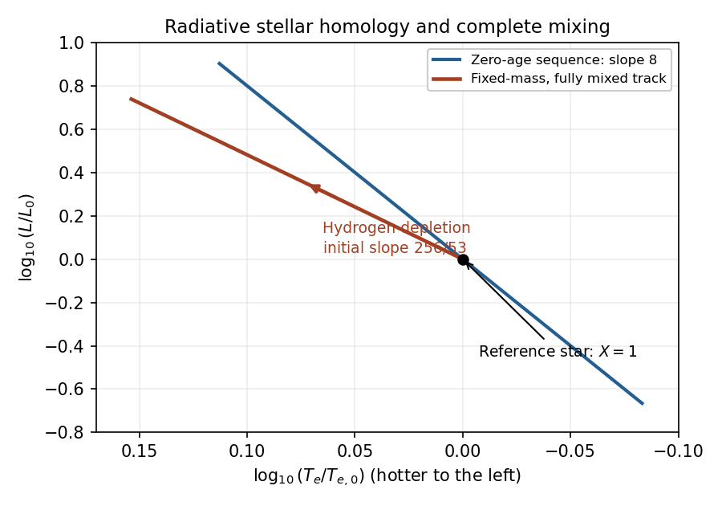

<h1 id="1/solution">Solution</h1>

↑ **Parent:** [1](../1.md)

Use [stellar homology](../../../../../stellar-homology.md): dimensionless density, [temperature](../../../../../temperature.md) and [luminosity](../../../../../luminosity.md) profiles are taken to have the same shape, so the dimensional scale relations follow from the structure equations. [Mass conservation](../../../../../mass-conservation.md) and hydrostatic support give

$$
\rho_c\propto\frac M{R^3},\qquad P_c\propto\frac{GM^2}{R^4}.
$$

The [ideal gas](../../../../../ideal-gas.md) equation then gives $T_c\propto\mu M/R$, with the dimensional constants held fixed. The specific [stellar energy-generation rate](../../../../../stellar-energy-generation-rate.md) has the prescribed [hydrogen](../../../../../hydrogen.md) factor and [temperature](../../../../../temperature.md) exponent, so

$$
L_{\mathrm{nuc}}\propto\epsilon_cM
\propto\epsilon_0X\rho_cT_c^{13}M
\propto\epsilon_0X\mu^{13}M^{15}R^{-16}.
$$

Independently, [radiative diffusion in a star](../../../../../radiative-diffusion-in-a-star.md) gives $T_c/R\propto\kappa\rho_cL/(R^2T_c^3)$, hence

$$
L_{\mathrm{rad}}\propto\frac{RT_c^4}{\kappa\rho_c}
\propto\frac{\mu^4M^3}{\kappa}.
$$

Equating the nuclear supply and radiative transport establishes [composition-dependent CNO homology](../../../../../composition-dependent-cno-homology.md):

$$
\boxed{R\propto[X\kappa\mu^9]^{1/16}M^{3/4},\qquad
L\propto\mu^4\kappa^{-1}M^3.}
$$

At one fixed composition, these reduce to $R\propto M^{3/4}$ and $L\propto M^3$ as required.

The [Stefan–Boltzmann law](../../../../../stefan-boltzmann-law.md) gives $T_e^4\propto L/R^2\propto M^{3/2}$, so $T_e\propto M^{3/8}$. Thus the logarithmic [Hertzsprung-Russell diagram](../../../../../hertzsprung-russell-diagram.md) slope along this [zero-age main sequence](../../../../../zero-age-main-sequence.md) is

$$
\boxed{\frac{d\log L}{d\log T_e}=8.}
$$

Increasing [mass](../../../../../mass.md) moves upward and leftward on the conventional diagram, whose [temperature](../../../../../temperature.md) axis is reversed.

For composition changes, neglect the small heavy-element contribution to the [mean molecular weight](../../../../../mean-molecular-weight.md) and set $Y\simeq1-X$. Then $\mu^{-1}=(3+5X)/4$. The fixed trace catalyst abundance is absorbed into $\epsilon_0$; this is not an assertion that an exactly metal-free star can undergo CNO burning. Substitution into the homology laws gives

$$
\boxed{L\propto M^3(1+X)^{-1}(3+5X)^{-4},}
$$

$$
\boxed{R\propto M^{3/4}X^{1/16}(1+X)^{1/16}(3+5X)^{-9/16}.}
$$

For a retained, nonnegligible fixed metallicity $Z$, the corresponding mean-molecular-weight factor is $3+5X-Z$ instead. The displayed requested formula uses the trace-metal approximation.

At fixed [mass](../../../../../mass.md), differentiating with respect to $X$ at the formal reference $X=1$ gives

$$
\frac{d\log L}{dX}=-\frac1{1+X}-\frac{20}{3+5X}\ \longrightarrow\ -3,
$$

$$
\frac{d\log R}{dX}=\frac1{16X}+\frac1{16(1+X)}-\frac{45}{16(3+5X)}
\ \longrightarrow\ -\frac{33}{128}.
$$

Consequently

$$
\frac{d\log T_e}{dX}=
\frac14\left(\frac{d\log L}{dX}-2\frac{d\log R}{dX}\right)
\ \longrightarrow\ -\frac{159}{256},
$$

and the initial [fully mixed hydrogen-burning evolutionary track](../../../../../fully-mixed-hydrogen-burning-evolutionary-track.md) has slope

$$
\boxed{\left.\frac{d\log L}{d\log T_e}\right|_{M,\,X=1}
=\frac{256}{53}\simeq4.83.}
$$

[Hydrogen](../../../../../hydrogen.md) depletion has $dX<0$, so both [luminosity](../../../../../luminosity.md) and [effective temperature](../../../../../effective-temperature.md) initially increase. The star therefore moves upward and leftward, on a shallower logarithmic track than the [mass](../../../../../mass.md) sequence. The figure uses dimensionless [luminosity](../../../../../luminosity.md) and [temperature](../../../../../temperature.md) relative to its initial reference star; the track is computed for declining $X$ at constant [mass](../../../../../mass.md).

**[Figure 1](#1/image-zero-age-radiative-homology-sequence-and-the-fixed-mass-fully-mixed-hydrogen-burning-track). Zero-age radiative homology sequence and the fixed-mass fully mixed hydrogen-burning track**.

Ordinary cluster main-sequence turn-offs instead evolve toward brighter, cooler, more extended configurations and eventually the giant region. Normal stars are therefore not mixed throughout their entire [mass](../../../../../mass.md) during [hydrogen burning](../../../../../hydrogen-burning.md): the core composition changes while the envelope retains [hydrogen](../../../../../hydrogen.md), and composition and entropy gradients develop. Core exhaustion and subsequent shell burning then produce very different structural evolution. Complete mixing is a special evolutionary scenario, not the standard explanation of ordinary giant formation.

These hydrogen-burning scalings must not be extrapolated literally to $X=0$. Their vanishing nuclear coefficient would make the inferred radius tend to zero and the [effective temperature](../../../../../effective-temperature.md) singular; in reality [hydrogen](../../../../../hydrogen.md) exhaustion requires a different structural and energy-generation model. A homogeneous remnant may be helium-rich, but its later structure is not described by the same CNO law. Also, the cover-sheet radiation-pressure expression has a temperature-power typo: the physical term is $aT^4/3$. [Radiation pressure](../../../../../radiation-pressure.md) was neglected in this derivation, so that typo does not enter the calculation.

## ↑ Ancestors (10)

1. [1](../1.md)
2. [Paper 63](../../paper-63-split.md)
3. [Iii](../../split.md)
4. [2009](../../../split.md)
5. [Past exam of the mathematics course of the University of Cambridge](../../../../split.md)
6. [Mathematics course of the University of Cambridge](../../../../../mathematics-course-of-the-university-of-cambridge.md)
7. [Course of the University of Cambridge](../../../../../course-of-the-university-of-cambridge.md)
8. [University of Cambridge](../../../../../university-of-cambridge-split.md)
9. [List of universities](../../../../../list-of-universities.md)
10. [Codex Wiki](../../../../../split.md)
