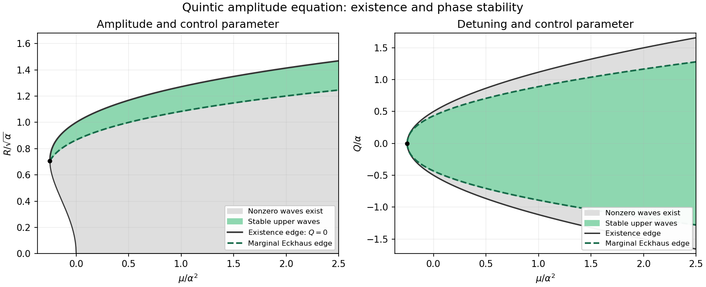

<h1 id="3/solution">Solution</h1>

↑ **Parent:** [3](../3.md)

Put $x=R^2>0$. Substituting the plane wave into the [quintic real Ginzburg-Landau equation](../../../../../quintic-real-ginzburg-landau-equation.md) gives

$$
\mu-Q^2+\alpha x-x^2=0,
$$

so the two nonzero branches are

$$
\boxed{x_\pm=\frac{\alpha\pm\sqrt{\alpha^2+4(\mu-Q^2)}}2.}
$$

The upper branch has $x_+\geq\alpha/2$ and exists for $Q^2\leq\mu+\alpha^2/4$. The lower branch is positive when $\mu<Q^2\leq\mu+\alpha^2/4$; at $Q^2=\mu$ it reaches the zero solution. The two branches meet at the fold $x=\alpha/2$, $\mu=Q^2-\alpha^2/4$. Thus for a given $\mu$, nonzero waves exist only if $\mu\geq-\alpha^2/4$, with

$$
\boxed{|Q|\leq\sqrt{\mu+\alpha^2/4}.}
$$

The zero solution exists for every $\mu$ independently of $Q$, because its spatial phase has no meaning.

For stability, write $A=e^{iQX}(R+u+iv)$ with real small $u,v$. Linearizing and using the steady-wave condition gives

$$
u_T=u_{XX}-2Qv_X+2R^2(\alpha-2R^2)u,\qquad
v_T=v_{XX}+2Qu_X.
$$

Define $\Lambda=2R^2(2R^2-\alpha)$. A sideband of wavenumber $p$ has matrix

$$
\begin{pmatrix}-p^2-\Lambda&-2iQp\\2iQp&-p^2\end{pmatrix}
$$

and exact growth rates

$$
\boxed{\sigma_\pm(p)=-p^2-\frac\Lambda2\pm\sqrt{\frac{\Lambda^2}{4}+4Q^2p^2}.}
$$

On the lower branch $\Lambda<0$, the uniform amplitude perturbation already grows at rate $-\Lambda>0$, so that branch is unstable. On the upper branch $\Lambda>0$, the fast amplitude mode decays and the slow phase mode has

$$
\sigma_+(p)=-\left(1-\frac{4Q^2}{\Lambda}\right)p^2-\frac{16Q^4}{\Lambda^3}p^4+O(p^6).
$$

The coefficient of phase diffusion gives the [Eckhaus boundary for a subcritical quintic amplitude equation](../../../../../eckhaus-boundary-for-a-subcritical-quintic-amplitude-equation.md):

$$
\boxed{R^2>\frac\alpha2,\qquad Q^2<R^4-\frac\alpha2R^2}
$$

for robust stability to long wavelengths. At equality, $\sigma_+=-p^4/\Lambda+O(p^6)$; the leading diffusion coefficient is marginal, while nonzero sufficiently long-wave linear perturbations still decay at the next spatial order. Indeed when $4Q^2\leq\Lambda$, the matrix trace is negative and its determinant is $p^2(p^2+\Lambda-4Q^2)\geq0$, proving linear non-growth at every $p$, not just asymptotically small $p$. The neutral $p=0$ phase mode reflects the constant phase symmetry.

At the fold, $\Lambda=0$. If $Q\ne0$, $\sigma_+=-p^2+2|Qp|$ is positive for small $p$, so the fold wave is unstable. At $Q=0$, the fold is a marginal linear point, but uniform amplitude perturbations have the one-sided nonlinear instability of a saddle-node; it is not a robust stable state. For the trivial state the linear growth rate is $\mu-p^2$, so it is stable for $\mu<0$ and only linearly marginal at $\mu=0$.

The requested regions can be expressed without eliminating $R$. In the $(\mu,R)$ plane, nonzero waves exist wherever $\mu\geq R^4-\alpha R^2$. The robust stable part is

$$
\boxed{R>\sqrt{\alpha/2},\qquad R^4-\alpha R^2\leq\mu<2R^4-\frac{3\alpha}{2}R^2.}
$$

The left boundary is the zero-detuning wave $Q=0$; the right boundary is the marginal Eckhaus curve. Both meet at $(\mu,R)=(-\alpha^2/4,\sqrt{\alpha/2})$. At fixed $\mu> -\alpha^2/4$, an equivalent description is

$$
\frac{3\alpha+\sqrt{9\alpha^2+32\mu}}8<R^2\leq\frac{\alpha+\sqrt{\alpha^2+4\mu}}2,
$$

with the lower endpoint added if only marginal linear stability is required.

In the $(\mu,Q)$ plane, eliminate $R$ from the marginal condition. It gives $R^2=[\alpha+\sqrt{\alpha^2+16Q^2}]/4$, hence

$$
\boxed{\mu>\mu_E(Q)=2Q^2-\frac\alpha8\left[\alpha+\sqrt{\alpha^2+16Q^2}\right].}
$$

The equality curve is the marginal boundary; the existence boundary is $\mu=Q^2-\alpha^2/4$. They touch at $Q=0,\mu=-\alpha^2/4$ but separate for nonzero detuning, leaving an unstable wave band. Equivalently, for fixed $\mu> -\alpha^2/4$ the robust stable interval is

$$
\boxed{|Q|<Q_E(\mu),\qquad Q_E^2=\frac{16\mu+3\alpha^2+\alpha\sqrt{9\alpha^2+32\mu}}{32}.}
$$

The stable amplitude is the upper root throughout this interval. The sketch uses scaled coordinates $\mu/\alpha^2,R/\sqrt\alpha,Q/\alpha$, so it applies to every fixed positive $\alpha$. Green denotes stable nonzero waves; the marginal curves form its boundaries, while the surrounding gray region contains existing but unstable nonzero waves.

**[Figure 1](#3/image-existence-and-long-wavelength-stability-regions-for-the-subcritical-quintic-amplitude-equation). Existence and long-wavelength stability regions for the subcritical quintic amplitude equation**.

## ↑ Ancestors (10)

1. [3](../3.md)
2. [Paper 70](../../paper-70-split.md)
3. [Iii](../../split.md)
4. [2009](../../../split.md)
5. [Past exam of the mathematics course of the University of Cambridge](../../../../split.md)
6. [Mathematics course of the University of Cambridge](../../../../../mathematics-course-of-the-university-of-cambridge.md)
7. [Course of the University of Cambridge](../../../../../course-of-the-university-of-cambridge.md)
8. [University of Cambridge](../../../../../university-of-cambridge-split.md)
9. [List of universities](../../../../../list-of-universities.md)
10. [Codex Wiki](../../../../../split.md)
