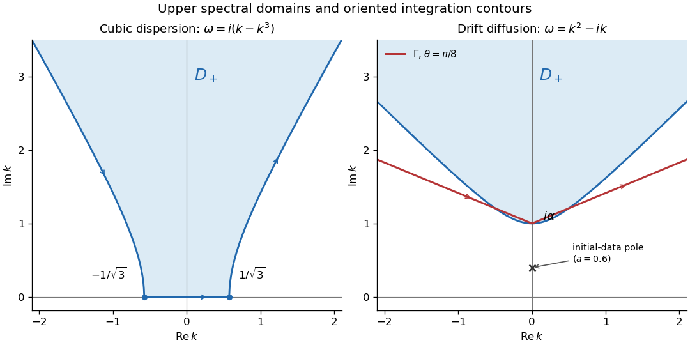

<h1 id="3/solution">Solution</h1>

↑ **Parent:** [3](../3.md)

Take the negative-exponential [Half-range Fourier transform](../../../../../half-range-fourier-transform.md) and set

$$
\omega(k)=k^2-i\alpha k,\qquad\widehat q_0(k)=\frac1{a+ik},\qquad
G_j(k,t)=\int_0^t e^{\omega(k)s}\partial_x^jq(0,s)\,ds.
$$

The [advection-diffusion equation](../../../../../advection-diffusion-equation.md) has the [local relation](../../../../../local-relation.md) with flux $X=-q_x-(ik+\alpha)q$. Integration over the half-line gives the [half-line drift global relation](../../../../../half-line-drift-global-relation.md)

$$
e^{\omega t}\widehat q(k,t)=\widehat q_0(k)-G_1(k,t)-(ik+\alpha)G_0(k,t),
\qquad\operatorname{Im}k\leq0.
$$

For the upper decay domain

$$
D_+=\{k:\operatorname{Im}k>0,\ \operatorname{Re}(k^2-i\alpha k)<0\},
$$

write $k=u+iv$. It is the region above $v=(\alpha+\sqrt{\alpha^2+4u^2})/2$, in particular above $v=\alpha$. Its boundary is oriented from upper-left infinity through $i\alpha$ to upper-right infinity, with the domain on the left. [Fourier inversion](../../../../../fourier-inversion-theorem.md) and deformation of the boundary terms give

$$
q(x,t)=\frac1{2\pi}\int_{\mathbb R}e^{ikx-\omega t}\widehat q_0(k)\,dk
-\frac1{2\pi}\int_{\partial D_+}e^{ikx-\omega t}\bigl[G_1+(ik+\alpha)G_0\bigr]dk.
$$

Use the [dispersion symmetry elimination of a boundary trace](../../../../../dispersion-symmetry-elimination-of-a-boundary-trace.md) $\nu(k)=i\alpha-k$. It preserves $\omega$ and maps $D_+$ into the lower half-plane. Because $i\nu+\alpha=-ik$, the [global relation](../../../../../global-relation-for-a-linear-boundary-value-problem.md) at $\nu$ implies

$$
G_1=\widehat q_0(\nu)+ikG_0-e^{\omega t}\widehat q(\nu,t).
$$

The last term contributes an [holomorphic](../../../../../complex-differentiability-at-a-point.md) upper-domain [integral](../../../../../integral.md) multiplied by $e^{ikx}$, so it vanishes upon closing the [contour](../../../../../complex-integration-contour.md) for $x>0$. The solution representation with only known data is consequently

$$
\boxed{q(x,t)=\frac1{2\pi}\int_{\mathbb R}\frac{e^{ikx-\omega t}}{a+ik}\,dk
-\frac1{2\pi}\int_{\partial D_+}e^{ikx-\omega t}\left[\frac1{a-\alpha-ik}+(2ik+\alpha)G_0(k,t)\right]dk.}
$$

For the boundary value $\cos t$, direct integration gives

$$
G_0(k,t)=\frac{e^{\omega t}(\omega\cos t+\sin t)-\omega}{\omega^2+1}.
$$

This quotient is an [entire function](../../../../../entire-function.md) of $\omega$ when its apparent singularities at $\omega=\pm i$ are filled by their limits. Those points are not genuine forcing poles of the finite-time transform.

To obtain an exponentially decaying spectral [integrand](../../../../../integrand.md), choose $0<\theta<\pi/4$ and the [exponential-decay contour for half-line drift diffusion](../../../../../exponential-decay-contour-for-half-line-drift-diffusion.md)

$$
\Gamma:\quad k=i\alpha+r e^{i(\pi-\theta)}\quad(r:\infty\to0),\qquad
k=i\alpha+r e^{i\theta}\quad(r:0\to\infty).
$$

Deform $\partial D_+$ to $\Gamma$. No pole is crossed: the initial-data denominator in that boundary [integral](../../../../../integral.md) has its only pole at $k=i(\alpha-a)$, which lies below $i\alpha$ since $a>0$. The apparent singularities of the forcing transform are removable. In the swept outer sectors, $e^{-\omega t}G_0=\int_0^t e^{-\omega(t-s)}\cos s\,ds$ has the appropriate bounded growth for the deformation. The [contour](../../../../../complex-integration-contour.md) formula becomes

$$
\boxed{\begin{aligned}
q(x,t)={}&\frac1{2\pi}\int_{\mathbb R}\frac{e^{ikx-\omega t}}{a+ik}\,dk\\
&-\frac1{2\pi}\int_\Gamma e^{ikx}\left[
\frac{e^{-\omega t}}{a-\alpha-ik}
+(2ik+\alpha)\frac{\omega\cos t+\sin t-\omega e^{-\omega t}}{\omega^2+1}
\right]dk.
\end{aligned}}
$$

Evaluate the second quotient as a removable expression at $\omega=\pm i$, rather than splitting it into artificial residue terms. On either ray,

$$
|e^{ikx}|=e^{-\alpha x-rx\sin\theta},\qquad
\operatorname{Re}\omega=r^2\cos2\theta-\alpha r\sin\theta.
$$

Since $\cos2\theta>0$, the transient factors have Gaussian decay as $r\to\infty$. The nontransient forcing term is $O(r^{-1})e^{-rx\sin\theta}$ and thus also decays exponentially for every $x>0$. The real-axis [integral](../../../../../integral.md) has the Gaussian factor $e^{-k^2t}$. These estimates provide the requested improvement over integration along $\operatorname{Re}\omega=0$.

**[Figure 1](#3/image-upper-cubic-dispersion-contour-and-exponentially-decaying-drift-diffusion-contour-with-their-orientations). Upper cubic-dispersion contour and exponentially decaying drift-diffusion contour, with their orientations**.

The first panel shows the cubic domain from Question 1. The second uses $\alpha=1$ and $\theta=\pi/8$; its marked initial-data pole corresponds to $a=0.6$ and lies below both boundary [contours](../../../../../complex-integration-contour.md).

An independent real-kernel form also makes the initial and boundary traces explicit. Apply the [Dirichlet gauge transform for constant drift](../../../../../dirichlet-gauge-transform-for-constant-drift.md), $u=e^{\alpha x/2}q$, and then multiply by $e^{\alpha^2t/4}$ to obtain the [heat equation](../../../../../heat-equation.md). The odd-reflected [heat kernel](../../../../../heat-kernel.md) for initial data and its [Dirichlet boundary-forcing heat-kernel formula](../../../../../dirichlet-boundary-forcing-heat-kernel-formula.md) yield

$$
\begin{aligned}
q(x,t)={}&\frac{e^{-\alpha x/2-\alpha^2t/4}}{\sqrt{4\pi t}}
\int_0^\infty\left[e^{-(x-y)^2/(4t)}-e^{-(x+y)^2/(4t)}\right]e^{(\alpha/2-a)y}\,dy\\
&+e^{-\alpha x/2}\int_0^t\frac{x\,e^{-x^2/(4\tau)-\alpha^2\tau/4}}{2\sqrt\pi\,\tau^{3/2}}\cos(t-\tau)\,d\tau.
\end{aligned}
$$

The first kernel tends to the initial delta kernel on $x>0$ as $t\downarrow0$ and vanishes at $x=0$. For the second kernel, the substitution $v=x/(2\sqrt\tau)$ gives the unit-mass approximate boundary delta as $x\downarrow0$, so its trace is $\cos t$; it vanishes initially for fixed $x>0$. Differentiating the kernels for $x,t>0$ verifies the [advection-diffusion equation](../../../../../advection-diffusion-equation.md). The [integrals](../../../../../integral.md) converge for every positive $a,\alpha$, even when the exponentially weighted initial datum grows, because the spatial Gaussian controls that growth. Thus this gives the same decaying solution without introducing an additional restriction on $a$.

For a general decaying initial datum, an unweighted [Fourier sine transform](../../../../../fourier-sine-transform.md) does not directly diagonalize the drift operator. Define

$$
S(k,t)=\int_0^\infty\sin(kx)q(x,t)\,dx,
\qquad C(k,t)=\int_0^\infty\cos(kx)q(x,t)\,dx.
$$

Two [integrations by parts](../../../../../integration-by-parts.md) for $q_{xx}$ and one for $q_x$ give

$$
\boxed{S_t=-k^2S-\alpha kC+k\cos t.}
$$

The cosine transform remains unknown, so this is not a closed sine-transform evolution. In contrast, the [weighted sine transform for half-line drift diffusion](../../../../../weighted-sine-transform-for-half-line-drift-diffusion.md) of $u=e^{\alpha x/2}q$ is closed:

$$
\widetilde S_t=-\left(k^2+\frac{\alpha^2}{4}\right)\widetilde S+k\cos t,
$$

$$
\widetilde S(k,t)=e^{-(k^2+\alpha^2/4)t}\int_0^\infty\sin(ky)e^{\alpha y/2}q_0(y)\,dy
+k\int_0^t e^{-(k^2+\alpha^2/4)(t-s)}\cos s\,ds.
$$

When the weighted initial transform exists, [Fourier sine inversion](../../../../../fourier-sine-inversion.md) gives $q(x,t)=e^{-\alpha x/2}(2/\pi)\int_0^\infty\sin(kx)\widetilde S(k,t)\,dk$. This method requires suitable decay of $e^{\alpha x/2}q_0$, not merely decay of $q_0$. For the exponential datum it is an ordinary integrable sine transform only when $a>\alpha/2$. At $a\leq\alpha/2$ one would need a generalized or regularized transform instead; the [contour](../../../../../complex-integration-contour.md) and real-kernel formulas above already work without that restriction. Therefore **the ordinary sine transform of $q$ is not a closed solution method; a weighted sine transform works under the stated extra weighted-decay condition**.

## ↑ Ancestors (10)

1. [3](../3.md)
2. [Paper 71](../../paper-71-split.md)
3. [Iii](../../split.md)
4. [2009](../../../split.md)
5. [Past exam of the mathematics course of the University of Cambridge](../../../../split.md)
6. [Mathematics course of the University of Cambridge](../../../../../mathematics-course-of-the-university-of-cambridge.md)
7. [Course of the University of Cambridge](../../../../../course-of-the-university-of-cambridge.md)
8. [University of Cambridge](../../../../../university-of-cambridge-split.md)
9. [List of universities](../../../../../list-of-universities.md)
10. [Codex Wiki](../../../../../split.md)
