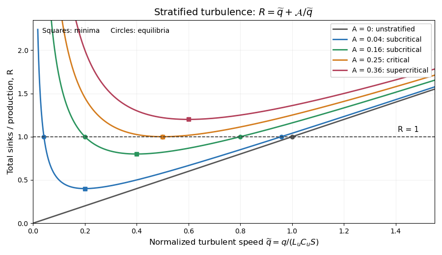

<h1 id="4/iv/solution">Solution</h1>

↑ **Parent:** [Iv](../iv.md)

For $q>0$, divide the two sink terms by $\mathcal P=C_uSq^2$. Put

$$
a=\frac{C_\rho^2L_\rho N^2}{C_uS},\qquad b=\frac1{L_uC_uS}.
$$

The requested ratio is

$$
\boxed{R(q)=\frac{B+\epsilon}{\mathcal P}=\frac{a}{q}+bq.}
$$

Here $b>0$ and $a\geq0$. With stable stratification $a>0$, $R$ diverges at both $q\downarrow0$ and $q\to\infty$, and has a single minimum at $q_m=\sqrt{a/b}$, with $R_{\min}=2\sqrt{ab}$. Increasing the stable density-gradient magnitude increases $a$, lifting the minimum and moving it rightward. When the [mass density](../../../../../../density.md) gradient vanishes, $a=0$ and the curve reduces to the straight line $R=bq$, with zero only as a limiting value at $q=0$ where the original ratio is undefined.

**[Figure 1](#4/iv/image-sink-to-production-ratio-for-zero-subcritical-critical-and-supercritical-density-gradients). Sink-to-production ratio for zero, subcritical, critical and supercritical density gradients**.

The plot uses $\widetilde q=bq=q/(L_uC_uS)$ and $\mathcal A=ab=[L_\rho C_\rho^2/(L_uC_u^2)]\mathrm{Ri}$, so $R=\widetilde q+\mathcal A/\widetilde q$. The horizontal line $R=1$ selects equilibria: two positive intersections for $0<\mathcal A<1/4$, one double intersection at $\mathcal A=1/4$, and none above it. The zero-gradient line has one positive equilibrium; its formal zero root before division by $q$ is the non-turbulent state.

## ↑ Ancestors (11)

1. [Iv](../iv.md)
2. [4](../../4.md)
3. [Paper 73](../../../paper-73-split.md)
4. [Iii](../../../split.md)
5. [2009](../../../../split.md)
6. [Past exam of the mathematics course of the University of Cambridge](../../../../../split.md)
7. [Mathematics course of the University of Cambridge](../../../../../../mathematics-course-of-the-university-of-cambridge.md)
8. [Course of the University of Cambridge](../../../../../../course-of-the-university-of-cambridge.md)
9. [University of Cambridge](../../../../../../university-of-cambridge-split.md)
10. [List of universities](../../../../../../list-of-universities.md)
11. [Codex Wiki](../../../../../../split.md)
