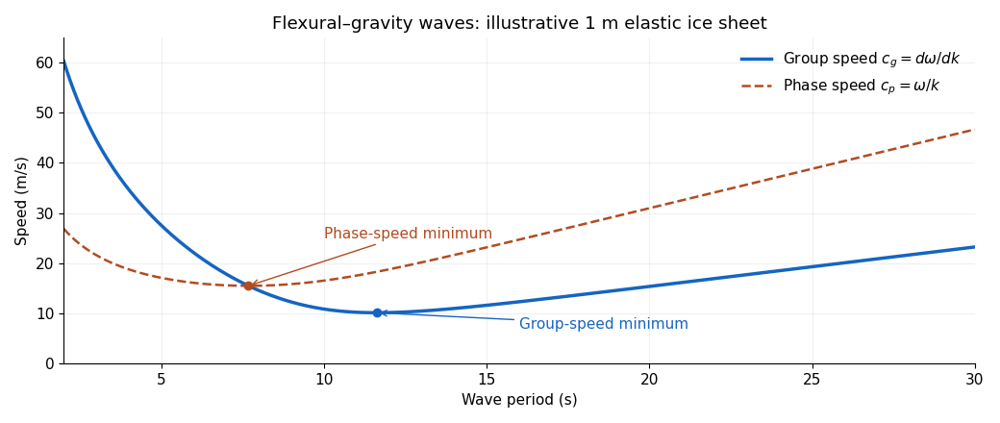

<h1 id="1/solution">Solution</h1>

↑ **Parent:** [1](../1.md)

Assume small-amplitude motion, a thin uniform [elastic plate](../../../../../elastic-plate.md), no prestress, and inviscid, irrotational deep water. Write the upward displacement as $\eta(x,t)$, the ice mass per unit area as $m=\rho_i h$, and its [flexural rigidity](../../../../../bending-stiffness.md) as

$$
D=\frac{Eh^3}{12(1-\nu^2)},
$$

where $E$ is [Young's modulus](../../../../../young-s-modulus.md) and $\nu$ is [Poisson's ratio](../../../../../poisson-s-ratio.md). The plate equation is $m\eta_{tt}+D\eta_{xxxx}=p$, where $p$ is the perturbation of upward water pressure.

Let the water [velocity potential](../../../../../velocity-potential.md) be $\phi=Ae^{kz}e^{i(kx-\omega t)}$ below the mean surface $z=0$, with $k>0$. This solves the [Laplace equation](../../../../../laplace-equation.md) and decays at depth. For $\eta=\eta_0e^{i(kx-\omega t)}$, the [kinematic boundary condition](../../../../../kinematic-boundary-condition.md) $\eta_t=\phi_z$ gives $A=-i\omega\eta_0/k$. The linear [Bernoulli equation](../../../../../bernoulli-equation.md) gives

$$
p=-\rho_w(\phi_t+g\eta)=\rho_w\left(\frac{\omega^2}{k}-g\right)\eta.
$$

Eliminating $p$ proves the [dispersion relation of a floating elastic plate](../../../../../dispersion-relation-of-a-floating-elastic-plate.md):

$$
\boxed{\omega^2=\frac{\rho_w gk+Dk^5}{\rho_w+\rho_i hk}.}
$$

Thus the desired [wavenumber](../../../../../wavenumber.md) is the positive root of

$$
\boxed{\frac{Eh^3}{12(1-\nu^2)}k^5+(\rho_wg-\rho_i h\omega^2)k-\rho_w\omega^2=0.}
$$

For positive $D$ and $\omega$, this root is unique: the polynomial is negative at zero and positive eventually; if its derivative starts negative, that derivative crosses zero only once, at a negative-valued minimum before the positive root. If a finite water depth $d$ is required, the corresponding relation is $\omega^2=(gk+Dk^5/\rho_w)\tanh(kd)/[1+(\rho_i h/\rho_w)k\tanh(kd)]$.

Put $\beta=D/\rho_w$ and $\alpha=\rho_i h/\rho_w$. Differentiation gives the [group velocity](../../../../../group-velocity.md)

$$
c_g=\frac{d\omega}{dk}=\frac{g+5\beta k^4+4\alpha\beta k^5}{2\omega(1+\alpha k)^2},\qquad T=\frac{2\pi}{\omega}.
$$

For long periods, the [surface gravity wave](../../../../../surface-gravity-wave.md) limit gives $c_g\sim gT/(4\pi)$. At sufficiently short periods, plate inertia and bending dominate, $\omega\sim\sqrt{D/m}\,k^2$ and $c_g\sim2\sqrt{D/m}\,k$. Consequently the curve has a [group-velocity minimum of a flexural-gravity wave](../../../../../group-velocity-minimum-of-a-flexural-gravity-wave.md) between branches that rise toward both long and short periods, within the formal deep-water plate model. Very short waves eventually fall outside the thin-plate approximation.

**[Figure 1](#1/image-group-and-phase-speed-for-an-illustrative-elastic-ice-sheet). Group and phase speed for an illustrative elastic ice sheet**.

The plot is an original model illustration with $h=1\,\mathrm m$, $E=5\,\mathrm{GPa}$, $\nu=0.3$, $\rho_i=917\,\mathrm{kg\,m^{-3}}$, $\rho_w=1025\,\mathrm{kg\,m^{-3}}$, and $g=9.81\,\mathrm{m\,s^{-2}}$. Its two minima occur at different periods.

A wave packet near the group-speed minimum carries energy away relatively slowly, so sustained forcing can concentrate energy in that period band. However, wind generation cannot be decided from $c_g$ alone. A steadily translating pressure pattern resonates through its [phase velocity](../../../../../phase-velocity.md) $c_p=\omega/k$; it must reach the [minimum phase speed of a flexural-gravity wave](../../../../../minimum-phase-speed-of-a-flexural-gravity-wave.md). Actual wind-wave growth also requires suitable pressure coupling and enough energy input to overcome damping. A coherent cover suppresses ordinary free-surface wave generation, while incoming ocean swell can still excite bending and break the cover.

For disconnected [pancake ice](../../../../../pancake-ice.md) or [frazil ice](../../../../../frazil-ice.md), remove the assumption of coherent elastic bending and retain the effective mass loading as a first conservative approximation. Setting $D=0$ gives $\omega^2=gk/[1+(\rho_i h/\rho_w)k]$. To describe damping as well, replace the elastic layer by a viscous suspension and match velocity and stress to the water beneath: the resulting [viscous layer model of frazil-pancake ice](../../../../../viscous-layer-model-of-frazil-pancake-ice.md) has complex $k$, whose real part gives dispersion and imaginary part gives attenuation. [Keller's 1998 two-layer model](https://agupubs.onlinelibrary.wiley.com/doi/10.1029/97JC02966) implements this replacement. Effective viscosity and connectedness must reflect the particular cover; zero rigidity alone does not model attenuation.

## ↑ Ancestors (10)

1. [1](../1.md)
2. [Paper 77](../../paper-77-split.md)
3. [Iii](../../split.md)
4. [2009](../../../split.md)
5. [Past exam of the mathematics course of the University of Cambridge](../../../../split.md)
6. [Mathematics course of the University of Cambridge](../../../../../mathematics-course-of-the-university-of-cambridge.md)
7. [Course of the University of Cambridge](../../../../../course-of-the-university-of-cambridge.md)
8. [University of Cambridge](../../../../../university-of-cambridge-split.md)
9. [List of universities](../../../../../list-of-universities.md)
10. [Codex Wiki](../../../../../split.md)
