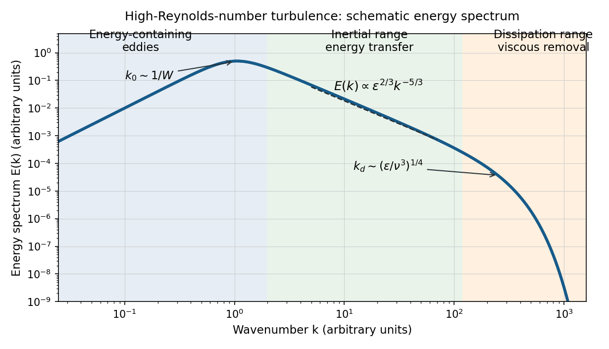

<h1 id="4/a/solution">Solution</h1>

↑ **Parent:** [A](../a.md)

Let $E(k)$ be the one-dimensional [turbulent energy spectrum](../../../../../../turbulent-energy-spectrum.md), normalized so that $\tfrac12\langle|\boldsymbol u'|^2\rangle=\int_0^\infty E(k)\,dk$. Large energy-containing eddies receive energy from the forcing. In the [inertial range](../../../../../../inertial-range.md), nonlinear transfer passes this energy towards smaller scales at a mean rate $\epsilon$ per unit mass. Dimensional analysis of [Kolmogorov 1941 theory](../../../../../../kolmogorov-1941-theory.md) gives

$$
\boxed{E(k)=C_K\epsilon^{2/3}k^{-5/3},\qquad k_0\ll k\ll k_d,\quad k_d\sim(\epsilon/\nu^3)^{1/4}.}
$$

The [dissipation range](../../../../../../dissipation-range.md) begins near the inverse of the [Kolmogorov length scale](../../../../../../kolmogorov-length-scale.md), where [kinematic viscosity](../../../../../../kinematic-viscosity.md) removes the transferred [kinetic energy](../../../../../../kinetic-energy.md). The large-scale spectrum depends on the forcing; the rising low-$k$ branch in this sketch is illustrative, rather than a universal power law.

**[Figure 1](#4/a/image-schematic-turbulence-energy-spectrum-showing-energy-containing-eddies-the-inertial-range-and-viscous-dissipation). Schematic turbulence energy spectrum showing energy-containing eddies, the inertial range and viscous dissipation**.

The tube has neither homogeneous nor isotropic large-scale [turbulence](../../../../../../turbulence-split.md): gravity selects a vertical direction, its walls constrain the motion, and its [density gradient](../../../../../../density-gradient.md) varies with height. The width $W$ bounds the transverse size of the energy-containing eddies. At sufficiently high [Reynolds number](../../../../../../reynolds-number.md), much smaller eddies may become approximately locally isotropic and exhibit an [inertial range](../../../../../../inertial-range.md), even though the full tube flow does not satisfy the homogeneous-isotropic assumptions.

To obtain the [Reynolds stress](../../../../../../reynolds-stress.md), write $u_i=U_i+u_i'$ and $p=P+p'$, with $\langle u_i'\rangle=0$. Averaging the incompressible [Navier-Stokes equations](../../../../../../navier-stokes-equation.md) uses $\langle u_i u_j\rangle=U_iU_j+\langle u_i'u_j'\rangle$ and gives the [Reynolds-averaged momentum equation](../../../../../../reynolds-averaged-momentum-equation.md)

$$
\partial_tU_i+U_j\partial_jU_i=-\frac{1}{\rho_0}\partial_iP+\nu\nabla^2U_i-\partial_j\langle u_i'u_j'\rangle+\langle b\rangle\delta_{iz}.
$$

Here the final term is the mean [buoyancy](../../../../../../buoyancy.md) force, with the hydrostatic reference removed. Thus averaging the quadratic momentum flux introduces the covariance $\langle u_i'u_j'\rangle$; multiplied by $\rho_0$, it has the dimensions of a stress. Its divergence transfers momentum between the mean flow and the fluctuations.

An [eddy viscosity](../../../../../../eddy-viscosity.md) model represents this [Reynolds stress](../../../../../../reynolds-stress.md) by

$$
\langle u_i'u_j'\rangle=\frac23k_T\delta_{ij}-2\nu_T S_{ij},\qquad k_T=\frac12\langle u_i'u_i'\rangle,\qquad S_{ij}=\frac12(\partial_iU_j+\partial_jU_i).
$$

The isotropic term can be absorbed into the mean pressure, while the deviatoric term gives a diffusion of mean momentum with [turbulent viscosity](../../../../../../eddy-viscosity.md) $\nu_T\sim u_*\ell$, where $u_*$ and $\ell$ are representative turbulent speed and [mixing length](../../../../../../mixing-length.md). Unlike [kinematic viscosity](../../../../../../kinematic-viscosity.md), this coefficient depends on the flow. The closure assumes a local relation between stress and mean strain; anisotropic, buoyancy-driven large eddies may require a more detailed [Reynolds stress](../../../../../../reynolds-stress.md) model.

## ↑ Ancestors (11)

1. [A](../a.md)
2. [4](../../4.md)
3. [Paper 79](../../../paper-79-split.md)
4. [Iii](../../../split.md)
5. [2009](../../../../split.md)
6. [Past exam of the mathematics course of the University of Cambridge](../../../../../split.md)
7. [Mathematics course of the University of Cambridge](../../../../../../mathematics-course-of-the-university-of-cambridge.md)
8. [Course of the University of Cambridge](../../../../../../course-of-the-university-of-cambridge.md)
9. [University of Cambridge](../../../../../../university-of-cambridge-split.md)
10. [List of universities](../../../../../../list-of-universities.md)
11. [Codex Wiki](../../../../../../split.md)
