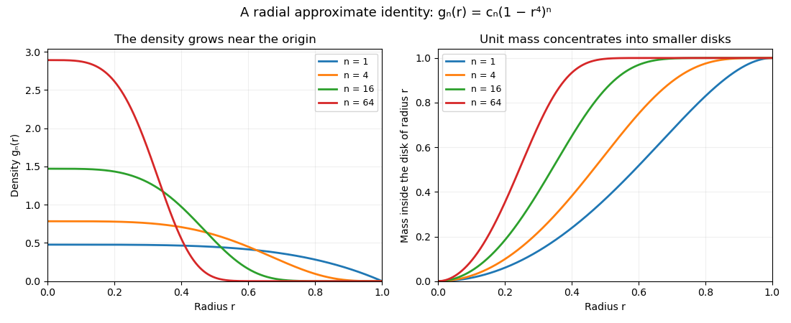

# Paper 9

↑ **Parent:** [Iii](../iii.md)

[https://www.maths.cam.ac.uk/postgrad/part-iii/files/pastpapers/2009/Paper9.pdf](https://www.maths.cam.ac.uk/postgrad/part-iii/files/pastpapers/2009/Paper9.pdf)

**Table of contents**

- [1](#1)
  - [a](#1/a)
    - [Solution](#1/a/solution)
  - [b](#1/b)
    - [Solution](#1/b/solution)
  - [c](#1/c)
    - [Solution](#1/c/solution)
- [2](#2)
  - [a](#2/a)
    - [Solution](#2/a/solution)
  - [b](#2/b)
    - [Solution](#2/b/solution)
  - [c](#2/c)
    - [Solution](#2/c/solution)
- [3](#3)
  - [a](#3/a)
    - [Solution](#3/a/solution)
  - [b](#3/b)
    - [Solution](#3/b/solution)
- [4](#4)
  - [a](#4/a)
    - [Solution](#4/a/solution)
  - [b](#4/b)
    - [Solution](#4/b/solution)
  - [c](#4/c)
    - [Solution](#4/c/solution)
- [5](#5)
  - [a](#5/a)
    - [Solution](#5/a/solution)
  - [b](#5/b)
    - [Solution](#5/b/solution)
  - [c](#5/c)
    - [Solution](#5/c/solution)
  - [d](#5/d)
    - [Solution](#5/d/solution)

## 1

↑ **Parent:** [Paper 9](paper-9.md)

<h3 id="1/a">a</h3>

↑ **Parent:** [1](#1)

<h4 id="1/a/solution">Solution</h4>

↑ **Parent:** [A](#1/a)

The statement requires $K\ne\varnothing$; an empty set is closed and convex but contains no minimizer. Assume this necessary condition and put $d=\inf_{g\in K}\|g-f\|_p$. Since $K$ is closed and $f\notin K$, $d>0$. Choose a [minimizing sequence](../../../calculus-of-variations.md#minimizing-sequence) $g_j\in K$ with $\|g_j-f\|_p\to d$.

The midpoint $(g_j+g_k)/2$ lies in the [convex set](../../../mathematical-optimization.md#convex-set) $K$. Applying the stated [Clarkson inequality](../../../banach-space.md#clarkson-s-inequalities) to $g_j-f$ and $g_k-f$ gives

$$
\|g_j-g_k\|_p^p
\leq2^{p-1}\bigl(\|g_j-f\|_p^p+\|g_k-f\|_p^p\bigr)
-\|g_j+g_k-2f\|_p^p
\leq2^{p-1}\bigl(\|g_j-f\|_p^p+\|g_k-f\|_p^p\bigr)-2^pd^p.
$$

The right side tends to zero, so $g_j$ is a [Cauchy sequence](../../../real-analysis.md#cauchy-sequence). By [completeness of Lp spaces](../../../measure-theory.md#completeness-of-lp-spaces), proved in Question 2(a), it converges to some $h$. Closedness puts $h$ in $K$, and continuity of the norm gives $\boxed{\|h-f\|_p=d}$. This is the [closest point theorem for a closed convex subset of Lp](../../../measure-theory.md#closest-point-theorem-for-a-closed-convex-subset-of-lp). The same inequality applied to two minimizers forces their difference to be zero, so the minimizer is also unique.

<h3 id="1/b">b</h3>

↑ **Parent:** [1](#1)

<h4 id="1/b/solution">Solution</h4>

↑ **Parent:** [B](#1/b)

For $g\in K$, [convexity](../../../real-analysis.md#convex-function) gives $h+t(g-h)\in K$ for $0\leq t\leq1$. Thus $F(t)=\|h-f+t(g-h)\|_p^p$ has a right minimum at $t=0$ and $F'(0)\geq0$. The [derivative of a power of the Lp norm](../../../measure-theory.md#derivative-of-a-power-of-the-lp-norm) is

$$
F'(0)=p\,\operatorname{Re}\int_{\mathbb R^n}|h-f|^{p-2}\overline{(h-f)}(g-h)\,dx.
$$

Consequently

$$
\boxed{\operatorname{Re}\int_{\mathbb R^n}|h-f|^{p-2}\overline{(h-f)}(h-g)\,dx\leq0.}
$$

The printed hint has coefficient $2$ where the general coefficient is $p$. This does not affect the desired sign, since $p>0$. The complex conjugation is important for complex-valued functions; for real functions it can be omitted.

<h3 id="1/c">c</h3>

↑ **Parent:** [1](#1)

<h4 id="1/c/solution">Solution</h4>

↑ **Parent:** [C](#1/c)

Use the printed bilinear pairing $\phi_u(v)=\int uv$, which is complex linear in both arguments. For the [conjugate exponents](../../../functional-analysis.md#conjugate-exponents) $p,q$, [Holder inequality](../../../functional-analysis.md#holder-inequality) gives $|\phi_u(v)|\leq\|u\|_q\|v\|_p$, proving well-definedness, continuity, and $\|\phi_u\|\leq\|u\|_q$. Linearity of $u\mapsto\phi_u$ follows from linearity of integration.

For $u\ne0$, take

$$
v=\frac{\overline u\,|u|^{q-2}}{\|u\|_q^{q-1}},
$$

with the numerator defined as zero where $u=0$. Since $(q-1)p=q$, this has $\|v\|_p=1$ and $\phi_u(v)=\|u\|_q$. Hence $\boxed{\|\phi_u\|=\|u\|_q}$; the same identity holds for $u=0$. This also proves injectivity.

For surjectivity, let $\Lambda$ be a nonzero bounded [linear functional](../../../linear-algebra.md#linear-functional) on $L^p$. Choose $f$ with $\Lambda(f)=1$ and let $K=\ker\Lambda$. The [closest point theorem for a closed convex subset of Lp](../../../measure-theory.md#closest-point-theorem-for-a-closed-convex-subset-of-lp) supplies the nearest point $h\in K$; write $w=f-h\ne0$. For every $z\in K$, the whole line $h+tz$ lies in $K$, so the norm derivative at the minimum vanishes for real $t$. Applying this also to $iz$ shows that the complex linear functional

$$
\Psi(v)=\int |w|^{p-2}\overline w\,v
$$

vanishes on $K$. Since $\Lambda(w)=1$, each $v-\Lambda(v)w$ is in $K$, giving $\Psi(v)=\Lambda(v)\Psi(w)$ and $\Psi(w)=\|w\|_p^p$. Therefore

$$
\Lambda(v)=\int u\,v,\qquad
u=\frac{|w|^{p-2}\overline w}{\|w\|_p^p}\in L^q.
$$

Membership follows from $(p-1)q=p$. The zero functional is represented by $u=0$. This proves the asserted [Lp duality](../../../continuous-dual-space.md#lp-duality-on-an-arbitrary-measure-space) isometric isomorphism, including surjectivity, without a separate representation theorem.

## 2

↑ **Parent:** [Paper 9](paper-9.md)

<h3 id="2/a">a</h3>

↑ **Parent:** [2](#2)

<h4 id="2/a/solution">Solution</h4>

↑ **Parent:** [A](#2/a)

First let $1\leq p<\infty$, and take a [Cauchy sequence](../../../real-analysis.md#cauchy-sequence) $f_j$ in the [Lp space](../../../measure-theory.md#lp-space), with functions identified [almost everywhere](../../../measure-theory.md#almost-everywhere). Choose a subsequence $f_{j_k}$ with $\|f_{j_{k+1}}-f_{j_k}\|_p\leq2^{-k}$ and put $a_k=f_{j_{k+1}}-f_{j_k}$. The [triangle inequality](../../../topological-analysis.md#triangle-inequality) gives

$$
\left\|\sum_{k=1}^N|a_k|\right\|_p\leq\sum_{k=1}^N2^{-k}\leq1.
$$

By the [monotone convergence theorem](../../../measure-theory.md#monotone-convergence-theorem), $A=\sum_{k\geq1}|a_k|$ belongs to $L^p$, and is finite almost everywhere. The series $f_{j_1}+\sum_{k\geq1}a_k$ therefore converges almost everywhere to an $L^p$ function $f$. Applying the same argument to each absolute tail yields

$$
\|f-f_{j_k}\|_p\leq\sum_{\ell\geq k}2^{-\ell}\longrightarrow0.
$$

The original sequence is Cauchy, so the triangle inequality extends convergence from this subsequence to the whole sequence.

For $p=\infty$, choose the same subsequence in [essential supremum](../../../measure-theory.md#essential-supremum) norm. Outside one null set, all its difference bounds hold simultaneously:

$$
|a_k(x)|\leq2^{-k},\qquad |f_{j_1}(x)|\leq\|f_{j_1}\|_\infty.
$$

The series then converges uniformly on that full-measure set to a bounded measurable $f$, and $\|f-f_{j_k}\|_\infty\leq\sum_{\ell\geq k}2^{-\ell}$. Again the full sequence converges. Thus **every $L^p$, $1\leq p\leq\infty$, is a Banach space**, proving [completeness of Lp spaces](../../../measure-theory.md#completeness-of-lp-spaces).

<h3 id="2/b">b</h3>

↑ **Parent:** [2](#2)

<h4 id="2/b/solution">Solution</h4>

↑ **Parent:** [B](#2/b)

If either upper norm bound is nonpositive, there are no admissible functions with $\|f\|_q\geq C_q>0$, and the assertion is vacuous. For positive $C_p,C_r$, choose

$$
\varepsilon=\left(\frac{C_q^q}{2C_p^p}\right)^{1/(q-p)},\qquad A=\{x:|f(x)|>\varepsilon\}.
$$

Splitting the integral gives

$$
C_q^q\leq\|f\|_q^q
\leq\varepsilon^{q-p}\|f\|_p^p+\int_A|f|^q
\leq\frac{C_q^q}{2}+\int_A|f|^q.
$$

For finite $r$, [Holder inequality](../../../functional-analysis.md#holder-inequality) bounds the last term by $\|f\|_r^q\mu(A)^{1-q/r}\leq C_r^q\mu(A)^{1-q/r}$. Hence

$$
\mu(A)\geq\left(\frac{C_q^q}{2C_r^q}\right)^{r/(r-q)}.
$$

For $r=\infty$, the corresponding bound is $\int_A|f|^q\leq C_r^q\mu(A)$. Thus an explicit choice proving the strict inequality is

$$
\boxed{M=
\begin{cases}
\frac12\left(C_q^q/(2C_r^q)\right)^{r/(r-q)},&r<\infty,\\
C_q^q/(4C_r^q),&r=\infty.
\end{cases}
\quad\mu\{|f|>\varepsilon\}>M.}
$$

This is a [nonvanishing level-set bound between three Lp norms](../../../measure-theory.md#nonvanishing-level-set-bound-between-three-lp-norms): the lower-$p$ bound prevents diffuse low-amplitude mass, and the higher-$r$ bound prevents arbitrarily concentrated spikes.

<h3 id="2/c">c</h3>

↑ **Parent:** [2](#2)

<h4 id="2/c/solution">Solution</h4>

↑ **Parent:** [C](#2/c)

Work on $\mathbb R$ with [Lebesgue measure](../../../measure-theory.md#lebesgue-measure). Without a uniform $L^p$ bound, use

$$
\boxed{f_n=n^{-1}1_{[0,n^q]}.}
$$

It has $\|f_n\|_q=1$ and $\|f_n\|_r=n^{q/r-1}\leq1$, with $1/r=0$ for $r=\infty$. Each function still belongs to $L^p\cap L^r$, but its $L^p$ norm is unbounded. For every fixed $\varepsilon>0$, its level set above $\varepsilon$ is eventually empty, defeating any positive uniform $M$.

Without a uniform $L^r$ bound, use instead

$$
\boxed{g_n=n\,1_{[0,n^{-q}]}.}
$$

Now $\|g_n\|_q=1$ and $\|g_n\|_p=n^{1-q/p}\leq1$, but for any fixed $\varepsilon>0$ the high-amplitude level set has measure $n^{-q}\to0$. These give the two distinct failures of the [nonvanishing level-set bound between three Lp norms](../../../measure-theory.md#nonvanishing-level-set-bound-between-three-lp-norms) when either control is removed.

## 3

↑ **Parent:** [Paper 9](paper-9.md)

<h3 id="3/a">a</h3>

↑ **Parent:** [3](#3)

<h4 id="3/a/solution">Solution</h4>

↑ **Parent:** [A](#3/a)

Assume the bounded set $\Omega$ is measurable, as needed to define its indicator in $L^q$. Put $w_j=f_j-f$ and choose a smooth [cutoff function](../../../distribution-theory.md#cutoff-function) $\eta$ of compact support equal to one near $\Omega$. [Weak convergence](../../../weak-topology.md#weak-convergence) in the [H1 space](../../../sobolev-space.md#h1-space) gives a uniform $H^1$ bound, by the [Uniform boundedness principle](../../../banach-space.md#uniform-boundedness-principle), and therefore $u_j=\eta w_j$ is uniformly bounded in $H^1$ with fixed compact support.

Here is a direct Fourier proof of the local compactness in the [Rellich-Kondrachov compactness theorem](../../../sobolev-space.md#rellich-kondrachov-theorem). For each frequency $\xi$, $\widehat u_j(\xi)\to0$, since integrating $w_j$ against the fixed compactly supported function $\eta(x)e^{-ix\cdot\xi}$ is a continuous linear functional on $H^1$. Also $|\widehat u_j(\xi)|\leq C$ uniformly, by [Cauchy-Schwarz inequality](../../../probability-and-statistics.md#cauchy-schwarz-inequality) on the fixed support. The [dominated convergence theorem](../../../measure-theory.md#dominated-convergence-theorem) gives, for every fixed $R$,

$$
\int_{|\xi|\leq R}|\widehat u_j(\xi)|^2\,d\xi\longrightarrow0.
$$

The uniform derivative bound and the unitary [Plancherel theorem](../../../fourier-analysis.md#plancherel-theorem) control high frequencies:

$$
\int_{|\xi|>R}|\widehat u_j(\xi)|^2\,d\xi
\leq R^{-2}\int|\xi|^2|\widehat u_j(\xi)|^2\,d\xi
=R^{-2}\|\nabla u_j\|_2^2\leq C R^{-2}.
$$

First let $j\to\infty$, then $R\to\infty$. This proves $\|u_j\|_2\to0$, and hence $\|\chi_\Omega w_j\|_2\to0$.

Let $2^*=2n/(n-2)$. The [Sobolev embedding theorem](../../../sobolev-space.md#sobolev-embedding-theorem) bounds $\|u_j\|_{2^*}$ uniformly. For $2<q<2^*$, choose $\theta\in(0,1)$ with $1/q=\theta/2+(1-\theta)/2^*$. [Interpolation of Lp norms](../../../measure-theory.md#lp-interpolation-inequality) gives $\|u_j\|_q\leq\|u_j\|_2^\theta\|u_j\|_{2^*}^{1-\theta}\to0$. For $1\leq q<2$, [Holder inequality](../../../functional-analysis.md#holder-inequality) on the fixed finite-measure support gives the same conclusion from $L^2$ convergence. Thus

$$
\boxed{\chi_\Omega f_j\longrightarrow\chi_\Omega f
\quad\text{strongly in }L^q,\qquad1\leq q<\frac{2n}{n-2}.}
$$

The same integral estimate covers $0<q<1$ if those spaces are interpreted with their usual quasi-norm. No conclusion at the critical exponent is asserted.

<h3 id="3/b">b</h3>

↑ **Parent:** [3](#3)

<h4 id="3/b/solution">Solution</h4>

↑ **Parent:** [B](#3/b)

The appropriate [Poincare-Wirtinger inequality](../../../sobolev-space.md#poincare-wirtinger-inequality), with no zero-boundary assumption, is

$$
\boxed{\|u-u_\Omega\|_{L^p(\Omega)}
\leq C_{\Omega,p}\|\nabla u\|_{L^p(\Omega)},\qquad
u_\Omega=\frac1{|\Omega|}\int_\Omega u,\quad1\leq p<n.}
$$

Assume $\Omega$ is nonempty, bounded, connected and has the stated cone property. If this failed, after subtracting the mean and normalizing there would be $u_j\in W^{1,p}(\Omega)$ with

$$
(u_j)_\Omega=0,\qquad \|u_j\|_p=1,\qquad \|\nabla u_j\|_p\longrightarrow0.
$$

The sequence is bounded in $W^{1,p}$. By the permitted [Rellich-Kondrachov compactness theorem](../../../sobolev-space.md#rellich-kondrachov-theorem), a subsequence converges strongly in $L^p$ to $u$. For every compactly supported test function, integration by parts and these two convergences show that each [distributional derivative](../../../distribution-theory.md#distributional-derivative) of $u$ is zero. A [function with zero weak gradient](../../../sobolev-space.md#sobolev-function-with-zero-weak-gradient) is constant on a connected open set: mollification makes it locally constant, and connectedness identifies the local constants.

Convergence in $L^p$ on a finite-measure set also preserves the integral, so $u_\Omega=0$ and the constant is zero. But strong convergence preserves $\|u\|_p=1$, a contradiction. This proves the inequality; connectedness prevents different constants on separate components.

## 4

↑ **Parent:** [Paper 9](paper-9.md)

<h3 id="4/a">a</h3>

↑ **Parent:** [4](#4)

<h4 id="4/a/solution">Solution</h4>

↑ **Parent:** [A](#4/a)

[Weak convergence of distributions](../../../distribution-theory.md#weak-convergence-of-distributions) means $\langle T_n,\varphi\rangle\to\langle T,\varphi\rangle$ for every [test function](../../../distribution-theory.md#test-function) $\varphi\in C_c^\infty(\Omega)$. The [distributional derivative](../../../distribution-theory.md#distributional-derivative) is defined by

$$
\boxed{\langle\partial_{x_j}T,\varphi\rangle=-\langle T,\partial_{x_j}\varphi\rangle.}
$$

It is linear and continuous: differentiation preserves compact support and bounds each test-function seminorm by one of higher derivative order, so composing it with the continuous functional $T$ again gives a [distribution](../../../distribution-theory.md#distribution-mathematical-analysis). Finally, for every fixed test function,

$$
\langle\partial_{x_j}T_n,\varphi\rangle
=-\langle T_n,\partial_{x_j}\varphi\rangle
\longrightarrow-\langle T,\partial_{x_j}\varphi\rangle
=\langle\partial_{x_j}T,\varphi\rangle.
$$

Thus distributional differentiation preserves the stated convergence.

<h3 id="4/b">b</h3>

↑ **Parent:** [4](#4)

<h4 id="4/b/solution">Solution</h4>

↑ **Parent:** [B](#4/b)

The function $U(x)=1/|x|$ is [locally integrable](../../../distribution-theory.md#locally-integrable-function) in $\mathbb R^3$, so it defines a [distribution](../../../distribution-theory.md#distribution-mathematical-analysis). The claimed [distributional identity](../../../distribution-theory.md#distributional-identity) means that for every $\varphi\in C_c^\infty(\mathbb R^3)$,

$$
-\int_{\mathbb R^3}\frac1{|x|}\Delta\varphi(x)\,dx=4\pi\varphi(0).
$$

Choose a ball containing the support and remove $B_\varepsilon(0)$. On the punctured region $\Delta U=0$. [Green's second identity](../../../partial-differential-equation.md#green-second-identity) gives

$$
\int_{|x|>\varepsilon}U\Delta\varphi\,dx
=\int_{|x|=\varepsilon}
\left(-\frac1\varepsilon\partial_r\varphi-\frac1{\varepsilon^2}\varphi\right)\,dS.
$$

The outer boundary contributes zero. On the inner boundary, the outward normal for the punctured region is $-\widehat r$, so $\partial_nU=+1/\varepsilon^2$, fixing the sign.

The first term is $O(\varepsilon)$; the second equals $-\int_{S^2}\varphi(\varepsilon\omega)\,d\omega\to-4\pi\varphi(0)$. Local integrability allows the left side to converge to its full-space integral. Therefore $\boxed{-\Delta(1/|x|)=4\pi\delta_0}$. In this sign convention, $1/(4\pi|x|)$ is the [fundamental solution of the Laplace equation](../../../partial-differential-equation.md#fundamental-solution-of-the-laplace-equation) for the operator $-\Delta$.

<h3 id="4/c">c</h3>

↑ **Parent:** [4](#4)

<h4 id="4/c/solution">Solution</h4>

↑ **Parent:** [C](#4/c)

The functions are nonnegative and normalized to have integral one. On the disk $|x|\leq(2n)^{-1/4}$, [Bernoulli inequality](../../../algebra.md#bernoulli-s-inequality) gives $(1-|x|^4)^n\geq1-n|x|^4\geq1/2$. Consequently

$$
c_n^{-1}\geq\frac12\pi(2n)^{-1/2},
\qquad \boxed{c_n\leq\frac{2\sqrt{2n}}{\pi}.}
$$

For any fixed $0<a<1$, the mass outside radius $a$ is at most

$$
\int_{|x|\geq a}g_n(x)\,dx
\leq\pi c_n(1-a^4)^n
\leq2\sqrt{2n}(1-a^4)^n\longrightarrow0.
$$

This is an [approximate identity](../../../fourier-analysis.md#approximate-identity). For any test function,

$$
\left|\int g_n\varphi-\varphi(0)\right|
\leq\sup_{|x|\leq a}|\varphi(x)-\varphi(0)|
+2\|\varphi\|_\infty\int_{|x|\geq a}g_n.
$$

Let $n\to\infty$ and then $a\downarrow0$ to conclude $\boxed{g_n\to\delta_0\text{ in }\mathcal D'(\mathbb R^2)}$.

Polar coordinates also give the exact normalization through the [beta function](../../../complex-analysis.md#beta-function):

$$
c_n^{-1}=\frac\pi2B(1/2,n+1),\qquad
c_n=\frac{2\Gamma(n+3/2)}{\pi^{3/2}\Gamma(n+1)}.
$$

**[Figure 1](#4/c/image-normalized-radial-densities-and-cumulative-mass-concentrating-at-the-origin). Normalized radial densities and cumulative mass concentrating at the origin**.

## 5

↑ **Parent:** [Paper 9](paper-9.md)

<h3 id="5/a">a</h3>

↑ **Parent:** [5](#5)

<h4 id="5/a/solution">Solution</h4>

↑ **Parent:** [A](#5/a)

For a real [locally integrable function](../../../distribution-theory.md#locally-integrable-function) $f$, the distributional definition of a [subharmonic function](../../../partial-differential-equation.md#subharmonic-function) is $\Delta f\geq0$: for every nonnegative $\varphi\in C_c^\infty(\Omega)$,

$$
\boxed{\int_\Omega f\,\Delta\varphi\geq0.}
$$

A [superharmonic function](../../../partial-differential-equation.md#superharmonic-function) has the opposite inequality, equivalently $-f$ is subharmonic. A [harmonic function](../../../partial-differential-equation.md#harmonic-function) has $\Delta f=0$ distributionally, equivalently equality for every test function. These definitions concern almost-everywhere classes; the given upper semicontinuous representative supplies the pointwise version for subharmonic functions.

<h3 id="5/b">b</h3>

↑ **Parent:** [5](#5)

<h4 id="5/b/solution">Solution</h4>

↑ **Parent:** [B](#5/b)

**The statement as printed is false without an integrability condition.** On any nonempty open set, the constant functions $f_n\equiv n$ are harmonic and therefore subharmonic, but their supremum is $+\infty$, which is not locally integrable.

A valid version assumes $g=\sup_n f_n\in L^1_{\rm loc}(\Omega)$. First, the maximum of finitely many subharmonic functions is subharmonic. For a distributional proof, mollify two functions on smaller interior domains and replace their maximum by

$$
M_\delta(s,t)=\frac12\left(s+t+\sqrt{(s-t)^2+\delta^2}\right).
$$

This is smooth, convex, and nondecreasing in each argument. The [chain rule](../../../calculus.md#chain-rule) shows that its Laplacian applied to two smooth subharmonic functions is nonnegative: the first-derivative terms multiply their nonnegative Laplacians, and the Hessian term is nonnegative by convexity. [Mollifier](../../../distribution-theory.md#mollifier) convergence in $L^1_{\rm loc}$ and the uniform bound $|M_\delta-\max|\leq\delta/2$ allow both regularizations to be removed. Continuity of [distributional derivatives](../../../distribution-theory.md#distributional-derivative) under this convergence proves the finite-maximum assertion.

Now $g_N=\max_{n\leq N}f_n$ increases to $g$ and satisfies $|g_N|\leq|f_1|+|g|$ almost everywhere. The [dominated convergence theorem](../../../measure-theory.md#dominated-convergence-theorem) gives convergence in $L^1_{\rm loc}$. For every nonnegative test function,

$$
\int g\,\Delta\varphi=\lim_{N\to\infty}\int g_N\,\Delta\varphi\geq0.
$$

Thus $g$ is subharmonic in the distributional sense. This is the [locally integrable supremum theorem for subharmonic functions](../../../partial-differential-equation.md#locally-integrable-supremum-theorem-for-subharmonic-functions). For the pointwise upper semicontinuous convention, take its canonical representative; the raw supremum need not already have that regularity.

<h3 id="5/c">c</h3>

↑ **Parent:** [5](#5)

<h4 id="5/c/solution">Solution</h4>

↑ **Parent:** [C](#5/c)

This is [Weyl lemma](../../../partial-differential-equation.md#weyl-lemma), with the representative condition needed for pointwise smoothness. Choose a smooth radial nonnegative [mollifier](../../../distribution-theory.md#mollifier) $\rho_\varepsilon$ of mass one. On interior domains, $f_\varepsilon=f*\rho_\varepsilon$ is smooth and harmonic because $\Delta f_\varepsilon=(\Delta f)*\rho_\varepsilon=0$.

Fix a smaller interior neighborhood and a radial mollifier $\rho_r$ whose support stays inside the domain there. The [mean value property for harmonic functions](../../../partial-differential-equation.md#mean-value-property-for-harmonic-functions) implies $f_\varepsilon=f_\varepsilon*\rho_r$ when $\varepsilon$ is sufficiently small: a radial average is a weighted average of spherical means, all equal to the center value.

As $\varepsilon\downarrow0$, $f_\varepsilon\to f$ in $L^1_{\rm loc}$, while $f_\varepsilon*\rho_r\to f*\rho_r$ locally uniformly. The latter follows by bounding the difference by $\|\rho_r\|_\infty$ times the local $L^1$ error on a slightly larger compact set. Thus $f=f*\rho_r$ almost everywhere locally. The right side is smooth, and its Laplacian is zero, providing a smooth harmonic representative. These representatives agree on overlapping neighborhoods since continuous functions agreeing almost everywhere agree everywhere.

The given uniqueness of the canonical upper semicontinuous representative identifies this smooth function with $\widetilde f$. Since the question assumes $f=\widetilde f$, it follows that $\boxed{f\in C^\infty(\Omega)}$ pointwise. An arbitrary null-set modification of a harmonic distribution would not have that conclusion.

<h3 id="5/d">d</h3>

↑ **Parent:** [5](#5)

<h4 id="5/d/solution">Solution</h4>

↑ **Parent:** [D](#5/d)

The [strong maximum principle for subharmonic functions](../../../partial-differential-equation.md#strong-maximum-principle-for-subharmonic-functions) states that an upper semicontinuous subharmonic function on a connected open set which attains its finite global maximum at an interior point is constant. In particular this holds for a harmonic function; negating the function gives the corresponding minimum principle for superharmonic functions.

Let the maximum be $M$, attained at $x_0$. For every sufficiently small ball centered at $x_0$, the [mean value inequality](../../../calculus.md#mean-value-inequality) gives

$$
M=u(x_0)\leq\frac1{|B_r|}\int_{B_r(x_0)}u\leq M.
$$

Therefore its average equals $M$. If some point in the ball had value less than $M$, [upper semicontinuity](../../../calculus.md#upper-semicontinuity) would give an open neighborhood where $u\leq M-\eta$ for some $\eta>0$. That positive-measure neighborhood would make the average strictly less than $M$, a contradiction. Thus $u=M$ throughout a neighborhood of $x_0$.

The same argument at each maximizing point shows that $\{u=M\}$ is open; it is also closed relative to the domain by upper semicontinuity. It is nonempty, so connectedness forces it to be the whole domain. Without connectedness, constancy is only guaranteed on the component containing the maximizing point.

## ↑ Ancestors (8)

1. [Iii](../iii.md)
2. [2009](../../2009.md)
3. [Past exam of the mathematics course of the University of Cambridge](../../../past-exam-of-the-mathematics-course-of-the-university-of-cambridge.md)
4. [Mathematics course of the University of Cambridge](../../../university-of-cambridge.md#mathematics-course-of-the-university-of-cambridge)
5. [Course of the University of Cambridge](../../../university-of-cambridge.md#course-of-the-university-of-cambridge)
6. [University of Cambridge](../../../university-of-cambridge.md)
7. [List of universities](../../../README.md#list-of-universities)
8. [Codex Wiki](../../../README.md)
