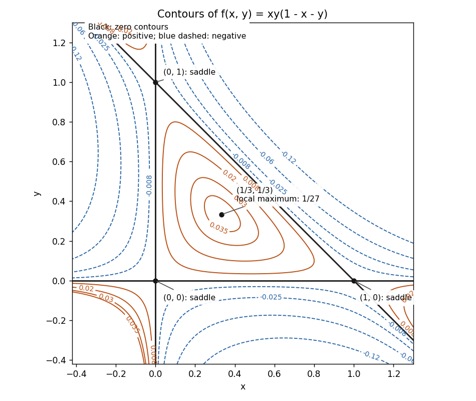

# Paper 2

↑ **Parent:** [Ia](../ia.md)

[https://www.maths.cam.ac.uk/undergrad/pastpapers/files/2010/PaperIA_2.pdf](https://www.maths.cam.ac.uk/undergrad/pastpapers/files/2010/PaperIA_2.pdf)

**Table of contents**

- [1A](#1a)
  - [i](#1a/i)
    - [Solution](#1a/i/solution)
  - [ii](#1a/ii)
    - [Solution](#1a/ii/solution)
  - [iii](#1a/iii)
    - [Solution](#1a/iii/solution)
  - [iv](#1a/iv)
    - [Solution](#1a/iv/solution)
- [2A](#2a)
  - [Solution](#2a/solution)
- [3F](#3f)
  - [a](#3f/a)
    - [Solution](#3f/a/solution)
  - [b](#3f/b)
    - [Solution](#3f/b/solution)
- [4F](#4f)
  - [a](#4f/a)
    - [Solution](#4f/a/solution)
  - [b](#4f/b)
    - [i](#4f/b/i)
      - [Solution](#4f/b/i/solution)
    - [ii](#4f/b/ii)
      - [Solution](#4f/b/ii/solution)
  - [c](#4f/c)
    - [Solution](#4f/c/solution)
- [5A](#5a)
  - [a](#5a/a)
    - [Solution](#5a/a/solution)
  - [b](#5a/b)
    - [Solution](#5a/b/solution)
- [6A](#6a)
  - [a](#6a/a)
    - [Solution](#6a/a/solution)
  - [b](#6a/b)
    - [Solution](#6a/b/solution)
  - [c](#6a/c)
    - [Solution](#6a/c/solution)
- [7A](#7a)
  - [a](#7a/a)
    - [Solution](#7a/a/solution)
  - [b](#7a/b)
    - [Solution](#7a/b/solution)
  - [c](#7a/c)
    - [Solution](#7a/c/solution)
- [8A](#8a)
  - [a](#8a/a)
    - [Solution](#8a/a/solution)
  - [b](#8a/b)
    - [Solution](#8a/b/solution)
  - [c](#8a/c)
    - [Solution](#8a/c/solution)
- [9F](#9f)
  - [a](#9f/a)
    - [Solution](#9f/a/solution)
  - [b](#9f/b)
    - [Solution](#9f/b/solution)
  - [c](#9f/c)
    - [Solution](#9f/c/solution)
- [10F](#10f)
  - [a](#10f/a)
    - [Solution](#10f/a/solution)
  - [b](#10f/b)
    - [Solution](#10f/b/solution)
  - [c](#10f/c)
    - [Solution](#10f/c/solution)
  - [d](#10f/d)
    - [Solution](#10f/d/solution)
- [11F](#11f)
  - [a](#11f/a)
    - [Solution](#11f/a/solution)
  - [b](#11f/b)
    - [Solution](#11f/b/solution)
  - [c](#11f/c)
    - [Solution](#11f/c/solution)
- [12F](#12f)
  - [a](#12f/a)
    - [Solution](#12f/a/solution)
  - [b](#12f/b)
    - [Solution](#12f/b/solution)
  - [c](#12f/c)
    - [Solution](#12f/c/solution)

## 1A

↑ **Parent:** [Paper 2](paper-2.md)

<h3 id="1a/i">i</h3>

↑ **Parent:** [1A](#1a)

<h4 id="1a/i/solution">Solution</h4>

↑ **Parent:** [I](#1a/i)

Substitution of $y_n=r^n$ gives the [characteristic equation of a linear recurrence](../../../algebra.md#characteristic-equation-of-a-linear-recurrence)

$$
r^3-3r+2=(r-1)^2(r+2)=0.
$$

The [repeated characteristic root of a linear recurrence](../../../algebra.md#repeated-characteristic-root-of-a-linear-recurrence) $1$ supplies the solutions $1$ and $n$, while the simple root $-2$ supplies $(-2)^n$. They are linearly independent: their values at three consecutive indices have nonzero determinant. A third-order [linear recurrence relation](../../../algebra.md#linear-recurrence-relation) is uniquely determined by three consecutive initial values, so these three solutions span its solution space. **The general solution is**

$$
\boxed{y_n=A+Bn+C(-2)^n.}
$$

<h3 id="1a/ii">ii</h3>

↑ **Parent:** [1A](#1a)

<h4 id="1a/ii/solution">Solution</h4>

↑ **Parent:** [Ii](#1a/ii)

Let $L[y]_n=y_{n+3}-3y_{n+1}+2y_n$. For the exponential trial sequence $D2^n$,

$$
L[D2^n]=(8-6+2)D2^n=4D2^n.
$$

Thus $D=1/4$ gives a [particular solution](../../../differential-equation.md#particular-solution). The difference of any two solutions of the [inhomogeneous linear recurrence](../../../algebra.md#inhomogeneous-linear-recurrence) satisfies the homogeneous [linear recurrence relation](../../../algebra.md#linear-recurrence-relation) in part (i). **Therefore**

$$
\boxed{y_n=A+Bn+C(-2)^n+\frac{2^n}{4}.}
$$

<h3 id="1a/iii">iii</h3>

↑ **Parent:** [1A](#1a)

<h4 id="1a/iii/solution">Solution</h4>

↑ **Parent:** [Iii](#1a/iii)

The forcing base $-2$ is a root of the [characteristic equation of a linear recurrence](../../../algebra.md#characteristic-equation-of-a-linear-recurrence), so a constant multiple of $(-2)^n$ cannot be a [particular solution](../../../differential-equation.md#particular-solution). For $P(r)=r^3-3r+2$, direct substitution gives

$$
L[nr^n]=r^n\bigl(nP(r)+rP'(r)\bigr).
$$

For the resonant case of [exponential forcing in a linear recurrence](../../../algebra.md#exponential-forcing-in-a-linear-recurrence), at $r=-2$, $P(-2)=0$ and $(-2)P'(-2)=-18$. Hence $-(n/18)(-2)^n$ is a [particular solution](../../../differential-equation.md#particular-solution) of the [inhomogeneous linear recurrence](../../../algebra.md#inhomogeneous-linear-recurrence). **The general solution is**

$$
\boxed{y_n=A+Bn+C(-2)^n-\frac n{18}(-2)^n.}
$$

<h3 id="1a/iv">iv</h3>

↑ **Parent:** [1A](#1a)

<h4 id="1a/iv/solution">Solution</h4>

↑ **Parent:** [Iv](#1a/iv)

The [superposition principle](../../../vector-space.md#superposition-principle) applies because the recurrence operator is linear. Add the [particular solutions](../../../differential-equation.md#particular-solution) from parts (ii) and (iii), then add the general homogeneous [linear recurrence relation](../../../algebra.md#linear-recurrence-relation) solution from part (i). **This gives**

$$
\boxed{y_n=A+Bn+C(-2)^n-\frac n{18}(-2)^n+\frac{2^n}{4}.}
$$

## 2A

↑ **Parent:** [Paper 2](paper-2.md)

<h3 id="2a/solution">Solution</h3>

↑ **Parent:** [2A](#2a)

The first-order [chain rule](../../../calculus.md#chain-rule), with $x,y$ regarded as functions of $u,v$, is

$$
g_u=x_uf_x+y_uf_y,\qquad g_v=x_vf_x+y_vf_y.
$$

Apply the [product rule](../../../calculus.md#product-rule) when differentiating the first identity in $v$, and apply the [chain rule](../../../calculus.md#chain-rule) to $f_x,f_y$. Equality of mixed [partial derivatives](../../../calculus.md#partial-derivative) for a $C^2$ function gives

$$
g_{uv}=x_ux_vf_{xx}+(x_uy_v+x_vy_u)f_{xy}
+y_uy_vf_{yy}+x_{uv}f_x+y_{uv}f_y.
$$

**Thus $\boxed{H=x_{uv},\ K=y_{uv}}$.** These terms record the second derivatives of the coordinate transformation, not of $f$.

For the given transformation,

$$
x_u=v,\quad x_v=u,\quad y_u=\frac1v,\quad y_v=-\frac u{v^2},
\quad x_{uv}=1,\quad y_{uv}=-\frac1{v^2}.
$$

The mixed-derivative coefficient is zero, while $x_ux_v=x$, $y_uy_v=-y^2/x$, and $1/v^2=y/x$. The required [partial differential equation](../../../partial-differential-equation.md) is therefore exactly $g_{uv}=0$. Integrating first in $u$ and then in $v$ on a coordinate rectangle gives

$$
\boxed{g(u,v)=A(u)+B(v),}
$$

where $A,B$ are arbitrary twice continuously differentiable functions. The [Jacobian determinant](../../../calculus.md#jacobian-determinant) of the transformation is $-2u/v$, so this calculation uses patches with $u,v\ne0$. On a positive-quadrant patch we can take $u=\sqrt{xy}$ and $v=\sqrt{x/y}$, obtaining

$$
\boxed{f(x,y)=A(\sqrt{xy})+B(\sqrt{x/y}).}
$$

Changing branches merely redefines the arbitrary functions.

For completeness, the original equation also makes sense in quadrants with $xy<0$, where that particular real square-root transformation is unavailable. Multiplying the equation by $x$ gives

$$
(x\partial_x)^2f-(y\partial_y)^2f=0.
$$

On any quadrant with $xy\ne0$, put $a=\log|x|$, $b=\log|y|$; then set $\xi=a+b$, $\eta=a-b$. The equation becomes $4f_{\xi\eta}=0$. Thus an equivalent general local answer on every such quadrant is

$$
\boxed{f(x,y)=\Phi(\log|xy|)+\Psi(\log|x/y|).}
$$

Here $\Phi,\Psi$ are arbitrary $C^2$ functions on the relevant intervals. If a solution is required across $y=0$, its quadrant expressions must extend with matching derivatives; on that line the equation itself imposes $xf_{xx}(x,0)+f_x(x,0)=0$, so its trace is $a_0\log|x|+b_0$ on each interval with $x\ne0$. The displayed coordinate transformations do not assert invertibility at $y=0$.

## 3F

↑ **Parent:** [Paper 2](paper-2.md)

<h3 id="3f/a">a</h3>

↑ **Parent:** [3F](#3f)

<h4 id="3f/a/solution">Solution</h4>

↑ **Parent:** [A](#3f/a)

For $m\geq2$, $f''(x)=m(m-1)x^{m-2}\geq0$ on $[0,\infty)$, so $f$ is a [convex function](../../../real-analysis.md#convex-function); for $m=1$ it is linear and also convex. The equally weighted [random variable](../../../random-variable.md) has [expected value](../../../probability-theory.md#expected-value) $EX=N^{-1}\sum_i x_i=1/N$. Applying [Jensen's inequality](../../../real-analysis.md#jensen-s-inequality) gives

$$
\frac1N\sum_{i=1}^N f(x_i)=Ef(X)\geq f(EX)=f(1/N).
$$

Multiplying by $N$ proves

$$
\boxed{\sum_{i=1}^N x_i^m\geq N^{1-m}.}
$$

For $m>1$ equality requires all $x_i=1/N$, by strict convexity; for $m=1$ equality holds for every admissible vector.

<h3 id="3f/b">b</h3>

↑ **Parent:** [3F](#3f)

<h4 id="3f/b/solution">Solution</h4>

↑ **Parent:** [B](#3f/b)

For a fixed horse $i$, [independence](../../../random-variable.md#independent-random-variables) of the race results gives [probability](../../../probability-theory.md#probability) $p_i^m$ of winning every race. The events that different horses win every race are disjoint, so

$$
\boxed{Q=\sum_{i=1}^N p_i^m.}
$$

This is a homogeneous [polynomial](../../../polynomial.md) of degree $m$. Apply part (a) to the nonnegative numbers $p_i$, whose sum is one, to obtain **$\boxed{Q\geq N^{1-m}}$**. For $m>1$ the smallest [probability](../../../probability-theory.md#probability) occurs when every horse has winning [probability](../../../probability-theory.md#probability) $1/N$; for a single race $Q=1$ regardless of these [probabilities](../../../probability-theory.md#probability).

## 4F

↑ **Parent:** [Paper 2](paper-2.md)

<h3 id="4f/a">a</h3>

↑ **Parent:** [4F](#4f)

<h4 id="4f/a/solution">Solution</h4>

↑ **Parent:** [A](#4f/a)

Put $U=X-EX$ and $V=Y-EY$. Their second moments are the finite positive [variances](../../../variance.md) of $X,Y$. The [Cauchy-Schwarz inequality](../../../probability-and-statistics.md#cauchy-schwarz-inequality) for square-integrable [random variables](../../../random-variable.md) gives

$$
|E(UV)|^2\leq E(U^2)E(V^2)=\operatorname{Var}X\,\operatorname{Var}Y.
$$

Divide by the positive product of [variances](../../../variance.md) and take square roots. **The correlation bound is $\boxed{-1\leq\rho(X,Y)\leq1}$.** As usual, non-constant here means not almost surely constant, so that the denominator is nonzero.

<h3 id="4f/b">b</h3>

↑ **Parent:** [4F](#4f)

<h4 id="4f/b/i">i</h4>

↑ **Parent:** [B](#4f/b)

<h5 id="4f/b/i/solution">Solution</h5>

↑ **Parent:** [I](#4f/b/i)

**Zero correlation means that the variables are uncorrelated:** $E[(X-EX)(Y-EY)]=0$, or equivalently $E(XY)=EX\,EY$. It does not imply [independence](../../../random-variable.md#independent-random-variables). For example, if $X$ is uniform on $[-1,1]$ and $Y=X^2$, symmetry gives $EX=E(X^3)=0$, hence zero [covariance](../../../variance.md#covariance), although $Y$ is determined by $X$. Both [random variables](../../../random-variable.md) are non-constant and have finite positive [variances](../../../variance.md).

<h4 id="4f/b/ii">ii</h4>

↑ **Parent:** [B](#4f/b)

<h5 id="4f/b/ii/solution">Solution</h5>

↑ **Parent:** [Ii](#4f/b/ii)

**Perfect correlation means an affine relation almost surely:** there are constants $a\ne0,b$ such that $Y=aX+b$ almost surely. The sign of $a$ is the sign of the [correlation coefficient](../../../variance.md#pearson-correlation-coefficient). More precisely, equality in the [Cauchy-Schwarz inequality](../../../probability-and-statistics.md#cauchy-schwarz-inequality) gives

$$
\boxed{\frac{Y-EY}{\sqrt{\operatorname{Var}Y}}
=\rho(X,Y)\frac{X-EX}{\sqrt{\operatorname{Var}X}}\quad\text{almost surely}.}
$$

<h3 id="4f/c">c</h3>

↑ **Parent:** [4F](#4f)

<h4 id="4f/c/solution">Solution</h4>

↑ **Parent:** [C](#4f/c)

Interpret the random choice as an independent selector $B$ with $P(B=1)=r$, and write $Y=BX+(1-B)X'$. Its distribution is again uniform on $\{-1,1\}$, so $EX=EY=0$ and $\operatorname{Var}X=\operatorname{Var}Y=1$. By [independence](../../../random-variable.md#independent-random-variables),

$$
E(XY)=rE(X^2)+(1-r)E(XX')=r.
$$

Consequently **$\boxed{\rho(X,Y)=r}$**. The independent selector is the standard meaning of the stated mixture; a choice depending on the signs would describe a different model.

## 5A

↑ **Parent:** [Paper 2](paper-2.md)

<h3 id="5a/a">a</h3>

↑ **Parent:** [5A](#5a)

<h4 id="5a/a/solution">Solution</h4>

↑ **Parent:** [A](#5a/a)

Let $D=d/dx$ and write the constant-coefficient [linear ordinary differential equation](../../../differential-equation.md#linear-ordinary-differential-equation) as $p(D)y=0$. Since $D^ke^{\lambda x}=\lambda^ke^{\lambda x}$,

$$
p(D)e^{\lambda x}=p(\lambda)e^{\lambda x}.
$$

The exponential never vanishes, so **$\boxed{e^{\lambda x}\text{ solves the equation }\Longleftrightarrow p(\lambda)=0}$**.

For the second claim, the [product rule](../../../calculus.md#product-rule) gives

$$
D^k(xe^{\mu x})=e^{\mu x}(x\mu^k+k\mu^{k-1})
$$

for $k\geq1$, with the $k=0$ term treated separately. Summing the coefficients yields

$$
p(D)(xe^{\mu x})=e^{\mu x}\bigl(xp(\mu)+p'(\mu)\bigr).
$$

A root of multiplicity at least two has $p(\mu)=p'(\mu)=0$, proving **$xe^{\mu x}$ is also a solution**. This directly establishes the repeated-root contribution without assuming a solution formula. If the displayed coefficient list has leading zeros, the exponential calculation still applies to its actual [polynomial](../../../polynomial.md) degree.

<h3 id="5a/b">b</h3>

↑ **Parent:** [5A](#5a)

<h4 id="5a/b/solution">Solution</h4>

↑ **Parent:** [B](#5a/b)

Set $v=u''$. The resulting [second-order linear differential equation](../../../differential-equation.md#second-order-linear-differential-equation) is $v''+2v=4t^2$. A [polynomial](../../../polynomial.md) [particular solution](../../../differential-equation.md#particular-solution) $v_p=at^2+b$ requires $2a=4$ and $2a+2b=0$, hence $v_p=2t^2-2$. The homogeneous [characteristic roots of a constant-coefficient differential equation](../../../differential-equation.md#characteristic-root-of-a-constant-coefficient-differential-equation) are $\pm i\sqrt2$, so

$$
v=A_1\cos(\sqrt2t)+B_1\sin(\sqrt2t)+2t^2-2.
$$

Integrating twice and renaming constants gives **the general real solution**

$$
\boxed{u(t)=A\cos(\sqrt2t)+B\sin(\sqrt2t)+Ct+D+\frac{t^4}{6}-t^2.}
$$

The four independent homogeneous terms account for the four initial data of the fourth-order [linear ordinary differential equation](../../../differential-equation.md#linear-ordinary-differential-equation).

For the substitution $u(t)=y(t^2)$, repeated use of the [chain rule](../../../calculus.md#chain-rule), with $x=t^2$, gives

$$
u''=2y'+4t^2y'',\qquad
u''''=12y''+48t^2y'''+16t^4y''''.
$$

Therefore

$$
u''''+2u''=4\bigl(4x^2y''''+12xy'''+(3+2x)y''+y'\bigr).
$$

For $x>0$, the map $t=\sqrt x$ is invertible, and the transformed equation is exactly the equation just solved. Hence **the general real solution on $x>0$ is**

$$
\boxed{y(x)=A\cos(\sqrt{2x})+B\sin(\sqrt{2x})+C\sqrt x+D+\frac{x^2}{6}-x.}
$$

There is no requirement that $u$ extend as an even function through $t=0$: only the branch $t>0$ is needed, so the sine and square-root terms must be retained.

## 6A

↑ **Parent:** [Paper 2](paper-2.md)

<h3 id="6a/a">a</h3>

↑ **Parent:** [6A](#6a)

<h4 id="6a/a/solution">Solution</h4>

↑ **Parent:** [A](#6a/a)

Substitute the [power series](../../../real-analysis.md#power-series) and compare coefficients. The constant coefficient gives $-a_1-a_0=0$. For $k\geq1$, the coefficient of $x^k$ gives

$$
(k+1)(k-1)a_{k+1}+(k-1)a_k=0.
$$

Thus $a_1=-a_0$, while the $k=1$ equation places no restriction on $a_2$. For $k\geq2$,

$$
a_{k+1}=-\frac{a_k}{k+1},\qquad
a_k=\frac{2a_2(-1)^k}{k!}.
$$

The [power series](../../../real-analysis.md#power-series) therefore sums to

$$
y=a_0(1-x)+2a_2(e^{-x}-1+x).
$$

Renaming the two arbitrary constants gives **$\boxed{y(x)=C(1-x)+De^{-x}}$**.

Both functions solve the equation by direct substitution. Their [Wronskian](../../../differential-equation.md#wronskian), in the order $1-x,e^{-x}$, is $xe^{-x}$, which is nonzero for $x\ne0$. Hence they give the full two-dimensional solution space on either interval away from the singular point. Both are entire, and the displayed formula also gives every twice continuously differentiable solution through zero: matching $y(0)$ and $y''(0)$ fixes the same $C,D$ on the two sides.

<h3 id="6a/b">b</h3>

↑ **Parent:** [6A](#6a)

<h4 id="6a/b/solution">Solution</h4>

↑ **Parent:** [B](#6a/b)

For two solutions $y_1,y_2$, define their [Wronskian](../../../differential-equation.md#wronskian) by

$$
W=y_1y_2'-y_1'y_2.
$$

Differentiation and substitution of the [second-order linear differential equation](../../../differential-equation.md#second-order-linear-differential-equation) give

$$
W'=y_1y_2''-y_1''y_2
=y_1(-py_2'-qy_2)-(-py_1'-qy_1)y_2=-pW.
$$

This proves the [Abel identity](../../../differential-equation.md#abel-s-identity) and hence

$$
\boxed{W(x)=C\exp\left(-\int_{x_0}^x p(r)\,dr\right).}
$$

On an interval where the known solution $y_1$ does not vanish,

$$
\left(\frac{y_2}{y_1}\right)'=\frac{W}{y_1^2}.
$$

Integrating gives the [reduction of order](../../../differential-equation.md#reduction-of-order) formula

$$
\boxed{y_2(x)=y_1(x)\int_{x_0}^x
\frac{\exp(-\int_{x_0}^s p(r)\,dr)}{y_1(s)^2}\,ds.}
$$

Choosing the normalization $C=1$ makes the [Wronskian](../../../differential-equation.md#wronskian) nonzero, so this solution is linearly independent of $y_1$. To verify it really solves the equation, write $y_2=y_1h$. Its equation reduces to

$$
y_1h''+(2y_1'+py_1)h'=0;
$$

the integrand gives $h'=\exp(-\int p)/y_1^2$, which satisfies this equation on differentiation. Adding an integration constant only adds a multiple of $y_1$. The formula is local where $y_1\ne0$; at a zero of $y_1$ with regular coefficients, the actual solution can be continued by initial-value existence and uniqueness, even if its integral representation has an apparent singularity.

<h3 id="6a/c">c</h3>

↑ **Parent:** [6A](#6a)

<h4 id="6a/c/solution">Solution</h4>

↑ **Parent:** [C](#6a/c)

Multiply the equation by $x$ to obtain $xy''-P(x)y'-Q(x)y=0$. The leading terms after a [Frobenius method](../../../complex-analysis.md#frobenius-method) trial $y=x^r$ are

$$
\bigl(r(r-1)-P_0r\bigr)x^{r-1};
$$

the term involving $Q_0$ first appears at order $x^r$. The [indicial equation](../../../differential-equation.md#indicial-equation) is therefore

$$
r(r-1-P_0)=0,\qquad \boxed{r=0,\ P_0+1.}
$$

To obtain the [first correction to a regular singular solution by reduction of order](../../../differential-equation.md#first-correction-to-a-regular-singular-solution-by-reduction-of-order), start from the assumed solution $y_1=1+\beta x+O(x^2)$ and use the [Abel identity](../../../differential-equation.md#abel-s-identity):

$$
W=C\exp\left(\int\frac{P(x)}x\,dx\right)
=Cx^{P_0}\bigl(1+P_1x+O(x^2)\bigr).
$$

We work initially on $x>0$ near zero; since $P_0$ is a positive integer, the resulting expansion is an ordinary [power series](../../../real-analysis.md#power-series). Also $y_1^{-2}=1-2\beta x+O(x^2)$, so the [reduction of order](../../../differential-equation.md#reduction-of-order) integral has integrand

$$
\frac{W}{y_1^2}=Cx^{P_0}\bigl(1+(P_1-2\beta)x+O(x^2)\bigr).
$$

Choose its integration constant to be zero, eliminating an added multiple of $y_1$. Integrating and multiplying by $y_1$ gives

$$
y_2=C\left[\frac{x^{P_0+1}}{P_0+1}
+\left(\frac{\beta}{P_0+1}+\frac{P_1-2\beta}{P_0+2}\right)x^{P_0+2}
+O(x^{P_0+3})\right].
$$

With $C=P_0+1$ the requested normalized answer is

$$
\boxed{y_2=x^{P_0+1}
+\frac{(P_0+1)P_1-P_0\beta}{P_0+2}x^{P_0+2}
+O(x^{P_0+3}).}
$$

Its nonzero [Wronskian](../../../differential-equation.md#wronskian) makes it independent of $y_1$. The existence of the asserted $y_1$ also forces $P_0\beta+Q_0=0$; there is no need to introduce $Q_0$ into the normalized second coefficient.

## 7A

↑ **Parent:** [Paper 2](paper-2.md)

<h3 id="7a/a">a</h3>

↑ **Parent:** [7A](#7a)

<h4 id="7a/a/solution">Solution</h4>

↑ **Parent:** [A](#7a/a)

Write the coefficient matrix as $M$. Its [characteristic polynomial](../../../linear-operator-theory.md#characteristic-polynomial) is $\det(rI-M)=r(r-2)(r+2)$. Corresponding [eigenvectors](../../../linear-operator-theory.md#eigenvector) are

$$
v_-=(-1,1,1)^T,\qquad v_0=(1,1,1)^T,\qquad
v_+=(-1,-1,1)^T,
$$

with [eigenvalues](../../../linear-operator-theory.md#eigenvalue) $-2,0,2$ respectively, as direct multiplication verifies. Distinct [eigenvalues](../../../linear-operator-theory.md#eigenvalue) make these vectors a basis. Expanding a solution as $z_-v_-+z_0v_0+z_+v_+$ decouples the [linear ordinary differential equations](../../../differential-equation.md#linear-ordinary-differential-equation) into $\dot z_-=-2z_-$, $\dot z_0=0$, $\dot z_+=2z_+$. Thus **the general solution is**

$$
\boxed{\begin{pmatrix}x\\y\\z\end{pmatrix}
=Ae^{-2t}v_-+Bv_0+Ce^{2t}v_+.}
$$

<h3 id="7a/b">b</h3>

↑ **Parent:** [7A](#7a)

<h4 id="7a/b/solution">Solution</h4>

↑ **Parent:** [B](#7a/b)

The forcing vector has the [eigenvector](../../../linear-operator-theory.md#eigenvector) decomposition

$$
(-\lambda,1,\lambda)^T
=\frac{\lambda+1}{2}v_-+\frac{\lambda-1}{2}v_+.
$$

There is no component in the zero [eigenvalue](../../../linear-operator-theory.md#eigenvalue) direction. The scalar [inhomogeneous linear differential equations](../../../differential-equation.md#inhomogeneous-linear-differential-equation) in this basis are

$$
\dot z_-=-2z_-+(\lambda+1)e^{2t},\qquad
\dot z_0=0,\qquad
\dot z_+=2z_++(\lambda-1)e^{2t}.
$$

For the first, a [particular solution](../../../differential-equation.md#particular-solution) is $(\lambda+1)e^{2t}/4$. For the third, multiplying by the [integrating factor](../../../differential-equation.md#integrating-factor) $e^{-2t}$ gives $(e^{-2t}z_+)'=\lambda-1$. Consequently **for every real $\lambda$**

$$
\boxed{\begin{pmatrix}x\\y\\z\end{pmatrix}
=\left(Ae^{-2t}+\frac{\lambda+1}{4}e^{2t}\right)v_-
+Bv_0+\bigl(C+(\lambda-1)t\bigr)e^{2t}v_+.}
$$

When $\lambda=1$, the resonant component vanishes and a [particular solution](../../../differential-equation.md#particular-solution) is $\tfrac12v_-e^{2t}$, of the stipulated constant-vector form. If $\lambda\ne1$, substituting $ce^{2t}$ would require $(2I-M)c=2(-\lambda,1,\lambda)^T$. In the [eigenbasis](../../../linear-operator-theory.md#eigenbasis) the left side has zero $v_+$ component, while the right side has component $\lambda-1$. This is impossible. The factor $t$ is therefore unavoidable: it is [resonance in a differential equation](../../../differential-equation.md#resonance-in-a-differential-equation).

<h3 id="7a/c">c</h3>

↑ **Parent:** [7A](#7a)

<h4 id="7a/c/solution">Solution</h4>

↑ **Parent:** [C](#7a/c)

At $\lambda=-1$ the $v_-$ forcing vanishes and the $v_+$ forcing coefficient is $-2$. The initial vector decomposes as

$$
(0,1,0)^T=\frac12v_- -\frac12v_+.
$$

Thus $A=1/2$, $B=0$, $C=-1/2$ in part (b), and **the requested solution is**

$$
\boxed{\begin{pmatrix}x\\y\\z\end{pmatrix}
=\frac12e^{-2t}v_--\left(\frac12+2t\right)e^{2t}v_+.}
$$

Equivalently,

$$
x=\frac12(1+4t)e^{2t}-\frac12e^{-2t},\quad
y=\frac12(1+4t)e^{2t}+\frac12e^{-2t},\quad
z=\frac12e^{-2t}-\frac12(1+4t)e^{2t}.
$$

These expressions have the required initial values and solve all three [linear ordinary differential equations](../../../differential-equation.md#linear-ordinary-differential-equation).

## 8A

↑ **Parent:** [Paper 2](paper-2.md)

<h3 id="8a/a">a</h3>

↑ **Parent:** [8A](#8a)

<h4 id="8a/a/solution">Solution</h4>

↑ **Parent:** [A](#8a/a)

At a [critical point](../../../analysis.md#critical-point) $p$ of a twice continuously differentiable function, the linear term in the [Taylor expansion](../../../calculus.md#taylor-expansion) vanishes:

$$
f(p+h)=f(p)+\frac12h^THh+o(\|h\|^2).
$$

The real symmetric [Hessian matrix](../../../calculus.md#hessian-matrix) has an [orthonormal basis](../../../linear-algebra.md#orthonormal-basis) of [eigenvectors](../../../linear-operator-theory.md#eigenvector). If all its [eigenvalues](../../../linear-operator-theory.md#eigenvalue) are positive, its quadratic term is bounded below by a positive multiple of $\|h\|^2$, giving a **strict [local minimum](../../../analysis.md#local-minimum)**. If all are negative, it gives a **strict [local maximum](../../../analysis.md#local-maximum)**. If positive and negative [eigenvalues](../../../linear-operator-theory.md#eigenvalue) both occur, directions along their [eigenvectors](../../../linear-operator-theory.md#eigenvector) give values on both sides of $f(p)$, so the point is a **saddle point of a scalar function**. The non-singularity assumption excludes zero [eigenvalues](../../../linear-operator-theory.md#eigenvalue); with them the quadratic test may be inconclusive and higher-order terms are needed.

<h3 id="8a/b">b</h3>

↑ **Parent:** [8A](#8a)

<h4 id="8a/b/solution">Solution</h4>

↑ **Parent:** [B](#8a/b)

The [gradient](../../../calculus.md#gradient) components are

$$
f_x=y(1-2x-y),\qquad f_y=x(1-x-2y).
$$

If $x=0$ or $y=0$, their simultaneous zeros give $(0,0),(0,1),(1,0)$. If $xy\ne0$, solving $2x+y=1$, $x+2y=1$ gives $(1/3,1/3)$. These are all the [critical points](../../../analysis.md#critical-point). The [Hessian matrix](../../../calculus.md#hessian-matrix) is

$$
H(x,y)=\begin{pmatrix}-2y&1-2x-2y\\1-2x-2y&-2x\end{pmatrix}.
$$

At each of $(0,0),(1,0),(0,1)$ its [determinant](../../../linear-algebra.md#determinant) is $-1$, so its two [eigenvalues](../../../linear-operator-theory.md#eigenvalue) have opposite signs. **All three are saddle points of a scalar function.** At $(1/3,1/3)$,

$$
H=\begin{pmatrix}-2/3&-1/3\\-1/3&-2/3\end{pmatrix},
\qquad \operatorname{spec}(H)=\{-1,-1/3\}.
$$

**This point is a strict [local maximum](../../../analysis.md#local-maximum), of value $\boxed{1/27}$.**

The zero [level set](../../../topology.md#level-set) is exactly

$$
\boxed{\{x=0\}\ \cup\ \{y=0\}\ \cup\ \{x+y=1\}.}
$$

These three lines form a triangle containing the maximum. Inside it $f>0$; near the maximum positive [level sets](../../../topology.md#level-set) are nested closed curves, with their leading shapes elliptical because the [Hessian matrix](../../../calculus.md#hessian-matrix) is negative definite. At each vertex the zero lines cross, separating alternating signs, and nearby nonzero [level sets](../../../topology.md#level-set) have hyperbolic branches. For example, the leading quadratic terms are $xy$ at $(0,0)$, $-\eta(\xi+\eta)$ for $\xi=x-1,\eta=y$ at $(1,0)$, and $-\xi(\xi+\eta)$ for $\xi=x,\eta=y-1$ at $(0,1)$.

**[Figure 1](#8a/b/image-contours-of-xy-1-x-y-showing-three-saddle-points-the-interior-maximum-and-the-three-zero-lines). Contours of xy(1-x-y), showing three saddle points, the interior maximum, and the three zero lines**.

<h3 id="8a/c">c</h3>

↑ **Parent:** [8A](#8a)

<h4 id="8a/c/solution">Solution</h4>

↑ **Parent:** [C](#8a/c)

Put $\xi=x$ and $\eta=y-1$. The [polynomial](../../../polynomial.md) becomes

$$
g=-\xi^3(1+\eta)^2(\xi+\eta)
=-\xi^4-\xi^3\eta+O\bigl((|\xi|+|\eta|)^5\bigr).
$$

There are no terms of degree one or two, so the [gradient](../../../calculus.md#gradient) and the entire [Hessian matrix](../../../calculus.md#hessian-matrix) vanish at $(0,1)$. It is a [critical point](../../../analysis.md#critical-point) with singular [Hessian matrix](../../../calculus.md#hessian-matrix). **The lowest nontrivial approximation is**

$$
\boxed{g(x,y)\sim-x^3\bigl(x+(y-1)\bigr),}
$$

understood as the fourth-degree leading term rather than a uniform ratio asymptotic along its zero directions.

On the path $\eta=0$ the exact value is $-\xi^4<0$ for $\xi\ne0$. On the path $\eta=-2\xi$ it is $\xi^4(1-2\xi)^2>0$ for sufficiently small nonzero $\xi$. Both paths approach the point, where $g=0$. **It is neither a [local maximum](../../../analysis.md#local-maximum) nor a [local minimum](../../../analysis.md#local-minimum); it is a degenerate saddle point of a scalar function.** The [higher-order saddle test](../../../analysis.md#higher-order-saddle-test) supplies the conclusion the singular [Hessian matrix](../../../calculus.md#hessian-matrix) cannot supply.

## 9F

↑ **Parent:** [Paper 2](paper-2.md)

<h3 id="9f/a">a</h3>

↑ **Parent:** [9F](#9f)

<h4 id="9f/a/solution">Solution</h4>

↑ **Parent:** [A](#9f/a)

A [geometric distribution](../../../discrete-probability-distribution.md#geometric-distribution) with parameter $p$ on $\{1,2,\ldots\}$ has [probability mass function](../../../probability-theory.md#probability-mass-function)

$$
\boxed{P(X=n)=(1-p)^{n-1}p,\qquad n\geq1.}
$$

It counts the trial on which the first success occurs in independent trials with success [probability](../../../probability-theory.md#probability) $p$. Its [probability generating function](../../../probability-theory.md#probability-generating-function) is $ps/[1-(1-p)s]$. Differentiating at $s=1$ gives

$$
EX=\frac1p,\qquad \operatorname{Var}X=\frac{1-p}{p^2}.
$$

This support convention is important: a count of failures before the first success would start at zero.

<h3 id="9f/b">b</h3>

↑ **Parent:** [9F](#9f)

<h4 id="9f/b/solution">Solution</h4>

↑ **Parent:** [B](#9f/b)

This is the [waiting time to observe both Bernoulli outcomes](../../../discrete-probability-distribution.md#waiting-time-to-observe-both-bernoulli-outcomes). Write $q=1-p$, and let $S$ record the sex of the first captured animal. That first capture is always needed. If $S$ is male, every subsequent trial independently produces the required female with [probability](../../../probability-theory.md#probability) $q$, so $N-1$ has a [geometric distribution](../../../discrete-probability-distribution.md#geometric-distribution) with parameter $q$. If $S$ is female, $N-1$ has a [geometric distribution](../../../discrete-probability-distribution.md#geometric-distribution) with parameter $p$. By the [law of total expectation](../../../measure-theory.md#law-of-total-expectation),

$$
EN=1+p\frac1q+q\frac1p.
$$

Since $p+q=1$, this simplifies to **$\boxed{EN=1/(pq)-1}$**, or

$$
\boxed{EN=\frac1{p(1-p)}-1.}
$$

The [expectation](../../../probability-theory.md#expected-value) includes both the first capture and the final capture completing the pair.

<h3 id="9f/c">c</h3>

↑ **Parent:** [9F](#9f)

<h4 id="9f/c/solution">Solution</h4>

↑ **Parent:** [C](#9f/c)

Use the same first-sex conditioning as in part (b). The conditional [variances](../../../variance.md) are $p/q^2$ after a male first capture and $q/p^2$ after a female first capture. Thus

$$
E[\operatorname{Var}(N\mid S)]=\frac{p^2}{q^2}+\frac{q^2}{p^2}.
$$

The conditional [expected values](../../../probability-theory.md#expected-value) are $1+1/q$ and $1+1/p$, with [probabilities](../../../probability-theory.md#probability) $p,q$. A variable taking two values $a,b$ with [probabilities](../../../probability-theory.md#probability) $p,q$ has [variance](../../../variance.md) $pq(a-b)^2$, so

$$
\operatorname{Var}(E[N\mid S])=pq\left(\frac1q-\frac1p\right)^2
=\frac{(p-q)^2}{pq}.
$$

The [law of total variance](../../../probability-theory.md#law-of-total-variance) now gives

$$
\boxed{\operatorname{Var}N=\frac{p^2}{q^2}+\frac{q^2}{p^2}
+\frac{(p-q)^2}{pq}
=\frac1{p^2q^2}-\frac3{pq}-2,\qquad q=1-p.}
$$

At $p=q=1/2$ this gives [variance](../../../variance.md) $2$, consistent with $N$ being one plus a geometric waiting time of parameter $1/2$.

## 10F

↑ **Parent:** [Paper 2](paper-2.md)

<h3 id="10f/a">a</h3>

↑ **Parent:** [10F](#10f)

<h4 id="10f/a/solution">Solution</h4>

↑ **Parent:** [A](#10f/a)

The event $Y_n\leq z$ occurs precisely when every one of the first $n$ levels is at most $z$. Their [independence](../../../random-variable.md#independent-random-variables) gives the [cumulative distribution function](../../../probability-theory.md#cumulative-distribution-function)

$$
\boxed{P(Y_n\leq z)=F(z)^n,\qquad z\geq0.}
$$

For any nonnegative [random variable](../../../random-variable.md), the pointwise identity $Y_n=\int_0^\infty\mathbf1_{\{Y_n>z\}}\,dz$ and the [Tonelli theorem](../../../measure-theory.md#tonelli-theorem) allow interchange of [expectation](../../../probability-theory.md#expected-value) and integral. Hence

$$
\boxed{EY_n=\int_0^\infty P(Y_n>z)\,dz
=\int_0^\infty[1-F(z)^n]\,dz.}
$$

This identity holds as an extended nonnegative integral; finiteness of the mean is not guaranteed by continuity of $F$.

<h3 id="10f/b">b</h3>

↑ **Parent:** [10F](#10f)

<h4 id="10f/b/solution">Solution</h4>

↑ **Parent:** [B](#10f/b)

The future levels are independent of the observed maximum. Given $Y_n=z$, the first $k-1$ future levels must be at most $z$, and the $k$th must exceed $z$. Each non-overflow has [probability](../../../probability-theory.md#probability) $F(z)$ and an overflow has [probability](../../../probability-theory.md#probability) $1-F(z)$. Therefore

$$
\boxed{P(\tau=k\mid Y_n=z)=F(z)^{k-1}[1-F(z)],\qquad k\geq1.}
$$

This is a [geometric distribution](../../../discrete-probability-distribution.md#geometric-distribution) of parameter $1-F(z)$ when $F(z)<1$. Since $Y_n$ has a continuous distribution, conditioning on an exact value is understood via a [regular conditional distribution](../../../probability-theory.md#regular-conditional-distribution), rather than division by $P(Y_n=z)=0$. The formula specifies its usual version. If $F(z)=1$ there is no possible overflow at that threshold, but such thresholds have [probability](../../../probability-theory.md#probability) zero for the random observed maximum.

<h3 id="10f/c">c</h3>

↑ **Parent:** [10F](#10f)

<h4 id="10f/c/solution">Solution</h4>

↑ **Parent:** [C](#10f/c)

The continuity of the [cumulative distribution function](../../../probability-theory.md#cumulative-distribution-function) gives the [probability integral transform](../../../probability-theory.md#probability-integral-transform): $F(X_i)$ is uniform on $[0,1]$. Strict monotonicity or a [probability](../../../probability-theory.md#probability) density for $F$ is not required. Since $F$ is nondecreasing,

$$
U=F(Y_n)=\max_{1\leq i\leq n}F(X_i).
$$

By [independence](../../../random-variable.md#independent-random-variables), $P(U\leq u)=u^n$ for $0\leq u\leq1$, so $U$ has [probability density function](../../../continuous-probability-distribution.md#probability-density-function) $nu^{n-1}$. Average the conditional [probability](../../../probability-theory.md#probability) in part (b) using this distribution:

$$
P(\tau=k)=n\int_0^1u^{k+n-2}(1-u)\,du
=n\left(\frac1{k+n-1}-\frac1{k+n}\right).
$$

Thus **$\boxed{P(\tau=k)=n/[(k+n-1)(k+n)]}$**. The expression telescopes to total mass one, so the waiting time is finite almost surely.

<h3 id="10f/d">d</h3>

↑ **Parent:** [10F](#10f)

<h4 id="10f/d/solution">Solution</h4>

↑ **Parent:** [D](#10f/d)

For the [waiting time for a new record after a fixed sample](../../../probability-theory.md#waiting-time-for-a-new-record-after-a-fixed-sample), given $U=F(Y_n)$, no overflow in the first $k$ subsequent years has [probability](../../../probability-theory.md#probability) $U^k$. Averaging as in part (c) yields

$$
P(\tau>k)=n\int_0^1u^{n+k-1}\,du=\frac n{n+k},\qquad k\geq0.
$$

The [tail-sum formula for expectation](../../../probability-theory.md#tail-sum-formula-for-expectation) therefore gives

$$
E\tau=\sum_{k=0}^\infty P(\tau>k)
=n\sum_{k=0}^\infty\frac1{n+k}=\infty.
$$

**The answer is $\boxed{E\tau=\infty}$.** This does not contradict almost-sure finiteness: the [tail probability](../../../probability-theory.md#tail-probability) tends to zero, but too slowly for its sum to converge.

## 11F

↑ **Parent:** [Paper 2](paper-2.md)

<h3 id="11f/a">a</h3>

↑ **Parent:** [11F](#11f)

<h4 id="11f/a/solution">Solution</h4>

↑ **Parent:** [A](#11f/a)

Conditional on $X_n=m$, the next generation is the sum of $m$ independent offspring counts, each with [probability generating function](../../../probability-theory.md#probability-generating-function) $F_1(s)$. Hence

$$
E[s^{X_{n+1}}\mid X_n=m]=F_1(s)^m.
$$

This also holds for $m=0$, when the empty sum is zero and the empty product is one. The [law of total expectation](../../../measure-theory.md#law-of-total-expectation) gives

$$
\boxed{F_{n+1}(s)=E[F_1(s)^{X_n}]=F_n(F_1(s)).}
$$

For complex $|s|\leq1$, the expectations are absolutely bounded because $|F_1(s)|\leq1$. This proves the [branching-process generating-function iteration](../../../probability-and-statistics.md#branching-process-generating-function-iteration), with $F_0(s)=s$.

<h3 id="11f/b">b</h3>

↑ **Parent:** [11F](#11f)

<h4 id="11f/b/solution">Solution</h4>

↑ **Parent:** [B](#11f/b)

**The eventual extinction [probability](../../../probability-theory.md#probability) is the smallest solution $\boxed{q\in[0,1]\text{ of }F_1(q)=q}$.** This is the [Galton-Watson extinction fixed point](../../../probability-and-statistics.md#galton-watson-extinction-fixed-point) result for one initial individual. Equivalently,

$$
q=\lim_{n\to\infty}F_n(0),
$$

since having an empty generation is an absorbing event and the extinction-by-generation events increase. In particular extinction is certain when the smallest fixed point is one. With $p_0>0$, an offspring mean at most one implies this, whereas a mean greater than one gives a fixed point below one. The fixed-point statement itself requires no finite-mean assumption.

<h3 id="11f/c">c</h3>

↑ **Parent:** [11F](#11f)

<h4 id="11f/c/solution">Solution</h4>

↑ **Parent:** [C](#11f/c)

Summing the geometric series for the offspring [probability generating function](../../../probability-theory.md#probability-generating-function) gives

$$
F_1(s)=\sum_{k=0}^\infty\frac{s^k}{2^{k+1}}=\frac1{2-s}.
$$

The fixed-point equation $s=1/(2-s)$ is $(s-1)^2=0$, whose only root in $[0,1]$ is one. The [Galton-Watson extinction fixed point](../../../probability-and-statistics.md#galton-watson-extinction-fixed-point) result therefore proves **extinction is certain**.

For the explicit iterates, the proposed formula at $n=1$ is $1/(2-s)$, so the base case holds. If it holds at $n$, part (a) gives

$$
F_{n+1}(s)=
\frac{n-(n-1)/(2-s)}{n+1-n/(2-s)}
=\frac{(n+1)-ns}{(n+2)-(n+1)s}.
$$

This is exactly the same formula with $n$ replaced by $n+1$. By induction,

$$
\boxed{F_n(s)=\frac{n-(n-1)s}{(n+1)-ns},\qquad n\geq1.}
$$

Evaluating the [probability generating function](../../../probability-theory.md#probability-generating-function) at zero selects the mass of an empty generation:

$$
\boxed{P(X_n=0)=F_n(0)=\frac n{n+1}.}
$$

These [probabilities](../../../probability-theory.md#probability) increase to one, also confirming the extinction conclusion directly.

## 12F

↑ **Parent:** [Paper 2](paper-2.md)

<h3 id="12f/a">a</h3>

↑ **Parent:** [12F](#12f)

<h4 id="12f/a/solution">Solution</h4>

↑ **Parent:** [A](#12f/a)

The nonsingular [bivariate normal distribution](../../../probability-and-statistics.md#bivariate-normal-distribution) has $\sigma_1,\sigma_2>0$ and $|\rho|<1$. Put $a=(x_1-\mu_1)/\sigma_1$ and $b=(x_2-\mu_2)/\sigma_2$. Completing the square gives

$$
a^2-2\rho ab+b^2=(b-\rho a)^2+(1-\rho^2)a^2.
$$

Consequently the joint [probability density function](../../../continuous-probability-distribution.md#probability-density-function) factors as

$$
f_{X_1,X_2}(x_1,x_2)=
\frac{e^{-a^2/2}}{\sqrt{2\pi}\sigma_1}\,
\frac{\exp[-(b-\rho a)^2/(2(1-\rho^2))]}
{\sqrt{2\pi}\sigma_2\sqrt{1-\rho^2}}.
$$

For fixed $x_1$, the second factor is a normalized [normal distribution](../../../probability-theory.md#normal-distribution) density in $x_2$, with mean $\mu_2+\rho\sigma_2a$ and standard deviation $\sigma_2\sqrt{1-\rho^2}$. Its integral is one; explicitly substitute $w=(b-\rho a)/\sqrt{1-\rho^2}$ in the [Gaussian integral](../../../calculus.md#gaussian-integral). Thus **the marginal density is**

$$
\boxed{f_{X_1}(x_1)=\frac1{\sqrt{2\pi}\sigma_1}
\exp\left[-\frac{(x_1-\mu_1)^2}{2\sigma_1^2}\right].}
$$

<h3 id="12f/b">b</h3>

↑ **Parent:** [12F](#12f)

<h4 id="12f/b/solution">Solution</h4>

↑ **Parent:** [B](#12f/b)

The other marginal is $X_2\sim N(\mu_2,\sigma_2^2)$ by the same square-completion argument with the indices exchanged. Its [moment-generating function](../../../probability-theory.md#moment-generating-function) is therefore

$$
\boxed{M_{X_2}(t)=E[e^{tX_2}]
=\exp\left(\mu_2t+\frac{\sigma_2^2t^2}{2}\right),\qquad t\in\mathbb R.}
$$

<h3 id="12f/c">c</h3>

↑ **Parent:** [12F](#12f)

<h4 id="12f/c/solution">Solution</h4>

↑ **Parent:** [C](#12f/c)

Now complete the square in the other order:

$$
a^2-2\rho ab+b^2=(a-\rho b)^2+(1-\rho^2)b^2.
$$

Divide the joint [probability density function](../../../continuous-probability-distribution.md#probability-density-function) by the positive marginal density

$$
f_{X_2}(x_2)=\frac1{\sqrt{2\pi}\sigma_2}e^{-b^2/2}.
$$

The factor $e^{-b^2/2}$ cancels, giving the [conditional probability density](../../../probability-theory.md#conditional-density)

$$
f_{X_1\mid X_2=x_2}(x_1)=
\frac1{\sqrt{2\pi}\sigma_1\sqrt{1-\rho^2}}
\exp\left[-\frac{(a-\rho b)^2}{2(1-\rho^2)}\right].
$$

Since

$$
a-\rho b=\frac{x_1-\left(\mu_1+\rho\sigma_1(x_2-\mu_2)/\sigma_2\right)}{\sigma_1},
$$

this is a normalized [normal distribution](../../../probability-theory.md#normal-distribution) density. **Hence**

$$
\boxed{X_1\mid X_2=x_2\sim
N\left(\mu_1+\rho\frac{\sigma_1}{\sigma_2}(x_2-\mu_2),
\ \sigma_1^2(1-\rho^2)\right).}
$$

Conditioning on an exact observation is interpreted through this [conditional probability density](../../../probability-theory.md#conditional-density), rather than conditioning by a ratio of event [probabilities](../../../probability-theory.md#probability).

## ↑ Ancestors (8)

1. [Ia](../ia.md)
2. [2010](../../2010.md)
3. [Past exam of the mathematics course of the University of Cambridge](../../../past-exam-of-the-mathematics-course-of-the-university-of-cambridge.md)
4. [Mathematics course of the University of Cambridge](../../../university-of-cambridge.md#mathematics-course-of-the-university-of-cambridge)
5. [Course of the University of Cambridge](../../../university-of-cambridge.md#course-of-the-university-of-cambridge)
6. [University of Cambridge](../../../university-of-cambridge.md)
7. [List of universities](../../../README.md#list-of-universities)
8. [Codex Wiki](../../../README.md)
