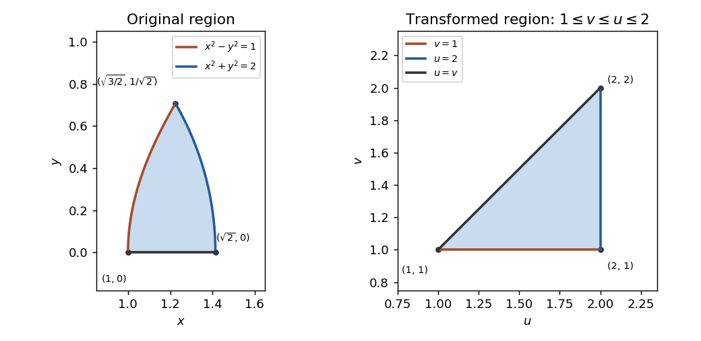

# Paper 3

↑ **Parent:** [Ia](../ia.md)

[https://www.maths.cam.ac.uk/undergrad/pastpapers/files/2010/PaperIA_3.pdf](https://www.maths.cam.ac.uk/undergrad/pastpapers/files/2010/PaperIA_3.pdf)

**Table of contents**

- [1D](#1d)
  - [i](#1d/i)
    - [Solution](#1d/i/solution)
  - [ii](#1d/ii)
    - [Solution](#1d/ii/solution)
  - [iii](#1d/iii)
    - [Solution](#1d/iii/solution)
- [2D](#2d)
  - [Solution](#2d/solution)
- [3C](#3c)
  - [Solution](#3c/solution)
- [4C](#4c)
  - [Solution](#4c/solution)
- [5D](#5d)
  - [i](#5d/i)
    - [Solution](#5d/i/solution)
  - [ii](#5d/ii)
    - [Solution](#5d/ii/solution)
- [6D](#6d)
  - [Solution](#6d/solution)
- [7D](#7d)
  - [Solution](#7d/solution)
- [8D](#8d)
  - [Solution](#8d/solution)
- [9C](#9c)
  - [a](#9c/a)
    - [Solution](#9c/a/solution)
  - [b](#9c/b)
    - [Solution](#9c/b/solution)
  - [c](#9c/c)
    - [Solution](#9c/c/solution)
- [10C](#10c)
  - [Solution](#10c/solution)
- [11C](#11c)
  - [Solution](#11c/solution)
- [12C](#12c)
  - [Solution](#12c/solution)

## 1D

↑ **Parent:** [Paper 3](paper-3.md)

<h3 id="1d/i">i</h3>

↑ **Parent:** [1D](#1d)

<h4 id="1d/i/solution">Solution</h4>

↑ **Parent:** [I](#1d/i)

Use column vectors in a right-handed frame, and interpret clockwise as viewed from the positive $x$-axis towards the origin. The [rotation matrix](../../../linear-algebra.md#rotation-matrix) fixes $e_x$ and sends $e_y$ towards $-e_z$. With $q=1/\sqrt2$, its images of the basis vectors give

$$
\boxed{R=\begin{pmatrix}1&0&0\\0&q&q\\0&-q&q\end{pmatrix}.}
$$

The transverse block is the [planar rotation](../../../linear-algebra.md#planar-rotation) through $-\pi/4$. Viewing from the other end of the axis reverses the meaning of clockwise and replaces $R$ by $R^T$; the viewpoint is not specified in the paper.

<h3 id="1d/ii">ii</h3>

↑ **Parent:** [1D](#1d)

<h4 id="1d/ii/solution">Solution</h4>

↑ **Parent:** [Ii](#1d/ii)

The [orthogonal reflection](../../../linear-algebra.md#reflection-in-a-hyperplane) in $x=y$ exchanges the first two coordinates and leaves the third unchanged. Its fixed subspace is the plane, while its normal $(1,-1,0)$ changes sign. Therefore

$$
\boxed{S=\begin{pmatrix}0&1&0\\1&0&0\\0&0&1\end{pmatrix}.}
$$

This [reflection matrix](../../../linear-algebra.md#reflection-matrix) has [determinant](../../../linear-algebra.md#determinant) $-1$, as expected.

<h3 id="1d/iii">iii</h3>

↑ **Parent:** [1D](#1d)

<h4 id="1d/iii/solution">Solution</h4>

↑ **Parent:** [Iii](#1d/iii)

For column vectors, the second transformation multiplies on the left of the first. Thus the required [matrix](../../../vector-space.md#matrix) is $SR$, not $RS$. Using the [rotation matrix](../../../linear-algebra.md#rotation-matrix) convention in part (i),

$$
\boxed{SR=\begin{pmatrix}0&q&q\\1&0&0\\0&-q&q\end{pmatrix},\qquad q=\frac1{\sqrt2}.}
$$

Indeed, a vector first becomes $(x,qy+qz,-qy+qz)$, and the [orthogonal reflection](../../../linear-algebra.md#reflection-in-a-hyperplane) then exchanges its first two entries.

## 2D

↑ **Parent:** [Paper 3](paper-3.md)

<h3 id="2d/solution">Solution</h3>

↑ **Parent:** [2D](#2d)

Compose [permutations](../../../combinatorics.md#permutation) from right to left. Tracking the images gives $1\mapsto2\mapsto1$, $3\mapsto4\mapsto3$, and $5\mapsto5$, so

$$
\boxed{(123)(234)=(12)(34).}
$$

Two [transpositions](../../../combinatorics.md#transposition-permutation) give [sign of a permutation](../../../finite-group-theory.md#sign-of-a-permutation) $+1$, proving that this element belongs to the [alternating group](../../../finite-group-theory.md#alternating-group) $A_5$.

Its [conjugacy class](../../../group-theory.md#conjugacy-class) consists of all double transpositions. Conjugation merely relabels the letters, so no other cycle type can occur. Conversely, choose a permutation $h\in S_5$ relabelling the two pairs into any desired two pairs. If $h$ is odd, replace it by $h(12)$: the transposition $(12)$ centralizes $(12)(34)$, so this replacement is even and gives the same conjugate. Thus every double transposition is reached by conjugation inside $A_5$.

The complete list of fifteen elements, grouped by their fixed letter, is

$$
\begin{aligned}
&(12)(34),\ (13)(24),\ (14)(23),\\
&(12)(35),\ (13)(25),\ (15)(23),\\
&(12)(45),\ (14)(25),\ (15)(24),\\
&(13)(45),\ (14)(35),\ (15)(34),\\
&(23)(45),\ (24)(35),\ (25)(34).
\end{aligned}
$$

There are five choices of fixed letter and three pairings of the other four letters, confirming the [conjugacy class](../../../group-theory.md#conjugacy-class) size $15$.

## 3C

↑ **Parent:** [Paper 3](paper-3.md)

<h3 id="3c/solution">Solution</h3>

↑ **Parent:** [3C](#3c)

Write $r^2=x^2+y^2$. The first two components have no $z$ dependence, and the third component is zero. The only possibly nonzero component of the [curl](../../../calculus.md#curl) is

$$
\partial_xF_y-\partial_yF_x=\frac{y^2-x^2}{(x^2+y^2)^2}-\frac{y^2-x^2}{(x^2+y^2)^2}=0.
$$

Thus **$\nabla\times\mathbf F=0$ wherever the field is defined**.

The disk spanning $\gamma_1$ lies away from the excluded axis: the distance from its center to that axis is $2\sqrt2>1$. The field is continuously differentiable on a neighborhood of that disk. The [Stokes theorem](../../../calculus.md#stokes-theorem) therefore gives

$$
\boxed{\oint_{\gamma_1}\mathbf F\cdot d\mathbf x=0.}
$$

This value is independent of the choice of orientation.

For $\gamma_2$, take the counterclockwise orientation viewed from positive $z$. Put $\mathbf x(t)=(\cos t,\sin t,0)$, $0\leq t\leq2\pi$. Then $\mathbf F(\mathbf x(t))=(-\sin t,\cos t,0)=\mathbf x'(t)$, so the [line integral](../../../calculus.md#line-integral) is

$$
\boxed{\oint_{\gamma_2}\mathbf F\cdot d\mathbf x=\int_0^{2\pi}1\,dt=2\pi.}
$$

Clockwise orientation gives $-2\pi$; no orientation is printed for this curve. There is no contradiction with the [Stokes theorem](../../../calculus.md#stokes-theorem): its usual spanning disk intersects the axis where the field is undefined, so the differentiability hypothesis fails. This is a [curl-free vector field](../../../calculus.md#irrotational-vector-field) with nonzero circulation around the excluded axis; local angular potentials cannot be combined into a single-valued global potential.

## 4C

↑ **Parent:** [Paper 3](paper-3.md)

<h3 id="4c/solution">Solution</h3>

↑ **Parent:** [4C](#4c)

In [polar coordinates](../../../calculus.md#polar-coordinates), the curve is the [logarithmic spiral](../../../topology.md#logarithmic-spiral) $r=ae^{bu}$, $\theta=u$. It starts at $(a,0)$ and winds counterclockwise outwards through one and a half turns. It crosses the horizontal axis at

$$
(a,0),\quad(-ae^{b\pi},0),\quad(ae^{2b\pi},0),\quad(-ae^{3b\pi},0).
$$

The following original sketch uses representative positive values; changing $a$ rescales it and changing $b$ changes its rate of expansion.

**[Figure 1](#4c/image-logarithmic-spiral-over-one-and-a-half-counterclockwise-turns). Logarithmic spiral over one and a half counterclockwise turns**.

Differentiate the coordinates:

$$
x'=ae^{bu}(b\cos u-\sin u),\qquad y'=ae^{bu}(b\sin u+\cos u).
$$

Hence $ds/du=\sqrt{(x')^2+(y')^2}=ae^{bu}\sqrt{1+b^2}$. Integrating the [arc length](../../../riemannian-geometry.md#arc-length) element gives, for $U\geq0$,

$$
\boxed{L(U)=\frac{a\sqrt{1+b^2}}{b}\bigl(e^{bU}-1\bigr).}
$$

For a negative endpoint parameter the length between $U$ and zero uses the absolute value of the final factor.

A second differentiation gives

$$
x'y''-y'x''=a^2e^{2bu}(1+b^2).
$$

The numerator is positive, so the absolute value in the PDF's [curvature of a plane curve](../../../differential-geometry.md#curvature-of-a-plane-curve) formula leaves it unchanged. Consequently

$$
\kappa(u)=\frac1{ae^{bu}\sqrt{1+b^2}}.
$$

The [speed](../../../classical-mechanics.md#speed) is $1/\kappa$, and therefore $dt=ds/v=\kappa\,ds=du$. Thus the requested elapsed time is

$$
\boxed{\Delta t=\int_{2n\pi}^{2(n+1)\pi}du=2\pi.}
$$

This [travel time at reciprocal-curvature speed](../../../differential-geometry.md#travel-time-at-reciprocal-curvature-speed) is independent of $n$ because the growing arc length per unit angle is exactly matched by the growing speed.

## 5D

↑ **Parent:** [Paper 3](paper-3.md)

<h3 id="5d/i">i</h3>

↑ **Parent:** [5D](#5d)

<h4 id="5d/i/solution">Solution</h4>

↑ **Parent:** [I](#5d/i)

For a finite [group action](../../../group-theory.md#group-action), the [orbit-stabilizer theorem](../../../group-theory.md#orbit-stabilizer-theorem) states

$$
|G|=|Gx|\,|G_x|,\qquad G_x=\{g\in G:gx=x\}.
$$

The bijection $gG_x\mapsto gx$ explains the formula by identifying cosets with the [group orbit](../../../group-theory.md#orbit-of-a-group-action).

The [cube rotation group](../../../group-theory.md#rotational-symmetry-group-of-a-cube) acts transitively on its six faces. A rotation fixing one face fixes its center and its outward normal, so its axis is the line joining that center to the opposite face's center. The allowed rotations are the four multiples of $\pi/2$ about this axis. Thus the [stabilizer subgroup](../../../group-theory.md#stabilizer-subgroup) is $C_4$, and

$$
\boxed{|G|=6\cdot4=24.}
$$

The [face-pair orbits of cube rotations](../../../group-theory.md#face-pair-orbits-of-cube-rotations) are the ordered equal-face pairs, opposite-face pairs, and adjacent-face pairs. These relations are preserved by every cube rotation. The first two families are transitive because the face action is transitive and the opposite face is uniquely determined. For the third, first send the first face to a prescribed face, then use its four quarter-turns to send the neighboring second face to any chosen neighbor. Thus there are exactly **three orbits**, of sizes

$$
\boxed{6,\quad6,\quad24.}
$$

Their sizes sum to $36=|X\times X|$.

<h3 id="5d/ii">ii</h3>

↑ **Parent:** [5D](#5d)

<h4 id="5d/ii/solution">Solution</h4>

↑ **Parent:** [Ii](#5d/ii)

A [subgroup](../../../group.md#subgroup) $N\leq G$ is a [normal subgroup](../../../group-theory.md#normal-subgroup) if $gNg^{-1}=N$ for every $g\in G$.

Place the cube with its opposite-face axes along the coordinate axes. Consider

$$
N=\left\{I,\ \operatorname{diag}(1,-1,-1),\ \operatorname{diag}(-1,1,-1),\ \operatorname{diag}(-1,-1,1)\right\}.
$$

The three nonidentity elements are the half-turns about those axes. Multiplying two different ones gives the third, and each squares to the identity, so this is a [Klein four-group](../../../finite-group-theory.md#klein-four-group) of order four.

Every cube rotation permutes the three pairs of opposite faces. The associated [group homomorphism](../../../group-theory.md#group-homomorphism) $G\to S_3$ has exactly $N$ as its kernel: fixing all three face-axis pairs allows only independent sign changes of the three coordinate directions, with [determinant](../../../linear-algebra.md#determinant) one. Hence the [kernel of the cube face-axis action](../../../group-theory.md#kernel-of-the-cube-face-axis-action) is a [normal subgroup](../../../group-theory.md#normal-subgroup), and

$$
\boxed{N\trianglelefteq G,\qquad |N|=4.}
$$

## 6D

↑ **Parent:** [Paper 3](paper-3.md)

<h3 id="6d/solution">Solution</h3>

↑ **Parent:** [6D](#6d)

The finite-group [Lagrange theorem](../../../group-theory.md#lagrange-s-theorem) states that $|H|$ divides $|G|$ for every subgroup $H\leq G$, since the disjoint left cosets all have size $|H|$. In particular, the order of an element divides the group order.

If $|G|=p$ and $g\ne1$, the [cyclic subgroup](../../../group.md#cyclic-subgroup) $\langle g\rangle$ has order greater than one and dividing $p$, so it has order $p$. Therefore **every group of prime order is cyclic**.

Let $G$ now be abelian of order $p^2$. If an element has order $p^2$, it generates $G$, giving $G\cong C_{p^2}$. Otherwise every nonidentity element has order $p$. Choose $a\ne1$ and $b\notin\langle a\rangle$, which is possible because $|\langle a\rangle|=p<p^2$. Commutativity makes

$$
\Phi:C_p\times C_p\to G,\qquad (i,j)\mapsto a^ib^j
$$

a [group homomorphism](../../../group-theory.md#group-homomorphism). If $a^ib^j=1$ and $j\ne0\pmod p$, choose $t$ with $jt\equiv1\pmod p$. Then $b=(b^j)^t\in\langle a\rangle$, a contradiction. Hence $j=0$ and then $i=0$. The homomorphism is injective and both groups have order $p^2$, so it is an isomorphism. This proves the [abelian group of prime-square order](../../../group.md#abelian-group-of-prime-square-order) classification:

$$
\boxed{G\cong C_{p^2}\quad\text{or}\quad C_p\times C_p.}
$$

Here $D_{12}$ denotes the [dihedral group](../../../finite-group-theory.md#dihedral-group) of order twelve, as specified in the paper: the hexagon's rotation through $\pi/3$ has order six. The possible cycle types in $A_4$ are the identity, three-cycles and double transpositions, of orders one, three and two. It has no element of order six. A [group isomorphism](../../../algebra.md#group-isomorphism) preserves element orders, so

$$
\boxed{D_{12}\not\cong A_4.}
$$

## 7D

↑ **Parent:** [Paper 3](paper-3.md)

<h3 id="7d/solution">Solution</h3>

↑ **Parent:** [7D](#7d)

By transitivity, choose $h\in G$ with $hy=x$. If $gy=y$, then

$$
(hgh^{-1})x=hgy=hy=x.
$$

Thus $hgh^{-1}\in B$. This proves the conjugation assertion directly from the [transitive group action](../../../group-theory.md#transitive-group-action).

For the [complex special linear group in dimension two](../../../group-theory.md#complex-special-linear-group-in-dimension-two), the [Möbius transformation](../../../group-theory.md#mobius-transformation) of a matrix $g$ acts by $z\mapsto(az+b)/(cz+d)$, with $ad-bc=1$. It fixes infinity exactly when $c=0$, so its [stabilizer subgroup](../../../group-theory.md#stabilizer-subgroup) is

$$
\boxed{B=\left\{\begin{pmatrix}a&b\\0&a^{-1}\end{pmatrix}:a\in\mathbb C^\times,\ b\in\mathbb C\right\}.}
$$

We distinguish the cases to avoid dividing by a vanishing coefficient.

If $c\ne0$, infinity is not fixed, and the finite fixed points solve

$$
cz^2+(d-a)z-b=0.
$$

Neither root is the pole $-d/c$: substituting that value gives $(ad-bc)/c=1/c\ne0$. The fixed-point set is therefore

$$
\boxed{\left\{\frac{a-d+\sqrt{(a+d)^2-4}}{2c},\ \frac{a-d-\sqrt{(a+d)^2-4}}{2c}\right\},}
$$

with the two entries coinciding when the discriminant is zero. The discriminant identity uses $(a-d)^2+4bc=(a+d)^2-4$.

If $c=0$ and $a\ne d$, the fixed points are $\{\infty,b/(d-a)\}$. If $c=0$, $a=d$ and $b\ne0$, only infinity is fixed. If $c=0$, $a=d$ and $b=0$, the determinant condition gives $g=\pm I$ and every point is fixed. Both central matrices induce the identity Möbius transformation.

Every case has a fixed point, because a quadratic over the complex numbers has a root. The action is transitive: any finite $z_0$ is sent to infinity by

$$
h=\begin{pmatrix}0&-1\\1&-z_0\end{pmatrix}\in SL_2(\mathbb C),
$$

and infinity already needs no change. Applying the first argument to a fixed point proves **every element of $SL_2(\mathbb C)$ is conjugate to an element of $B$**.

## 8D

↑ **Parent:** [Paper 3](paper-3.md)

<h3 id="8d/solution">Solution</h3>

↑ **Parent:** [8D](#8d)

For each $g\in G$, conjugation sends a subgroup $H$ to $gHg^{-1}$, a subgroup of the same order and hence still proper. Identity conjugation fixes every subgroup, and

$$
g_1(g_2Hg_2^{-1})g_1^{-1}=(g_1g_2)H(g_1g_2)^{-1}.
$$

These verify the [group action](../../../group-theory.md#group-action) laws.

The [stabilizer subgroup](../../../group-theory.md#stabilizer-subgroup) of $B$ for this [conjugation action](../../../group-theory.md#conjugation-action) is its [normalizer](../../../group-theory.md#normalizer) $N_G(B)$. Since $B\leq N_G(B)$, the [orbit-stabilizer theorem](../../../group-theory.md#orbit-stabilizer-theorem) gives the number of distinct conjugates as

$$
\boxed{m=[G:N_G(B)]\leq[G:B].}
$$

All these conjugate subgroups contain the identity, so counting that element only once gives

$$
\left|\bigcup_{g\in G}gBg^{-1}\right|\leq1+m(|B|-1)\leq1+[G:B](|B|-1)=|G|-[G:B]+1<|G|.
$$

The last inequality uses the properness of $B$, so $[G:B]>1$. There is therefore an element outside this union, which is **not conjugate to any element of $B$**. This proves that [conjugates of a proper subgroup do not cover a finite group](../../../group-theory.md#conjugates-of-a-proper-subgroup-do-not-cover-a-finite-group), including the case $B=\{1\}$.

## 9C

↑ **Parent:** [Paper 3](paper-3.md)

<h3 id="9c/a">a</h3>

↑ **Parent:** [9C](#9c)

<h4 id="9c/a/solution">Solution</h4>

↑ **Parent:** [A](#9c/a)

A [Cartesian second-rank tensor](../../../linear-algebra.md#cartesian-second-rank-tensor) has components in every orthonormal Cartesian frame that transform according to

$$
A'_{ij}=Q_{ip}Q_{jq}A_{pq},\qquad A'=QAQ^T,
$$

when vector components transform as $x'=Qx$ for an [orthogonal matrix](../../../linear-algebra.md#orthogonal-matrix) $Q$. Repeated indices are summed. If $A=B$ in one frame, their transformed difference is $Q(A-B)Q^T=0$, so their equality holds in every such frame, at the same physical point.

Now impose the scalar contraction hypothesis on $C$. For every tensor $A$, invariance in the two frames says

$$
C'_{ij}Q_{ip}Q_{jq}A_{pq}=C_{pq}A_{pq}.
$$

At a fixed point, choose the components of $A$ to be each matrix unit in turn; each is an admissible tensor once its components in other frames are transformed. Thus every coefficient of $A_{pq}$ agrees, yielding $Q^TC'Q=C$, or

$$
\boxed{C'=QCQ^T.}
$$

Therefore **$C$ is necessarily a Cartesian second-rank tensor**. This is the [scalar contraction test for a Cartesian tensor](../../../linear-algebra.md#scalar-contraction-test-for-a-cartesian-tensor). Testing all tensors, rather than only symmetric tensors, is essential to the proof.

<h3 id="9c/b">b</h3>

↑ **Parent:** [9C](#9c)

<h4 id="9c/b/solution">Solution</h4>

↑ **Parent:** [B](#9c/b)

Let $R_\theta$ be rotation about the third axis, so invariance means $R_\theta T R_\theta^T=T$. At $\theta=\pi$, its diagonal signs are $(-1,-1,1)$; each mixed entry $T_{13},T_{23},T_{31},T_{32}$ changes sign and must vanish.

For the remaining planar block $M=\begin{pmatrix}p&q\\r&s\end{pmatrix}$, the quarter-turn $J=\begin{pmatrix}0&-1\\1&0\end{pmatrix}$ gives

$$
JMJ^T=\begin{pmatrix}s&-r\\-q&p\end{pmatrix}=M.
$$

Hence $s=p$ and $r=-q$. Writing the constants as $\alpha,\omega,\beta$ gives

$$
\boxed{T=\begin{pmatrix}\alpha&\omega&0\\-\omega&\alpha&0\\0&0&\beta\end{pmatrix}.}
$$

Conversely, $M=\alpha I-\omega J$ commutes with every planar rotation, so every displayed matrix is invariant under every rotation about the axis. This is an [oriented-axis invariant Cartesian tensor](../../../linear-algebra.md#oriented-axis-invariant-cartesian-tensor). Symmetry was not assumed, so the antisymmetric parameter $\omega$ need not vanish.

<h3 id="9c/c">c</h3>

↑ **Parent:** [9C](#9c)

<h4 id="9c/c/solution">Solution</h4>

↑ **Parent:** [C](#9c/c)

For $i\ne j$, the inertia component is $I_{ij}=-\rho\int_V x_ix_j\,dV$. Reflecting just one of these coordinates preserves the cylinder and its uniform density but changes the integrand's sign. [Odd-integrand cancellation by reflection](../../../calculus.md#odd-integrand-cancellation-by-reflection) therefore makes every off-diagonal entry zero. Rotations about the axis also give $I_{11}=I_{22}$.

Using [cylindrical coordinates](../../../calculus.md#cylindrical-coordinate-system) $x_1=r\cos\theta$, $x_2=r\sin\theta$, $x_3=z$, with $dV=r\,dr\,d\theta\,dz$, the required integrals are

$$
\begin{aligned}
\int_Vx_2^2\,dV&=4\left(\int_0^1r^3\,dr\right)\left(\int_0^{2\pi}\sin^2\theta\,d\theta\right)=\pi,\\
\int_Vz^2\,dV&=\left(\int_{-2}^{2}z^2\,dz\right)\left(\int_0^1r\,dr\right)\left(\int_0^{2\pi}d\theta\right)=\frac{16\pi}{3},\\
\int_V(x_1^2+x_2^2)\,dV&=4\left(\int_0^1r^3\,dr\right)2\pi=2\pi.
\end{aligned}
$$

Thus the [inertia tensor](../../../classical-mechanics.md#inertia-tensor) is

$$
\boxed{I=\rho\pi\operatorname{diag}\left(\frac{19}{3},\frac{19}{3},2\right).}
$$

The mass is $M=4\pi\rho$, so these entries are also $19M/12,19M/12,M/2$, respectively.

## 10C

↑ **Parent:** [Paper 3](paper-3.md)

<h3 id="10c/solution">Solution</h3>

↑ **Parent:** [10C](#10c)

For a one-to-one continuously differentiable change of variables with nonzero [Jacobian determinant](../../../calculus.md#jacobian-determinant) in the interior, the [change of variables formula](../../../calculus.md#change-of-variables-formula) is

$$
\int_R f(x,y)\,dx\,dy=\int_{\widetilde R}f(x(u,v),y(u,v))\left|\det\frac{\partial(x,y)}{\partial(u,v)}\right|du\,dv.
$$

The absolute value is necessary even if the transformation reverses orientation.

The original region is the first-quadrant area between the hyperbola and circle, above the horizontal-axis segment. More explicitly,

$$
0\leq y\leq\frac1{\sqrt2},\qquad \sqrt{1+y^2}\leq x\leq\sqrt{2-y^2}.
$$

Its vertices are $(1,0)$, $(\sqrt2,0)$ and $(\sqrt{3/2},1/\sqrt2)$. Under the [squared-radius difference substitution](../../../calculus.md#squared-radius-difference-substitution), the inverse is

$$
x=\sqrt{\frac{u+v}{2}},\qquad y=\sqrt{\frac{u-v}{2}},
$$

and the image is the triangle $1\leq v\leq u\leq2$, with vertices $(1,1),(2,1),(2,2)$.

**[Figure 2](#10c/image-circular-hyperbolic-integration-region-and-its-triangular-image). Circular-hyperbolic integration region and its triangular image**.

The forward [Jacobian determinant](../../../calculus.md#jacobian-determinant) is

$$
\det\begin{pmatrix}2x&2y\\2x&-2y\end{pmatrix}=-8xy.
$$

It is nonzero in the interior; the zero on $y=0$ lies on a measure-zero boundary, so the integral formula applies by taking interior limits. Since $x^5y-xy^5=xyuv$ and $4x^2y^2=u^2-v^2$, the inverse-Jacobian factor cancels $xy$, giving

$$
I=\frac18\int_1^2\int_1^u uv\,e^{u^2-v^2}\,dv\,du.
$$

Integrating in $v$ first and then $u$,

$$
I=\frac1{16}\int_1^2u\bigl(e^{u^2-1}-1\bigr)\,du=\frac1{32}(e^3-1)-\frac3{32}.
$$

Therefore

$$
\boxed{I=\frac{e^3-4}{32}.}
$$

## 11C

↑ **Parent:** [Paper 3](paper-3.md)

<h3 id="11c/solution">Solution</h3>

↑ **Parent:** [11C](#11c)

For a bounded volume $\Omega$ with piecewise smooth boundary and a continuously differentiable vector field on a neighborhood of its closure, the [divergence theorem](../../../calculus.md#divergence-theorem) states

$$
\oint_{\partial\Omega}\mathbf F\cdot\mathbf n\,dS=\int_\Omega\nabla\cdot\mathbf F\,dV,
$$

where $\mathbf n$ is the outward unit normal.

The boundary here consists of a paraboloid cap over the unit disk, a cylindrical wall of height one, and the bottom disk. Their joined surface encloses

$$
\Omega=\{(x,y,z):x^2+y^2\leq1,\ 0\leq z\leq3-2(x^2+y^2)\}.
$$

The cap meets the wall at $r=1,z=1$, and the wall meets the base at $r=1,z=0$. The sketches show each boundary piece and their closed union.

**[Figure 3](#11c/image-paraboloid-cap-cylindrical-wall-base-disk-and-their-closed-union). Paraboloid cap, cylindrical wall, base disk, and their closed union**.

Differentiate the field components to find the [divergence](../../../calculus.md#divergence):

$$
\nabla\cdot\mathbf F=(y+6x^5)+(-y+8y^7)+1=1+6x^5+8y^7.
$$

The volume is invariant under reflecting $x$ or $y$, so [odd-integrand cancellation by reflection](../../../calculus.md#odd-integrand-cancellation-by-reflection) removes both odd-power contributions. The outward flux equals the volume:

$$
\begin{aligned}
\oint_S\mathbf F\cdot d\mathbf S
&=\int_0^{2\pi}\int_0^1\int_0^{3-2r^2}r\,dz\,dr\,d\theta\\
&=2\pi\int_0^1(3-2r^2)r\,dr
=\boxed{2\pi}.
\end{aligned}
$$

The corners between the three pieces are permitted by the piecewise smooth boundary hypothesis.

## 12C

↑ **Parent:** [Paper 3](paper-3.md)

<h3 id="12c/solution">Solution</h3>

↑ **Parent:** [12C](#12c)

For a [spherically symmetric potential](../../../classical-mechanics.md#spherically-symmetric-potential), the [Poisson equation for Newtonian gravity](../../../classical-mechanics.md#poisson-equation-for-newtonian-gravity) becomes

$$
\frac1{r^2}\frac{d}{dr}\left(r^2\phi'(r)\right)=4\pi G\rho(r).
$$

Integrate from the center, excluding any additional point mass there. The boundary condition is $r^2\phi'(r)\to0$ as $r\to0$, so

$$
r^2\phi'(r)=4\pi G\int_0^r\rho(s)s^2\,ds=GM(r),\qquad \mathbf g(r)=-\frac{GM(r)}{r^2}\widehat{\mathbf r}.
$$

This derives the enclosed-mass form of the [spherical shell theorem](../../../physics.md#spherical-shell-theorem) from the differential equation. Outside the mass, integrating $\phi'=GM/r^2$ gives $\phi=-GM/r+C$; the conventional zero at infinity sets $C=0$.

For the dyadic shells, multiply their constant [mass density](../../../fluid-mechanics.md#density) by their spherical volumes. The $n$th shell contributes

$$
\begin{aligned}
M_n&=\frac{4\pi}{3}\rho_0\,2^{n-1}\left(2^{3-3n}-2^{-3n}\right)\\
&=\frac{14\pi\rho_0}{3}\,4^{-n}.
\end{aligned}
$$

Summing the [geometric series](../../../real-analysis.md#geometric-series) yields

$$
\boxed{M=\sum_{n=1}^\infty M_n=\frac{14\pi\rho_0}{9}.}
$$

At radius $r=2^{-N}$, the enclosed shells are exactly those with $n\geq N+1$; a boundary itself contributes no mass. Thus

$$
M(2^{-N})=\frac{14\pi\rho_0}{3}\sum_{n=N+1}^\infty4^{-n}=\frac{14\pi\rho_0}{9}\,4^{-N}.
$$

Dividing by $r^2=4^{-N}$ gives

$$
\boxed{\mathbf g(2^{-N})=-\frac{14\pi G\rho_0}{9}\widehat{\mathbf r}\qquad(N\geq1).}
$$

These [dyadic spherical shells with inverse-radius density scaling](../../../classical-mechanics.md#dyadic-spherical-shells-with-inverse-radius-density-scaling) have the same field magnitude at each shell boundary, although the field varies inside an individual shell. Finally, outside the planet,

$$
\boxed{\phi(r)=-\frac{14\pi G\rho_0}{9r}\qquad(r>1),}
$$

with zero potential at infinity; without that convention an arbitrary additive constant remains.

## ↑ Ancestors (8)

1. [Ia](../ia.md)
2. [2010](../../2010.md)
3. [Past exam of the mathematics course of the University of Cambridge](../../../past-exam-of-the-mathematics-course-of-the-university-of-cambridge.md)
4. [Mathematics course of the University of Cambridge](../../../university-of-cambridge.md#mathematics-course-of-the-university-of-cambridge)
5. [Course of the University of Cambridge](../../../university-of-cambridge.md#course-of-the-university-of-cambridge)
6. [University of Cambridge](../../../university-of-cambridge.md)
7. [List of universities](../../../README.md#list-of-universities)
8. [Codex Wiki](../../../README.md)
