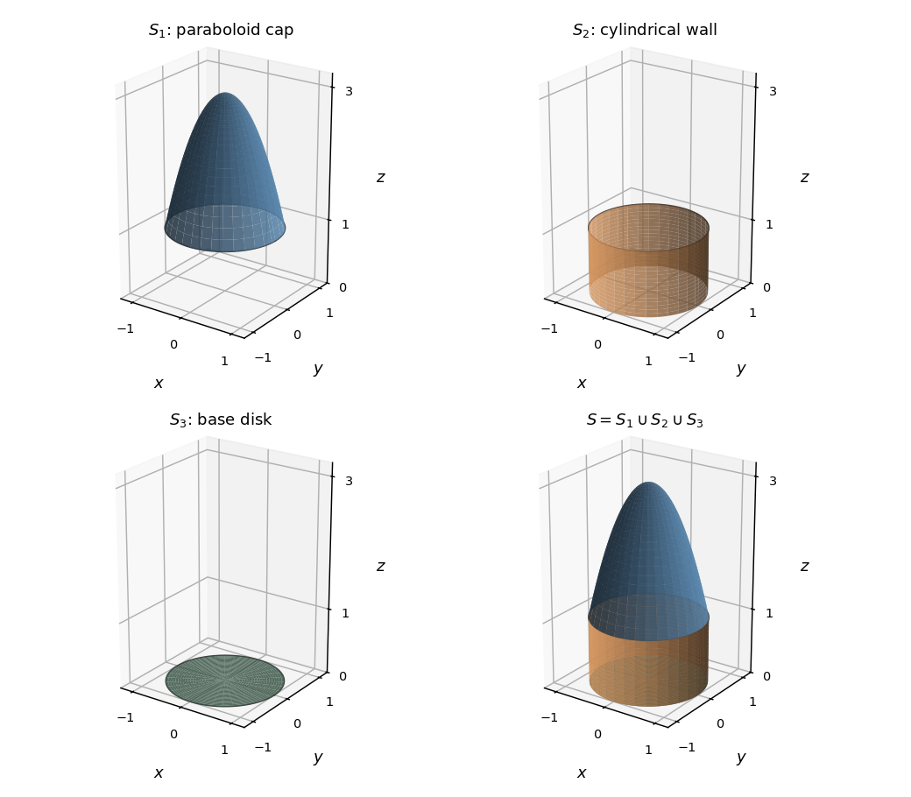

<h1 id="11c/solution">Solution</h1>

↑ **Parent:** [11C](../11c.md)

For a bounded volume $\Omega$ with piecewise smooth boundary and a continuously differentiable vector field on a neighborhood of its closure, the [divergence theorem](../../../../../divergence-theorem.md) states

$$
\oint_{\partial\Omega}\mathbf F\cdot\mathbf n\,dS=\int_\Omega\nabla\cdot\mathbf F\,dV,
$$

where $\mathbf n$ is the outward unit normal.

The boundary here consists of a paraboloid cap over the unit disk, a cylindrical wall of height one, and the bottom disk. Their joined surface encloses

$$
\Omega=\{(x,y,z):x^2+y^2\leq1,\ 0\leq z\leq3-2(x^2+y^2)\}.
$$

The cap meets the wall at $r=1,z=1$, and the wall meets the base at $r=1,z=0$. The sketches show each boundary piece and their closed union.

**[Figure 3](#11c/image-paraboloid-cap-cylindrical-wall-base-disk-and-their-closed-union). Paraboloid cap, cylindrical wall, base disk, and their closed union**.

Differentiate the field components to find the [divergence](../../../../../divergence.md):

$$
\nabla\cdot\mathbf F=(y+6x^5)+(-y+8y^7)+1=1+6x^5+8y^7.
$$

The volume is invariant under reflecting $x$ or $y$, so [odd-integrand cancellation by reflection](../../../../../odd-integrand-cancellation-by-reflection.md) removes both odd-power contributions. The outward flux equals the volume:

$$
\begin{aligned}
\oint_S\mathbf F\cdot d\mathbf S
&=\int_0^{2\pi}\int_0^1\int_0^{3-2r^2}r\,dz\,dr\,d\theta\\
&=2\pi\int_0^1(3-2r^2)r\,dr
=\boxed{2\pi}.
\end{aligned}
$$

The corners between the three pieces are permitted by the piecewise smooth boundary hypothesis.

## ↑ Ancestors (10)

1. [11C](../11c.md)
2. [Paper 3](../../paper-3-split.md)
3. [Ia](../../split.md)
4. [2010](../../../split.md)
5. [Past exam of the mathematics course of the University of Cambridge](../../../../split.md)
6. [Mathematics course of the University of Cambridge](../../../../../mathematics-course-of-the-university-of-cambridge.md)
7. [Course of the University of Cambridge](../../../../../course-of-the-university-of-cambridge.md)
8. [University of Cambridge](../../../../../university-of-cambridge-split.md)
9. [List of universities](../../../../../list-of-universities.md)
10. [Codex Wiki](../../../../../split.md)
