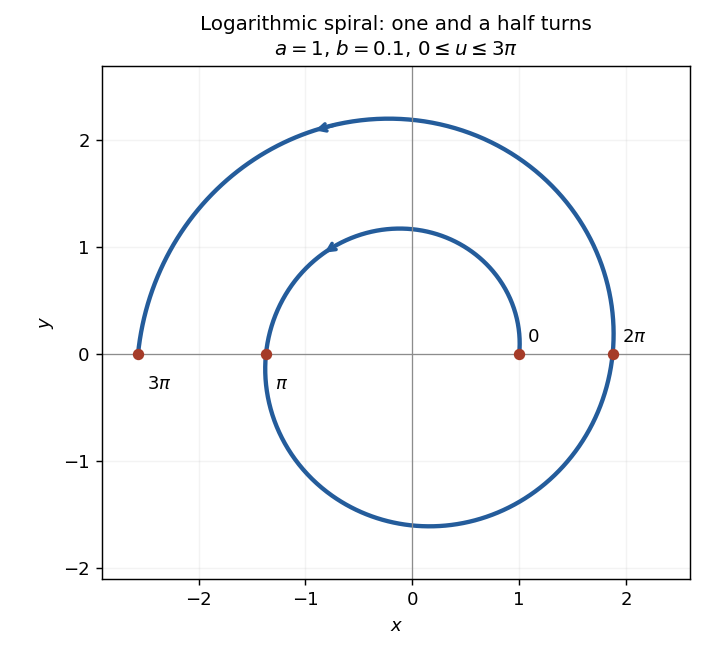

<h1 id="4c/solution">Solution</h1>

↑ **Parent:** [4C](../4c.md)

In [polar coordinates](../../../../../polar-coordinates.md), the curve is the [logarithmic spiral](../../../../../logarithmic-spiral.md) $r=ae^{bu}$, $\theta=u$. It starts at $(a,0)$ and winds counterclockwise outwards through one and a half turns. It crosses the horizontal axis at

$$
(a,0),\quad(-ae^{b\pi},0),\quad(ae^{2b\pi},0),\quad(-ae^{3b\pi},0).
$$

The following original sketch uses representative positive values; changing $a$ rescales it and changing $b$ changes its rate of expansion.

**[Figure 1](#4c/image-logarithmic-spiral-over-one-and-a-half-counterclockwise-turns). Logarithmic spiral over one and a half counterclockwise turns**.

Differentiate the coordinates:

$$
x'=ae^{bu}(b\cos u-\sin u),\qquad y'=ae^{bu}(b\sin u+\cos u).
$$

Hence $ds/du=\sqrt{(x')^2+(y')^2}=ae^{bu}\sqrt{1+b^2}$. Integrating the [arc length](../../../../../arc-length.md) element gives, for $U\geq0$,

$$
\boxed{L(U)=\frac{a\sqrt{1+b^2}}{b}\bigl(e^{bU}-1\bigr).}
$$

For a negative endpoint parameter the length between $U$ and zero uses the absolute value of the final factor.

A second differentiation gives

$$
x'y''-y'x''=a^2e^{2bu}(1+b^2).
$$

The numerator is positive, so the absolute value in the PDF's [curvature of a plane curve](../../../../../curvature-of-a-plane-curve.md) formula leaves it unchanged. Consequently

$$
\kappa(u)=\frac1{ae^{bu}\sqrt{1+b^2}}.
$$

The [speed](../../../../../speed.md) is $1/\kappa$, and therefore $dt=ds/v=\kappa\,ds=du$. Thus the requested elapsed time is

$$
\boxed{\Delta t=\int_{2n\pi}^{2(n+1)\pi}du=2\pi.}
$$

This [travel time at reciprocal-curvature speed](../../../../../travel-time-at-reciprocal-curvature-speed.md) is independent of $n$ because the growing arc length per unit angle is exactly matched by the growing speed.

## ↑ Ancestors (10)

1. [4C](../4c.md)
2. [Paper 3](../../paper-3-split.md)
3. [Ia](../../split.md)
4. [2010](../../../split.md)
5. [Past exam of the mathematics course of the University of Cambridge](../../../../split.md)
6. [Mathematics course of the University of Cambridge](../../../../../mathematics-course-of-the-university-of-cambridge.md)
7. [Course of the University of Cambridge](../../../../../course-of-the-university-of-cambridge.md)
8. [University of Cambridge](../../../../../university-of-cambridge-split.md)
9. [List of universities](../../../../../list-of-universities.md)
10. [Codex Wiki](../../../../../split.md)
