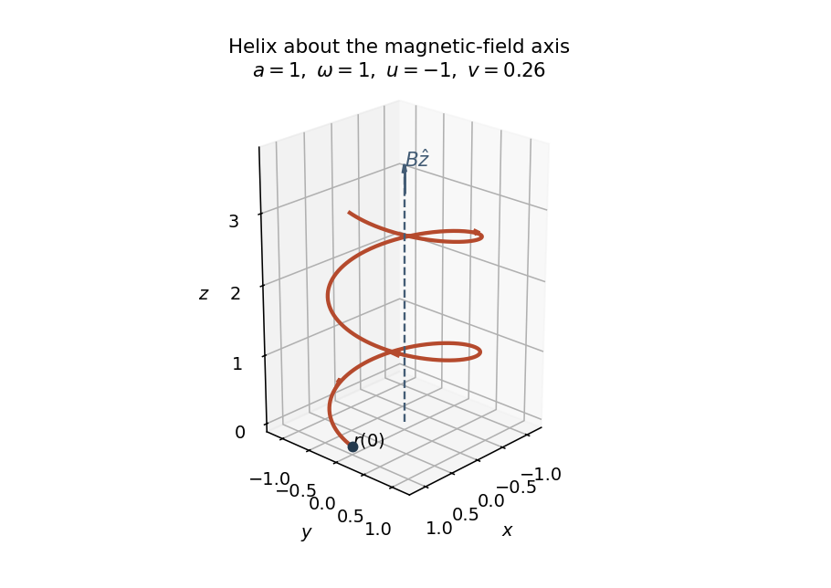
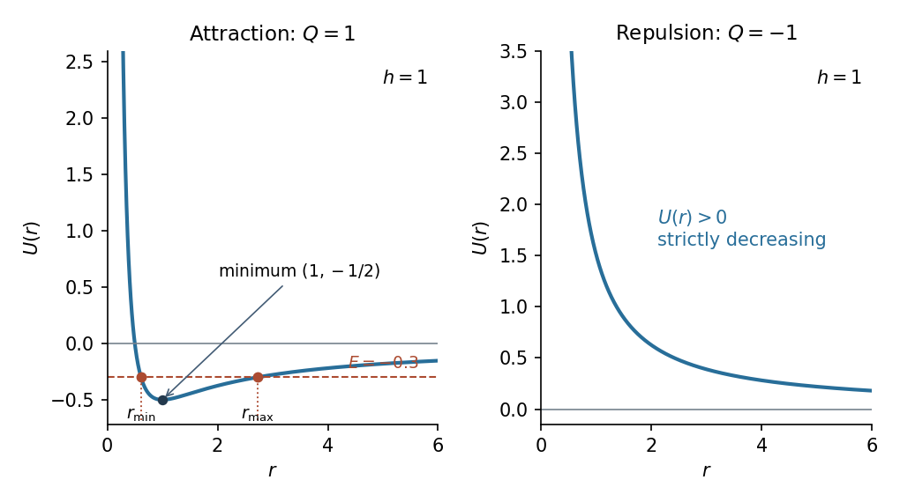

# Paper 4

↑ **Parent:** [Ia](../ia.md)

[https://www.maths.cam.ac.uk/undergrad/pastpapers/files/2010/PaperIA_4.pdf](https://www.maths.cam.ac.uk/undergrad/pastpapers/files/2010/PaperIA_4.pdf)

**Table of contents**

- [1E](#1e)
  - [a](#1e/a)
    - [Solution](#1e/a/solution)
  - [b](#1e/b)
    - [Solution](#1e/b/solution)
- [2E](#2e)
  - [a](#2e/a)
    - [Solution](#2e/a/solution)
  - [b](#2e/b)
    - [Solution](#2e/b/solution)
- [3B](#3b)
  - [Solution](#3b/solution)
- [4B](#4b)
  - [Solution](#4b/solution)
- [5E](#5e)
  - [Solution](#5e/solution)
- [6E](#6e)
  - [Solution](#6e/solution)
- [7E](#7e)
  - [a](#7e/a)
    - [Solution](#7e/a/solution)
  - [b](#7e/b)
    - [Solution](#7e/b/solution)
  - [c](#7e/c)
    - [Solution](#7e/c/solution)
- [8E](#8e)
  - [Solution](#8e/solution)
- [9B](#9b)
  - [Solution](#9b/solution)
- [10B](#10b)
  - [Solution](#10b/solution)
  - [a](#10b/a)
    - [Solution](#10b/a/solution)
  - [b](#10b/b)
    - [Solution](#10b/b/solution)
- [11B](#11b)
  - [Solution](#11b/solution)
- [12B](#12b)
  - [Solution](#12b/solution)

## 1E

↑ **Parent:** [Paper 4](paper-4.md)

<h3 id="1e/a">a</h3>

↑ **Parent:** [1E](#1e)

<h4 id="1e/a/solution">Solution</h4>

↑ **Parent:** [A](#1e/a)

Since $31$ is a [prime number](../../../number-theory.md#prime-number), the [Wilson theorem](../../../number-theory.md#wilson-s-theorem) states that $30!\equiv-1\pmod{31}$. But $30!\equiv(-1)(-2)28!=2\cdot28!$, so the [modular inverse](../../../number-theory.md#modular-multiplicative-inverse) of $2$, which is $16$, gives

$$
28!\equiv-16\equiv15\pmod{31}.
$$

The [Fermat little theorem](../../../number-theory.md#fermat-little-theorem) states that $a^{p-1}\equiv1\pmod p$ when $p$ is prime and $p\nmid a$. Therefore $13^{30}\equiv1\pmod{31}$, and

$$
13^{28}\equiv(13^2)^{-1}\equiv14^{-1}\equiv20\pmod{31},
$$

since $14\cdot20=280=9\cdot31+1$. Combining these [modular congruences](../../../number-theory.md#modular-congruence),

$$
28!13^{28}\equiv15\cdot20=300\equiv\boxed{21}\pmod{31}.
$$

This representative lies between $0$ and $30$, so it is the least nonnegative residue.

<h3 id="1e/b">b</h3>

↑ **Parent:** [1E](#1e)

<h4 id="1e/b/solution">Solution</h4>

↑ **Parent:** [B](#1e/b)

The [modular inverse](../../../number-theory.md#modular-multiplicative-inverse) of $2$ modulo $3$ is $2$, so the second [modular congruence](../../../number-theory.md#modular-congruence) is $x\equiv2\pmod3$. The third means $10\mid2(x-2)$, equivalently $5\mid x-2$. Cancelling this common factor changes the modulus; it gives $x\equiv2\pmod5$.

The first three conditions consequently combine to $x\equiv2\pmod{15}$ and $x$ odd, hence $x=17+30k$ for an [integer](../../../number-theory.md#integer) $k$. The last condition becomes

$$
30k\equiv10-17=-7\pmod{67}.
$$

As $30\cdot38=17\cdot67+1$, multiplying by the [modular inverse](../../../number-theory.md#modular-multiplicative-inverse) $38$ gives $k\equiv2\pmod{67}$. Thus

$$
\boxed{x=77+2010\ell,\qquad\ell\in\mathbb Z.}
$$

The [Chinese remainder theorem](../../../mathematics.md#chinese-remainder-theorem) states that [modular congruences](../../../number-theory.md#modular-congruence) with pairwise coprime moduli have a unique solution modulo their product. Here those moduli are $2,3,5,67$, with product $2010$. The derivation proves necessity, and substitution gives $77\equiv1\pmod2$, $2\cdot77\equiv1\pmod3$, $2\cdot77\equiv4\pmod{10}$ and $77\equiv10\pmod{67}$, proving sufficiency for the whole displayed class.

## 2E

↑ **Parent:** [Paper 4](paper-4.md)

<h3 id="2e/a">a</h3>

↑ **Parent:** [2E](#2e)

<h4 id="2e/a/solution">Solution</h4>

↑ **Parent:** [A](#2e/a)

Write the [rational number](../../../number-theory.md#rational-number) as $r=p/q$ with [coprime integers](../../../number-theory.md#coprime-integers) $p,q$ and $q>0$. Substituting into the [monic polynomial](../../../polynomial.md#monic-polynomial) and multiplying by $q^n$ gives

$$
p^n+a_{n-1}p^{n-1}q+\cdots+a_1pq^{n-1}+a_0q^n=0.
$$

All terms except the first are divisible by $q$, so $q\mid p^n$. If $q>1$, it has a [prime factor](../../../number-theory.md#prime-factor) dividing $p^n$, and the [Euclid lemma](../../../number-theory.md#euclid-lemma) implies that this prime divides $p$, contradicting [coprimality](../../../number-theory.md#coprime-integers). Thus $q=1$, proving this special case of the [rational root theorem](../../../mathematics.md#rational-root-theorem):

$$
\boxed{r\in\mathbb Q\ \Longrightarrow\ r\in\mathbb Z.}
$$

<h3 id="2e/b">b</h3>

↑ **Parent:** [2E](#2e)

<h4 id="2e/b/solution">Solution</h4>

↑ **Parent:** [B](#2e/b)

The [exponential series](../../../calculus.md#exponential-series) at $1$ gives

$$
\boxed{e=\sum_{n=0}^{\infty}\frac1{n!}.}
$$

For every positive [integer](../../../number-theory.md#integer) $q$, multiply by the [factorial](../../../combinatorics.md#factorial) $q!$ and separate the integer part:

$$
q!e=\underbrace{\sum_{n=0}^{q}\frac{q!}{n!}}_{I_q\in\mathbb Z}
+R_q,\qquad
R_q=\sum_{j=1}^{\infty}\frac1{(q+1)(q+2)\cdots(q+j)}.
$$

Every term in $R_q$ is positive. Each denominator is at least $(q+1)^j$, and the inequality is strict when $j\ge2$. Comparison with the [geometric series](../../../real-analysis.md#geometric-series) therefore gives

$$
0<R_q<\sum_{j=1}^{\infty}(q+1)^{-j}=\frac1q\le1.
$$

If $e=p/q$ with integers $p$ and $q\ge1$, then $q!e=p(q-1)!$ would be an [integer](../../../number-theory.md#integer). Since $I_q$ is also an [integer](../../../number-theory.md#integer), $R_q$ would be an [integer](../../../number-theory.md#integer) strictly between zero and one, which is impossible. Hence

$$
\boxed{e\text{ is irrational}.}
$$

This proves the [irrationality of e](../../../calculus.md#irrationality-of-e) by using its rapidly decreasing series tail.

## 3B

↑ **Parent:** [Paper 4](paper-4.md)

<h3 id="3b/solution">Solution</h3>

↑ **Parent:** [3B](#3b)

With no electric field, the [Lorentz force](../../../electromagnetism.md#lorentz-force) is $F=q\dot r\times B\hat z$. The equation from [Newton's second law](../../../classical-mechanics.md#newton-s-second-law) and its first integral are

$$
m\ddot r=qB\dot r\times\hat z,\qquad
\frac{d}{dt}\bigl(\dot r-\omega r\times\hat z\bigr)=0,
\qquad \boxed{\omega=\frac{qB}{m}}.
$$

The [cyclotron frequency](../../../quantum-theory.md#cyclotron-frequency) is $|\omega|$; the sign of $\omega$ specifies the sense of rotation. Since $\hat x\times\hat z=-\hat y$, the initial data give

$$
\boxed{c=(u+a\omega)\hat y+v\hat z.}
$$

The component equations are $\dot x=\omega y$, $\dot y+\omega x=u+a\omega$ and $\dot z=v$. For $\omega\ne0$, differentiating the first gives

$$
\ddot x+\omega^2x=\omega(u+a\omega),\qquad x(0)=a,\quad\dot x(0)=0.
$$

Solving this [linear differential equation](../../../differential-equation.md#linear-differential-equation) and then using $y=\dot x/\omega$ gives

$$
\boxed{r(t)=\left[a+\frac u\omega(1-\cos\omega t)\right]\hat x
+\frac u\omega\sin\omega t\,\hat y+vt\,\hat z.}
$$

The perpendicular projection is a circle of radius $|u/\omega|$ centred at $(a+u/\omega,0)$, the [guiding centre](../../../electromagnetism.md#guiding-center). The velocity parallel to the [magnetic field](../../../electromagnetism.md#magnetic-field) stays constant, producing [helical motion in a uniform magnetic field](../../../electromagnetism.md#helical-motion-in-a-uniform-magnetic-field).

When $a\omega+u=0$, this simplifies to

$$
\boxed{x=a\cos\omega t,\qquad y=-a\sin\omega t,\qquad z=vt.}
$$

Thus the trajectory is a [helix](../../../topology.md#helix) about the $z$ axis, with radius $|a|$ and axial advance $2\pi v/|\omega|$ per complete revolution in increasing time. Its projection moves clockwise when viewed from positive $z$ for $\omega>0$. If $v=0$ it is a circle; if $a=0$ it is a straight line along the axis.

**[Figure 1](#3b/image-helical-trajectory-about-the-magnetic-field-axis-when-a-omega-plus-u-is-zero). Helical trajectory about the magnetic-field axis when a omega plus u is zero**.

For $\omega=0$, the [Lorentz force](../../../electromagnetism.md#lorentz-force) vanishes and the solution is instead $r(t)=a\hat x+ut\hat y+vt\hat z$, also the limit of the general formula. The special condition then forces $u=0$.

## 4B

↑ **Parent:** [Paper 4](paper-4.md)

<h3 id="4b/solution">Solution</h3>

↑ **Parent:** [4B](#4b)

Choose the two [inertial frames](../../../physics.md#inertial-frame) to have coincident origins at $t=t'=0$, and let the origin of $S'$ have $x=vt$. The [Lorentz transformation](../../../special-relativity.md#lorentz-transformation) is

$$
\boxed{x'=\gamma_v(x-vt),\qquad
 t'=\gamma_v\left(t-\frac{vx}{c^2}\right),\qquad
\gamma_v=\frac1{\sqrt{1-v^2/c^2}}.}
$$

Here $\gamma_v$ is the [Lorentz factor](../../../special-relativity.md#lorentz-factor). Along the particle's trajectory, $dx/dt=u$, so

$$
\frac{dx'}{dt}=\gamma_v(u-v),\qquad
\frac{dt'}{dt}=\gamma_v\left(1-\frac{uv}{c^2}\right)>0.
$$

Dividing gives the [relativistic velocity-addition formula](../../../special-relativity.md#velocity-addition-formula)

$$
\boxed{u'=\frac{u-v}{1-uv/c^2}.}
$$

The denominator is positive because $|uv|<c^2$. Direct algebra yields

$$
1-\frac{u'^2}{c^2}
=\frac{(1-u^2/c^2)(1-v^2/c^2)}{(1-uv/c^2)^2}>0,
$$

since both factors in the numerator are positive. Consequently $\boxed{|u'|<c}$: a subluminal velocity remains subluminal in every such [inertial frame](../../../physics.md#inertial-frame).

## 5E

↑ **Parent:** [Paper 4](paper-4.md)

<h3 id="5e/solution">Solution</h3>

↑ **Parent:** [5E](#5e)

For the [Fibonacci addition formula](../../../real-analysis.md#fibonacci-addition-formula), use [mathematical induction](../../../foundations-of-mathematics.md#mathematical-induction) on $k$, with the assertion applying to every $n\ge1$. At $k=2$, $F_{n+2}=F_{n+1}+F_n=F_2F_{n+1}+F_1F_n$. If the formula holds for some $k\ge2$ and all $n$, apply it at $n+1$ and use the [Fibonacci number](../../../real-analysis.md#fibonacci-number) recurrence:

$$
\begin{aligned}
F_{n+k+1}
&=F_kF_{n+2}+F_{k-1}F_{n+1}\\
&=F_k(F_{n+1}+F_n)+F_{k-1}F_{n+1}\\
&=F_{k+1}F_{n+1}+F_kF_n.
\end{aligned}
$$

This is the assertion at $k+1$, completing the [mathematical induction](../../../foundations-of-mathematics.md#mathematical-induction). Thus

$$
\boxed{F_{n+k}=F_kF_{n+1}+F_{k-1}F_n\quad(n\ge1,\ k\ge2).}
$$

Taking $k=n\ge2$ gives the doubling identity

$$
\boxed{F_{2n}=F_n(F_{n+1}+F_{n-1})=F_nL_n.}
$$

For the [Lucas numbers](../../../real-analysis.md#lucas-number), $L_2=F_3+F_1=3$, and $L_3=F_4+F_2=4=L_2+L_1$. For $n\ge4$, both expressions for earlier [Lucas numbers](../../../real-analysis.md#lucas-number) are available, and

$$
L_{n-1}+L_{n-2}
=(F_n+F_{n-2})+(F_{n-1}+F_{n-3})
=F_{n+1}+F_{n-1}=L_n.
$$

Hence $\boxed{L_1=1,\quad L_2=3,\quad L_n=L_{n-1}+L_{n-2}\ (n\ge3)}$. The separate $n=3$ check matters because the defining expression for $L_1$ was given separately.

The [Euclidean algorithm](../../../number-theory.md#euclidean-algorithm) and the [Fibonacci number](../../../real-analysis.md#fibonacci-number) recurrence give, for $n\ge2$,

$$
\gcd(F_n,F_{n+1})=\gcd(F_n,F_{n-1}).
$$

Repeating reduces to $\gcd(F_2,F_1)=1$; the case $n=1$ is immediate. Therefore $\boxed{\gcd(F_n,F_{n+1})=1\ (n\ge1)}$.

For $n\ge2$, $L_n=F_n+2F_{n-1}$, so a common divisor $d$ of $F_n,L_n$ divides both $F_n$ and $2F_{n-1}$. Since $F_n,F_{n-1}$ are coprime, [Bézout's identity](../../../algebra.md#bezout-identity) gives integers $s,t$ with $sF_n+tF_{n-1}=1$. Multiplying by $2$ shows $d\mid2$. Conversely any common divisor of $F_n$ and $2$ divides $L_n$. Including $n=1$, this proves the stronger [greatest common divisor](../../../number-theory.md#greatest-common-divisor) identity

$$
\boxed{\gcd(F_n,L_n)=\gcd(F_n,2)\le2\quad(n\ge1).}
$$

## 6E

↑ **Parent:** [Paper 4](paper-4.md)

<h3 id="6e/solution">Solution</h3>

↑ **Parent:** [6E](#6e)

The [Fermat little theorem](../../../number-theory.md#fermat-little-theorem) states that if $p$ is a [prime number](../../../number-theory.md#prime-number), then $a^p\equiv a\pmod p$ for every [integer](../../../number-theory.md#integer) $a$. Equivalently, for $p\nmid a$, $a^{p-1}\equiv1\pmod p$.

To prove it when $p\nmid a$, multiplication by $a$ permutes the nonzero residues $1,\ldots,p-1$. Indeed, $ai\equiv aj\pmod p$ implies $p\mid a(i-j)$, and the [Euclid lemma](../../../number-theory.md#euclid-lemma) implies $i=j$ in this range. Multiplying all these residues gives

$$
a^{p-1}(p-1)!\equiv(p-1)!\pmod p.
$$

None of the factors of $(p-1)!$ is divisible by $p$, so the [factorial](../../../combinatorics.md#factorial) has a [modular inverse](../../../number-theory.md#modular-multiplicative-inverse). Cancelling it proves $a^{p-1}\equiv1$, hence $a^p\equiv a$. When $p\mid a$, the latter identity has both sides zero, completing the proof.

For an odd [prime number](../../../number-theory.md#prime-number) $p\ne5$, the numbers $10,p$ are coprime. The [Fermat little theorem](../../../number-theory.md#fermat-little-theorem) gives $10^{p-1}\equiv1\pmod p$, and consequently

$$
\boxed{p\mid10^{j(p-1)}-1\quad\text{for every }j\ge1.}
$$

These exponents are distinct, so infinitely many are obtained.

Write the [repdigit](../../../number-theory.md#repdigit) with $n$ copies of $5$ as

$$
R_n=5\sum_{j=0}^{n-1}10^j=\frac{5(10^n-1)}9.
$$

If $p\ne3,5$, choose $n$ to be any positive multiple of $p-1$. Then $9$ has a [modular inverse](../../../number-theory.md#modular-multiplicative-inverse) modulo $p$, so $p\mid R_n$. Division by $9$ cannot be used modulo $3$; instead $10\equiv1\pmod3$ gives $R_n\equiv5n\pmod3$, so $3\mid R_{3j}$ for every $j\ge1$. If $p=5$, every $R_n$ is divisible by $5$. Thus

$$
\boxed{\text{Every odd prime divides infinitely many of }5,55,555,\ldots.}
$$

The separate treatment of $3$ accounts for the prime factor of the geometric-sum denominator.

## 7E

↑ **Parent:** [Paper 4](paper-4.md)

<h3 id="7e/a">a</h3>

↑ **Parent:** [7E](#7e)

<h4 id="7e/a/solution">Solution</h4>

↑ **Parent:** [A](#7e/a)

Enumerate $A$ as $a_1,\ldots,a_a$. A [function](../../../function.md) is specified by choosing the image of each of these elements independently, with $b$ possibilities each. The [multiplication principle](../../../combinatorics.md#rule-of-product) gives $\boxed{b^a\text{ functions}}$.

For an [injective function](../../../algebra.md#injective-function), successive images must be distinct. If $a\le b$, there are $b$ choices for the first, $b-1$ for the second, and so on. If $a>b$, the [pigeonhole principle](../../../algebra.md#pigeonhole-principle) makes injectivity impossible. Thus the number of [injective functions](../../../algebra.md#injective-function) is

$$
\boxed{\begin{cases}
\displaystyle b(b-1)\cdots(b-a+1)=\frac{b!}{(b-a)!},&a\le b,\\
0,&a>b.
\end{cases}}
$$

The product in the first case is a [falling factorial](../../../combinatorics.md#falling-factorial).

<h3 id="7e/b">b</h3>

↑ **Parent:** [7E](#7e)

<h4 id="7e/b/solution">Solution</h4>

↑ **Parent:** [B](#7e/b)

For finite [sets](../../../set.md) $C_1,\ldots,C_k$, the [inclusion-exclusion principle](../../../combinatorics.md#inclusion-exclusion-principle) states

$$
\boxed{\left|\bigcup_{j=1}^kC_j\right|
=\sum_{\varnothing\ne J\subseteq[k]}(-1)^{|J|+1}
\left|\bigcap_{j\in J}C_j\right|.}
$$

In a finite ambient [set](../../../set.md) $\Omega$, its equivalent complement form is

$$
\left|\Omega\setminus\bigcup_{j=1}^kC_j\right|
=\sum_{J\subseteq[k]}(-1)^{|J|}
\left|\bigcap_{j\in J}C_j\right|,
$$

where the intersection for $J=\varnothing$ means $\Omega$. To see the counting mechanism, an element in exactly $r\ge1$ of the [sets](../../../set.md) has coefficient $\sum_{i=1}^r(-1)^{i+1}\binom ri=1$, by the [binomial theorem](../../../combinatorics.md#binomial-theorem); an element in none has coefficient zero in the union formula.

<h3 id="7e/c">c</h3>

↑ **Parent:** [7E](#7e)

<h4 id="7e/c/solution">Solution</h4>

↑ **Parent:** [C](#7e/c)

Let $\Omega$ be the [set](../../../set.md) of all [functions](../../../function.md) from the $n$-element domain to the $k$-element codomain, and let $C_j$ consist of the [functions](../../../function.md) which omit codomain element $j$. A [function](../../../function.md) is [surjective](../../../algebra.md#surjective-function) precisely when it lies outside $\bigcup_jC_j$.

For $J\subseteq[k]$ of size $i$, the intersection $\bigcap_{j\in J}C_j$ consists of maps taking all their values in the remaining $k-i$ elements, so it has $(k-i)^n$ members. There are $\binom ki$ choices of $J$. Applying the complement form of the [inclusion-exclusion principle](../../../combinatorics.md#inclusion-exclusion-principle) gives

$$
\boxed{\#\{\text{surjections}\}
=\sum_{i=0}^k(-1)^i\binom ki(k-i)^n\quad(n\ge k\ge1).}
$$

When $k=n$, every fibre of a [surjective function](../../../algebra.md#surjective-function) has at least one member, and the $n$ fibres partition an $n$-element domain. Thus every fibre has exactly one member and the [function](../../../function.md) is a [bijection](../../../function.md#bijection). The count of these [bijections](../../../function.md#bijection) is $n!$ by the successive distinct-image choices from part (a). Hence

$$
\boxed{n!=\sum_{i=0}^n(-1)^i\binom ni(n-i)^n.}
$$

## 8E

↑ **Parent:** [Paper 4](paper-4.md)

<h3 id="8e/solution">Solution</h3>

↑ **Parent:** [8E](#8e)

A [set](../../../set.md) is [countable](../../../set-theory.md#countable-set) if it admits an [injective function](../../../algebra.md#injective-function) into $\mathbb N$, equivalently if it is finite or can be listed in a sequence. The empty [set](../../../set.md) is included; an infinite [countable set](../../../set-theory.md#countable-set) has a [bijection](../../../function.md#bijection) with $\mathbb N$.

Every [rational number](../../../number-theory.md#rational-number) has a representation $p/q$ with $p\in\mathbb Z$ and $q\ge1$. For each $k\ge1$, there are only finitely many such pairs with $|p|+q=k$. List these finite levels successively, ordering each level by $p$, and discard repeated fractions when they first recur. Every [rational number](../../../number-theory.md#rational-number) appears in some finite level, proving $\boxed{\mathbb Q\text{ is countable}}$.

For the uncountability proof, suppose all numbers in $(0,1)$ could be listed as $r_1,r_2,\ldots$. Choose each decimal expansion not to end in an infinite string of nines, and denote its $j$th digit by $d_{ij}$. Set $b_i=1$ when $d_{ii}\ne1$, and $b_i=2$ otherwise. Then the decimal

$$
s=0.b_1b_2b_3\cdots
$$

defines a number in $(0,1)$ with a unique such expansion, since its digits are only $1$ and $2$. It differs from $r_i$ at digit $i$ for every $i$, contradicting the enumeration. This [Cantor diagonal argument](../../../set-theory.md#cantor-diagonal-argument) proves $\boxed{\mathbb R\text{ is uncountable}}$ because its subset $(0,1)$ already is.

For the union of two [countable sets](../../../set-theory.md#countable-set) $C,D$, take [injective functions](../../../algebra.md#injective-function) $\iota_C:C\to\mathbb N$ and $\iota_D:D\to\mathbb N$. The map

$$
\iota(x)=\begin{cases}
2\iota_C(x),&x\in C,\\
2\iota_D(x)+1,&x\in D\setminus C
\end{cases}
$$

is injective: it is injective within each branch, and their images have different parity. Thus $\boxed{C\cup D\text{ is countable}}$, regardless of overlap.

The property of $A$ says that both $A$ and its complement are [dense subsets](../../../topology.md#dense-set) of the real line. Both possible cardinalities occur. To establish the needed density directly, given $x\in\mathbb R$ and $\varepsilon>0$, choose an integer $q>1/\varepsilon$. Then $\lfloor qx\rfloor/q$ is rational and differs from $x$ by less than $1/q<\varepsilon$. For an irrational approximation, choose a rational $r$ within $\varepsilon/2$ of $x$ and a positive integer $q$ large enough that $\sqrt2/q<\varepsilon/2$. The number $r+\sqrt2/q$ is irrational and lies within $\varepsilon$ of $x$; irrationality follows from that of $\sqrt2$, since otherwise subtracting $r$ and multiplying by $q$ would make $\sqrt2$ rational. To recall the latter fact, a reduced fraction $p/q=\sqrt2$ would satisfy $p^2=2q^2$, forcing $p$ even and then $q$ even, contrary to [coprimality](../../../number-theory.md#coprime-integers). Therefore

$$
\boxed{A=\mathbb Q\text{ is a countable example},\qquad
A=\mathbb R\setminus\mathbb Q\text{ is an uncountable example}.}
$$

The second [set](../../../set.md) is uncountable because, if it were countable, its union with $\mathbb Q$ would make $\mathbb R$ countable. The same two density arguments give the required approximations from $A$ and from its complement in either example.

Finally, the condition on $B$ makes every one of its points an [isolated point](../../../topological-analysis.md#isolated-point), so $B$ is a [discrete subset](../../../topology.md#discrete-subset) of the real line. Enumerate all rational intervals $(p_j,q_j)$ with $p_j<q_j$; enumerate pairs of indices of the rational list by increasing sum and keep those whose endpoints have the required order. For each $b\in B$, its isolating neighbourhood contains a rational interval $(p_j,q_j)$ containing $b$ and no other point of $B$. Assign to $b$ the least such index $j$. Two distinct points cannot receive the same index, because that interval would then contain two members of $B$. This gives an [injective function](../../../algebra.md#injective-function) $B\to\mathbb N$ and proves that [discrete subsets of the real line are countable](../../../topology.md#discrete-subsets-of-the-real-line-are-countable):

$$
\boxed{B\text{ is countable}.}
$$

Using the least index makes the assignment explicit and requires no arbitrary selection of an uncountable family of intervals.

## 9B

↑ **Parent:** [Paper 4](paper-4.md)

<h3 id="9b/solution">Solution</h3>

↑ **Parent:** [9B](#9b)

For the [moment of inertia of a uniform solid sphere](../../../classical-mechanics.md#moment-of-inertia-of-a-uniform-solid-sphere), write the [mass density](../../../fluid-mechanics.md#density) as $\rho=3m/(4\pi a^3)$. In spherical coordinates about the chosen axis, the squared perpendicular distance is $R^2\sin^2\vartheta$. The volume element is $R^2\sin\vartheta\,dR\,d\vartheta\,d\varphi$, so

$$
I=\rho\int_0^aR^4\,dR\int_0^\pi\sin^3\vartheta\,d\vartheta
\int_0^{2\pi}d\varphi
=\rho\frac{a^5}{5}\frac43\,2\pi
=\boxed{\frac25ma^2}.
$$

Take $0<\alpha<\pi/2$ and $\ell>0$, with a fixed plane. The [normal force](../../../classical-mechanics.md#normal-force) has magnitude $N=mg\cos\alpha$ and is perpendicular to the plane. On the perfectly smooth plane there is no friction. Both gravity and the [normal force](../../../classical-mechanics.md#normal-force) have zero [torque](../../../classical-mechanics.md#torque) about the marble's centre, so a marble released from rest does not rotate. The component of [Newton's second law](../../../classical-mechanics.md#newton-s-second-law) down the plane is $mA_1=mg\sin\alpha$, hence

$$
A_1=g\sin\alpha,\qquad
\boxed{t_1=\sqrt{\frac{2\ell}{g\sin\alpha}}}.
$$

The [normal force](../../../classical-mechanics.md#normal-force) does no work because the velocity is tangent to the plane. Gravity is conservative, so [mechanical energy](../../../classical-mechanics.md#mechanical-energy), the sum of translational [kinetic energy](../../../classical-mechanics.md#kinetic-energy) and [gravitational potential energy](../../../classical-mechanics.md#gravitational-energy), is conserved.

For [rolling without slipping](../../../classical-mechanics.md#rolling-without-slipping), let the [static friction](../../../classical-mechanics.md#static-friction) force have magnitude $f$, pointing up the plane. It supplies the [torque](../../../classical-mechanics.md#torque) that spins the marble while reducing its translational acceleration. If $\Omega$ is the [angular velocity](../../../classical-mechanics.md#angular-velocity) and $A_2$ the acceleration down the plane, the rolling constraint is $a\Omega=\dot s$, hence $a\dot\Omega=A_2$. The translation and rotation equations are

$$
mA_2=mg\sin\alpha-f,\qquad
fa=I\dot\Omega=\frac{I A_2}{a}.
$$

Thus $f=IA_2/a^2$ and

$$
A_2=\frac{g\sin\alpha}{1+I/(ma^2)}=\frac57g\sin\alpha,
\qquad f=\frac27mg\sin\alpha.
$$

These are the equations for [rolling acceleration with rotational inertia](../../../classical-mechanics.md#rolling-acceleration-with-rotational-inertia); the plane must be rough enough to supply this [static friction](../../../classical-mechanics.md#static-friction).

The point of contact is instantaneously at rest relative to the fixed plane, so [static friction](../../../classical-mechanics.md#static-friction) does no total work on the rolling marble. Equivalently, its translational power is $-f\dot s$ and its rotational power is $fa\Omega=f\dot s$, which cancel. The [normal force](../../../classical-mechanics.md#normal-force) also does no work. Consequently [mechanical energy](../../../classical-mechanics.md#mechanical-energy) is conserved here too, now with [rotational kinetic energy](../../../classical-mechanics.md#rotational-kinetic-energy) included:

$$
\frac12m\dot s^2+\frac12I\Omega^2+mgH=\text{constant},
$$

where $H$ is the centre's height. No energy loss is implied by the presence of ideal [static friction](../../../classical-mechanics.md#static-friction). Constant acceleration from rest gives

$$
\boxed{t_2=\sqrt{\frac{14\ell}{5g\sin\alpha}},\qquad
\frac{t_1}{t_2}=\sqrt{\frac57}.}
$$

For the hollow marble, put $I=\lambda ma^2$ in the same equations. The smooth-plane time is unchanged, while the rolling acceleration becomes $g\sin\alpha/(1+\lambda)$. Therefore

$$
\boxed{t_2=\sqrt{\frac{2\ell(1+\lambda)}{g\sin\alpha}},\qquad
\frac{t_1}{t_2}=\frac1{\sqrt{1+\lambda}}.}
$$

This again assumes [rolling without slipping](../../../classical-mechanics.md#rolling-without-slipping) and enough [static friction](../../../classical-mechanics.md#static-friction); the ratio depends on the mass distribution through its [moment of inertia](../../../classical-mechanics.md#moment-of-inertia).

## 10B

↑ **Parent:** [Paper 4](paper-4.md)

<h3 id="10b/solution">Solution</h3>

↑ **Parent:** [10B](#10b)

For the [inverse-square potential](../../../classical-mechanics.md#inverse-square-potential) $V(r)=-Q/r$, the [central force](../../../physics.md#central-force) is $-V'(r)\hat r=-Q\hat r/r^2$. The transverse component of [acceleration in polar coordinates](../../../classical-mechanics.md#acceleration-in-polar-coordinates) is therefore zero:

$$
r\ddot\theta+2\dot r\dot\theta=0,
\qquad
\frac{d}{dt}(r^2\dot\theta)=0.
$$

Thus $\boxed{h=r^2\dot\theta\text{ is constant}}$; for unit mass it is the signed [angular momentum](../../../classical-mechanics.md#angular-momentum) perpendicular to the orbital plane. The radial component gives

$$
\ddot r-r\dot\theta^2=-\frac Q{r^2},\qquad
\ddot r=\frac{h^2}{r^3}-\frac Q{r^2}=-U'(r),
\qquad U(r)=\frac{h^2}{2r^2}-\frac Qr.
$$

Consequently

$$
\frac{d}{dt}\left(\frac12\dot r^2+U(r)\right)
=\dot r\bigl(\ddot r+U'(r)\bigr)=0,
\qquad
\boxed{E=\frac12\dot r^2+U(r)\text{ is constant}.}
$$

This is the [mechanical energy](../../../classical-mechanics.md#mechanical-energy), since the full [kinetic energy](../../../classical-mechanics.md#kinetic-energy) is $\tfrac12(\dot r^2+r^2\dot\theta^2)$ and $r^2\dot\theta^2=h^2/r^2$.

For $h\ne0$ and $Q>0$, the [effective potential](../../../physics.md#effective-potential) goes to $+\infty$ as $r\downarrow0$ and to zero from below as $r\to\infty$. Its derivative is $U'(r)=(Qr-h^2)/r^3$, so it decreases up to $r_0=h^2/Q$ and then increases. Its zero and minimum are

$$
\boxed{U\left(\frac{h^2}{2Q}\right)=0,\qquad
r_0=\frac{h^2}{Q},\qquad U(r_0)=-\frac{Q^2}{2h^2}.}
$$

For $Q<0$, $U=h^2/(2r^2)+|Q|/r$ is positive and strictly decreasing, with limits $+\infty$ at zero and $0^+$ at infinity. It has no minimum at a finite positive radius.

**[Figure 2](#10b/image-attractive-and-repulsive-inverse-square-effective-potentials-and-bounded-orbit-turning-points). Attractive and repulsive inverse-square effective potentials and bounded-orbit turning points**.

If $h=0$, the centrifugal term disappears. For $Q>0$ the graph is instead $-Q/r$, increasing from $-\infty$ to $0^-$ without a minimum; for $Q<0$ it remains positive and decreasing. The bounded-orbit calculation below uses the stipulated $h>0$, which excludes this radial collision case.

<h3 id="10b/a">a</h3>

↑ **Parent:** [10B](#10b)

<h4 id="10b/a/solution">Solution</h4>

↑ **Parent:** [A](#10b/a)

The radial energy equation is $\dot r^2=2(E-U(r))$, so motion requires $U(r)\le E$. For $Q>0$ and $h>0$, the [effective potential](../../../physics.md#effective-potential) minimum and its limiting value zero at infinity imply

$$
\boxed{-\frac{Q^2}{2h^2}\le E<0\quad\text{for bounded orbits}.}
$$

At the lower endpoint the particle stays at $r=h^2/Q$, giving a circular orbit. Strictly between that endpoint and zero, two positive [turning points](../../../classical-mechanics.md#turning-point) confine the radial motion. For $E$ below the minimum there is no allowed motion, while $E\ge0$ does not give a radially bounded orbit.

Write $\varepsilon=|E|$ and $D=Q^2-2\varepsilon h^2\ge0$. At each [turning point](../../../classical-mechanics.md#turning-point) $E=U(r)$, so

$$
\varepsilon r^2-Qr+\frac{h^2}{2}=0.
$$

The smaller and larger roots give the [periapsis distance](../../../classical-mechanics.md#pericentre-distance) and [apoapsis distance](../../../classical-mechanics.md#apocentre-distance):

$$
\boxed{r_{\min}=\frac{Q-\sqrt D}{2\varepsilon},\qquad
r_{\max}=\frac{Q+\sqrt D}{2\varepsilon}.}
$$

They coincide for the circular orbit. Their sum and product are

$$
\boxed{r_{\min}+r_{\max}=\frac Q{|E|}},\qquad
r_{\min}r_{\max}=\frac{h^2}{2|E|}.
$$

The speed satisfies $v^2=2(E+Q/r)$, which decreases strictly with $r$ because $Q>0$. Thus its maximum is at the [periapsis](../../../classical-mechanics.md#periapsis) and its minimum at the [apoapsis](../../../classical-mechanics.md#apoapsis). At either endpoint the radial velocity vanishes, so $v=h/r$. Therefore the [apsidal speed sum for an attractive inverse-square orbit](../../../classical-mechanics.md#apsidal-speed-sum-for-an-attractive-inverse-square-orbit) is

$$
v_{\min}+v_{\max}
=h\left(\frac1{r_{\max}}+\frac1{r_{\min}}\right)
=h\frac{Q/|E|}{h^2/(2|E|)}=\frac{2Q}{h}.
$$

Hence $\boxed{v_{\min}+v_{\max}=2Q/h}$. Individually, $v_{\min}=(Q-\sqrt D)/h$ and $v_{\max}=(Q+\sqrt D)/h$, also valid when the orbit is circular.

<h3 id="10b/b">b</h3>

↑ **Parent:** [10B](#10b)

<h4 id="10b/b/solution">Solution</h4>

↑ **Parent:** [B](#10b/b)

At infinity the [potential energy](../../../classical-mechanics.md#potential-energy) tends to zero, so the conserved [mechanical energy](../../../classical-mechanics.md#mechanical-energy) is $E=\tfrac12v_\infty^2$. The [impact parameter](../../../classical-mechanics.md#impact-parameter) $b$ is the perpendicular distance from the origin to the incoming asymptotic line. Conservation of [angular momentum](../../../classical-mechanics.md#angular-momentum) gives $|h|=bv_\infty$.

For $b>0$, a [turning point](../../../classical-mechanics.md#turning-point) of the radial motion satisfies

$$
\frac12v_\infty^2=\frac{b^2v_\infty^2}{2r^2}-\frac Qr,
\qquad
v_\infty^2r^2+2Qr-b^2v_\infty^2=0.
$$

Only the positive root is physical, giving

$$
\boxed{r_{\min}=\frac{\sqrt{Q^2+b^2v_\infty^4}-Q}{v_\infty^2}.}
$$

For $Q=0$ this reduces to the straight-line closest distance $b$.

For nonzero $Q$, put $\eta=bv_\infty^2/|Q|\ll1$. If $Q<0$, the numerator is $|Q|(\sqrt{1+\eta^2}+1)$, so

$$
r_{\min}=\frac{2|Q|}{v_\infty^2}\left(1+\frac{\eta^2}{4}+O(\eta^4)\right).
$$

If $Q>0$, rationalize the numerator instead:

$$
r_{\min}=\frac{b^2v_\infty^2}{\sqrt{Q^2+b^2v_\infty^4}+Q}
=\frac{b^2v_\infty^2}{2Q}\left(1-\frac{\eta^2}{4}+O(\eta^4)\right).
$$

Thus the requested leading distances are

$$
\boxed{r_{\min}\sim\frac{2|Q|}{v_\infty^2}\quad(Q<0),\qquad
r_{\min}\sim\frac{b^2v_\infty^2}{2Q}\quad(Q>0).}
$$

Repulsion gives a finite barrier even for zero [impact parameter](../../../classical-mechanics.md#impact-parameter); attraction allows much closer passage. At $b=0$, the attractive formula has the limiting closest distance zero, corresponding to collision with the singular centre rather than a positive [turning point](../../../classical-mechanics.md#turning-point).

## 11B

↑ **Parent:** [Paper 4](paper-4.md)

<h3 id="11b/solution">Solution</h3>

↑ **Parent:** [11B](#11b)

Work in an [inertial frame](../../../physics.md#inertial-frame), take all masses to be constant, and assume the internal forces obey the pairwise relation from [Newton's third law](../../../classical-mechanics.md#newton-s-third-law) $F_{ij}=-F_{ji}$. For the [angular momentum](../../../classical-mechanics.md#angular-momentum) result, also assume these pair forces are central, so $F_{ij}$ is parallel to $r_i-r_j$ and its pair torque vanishes. The equations from [Newton's second law](../../../classical-mechanics.md#newton-s-second-law) are

$$
m_i\ddot r_i=F_i+\sum_{j\ne i}F_{ij}.
$$

Summing them and pairing the internal forces gives

$$
\boxed{\frac{dP}{dt}=F,\qquad
P=\sum_i m_i\dot r_i,\qquad F=\sum_iF_i.}
$$

About a fixed point $a$, define the total [angular momentum](../../../classical-mechanics.md#angular-momentum) and external [torque](../../../classical-mechanics.md#torque) by

$$
L_a=\sum_i(r_i-a)\times m_i\dot r_i,\qquad
G_a=\sum_i(r_i-a)\times F_i.
$$

Differentiation produces no velocity term because $\dot r_i\times m_i\dot r_i=0$. Grouping internal terms into pairs gives

$$
\frac{dL_a}{dt}
=G_a+\sum_{i<j}\bigl[(r_i-a)\times F_{ij}+(r_j-a)\times F_{ji}\bigr]
=G_a+\sum_{i<j}(r_i-r_j)\times F_{ij}.
$$

Each final [cross product](../../../vector-space.md#cross-product) is zero by centrality, proving $\boxed{dL_a/dt=G_a}$. Equal and opposite internal forces give [momentum conservation](../../../classical-mechanics.md#momentum-conservation) when the total external force is zero, but do not in general make their internal [torques](../../../classical-mechanics.md#torque) cancel; the central-force assumption supplies that extra step.

Let $M=\sum_i m_i$ and let the [centre of mass](../../../classical-mechanics.md#center-of-mass) be $R=M^{-1}\sum_i m_i r_i$, so $P=M\dot R$. For an arbitrary moving reference point $a(t)$, the same differentiation gives

$$
\frac{dL_{a(t)}}{dt}=G_{a(t)}-\dot a\times P.
$$

Taking $a=R$, the extra term is $-\dot R\times M\dot R=0$. Therefore the corresponding [angular momentum about the centre of mass](../../../classical-mechanics.md#angular-momentum-about-the-centre-of-mass) satisfies

$$
\boxed{\frac{dL_R}{dt}=G_R.}
$$

Its definition using velocities relative to $\dot R$ agrees with the one above, since $\sum_i m_i(r_i-R)=0$ makes $\sum_i(r_i-R)\times m_i\dot R=0$. Thus this result remains true even when the [centre of mass](../../../classical-mechanics.md#center-of-mass) accelerates.

Finally take the common mass to be $m$ and $F_i=-k\dot r_i$, with constant $k$. About either a fixed point or the [centre of mass](../../../classical-mechanics.md#center-of-mass),

$$
G=-k\sum_i(r_i-a)\times\dot r_i=-\frac km L.
$$

The angular-momentum equation becomes $\dot L=-(k/m)L$. Multiplying by the integrating factor $e^{kt/m}$ gives $\frac{d}{dt}(e^{kt/m}L)=0$, hence the [angular momentum decay under uniform linear drag](../../../classical-mechanics.md#angular-momentum-decay-under-uniform-linear-drag) is

$$
\boxed{L(t)=L(0)e^{-kt/m}.}
$$

The common mass and common drag coefficient ensure that the same decay factor applies to every term.

## 12B

↑ **Parent:** [Paper 4](paper-4.md)

<h3 id="12b/solution">Solution</h3>

↑ **Parent:** [12B](#12b)

Let $p$ be the magnitude of the incident particle's [momentum](../../../classical-mechanics.md#momentum). The [relativistic energy-momentum relation](../../../special-relativity.md#energy-momentum-relation) gives

$$
p^2c^2=E^2-m^2c^4.
$$

The stationary particle contributes [rest energy](../../../special-relativity.md#rest-energy) $mc^2$ and zero [momentum](../../../classical-mechanics.md#momentum). Conservation of [four-momentum](../../../special-relativity.md#four-momentum) therefore gives equal photon energies $\varepsilon=(E+mc^2)/2$. A [photon](../../../quantum-mechanics.md#photon) has momentum magnitude $\varepsilon/c$, so if the two momentum vectors meet at angle $\theta$,

$$
p^2=\left|p_1+p_2\right|^2
=2\left(\frac{\varepsilon}{c}\right)^2(1+\cos\theta).
$$

Substitution gives the [angular relation for two-photon electron-positron annihilation](../../../special-relativity.md#angular-relation-for-two-photon-electron-positron-annihilation), whose derivation depends only on the stipulated equal rest masses and equal photon energies:

$$
\boxed{\cos\theta
=\frac{2(E^2-m^2c^4)}{(E+mc^2)^2}-1
=\frac{E-3mc^2}{E+mc^2}.}
$$

All energies and the angle here are in the laboratory [inertial frame](../../../physics.md#inertial-frame).

For perpendicular photon trajectories, $\cos\theta=0$ and hence $E=3mc^2$. Since $E=\gamma mc^2$ with [Lorentz factor](../../../special-relativity.md#lorentz-factor) $\gamma=(1-v^2/c^2)^{-1/2}$,

$$
\boxed{\frac vc=\sqrt{1-\frac19}=\frac{2\sqrt2}{3}.}
$$

For the small-speed limit, set $\beta=v/c\ge0$ and $\delta=\pi-\theta$. The angle formula implies

$$
\sin\frac\delta2=\cos\frac\theta2
=\sqrt{\frac{\gamma-1}{\gamma+1}}
=\frac{\gamma\beta}{\gamma+1}
=\frac\beta2+O(\beta^3).
$$

Using $\arcsin z=z+O(z^3)$ therefore gives $\delta=\beta+O(\beta^3)$, so

$$
\boxed{\theta=\pi-\frac vc+O\!\left((v/c)^3\right)\approx\pi-\frac vc.}
$$

At zero incident speed the momenta are equal and opposite, so $\theta=\pi$, consistent with the expansion.

## ↑ Ancestors (8)

1. [Ia](../ia.md)
2. [2010](../../2010.md)
3. [Past exam of the mathematics course of the University of Cambridge](../../../past-exam-of-the-mathematics-course-of-the-university-of-cambridge.md)
4. [Mathematics course of the University of Cambridge](../../../university-of-cambridge.md#mathematics-course-of-the-university-of-cambridge)
5. [Course of the University of Cambridge](../../../university-of-cambridge.md#course-of-the-university-of-cambridge)
6. [University of Cambridge](../../../university-of-cambridge.md)
7. [List of universities](../../../README.md#list-of-universities)
8. [Codex Wiki](../../../README.md)
