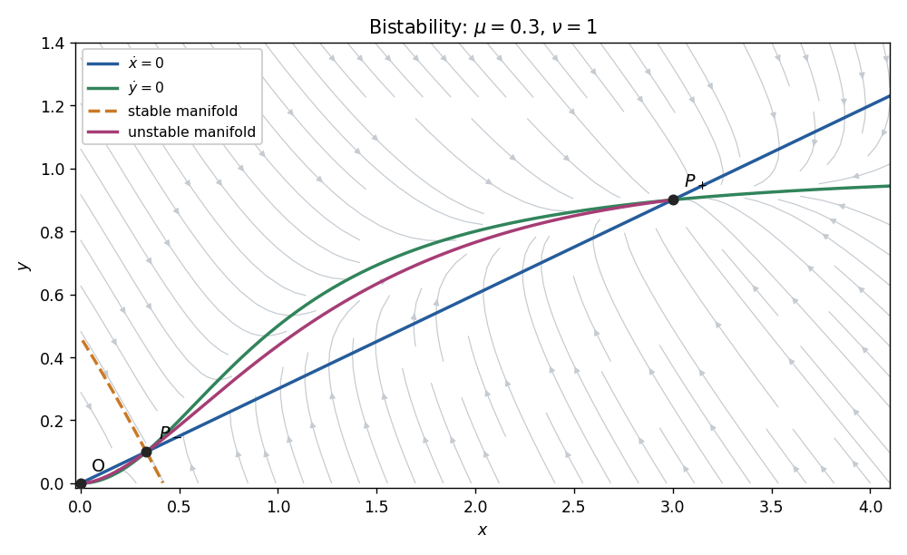
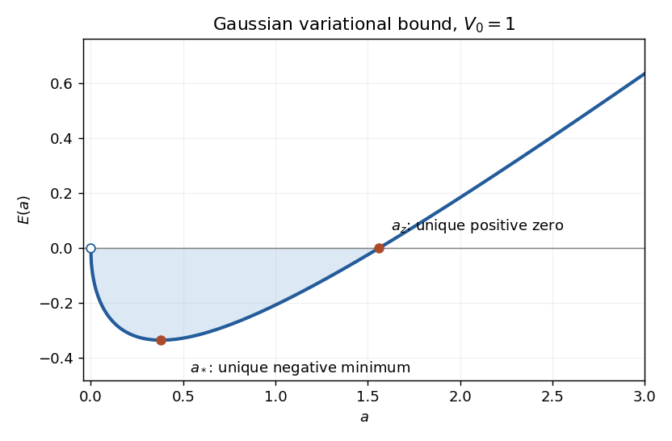

# Paper 1

↑ **Parent:** [Ii](../ii.md)

[https://www.maths.cam.ac.uk/undergrad/pastpapers/files/2010/PaperII_1.pdf](https://www.maths.cam.ac.uk/undergrad/pastpapers/files/2010/PaperII_1.pdf)

**Table of contents**

- [1G](#1g)
  - [i](#1g/i)
    - [Solution](#1g/i/solution)
  - [ii](#1g/ii)
    - [Solution](#1g/ii/solution)
- [2F](#2f)
  - [i](#2f/i)
    - [Solution](#2f/i/solution)
  - [ii](#2f/ii)
    - [Solution](#2f/ii/solution)
- [3F](#3f)
  - [Solution](#3f/solution)
- [4H](#4h)
  - [Solution](#4h/solution)
- [5J](#5j)
  - [Solution](#5j/solution)
- [6A](#6a)
  - [Solution](#6a/solution)
- [7D](#7d)
  - [Solution](#7d/solution)
- [8E](#8e)
  - [Solution](#8e/solution)
- [9D](#9d)
  - [Solution](#9d/solution)
- [10D](#10d)
  - [Solution](#10d/solution)
- [11F](#11f)
  - [Solution](#11f/solution)
- [12H](#12h)
  - [Solution](#12h/solution)
- [13J](#13j)
  - [Solution](#13j/solution)
- [14E](#14e)
  - [i](#14e/i)
    - [Solution](#14e/i/solution)
  - [ii](#14e/ii)
    - [Solution](#14e/ii/solution)
  - [iii](#14e/iii)
    - [Solution](#14e/iii/solution)
  - [iv](#14e/iv)
    - [Solution](#14e/iv/solution)
- [15D](#15d)
  - [Solution](#15d/solution)
- [16G](#16g)
  - [Solution](#16g/solution)
- [17F](#17f)
  - [a](#17f/a)
    - [Solution](#17f/a/solution)
  - [b](#17f/b)
    - [i](#17f/b/i)
      - [Solution](#17f/b/i/solution)
    - [ii](#17f/b/ii)
      - [Solution](#17f/b/ii/solution)
    - [iii](#17f/b/iii)
      - [Solution](#17f/b/iii/solution)
    - [iv](#17f/b/iv)
      - [Solution](#17f/b/iv/solution)
- [18H](#18h)
  - [i](#18h/i)
    - [Solution](#18h/i/solution)
  - [ii](#18h/ii)
    - [Solution](#18h/ii/solution)
  - [iii](#18h/iii)
    - [Solution](#18h/iii/solution)
- [19F](#19f)
  - [i](#19f/i)
    - [Solution](#19f/i/solution)
  - [ii](#19f/ii)
    - [Solution](#19f/ii/solution)
- [20G](#20g)
  - [Solution](#20g/solution)
- [21H](#21h)
  - [Solution](#21h/solution)
- [22H](#22h)
  - [Solution](#22h/solution)
- [23G](#23g)
  - [Solution](#23g/solution)
- [24G](#24g)
  - [i](#24g/i)
    - [Solution](#24g/i/solution)
  - [ii](#24g/ii)
    - [Solution](#24g/ii/solution)
  - [iii](#24g/iii)
    - [Solution](#24g/iii/solution)
- [25H](#25h)
  - [i](#25h/i)
    - [Solution](#25h/i/solution)
  - [ii](#25h/ii)
    - [Solution](#25h/ii/solution)
  - [iii](#25h/iii)
    - [Solution](#25h/iii/solution)
- [26I](#26i)
  - [Solution](#26i/solution)
- [27I](#27i)
  - [a](#27i/a)
    - [Solution](#27i/a/solution)
  - [b](#27i/b)
    - [Solution](#27i/b/solution)
  - [c](#27i/c)
    - [Solution](#27i/c/solution)
  - [d](#27i/d)
    - [Solution](#27i/d/solution)
  - [e](#27i/e)
    - [Solution](#27i/e/solution)
- [28J](#28j)
  - [Solution](#28j/solution)
- [29I](#29i)
  - [Solution](#29i/solution)
- [30E](#30e)
  - [a](#30e/a)
    - [Solution](#30e/a/solution)
  - [b](#30e/b)
    - [Solution](#30e/b/solution)
  - [c](#30e/c)
    - [Solution](#30e/c/solution)
- [31C](#31c)
  - [a](#31c/a)
    - [Solution](#31c/a/solution)
  - [b](#31c/b)
    - [Solution](#31c/b/solution)
  - [c](#31c/c)
    - [Solution](#31c/c/solution)
- [32E](#32e)
  - [Solution](#32e/solution)
- [33C](#33c)
  - [Solution](#33c/solution)
- [34B](#34b)
  - [Solution](#34b/solution)
- [35B](#35b)
  - [Solution](#35b/solution)
- [36B](#36b)
  - [Solution](#36b/solution)
- [37A](#37a)
  - [Solution](#37a/solution)
  - [i](#37a/i)
    - [Solution](#37a/i/solution)
  - [ii](#37a/ii)
    - [Solution](#37a/ii/solution)
- [38A](#38a)
  - [Solution](#38a/solution)
- [39A](#39a)
  - [a](#39a/a)
    - [Solution](#39a/a/solution)
  - [b](#39a/b)
    - [Solution](#39a/b/solution)

## 1G

↑ **Parent:** [Paper 1](paper-1.md)

<h3 id="1g/i">i</h3>

↑ **Parent:** [1G](#1g)

<h4 id="1g/i/solution">Solution</h4>

↑ **Parent:** [I](#1g/i)

For [congruence classes](../../../number-theory.md#congruence-class) in $\mathbb Z/N\mathbb Z$, define

$$
\boxed{[a]+[b]=[a+b],\qquad [a][b]=[ab].}
$$

These operations are independent of representatives. If $a'=a+Nr$ and $b'=b+Ns$, then $(a'+b')-(a+b)=N(r+s)$ and $a'b'-ab=N(rb+sa+Nrs)$. Thus changing representatives leaves both results in the same [congruence class](../../../number-theory.md#congruence-class). The usual integer laws descend to make this a [commutative ring](../../../commutative-algebra.md#commutative-ring) with zero $[0]$ and identity $[1]$.

<h3 id="1g/ii">ii</h3>

↑ **Parent:** [1G](#1g)

<h4 id="1g/ii/solution">Solution</h4>

↑ **Parent:** [Ii](#1g/ii)

The [decimal expansion](../../../number-theory.md#decimal-expansion) gives $M=\sum_{i=0}^s a_i10^i$. In [modular arithmetic](../../../number-theory.md#modular-arithmetic), $10\equiv-1\pmod {11}$, and hence

$$
\boxed{M\equiv\sum_{i=0}^s(-1)^ia_i\pmod {11}.}
$$

An integer is divisible by eleven exactly when its [congruence class](../../../number-theory.md#congruence-class) is zero, proving both directions of the alternating-digit test.

## 2F

↑ **Parent:** [Paper 1](paper-1.md)

<h3 id="2f/i">i</h3>

↑ **Parent:** [2F](#2f)

<h4 id="2f/i/solution">Solution</h4>

↑ **Parent:** [I](#2f/i)

The [Baire category theorem](../../../topological-analysis.md#baire-category-theorem) says that a countable intersection of open dense sets in a nonempty [complete metric space](../../../topological-analysis.md#complete-metric-space) is dense. Write $E=\{e_1,e_2,\ldots\}$. Each singleton is closed in a [metric space](../../../topological-analysis.md#metric-space) and has empty interior because there are no isolated points. Therefore every $X\setminus\{e_j\}$ is open and dense. Applying the theorem also to $G$ yields

$$
G\setminus E=G\cap\bigcap_{j\geq1}(X\setminus\{e_j\}),
$$

which is **dense in $X$**. Thus every nonempty open subset meets the required difference, not merely the original dense set $G$.

<h3 id="2f/ii">ii</h3>

↑ **Parent:** [2F](#2f)

<h4 id="2f/ii/solution">Solution</h4>

↑ **Parent:** [Ii](#2f/ii)

**No.** Take the [complete metric space](../../../topological-analysis.md#complete-metric-space) $X=\mathbb R$ with its usual metric, $E=\mathbb Q$, and $G=\mathbb Q\cup(1,2)$. This $G$ is uncountable and dense, whereas

$$
G\setminus E=(1,2)\setminus\mathbb Q
$$

misses, for example, the nonempty open interval $(3,4)$. Uncountability does not replace the open-dense hypothesis in the [Baire category theorem](../../../topological-analysis.md#baire-category-theorem).

## 3F

↑ **Parent:** [Paper 1](paper-1.md)

<h3 id="3f/solution">Solution</h3>

↑ **Parent:** [3F](#3f)

A plane [plane crystallographic group](../../../geometry-and-topology.md#wallpaper-group) is a discrete subgroup of the Euclidean isometry group with compact quotient. Its translations form a normal rank-two [Euclidean lattice](../../../fourier-analysis.md#euclidean-lattice) $\Lambda$; this is the standard translation-lattice structure of a plane crystallographic group. Its [point group](../../../geometry-and-topology.md#point-group) is the [finite group](../../../group.md#finite-group) of linear parts, equivalently the quotient by those translations. Conjugating a translation by an isometry sends its translation vector to its image under the linear part, so every point-group element preserves $\Lambda$.

Choose a [Euclidean lattice](../../../fourier-analysis.md#euclidean-lattice) basis. A rotational linear part is then represented by an integer [matrix](../../../vector-space.md#matrix) $A$, since it sends the basis to [Euclidean lattice](../../../fourier-analysis.md#euclidean-lattice) vectors. In an orthonormal basis the same map has [eigenvalues](../../../linear-operator-theory.md#eigenvalue) $e^{i\theta},e^{-i\theta}$, and its [trace](../../../linear-algebra.md#matrix-trace) is independent of basis. Thus

$$
2\cos\theta=\operatorname{tr}A\in\mathbb Z\cap[-2,2]=\{-2,-1,0,1,2\}.
$$

These possibilities give rotation angles, modulo a full turn, $\pi$, $\pm2\pi/3$, $\pm\pi/2$, $\pm\pi/3$, and $0$, respectively. Consequently the [crystallographic restriction theorem](../../../geometry-and-topology.md#crystallographic-restriction-theorem) is

$$
\boxed{\text{rotation order }\in\{1,2,3,4,6\}.}
$$

The restriction comes from integrality of the [Euclidean lattice](../../../fourier-analysis.md#euclidean-lattice) action, not simply from finiteness of the [point group](../../../geometry-and-topology.md#point-group).

## 4H

↑ **Parent:** [Paper 1](paper-1.md)

<h3 id="4h/solution">Solution</h3>

↑ **Parent:** [4H](#4h)

A binary [uniquely decodable code](../../../coding-theory.md#decipherable-code) assigns a finite binary word to each source symbol, so that no two distinct finite sequences of source symbols have the same concatenated encoding. This does not require the stronger prefix property. All codeword lengths are positive.

Put $S=\sum_j2^{-l_j}$ and let $A_{k,L}$ count sequences of $k$ source symbols whose encoded total length is $L$. Expanding the product gives

$$
S^k=\sum_{L=kl_{\min}}^{kl_{\max}}A_{k,L}2^{-L}.
$$

Unique decodability makes these encodings distinct, so $A_{k,L}\leq2^L$, the number of binary strings of that length. There are at most $k(l_{\max}-l_{\min})+1$ possible lengths. Therefore

$$
S^k\leq k(l_{\max}-l_{\min})+1.
$$

Taking $k$th roots and letting $k\to\infty$ proves the [McMillan inequality](../../../coding-theory.md#mcmillan-inequality):

$$
\boxed{\sum_j2^{-l_j}\leq1.}
$$

## 5J

↑ **Parent:** [Paper 1](paper-1.md)

<h3 id="5j/solution">Solution</h3>

↑ **Parent:** [5J](#5j)

Independence in the [Bernoulli logistic-regression model](../../../statistical-modelling.md#bernoulli-logistic-regression-model) gives the [log-likelihood](../../../statistical-modelling.md#log-likelihood)

$$
\ell(\beta)=\sum_{i=1}^n\left[y_i\beta x_i-\log(1+e^{\beta x_i})\right].
$$

Writing $\mu_i=(1+e^{-\beta x_i})^{-1}$, the [score function](../../../statistical-modelling.md#informant-function) and curvature are

$$
\boxed{\ell'(\beta)=\sum_i x_i(y_i-\mu_i),\qquad
\ell''(\beta)=-\sum_i x_i^2\mu_i(1-\mu_i).}
$$

Thus a finite [maximum-likelihood estimate](../../../statistical-modelling.md#maximum-likelihood-estimator) solves $\sum_i x_i(y_i-\widehat\mu_i)=0$. If at least one $x_i\ne0$, the curvature is strictly negative for finite $\beta$, so any such solution is the unique maximizer.

Use the [Newton method](../../../mathematical-optimization.md#newton-s-method-in-optimization), which here coincides with [Fisher scoring](../../../statistical-modelling.md#scoring-algorithm) because the second derivative does not depend on the observed responses:

$$
\beta_{k+1}=\beta_k+
\frac{\sum_i x_i(y_i-\mu_i(\beta_k))}{\sum_i x_i^2\mu_i(\beta_k)(1-\mu_i(\beta_k))}.
$$

Step damping or a bracket for the monotone score provides reliable numerical convergence. If all covariates are zero the parameter is unidentifiable; if the outcomes are separated in the direction of the covariates, the likelihood supremum may occur at $\beta=+\infty$ or $-\infty$ rather than at a finite estimate.

## 6A

↑ **Parent:** [Paper 1](paper-1.md)

<h3 id="6a/solution">Solution</h3>

↑ **Parent:** [6A](#6a)

The positive [steady state](../../../dynamical-systems.md#steady-state) satisfies $1+b(N^*)^2=r$, so

$$
\boxed{N^*=\sqrt{(r-1)/b}.}
$$

With $N_t=N^*+\eta_t$, the [linearization](../../../algebra.md#linearization) is

$$
\eta_{t+1}=\eta_t-\frac{2(r-1)}r\eta_{t-1}.
$$

Its [characteristic polynomial](../../../linear-operator-theory.md#characteristic-polynomial) is $\lambda^2-\lambda+d$, where $d=2(r-1)/r$. The roots are inside the unit disk precisely when $0<d<1$: when they are real they are positive with sum one, and when complex conjugate their common modulus is $\sqrt d$. Therefore the [fixed point](../../../function.md#fixed-point) is **linearly asymptotically stable for $1<r<2$ and unstable for $r>2$**. At $r=2$,

$$
\boxed{\lambda_\pm=e^{\pm i\pi/3},\qquad\eta_{t+6}=\eta_t.}
$$

This proves period six for the neutral linearized oscillations. The stronger printed claim of a nonlinear period-six branch is not valid for the stated recurrence. It is important to distinguish these two assertions.

Here is a local obstruction, which also checks that the qualification is not merely absence of a proof. Normalize by the moving [fixed point](../../../function.md#fixed-point), let $x=N_{t-1}/N^*(r)-1$, $y=N_t/N^*(r)-1$, and define

$$
F_r(x,y)=\left(y,\frac{r(1+y)}{1+(r-1)(1+x)^2}-1\right).
$$

Put $v=(x,y)^T$, $\delta=r-2$, and $Q=x^2-xy+y^2>0$ for $v\ne0$. The quadratic and cubic terms of $F_2$'s second component are $x^2/2-xy+x^2y/2$. Composing six times gives

$$
F_r^6(v)-v=\delta Bv+QD v+
O\bigl(|v|^4+|\delta||v|^2+\delta^2|v|\bigr),
\quad
B=\begin{pmatrix}1&1\\-1&2\end{pmatrix},\quad
D=\begin{pmatrix}-1/2&-1\\1&-3/2\end{pmatrix}.
$$

In particular the quadratic terms cancel, while the cubic components are $-(x+2y)Q/2$ and $(2x-3y)Q/2$. If a small nonzero $v$ were a period-six point, invertibility of $B$ and the norm of this equation would imply $|\delta|=O(|v|^2)$. Taking its [determinant](../../../linear-algebra.md#determinant) with $Bv$ then gives

$$
0=\det(Bv,QDv)+O(|v|^5)=\frac{Q^2}{2}+O(|v|^5).
$$

Since $Q\geq|v|^2/2$, this is impossible for sufficiently small nonzero $v$. Thus **no nontrivial nonlinear six-cycle bifurcates locally at $r=2$**. At the threshold the same expansion gives $Q(F_2^6(v))=Q(v)-2Q(v)^2+O(|v|^5)$, so the [fixed point](../../../function.md#fixed-point) is actually locally asymptotically stable nonlinearly, with slow decay. The valid intended linear-stability conclusion is the period-six neutral oscillation above; a literal nonlinear assertion requires a changed model or wording. This is an example of the [distinction between linear resonance and nonlinear periodic bifurcation](../../../mathematical-biology.md#distinction-between-linear-resonance-and-nonlinear-periodic-bifurcation).

## 7D

↑ **Parent:** [Paper 1](paper-1.md)

<h3 id="7d/solution">Solution</h3>

↑ **Parent:** [7D](#7d)

The [nullclines](../../../dynamical-systems.md#nullcline) are $y=\mu x$ and $y=x^2/[\nu(1+x^2)]$. At a nonzero [fixed point](../../../function.md#fixed-point), cancellation of $x$ yields $\mu\nu=x/(1+x^2)$. The latter function attains its maximum $1/2$ at $x=1$. Hence

$$
\boxed{\mu_c=\frac1{2\nu},\qquad
O=(0,0),\quad P_\pm=(x_\pm,\mu x_\pm),\quad
x_\pm=\frac{1\pm\sqrt{1-4\mu^2\nu^2}}{2\mu\nu}.}
$$

For $0<\mu<\mu_c$, $x_-<1<x_+$ and $x_-x_+=1$.

The [Jacobian matrix](../../../calculus.md#jacobian-matrix) is

$$
J(x,y)=\begin{pmatrix}-\mu&1\\2x/(1+x^2)^2&-\nu\end{pmatrix}.
$$

At $O$ the distinct [eigenvalues](../../../linear-operator-theory.md#eigenvalue) are $-\mu,-\nu$, so the origin is a [stable node](../../../dynamical-systems.md#stable-node). At a nonzero [fixed point](../../../function.md#fixed-point) its [trace](../../../linear-algebra.md#matrix-trace) is $-(\mu+\nu)<0$ and

$$
\det J=\mu\nu\frac{x^2-1}{1+x^2}.
$$

The discriminant is $(\mu-\nu)^2+8x/(1+x^2)^2>0$. Thus **$P_-$ is a saddle and $P_+$ is a [stable node](../../../dynamical-systems.md#stable-node)**, never a focus.

**[Figure 1](#7d/image-nullclines-and-bistable-phase-portrait-with-saddle-manifolds). Nullclines and bistable phase portrait with saddle manifolds**.

Above the straight [nullcline](../../../dynamical-systems.md#nullcline) $\dot x>0$; below it $\dot x<0$. Below the curved [nullcline](../../../dynamical-systems.md#nullcline) $\dot y>0$; above it $\dot y<0$. At the saddle, an [eigenvector](../../../linear-operator-theory.md#eigenvector) can be chosen as $(1,\mu+\lambda)$: the stable [eigenvalue](../../../linear-operator-theory.md#eigenvalue) gives negative slope, and the unstable [eigenvalue](../../../linear-operator-theory.md#eigenvalue) gives positive slope. The [stable manifold](../../../dynamical-systems.md#stable-manifold) is the basin boundary. The two branches of the [unstable manifold](../../../dynamical-systems.md#unstable-manifold) lead respectively to the origin and the positive [stable node](../../../dynamical-systems.md#stable-node), as illustrated for representative parameters.

The nonnegative quadrant is forward invariant. Since $\dot y\leq1-\nu y$, $y$ stays bounded, and then $\dot x=-\mu x+y$ also bounds $x$. Moreover the divergence is the negative constant $-(\mu+\nu)$, excluding periodic or homoclinic loops by the [Bendixson-Dulac criterion](../../../dynamical-systems.md#bendixson-dulac-theorem). The [Poincaré-Bendixson theorem](../../../dynamical-systems.md#poincare-bendixson-theorem) then leaves convergence to a [fixed point](../../../function.md#fixed-point). Initial data on the saddle's [stable manifold](../../../dynamical-systems.md#stable-manifold) approach the saddle; data in the two open basins approach **extinction at $O$ or persistence at $P_+$**, respectively.

## 8E

↑ **Parent:** [Paper 1](paper-1.md)

<h3 id="8e/solution">Solution</h3>

↑ **Parent:** [8E](#8e)

The real part of a [holomorphic function](../../../complex-analysis.md#holomorphic-function) is real analytic and has a local complexification in its two real coordinates. Define $f^*(w)=\overline{f(\bar w)}$. On real $(x,y)$,

$$
2u(x,y)=f(x+iy)+f^*(x-iy),
$$

and the same identity holds after analytic continuation to complex $(x,y)$. Substituting $x=(z+\bar z_0)/2$ and $y=(z-\bar z_0)/(2i)$ gives $x+iy=z$ and $x-iy=\bar z_0$, hence

$$
\boxed{f(z)=2u\left(\frac{z+\bar z_0}{2},\frac{z-\bar z_0}{2i}\right)-\overline{f(z_0)}.}
$$

The conjugation on the final constant is present in the PDF but was lost in the converted TeX. Without it the formula already fails when $z=z_0$ and $f(z_0)$ is not real.

Now $ze^{iz}=(x+iy)e^{-y}(\cos x+i\sin x)$ has the specified real part. Thus the complete family is

$$
\boxed{f(z)=ze^{iz}+iC,\qquad C\in\mathbb R.}
$$

Any two such [holomorphic functions](../../../complex-analysis.md#holomorphic-function) differ by a [holomorphic function](../../../complex-analysis.md#holomorphic-function) with zero real part; the [Cauchy-Riemann equations](../../../analysis.md#cauchy-riemann-equations) make its imaginary part constant on a connected neighborhood.

## 9D

↑ **Parent:** [Paper 1](paper-1.md)

<h3 id="9d/solution">Solution</h3>

↑ **Parent:** [9D](#9d)

In [Lagrangian mechanics](../../../classical-mechanics.md#lagrangian-mechanics), the [energy balance for an autonomous Lagrangian](../../../classical-mechanics.md#energy-balance-for-an-autonomous-lagrangian) uses $E=\sum_i\dot q_i\,\partial L/\partial\dot q_i-L$. For the stationary [vector potential](../../../calculus.md#vector-potential) the velocity-linear magnetic term cancels in this expression, leaving [kinetic energy](../../../classical-mechanics.md#kinetic-energy). In [cylindrical coordinates](../../../calculus.md#cylindrical-coordinate-system),

$$
L=\frac m2(\dot r^2+r^2\dot\phi^2+\dot z^2)+er^2g(z)\dot\phi.
$$

Time independence and the cyclic angular coordinate give two constants:

$$
\boxed{E=\frac m2(\dot r^2+r^2\dot\phi^2+\dot z^2),\qquad
p_\phi=mr^2\dot\phi+er^2g(z).}
$$

The three [Euler-Lagrange equations](../../../analysis.md#euler-lagrange-equation) are

$$
m\ddot r=mr\dot\phi^2+2erg\dot\phi,\qquad
\frac d{dt}(mr^2\dot\phi+er^2g)=0,\qquad
m\ddot z=er^2g'\dot\phi.
$$

The supplied angular velocity is $\dot\phi=-2eg(z_0)/m$. Set $r=r_0$, $z=z_0$ and use this constant angular velocity. The radial right-hand side is $mr_0(\dot\phi^2+2eg\dot\phi/m)=0$, the [angular momentum](../../../classical-mechanics.md#angular-momentum) is constant, and the vertical equation vanishes when $g'(z_0)=0$. These equations and the initial data therefore give

$$
\boxed{r(t)=r_0,\quad z(t)=z_0,\quad
\phi(t)=\phi_0-\frac{2eg(z_0)}m t.}
$$

For nonzero radius and charge this is the requested circular orbit.

## 10D

↑ **Parent:** [Paper 1](paper-1.md)

<h3 id="10d/solution">Solution</h3>

↑ **Parent:** [10D](#10d)

The [Hubble time](../../../cosmology.md#hubble-time) is the instantaneous inverse expansion rate $H_0^{-1}$, where $H=\dot a/a$. A radial light ray covers comoving distance $\int c\,dt/a(t)$. Since $a(t_0)=1$, the present proper radius of the [particle horizon](../../../cosmology.md#particle-horizon) is

$$
\boxed{R_0=c\int_0^{t_0}\frac{dt}{a(t)}.}
$$

For the power-law scale factor, $a(0)=0$ requires $\alpha>0$. The integral converges only when $\alpha<1$, in which case

$$
\boxed{R_0=\frac{ct_0}{1-\alpha},\qquad
H_0=\frac\alpha{t_0},\qquad t_0=\alpha H_0^{-1}.}
$$

At $\alpha=1$ the divergence is logarithmic, and at $\alpha>1$ it is a power divergence. The familiar flat-universe epochs have $\alpha=1/2$ for radiation and $\alpha=2/3$ for pressureless matter, obtained from $\rho\propto a^{-4}$ or $a^{-3}$ and the [Friedmann equation](../../../cosmology.md#friedmann-equations). Both have $0<\alpha<1$, so their ages are **less than the present [Hubble time](../../../cosmology.md#hubble-time)**. These power laws describe idealized single-component epochs rather than the full late-time expansion history.

## 11F

↑ **Parent:** [Paper 1](paper-1.md)

<h3 id="11f/solution">Solution</h3>

↑ **Parent:** [11F](#11f)

Inversion in a circle of center $c$ and radius $R$ is $K(z)=c+R^2/(\bar z-\bar c)$ on the extended plane. It sends infinity to $c$, so **it interchanges zero and infinity exactly when $c=0$**.

For the unit-circle inversion $J$, both $J$ and $K$ are involutions. If $KJz_0=z_0$, applying $K$ gives $Jz_0=Kz_0$. Writing $w=Jz_0$, we have $Jw=z_0$ and $Kw=z_0$, and therefore $KJw=Kz_0=w$. This proves both assertions about the [fixed points](../../../function.md#fixed-point).

We now show that one [fixed point](../../../function.md#fixed-point) is inside the disk and use it as the hyperbolic center. Rotate coordinates to make the Euclidean center $c=a\geq0$. The hypothesis is $a+R<1$. If $a=0$ the conclusion follows immediately from the radial hyperbolic distance. If $a>0$, then

$$
T(z)=a+\frac{R^2z}{1-az},\qquad
az^2-(1+a^2-R^2)z+a=0
$$

for its [fixed points](../../../function.md#fixed-point). Since $1+a^2-R^2>2a$, this quadratic has two positive roots with product one, one $p\in(0,1)$ and the other $1/p>1$.

The disk automorphism $h(z)=(z-p)/(1-pz)$ is a [Poincare disc automorphism](../../../geometry-and-topology.md#poincare-disc-automorphism). It sends the two [fixed points](../../../function.md#fixed-point) to zero and infinity and commutes with $J$ on the extended plane. Consequently $K'=hKh^{-1}=(hTh^{-1})J$ interchanges zero and infinity. Conjugation takes circle inversion to inversion in the image circle, so the first part says that $h(\Gamma)$ is centered at zero. Its Euclidean radius is some $s<1$.

In the Poincaré disk metric, integrating the radial length element gives

$$
d_D(0,z)=\int_0^{|z|}\frac{2\,dr}{1-r^2}=2\operatorname{artanh}|z|.
$$

Since $h$ preserves distance, the original circle is exactly

$$
\boxed{\Gamma=\{z\in D:d_D(p,z)=2\operatorname{artanh}s\}.}
$$

Undoing the preliminary rotation gives the center for arbitrary complex $c$.

This identifies the [hyperbolic circle in the Poincare disc](../../../geometry-and-topology.md#hyperbolic-circle-in-the-poincare-disc) intrinsically.

## 12H

↑ **Parent:** [Paper 1](paper-1.md)

<h3 id="12h/solution">Solution</h3>

↑ **Parent:** [12H](#12h)

A [binary symmetric channel](../../../coding-theory.md#binary-symmetric-channel) flips each transmitted bit independently with probability $p$. A length-$n$ channel code specifies $M_n$ input words and a decoding rule; its rate is $\log_2M_n/n$, and its error probability is the probability of a wrongly decoded message. The [channel capacity](../../../information-theory.md#channel-capacity) is the supremum of asymptotically achievable rates with vanishing error. For $0\leq p\leq1$, put $h_2(p)=-p\log_2p-(1-p)\log_2(1-p)$, with $0\log_20=0$. The [Shannon second coding theorem](../../../coding-theory.md#noisy-channel-coding-theorem) here states

$$
\boxed{C=1-h_2(p)\quad\text{bits per channel use}.}
$$

We prove achievability and the converse rather than using the formula as a substitute for a coding argument. Output complementation reduces $p>1/2$ to $1-p$, so first assume $0<p<1/2$.

Fix $R<C$. Choose $\delta>0$ such that $q=p+\delta<1/2$ and $R<1-h_2(q)$. Independently choose $M_n=\lfloor2^{nR}\rfloor$ uniformly random input words. Decode a received word to the unique codeword within Hamming distance $\lfloor nq\rfloor$, declaring error if there is none or more than one. The [weak law of large numbers](../../../convergence-of-random-variables.md#weak-law-of-large-numbers) says the empirical fraction of independent Bernoulli-$p$ errors tends in probability to $p$, so exceeding this distance has probability tending to zero.

For any independently chosen competing codeword, its probability of lying in this ball is $2^{-n}B_n(q)$, where

$$
B_n(q)=\sum_{j\leq nq}\binom nj\leq(n+1)2^{nh_2(q)}.
$$

Indeed $\binom nj\leq2^{nh_2(j/n)}$ follows by bounding the probability of exactly $j$ successes in a binomial experiment with parameter $j/n$ by one, and $h_2$ increases on $[0,1/2]$. A union bound therefore bounds the ensemble-average decoding error by

$$
\mathbb P\{\operatorname{Bin}(n,p)>nq\}+
(n+1)2^{-n(1-h_2(q)-R)}\longrightarrow0.
$$

Some deterministic code is at least as good as this average. Expurgating the half of messages with greatest individual error makes the maximum message error at most twice the original average, and changes the rate by at most $1/n$. This proves achievability even for maximum-error probability.

For the converse, take uniform messages and any deterministic code/decoder. The independent noise word $Z$ has probability $p^{|Z|}(1-p)^{n-|Z|}$. Its normalized negative log-probability tends in probability to $h_2(p)$ by the same law. Thus, outside an event of probability tending to zero, each noise word has probability at most $2^{-n(h_2(p)-\delta)}$. The decoder's disjoint decision regions $D_j$ contain at most $2^n$ received words in total. Hence

$$
P_{\rm success}\leq o(1)+\frac1{M_n}\sum_j|D_j|2^{-n(h_2(p)-\delta)}
\leq o(1)+2^{n(1-R_n-h_2(p)+\delta)}.
$$

At rates bounded above capacity by a positive amount, choose smaller $\delta$ and obtain success probability tending to zero. This establishes the strong converse as well as the ordinary impossibility of reliable transmission above $C$.

When $p=1/2$ the output is independent of the input, so success probability for uniform messages is at most $1/M_n$ and $C=0$. At $p=0$ or $1$ the channel is noiseless or deterministically inverted; all $2^n$ words can be distinguished, so $C=1$. These endpoints complete the theorem.

## 13J

↑ **Parent:** [Paper 1](paper-1.md)

<h3 id="13j/solution">Solution</h3>

↑ **Parent:** [13J](#13j)

Let $\ell_{\rm sat}$ denote the maximized [log-likelihood](../../../statistical-modelling.md#log-likelihood) in the saturated model, with one fitted mean per observation. With known dispersion, define the [deviance](../../../exponential-family.md#exponential-family-deviance) of a fitted model as $D=2(\ell_{\rm sat}-\ell_{\rm fitted})$; for an exponential-dispersion convention that scales deviance by the dispersion $\phi$, divide that scaled quantity by $\phi$ in the following test.

Let $D_0,D_1$ be the fitted deviances under the null and full models. Their difference is the [likelihood-ratio test statistic](../../../statistical-modelling.md#likelihood-ratio-test-statistic)

$$
\boxed{D_0-D_1=2(\ell(\widehat\beta)-\ell(\widehat\beta_0,0)).}
$$

Under the regular identifiable interior null hypothesis, [Wilks theorem](../../../statistical-inference.md#wilks-theorem) gives the limiting $\chi^2_{p-p_0}$ distribution. Reject for an observed difference above its chosen upper-tail critical value. This concerns the difference of fitted model deviances, not simply the full-model deviance compared with zero.

For a [Poisson regression](../../../statistical-modelling.md#poisson-regression), the means are $\mu_i=e^{x_i^T\beta}$ and $\ell=\sum_i(y_i\log\mu_i-\mu_i-\log y_i!)$. Saturation sets $\mu_i=y_i$, taking the limiting value at $y_i=0$. Consequently the [Poisson deviance](../../../statistical-modelling.md#poisson-deviance) is

$$
\boxed{D=2\sum_i\left[y_i\log\frac{y_i}{\widehat\mu_i}-(y_i-\widehat\mu_i)\right],}
$$

with $0\log0=0$. The intercept score implies $\sum_i(y_i-\widehat\mu_i)=0$ at a finite fit, although retaining that term makes the individual deviance contributions clear.

For $y_i=\widehat\mu_i+\delta_i$ with $|\delta_i|/\widehat\mu_i$ small, expand $(\widehat\mu_i+\delta_i)\log(1+\delta_i/\widehat\mu_i)-\delta_i$. The linear term cancels and the result is $\delta_i^2/(2\widehat\mu_i)+O(|\delta_i|^3/\widehat\mu_i^2)$. Therefore

$$
D\simeq\sum_i\frac{(y_i-\widehat\mu_i)^2}{\widehat\mu_i},
$$

the [Pearson chi-squared statistic](../../../statistical-modelling.md#pearson-chi-squared-statistic). The approximation requires adequately large fitted counts and small relative residuals; it is not an identity for sparse observations.

## 14E

↑ **Parent:** [Paper 1](paper-1.md)

<h3 id="14e/i">i</h3>

↑ **Parent:** [14E](#14e)

<h4 id="14e/i/solution">Solution</h4>

↑ **Parent:** [I](#14e/i)

Set $\omega(k)=k^2-i\beta k$ and $E=e^{-ikx+\omega t}$. Differentiation gives $(Eu)_t=E(u_t+\omega u)$, while

$$
\bigl(E[(ik+\beta)u+u_x]\bigr)_x
=E\left[u_{xx}+\beta u_x+(k^2-i\beta k)u\right].
$$

The two sides are equal precisely by the stated [advection-diffusion equation](../../../diffusion-equation.md#advection-diffusion-equation). This supplies its divergence form in the $(x,t)$ plane.

<h3 id="14e/ii">ii</h3>

↑ **Parent:** [14E](#14e)

<h4 id="14e/ii/solution">Solution</h4>

↑ **Parent:** [Ii](#14e/ii)

Rapid decay allows two integrations by parts in the half-line [Fourier transform](../../../analysis.md#fourier-transform). They give

$$
\partial_t\widehat u+\omega\widehat u
=-u_x(0,t)-(ik+\beta)u(0,t).
$$

Solving this scalar inhomogeneous equation by an integrating factor yields

$$
\boxed{\widehat u(k,t)=e^{-\omega t}\widehat u(k,0)
-(ik+\beta)f_0(\omega,t)-f_1(\omega,t).}
$$

The initial transform is holomorphic for $\operatorname{Im}k<0$ and continuous on the real axis under the given decay. The time integrals are entire functions of $\omega$ for fixed $t$ and smooth boundary data.

This identity is the [half-line advection-diffusion global relation](../../../diffusion-equation.md#half-line-advection-diffusion-global-relation).

<h3 id="14e/iii">iii</h3>

↑ **Parent:** [14E](#14e)

<h4 id="14e/iii/solution">Solution</h4>

↑ **Parent:** [Iii](#14e/iii)

For $k=a+ib$, $\operatorname{Re}\omega=a^2-b^2+\beta b$. The upper contour is therefore the graph

$$
\boxed{L:\quad b=\frac{\beta+\sqrt{\beta^2+4a^2}}2,\quad -\infty<a<\infty,}
$$

oriented from left to right. Between the real axis and $L$, $b\geq0$ and $\operatorname{Re}\omega\geq0$. Hence $e^{ikx-\omega(t-s)}$ is bounded by $e^{-bx}$ for $0\leq s\leq t$. The boundary transforms are entire in $k$; with the standard smooth, compatible boundary data, [integration by parts](../../../calculus.md#integration-by-parts) in the time integral gives the required polynomial bounds. Closing the intervening sectors and using exponential decay for $x>0$ deforms their real-line integrals onto $L$. Small endpoint truncations, followed by dominated limits, handle the sector boundaries.

For $k'= -k+i\beta$, $\omega(k')=\omega(k)$ and $\operatorname{Im}k'\leq0$ on $L$. Thus the already valid transformed equation at $k'$ says

$$
\widehat u(k',t)=e^{-\omega t}\widehat u(k',0)+ikf_0-f_1.
$$

It eliminates the unknown boundary derivative through

$$
\boxed{f_1=e^{-\omega t}\widehat u(k',0)+ikf_0-\widehat u(k',t).}
$$

<h3 id="14e/iv">iv</h3>

↑ **Parent:** [14E](#14e)

<h4 id="14e/iv/solution">Solution</h4>

↑ **Parent:** [Iv](#14e/iv)

Write $\widehat u_0(k)=\widehat u(k,0)$ and retain the left-to-right orientation of $L$. Substituting the previous relation into the deformed inverse [Fourier transform](../../../analysis.md#fourier-transform) gives the data-only representation

$$
\boxed{\begin{aligned}
u(x,t)={}&\frac1{2\pi}\int_{\mathbb R}e^{ikx-\omega(k)t}\widehat u_0(k)\,dk\\
&-\frac1{2\pi}\int_L e^{ikx-\omega(k)t}\widehat u_0(-k+i\beta)\,dk\\
&-\frac1{2\pi}\int_L e^{ikx}(2ik+\beta)f_0(\omega(k),t)\,dk.
\end{aligned}}
$$

The formally remaining integral is $\int_L e^{ikx}\widehat u(-k+i\beta,t)\,dk$. Above $L$, its reflected argument lies strictly in the lower half-plane, where the transform is analytic. At large radius, $L$ approaches the rays of angles $\pi/4$ and $3\pi/4$. Close it by the upper arc between these rays. Along that arc $\operatorname{Im}k$ is bounded below by a positive multiple of its radius, whereas the reflected transform is bounded by $\int_0^\infty|u(s,t)|\,ds$. Thus the arc integral is bounded by a constant times $R e^{-cRx}$ and tends to zero for $x>0$. There are no enclosed singularities, so [Cauchy integral theorem](../../../complex-analysis.md#cauchy-s-integral-theorem) proves

$$
\int_L e^{ikx}\widehat u(-k+i\beta,t)\,dk=0.
$$

This is the needed closure argument; it does not assume the unknown transform vanishes. The representation holds for smooth decaying compatible data, and extends to weaker data by the usual limiting heat-kernel interpretation.

## 15D

↑ **Parent:** [Paper 1](paper-1.md)

<h3 id="15d/solution">Solution</h3>

↑ **Parent:** [15D](#15d)

Let the stellar radius be $R$ and assume zero external surface pressure. A spherical shell has mass $dm=4\pi r^2\rho\,dr$ and contributes $-Gm(r)\,dm/r$ to the [gravitational potential energy](../../../classical-mechanics.md#gravitational-energy). Using hydrostatic pressure support,

$$
E_{\rm grav}=-\int_0^R4\pi Gm\rho r\,dr
=4\pi\int_0^Rr^3P'\,dr
=-12\pi\int_0^Rr^2P\,dr
=\boxed{-3\langle P\rangle V}.
$$

The center boundary term vanishes and $P(R)=0$ eliminates the outer term. Nonzero external pressure would add $3P(R)V$.

The total energy is $(\alpha-3)\langle P\rangle V$, so energetic gravitational binding requires **$\alpha<3$**. For an isotropic gas, kinetic theory gives $P=(1/3)\int p v\,dn$. Nonrelativistic [kinetic energy](../../../classical-mechanics.md#kinetic-energy) is $pv/2$, giving $U=3PV/2$ and $\alpha=3/2$. Ultrarelativistic energy is $pv$, giving $U=3PV$ and $\alpha=3$: the ultrarelativistic limit is marginal in this Newtonian virial balance.

For a white dwarf, [electron degeneracy pressure](../../../statistical-physics.md#electron-degeneracy-pressure) becomes ultrarelativistic as density increases. Its equation of state then scales as $P=K\rho^{4/3}$. Pressure support and gravitational stress have the same radius scaling, leaving a limiting mass of order $(K/G)^{3/2}$ rather than allowing arbitrary mass to be supported by contraction. The [Chandrasekhar limit](../../../stellar-astrophysics.md#chandrasekhar-limit) is this maximum mass for a cold electron-degenerate star at specified composition, of order $(\hbar c/G)^{3/2}/(\mu_e m_p)^2$.

The virial calculation by itself does not establish a universal numerical maximum mass for every stellar composition and equation of state; its precise consequence is loss of binding/support as the pressure-bearing particles become ultrarelativistic. An accreting carbon-oxygen white dwarf approaching its limiting mass typically undergoes runaway carbon burning and thermonuclear disruption, a [Type Ia supernova](../../../stellar-astrophysics.md#type-ia-supernova). For other compositions or evolution, electron captures can instead lead to collapse into a neutron star. The subsequent evolution needs that physical distinction.

## 16G

↑ **Parent:** [Paper 1](paper-1.md)

<h3 id="16g/solution">Solution</h3>

↑ **Parent:** [16G](#16g)

Work with well-ordered cardinals, as usual with the [axiom of choice](../../../set-theory.md#axiom-of-choice). We first prove the infinite [cardinal arithmetic](../../../set-theory.md#cardinal-arithmetic) identity $\kappa^2=\kappa$. If a least infinite counterexample $\kappa$ existed, order pairs of ordinals below $\kappa$ first by their maximum coordinate, then lexicographically within each level. Every initial segment ending at $(\xi,\eta)$ lies inside $(\max(\xi,\eta)+1)^2$. Its cardinal is less than $\kappa$, by the smaller-cardinal identity or finite counting. This well-order cannot have an element with $\kappa$ predecessors, so its order type is at most the initial ordinal $\kappa$. Thus $|\kappa\times\kappa|\leq\kappa$, contrary to its being a counterexample; the reverse injection is $\xi\mapsto(\xi,0)$. Hence

$$
\boxed{\aleph_\alpha^2=\aleph_\alpha\quad\text{for every }\alpha.}
$$

A sum of finitely many finite cardinals is finite, so **$\aleph_0$ is regular**. A sum of fewer than $\aleph_1$ smaller cardinals is a countable union of countable sets and has size at most $\aleph_0^2=\aleph_0$, so **$\aleph_1$ is regular**.

Likewise fewer than $\aleph_2$ summands means at most $\aleph_1$ summands, each of size at most $\aleph_1$. Their sum is at most $\aleph_1^2=\aleph_1<\aleph_2$. Thus **$\aleph_2$ is regular**. In contrast,

$$
\aleph_\omega=\sum_{n<\omega}\aleph_n
$$

is a countable sum of smaller cardinals, with $\aleph_0<\aleph_\omega$. Therefore **$\aleph_\omega$ is singular**, of [cofinality](../../../set-theory.md#cofinality) $\omega$.

## 17F

↑ **Parent:** [Paper 1](paper-1.md)

<h3 id="17f/a">a</h3>

↑ **Parent:** [17F](#17f)

<h4 id="17f/a/solution">Solution</h4>

↑ **Parent:** [A](#17f/a)

The diagonal [diagonal Ramsey number](../../../graph-theory.md#diagonal-ramsey-number) $R(s)$ is the least $n$ such that every red-blue edge coloring of $K_n$ contains a monochromatic $K_s$. More generally let $R(s,t)$ require a red $K_s$ or blue $K_t$. The base cases are $R(1,t)=R(s,1)=1$. Given $R(s-1,t)+R(s,t-1)$ vertices, select one vertex. Either it has at least $R(s-1,t)$ red neighbors or at least $R(s,t-1)$ blue neighbors. Applying the corresponding smaller problem and, when needed, adjoining that selected vertex gives

$$
R(s,t)\leq R(s-1,t)+R(s,t-1).
$$

Induction and Pascal's identity now prove existence and

$$
\boxed{R(s)=R(s,s)\leq\binom{2s-2}{s-1}\leq2^{2s-2}<4^s.}
$$

<h3 id="17f/b">b</h3>

↑ **Parent:** [17F](#17f)

<h4 id="17f/b/i">i</h4>

↑ **Parent:** [B](#17f/b)

<h5 id="17f/b/i/solution">Solution</h5>

↑ **Parent:** [I](#17f/b/i)

A graph $G$ with $v$ vertices is a subgraph of $K_v$. A monochromatic $K_v$ therefore contains a monochromatic copy of $G$; the copy need not be induced. Thus the preceding finite [Ramsey theorem](../../../graph-theory.md#ramsey-theorem) gives

$$
\boxed{R(G)\leq R(v)<\infty.}
$$

<h4 id="17f/b/ii">ii</h4>

↑ **Parent:** [B](#17f/b)

<h5 id="17f/b/ii/solution">Solution</h5>

↑ **Parent:** [Ii](#17f/b/ii)

At any vertex of $K_{2s}$ there are $2s-1$ incident edges. The [pigeonhole principle](../../../algebra.md#pigeonhole-principle) ensures at least $s$ of one color. Those edges and their other endpoints form a monochromatic star $K_{1,s}$, regardless of the colors between the endpoints. Hence **$R(K_{1,s})\leq2s$**.

<h4 id="17f/b/iii">iii</h4>

↑ **Parent:** [B](#17f/b)

<h5 id="17f/b/iii/solution">Solution</h5>

↑ **Parent:** [Iii](#17f/b/iii)

For odd $s$, place $2s-1$ vertices cyclically. Color red the edges of cyclic differences $\pm1,\ldots,\pm(s-1)/2$, and blue every other edge. Each red degree is $s-1$, and each blue degree is also $(2s-2)-(s-1)=s-1$. There is no monochromatic $K_{1,s}$. For $s=1$ the same lower bound is the single-vertex graph. Together with the previous upper bound, this proves

$$
\boxed{R(K_{1,s})=2s\quad(s\text{ odd}).}
$$

<h4 id="17f/b/iv">iv</h4>

↑ **Parent:** [B](#17f/b)

<h5 id="17f/b/iv/solution">Solution</h5>

↑ **Parent:** [Iv](#17f/b/iv)

For even $s$, suppose $K_{2s-1}$ had no monochromatic star with $s$ leaves. Both color degrees would be at most $s-1$ and their sum is $2s-2$, so both must equal $s-1$. The red graph would have odd degree at every one of an odd number of vertices, contradicting the [handshaking lemma](../../../combinatorics.md#degree-sum-formula). Thus $2s-1$ vertices suffice.

On $2s-2$ vertices, split the vertices into two sets of size $s-1$, coloring inside each set red and across the sets blue. Red degrees are $s-2$ and blue degrees are $s-1$, so this avoids the star. Therefore

$$
\boxed{R(K_{1,s})=2s-1\quad(s\text{ even}).}
$$

## 18H

↑ **Parent:** [Paper 1](paper-1.md)

<h3 id="18h/i">i</h3>

↑ **Parent:** [18H](#18h)

<h4 id="18h/i/solution">Solution</h4>

↑ **Parent:** [I](#18h/i)

Take

$$
\boxed{P(X_1,\ldots,X_n)=X_1^q-X_1.}
$$

It is a nonzero polynomial, but every element of the [finite field](../../../algebra.md#finite-field) $\mathbb F_q$ satisfies $\alpha^q=\alpha$. Thus it vanishes on every point of $\mathbb F_q^n$. Formal nonzero polynomials and nonzero polynomial functions need not coincide over a finite field.

<h3 id="18h/ii">ii</h3>

↑ **Parent:** [18H](#18h)

<h4 id="18h/ii/solution">Solution</h4>

↑ **Parent:** [Ii](#18h/ii)

First make the irreducible polynomial monic; for a nonmonic polynomial restore its leading coefficient in front of the product below. If $\alpha$ is one root, $K=\mathbb F_q(\alpha)$ has degree $n$ and cardinality $q^n$. Thus every element satisfies $x^{q^n}=x$. The [Frobenius automorphism](../../../arithmetic.md#frobenius-automorphism) $x\mapsto x^q$ fixes $\mathbb F_q$ and permutes the roots. If the orbit of $\alpha$ had size $d<n$, its orbit product would be a degree-$d$ polynomial fixed by Frobenius, hence with coefficients in $\mathbb F_q$, contradicting irreducibility. Therefore

$$
\boxed{P(X)=\prod_{j=0}^{n-1}(X-\alpha^{q^j}).}
$$

The roots are distinct, since $X^{q^n}-X$ has derivative $-1$. They all lie in $K$ and include its generator $\alpha$, so **the [splitting field](../../../galois-theory.md#splitting-field) is $\mathbb F_{q^n}$**. Frobenius has order $n$ there; a degree-$n$ extension has at most $n$ automorphisms, so

$$
\boxed{\operatorname{Gal}(\mathbb F_{q^n}/\mathbb F_q)\cong C_n.}
$$

<h3 id="18h/iii">iii</h3>

↑ **Parent:** [18H](#18h)

<h4 id="18h/iii/solution">Solution</h4>

↑ **Parent:** [Iii](#18h/iii)

For $p\nmid n$, the reduction of the [cyclotomic polynomial](../../../galois-theory.md#cyclotomic-polynomial) $\Phi_n$ has precisely the primitive $n$th roots as its roots. If $p\mid\Phi_n(x)$, the residue class of $x$ has multiplicative order $n$ in $\mathbb F_p^\times$, so [Lagrange's theorem](../../../group-theory.md#lagrange-s-theorem) gives $n\mid p-1$. Conversely, if $n\mid p-1$, cyclicity of the multiplicative group supplies an element of order $n$, which is a root of $\Phi_n$; any integer representative supplies $x$. Hence

$$
\boxed{p\mid\Phi_n(x)\text{ for some integer }x\iff p\equiv1\pmod n.}
$$

Three explicit examples are $\Phi_3(X)=X^2+X+1$ with $x=2,p=7$; $\Phi_4(X)=X^2+1$ with $x=2,p=5$; and $\Phi_6(X)=X^2-X+1$ with $x=3,p=7$. Each prime is coprime to the relevant $n$ and has the stated congruence.

## 19F

↑ **Parent:** [Paper 1](paper-1.md)

<h3 id="19f/i">i</h3>

↑ **Parent:** [19F](#19f)

<h4 id="19f/i/solution">Solution</h4>

↑ **Parent:** [I](#19f/i)

For a representation $\rho$ of $G/N$, its [inflation of a group representation](../../../representation-theory.md#inflation-of-a-group-representation) to $G$ is $g\mapsto\rho(gN)$, with character $\widetilde\chi(g)=\chi(gN)$. Inflation preserves irreducibility because the invariant subspaces do not change.

For irreducible complex characters $\chi_i$, the row [character orthogonality](../../../representation-theory.md#character-orthogonality) are

$$
\frac1{|G|}\sum_{g\in G}\chi_i(g)\overline{\chi_j(g)}=\delta_{ij}.
$$

The column relations are $\sum_i\chi_i(g)\overline{\chi_i(h)}=0$ for nonconjugate $g,h$, and $|C_G(g)|$ when $g,h$ are conjugate. Class sizes convert the row sum into its usual weighted character-table form.

<h3 id="19f/ii">ii</h3>

↑ **Parent:** [19F](#19f)

<h4 id="19f/ii/solution">Solution</h4>

↑ **Parent:** [Ii](#19f/ii)

Directly tracking the supplied permutations gives

$$
a^6=1,\qquad b^2=a^3,\qquad bab^{-1}=a^{-1}.
$$

Thus every group element reduces to $a^k$ or $ba^k$, $0\leq k<6$. These are twelve distinct elements: $a$ has order six, while $b$ is not a power of $a$ because it exchanges the two six-element supports that every power of $a$ preserves. Therefore **$|G|=12$**. This is the [dicyclic group](../../../finite-group-theory.md#dicyclic-group) with parameter three; the calculations give its [order-twelve dicyclic character table](../../../finite-group-theory.md#order-twelve-dicyclic-character-table).

Conjugation by $b$ inverts powers of $a$, while conjugation by $a$ changes the exponent in $ba^k$ by two modulo six. Conjugation by $b$ preserves that exponent's parity. The complete [conjugacy classes](../../../group-theory.md#conjugacy-class) are

$$
\boxed{\{1\},\ \{a^3\},\ \{a,a^5\},\ \{a^2,a^4\},\
\{b,ba^2,ba^4\},\ \{ba,ba^3,ba^5\}.}
$$

Their sizes are $1,1,2,2,3,3$.

The [normal subgroup](../../../group-theory.md#normal-subgroup) $N=\langle a^2\rangle$ has order three. The quotient is cyclic of order four, generated by $bN$, since $(bN)^2=aN$. Inflating its characters gives $\chi_j(b)=i^j$, $\chi_j(a)=(-1)^j$, for $j=0,1,2,3$. These are all the linear characters: in any one-dimensional representation, the relation $bab^{-1}=a^{-1}$ forces the image of $a$ to have square one, so $a^2$ is in the kernel.

In the displayed class order, the full [character table](../../../representation-theory.md#character-table) is

$$
\begin{array}{c|rrrrrr}
&1&a^3&a&a^2&b&ba\\\hline
\chi_0&1&1&1&1&1&1\\
\chi_1&1&-1&-1&1&i&-i\\
\chi_2&1&1&1&1&-1&-1\\
\chi_3&1&-1&-1&1&-i&i\\
\psi_1&2&-2&1&-1&0&0\\
\psi_2&2&2&-1&-1&0&0
\end{array}.
$$

To construct the last two rows, put $\zeta=e^{i\pi/3}$ and, for $k=1,2$, set

$$
\rho_k(a)=\begin{pmatrix}\zeta^k&0\\0&\zeta^{-k}\end{pmatrix},\qquad
\rho_k(b)=\begin{pmatrix}0&(-1)^k\\1&0\end{pmatrix}.
$$

The [matrices](../../../vector-space.md#matrix) obey all three relations. The distinct eigenlines of $\rho_k(a)$ are exchanged by $\rho_k(b)$, so the representation is irreducible. Its traces on $a^m$ are $2\cos(km\pi/3)$ and on $ba^m$ are zero, producing the rows above. Their weighted inner products are orthonormal, and the degree-square sum $4\cdot1^2+2\cdot2^2=12$ proves completeness.

## 20G

↑ **Parent:** [Paper 1](paper-1.md)

<h3 id="20g/solution">Solution</h3>

↑ **Parent:** [20G](#20g)

Use the final printed restriction that $m$ is even. Square-freeness then gives $m\equiv2\pmod4$, and the integer ring is $\mathcal O_K=\mathbb Z[\sqrt{-m}]$. An integer solution has $x>0$. If $y$ were even, $y^2+m$ would have 2-adic valuation one, impossible for a cube; hence $x,y$ are odd. For an odd prime $p\mid m$, $p\mid y$ would similarly give valuation one. Thus $\gcd(y,m)=1$.

The ideals generated by $y+\sqrt{-m}$ and $y-\sqrt{-m}$ are coprime. Any common prime ideal divides their sum and difference and therefore lies above a rational prime dividing $2m$ and $y$. The odd possibilities have just been excluded; above two, $\sqrt{-m}$ is zero modulo the ramified prime while $y$ is odd, so neither factor is divisible by it. [Unique factorization of ideals in a number field](../../../algebraic-number-theory.md#unique-factorization-of-ideals-in-a-number-field) in

$$
(y+\sqrt{-m})(y-\sqrt{-m})=(x)^3
$$

now yields $(y+\sqrt{-m})=\mathfrak a^3$. Since the [class number](../../../algebraic-number-theory.md#class-number) is coprime to three, the ideal class of $\mathfrak a$ is trivial. The ideal is principal, and the only units for this imaginary quadratic field with $m\geq5$ are $\pm1$, which can be absorbed into a cube. Hence

$$
y+\sqrt{-m}=(u+v\sqrt{-m})^3,\qquad u,v\in\mathbb Z.
$$

Comparing coefficients of $\sqrt{-m}$ gives

$$
v(3u^2-mv^2)=1.
$$

Thus $v=1$ with $3u^2=m+1$, or $v=-1$ with $3u^2=m-1$. Both alternatives cannot occur, since $m-1$ and $m+1$ cannot both be divisible by three. The eligible alternative permits at most the two choices $u=\pm\sqrt{(m\pm1)/3}$, and then

$$
x=u^2+m,\qquad y=u(u^2-3m).
$$

Consequently **there are at most two integer solutions $(x,y)$**, which, when present, have the same $x$ and opposite $y$. The proof uses the evenness assumption; it does not silently claim the same coprimality argument for every odd $m$.

## 21H

↑ **Parent:** [Paper 1](paper-1.md)

<h3 id="21h/solution">Solution</h3>

↑ **Parent:** [21H](#21h)

The [path lifting theorem](../../../algebraic-topology.md#path-lifting-theorem) says that a path $\gamma:[0,1]\to X$ has a unique lift through a covering map once its initial point in the fiber is chosen. The [homotopy lifting lemma](../../../algebraic-topology.md#homotopy-lifting-theorem-for-a-covering-map) says that a homotopy $H:Z\times[0,1]\to X$, with a continuous lift specified at time zero, has a unique continuous lifted homotopy. In particular a homotopy of paths with fixed endpoints preserves the endpoint of a chosen lift, since that endpoint varies continuously in a discrete fiber.

Choose $x_0\in X$ and $y_i\in p_i^{-1}(x_0)$. For $y\in Y_1$, choose a path $\gamma$ in $Y_1$ from $y_1$ to $y$, and let $F(y)$ be the endpoint of the lift of $p_1\gamma$ to $Y_2$ starting at $y_2$. Two choices of $\gamma$ are homotopic relative endpoints because $Y_1$ is simply connected. Project that homotopy and apply homotopy lifting: the lifted endpoint remains fixed. Thus $F$ is well-defined and $p_2F=p_1$.

To prove continuity without invoking covering-space classification, choose a path-connected open neighborhood $U$ of $p_1(y)$ evenly covered by both maps. Local path connectedness of $X$ permits this choice. On the sheet of $p_1^{-1}(U)$ containing $y$, append paths within that sheet to the chosen path to $y$. Path-lift uniqueness gives

$$
F=(p_2|_{V_2})^{-1}\circ p_1
$$

there, for the sheet $V_2$ containing $F(y)$. Hence $F$ is a local homeomorphism and is continuous. Construct $G:Y_2\to Y_1$ in the same way with the basepoints reversed. Lifting the very same projected paths proves $GF$ and $FG$ fix every point. Therefore

$$
\boxed{Y_1\cong Y_2\text{ by a homeomorphism commuting with the coverings}.}
$$

## 22H

↑ **Parent:** [Paper 1](paper-1.md)

<h3 id="22h/solution">Solution</h3>

↑ **Parent:** [22H](#22h)

The [Banach-Steinhaus theorem](../../../banach-space.md#uniform-boundedness-principle), or [Uniform boundedness principle](../../../banach-space.md#uniform-boundedness-principle), states that for a family $\mathcal T$ of [bounded linear operators](../../../topological-vector-space.md#continuous-linear-operator) from a [Banach space](../../../banach-space.md) $E$ to a normed space $F$, pointwise boundedness $\sup_{T\in\mathcal T}\|Tx\|<\infty$ for every $x\in E$ implies $\sup_T\|T\|<\infty$.

For its proof let $E_n=\{x:\sup_T\|Tx\|\leq n\}$. These are closed and their union is $E$. The [Baire category theorem](../../../topological-analysis.md#baire-category-theorem) gives an $E_n$ with nonempty interior, containing a ball $B(x_0,r)$. For $\|h\|<r$, both $x_0$ and $x_0+h$ belong to $E_n$, so $\|Th\|\leq2n$ for every $T$. Scaling $h$ and taking a limit at the ball boundary gives $\|T\|\leq2n/r$, proving the theorem. The target need not be complete.

For the asserted bounded-set criterion, use the [Banach space](../../../banach-space.md) $X^*$, which is complete even if $X$ is not. Each $x\in S$ defines the bounded linear evaluation functional $J_x(f)=f(x)$ on $X^*$. The given hypothesis says this family is pointwise bounded. The [Hahn-Banach theorem](../../../functional-analysis.md#hahn-banach-theorem) consequence in the question gives $\|J_x\|=\|x\|$, and uniform boundedness yields

$$
\boxed{\sup_{x\in S}\|x\|<\infty.}
$$

This proves that [weak boundedness implies norm boundedness](../../../banach-space.md#weak-boundedness-implies-norm-boundedness); the two forms of boundedness coincide for a subset of a normed space.

Finally suppose the two continuous duals for $\|\cdot\|_1$ and $\|\cdot\|_2$ were equal as sets. The unit ball for norm two is bounded under every common continuous functional, using its norm-two continuity. Applying the preceding criterion in norm one bounds that ball in norm one; scaling gives $\|v\|_1\leq C\|v\|_2$. Reversing the roles gives $\|v\|_2\leq C'\|v\|_1$. The norms would be equivalent. Contrapositively, **inequivalent norms have different continuous duals**, supplying a linear functional continuous for one and discontinuous for the other.

## 23G

↑ **Parent:** [Paper 1](paper-1.md)

<h3 id="23g/solution">Solution</h3>

↑ **Parent:** [23G](#23g)

Put $A=\wp(w)$ and $B=\wp'(w)$. At $z=0$, the first column has $\wp(z)=z^{-2}+O(z^2)$ and $\wp'(z)=-2z^{-3}+O(z)$, whereas the third has $\wp(-z-w)=A+Bz+O(z^2)$. Expanding the [determinant](../../../linear-algebra.md#determinant), the coefficient multiplying $\wp'(z)$ is $\wp(-z-w)-A=O(z)$, so the apparent cubic pole reduces to order at most two. The only other possible pole is at $z=-w$, and $f(-z-w)=-f(z)$ gives the same bound there. Thus, **if $f$ is nonconstant, its total pole order and valency are at most four**. A constant case is handled by finding a zero below.

Column coincidences give zeros at $z=w$, at $z=-2w$, and at the four solutions of $2z=-w$ on $\mathbb C/\Lambda$. The latter are distinct because $\Lambda/2\Lambda$ has four elements. If $3w\notin\Lambda$, the first two points are distinct from each other and from these four solutions.

One exceptional pole issue needs care: when $2w\in\Lambda$, the first two prospective zeros are $w$ and $0$, the possible pole locations. They are actually removable zeros. Here $B=0$, and, with $C=\wp''(w)$, evenness about this half-period gives

$$
\wp(-z-w)=A+\frac C2z^2+O(z^4),\qquad
\wp'(-z-w)=-Cz+O(z^3).
$$

The [determinant](../../../linear-algebra.md#determinant) becomes $(A-\wp(z))\wp'(-z-w)+\wp'(z)(\wp(-z-w)-A)$. Its two $C/z$ contributions cancel and it is $O(z)$; reflection transfers this conclusion to $z=w$. Thus there really are **six distinct zeros** also in this case.

If $3w\in\Lambda$ but $w\notin\Lambda$, then $z=w=-2w$ is one of the four solutions of $2z=-w$. All three columns coincide there, with no pole. Both the [determinant](../../../linear-algebra.md#determinant) and its first derivative vanish, since each term in the derivative still has two identical columns. Hence there are **four distinct zeros, at least one multiple**, giving at least five zeros counted with multiplicity.

For a nonconstant [elliptic function](../../../complex-analysis.md#elliptic-function), zeros and poles in a period parallelogram have equal total multiplicity, by the [argument principle](../../../complex-analysis.md#argument-principle). Either count contradicts total pole order at most four. A constant with a zero is zero, so

$$
\boxed{f\equiv0.}
$$

This is the [elliptic collinearity determinant](../../../complex-analysis.md#elliptic-collinearity-determinant). Consequently, when $z_1+z_2+z_3\in\Lambda$, the three vectors $(1,\wp(z_i),\wp'(z_i))$ have zero [determinant](../../../linear-algebra.md#determinant). The three points on the [Weierstrass equation of an elliptic curve](../../../normalization-of-an-algebraic-curve.md#weierstrass-equation-of-an-elliptic-curve) are therefore **collinear in $\mathbb C^2$**.

## 24G

↑ **Parent:** [Paper 1](paper-1.md)

<h3 id="24g/i">i</h3>

↑ **Parent:** [24G](#24g)

<h4 id="24g/i/solution">Solution</h4>

↑ **Parent:** [I](#24g/i)

The parametrization $t\mapsto(t^3,t^2)$ maps $\mathbb A^1$ to the cusp. Off the origin its inverse is $t=x/y$, since $(x/y)^2=y$ and $(x/y)^3=x$ on $x^2=y^3$ with $y\ne0$. This is an isomorphism between dense open subsets, so **the cusp is birational to $\mathbb A^1$**.

At the origin the differential of the defining polynomial is zero, giving a two-dimensional [Zariski tangent space](../../../algebraic-geometry.md#zariski-tangent-space). The tangent space of $\mathbb A^1$ at every point is one-dimensional. An isomorphism induces tangent-space isomorphisms, so **the cusp is not isomorphic to $\mathbb A^1$**. The rational inverse cannot extend regularly through the singular point.

<h3 id="24g/ii">ii</h3>

↑ **Parent:** [24G](#24g)

<h4 id="24g/ii/solution">Solution</h4>

↑ **Parent:** [Ii](#24g/ii)

For an irreducible affine variety, its dimension is the minimum of its [Zariski tangent space](../../../algebraic-geometry.md#zariski-tangent-space) dimensions:

$$
\boxed{\dim X=\min_{x\in X}\dim_k T_xX.}
$$

The minimum is attained on the smooth locus. Equivalently $T_xX$ is the dual of $\mathfrak m_x/\mathfrak m_x^2$, or the simultaneous kernel of the differentials of the defining equations at $x$. If “variety” permits reducible sets, apply this definition to each irreducible component and take the maximum; taking the minimum over an arbitrary reducible set with components of unequal dimension would be incorrect.

<h3 id="24g/iii">iii</h3>

↑ **Parent:** [24G](#24g)

<h4 id="24g/iii/solution">Solution</h4>

↑ **Parent:** [Iii](#24g/iii)

The ideal $(f)$ is prime, since an irreducible element of the polynomial ring is prime. By the [Hilbert Nullstellensatz](../../../algebraic-geometry.md#hilbert-nullstellensatz), it is the full vanishing ideal of $Z(f)$. Its [Zariski tangent space](../../../algebraic-geometry.md#zariski-tangent-space) at a point $a$ is therefore the kernel of the single linear form $df_a$, and has dimension $n-1$ or $n$.

At least one partial derivative $f_j$ is nonzero. In characteristic zero this is immediate for a nonconstant polynomial. In characteristic $p$, if all partial derivatives vanished, all exponents would be multiples of $p$. Since an algebraically closed field is perfect, $f$ would be a $p$th power of a nonconstant polynomial, contradicting irreducibility.

The nonzero $f_j$ cannot vanish everywhere on $Z(f)$: the Nullstellensatz would give $f_j^r\in(f)$, hence $f\mid f_j$, contradicting $\deg f_j<\deg f$. Thus some point has $df_a\ne0$, and the minimum tangent-space dimension is

$$
\boxed{\dim Z(f)=n-1.}
$$

## 25H

↑ **Parent:** [Paper 1](paper-1.md)

<h3 id="25h/i">i</h3>

↑ **Parent:** [25H](#25h)

<h4 id="25h/i/solution">Solution</h4>

↑ **Parent:** [I](#25h/i)

A smooth $n$-dimensional [manifold with boundary](../../../differential-geometry.md#manifold-with-boundary) has charts onto relatively open subsets of the half-space $\mathbb H^n=\{u_n\geq0\}$, with smooth transition maps extending smoothly locally across the boundary. A point is a boundary point when its last coordinate in such a chart is zero; this condition is independent of chart. One way to see the independence is that a local diffeomorphism between half-spaces preserves their interior and hence their topological boundary.

Restrict each boundary chart to $u_n=0$ and drop the last coordinate. It maps the boundary onto an open subset of $\mathbb R^{n-1}$, and the restricted transitions are smooth diffeomorphisms. These charts, with the inherited Hausdorff and countability properties, make $\partial X$ a [smooth manifold](../../../differential-geometry.md#smooth-manifold) without boundary. Therefore

$$
\boxed{\dim\partial X=n-1,\qquad\partial(\partial X)=\varnothing.}
$$

<h3 id="25h/ii">ii</h3>

↑ **Parent:** [25H](#25h)

<h4 id="25h/ii/solution">Solution</h4>

↑ **Parent:** [Ii](#25h/ii)

Subtract the sphere equation from the last equality to obtain $x_2^2=1/2$. Thus the equality locus is the disjoint union of two spheres

$$
x_2=\pm1/\sqrt2,\qquad x_1^2+x_3^2+x_4^2=1/2,
$$

each a smooth two-dimensional manifold. The two equality gradients are independent there: $x_2\ne0$ and at least one of $x_1,x_3,x_4$ is nonzero.

On this locus the inequality becomes $1-2x_4^2\leq a$, or

$$
|x_4|\geq\sqrt{(1-a)/2}.
$$

Since $0<a<1$, this cuts out two closed caps on each sphere. At the cap boundary, $x_1^2+x_3^2=a/2>0$, so the restricted differential of $x_4$ is nonzero. The [regular level set theorem](../../../differential-geometry.md#regular-level-set-theorem) for a sublevel set therefore gives a [manifold with boundary](../../../differential-geometry.md#manifold-with-boundary). Explicitly it consists of four disks, with four boundary circles, and

$$
\boxed{\dim X=2.}
$$

<h3 id="25h/iii">iii</h3>

↑ **Parent:** [25H](#25h)

<h4 id="25h/iii/solution">Solution</h4>

↑ **Parent:** [Iii](#25h/iii)

**All three assertions are false.** For the transversality assertion, use $f:\mathbb R\to\mathbb R$, $f(x)=x^3$, and $Z=\{0\}$. At the preimage point the derivative is zero, so $f$ is not transverse to $Z$, yet $f^{-1}(Z)=\{0\}$ is a codimension-one submanifold. Transversality is sufficient, not necessary.

For openness of [regular values](../../../differential-geometry.md#regular-value), the smooth function $f(x)=e^{-x}(2+3\sin x)$ gives a connected-domain counterexample. Every zero has $\sin x=-2/3$ and derivative $3e^{-x}\cos x\ne0$, so zero is a [regular value](../../../differential-geometry.md#regular-value). [Critical points](../../../analysis.md#critical-point) solve $\cos x-\sin x=2/3$. Choose any such point $x_0$; its value is nonzero, since simultaneous vanishing would force $\sin x=-2/3$ and $\cos x=0$. The [critical points](../../../analysis.md#critical-point) $x_0+2\pi n$ have nonzero critical values $e^{-2\pi n}f(x_0)\to0$. Thus no neighborhood of the [regular value](../../../differential-geometry.md#regular-value) zero consists entirely of [regular values](../../../differential-geometry.md#regular-value). Properness would supply the missing compactness needed for the usual open-regular-value conclusion.

For the measure assertion, a constant map $f:\mathbb R\to\mathbb R$ has every point critical. Its critical-point set has positive, indeed infinite, measure. [Sard theorem](../../../differential-geometry.md#sard-s-theorem) concerns the measure of the set of critical values in the target, not the measure of [critical points](../../../analysis.md#critical-point) in the domain.

## 26I

↑ **Parent:** [Paper 1](paper-1.md)

<h3 id="26i/solution">Solution</h3>

↑ **Parent:** [26I](#26i)

A ring of sets is closed under finite unions and differences. A [premeasure](../../../measure-theory.md#premeasure) on it is a nonnegative set function with value zero on the empty set that is countably additive whenever a disjoint union remains in the ring. [Caratheodory extension theorem](../../../measure-theory.md#caratheodory-s-extension-theorem) extends a [premeasure](../../../measure-theory.md#premeasure) to a measure on the generated [sigma-algebra](../../../measure-theory.md#sigma-algebra); this extension is unique there when the [premeasure](../../../measure-theory.md#premeasure) is sigma-finite. It is obtained from the [outer measure](../../../measure-theory.md#outer-measure)

$$
\mu^*(E)=\inf\left\{\sum_j\mu(A_j):E\subseteq\bigcup_jA_j,\ A_j\in\mathcal A\right\},
$$

whose measurable sets satisfy $\mu^*(E)=\mu^*(E\cap B)+\mu^*(E\setminus B)$ for every $E$. The resulting complete measurable [sigma-algebra](../../../measure-theory.md#sigma-algebra) contains the [sigma-algebra](../../../measure-theory.md#sigma-algebra) generated by the ring.

For the required continuity, let $B_n\downarrow\varnothing$ in the bounded-interval ring and fix $\epsilon>0$. From each component $(a,b]$ of $B_n$, remove a sufficiently short initial piece and retain the compact interval $[a+\delta,b]$. The union is a compact set $K_n\subset B_n$, and $B_n\setminus K_n$ is covered by a ring set $C_n$ of total length less than $\epsilon2^{-n}$; one can take unions of $(a,a+\delta]$. We do not incorrectly assume the compact sets themselves belong to the half-open interval ring.

Since $\bigcap_nK_n=\varnothing$ and $K_1$ is compact, the finite intersection property supplies $N$ with $\bigcap_{n=1}^NK_n=\varnothing$. For $x\in B_N$, membership in all earlier $B_n$ means some failure of membership in $K_n$ puts $x$ in $C_n$. Thus

$$
B_N\subseteq\bigcup_{n=1}^NC_n,\qquad
\mu(B_N)\leq\sum_{n=1}^N\mu(C_n)<\epsilon.
$$

Finite additivity gives the finite subadditivity used here. Monotonicity now proves **$\mu(B_n)\to0$**.

If a disjoint union $A=\bigcup_jA_j$ lies in the ring, its remainders $A\setminus\bigcup_{j\leq n}A_j$ decrease to the empty set. The proved continuity and finite additivity imply countable additivity, so the length function is a [premeasure](../../../measure-theory.md#premeasure). The ring generates the Borel [sigma-algebra](../../../measure-theory.md#sigma-algebra) and covers the line by bounded intervals of finite measure. Its unique sigma-finite extension is Borel length measure; its completion is [Lebesgue measure](../../../measure-theory.md#lebesgue-measure).

## 27I

↑ **Parent:** [Paper 1](paper-1.md)

<h3 id="27i/a">a</h3>

↑ **Parent:** [27I](#27i)

<h4 id="27i/a/solution">Solution</h4>

↑ **Parent:** [A](#27i/a)

An [equilibrium distribution of a continuous-time Markov chain](../../../markov-process.md#equilibrium-distribution-of-a-continuous-time-markov-chain) is a probability row vector $\pi$ invariant under the transition semigroup: $\pi P(t)=\pi$ for every $t\geq0$. Differentiating gives $\pi Q=0$, or $\sum_i\pi_iq_{ij}=0$ for each $j$, when the generator sums are defined. Reducible chains may have several closed classes supporting different equilibrium distributions; convex mixtures are then also equilibria. Irreducibility and positive recurrence give uniqueness for a conservative nonexplosive chain.

<h3 id="27i/b">b</h3>

↑ **Parent:** [27I](#27i)

<h4 id="27i/b/solution">Solution</h4>

↑ **Parent:** [B](#27i/b)

For an irreducible, nonexplosive, positive recurrent [continuous-time Markov chain](../../../markov-process.md#continuous-time-markov-chain) on a countable state space, there is a unique equilibrium distribution $\pi$ and

$$
\boxed{P_{ij}(t)\longrightarrow\pi_j\quad(t\to\infty).}
$$

In particular every finite irreducible chain has this convergence. Continuous time removes the discrete-time periodicity obstruction. Reducible finite chains instead converge according to absorption probabilities into their closed classes.

<h3 id="27i/c">c</h3>

↑ **Parent:** [27I](#27i)

<h4 id="27i/c/solution">Solution</h4>

↑ **Parent:** [C](#27i/c)

The stationary equations simplify by setting $a_i=\pi_i\lambda_i$. They read $2a_i=\sum_{j\ne i}a_j$, so all three $a_i$ are equal. If all rates are positive, this gives the unique equilibrium

$$
\boxed{\pi_i=\frac{\lambda_i^{-1}}{\lambda_1^{-1}+\lambda_2^{-1}+\lambda_3^{-1}}.}
$$

If any rate is zero, the common $a_i$ is zero, forcing zero equilibrium mass on every positive-rate state. Every zero-rate state is absorbing. With one such state $z$, the unique equilibrium is $\delta_z$; with two, all probability mixtures on those two states are equilibria, giving nonuniqueness. The excluded all-zero case would make every distribution an equilibrium.

<h3 id="27i/d">d</h3>

↑ **Parent:** [27I](#27i)

<h4 id="27i/d/solution">Solution</h4>

↑ **Parent:** [D](#27i/d)

When all rates are positive, finite irreducible convergence gives $P(t)\to\mathbf1\pi$, with $\pi$ as above. With one zero-rate state $z$, each visit to either transient state has probability $1/2$ of entering $z$ on the next jump. Survival for $n$ jumps therefore has probability $2^{-n}$, so absorption is almost sure and

$$
\boxed{P_{ij}(t)\to\mathbf1_{\{j=z\}}.}
$$

With two zero-rate states $z_1,z_2$ and the sole positive-rate state $k$, absorption occurs at the first jump, with probability $1/2$ into each absorbing state. The limit rows are $e_{z_1}^T,e_{z_2}^T$ for those states and $(e_{z_1}^T+e_{z_2}^T)/2$ for row $k$. These limits depend on the initial state, as nonuniqueness requires.

<h3 id="27i/e">e</h3>

↑ **Parent:** [27I](#27i)

<h4 id="27i/e/solution">Solution</h4>

↑ **Parent:** [E](#27i/e)

At a positive-rate state the [jump chain](../../../markov-process.md#jump-chain) moves to either other state with probability $1/2$, independently of the holding rate. At a zero-rate state there is no subsequent jump; extend the chain as permanently absorbed there, giving an identity row. This convention is needed to speak of all powers of its transition [matrix](../../../vector-space.md#matrix) in the absorbing cases.

When all rates are positive,

$$
\widehat P=\frac12(\mathbf1\mathbf1^T-I),\qquad
\widehat P^n=\frac13\mathbf1\mathbf1^T+
(-1/2)^n\left(I-\frac13\mathbf1\mathbf1^T\right).
$$

Its unique equilibrium is uniform and its powers tend to the [matrix](../../../vector-space.md#matrix) with all rows $(1/3,1/3,1/3)$. This differs from the holding-time-weighted equilibrium of the continuous-time chain unless the rates coincide.

With one zero-rate state the unique jump-chain equilibrium is its point mass and the limit has all rows that point mass. With two zero-rate states the equilibria are all mixtures on them, and the limiting rows are exactly the absorbing rows and half-half transient row found in part (d).

## 28J

↑ **Parent:** [Paper 1](paper-1.md)

<h3 id="28j/solution">Solution</h3>

↑ **Parent:** [28J](#28j)

For $1\leq x\leq n$, conditional binomial probabilities can be written

$$
p_\phi(x)=\binom nx\exp\{\phi x-k(\phi)\},\qquad
\boxed{T=X,\quad\phi=\log\frac{\Pi}{1-\Pi},\quad
k(\phi)=\log\bigl[(1+e^\phi)^n-1\bigr].}
$$

This [zero-truncated binomial distribution](../../../discrete-probability-distribution.md#zero-truncated-binomial-distribution) is an [exponential family](../../../exponential-family.md). Write $q=1-\pi$ and $s=1-q^n$. The cumulant identities $\mathbb EX=k'$ and $\operatorname{Var}X=k''$, with $d\pi/d\phi=\pi q$, give

$$
\boxed{\mathbb EX=\frac{n\pi}s,\qquad
\operatorname{Var}X=\frac{n\pi q}s-
\frac{n^2\pi^2q^n}{s^2}.}
$$

The [maximum likelihood estimation](../../../statistical-modelling.md#maximum-likelihood-estimation) score equation is $X=k'(\widehat\phi)$, or

$$
\boxed{X=\frac{n\widehat\Pi}{1-(1-\widehat\Pi)^n}.}
$$

For $n\geq2$ and $1<X<n$ the increasing mean function gives a unique interior solution; $X=1$ and $X=n$ instead give limiting estimates zero and one, respectively. If $n=1$, $X=1$ always and the parameter is unidentifiable.

For fixed $\pi\in(0,1)$ and large $n$, the excluded event has exponentially small probability $(1-\pi)^n$. Conditioning therefore does not change the central-limit approximation for $X/n$, and the score equation differs from $\widehat\Pi=X/n$ only by an exponentially small correction with high probability. The binomial [central limit theorem](../../../convergence-of-random-variables.md#central-limit-theorem) consequently gives

$$
\boxed{\widehat\Pi\ \dot\sim\ \mathcal N\left(\pi,\frac{\pi(1-\pi)}n\right).}
$$

The suggested inference after observing one is **incorrect for the stated sampling model**. Its conditional likelihood is the unconditioned likelihood divided by $1-(1-\Pi)^n$, a parameter-dependent factor. They are not proportional likelihoods: the unconditioned estimate is $1/n$, whereas the conditional likelihood for $X=1$ is maximized as $\Pi\downarrow0$ for $n>1$. Knowing that the observed value is positive does not remove the selection mechanism from the model.

## 29I

↑ **Parent:** [Paper 1](paper-1.md)

<h3 id="29i/solution">Solution</h3>

↑ **Parent:** [29I](#29i)

A standard [Brownian motion](../../../brownian-motion.md) starts at zero, has continuous sample paths, independent stationary increments, and $W_t-W_s\sim\mathcal N(0,t-s)$ for $t>s$. The [Brownian reflection principle](../../../brownian-motion.md#reflection-principle-wiener-process) reflects the increments after the first hitting time of a positive level and preserves Brownian law, by symmetry and the strong Markov property.

Reflect after the first hit of $x$. On the event that this hit occurs by time one, $W_1$ changes to $2x-W_1$. This is a measure-preserving involution taking the event $W_1\leq x-y$ to $W_1\geq x+y$, proving the specified identity for $x>0,y\geq0$; the $x=0$ case follows by symmetry. With $y=0$, the maximum event splits, up to zero-probability equality, into reflected equal halves. Thus

$$
\mathbb P(M\geq x)=2\mathbb P(W_1\geq x)=\mathbb P(|W_1|\geq x),\qquad x\geq0.
$$

Hence **$M$ and $|W_1|$ have the same distribution**, and $M>0$ almost surely.

For the ratio we need the joint law, not just these marginals. For $w<m$, the reflected identity gives $\mathbb P(M\geq m,W_1\leq w)=\mathbb P(W_1\geq2m-w)$. Differentiating yields

$$
f_{M,W_1}(m,w)=2(2m-w)\varphi(2m-w),\qquad m>0,\quad w<m,
$$

where $\varphi$ is the standard normal density. Put $w=rm$; the change of variables has Jacobian $m$. Therefore, for $r<1$,

$$
f_R(r)=\int_0^\infty2(2-r)m^2\varphi((2-r)m)\,dm
=\frac{2}{(2-r)^2}\int_0^\infty v^2\varphi(v)\,dv
=\boxed{\frac1{(2-r)^2}}.
$$

The density is zero for $r>1$ and has no atom at one. Its integral on $(-\infty,1)$ is one; negative ratios have no lower bound.

This gives the complete [Brownian terminal-to-maximum ratio](../../../brownian-motion.md#brownian-terminal-to-maximum-ratio) law.

## 30E

↑ **Parent:** [Paper 1](paper-1.md)

<h3 id="30e/a">a</h3>

↑ **Parent:** [30E](#30e)

<h4 id="30e/a/solution">Solution</h4>

↑ **Parent:** [A](#30e/a)

The [characteristic equations for a transport equation](../../../partial-differential-equation.md#characteristic-equations-for-a-transport-equation) are $\dot x_1=x_1$, $\dot x_2=2x_2$, $\dot u=5u$. Starting from $(\xi,1)$ at parameter zero gives $(x_1,x_2)=(\xi e^s,e^{2s})$, $u=e^{5s}g(\xi)$. Eliminating $s,\xi$ gives

$$
\boxed{u(x_1,x_2)=x_2^{5/2}g(x_1/\sqrt{x_2}),\qquad x_2>0.}
$$

Every point of this upper half-plane lies on exactly one characteristic from the initial line, so it is the maximal characteristic domain determined by the data. Neither the line $x_2=0$ nor the lower half-plane is reached in finite characteristic time; extra data would be needed there.

For $g\in C^1$ this is a classical solution, directly verified by differentiation. The printed assumption is only continuity, which in general does not give a classical $C^1$ solution. Under that assumption the same formula is the unique continuous characteristic solution and solves the transport equation distributionally; smoothing $g$ locally and passing to limits verifies the latter interpretation. A classical interpretation needs the additional regularity just stated.

<h3 id="30e/b">b</h3>

↑ **Parent:** [30E](#30e)

<h4 id="30e/b/solution">Solution</h4>

↑ **Parent:** [B](#30e/b)

Inside the fan $u=x/t$, one has $u_t=-x/t^2$ and $u\,u_x=x/t^2$, while the constant regions also satisfy the equation. Across $x=0$ and $x=t$, the two traces of both $u$ and its flux $u^2/2$ agree. Integrating by parts separately in the three regions therefore cancels all interface terms and gives

$$
\int_0^\infty\int_{\mathbb R}\left(u\phi_t+\frac{u^2}{2}\phi_x\right)dx\,dt
+\int_{\mathbb R}u_0(x)\phi(x,0)\,dx=0
$$

for every smooth compactly supported [test function](../../../distribution-theory.md#test-function). The initial term is correct because $u(\cdot,t)\to\mathbf1_{\{x>0\}}$ in local $L^1$: the difference is supported in $(0,t)$ and its integral is at most $t$. Thus **the fan is a [weak solution](../../../partial-differential-equation.md#weak-solution) of the Burgers equation with the required initial data**.

<h3 id="30e/c">c</h3>

↑ **Parent:** [30E](#30e)

<h4 id="30e/c/solution">Solution</h4>

↑ **Parent:** [C](#30e/c)

Write $[u]=u_r-u_l$ and $[f]=u_r^2/2-u_l^2/2$. Splitting the test-function integral along $x=s(t)$ and integrating by parts gives a remaining interface contribution

$$
\int\bigl(s'(t)[u]-[f]\bigr)\phi(s(t),t)\,dt.
$$

For example the normal to the interface in $(x,t)$ coordinates is proportional to $(1,-s')$, so the jump in the conserved spacetime flux $(u^2/2,u)$ has normal component $[f]-s'[u]$. Since the traces of the [test function](../../../distribution-theory.md#test-function) are arbitrary, the interior weak equation holds if and only if $s'[u]=[f]$. At a genuine jump $[u]\ne0$, this is

$$
\boxed{s'(t)=\frac{u_l(t)+u_r(t)}2.}
$$

This is the [Rankine-Hugoniot condition](../../../partial-differential-equation.md#rankine-hugoniot-conditions). An initial-value weak formulation also requires the prescribed initial [trace](../../../linear-algebra.md#matrix-trace); the jump condition alone concerns the interior equation. The source's reference to “(1)” is to the displayed Burgers equation, not a different PDE.

## 31C

↑ **Parent:** [Paper 1](paper-1.md)

<h3 id="31c/a">a</h3>

↑ **Parent:** [31C](#31c)

<h4 id="31c/a/solution">Solution</h4>

↑ **Parent:** [A](#31c/a)

Repeated [integration by parts](../../../calculus.md#integration-by-parts) would require derivatives of $f$ and finite endpoint values of those derivatives. The hypothesis gives only continuity away from zero, and even the leading behavior $x^\alpha$ can diverge at zero or have singular derivatives when $\alpha$ is nonintegral. Thus those integrations need not be defined. The appropriate method integrates the asymptotic powers themselves, rather than differentiating an insufficiently regular function.

<h3 id="31c/b">b</h3>

↑ **Parent:** [31C](#31c)

<h4 id="31c/b/solution">Solution</h4>

↑ **Parent:** [B](#31c/b)

Fix an integer $N\geq0$ and write

$$
f(x)=\sum_{j=0}^Na_jx^{\alpha+j\beta}+r_N(x),\qquad
r_N(x)=o(x^{\alpha+N\beta}).
$$

For each power, substitute $y=\lambda x$ and extend the upper limit to infinity; the discarded tail is exponentially small. Since $\alpha+j\beta>-1$, the [Gamma integral](../../../complex-analysis.md#gamma-integral) gives

$$
\int_0^\infty x^{\alpha+j\beta}e^{-\lambda x}\,dx
=\Gamma(\alpha+j\beta+1)\lambda^{-\alpha-j\beta-1}.
$$

To control the remainder, choose $\delta>0$ such that $|r_N(x)|\leq\epsilon x^{\alpha+N\beta}$ for $0<x<\delta$. Its integral there is at most $\epsilon\Gamma(\alpha+N\beta+1)\lambda^{-\alpha-N\beta-1}$. On $[\delta,b]$ the remainder is bounded and its integral is $O(e^{-\lambda\delta})$. Since $\epsilon$ is arbitrary, we have the full [Watson lemma](../../../analysis.md#watson-s-lemma) expansion

$$
\boxed{I(\lambda)\sim\sum_{j=0}^\infty
\frac{a_j\Gamma(\alpha+j\beta+1)}{\lambda^{\alpha+j\beta+1}}.}
$$

More precisely, after the term $j=N$, the remainder is $o(\lambda^{-\alpha-N\beta-1})$. This proof uses neither differentiability of $f$ nor convergence of its asymptotic series.

<h3 id="31c/c">c</h3>

↑ **Parent:** [31C](#31c)

<h4 id="31c/c/solution">Solution</h4>

↑ **Parent:** [C](#31c/c)

The substitution $u=e^{-x}$ changes the [beta function](../../../complex-analysis.md#beta-function) to

$$
B(s,t)=\int_0^\infty e^{-sx}(1-e^{-x})^{t-1}\,dx.
$$

For fixed $t>0$, its factor near zero expands as

$$
(1-e^{-x})^{t-1}=x^{t-1}\left[1-\frac{t-1}{2}x+O(x^2)\right].
$$

Away from zero the factor is bounded, so the extension from the finite-interval [Watson lemma](../../../analysis.md#watson-s-lemma) to this exponentially damped tail is immediate. Therefore

$$
\boxed{B(s,t)=\frac{\Gamma(t)}{s^t}
\left[1-\frac{t(t-1)}{2s}+O(s^{-2})\right]\quad(s\to\infty).}
$$

The change $u\mapsto1-u$ gives $B(s,t)=B(t,s)$, so, with $s>0$ fixed,

$$
\boxed{B(s,t)=\frac{\Gamma(s)}{t^s}
\left[1-\frac{s(s-1)}{2t}+O(t^{-2})\right]\quad(t\to\infty).}
$$

These expansions hold with the other parameter fixed; the first does not claim uniformity when $t$ grows with $s$. The printed gamma-integral hint has inconsistent variable labels: the integration differential is $dx$ and the positive parameter is $y$.

## 32E

↑ **Parent:** [Paper 1](paper-1.md)

<h3 id="32e/solution">Solution</h3>

↑ **Parent:** [32E](#32e)

A [Poisson structure](../../../symplectic-geometry.md#poisson-structure) is a smooth antisymmetric [matrix](../../../vector-space.md#matrix) field $\omega^{ab}$ defining a bracket

$$
\{f,g\}=\sum_{a,b}\omega^{ab}\partial_af\,\partial_bg
$$

that obeys the [Jacobi identity](../../../lie-algebra.md#jacobi-identity). Bilinearity, antisymmetry and the product rule follow from this formula; Jacobi is the remaining condition. Applying Jacobi to the coordinate functions gives

$$
\boxed{\sum_d\left(\omega^{dc}\partial_d\omega^{ab}
+\omega^{db}\partial_d\omega^{ca}
+\omega^{da}\partial_d\omega^{bc}\right)=0.}
$$

These are also sufficient: expanding Jacobi for arbitrary functions cancels all second-derivative terms by antisymmetry, leaving these coefficients multiplying their first derivatives.

For $\omega^{ab}=\epsilon^{abc}x^c$, the nonconstant function $f=\sum_a(x^a)^2$ is a [Casimir function of a Poisson manifold](../../../symplectic-geometry.md#casimir-function-of-a-poisson-manifold), because

$$
\{f,x^a\}=2\sum_{b,c}x^b\epsilon^{bac}x^c=0
$$

by symmetry of $x^bx^c$. This is the usual three-dimensional [Lie-Poisson bracket](../../../symplectic-geometry.md#lie-poisson-bracket).

Since the [matrix](../../../vector-space.md#matrix) $M$ is symmetric, $\partial_dH=\sum_bM^{db}x^b$. The [Hamilton equations](../../../classical-mechanics.md#hamilton-s-equations) are $\dot x^a=\{x^a,H\}$, and hence

$$
\dot x^a=\sum_{b,c,d}\epsilon^{adc}M^{db}x^bx^c.
$$

One valid choice of coefficients is $Q^{abc}=\sum_d\epsilon^{adc}M^{db}$. If symmetric coefficients in $b,c$ are preferred, the same equations use

$$
\boxed{Q^{abc}=\frac12\sum_d
\left(\epsilon^{adc}M^{db}+\epsilon^{adb}M^{dc}\right).}
$$

In vector notation the evolution is $(Mx)\times x$, consistent with the bracket convention and with preservation of $|x|^2$.

## 33C

↑ **Parent:** [Paper 1](paper-1.md)

<h3 id="33c/solution">Solution</h3>

↑ **Parent:** [33C](#33c)

The unique maximum-$M$ product state is

$$
\boxed{|J,J\rangle=|j_1,j_1\rangle_1|j_2,j_2\rangle_2,
\quad J=j_1+j_2.}
$$

Apply the total lowering operator $J_-=J_{1-}+J_{2-}$ and normalize to obtain that multiplet. At the next highest remaining $M$, choose a normalized vector orthogonal to all previously constructed multiplets and annihilated by $J_+$. It is the next highest-weight state; lower it in the same way. Iterating produces every allowed total [angular momentum](../../../classical-mechanics.md#angular-momentum) and the [Clebsch-Gordan coefficients](../../../representation-theory.md#clebsch-gordan-coefficients).

For equal constituent spins, a total-spin singlet has $M=0$, so only the product basis vectors with opposite magnetic quantum numbers can occur. Acting with $J_+$ on the expansion and examining the coefficient of $|j,m+1\rangle_1|j,-m\rangle_2$ gives

$$
(\alpha_m+\alpha_{m+1})\sqrt{(j-m)(j+m+1)}=0,
\qquad -j\leq m<j.
$$

Thus $\alpha_{m+1}=-\alpha_m$. Normalization requires $(2j+1)|\alpha_m|^2=1$. Choosing a conventional overall phase gives

$$
\boxed{|0,0\rangle=\frac1{\sqrt{2j+1}}
\sum_{m=-j}^j(-1)^{j-m}|j,m\rangle_1|j,-m\rangle_2.}
$$

The exponent is an integer even for half-integral $j$. Projecting the specified extreme product state onto this unique singlet gives the measurement probability

$$
\boxed{\mathbb P(J=0)=\frac1{2j+1}.}
$$

## 34B

↑ **Parent:** [Paper 1](paper-1.md)

<h3 id="34b/solution">Solution</h3>

↑ **Parent:** [34B](#34b)

For a nonzero normalized or unnormalized trial function in the Hamiltonian's quadratic-form domain, the [Rayleigh-Ritz variational principle](../../../linear-operator-theory.md#rayleigh-ritz-variational-principle) gives $E_0\leq\langle\psi,H\psi\rangle/\langle\psi,\psi\rangle$. Expanding in energy eigenstates, or using the spectral measure, makes the quotient a weighted average of spectral energies, all at least $E_0$. For an even one-dimensional potential, the [ground state](../../../quantum-mechanics.md#ground-state) is even and the first excited [bound state](../../../quantum-mechanics.md#bound-state) is odd by the nodal ordering theorem. Restricting to odd trial functions therefore gives an upper bound on the lowest odd energy and on $E_1$ when that [bound state](../../../quantum-mechanics.md#bound-state) exists; a negative odd quotient also certifies its existence.

Here $\hbar^2/(2m)=1$. For the Gaussian trial function, [integration by parts](../../../calculus.md#integration-by-parts) gives kinetic quotient $\int|\psi'|^2/\int|\psi|^2=a/2$, and the potential quotient is $-V_0\sqrt{a/(1+a)}$. Therefore

$$
\boxed{E_0\leq E(a)=\frac a2-V_0\sqrt{\frac a{1+a}}.}
$$

For $a>0$, its zero obeys $a(1+a)=4V_0^2$, giving the unique positive zero

$$
\boxed{a_z=\frac{\sqrt{1+16V_0^2}-1}{2}.}
$$

Also $E'(a)=1/2-V_0/[2\sqrt a(1+a)^{3/2}]$, so its stationary points satisfy $a(1+a)^3=V_0^2$. The left side increases strictly from zero to infinity, proving that there is exactly one stationary point, a minimum.

**[Figure 2](#34b/image-gaussian-variational-energy-with-its-negative-minimum-and-positive-zero). Gaussian variational energy with its negative minimum and positive zero**.

As $a\downarrow0$, $E(a)=-V_0\sqrt a+O(a)$ approaches zero from below; as $a\to\infty$, it tends to infinity. The sketch and variational inequality therefore give a negative energy for every $V_0>0$. Since this decaying potential has [essential spectrum](../../../functional-analysis.md#essential-spectrum-of-a-closed-operator) beginning at zero, **at least one [bound state](../../../quantum-mechanics.md#bound-state) exists for every positive well depth**.

For small $V_0$, the minimizer is $a_*=V_0^2-3V_0^4+O(V_0^6)$. Substitution gives $E(a_*)=-V_0^2/2+V_0^4/2+O(V_0^6)$. Meanwhile the potential is strictly greater than $-V_0$ except at a single point and the [kinetic energy](../../../classical-mechanics.md#kinetic-energy) is nonnegative, so a normalized bound-state expectation is strictly greater than $-V_0$. Thus

$$
\boxed{-V_0<E_0\leq\epsilon(V_0),\qquad
\epsilon(V_0)=-\frac12V_0^2+O(V_0^4).}
$$

## 35B

↑ **Parent:** [Paper 1](paper-1.md)

<h3 id="35b/solution">Solution</h3>

↑ **Parent:** [35B](#35b)

The retarded [Green function](../../../analysis.md#green-s-function) for $\partial_t^2-\nabla^2$ in three dimensions is $G_{\rm ret}(x,t)=\delta(t-|x|)/(4\pi|x|)$. Radial reduction turns the homogeneous equation away from the origin into a one-dimensional outgoing wave for $rG$; the coefficient $1/(4\pi)$ is fixed by the small-sphere delta-source normalization. Convolution with $\mu_0j^\mu$ therefore solves the potential equation with vanishing incoming/initial field and gives

$$
A^\mu(x,t)=\frac{\mu_0}{4\pi}\int\frac{j^\mu(x',t-|x-x'|)}{|x-x'|}\,d^3x'.
$$

Current conservation ensures the [Lorenz gauge](../../../electromagnetism.md#lorenz-gauge-condition): the divergence solves the homogeneous [wave equation](../../../wave-equation.md) with zero retarded data. Homogeneous radiation could be added if that physical boundary condition were not imposed.

Choose the edge $y=l/2$, directed along positive $x$. Put $d=\sqrt{z^2+l^2/4}$ and $t_*=\sqrt{z^2+l^2/2}$. Its retarded contribution on the axis is

$$
\mathbf A_{\rm edge}(z,t)=\frac{\mu_0I}{4\pi}\widehat x
\int_{-l/2}^{l/2}\frac{\Theta(t-\sqrt{s^2+d^2})}{\sqrt{s^2+d^2}}\,ds.
$$

The two symmetric halves are elementary inverse-hyperbolic integrals. Thus

$$
\boxed{\mathbf A_{\rm edge}=\frac{\mu_0I}{2\pi}\widehat x
\begin{cases}
0,&t<d,\\
\operatorname{arsinh}(\sqrt{t^2-d^2}/d),&d\leq t<t_*,\\
\operatorname{arsinh}(l/(2d)),&t\geq t_*.
\end{cases}}
$$

Reverse the direction for the opposite current orientation.

The closed loop's uniform switched current has zero spatial divergence, including at the corners, so it creates no charge accumulation. For the neutral loop and its current-induced field the retarded [scalar potential](../../../quantum-field-theory.md#scalar-potential) is zero everywhere, not merely on the axis. At an axial point, opposite edges have identical retardation distances and opposite vector directions, so their vector potentials cancel at every time. Therefore

$$
\boxed{\mathbf E(0,0,z,t)=-\partial_t\mathbf A-\nabla\phi=0.}
$$

This cancellation holds distributionally at the wavefronts as well. Any independently prescribed initial electrostatic charge would contribute a separate field; it is not determined by the stated circulating current.

## 36B

↑ **Parent:** [Paper 1](paper-1.md)

<h3 id="36b/solution">Solution</h3>

↑ **Parent:** [36B](#36b)

For an affine parameter, the [geodesic equation](../../../riemannian-geometry.md#geodesic-equation) is

$$
\boxed{\ddot x^a+\Gamma^a_{bc}\dot x^b\dot x^c=0.}
$$

Vary the energy action with endpoint-fixed variations. Its Euler-Lagrange equation is

$$
2g_{ab}\ddot x^b+2\partial_cg_{ab}\dot x^c\dot x^b
-\partial_ag_{bc}\dot x^b\dot x^c=0.
$$

Multiplying by $g^{da}/2$ and symmetrizing the velocity indices determines the [Levi-Civita connection](../../../general-relativity.md#levi-civita-connection):

$$
\boxed{\Gamma^d_{bc}=\frac12g^{da}
(\partial_bg_{ac}+\partial_cg_{ab}-\partial_ag_{bc}).}
$$

This determines the torsion-free metric connection; an antisymmetric-in-$b,c$ addition could not be detected by the geodesic energy variation alone.

For the displayed metric on $t>0$, the nonzero coefficients are $\Gamma^x_{xt}=\Gamma^x_{tx}=-1/t$ and $\Gamma^t_{xx}=\Gamma^t_{tt}=-1/t$. Consequently

$$
\ddot x-2\dot x\dot t/t=0,\qquad
\ddot t-(\dot x^2+\dot t^2)/t=0.
$$

For a timelike curve choose [proper time](../../../special-relativity.md#proper-time) so $(\dot x^2-\dot t^2)/t^2=-1$. The first equation integrates to $\dot x=pt^2$, and then $\dot t^2=t^2+p^2t^4$. If $p\ne0$, dividing and integrating gives

$$
x=x_c\pm\sqrt{t^2+p^{-2}},\qquad
\boxed{t^2=x^2+\alpha x+\beta,\quad
\alpha=-2x_c,\quad\beta=x_c^2-p^{-2}.}
$$

The timelike condition is $\alpha^2-4\beta=4p^{-2}>0$, with the appropriate branch in the coordinate patch. Conversely these curves with that condition obey the first integrals and admit a timelike affine parametrization.

There is an omitted family in the printed claim: if $p=0$, then **$x=x_c$ is a timelike vertical geodesic**, with $t=t_*e^{\pm\tau}$ in [proper time](../../../special-relativity.md#proper-time). No fixed finite $\alpha,\beta$ can represent all points of such a vertical curve by the displayed quadratic. The quadratic therefore describes the nonvertical [timelike geodesics](../../../general-relativity.md#timelike-geodesic); the vertical family must be included for completeness.

Together the two families describe the [timelike geodesics of an inverse-time conformal metric](../../../general-relativity.md#timelike-geodesics-of-an-inverse-time-conformal-metric).

## 37A

↑ **Parent:** [Paper 1](paper-1.md)

<h3 id="37a/solution">Solution</h3>

↑ **Parent:** [37A](#37a)

For a constant-density incompressible fluid, the [Navier-Stokes equation](../../../viscous-fluid-flow.md#navier-stokes-equation) and incompressibility constraint are

$$
\partial_t\mathbf u+(\mathbf u\cdot\nabla)\mathbf u
=-\rho^{-1}\nabla p+\nu\nabla^2\mathbf u,\qquad\nabla\cdot\mathbf u=0.
$$

Scale length by $L_*$, velocity by $U_*$, time by $L_*/U_*$ and pressure by $\rho U_*^2$. In dimensionless variables they become

$$
\partial_{t'}\mathbf u'+(\mathbf u'\cdot\nabla')\mathbf u'
=-\nabla'p'+\operatorname{Re}^{-1}\nabla'^2\mathbf u',\quad
\operatorname{Re}=U_*L_*/\nu.
$$

A [rectilinear flow](../../../fluid-mechanics.md#rectilinear-flow) has velocity $\mathbf u=U(y,z)\widehat x$, parallel everywhere to one fixed direction and independent of that direction. Its convective acceleration is identically zero. A steady such flow therefore satisfies the linear equation $\nu\Delta_\perp U=\rho^{-1}dp/dx$, with no inertial term and no Reynolds-dependent change of equation or spatial shape for fixed scaled boundary/forcing data. Relative changes in imposed pressure forcing can of course change the profile; Reynolds independence is not independence of the boundary data.

<h3 id="37a/i">i</h3>

↑ **Parent:** [37A](#37a)

<h4 id="37a/i/solution">Solution</h4>

↑ **Parent:** [I](#37a/i)

The steady rectilinear equation is $u''(y)=-G$, with no-slip conditions $u(0)=0$ and $u(a)=U$. Two integrations give the [Couette-Poiseuille flow](../../../viscous-fluid-flow.md#couette-poiseuille-flow)

$$
\boxed{\mathbf u(y)=\left[\frac{Uy}{a}+\frac G2y(a-y)\right]\widehat x,\qquad v=w=0.}
$$

The first term is driven by the moving wall and the second by the specified pressure gradient.

<h3 id="37a/ii">ii</h3>

↑ **Parent:** [37A](#37a)

<h4 id="37a/ii/solution">Solution</h4>

↑ **Parent:** [Ii](#37a/ii)

The baffles create an induced pressure gradient even though no external gradient is applied. Away from them the same [Couette-Poiseuille flow](../../../viscous-fluid-flow.md#couette-poiseuille-flow) has flux per unit width

$$
\int_0^a u(y)\,dy=\frac{Ua}{2}+\frac{Ga^3}{12}.
$$

Zero flux therefore gives $G=-6U/a^2$ and

$$
\boxed{\mathbf u(y)=U\left[3(y/a)^2-2y/a\right]\widehat x,
\qquad \frac{dp}{dx}=\frac{6\rho\nu U}{a^2}.}
$$

The positive pressure gradient drives the return flow near the stationary lower plate, balancing the forward flow near the moving plate. The rectilinear approximation excludes the short end regions next to the baffles.

## 38A

↑ **Parent:** [Paper 1](paper-1.md)

<h3 id="38a/solution">Solution</h3>

↑ **Parent:** [38A](#38a)

Linearized continuity and Euler equations about a uniform resting inviscid fluid are $\rho'_t+\rho_0\nabla\cdot\mathbf u=0$ and $\rho_0\mathbf u_t=-\nabla p'$. For a velocity potential $\mathbf u=\nabla\phi$ and sound-speed relation $p'=c^2\rho'$, integration of Euler's equation fixes the temporal gauge so $p'=-\rho_0\phi_t$. Substitution into continuity gives

$$
\boxed{\phi_{tt}=c^2\nabla^2\phi,\qquad p'=-\rho_0\phi_t.}
$$

Use complex amplitudes with time factor $e^{i\omega t}$. The outgoing wave in fluid two is $\Phi_2(x)=Ae^{-ik_2x}$, with $k_i=\omega/c_i$. Write $\Phi_1=C\cos(k_1x)+D\sin(k_1x)$. Continuity of pressure and normal velocity at zero gives

$$
C=(\rho_2/\rho_1)A,\qquad D=-i(c_1/c_2)A.
$$

The piston velocity is $i\omega\epsilon$, so $\Phi_1'(-L)=i\omega\epsilon$. With $\theta=\omega L/c_1$, this gives

$$
A\bigl[(\rho_2/\rho_1)\sin\theta-i(c_1/c_2)\cos\theta\bigr]
=i\epsilon c_1,
$$

and hence the requested amplitude is

$$
\boxed{A=-\epsilon c_1\left[(c_1/c_2)\cos\theta
+i(\rho_2/\rho_1)\sin\theta\right]^{-1}.}
$$

For complex pressure and velocity amplitudes, the mean [acoustic energy flux](../../../continuum-mechanics.md#acoustic-energy-flux) is $\tfrac12\operatorname{Re}(PU^*)$. Here $P=-i\omega\rho_2\Phi_2$ and $U=-ik_2\Phi_2$, so

$$
\boxed{\langle\mathcal F\rangle=
\frac{\rho_2\omega^2\epsilon^2c_1^2}{2c_2}
\left[(c_1/c_2)^2\cos^2\theta+(\rho_2/\rho_1)^2\sin^2\theta\right]^{-1}.}
$$

For $\rho_2\ll\rho_1$ and comparable sound speeds, weak transmission loads the finite segment. There are narrow large-flux resonances near $\theta=(n+1/2)\pi$, separated by $\Delta L=\pi c_1/\omega$. The off-resonance scale is proportional to $\rho_2$, while peak flux is proportional to $\rho_1^2/\rho_2$; the angular width is of order $(\rho_2/\rho_1)(c_2/c_1)$. These amplified solutions remain within linear acoustics only when the resulting wave amplitudes are small.

## 39A

↑ **Parent:** [Paper 1](paper-1.md)

<h3 id="39a/a">a</h3>

↑ **Parent:** [39A](#39a)

<h4 id="39a/a/solution">Solution</h4>

↑ **Parent:** [A](#39a/a)

The [Householder-John theorem](../../../numerical-analysis.md#householder-john-theorem) says that, for a splitting $A=M-N$ with $A$ Hermitian positive definite, positivity of $H=M^*+N=M^*+M-A$ implies $M$ is invertible and $\rho(M^{-1}N)<1$. Invertibility follows since $Mx=0$ for $x\ne0$ would give $x^*Hx=-x^*Ax<0$.

For clarity, the spectral-radius conclusion follows from a useful energy identity. Put $T=M^{-1}N=I-M^{-1}A$. Direct multiplication gives

$$
A-T^*AT=(I-T)^*H(I-T).
$$

If $Tv=\lambda v$, then

$$
(1-|\lambda|^2)v^*Av=|1-\lambda|^2v^*Hv.
$$

The [eigenvalue](../../../linear-operator-theory.md#eigenvalue) one is impossible because $A$ is invertible. Both quadratic forms are positive, so $|\lambda|<1$. The splitting iteration $Mx^{(k+1)}=Nx^{(k)}+b$ propagates its error by $T$; [spectral radius](../../../analysis.md#spectral-radius) less than one therefore gives **convergence from every initial vector**.

<h3 id="39a/b">b</h3>

↑ **Parent:** [39A](#39a)

<h4 id="39a/b/solution">Solution</h4>

↑ **Parent:** [B](#39a/b)

Write $A=D+L+U$, with $D$ diagonal and $L,U$ the strict triangular parts. The [Jacobi method](../../../numerical-analysis.md#jacobi-method) updates all coordinates using the preceding iterate:

$$
\boxed{x^{(k+1)}=D^{-1}(b-(L+U)x^{(k)}).}
$$

For a symmetric positive definite [matrix](../../../vector-space.md#matrix), $D$ has positive diagonal entries. In its splitting take $M=D$, $N=D-A$. The theorem requires $M^*+N=2D-A$ to be positive definite, which need not hold for every positive definite [matrix](../../../vector-space.md#matrix).

For this tridiagonal [matrix](../../../vector-space.md#matrix), let $S=\operatorname{diag}((-1)^1,\ldots,(-1)^n)$. Neighboring indices have opposite signs, so $SAS=2D-A$: the diagonal stays fixed and every nonzero off-diagonal entry changes sign. Thus

$$
x^T(2D-A)x=(Sx)^TA(Sx)>0\quad(x\ne0).
$$

The [Householder-John theorem](../../../numerical-analysis.md#householder-john-theorem) now applies and proves **Jacobi convergence for every initial vector**. This is precisely why the tridiagonal structure matters.

## ↑ Ancestors (8)

1. [Ii](../ii.md)
2. [2010](../../2010.md)
3. [Past exam of the mathematics course of the University of Cambridge](../../../past-exam-of-the-mathematics-course-of-the-university-of-cambridge.md)
4. [Mathematics course of the University of Cambridge](../../../university-of-cambridge.md#mathematics-course-of-the-university-of-cambridge)
5. [Course of the University of Cambridge](../../../university-of-cambridge.md#course-of-the-university-of-cambridge)
6. [University of Cambridge](../../../university-of-cambridge.md)
7. [List of universities](../../../README.md#list-of-universities)
8. [Codex Wiki](../../../README.md)
