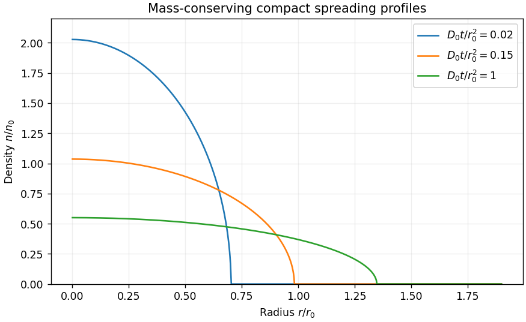

<h1 id="13a/solution">Solution</h1>

↑ **Parent:** [13A](../13a.md)

Put $\xi=r/(r_0\lambda)$ and $n=n_0\lambda^{-2}F(\xi)$. Direct [differentiation](../../../../../differentiation.md) gives

$$
n_t=-n_0\lambda^{-3}\dot\lambda(2F+\xi F'),\qquad
\frac{D_0}{r}\partial_r\!\left[r(n/n_0)^2n_r\right]
=\frac{D_0n_0}{r_0^2\lambda^8}\frac1\xi(\xi F^2F')'.
$$

Thus the [partial differential equation](../../../../../partial-differential-equation-split.md) reduces to an [ordinary differential equation](../../../../../ordinary-differential-equation.md) precisely when $\lambda^5\dot\lambda=CD_0/r_0^2$. The profile then satisfies $(\xi F^2F')'=-C(\xi^2F)'$. Regularity and zero radial [flux](../../../../../flux.md) at the origin make the integration constant zero. Wherever $F>0$, $FF'=-C\xi$, so $F^2=1-C\xi^2$ using $F(0)=1$. Requiring the front at $\xi=1$ selects $C=1$. Point release requires $\lambda(0)=0$, giving

$$
\boxed{\lambda(t)=\left(\frac{6D_0t}{r_0^2}\right)^{1/6},\qquad F(\xi)=\begin{cases}\sqrt{1-\xi^2},&0\leq\xi<1,\\0,&\xi\geq1.\end{cases}}
$$

Although $F'$ diverges at the front, $F^2F'$ tends to zero, so this compactly supported profile satisfies the equation in the [weak solution](../../../../../weak-solution.md) sense.

The [compact radial cubic-diffusion profile](../../../../../compact-radial-cubic-diffusion-profile.md) conserves the total population:

$$
Q=2\pi\int_0^\infty rn(r,t)\,dr
=2\pi n_0r_0^2\int_0^1\xi\sqrt{1-\xi^2}\,d\xi
=\frac{2\pi n_0r_0^2}{3}.
$$

Consequently **$\boxed{r_0=\sqrt{3Q/(2\pi n_0)}}$.** The front radius grows as $t^{1/6}$, while the central density decays as $t^{-1/3}$. The conserved mass concentrates at the origin as $t\downarrow0$.

**[Figure 2](#13a/image-compact-insect-density-profiles-spreading-outward-while-decreasing-in-height). Compact insect-density profiles spreading outward while decreasing in height**.

## ↑ Ancestors (10)

1. [13A](../13a.md)
2. [Paper 2](../../paper-2-split.md)
3. [Ii](../../split.md)
4. [2010](../../../split.md)
5. [Past exam of the mathematics course of the University of Cambridge](../../../../split.md)
6. [Mathematics course of the University of Cambridge](../../../../../mathematics-course-of-the-university-of-cambridge.md)
7. [Course of the University of Cambridge](../../../../../course-of-the-university-of-cambridge.md)
8. [University of Cambridge](../../../../../university-of-cambridge-split.md)
9. [List of universities](../../../../../list-of-universities.md)
10. [Codex Wiki](../../../../../split.md)
