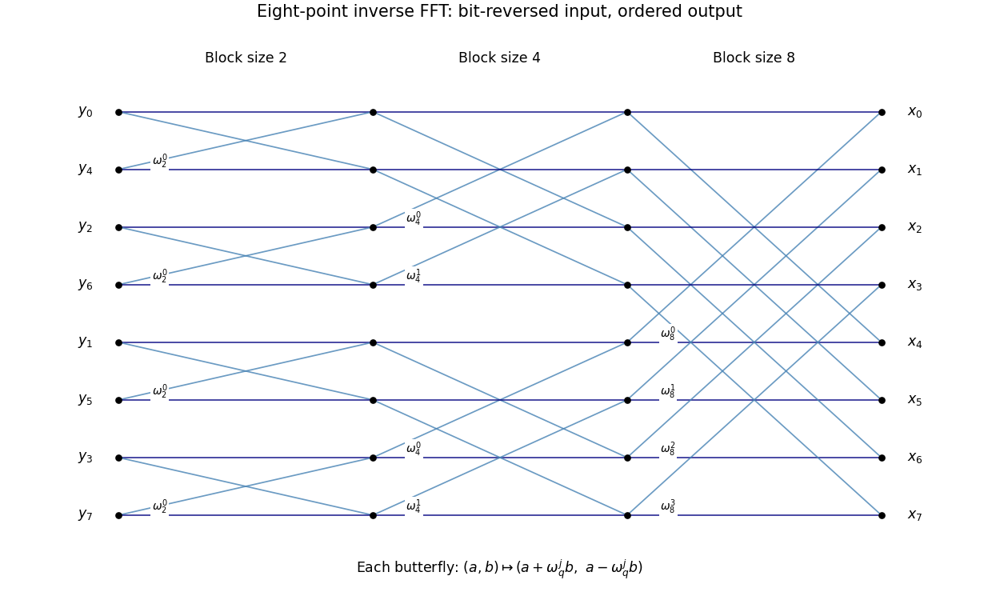

<h1 id="39a/2/solution">Solution</h1>

↑ **Parent:** [2](../2.md)

The radix-two [Fast Fourier transform](../../../../../../cooley-tukey-fft-algorithm.md) recursively splits the input into even and odd subsequences until length one, then assembles the transforms using the [FFT butterfly](../../../../../../fft-butterfly.md) identities. For $n=8$, the recursive leaf order is the bit-reversed order $y_0,y_4,y_2,y_6,y_1,y_5,y_3,y_7$. The three assembly stages have block sizes two, four and eight. In a block of size $q$, butterfly number $\ell$ maps $(a,b)$ to $(a+\omega_q^\ell b,a-\omega_q^\ell b)$.

**[Figure 3](#39a/2/image-eight-point-inverse-fft-with-bit-reversed-inputs-and-three-butterfly-stages). Eight-point inverse FFT with bit-reversed inputs and three butterfly stages**.

## ↑ Ancestors (11)

1. [2](../2.md)
2. [39A](../../39a.md)
3. [Paper 2](../../../paper-2-split.md)
4. [Ii](../../../split.md)
5. [2010](../../../../split.md)
6. [Past exam of the mathematics course of the University of Cambridge](../../../../../split.md)
7. [Mathematics course of the University of Cambridge](../../../../../../mathematics-course-of-the-university-of-cambridge.md)
8. [Course of the University of Cambridge](../../../../../../course-of-the-university-of-cambridge.md)
9. [University of Cambridge](../../../../../../university-of-cambridge-split.md)
10. [List of universities](../../../../../../list-of-universities.md)
11. [Codex Wiki](../../../../../../split.md)
