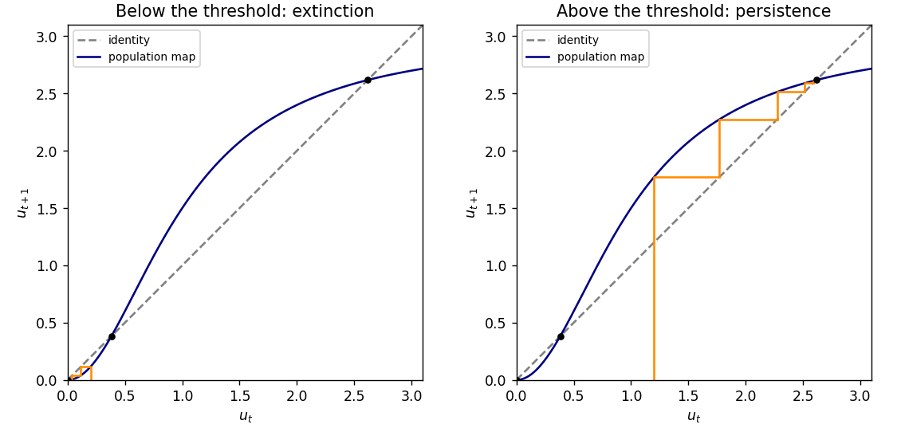

<h1 id="6a/solution">Solution</h1>

↑ **Parent:** [6A](../6a.md)

Write $f(u)=au^2/(b^2+u^2)$, with $b>0$. Besides zero, the [fixed points](../../../../../fixed-point.md) satisfy $u^2-au+b^2=0$. If $a^2>4b^2$, they are

$$
\boxed{u_\pm=\frac{a\pm\sqrt{a^2-4b^2}}2}.
$$

The [derivative](../../../../../derivative.md) is $f'(u)=2ab^2u/(b^2+u^2)^2$. At a positive [fixed point](../../../../../fixed-point.md), $b^2+u^2=au$, so $f'(u)=2b^2/(au)=2(1-u/a)$. Thus zero is attracting, $u_-$ is repelling because $f'(u_-)>1$, and $u_+$ is attracting because $0<f'(u_+)<1$.

Moreover,

$$
f(u)-u=-\frac{u(u-u_-)(u-u_+)}{b^2+u^2}.
$$

For $0<u_0<u_-$ the iterates strictly decrease and stay positive. Their limit is a [fixed point](../../../../../fixed-point.md) below $u_-$, hence zero. For $u_-<u_0<u_+$ the iterates increase towards $u_+$; for $u_0>u_+$ they decrease towards $u_+$. Monotonicity of $f$ prevents crossing the limiting [fixed point](../../../../../fixed-point.md). **$u_-$ is the extinction threshold.** The [cobweb plot](../../../../../cobweb-plot.md) illustrates these alternatives.

**[Figure 1](#6a/image-population-cobwebs-below-and-above-the-unstable-extinction-threshold). Population cobwebs below and above the unstable extinction threshold**.

For $a^2<4b^2$ there are no positive [fixed points](../../../../../fixed-point.md), and $f(u)<u$ for every $u>0$, so all populations tend to zero. At $a^2=4b^2$, the positive [fixed point](../../../../../fixed-point.md) $a/2$ is semistable: initial populations below it tend to zero, and those above it decrease towards it. This is a [saddle-node bifurcation](../../../../../saddle-node-bifurcation.md) in the discrete dynamics.

## ↑ Ancestors (10)

1. [6A](../6a.md)
2. [Paper 2](../../paper-2-split.md)
3. [Ii](../../split.md)
4. [2010](../../../split.md)
5. [Past exam of the mathematics course of the University of Cambridge](../../../../split.md)
6. [Mathematics course of the University of Cambridge](../../../../../mathematics-course-of-the-university-of-cambridge.md)
7. [Course of the University of Cambridge](../../../../../course-of-the-university-of-cambridge.md)
8. [University of Cambridge](../../../../../university-of-cambridge-split.md)
9. [List of universities](../../../../../list-of-universities.md)
10. [Codex Wiki](../../../../../split.md)
