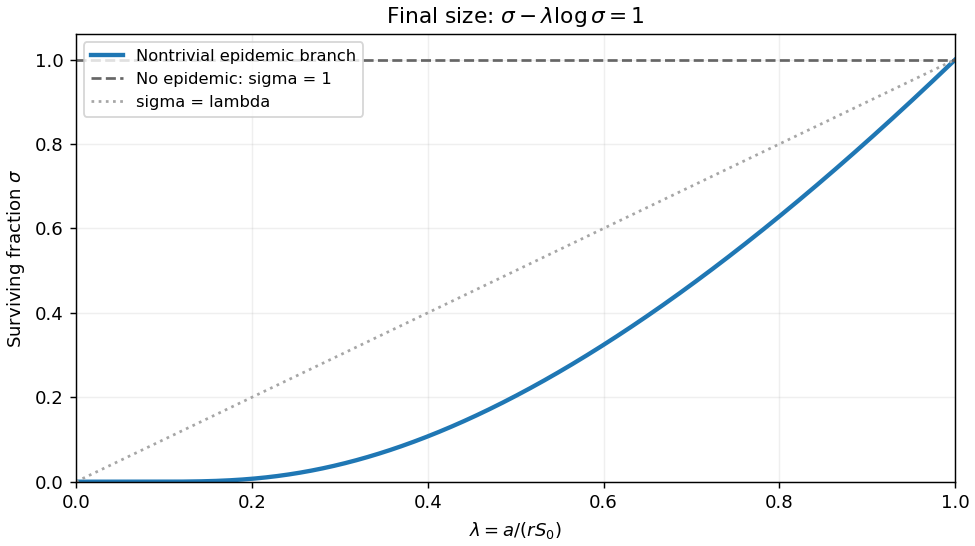

<h1 id="13a/solution">Solution</h1>

↑ **Parent:** [13A](../13a.md)

Introduce dimensionless quantities $\widetilde S=S/S_0$, $\widetilde I=I/S_0$, $\widetilde x=x\sqrt{rS_0/D}$ and $\widetilde t=rS_0t$. Substitution and cancellation of $rS_0^2$ give the stated [spatial SIR model](../../../../../spatial-sir-model.md) with

$$
\boxed{\lambda=\frac a{rS_0}.}
$$

Drop tildes. A [travelling wave](../../../../../travelling-wave.md) with $z=x-ct$ obeys

$$
\boxed{cS'=IS,\qquad I''+cI'+(S-\lambda)I=0.}
$$

At the leading edge $S=1,I=0$, the infective equation linearizes to $I''+cI'+(1-\lambda)I=0$. For an invading epidemic the susceptible level must exceed the removal threshold, $\lambda<1$. A nonoscillatory decaying tail has exponents

$$
r_\pm=\frac{-c\pm\sqrt{c^2-4(1-\lambda)}}2.
$$

If the discriminant is negative, a nonzero real tail oscillates in sign, violating nonnegative infective density. Thus for a right-moving wave

$$
\boxed{c\ge2\sqrt{1-\lambda},\qquad\lambda<1.}
$$

This is a necessary admissibility condition from the leading-edge calculation, not by itself a global existence proof.

To derive the [final size relation for an epidemic](../../../../../final-size-relation-for-an-epidemic.md), use $I=cS'/S$ and integrate the infective ODE across the wave. The tails have $I,I'\to0$, giving

$$
c(1-\sigma)=\lambda\int_{-\infty}^\infty I(z)\,dz,
\qquad \int I\,dz=c\log(1/\sigma).
$$

Therefore

$$
\boxed{\sigma-\lambda\log\sigma=1.}
$$

For a nontrivial epidemic $0<\sigma<1$. The function $s-\lambda\log s$ is strictly convex, minimized at $s=\lambda$. For $0<\lambda<1$ it has the trivial root $1$ and one further root $0<\sigma<\lambda$. For $\lambda\ge1$, it exceeds one for every $s<1$, so only the no-epidemic root remains; this also proves the necessity of $\lambda<1$. On the nontrivial branch,

$$
\frac{d\sigma}{d\lambda}=\frac{\log\sigma}{1-\lambda/\sigma}>0.
$$

It rises from $\sigma\sim e^{-1/\lambda}$ as $\lambda\downarrow0$ to $\sigma=1-2(1-\lambda)+O((1-\lambda)^2)$ as $\lambda\uparrow1$. The sketch distinguishes this branch from the always-present trivial root.

**[Figure 1](#13a/image-surviving-susceptible-fraction-on-the-nontrivial-epidemic-branch-and-the-no-epidemic-root). Surviving susceptible fraction on the nontrivial epidemic branch and the no-epidemic root**.

## ↑ Ancestors (10)

1. [13A](../13a.md)
2. [Paper 3](../../paper-3-split.md)
3. [Ii](../../split.md)
4. [2010](../../../split.md)
5. [Past exam of the mathematics course of the University of Cambridge](../../../../split.md)
6. [Mathematics course of the University of Cambridge](../../../../../mathematics-course-of-the-university-of-cambridge.md)
7. [Course of the University of Cambridge](../../../../../course-of-the-university-of-cambridge.md)
8. [University of Cambridge](../../../../../university-of-cambridge-split.md)
9. [List of universities](../../../../../list-of-universities.md)
10. [Codex Wiki](../../../../../split.md)
