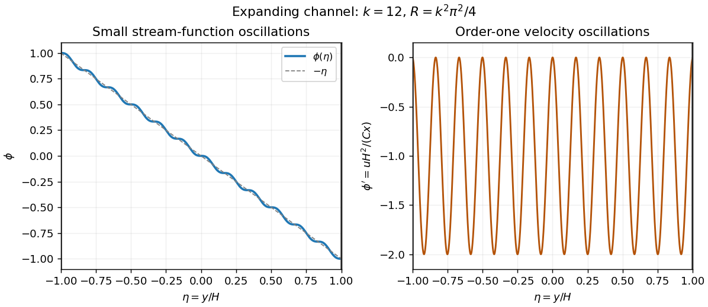

<h1 id="37a/solution">Solution</h1>

↑ **Parent:** [37A](../37a.md)

The proposed [stream function](../../../../../stream-function.md) gives $u=CxH^{-2}\phi'$ and $v=-CH^{-1}\phi$. Since $\eta=y/H$, $\partial_t\eta=-\eta H'/H$, the [vorticity equation](../../../../../vorticity-equation.md) terms are

$$
\begin{aligned}
\partial_t\omega&=CxH'H^{-4}(3\phi''+\eta\phi'''),\\
u\partial_x\omega&=-C^2xH^{-5}\phi'\phi'',\\
v\partial_y\omega&=C^2xH^{-5}\phi\phi''',\\
\nu\Delta\omega&=-\nu CxH^{-5}\phi''''.
\end{aligned}
$$

For $H=\sqrt{2Ct}$, $HH'=C$. Divide by $C^2x/H^5$ (or compare coefficients at $x=0$ by [continuity](../../../../../continuous-function.md)) to obtain

$$
\boxed{3\phi''+\eta\phi'''-\phi'\phi''+\phi\phi'''+R^{-1}\phi''''=0,
\qquad R=C/\nu.}
$$

The [planes](../../../../../plane.md) move normally with velocities $v(\pm H)=\pm H'=\pm C/H$ and have zero tangential velocity. [No-slip boundary conditions](../../../../../no-slip-boundary-condition.md) therefore require

$$
\boxed{\phi(1)=-1,\quad\phi(-1)=1,\quad\phi'(1)=\phi'(-1)=0.}
$$

These ensure both normal impermeability relative to the moving [planes](../../../../../plane.md) and tangential no slip.

Put $K=k\pi$, $s_k=(-1)^k$ and $\phi=s_k\sin(K\eta)/K-\eta$. Its [derivatives](../../../../../derivative.md) are $\phi'=s_k\cos(K\eta)-1$, $\phi''=-s_kK\sin(K\eta)$, $\phi'''=-s_kK^2\cos(K\eta)$ and $\phi''''=s_kK^3\sin(K\eta)$. The sine vanishes at both walls and $s_k\cos(K)=1$, verifying all four [boundary conditions](../../../../../boundary-condition.md). In the ODE, the sine-cosine products from $(\eta+\phi)\phi'''$ and $-\phi'\phi''$ cancel, leaving

$$
s_kK\sin(K\eta)(K^2/R-4).
$$

Thus **each displayed profile is an exact solution when $R=k^2\pi^2/4$**.

For large $k$, $\phi$ stays within $1/(k\pi)$ of $-\eta$, but the tangential velocity factor $\phi'$ continues to oscillate between $-2$ and $0$, and its shear grows like $k$. The sketch shows both effects; a nearly straight stream-function profile does not mean nearly uniform velocity. Such fine oscillatory branches occur at special discrete large [Reynolds numbers](../../../../../reynolds-number.md) and require specially prepared flow. Their many inflection points and strong shear permit instability, so generic disturbances are unlikely to preserve them. This is a physical plausibility discussion, not a proved stability classification.

**[Figure 2](#37a/image-large-k-expanding-channel-stream-function-profile-and-its-oscillatory-tangential-velocity-factor). Large-k expanding-channel stream-function profile and its oscillatory tangential-velocity factor**.

## ↑ Ancestors (10)

1. [37A](../37a.md)
2. [Paper 3](../../paper-3-split.md)
3. [Ii](../../split.md)
4. [2010](../../../split.md)
5. [Past exam of the mathematics course of the University of Cambridge](../../../../split.md)
6. [Mathematics course of the University of Cambridge](../../../../../mathematics-course-of-the-university-of-cambridge.md)
7. [Course of the University of Cambridge](../../../../../course-of-the-university-of-cambridge.md)
8. [University of Cambridge](../../../../../university-of-cambridge-split.md)
9. [List of universities](../../../../../list-of-universities.md)
10. [Codex Wiki](../../../../../split.md)
