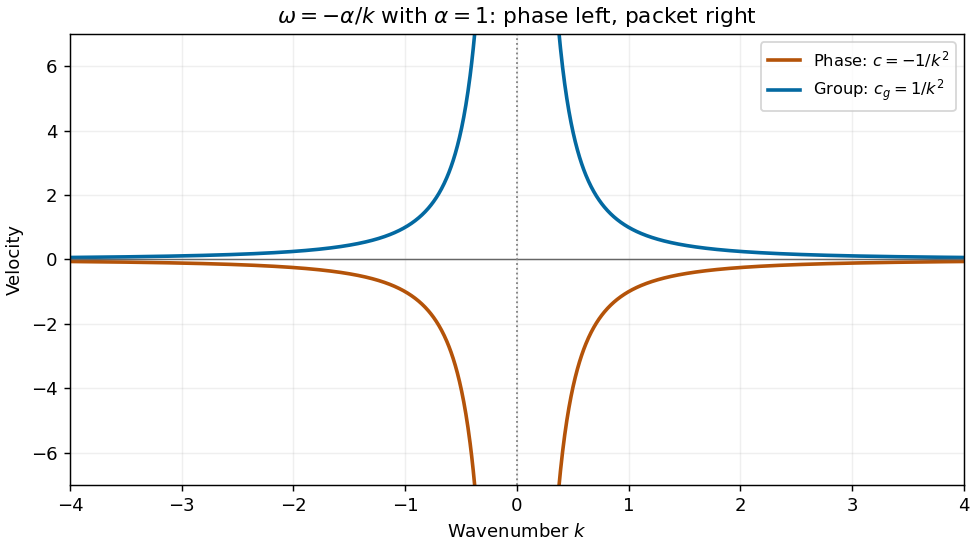

<h1 id="38a/solution">Solution</h1>

↑ **Parent:** [38A](../38a.md)

Substitute $\phi=e^{i(kx-\omega t)}$ into the mixed-derivative equation. Its left side is $k\omega\phi$, so for $k\ne0$ the [dispersion relation](../../../../../dispersion-relation.md), [phase velocity](../../../../../phase-velocity.md) and [group velocity](../../../../../group-velocity.md) are

$$
\boxed{\omega=-\frac\alpha k,\qquad c(k)=-\frac\alpha{k^2},\qquad
c_g(k)=\frac\alpha{k^2}.}
$$

The [graph of a function](../../../../../graph-of-a-function.md) for each velocity is symmetric about $k=0$, singular at zero, and approaches the horizontal axis as $|k|$ grows. Energy packets travel right while their crests travel left.

**[Figure 3](#38a/image-opposite-phase-and-group-velocities-for-omega-alpha-k-shown-with-alpha-1). Opposite phase and group velocities for omega=-alpha/k, shown with alpha=1**.

At a distant fixed observer $x>0$, stationary components obey $x/t=c_g(k)$, so $|k|=\sqrt{\alpha t/x}$. As time increases their [wavelength](../../../../../wavelength.md) $2\pi/|k|$ decreases and their [frequency](../../../../../frequency.md) magnitude $|\omega|=\sqrt{\alpha x/t}$ decreases; the crests pass toward decreasing $x$.

For the given initial spectrum the solution is

$$
\boxed{\phi(x,t)=\int_{\mathbb R}A(k)\exp\left[i\left(kx+\frac{\alpha t}k\right)\right]dk,\qquad
A(-k)=\overline{A(k)}\text{ for real }\phi.}
$$

The value of a regular spectrum at the single point $k=0$ is irrelevant to this [integral](../../../../../integral.md); a nonzero spatially constant mode is incompatible with the PDE. For asymptotic calculation assume the usual smooth localized spectrum, with sufficient integrability for the following stationary-phase steps.

At $x=Vt$, $V>0$, the phase $\Phi(k)=Vk+\alpha/k$ has stationary points $k=\pm k_0$, $k_0=\sqrt{\alpha/V}$. Their values are $\pm2\sqrt{\alpha V}$ and their second [derivatives](../../../../../derivative.md) are $\pm2\alpha/k_0^3$. Expanding quadratically and using the oscillatory [Gaussian integral](../../../../../gaussian-integral.md) gives the [stationary phase](../../../../../stationary-phase-method.md) leading term

$$
\boxed{\phi(Vt,t)\sim\sqrt{\frac{\pi k_0^3}{\alpha t}}
\left[A(k_0)e^{i(2\sqrt{\alpha V}t+\pi/4)}
+A(-k_0)e^{-i(2\sqrt{\alpha V}t+\pi/4)}\right].}
$$

For real data this is twice the real part of the positive-frequency term. If a stationary coefficient vanishes, the formula instead asserts that its contribution has smaller order. At $x=-Vt$, the phase [derivative](../../../../../derivative.md) is $-V-\alpha/k^2<0$, so there is no real stationary point and no corresponding $t^{-1/2}$ [wave packet](../../../../../wave-packet.md). For smooth compactly supported spectra away from zero, repeated integration by parts gives decay faster than any power of $t$. More general spectra require endpoint/tail control; absence of stationary points alone does not justify that stronger rate for arbitrary $A$.

## ↑ Ancestors (10)

1. [38A](../38a.md)
2. [Paper 3](../../paper-3-split.md)
3. [Ii](../../split.md)
4. [2010](../../../split.md)
5. [Past exam of the mathematics course of the University of Cambridge](../../../../split.md)
6. [Mathematics course of the University of Cambridge](../../../../../mathematics-course-of-the-university-of-cambridge.md)
7. [Course of the University of Cambridge](../../../../../course-of-the-university-of-cambridge.md)
8. [University of Cambridge](../../../../../university-of-cambridge-split.md)
9. [List of universities](../../../../../list-of-universities.md)
10. [Codex Wiki](../../../../../split.md)
