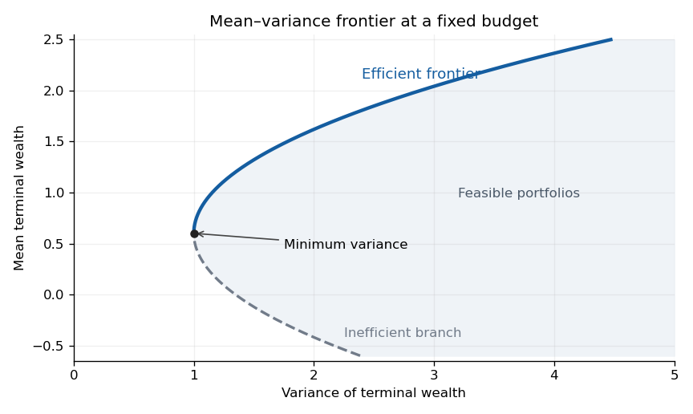

# Paper 4

↑ **Parent:** [Ii](../ii.md)

[https://www.maths.cam.ac.uk/undergrad/pastpapers/files/2010/PaperII_4.pdf](https://www.maths.cam.ac.uk/undergrad/pastpapers/files/2010/PaperII_4.pdf)

**Table of contents**

- [1G](#1g)
  - [Solution](#1g/solution)
- [2F](#2f)
  - [Solution](#2f/solution)
- [3F](#3f)
  - [Solution](#3f/solution)
- [4H](#4h)
  - [Solution](#4h/solution)
- [5J](#5j)
  - [Solution](#5j/solution)
- [6A](#6a)
  - [Solution](#6a/solution)
- [7D](#7d)
  - [Solution](#7d/solution)
- [8E](#8e)
  - [Solution](#8e/solution)
- [9D](#9d)
  - [Solution](#9d/solution)
- [10D](#10d)
  - [Solution](#10d/solution)
- [11G](#11g)
  - [Solution](#11g/solution)
- [12F](#12f)
  - [Solution](#12f/solution)
- [13J](#13j)
  - [Solution](#13j/solution)
- [14D](#14d)
  - [Solution](#14d/solution)
- [15D](#15d)
  - [Solution](#15d/solution)
- [16G](#16g)
  - [Solution](#16g/solution)
- [17F](#17f)
  - [Solution](#17f/solution)
- [18H](#18h)
  - [i](#18h/i)
    - [Solution](#18h/i/solution)
  - [ii](#18h/ii)
    - [Solution](#18h/ii/solution)
- [19F](#19f)
  - [Solution](#19f/solution)
- [20G](#20g)
  - [Solution](#20g/solution)
- [21H](#21h)
  - [Solution](#21h/solution)
- [22H](#22h)
  - [Solution](#22h/solution)
- [23G](#23g)
  - [i](#23g/i)
    - [Solution](#23g/i/solution)
  - [ii](#23g/ii)
    - [Solution](#23g/ii/solution)
  - [iii](#23g/iii)
    - [Solution](#23g/iii/solution)
  - [iv](#23g/iv)
    - [Solution](#23g/iv/solution)
- [24H](#24h)
  - [i](#24h/i)
    - [Solution](#24h/i/solution)
  - [ii](#24h/ii)
    - [Solution](#24h/ii/solution)
  - [iii](#24h/iii)
    - [Solution](#24h/iii/solution)
- [25I](#25i)
  - [Solution](#25i/solution)
- [26I](#26i)
  - [a](#26i/a)
    - [Solution](#26i/a/solution)
    - [i](#26i/a/i)
      - [Solution](#26i/a/i/solution)
    - [ii](#26i/a/ii)
      - [Solution](#26i/a/ii/solution)
    - [iii](#26i/a/iii)
      - [Solution](#26i/a/iii/solution)
    - [iv](#26i/a/iv)
      - [Solution](#26i/a/iv/solution)
  - [b](#26i/b)
    - [Solution](#26i/b/solution)
  - [c](#26i/c)
    - [Solution](#26i/c/solution)
- [27J](#27j)
  - [Solution](#27j/solution)
- [28J](#28j)
  - [i](#28j/i)
    - [Solution](#28j/i/solution)
  - [ii](#28j/ii)
    - [Solution](#28j/ii/solution)
  - [iii](#28j/iii)
    - [Solution](#28j/iii/solution)
- [29I](#29i)
  - [Solution](#29i/solution)
- [30E](#30e)
  - [Solution](#30e/solution)
- [31C](#31c)
  - [a](#31c/a)
    - [Solution](#31c/a/solution)
  - [b](#31c/b)
    - [Solution](#31c/b/solution)
  - [c](#31c/c)
    - [Solution](#31c/c/solution)
- [32C](#32c)
  - [Solution](#32c/solution)
- [33B](#33b)
  - [Solution](#33b/solution)
- [34C](#34c)
  - [i](#34c/i)
    - [Solution](#34c/i/solution)
  - [ii](#34c/ii)
    - [Solution](#34c/ii/solution)
  - [iii](#34c/iii)
    - [Solution](#34c/iii/solution)
  - [iv](#34c/iv)
    - [Solution](#34c/iv/solution)
- [35B](#35b)
  - [Solution](#35b/solution)
- [36B](#36b)
  - [Solution](#36b/solution)
- [37A](#37a)
  - [Solution](#37a/solution)
  - [i](#37a/i)
    - [Solution](#37a/i/solution)
  - [ii](#37a/ii)
    - [Solution](#37a/ii/solution)
  - [iii](#37a/iii)
    - [Solution](#37a/iii/solution)
- [38A](#38a)
  - [Solution](#38a/solution)
- [39A](#39a)
  - [a](#39a/a)
    - [Solution](#39a/a/solution)
  - [b](#39a/b)
    - [Solution](#39a/b/solution)
  - [c](#39a/c)
    - [Solution](#39a/c/solution)

## 1G

↑ **Parent:** [Paper 4](paper-4.md)

<h3 id="1g/solution">Solution</h3>

↑ **Parent:** [1G](#1g)

Since $a=kp\ge2$, we have $a^p\equiv1\pmod{a^p-1}$ and $\gcd(a,a^p-1)=1$. Its [multiplicative order](../../../number-theory.md#multiplicative-order) therefore divides the [prime number](../../../number-theory.md#prime-number) $p$. It cannot be one, because $0<a-1<a^p-1$. Thus **the order is exactly $p$**.

To find the desired prime divisor, use the [cyclotomic polynomial](../../../galois-theory.md#cyclotomic-polynomial)

$$
\Phi_p(a)=1+a+\cdots+a^{p-1}>1.
$$

Choose a [prime factor](../../../number-theory.md#prime-factor) $q$ of this integer. Since $p\mid a$, we have $\Phi_p(a)\equiv1\pmod p$, so $q\ne p$. Also $q\nmid a$. If $a\equiv1\pmod q$, then $\Phi_p(a)\equiv p\pmod q$, contradicting $q\ne p$. Consequently $a$ has [multiplicative order](../../../number-theory.md#multiplicative-order) $p$ in the [multiplicative group of a finite field](../../../algebra.md#multiplicative-group-of-a-finite-field) $\mathbb F_q^\times$. [Lagrange theorem](../../../group-theory.md#lagrange-s-theorem) gives

$$
\boxed{p\mid q-1.}
$$

This $q$ divides $a^p-1$ as required. Notice that order $p$ modulo a composite integer alone would not justify selecting an arbitrary prime divisor; the [cyclotomic polynomial](../../../galois-theory.md#cyclotomic-polynomial) selects a suitable one.

If there were only finitely many such primes $q_1,\ldots,q_r$, choose $k=q_1\cdots q_r$, with the empty product interpreted as one. Each $q_i$ divides $a=kp$ and hence does not divide $a^p-1$. The preceding argument supplies a further prime $q\equiv1\pmod p$ dividing that integer, a contradiction. **There are infinitely many primes in this residue class.**

## 2F

↑ **Parent:** [Paper 4](paper-4.md)

<h3 id="2f/solution">Solution</h3>

↑ **Parent:** [2F](#2f)

The fourth [Chebyshev polynomial](../../../numerical-analysis.md#chebyshev-polynomial) is $T_4(x)=8x^4-8x^2+1$. Therefore take

$$
\boxed{p(x)=x^2-\frac18,\qquad \|x^4-p(x)\|_\infty=\frac18.}
$$

Indeed $x^4-p(x)=T_4(x)/8$, and $|T_4(x)|\le1$ on $[-1,1]$, as follows from $T_4(\cos\theta)=\cos4\theta$.

Here is a direct [Chebyshev alternation theorem](../../../uniform-approximation.md#equioscillation-theorem) argument proving optimality, without assuming the theorem. At the five ordered points

$$
-1,\quad-1/\sqrt2,\quad0,\quad1/\sqrt2,\quad1,
$$

the error $x^4-p(x)$ takes the alternating values $1/8,-1/8,1/8,-1/8,1/8$. If a [polynomial](../../../polynomial.md) $q$ of degree at most three had strictly smaller uniform error, then $q-p$ would have alternating strictly positive and strictly negative values at these points. The [intermediate value theorem](../../../calculus.md#intermediate-value-theorem) would give a distinct root in each of the four intervening intervals. A nonzero [polynomial](../../../polynomial.md) of degree at most three cannot have four distinct roots. This contradiction proves the required minimax inequality.

## 3F

↑ **Parent:** [Paper 4](paper-4.md)

<h3 id="3f/solution">Solution</h3>

↑ **Parent:** [3F](#3f)

There are two conventions for [loxodromic Möbius transformations](../../../group-theory.md#loxodromic-mobius-transformation). In the inclusive convention, a transformation conjugate to $z\mapsto\lambda z$ with $|\lambda|\ne1$ is loxodromic, including a [hyperbolic Möbius transformation](../../../geometry-and-topology.md#hyperbolic-element-of-psl2-r) with $\lambda>0$. Under that convention the assertion about discs is false: $z\mapsto2z$ preserves the upper half-plane, and a Cayley conjugation gives an invariant ordinary disc.

The question uses the classification in which [hyperbolic Möbius transformations](../../../geometry-and-topology.md#hyperbolic-element-of-psl2-r) and genuinely spiralling [loxodromic Möbius transformations](../../../group-theory.md#loxodromic-mobius-transformation) are separate. Thus here the multiplier satisfies $|\lambda|\ne1$ and $\lambda\notin(0,\infty)$. Such a [Möbius transformation](../../../group-theory.md#mobius-transformation) has two distinct fixed points; after sending them to zero and infinity it acts by the stated dilation and rotation.

For a determinant-one representative, put $\tau=a+d$. Its [eigenvalues](../../../linear-operator-theory.md#eigenvalue) are $\eta,\eta^{-1}$, with $\eta+\eta^{-1}=\tau$, and the normalized multiplier is $\eta^2$ or its reciprocal. If $\tau$ is real, the [eigenvalues](../../../linear-operator-theory.md#eigenvalue) are either real or conjugate unit-modulus numbers. These give the hyperbolic, elliptic, parabolic or identity cases, not a genuine spiral. Conversely, a real [eigenvalue](../../../linear-operator-theory.md#eigenvalue) or a unit-modulus [eigenvalue](../../../linear-operator-theory.md#eigenvalue) makes $\tau$ real. Hence the practical criterion in the question's convention is

$$
\boxed{\operatorname{Im}(a+d)\ne0.}
$$

Changing the determinant-one representative by its sign does not affect this criterion.

Finally, conjugate an invariant disc to the upper half-plane. A [Möbius transformation](../../../group-theory.md#mobius-transformation) preserving that half-plane has a representative in $SL_2(\mathbb R)$: preservation of the boundary gives real coefficients up to a common scalar, and preservation of the chosen side makes the real [determinant](../../../linear-algebra.md#determinant) positive, allowing normalization to one. Its [trace](../../../linear-algebra.md#matrix-trace) is real. [Trace](../../../linear-algebra.md#matrix-trace) is invariant under conjugacy, up to the harmless sign of the representative, so **a disc-preserving transformation cannot be genuinely loxodromic**. This proves the intended assertion while specifying its necessary terminology.

## 4H

↑ **Parent:** [Paper 4](paper-4.md)

<h3 id="4h/solution">Solution</h3>

↑ **Parent:** [4H](#4h)

In a specified finite [cyclic group](../../../group.md#cyclic-group) $G=\langle g\rangle$, the [discrete logarithm problem](../../../coding-theory.md#discrete-logarithm-problem) is to recover $a$ modulo $|G|$ from $g$ and $g^a$. A common choice is a large prime-order subgroup of a [multiplicative group of a finite field](../../../algebra.md#multiplicative-group-of-a-finite-field).

For [Diffie-Hellman key exchange](../../../coding-theory.md#diffie-hellman-key-exchange), Alice and Bob independently choose private exponents $a,b$, transmit $g^a,g^b$, and compute respectively $(g^b)^a$ and $(g^a)^b$. Both obtain

$$
\boxed{K=g^{ab}.}
$$

Solving a [discrete logarithm problem](../../../coding-theory.md#discrete-logarithm-problem) reveals a private exponent and breaks this exchange. The converse implication is not known in general: recovering $g^{ab}$ from $g^a,g^b$ is the computational Diffie–Hellman problem, rather than literally the same task as computing a logarithm.

The advantage is that parties without an already shared secret can establish a fresh session key, which can then be used with efficient symmetric encryption. A classical secret-key system requires an earlier secure key distribution; ordinary public-key encryption can instead transmit a chosen key, but ephemeral [Diffie-Hellman key exchange](../../../coding-theory.md#diffie-hellman-key-exchange) also permits forward secrecy when private session exponents are erased and the exchange is authenticated. Authentication is essential: an unauthenticated exchange is vulnerable to a man-in-the-middle attack.

For [multilateral Diffie-Hellman key exchange](../../../coding-theory.md#multilateral-diffie-hellman-key-exchange) with $n$ participants with private exponents $a_1,\ldots,a_n$, send $n$ tokens clockwise around a ring. Participant $j$ starts the token $g^{a_j}$ and sends it to participant $j+1$. On each subsequent receipt, the receiver raises the token to their own private exponent and sends it onwards, until that token has made $n-1$ transmissions and reaches participant $j-1$. Its exponent then contains every exponent except $a_{j-1}$. The receiver raises it to $a_{j-1}$ locally, obtaining

$$
\boxed{K=g^{a_1a_2\cdots a_n}.}
$$

Every participant receives one such final token. There are $n$ tokens with exactly $n-1$ transmitted group elements per token, giving **$n(n-1)$ transmissions**. No private exponent is transmitted.

## 5J

↑ **Parent:** [Paper 4](paper-4.md)

<h3 id="5j/solution">Solution</h3>

↑ **Parent:** [5J](#5j)

Write $Y_i=\log(\mathrm{price}_i)$ and fit the [normal linear model](../../../statistical-modelling.md#normal-linear-model)

$$
Y_i=\beta_0+\beta_1\mathrm{mpg}_i+\beta_2\mathrm{psngr}_i+
\beta_3\mathrm{length}_i+\beta_4\mathrm{width}_i+
\beta_5\mathrm{weight}_i+\varepsilon_i.
$$

The basic [linear regression](../../../linear-regression.md) analysis assumes centered independent [normal random variables](../../../probability-theory.md#gaussian-random-variable) $\varepsilon_i$ of a common [variance](../../../variance.md) $\sigma^2$, conditional on the predictors. Independence between makes does not by itself establish independence between different models of the same make; that stronger assumption should be checked, or within-make dependence modelled. The requested R fit is

```
fit <- lm(log(price) ~ mpg + psngr + length + width + weight, data = cars)
```

The estimate column contains the [ordinary least squares](../../../statistical-modelling.md#ordinary-least-squares) coefficients. The standard error estimates the [standard deviation](../../../variance.md#standard-deviation) of each coefficient estimator. The t value is its estimate divided by its standard error. The last column gives the two-sided [p-value](../../../statistical-modelling.md#p-value) for a zero coefficient, using a [Student t-distribution](../../../continuous-probability-distribution.md#student-s-t-distribution) with $93-6=87$ residual degrees of freedom under the stated [normal linear model](../../../statistical-modelling.md#normal-linear-model); the stars summarize significance thresholds.

Conditional on the other predictors, passenger capacity and width have negative fitted coefficients, while length and weight have positive ones. All four are significant at the conventional 5% level; length is borderline. There is little evidence for an additional mpg effect once the others are included. These are conditional associations, not causal claims. For example, increasing weight by 100 pounds multiplies the fitted price by approximately $\exp(0.08373)$, about 1.087.

A reasonable candidate simplification removes mpg and compares the nested models by an [F-test](../../../probability-and-statistics.md#f-test), rather than treating a nonsignificant coefficient as proof of no effect:

```
fit2 <- update(fit, . ~ . - mpg)
anova(fit2, fit)
```

Inspect [regression residuals](../../../probability-and-statistics.md#regression-residual), normal quantiles, residual-versus-fitted plots, leverage and influential observations. The correlated size predictors may produce [multicollinearity](../../../statistical-modelling.md#multicollinearity); missing make effects, nonlinear terms or unequal residual variances may also matter. A random make effect or a covariance adjustment addresses the possible dependence noted above.

## 6A

↑ **Parent:** [Paper 4](paper-4.md)

<h3 id="6a/solution">Solution</h3>

↑ **Parent:** [6A](#6a)

Put $u=\varepsilon v+O(\varepsilon^2)$. The [linearization](../../../algebra.md#linearization) at the zero solution is

$$
v_t=Dv_{xx}+f'(0)v,\qquad v(0,t)=v(L,t)=0.
$$

The appropriate [Fourier sine series](../../../fourier-series.md#fourier-sine-series) is

$$
v(x,t)=\sum_{n\ge1}a_n(t)\sin(n\pi x/L),\qquad
a_n(0)=\frac2L\int_0^Lu_0(x)\sin(n\pi x/L)\,dx.
$$

[Orthogonality](../../../linear-algebra.md#orthogonal-vectors) of the modes gives

$$
a_n'(t)=\left(f'(0)-D(n\pi/L)^2\right)a_n(t).
$$

Thus each mode grows or decays exponentially with its own [eigenvalue](../../../linear-operator-theory.md#eigenvalue), and the largest growth rate is the $n=1$ value. Strict [linear stability analysis](../../../dynamical-systems.md#linear-stability), meaning decay of every mode, is equivalent to

$$
\boxed{L<\pi\sqrt{\frac D{f'(0)}}.}
$$

At equality the first mode is neutral in the [linearization](../../../algebra.md#linearization); the nonlinear terms decide its subsequent behavior. Above this length the first mode grows, giving linear instability.

## 7D

↑ **Parent:** [Paper 4](paper-4.md)

<h3 id="7d/solution">Solution</h3>

↑ **Parent:** [7D](#7d)

A useful version of the [Poincaré-Bendixson theorem](../../../dynamical-systems.md#poincare-bendixson-theorem) says that a forward orbit of a continuously differentiable planar autonomous vector field which stays in a compact set has a nonempty compact omega-limit set; if that omega-limit set contains no equilibrium, it is a [periodic orbit](../../../dynamical-systems.md#periodic-orbit).

Let $r^2=x^2+y^2$. Direct calculation gives

$$
r\dot r=\frac14x^2(1-2r^2)+\frac12y^2(1-r^2),\qquad
\dot\theta=-1+\frac{xy}{4r^2}.
$$

For $r>0$, $|xy|\le r^2/2$, so $-9/8\le\dot\theta\le-7/8$. In particular **there is no equilibrium away from the origin**.

On $r=1/2$, both coefficients in the radial expression are strictly positive, so the flow crosses outward. On $r=2$, both are strictly negative, so the flow crosses inward. Consequently the compact annulus

$$
\boxed{D=\{(x,y):1/4\le x^2+y^2\le4\}}
$$

is forward invariant. Any orbit starting there stays there, and its omega-limit set avoids the only equilibrium, the origin. The [Poincaré-Bendixson theorem](../../../dynamical-systems.md#poincare-bendixson-theorem) therefore supplies **at least one [periodic orbit](../../../dynamical-systems.md#periodic-orbit) in this annulus**.

## 8E

↑ **Parent:** [Paper 4](paper-4.md)

<h3 id="8e/solution">Solution</h3>

↑ **Parent:** [8E](#8e)

Choose $z=e^{it}$ on the right semicircle, with the continuous branch $\log z=it$. Then

$$
I=\frac1i\int_{-i}^{i}\frac{z^u}{z+iA}\,dz.
$$

Here the integral is along that semicircle. Since $|A|>1$, the pole lies outside the unit disc and the [geometric series](../../../real-analysis.md#geometric-series) converges uniformly on the contour.

Put

$$
H_u(w)={}_2F_1(1,u+1;u+2;w).
$$

The [Euler integral for the hypergeometric function](../../../complex-analysis.md#euler-integral-for-the-hypergeometric-function), initially for $\operatorname{Re}u>-1$, gives

$$
H_u(w)=(u+1)\int_0^1\frac{s^u}{1-ws}\,ds
=(u+1)\sum_{n\ge0}\frac{w^n}{u+n+1},\qquad |w|<1.
$$

The prefactor follows from $\Gamma(u+2)/\Gamma(u+1)=u+1$. Hence an antiderivative of the contour integrand before multiplication by $1/i$ is

$$
\frac{z^{u+1}}{iA(u+1)}H_u\!\left(-\frac z{iA}\right).
$$

Evaluating at the endpoints with the chosen branch yields

$$
\boxed{I(u,A)=
-\frac{i}{A(u+1)}
\left[
e^{i\pi u/2}{}_2F_1(1,u+1;u+2;-1/A)
+e^{-i\pi u/2}{}_2F_1(1,u+1;u+2;1/A)
\right].}
$$

This is first obtained where the individual expressions are defined. The original finite-interval integral is entire in $u$, so [analytic continuation](../../../complex-analysis.md#analytic-continuation) gives the result elsewhere, taking removable limits at the apparent exceptional negative integers. That convention matters: the two separate hypergeometric terms may be singular even though their combination is finite.

## 9D

↑ **Parent:** [Paper 4](paper-4.md)

<h3 id="9d/solution">Solution</h3>

↑ **Parent:** [9D](#9d)

For an autonomous [Lagrangian](../../../calculus-of-variations.md#lagrangian), the [canonical momentum](../../../classical-mechanics.md#canonical-momentum) and [energy](../../../classical-mechanics.md#energy) are

$$
p=L_{\dot q},\qquad E=p\dot q-L.
$$

Along a solution of the [Euler-Lagrange equation](../../../analysis.md#euler-lagrange-equation),

$$
\frac{dE}{dt}
=(\dot p-L_q)\dot q-L_t=0.
$$

The absence of explicit time dependence is essential to this conservation law.

The classical [action](../../../classical-mechanics.md#action) is $S_c(q_I,q_F,T)=\int_0^TL(q_c,\dot q_c)\,dt$. If the final endpoint is moved along one fixed classical trajectory, while the initial endpoint is held fixed, the [fundamental theorem of calculus](../../../calculus.md#fundamental-theorem-of-calculus) gives

$$
\frac{dS_c}{dT}=L(q_c(T),\dot q_c(T)).
$$

This total derivative is different from the partial derivative with fixed final position.

For a family of nearby classical trajectories, integration by parts gives the endpoint variation

$$
\delta S_c=\int_0^T(L_q-\dot p)\delta q\,dt+
p_F\delta q_F-p_I\delta q_I+(L_F-p_F\dot q_F)\delta T.
$$

To obtain the final term, the endpoint change in the variation at fixed parameter time is $\delta q(T)=\delta q_F-\dot q_F\delta T$, while the changing upper integration limit contributes $L_F\delta T$. The interior integral vanishes by the [Euler-Lagrange equation](../../../analysis.md#euler-lagrange-equation). Therefore, on any smooth branch of classical boundary-value solutions,

$$
\boxed{\frac{\partial S_c}{\partial q_F}=p_F,\qquad
\frac{\partial S_c}{\partial q_I}=-p_I,\qquad
\frac{\partial S_c}{\partial T}=-E.}
$$

The chain rule along the endpoint trajectory now reads $dS_c/dT=p_F\dot q_F-E=L_F$, consistently with the direct calculation.

## 10D

↑ **Parent:** [Paper 4](paper-4.md)

<h3 id="10d/solution">Solution</h3>

↑ **Parent:** [10D](#10d)

The [Jeans wavenumber](../../../linear-cosmological-density-perturbation.md#jeans-wavenumber) in physical coordinates is $k_J=\sqrt{4\pi G\rho}/c_s$. With wavelength defined as $2\pi/k$, the [Jeans length](../../../linear-cosmological-density-perturbation.md#jeans-length) is

$$
\boxed{\lambda_J=\frac{2\pi}{k_J}
=c_s\sqrt{\frac{\pi}{G\rho}}.}
$$

Pressure opposes gravitational growth on physical wavelengths shorter than this; on longer wavelengths the gravitational term wins. Expansion also provides the damping term $2H\dot\delta$, so the actual growth is not generally the exponential growth of a static medium.

For the pressure-free, spatially flat matter solution, $H=2/(3t)$ and the [Friedmann equation](../../../cosmology.md#friedmann-equations) gives $\rho=1/(6\pi Gt^2)$. The perturbation equation becomes

$$
\ddot\delta_k+\frac4{3t}\dot\delta_k-\frac2{3t^2}\delta_k=0.
$$

Substituting $\delta_k=t^\nu$ gives $3\nu^2+\nu-2=(3\nu-2)(\nu+1)=0$. Thus

$$
\boxed{\delta_k(t)=A_k t^{2/3}+B_k t^{-1}.}
$$

The growing mode scales as $a(t)$ and permits the formation of structure; the decaying mode becomes negligible at late times. This is a linear result, valid while the density contrast remains small.

## 11G

↑ **Parent:** [Paper 4](paper-4.md)

<h3 id="11g/solution">Solution</h3>

↑ **Parent:** [11G](#11g)

Write $Q(x,y)=ax^2+bxy+cy^2$ and associate the symmetric matrix $M=\begin{pmatrix}a&b/2\\b/2&c\end{pmatrix}$. Define the left [group action](../../../group-theory.md#group-action) of $SL_2(\mathbb Z)$ by $(g\cdot Q)(v)=Q(g^{-1}v)$; using $Q(gv)$ instead describes the same equivalence classes. The transformed matrix is $g^{-T}Mg^{-1}$, so its [determinant](../../../linear-algebra.md#determinant) is unchanged. Hence the [discriminant of a binary quadratic form](../../../number-theory.md#discriminant-of-a-binary-quadratic-form)

$$
D=b^2-4ac=-4\det M
$$

is invariant under [proper equivalence of binary quadratic forms](../../../number-theory.md#proper-equivalence-of-binary-quadratic-forms).

A proper representation here means $Q(x,y)=n$ with $\gcd(x,y)=1$. Such a vector extends to the first column of an integer determinant-one matrix by [Bezout identity](../../../algebra.md#bezout-identity). After that change of variables the form has leading coefficient $n$, and [discriminant](../../../polynomial.md#discriminant) $-35$, so its middle coefficient $b'$ satisfies $(b')^2\equiv-35\pmod{4n}$. Conversely, such a congruence gives the positive definite integral form

$$
[n,b',((b')^2+35)/(4n)],
$$

which represents $n$ at $(1,0)$. It is primitive: a common divisor of all three coefficients would have its square dividing the squarefree [discriminant](../../../polynomial.md#discriminant) 35.

For clarity, enumerate all the proper equivalence classes at this [discriminant](../../../polynomial.md#discriminant). Substitutions $(x,y)\mapsto(x+my,y)$ first arrange $|b|\le a$; if $c<a$, the determinant-one substitution $(x,y)\mapsto(-y,x)$ makes the leading coefficient smaller. Repeating terminates because this coefficient is a positive integer. Thus every class has a reduced representative with $|b|\le a\le c$. From $4ac-b^2=35$ it follows that $3a^2\le35$, giving $a\le3$. Checking $a=1,2,3$, with $b$ odd, yields

$$
[1,\pm1,9]\quad\hbox{or}\quad[3,\pm1,3].
$$

The two signs in the first pair are equivalent by replacing $x$ with $x-y$, and in the second pair by the determinant-one swap. Thus the two forms in the question exhaust the classes.

The [primitive representation criterion at discriminant minus thirty-five](../../../number-theory.md#primitive-representation-criterion-at-discriminant-minus-thirty-five) now follows. For odd $n$ prime to 35, the congruence modulo $4n$ is solvable exactly when $-35$ is a square modulo every prime divisor of $n$. Necessity is immediate. For sufficiency, a nonzero root modulo each odd prime $q\mid n$ lifts to all required prime powers because its derivative $2b'$ is invertible; combine the lifts by the [Chinese remainder theorem](../../../mathematics.md#chinese-remainder-theorem), also imposing $b'\equiv1\pmod2$. This gives the modulus-four condition since $-35\equiv1\pmod4$. We conclude

$$
\boxed{n\text{ is properly represented by one of the two forms}
\iff \left(\frac{-35}{q}\right)=1\quad\text{for every prime }q\mid n.}
$$

By [quadratic reciprocity](../../../number-theory.md#quadratic-reciprocity), the symbol equals $(q/5)(q/7)$. In particular each prime divisor must be a quadratic residue at both 5 and 7, or a nonresidue at both. The condition is on each prime divisor, not merely on the product [Jacobi symbol](../../../number-theory.md#jacobi-symbol) of $n$.

## 12F

↑ **Parent:** [Paper 4](paper-4.md)

<h3 id="12f/solution">Solution</h3>

↑ **Parent:** [12F](#12f)

The [Poincare ball model](../../../geometry-and-topology.md#poincare-ball-model) has ideal boundary the [Riemann sphere](../../../complex-analysis.md#riemann-sphere). To construct the [hyperbolic extension of a Möbius transformation](../../../geometry-and-topology.md#hyperbolic-extension-of-a-mobius-transformation), conjugate the ball to the upper half-space model with coordinates $(z,t)\in\mathbb C\times(0,\infty)$ and metric $(|dz|^2+dt^2)/t^2$. The generators of the [Möbius group](../../../group-theory.md#mobius-group) extend as

$$
z\mapsto z+b:\ (z,t)\mapsto(z+b,t),\qquad
z\mapsto\lambda z:\ (z,t)\mapsto(\lambda z,|\lambda|t),
$$

and

$$
z\mapsto-1/z:\ (z,t)\mapsto
\frac{(-\overline z,t)}{|z|^2+t^2}.
$$

Translations and similarities plainly preserve the metric; Euclidean inversion rescales both the squared Euclidean line element and $t^2$ by the same factor, proving the last case. Composition gives the unique orientation-preserving hyperbolic extension. Equivalently, for a determinant-one matrix its upper half-space formula is

$$
z'=\frac{(az+b)\overline{(cz+d)}+a\overline c\,t^2}
{|cz+d|^2+|c|^2t^2},\qquad
t'=\frac{t}{|cz+d|^2+|c|^2t^2}.
$$

An [isometry](../../../riemannian-geometry.md#isometry) fixing the ball origin acts on its tangent space by an orientation-preserving orthogonal transformation; radial [geodesics](../../../riemannian-geometry.md#geodesic) then show that the whole map is that ordinary rotation. Conversely every rotation preserves the ball metric. On the sphere these are exactly the projective special-unitary maps

$$
\boxed{z\mapsto\frac{az+b}{-\overline b\,z+\overline a},
\qquad |a|^2+|b|^2=1,}
$$

the image of $SU(2)$ modulo its central signs.

A hyperbolic line is determined by its unordered pair of ideal endpoints. It is invariant precisely when that pair is preserved as a set. A nonidentity parabolic map has one fixed point, and its square also has one, so it cannot fix or interchange two distinct endpoints. Every nonparabolic nonidentity map has two fixed points, and their joining line is invariant.

More precisely, normalize the latter map to $z\mapsto\lambda z$. Unless $\lambda=-1$, any invariant pair must consist of zero and infinity: a swapped pair would be fixed pointwise by the square, whose only fixed points remain zero and infinity when $\lambda^2\ne1$. This proves uniqueness for every nonidentity map except an elliptic half-turn. For $\lambda=-1$, every pair $\{z,-z\}$ is also invariant, giving infinitely many additional lines, besides the fixed-point axis. The identity preserves every line. Thus

$$
\boxed{\begin{gathered}
\text{An invariant line exists exactly for nonparabolic maps, including the identity;}\\
\text{it is unique except for the identity and elliptic half-turns.}
\end{gathered}}
$$

Here the uniqueness statement includes hyperbolic translations, genuine loxodromic maps and elliptic rotations through angles other than a half-turn.

## 13J

↑ **Parent:** [Paper 4](paper-4.md)

<h3 id="13j/solution">Solution</h3>

↑ **Parent:** [13J](#13j)

A natural [grouped-binomial logistic regression](../../../statistical-modelling.md#grouped-binomial-logistic-regression) assumes independent

$$
Y_i\sim\operatorname{Bin}(100,p_i),\qquad
\log\frac{p_i}{1-p_i}
=\beta_0+\beta_1B_i+\beta_2W_i+\beta_3R_i+
\beta_4B_iW_i+\beta_5B_iR_i,
$$

where $B_i$ is beer intake and $W_i,R_i$ indicate Weird and Relaxed expressions. This uses the [logit link](../../../statistical-modelling.md#logit). Independence of the individual throws conditional on the day's predictors gives the binomial sampling model; extra within-day dependence would instead produce overdispersion. The interactions let the beer slope depend on facial expression, rather than requiring one common slope. With the data frame named darts, R code is

```
darts$Expression <- relevel(factor(darts$Expression), ref = "Mad")
barney <- glm(cbind(BullsEye, 100 - BullsEye) ~ Beer * Expression, family = binomial, data = darts)
```

Mad is the baseline category. Its intercept and beer slope are already represented by the first two coefficients; including all three category indicators together with an intercept would make the design matrix rank deficient. For three beers and Weird expression,

$$
\boxed{\eta=-0.37258-3(0.09055)-0.10005+3(0.03666)=-0.63430.}
$$

The fitted probability is $(1+e^{0.63430})^{-1}$, approximately 0.347.

The Weird intercept and interaction are individually nonsignificant, suggesting that Mad and Weird might be combined. The Relaxed beer interaction is significant, so dropping all interactions would discard supported structure. A candidate reduced model retains only the Relaxed indicator and its interaction:

```
reduced <- glm(cbind(BullsEye, 100 - BullsEye) ~ Beer * I(Expression == "Relaxed"), family = binomial, data = darts)
anova(reduced, barney, test = "Chisq")
```

This fits without changing the data file. The joint [likelihood-ratio test](../../../statistical-modelling.md#likelihood-ratio-test), rather than the two separate coefficient [p-values](../../../statistical-modelling.md#p-value) alone, decides whether the simplification is supported. Also inspect [regression residuals](../../../probability-and-statistics.md#regression-residual) and the ratio of residual deviance to residual degrees of freedom for overdispersion or lack of fit; a quasibinomial analysis may be appropriate if the binomial [variance](../../../variance.md) is inadequate.

## 14D

↑ **Parent:** [Paper 4](paper-4.md)

<h3 id="14d/solution">Solution</h3>

↑ **Parent:** [14D](#14d)

A fixed point is locally attracting when its multiplier satisfies $|F'(x_*)|<1$ and repelling when $|F'(x_*)|>1$. A multiplier crossing $+1$ can create or destroy fixed points in a fold bifurcation, or exchange their stability when branches cross, as in a transcritical bifurcation. A multiplier crossing $-1$ gives a flip, or period-doubling bifurcation, in which a two-cycle can emerge. These are the two multiplier mechanisms; additional [symmetry](../../../physics.md#symmetry-physics) can distinguish special cases at $+1$.

For the [logistic map](../../../dynamical-systems.md#logistic-map), the fixed points are

$$
x=0,\qquad x_*=1-\frac1\mu.
$$

The second lies in $[0,1]$ only for $\mu\ge1$. Their multipliers are $\mu$ and $2-\mu$. Thus zero attracts for $0<\mu<1$; the branches meet at $\mu=1$ and exchange stability, with the nonzero branch attracting for $1<\mu<3$. At $\mu=1$, positive orbits decrease to zero since $F(x)=x-x^2$. At $\mu=3$, put $x=2/3+z$. Then $z\mapsto-z-3z^2$ and its second iterate is

$$
z\mapsto z-18z^3-27z^4,
$$

so the fixed point is still weakly attracting at the bifurcation, although linear attraction has disappeared.

The supplied factorization gives the nonfixed two-cycle points for $\mu>3$:

$$
\boxed{x_\pm=\frac{\mu+1\pm\sqrt{(\mu-3)(\mu+1)}}{2\mu}.}
$$

They are interchanged by $F$. Using their sum and product in $F'(x_+)F'(x_-)$ gives

$$
(F^2)'(x_\pm)=4+2\mu-\mu^2.
$$

The two-cycle is attracting exactly for

$$
\boxed{3<\mu<1+\sqrt6.}
$$

It is born from the fixed point at multiplier $+1$ for the second iterate, and at $\mu=1+\sqrt6$ its multiplier reaches $-1$, giving the next period doubling. The boundary cycles are nonhyperbolic; the strict multiplier test is not a proof of attraction there.

Beyond this threshold the [logistic map](../../../dynamical-systems.md#logistic-map) undergoes further period doublings, with attracting cycles of periods $4,8,16,\ldots$ and then chaotic parameter ranges, interspersed with periodic windows. It is not correct to say that every parameter above this threshold is chaotic. At $\mu=4$, the substitution $x=\sin^2(\pi\theta)$ gives $F(x)=\sin^2(2\pi\theta)$, illustrating its chaotic doubling-map behavior.

## 15D

↑ **Parent:** [Paper 4](paper-4.md)

<h3 id="15d/solution">Solution</h3>

↑ **Parent:** [15D](#15d)

For a canonical coordinate and momentum, the [Poisson bracket](../../../classical-mechanics.md#poisson-bracket) is

$$
\{f,g\}=f_qg_p-f_pg_q.
$$

The chain rule and [Hamilton equations](../../../classical-mechanics.md#hamilton-s-equations) $\dot q=H_p$, $\dot p=-H_q$ give

$$
\boxed{\frac{df}{dt}=\{f,H\}+f_t.}
$$

For the stated complex variables, direct differentiation gives

$$
\{a,a\}=0,\qquad
\boxed{\{a,a^*\}=-i.}
$$

Since $H=\omega aa^*$, the product rule for the [Poisson bracket](../../../classical-mechanics.md#poisson-bracket) yields

$$
\{a,H\}=-i\omega a,\qquad \{a^*,H\}=i\omega a^*.
$$

The linear change of variables is invertible, so treating $a,a^*$ as independent coordinates when differentiating gives

$$
\boxed{\frac{df}{dt}
=i\omega\left(a^*\frac{\partial f}{\partial a^*}
-a\frac{\partial f}{\partial a}\right)+\frac{\partial f}{\partial t}.}
$$

In particular $a(t)=a(0)e^{-i\omega t}$ and $a^*(t)=a^*(0)e^{i\omega t}$. On a continuously chosen branch along a nonzero trajectory,

$$
\boxed{\log a^*-i\omega t,\qquad \log a+i\omega t}
$$

are constant. The logarithm is undefined at the zero-energy equilibrium, and a fixed principal branch need not be continuous across its cut; the branch qualification is necessary.

## 16G

↑ **Parent:** [Paper 4](paper-4.md)

<h3 id="16g/solution">Solution</h3>

↑ **Parent:** [16G](#16g)

The [completeness theorem for propositional logic](../../../mathematical-logic.md#completeness-theorem-for-propositional-logic) states that $\Gamma\models\phi$ implies $\Gamma\vdash\phi$: every semantic consequence is formally derivable. Equivalently, every syntactically consistent set of formulas has a truth assignment satisfying it.

First prove the equivalent formulation. With countably many primitive propositions there are countably many formulas; enumerate them as $\phi_1,\phi_2,\ldots$. Starting from a consistent $\Gamma$, construct increasing consistent sets $\Gamma_n$ by adjoining $\phi_n$ if this remains consistent, and otherwise adjoining $\neg\phi_n$. The second choice is consistent: if adjoining either choice were inconsistent, the [deduction theorem for propositional logic](../../../mathematical-logic.md#deduction-theorem-for-propositional-logic) would give both $\neg\phi_n$ and $\neg\neg\phi_n$ as consequences of $\Gamma_{n-1}$, contradicting consistency.

The union $\Delta=\bigcup_n\Gamma_n$ is consistent, since a finite proof of a contradiction would already use premises in one stage. It decides every formula. It is also deductively closed: if $\Delta\vdash\psi$ and $\psi\notin\Delta$, then $\neg\psi\in\Delta$, violating consistency.

Give an atomic proposition $P$ the truth value true exactly when $P\in\Delta$. Induction proves the truth lemma. For negation, exactly one of $\psi,\neg\psi$ lies in $\Delta$. For implication, if $\psi\to\chi\in\Delta$ and $\psi\in\Delta$, modus ponens gives $\chi\in\Delta$. Conversely, if $\psi\notin\Delta$, then $\neg\psi\in\Delta$ entails $\psi\to\chi$ by a classical propositional tautology; if $\chi\in\Delta$, it too entails $\psi\to\chi$. Hence membership of an implication agrees with its truth table. Other connectives follow from their definitions or the corresponding tautologies. Thus the assignment satisfies $\Delta$, and therefore $\Gamma$.

Now if $\Gamma\nvdash\phi$, the set $\Gamma\cup\{\neg\phi\}$ is consistent, by the [deduction theorem for propositional logic](../../../mathematical-logic.md#deduction-theorem-for-propositional-logic) and classical double-negation elimination. Its satisfying assignment is a model of $\Gamma$ in which $\phi$ is false. Contraposition proves

$$
\boxed{\Gamma\models\phi\ \Longrightarrow\ \Gamma\vdash\phi.}
$$

The reverse implication is [soundness theorem for propositional logic](../../../mathematical-logic.md#soundness-theorem-for-propositional-logic), proved by checking axioms and inference rules preserve truth.

For uncountably many primitive propositions, replace the enumeration by a maximal-consistent extension using [Zorn lemma](../../../set-theory.md#zorn-s-lemma). The union of a chain of consistent extensions is consistent for the same finite-proof reason. Maximality then decides each formula: if adjoining $\psi$ creates inconsistency, the deduction argument gives $\neg\psi$ already in the extension. The same truth lemma applies with no change. Alternatively, well-order the formulas and run the same recursion with unions at limit stages. This modification uses a choice principle, unlike the countable enumeration argument.

## 17F

↑ **Parent:** [Paper 4](paper-4.md)

<h3 id="17f/solution">Solution</h3>

↑ **Parent:** [17F](#17f)

For a connected plane drawing, [Euler formula for a connected planar graph](../../../graph-theory.md#euler-formula-for-a-connected-planar-graph) is

$$
\boxed{v-e+f=2.}
$$

For a simple [planar graph](../../../graph-theory.md#planar-graph) with $v\ge3$, counting edge sides around faces gives $3f\le2e$ and hence $e\le3v-6$. Thus some vertex has degree at most five. A tree or a graph with bridges obeys the same bound; a face boundary is counted as a closed walk with edge multiplicity, and the small cases are immediate.

Induct on the number of vertices to prove the [five colour theorem](../../../graph-theory.md#five-color-theorem). Remove a vertex $v$ of degree at most five and five-colour the remainder. If fewer than five colors appear at its neighbours, extend the coloring. Otherwise it has five neighbours in their cyclic order, with colors $1,2,3,4,5$. If the color-1 neighbour is not connected to the color-3 neighbour by a path using only colors 1 and 3, swap these colors in the component containing the former, freeing color 1 at $v$. If they are connected, that path together with its two edges to $v$ is a simple closed curve. The colour-2 and colour-4 neighbours lie on opposite sides, so cannot be joined by a path using only colors 2 and 4, which would have to cross it. Swap colors in the component containing the colour-2 neighbour and give $v$ color 2. This establishes the induction without the [four colour theorem](../../../graph-theory.md#four-color-theorem).

For a triangle-free simple [planar graph](../../../graph-theory.md#planar-graph) with $v\ge3$, the analogous bound is $e\le2v-4$, so some vertex has degree at most three. One can prove the bound for connected graphs with no bridges by $4f\le2e$; bridges and isolated components are then joined or split off, with the small tree cases checked directly. Every subgraph is still triangle-free and planar. Successively remove a vertex of degree at most three, and color in reverse order with four colors. Thus **triangle-free planar graphs have [chromatic number](../../../graph-theory.md#chromatic-number) at most four**.

Finally, let $G$ be minimal 5-chromatic. Removing any vertex leaves a graph colorable with four colors. If its degree is at most three, that coloring extends immediately. If its degree is four, either a colour is unused at its neighbours, or all four appear once in cyclic order. The same two-path argument, now using opposite pairs 1,3 and 2,4, permits a [Kempe chain](../../../graph-theory.md#kempe-chain) interchange freeing one colour. Therefore a planar minimal 5-chromatic graph must satisfy

$$
\boxed{\delta(G)\ge5.}
$$

Without planarity only $\delta(G)\ge4$ follows from the elementary extension argument. The [complete graph](../../../graph-theory.md#complete-graph) $K_5$ is a counterexample to the stronger assertion: it is minimal 5-chromatic and every vertex has degree four. Deleting an edge allows its endpoints to share a color; deleting a vertex also reduces the required number of colors.

## 18H

↑ **Parent:** [Paper 4](paper-4.md)

<h3 id="18h/i">i</h3>

↑ **Parent:** [18H](#18h)

<h4 id="18h/i/solution">Solution</h4>

↑ **Parent:** [I](#18h/i)

The irreducible cubic is separable, and its [Galois group](../../../galois-theory.md#galois-group) acts transitively on its three roots. The only transitive subgroups of $S_3$ are

$$
\boxed{A_3\cong C_3\quad\hbox{and}\quad S_3.}
$$

For the cycle $\sigma:(\alpha,\beta,\gamma)\mapsto(\beta,\gamma,\alpha)$, the [Lagrange resolvent for a cubic](../../../galois-theory.md#lagrange-resolvent-for-a-cubic) obeys $\sigma(x)=\zeta^2x$. A transposition interchanging $\beta,\gamma$ sends $x$ to $y=\alpha+\zeta\gamma+\zeta^2\beta$. Since $\zeta\in K$, these scalars are fixed by every automorphism. Thus the two possibilities for the image set are

$$
\boxed{\{x,\zeta x,\zeta^2x\}\quad\text{for }A_3,\qquad
\{x,\zeta x,\zeta^2x,y,\zeta y,\zeta^2y\}\quad\text{for }S_3.}
$$

These are descriptions of sets, so coincident values or a zero resolvent are not being asserted distinct.

<h3 id="18h/ii">ii</h3>

↑ **Parent:** [18H](#18h)

<h4 id="18h/ii/solution">Solution</h4>

↑ **Parent:** [Ii](#18h/ii)

The previous permutation calculation shows that every automorphism either preserves $x^3,y^3$ separately or interchanges them. Their sum and product are therefore fixed by the [Galois group](../../../galois-theory.md#galois-group) and belong to $K$, proving the quadratic assertion.

For the depressed cubic, $\alpha+\beta+\gamma=0$, $\alpha\beta+\alpha\gamma+\beta\gamma=b$, and $\alpha\beta\gamma=-c$. Using $1+\zeta+\zeta^2=0$ gives

$$
x+y=3\alpha,\qquad xy=-3b,
$$

and hence

$$
x^3+y^3=(x+y)^3-3xy(x+y)
=27(\alpha^3+b\alpha)=-27c.
$$

Also $x^3y^3=-27b^3$. The desired [polynomial](../../../polynomial.md) is

$$
\boxed{T^2+27cT-27b^3.}
$$

Its [discriminant](../../../polynomial.md#discriminant) is $729c^2+108b^3=-27D$, where $D=-4b^3-27c^2$. Here $-27$ is a square in $K$, since $[3(\zeta-\zeta^2)]^2=-27$.

One can justify the group criterion directly even when one resolvent vanishes. The nonzero root-difference product

$$
d=(\alpha-\beta)(\alpha-\gamma)(\beta-\gamma)
$$

has $d^2=D$ and changes sign exactly under odd root permutations. It is fixed by the entire group exactly when the group is contained in $A_3$. If $D$ is a square in $K$, then $d$ equals one of its two square roots in $K$; conversely, a fixed $d$ lies in $K$. Therefore

$$
\boxed{\operatorname{Gal}(F/K)=
\begin{cases}C_3,&D\in K^{\times2},\\S_3,&D\notin K^{\times2}.\end{cases}}
$$

Separability ensures $D\ne0$, and the characteristic hypotheses ensure that all divisions and the sign argument are valid.

## 19F

↑ **Parent:** [Paper 4](paper-4.md)

<h3 id="19f/solution">Solution</h3>

↑ **Parent:** [19F](#19f)

The [circle group](../../../lie-theory.md#circle-group) is $U(1)=\{z\in\mathbb C:|z|=1\}$ under multiplication. For continuous finite-dimensional complex representations, its irreducibles are the one-dimensional [characters](../../../representation-theory.md#character-of-a-representation)

$$
\boxed{\chi_m(z)=z^m,\qquad m\in\mathbb Z.}
$$

A [group representation](../../../representation-theory.md#group-representation) is a continuous homomorphism to the invertible linear maps; it is irreducible when it has no proper nonzero invariant subspace. [Compactness](../../../topology.md#compact-space) permits an invariant Hermitian [inner product](../../../linear-algebra.md#inner-product) by averaging. Since the resulting unitary operators commute for $U(1)$, simultaneous diagonalization reduces an irreducible to a [character](../../../representation-theory.md#character-of-a-representation), and the continuous [characters](../../../representation-theory.md#character-of-a-representation) of the circle have the stated integer winding number.

The group $SU(2)$ consists of unitary two-by-two complex matrices of [determinant](../../../linear-algebra.md#determinant) one. Each has the unique form

$$
\begin{pmatrix}a&b\\-\overline b&\overline a\end{pmatrix},
\qquad |a|^2+|b|^2=1,
$$

identifying it homeomorphically with the unit 3-sphere in $\mathbb R^4$. This is the [Spin group](../../../semisimple-lie-algebra.md#spin-group) $\operatorname{Spin}(3)$. A [unitary matrix](../../../linear-operator-theory.md#unitary-matrix) is conjugate to $\operatorname{diag}(e^{i\theta},e^{-i\theta})$, and its conjugacy class is determined by $0\le\theta\le\pi$, or equivalently its [trace](../../../linear-algebra.md#matrix-trace) $2\cos\theta$.

The irreducible [representations of SU2](../../../representation-theory.md#representation-theory-of-su-2) are $V_n=\operatorname{Sym}^n(\mathbb C^2)$ for integers $n\ge0$, with dimension $n+1$. The symmetric power can be realized as homogeneous degree-$n$ [polynomials](../../../polynomial.md) in two variables, with the induced linear action. On the diagonal torus its [eigenvalues](../../../linear-operator-theory.md#eigenvalue) are $e^{i(n-2j)\theta}$ for $j=0,\ldots,n$, so its [character](../../../representation-theory.md#character-of-a-representation), the [trace](../../../linear-algebra.md#matrix-trace) of the representing operator, is

$$
\boxed{\chi_n(\theta)=\sum_{j=0}^ne^{i(n-2j)\theta}
=\frac{\sin((n+1)\theta)}{\sin\theta}.}
$$

At the endpoints use the continuous values $\chi_n(0)=n+1$ and $\chi_n(\pi)=(-1)^n(n+1)$. The highest-weight classification says this list is complete.

For the final action, multiplication of block matrices gives $(AB)_1=A_1B_1$, so conjugation is a linear [group representation](../../../representation-theory.md#group-representation). Decompose the underlying three-dimensional space as $V_1\oplus V_0$. Its endomorphism space is

$$
\operatorname{End}(V_1)\oplus\operatorname{Hom}(V_0,V_1)
\oplus\operatorname{Hom}(V_1,V_0)\oplus\operatorname{End}(V_0).
$$

The two off-diagonal blocks are each $V_1$, since the invariant alternating form identifies $V_1^*$ with $V_1$. The scalar part of $\operatorname{End}(V_1)$ is $V_0$ and its traceless part is $V_2$: the same alternating form identifies traceless endomorphisms with symmetric tensors of degree two. The lower scalar block is a second $V_0$. Thus

$$
\boxed{M_3(\mathbb C)\cong2V_0\oplus2V_1\oplus V_2.}
$$

The dimensions add to $2+4+3=9$, and its [character](../../../representation-theory.md#character-of-a-representation) is $2\chi_0+2\chi_1+\chi_2$.

## 20G

↑ **Parent:** [Paper 4](paper-4.md)

<h3 id="20g/solution">Solution</h3>

↑ **Parent:** [20G](#20g)

A rational root of the monic cubic would be one of $\pm1,\pm3$, and substitution excludes all four. A reducible cubic over $\mathbb Q$ would have a rational root, so the [polynomial](../../../polynomial.md) is irreducible and

$$
\boxed{[K:\mathbb Q]=3.}
$$

Its [polynomial discriminant](../../../galois-theory.md#polynomial-discriminant) is $-4(-1)^3-27(3)^2=-239$. The integer 239 is prime: it has no prime divisor among $2,3,5,7,11,13$, the primes not exceeding its square root.

The [discriminant-index formula for an integral lattice](../../../algebraic-number-theory.md#discriminant-index-formula-for-an-integral-lattice) for an integral primitive element is

$$
\operatorname{disc}(1,\alpha,\alpha^2)
=[\mathcal O_K:\mathbb Z[\alpha]]^2\operatorname{disc}(K).
$$

Both discriminants are integers, and the left side is $-239$. Its squarefreeness forces the positive index to be one. Since $\alpha$ is an [algebraic integer](../../../algebraic-number-theory.md#algebraic-integer) by its monic equation,

$$
\boxed{\mathcal O_K=\mathbb Z[\alpha].}
$$

## 21H

↑ **Parent:** [Paper 4](paper-4.md)

<h3 id="21h/solution">Solution</h3>

↑ **Parent:** [21H](#21h)

The [Snake lemma](../../../category-theory.md#snake-lemma) applies to a commutative diagram of modules with exact rows $0\to A'\xrightarrow{i'}B'\xrightarrow{j'}C'\to0$ and $0\to A\xrightarrow{i}B\xrightarrow{j}C\to0$, and vertical maps $f,g,h$. It supplies the exact sequence

$$
0\to\ker f\to\ker g\to\ker h
\xrightarrow{\delta}\operatorname{coker}f
\to\operatorname{coker}g\to\operatorname{coker}h\to0.
$$

For $c'\in\ker h$, choose $b'$ with $j'b'=c'$. Commutativity gives $jgb'=0$, so $gb'=i(a)$ for a unique $a\in A$. Define $\delta(c')=[a]$ modulo $f(A')$. Changing $b'$ by $i'(a')$ changes $a$ by $f(a')$, proving well-definedness. This construction is additive. Exactness follows by the same lift-and-chase: $\delta(c')=0$ exactly when the lift can be adjusted into $\ker g$; a class in $\operatorname{coker}f$ maps to zero in $\operatorname{coker}g$ exactly when it is obtained from such a lift. The remaining kernel and cokernel positions follow directly from row exactness.

For an open cover $X=U\cup V$, use the [short exact sequence](../../../module-theory.md#short-exact-sequence) of singular chain complexes

$$
0\to C_*(U\cap V)\xrightarrow{a\mapsto(a,-a)}
C_*(U)\oplus C_*(V)\xrightarrow{(a,b)\mapsto a+b}
C_*^{\{U,V\}}(X)\to0,
$$

where the last complex consists of chains whose simplices lie in one member of the cover. This is exact because a simplex present in both summands lies in their intersection. Barycentric subdivision and its chain homotopy to the identity show that this small-chain inclusion induces an isomorphism on [homology](../../../homology.md): [compactness](../../../topology.md#compact-space) of each simplex and a Lebesgue-number argument place sufficiently subdivided simplices inside the cover.

Applying the [Snake lemma](../../../category-theory.md#snake-lemma) to a [short exact sequence](../../../module-theory.md#short-exact-sequence) of chain complexes gives the connecting homomorphism $[c]\mapsto[da]$: lift a quotient cycle $c$ to the middle complex, take its differential, and identify that differential with an element of the subcomplex. Its independence of the lift and representative follows by the same chase. Repeating this degree by degree, or chasing the cycles and boundaries directly, gives

$$
\boxed{\cdots\to H_n(U\cap V)\to H_n(U)\oplus H_n(V)
\to H_n(X)\xrightarrow{\delta}H_{n-1}(U\cap V)\to\cdots.}
$$

This is the [Mayer–Vietoris sequence](../../../algebraic-topology.md#mayer-vietoris-sequence). Specifically, split a small cycle as $a+b$; then $da=-db$ lies in the intersection, and $\delta[a+b]=[da]$ with the sign convention above.

For the final truncation, use homological grading $d:C_j\to C_{j-1}$. The span $B$ in degrees below $n$ is a subcomplex. The span called $A$ in degrees at least $n$ need not be a subcomplex with the inherited differential: $dC_n$ may lie in $C_{n-1}$. Give $A$ the quotient differential, with $d:A_n\to A_{n-1}=0$ zero and all higher differentials inherited. Then

$$
\boxed{0\to B\to C\to A\to0}
$$

is a [short exact sequence](../../../module-theory.md#short-exact-sequence) of chain complexes. Its only potentially nonzero connecting map is

$$
\boxed{\delta:H_n(A)\to H_{n-1}(B),\qquad [a]\mapsto[da].}
$$

Indeed $H_n(A)=C_n/dC_{n+1}$; $da$ is a cycle in $B$, and changing $a$ by $db$ changes $da$ by zero. In other degrees either the source or the relevant target of the connecting map vanishes.

## 22H

↑ **Parent:** [Paper 4](paper-4.md)

<h3 id="22h/solution">Solution</h3>

↑ **Parent:** [22H](#22h)

A bounded linear operator is [compact](../../../topology.md#compact-space) if it maps the unit ball to a set with compact closure; equivalently, every bounded sequence has a subsequence whose images converge.

If $S,T$ are [compact operators](../../../compact-operator.md), select a subsequence on which $Sx_n$ converges and then a further subsequence on which $Tx_n$ converges. This proves [compactness](../../../topology.md#compact-space) of any [linear combination](../../../vector-space.md#linear-combination). For norm closure, suppose compact $T_j$ converge to $T$ in [operator norm](../../../continuous-dual-space.md#operator-norm). Given $\varepsilon>0$, choose $j$ with $\|T-T_j\|<\varepsilon/3$. A finite $\varepsilon/3$-net for $T_j$ of the unit ball is then a finite $2\varepsilon/3$-net for its image under $T$. This image is totally bounded, and its closure is compact because $X$ is complete. Thus $B_0(X)$ is a closed linear subspace.

For bounded $S$ and compact $T$, the image of a bounded sequence under $S$ is bounded, so $TS$ is compact; and a convergent subsequence of $Tx_n$ remains convergent after applying the continuous map $S$, so $ST$ is compact. Therefore **the [compact operators](../../../compact-operator.md) form a closed two-sided ideal in $B(X)$**.

For the weighted backward shift, truncate its output after coordinate $N$, obtaining a finite-rank operator $T_N$. The exact norm estimate is

$$
\|T-T_N\|=\sup_{k>N}\frac1{k+1}=\frac1{N+2}\to0.
$$

Hence $T$ is compact. Its iterates are

$$
(T^mx)_k=\frac{x_{k+m}}{(k+1)(k+2)\cdots(k+m)},\qquad
\|T^m\|=\frac1{(m+1)!}.
$$

Thus for every nonzero complex $\lambda$ the [Neumann series](../../../banach-algebra.md#neumann-series)

$$
(\lambda I-T)^{-1}
=\sum_{m\ge0}\lambda^{-m-1}T^m
$$

converges absolutely in [operator norm](../../../continuous-dual-space.md#operator-norm). Zero is an [eigenvalue](../../../linear-operator-theory.md#eigenvalue), since $Te_1=0$, whereas every nonzero value is in the resolvent set. Consequently

$$
\boxed{T\text{ is compact},\qquad \sigma(T)=\{0\}.}
$$

## 23G

↑ **Parent:** [Paper 4](paper-4.md)

<h3 id="23g/i">i</h3>

↑ **Parent:** [23G](#23g)

<h4 id="23g/i/solution">Solution</h4>

↑ **Parent:** [I](#23g/i)

Use the usual hypothesis that the ground field has characteristic different from two, and work over its algebraic closure for the geometric points. This hypothesis is necessary for the smooth elliptic-curve calculation: in characteristic two, the displayed cubic model can be singular even when its three roots are distinct.

Homogenization gives

$$
Y^2Z=(X-\lambda_1Z)(X-\lambda_2Z)(X-\lambda_3Z).
$$

At $Z=0$ this says $X^3=0$, so

$$
\boxed{P_\infty=[0:1:0].}
$$

To compute the [pole orders on a smooth cubic in Weierstrass form](../../../normalization-of-an-algebraic-curve.md#pole-orders-on-a-smooth-cubic-in-weierstrass-form), work in the chart $Y=1$, writing $u=X/Y$ and $v=Z/Y$. The equation is $v=\prod_j(u-\lambda_jv)$. Its derivative in $v$ at $(0,0)$ is one on the left after bringing the right side across, so $u$ is a [local parameter](../../../projective-space.md#local-parameter-on-a-smooth-algebraic-curve). The equation gives $v=u^3+O(u^5)$. Consequently $x=u/v$ and $y=1/v$ have poles of orders two and three at $P_\infty$.

<h3 id="23g/ii">ii</h3>

↑ **Parent:** [23G](#23g)

<h4 id="23g/ii/solution">Solution</h4>

↑ **Parent:** [Ii](#23g/ii)

Let $P_j=(\lambda_j,0)$, and let $Q_\pm=(0,\pm\sqrt{-\lambda_1\lambda_2\lambda_3})$. The latter are distinct because the product is nonzero and the characteristic is not two. At each $Q_\pm$, the derivative of the curve equation with respect to $y$ is nonzero, so $x$ is a [local parameter](../../../projective-space.md#local-parameter-on-a-smooth-algebraic-curve) and has a simple zero. At $P_j$, the derivative of the cubic in $x$ is nonzero, so $y$ is a [local parameter](../../../projective-space.md#local-parameter-on-a-smooth-algebraic-curve) with a simple zero; $x-\lambda_j$ has order two there.

The only poles occur at the point at infinity, and their orders were computed in part (i). Thus the [principal divisors](../../../algebraic-geometry.md#principal-divisor-on-an-algebraic-curve) are

$$
\boxed{\operatorname{div}(x)=Q_++Q_--2P_\infty,\qquad
\operatorname{div}(y)=P_1+P_2+P_3-3P_\infty.}
$$

Over a field where the $Q_\pm$ are not rational, their sum is interpreted as the degree-two zero divisor, or computed after scalar extension and then descended.

<h3 id="23g/iii">iii</h3>

↑ **Parent:** [23G](#23g)

<h4 id="23g/iii/solution">Solution</h4>

↑ **Parent:** [Iii](#23g/iii)

A [rational function](../../../isolated-singularity.md#rational-function) with no poles away from $P_\infty$ is regular on the smooth affine curve. Its ring of [regular functions](../../../ringed-space.md#regular-function) is the coordinate ring

$$
k[x,y]/(y^2-\textstyle\prod_j(x-\lambda_j)),
$$

so it has a unique expression $A(x)+yB(x)$ with [polynomials](../../../polynomial.md) $A,B$. This regular-function assertion uses smoothness, hence normality, of the affine curve, not [Riemann-Roch theorem](../../../algebraic-geometry.md#riemann-roch-theorem).

The nonconstant leading term of $A$ has even pole order $2\deg A$ at infinity, while $yB$ has odd pole order $3+2\deg B$. These different parities prevent cancellation. Thus no nonconstant such function has a pole of order at most one. Therefore

$$
\boxed{L(P_\infty)=k.}
$$

<h3 id="23g/iv">iv</h3>

↑ **Parent:** [23G](#23g)

<h4 id="23g/iv/solution">Solution</h4>

↑ **Parent:** [Iv](#23g/iv)

The same pole-order argument provides a [basis](../../../vector-space.md#basis)

$$
\boxed{\{x^j:0\le2j\le n\}\ \cup\
\{yx^j:0\le3+2j\le n\}.}
$$

For $n\ge0$ the first set contains $\lfloor n/2\rfloor+1$ elements, and the second contains $\max(0,\lfloor(n-3)/2\rfloor+1)$. Distinct pole orders imply linear independence, and the coordinate-ring expression proves spanning. Hence

$$
\boxed{l(nP_\infty)=
\begin{cases}
0,&n<0,\\
1,&n=0,\\
n,&n\ge1.
\end{cases}}
$$

For $n<0$ a function in the space would have no poles anywhere and would vanish at infinity; a [regular function](../../../ringed-space.md#regular-function) on a projective integral curve is constant, so it must be zero. Equivalently the coordinate-ring pole argument first makes it constant, then the vanishing condition excludes nonzero constants.

## 24H

↑ **Parent:** [Paper 4](paper-4.md)

<h3 id="24h/i">i</h3>

↑ **Parent:** [24H](#24h)

<h4 id="24h/i/solution">Solution</h4>

↑ **Parent:** [I](#24h/i)

For $v\in T_pS$ for which the [geodesic](../../../riemannian-geometry.md#geodesic) exists up to time one, the [exponential map](../../../riemannian-geometry.md#exponential-map-riemannian-geometry) is $\exp_p(v)=\gamma_v(1)$, where $\gamma_v(0)=p$ and $\dot\gamma_v(0)=v$. The initial velocity determines the [geodesic](../../../riemannian-geometry.md#geodesic) uniquely. Since $d(\exp_p)_0$ is the identity, this map is a local [diffeomorphism](../../../geometry-and-topology.md#diffeomorphism) near zero.

Choose an orthonormal [basis](../../../vector-space.md#basis) of $T_pS$ and set $e(\theta)=(\cos\theta,\sin\theta)$. The [geodesic polar coordinates](../../../riemannian-geometry.md#geodesic-polar-coordinates) are

$$
\Phi(r,\theta)=\exp_p(re(\theta))
$$

in a normal neighbourhood, away from its centre. For sufficiently small positive $r$, the [geodesic circle](../../../riemannian-geometry.md#geodesic-circle) is

$$
\boxed{S_r(p)=\{\exp_p(re(\theta)):0\le\theta<2\pi\}
=\{x:d(p,x)=r\}}
$$

within that neighbourhood. Outside the injectivity range the distance sphere need not have this smooth coordinate description.

<h3 id="24h/ii">ii</h3>

↑ **Parent:** [24H](#24h)

<h4 id="24h/ii/solution">Solution</h4>

↑ **Parent:** [Ii](#24h/ii)

The [Gauss lemma](../../../riemannian-geometry.md#gauss-s-lemma-riemannian-geometry) says that the radial and angular directions of the [exponential map](../../../riemannian-geometry.md#exponential-map-riemannian-geometry) are orthogonal, with radial lengths preserved. On a surface it gives

$$
\boxed{\langle\Phi_r,\Phi_r\rangle=1,\qquad
\langle\Phi_r,\Phi_\theta\rangle=0,}
$$

so the metric in [geodesic polar coordinates](../../../riemannian-geometry.md#geodesic-polar-coordinates) is $dr^2+G(r,\theta)d\theta^2$.

To prove it, consider a smooth variation $\gamma(r,s)=\exp_p(rv(s))$ of [geodesics](../../../riemannian-geometry.md#geodesic) with unit initial vectors $v(s)$. Put $T=\gamma_r$ and $J=\gamma_s$. Each radial [geodesic](../../../riemannian-geometry.md#geodesic) has constant unit speed, and the Levi-Civita connection is torsion free. Hence

$$
\frac d{dr}\langle T,J\rangle
=\langle\nabla_TT,J\rangle+\langle T,\nabla_TJ\rangle
=\langle T,\nabla_JT\rangle
=\frac12\partial_s\langle T,T\rangle=0.
$$

At $r=0$, $J=0$ because all [geodesics](../../../riemannian-geometry.md#geodesic) start at $p$, so the constant [inner product](../../../linear-algebra.md#inner-product) is zero. Unit radial length follows from [constant speed](../../../classical-mechanics.md#constant-speed). General initial-vector variations split into a radial component, whose image has the same length, and a component tangent to the initial sphere, whose image is orthogonal to it. This proves the full [Gauss lemma](../../../riemannian-geometry.md#gauss-s-lemma-riemannian-geometry).

<h3 id="24h/iii">iii</h3>

↑ **Parent:** [24H](#24h)

<h4 id="24h/iii/solution">Solution</h4>

↑ **Parent:** [Iii](#24h/iii)

**The literal assertion needs $q\ne p$.** If $q=p$, the two [geodesic circles](../../../riemannian-geometry.md#geodesic-circle) coincide, have equal tangent lines at every point, and do not intersect transversally; their intersection is not finite. We prove that [close geodesic circles intersect twice](../../../riemannian-geometry.md#close-geodesic-circles-intersect-twice) for nearby distinct centres, and in fact find exactly two intersections.

Choose a strongly convex normal neighbourhood about $p$ and a sufficiently small $r>0$ so that every circle considered and all [geodesics](../../../riemannian-geometry.md#geodesic) joining its points to nearby centres remain there. Squared distance $d(q,x)^2$ is then smooth in both arguments, and the [exponential map](../../../riemannian-geometry.md#exponential-map-riemannian-geometry) is nonsingular on the relevant radius-$r$ tangent circles. Consequently all these distance spheres are smooth embedded one-dimensional manifolds.

Write $q=\exp_p(\varepsilon v)$ with $|v|=1$ and $\varepsilon>0$, and parameterize $S_r(p)$ by $x(\theta)=\exp_p(re(\theta))$. Define

$$
F(\varepsilon,v,\theta)=d(\exp_p(\varepsilon v),x(\theta))^2-r^2.
$$

The first variation of [geodesic](../../../riemannian-geometry.md#geodesic) energy gives

$$
\partial_\varepsilon F(0,v,\theta)=-2r\langle v,e(\theta)\rangle.
$$

Indeed differentiating the energy of the joining [geodesic](../../../riemannian-geometry.md#geodesic) cancels the interior term by the [geodesic](../../../riemannian-geometry.md#geodesic) equation, leaving the initial endpoint term $-2\langle re(\theta),v\rangle$. This is also the endpoint form of the [Gauss lemma](../../../riemannian-geometry.md#gauss-s-lemma-riemannian-geometry).

Since $F(0,v,\theta)=0$, the quotient $F/\varepsilon$ extends smoothly to $\varepsilon=0$ by integrating $\partial_\varepsilon F$ from zero to $\varepsilon$. At zero it is $-2r\cos(\theta-\arg v)$, with exactly two simple zeros. The [implicit function theorem](../../../calculus.md#implicit-function-theorem) gives two nearby simple zeros for small positive $\varepsilon$. [Compactness](../../../topology.md#compact-space) of the unit vector circle makes the choice of small $\varepsilon$ uniform in $v$; away from fixed neighbourhoods of those two zeros the cosine is bounded away from zero, so there are no additional zeros.

A nonzero angular derivative at either zero says that the defining function of $S_r(q)$ has a nonzero derivative along $S_r(p)$. Thus their tangent lines differ: the intersections are transverse. Shrinking the neighbourhood of centres accordingly proves

$$
\boxed{\#(S_r(p)\cap S_r(q))=2,\qquad
\#(S_r(p)\cap S_r(q))\equiv0\pmod2
\quad(q\ne p,\ q\text{ sufficiently near }p).}
$$

## 25I

↑ **Parent:** [Paper 4](paper-4.md)

<h3 id="25i/solution">Solution</h3>

↑ **Parent:** [25I](#25i)

Independence gives $S_n\sim N(0,n)$. For every integer $m$,

$$
\mathbb E e^{2\pi i mU_n}
=\mathbb E e^{2\pi i mS_n}
=e^{-2\pi^2m^2n},
$$

since subtraction of an integer does not change the exponential. These are precisely the [Fourier coefficients](../../../fourier-series.md#fourier-coefficient) of the distribution on the circle.

One can also obtain a direct density proof on $[0,1]$, avoiding an endpoint issue in transferring circle convergence. Periodize the normal density:

$$
f_n(u)=\sum_{k\in\mathbb Z}\frac1{\sqrt{2\pi n}}
e^{-(u+k)^2/(2n)},\qquad0\le u<1.
$$

Its coefficients are the displayed Gaussian values, so its absolutely convergent [Fourier series](../../../fourier-series.md) is

$$
f_n(u)=1+2\sum_{m\ge1}e^{-2\pi^2m^2n}\cos(2\pi mu).
$$

The sum of the absolute values of the nonconstant coefficients tends to zero, for example by domination by the summable sequence at $n=1$. Therefore $f_n\to1$ uniformly, and integrating any bounded continuous function on $[0,1]$ gives

$$
\boxed{U_n\ \xrightarrow{\mathrm d}\ \operatorname{Unif}[0,1].}
$$

In fact the convergence is in [total variation](../../../real-analysis.md#total-variation).

## 26I

↑ **Parent:** [Paper 4](paper-4.md)

<h3 id="26i/a">a</h3>

↑ **Parent:** [26I](#26i)

<h4 id="26i/a/solution">Solution</h4>

↑ **Parent:** [A](#26i/a)

An irreducible nonexplosive [continuous-time Markov chain](../../../markov-process.md#continuous-time-markov-chain) has an equilibrium probability distribution exactly when it is positive recurrent. The distribution is unique, and gives the long-run fraction of elapsed time in each state. A null recurrent chain has no equilibrium probability distribution. The finite one-state absorbing case is trivially stationary; the return-cycle descriptions concern nontrivial irreducible classes.

<h4 id="26i/a/i">i</h4>

↑ **Parent:** [A](#26i/a)

<h5 id="26i/a/i/solution">Solution</h5>

↑ **Parent:** [I](#26i/a/i)

A state of an irreducible [continuous-time Markov chain](../../../markov-process.md#continuous-time-markov-chain) is transient if, after departure, its return probability is less than one. Equivalently its [jump chain](../../../markov-process.md#jump-chain) visits that state only finitely often almost surely. This is a class property.

<h4 id="26i/a/ii">ii</h4>

↑ **Parent:** [A](#26i/a)

<h5 id="26i/a/ii/solution">Solution</h5>

↑ **Parent:** [Ii](#26i/a/ii)

A state is recurrent if, after departure, its return probability is one. For an irreducible nonexplosive [continuous-time Markov chain](../../../markov-process.md#continuous-time-markov-chain), this is equivalent to recurrence of its [jump chain](../../../markov-process.md#jump-chain) and is shared by all states.

<h4 id="26i/a/iii">iii</h4>

↑ **Parent:** [A](#26i/a)

<h5 id="26i/a/iii/solution">Solution</h5>

↑ **Parent:** [Iii](#26i/a/iii)

A recurrent state is positive recurrent if its expected elapsed return-cycle time is finite. The cycle starts on entering the state and ends at its next entrance after a departure; it includes the initial holding time. This convention avoids counting the immediate return caused by a right-continuous path remaining at its initial state.

<h4 id="26i/a/iv">iv</h4>

↑ **Parent:** [A](#26i/a)

<h5 id="26i/a/iv/solution">Solution</h5>

↑ **Parent:** [Iv](#26i/a/iv)

A recurrent state is null recurrent if its expected elapsed return-cycle time is infinite. Recurrence itself agrees with that of the [jump chain](../../../markov-process.md#jump-chain), but positive recurrence need not agree, because large states can have very short holding times.

<h3 id="26i/b">b</h3>

↑ **Parent:** [26I](#26i)

<h4 id="26i/b/solution">Solution</h4>

↑ **Parent:** [B](#26i/b)

For this [linear birth process with catastrophes](../../../markov-process.md#linear-birth-process-with-catastrophes), the off-diagonal entries of the [Q-matrix](../../../markov-process.md#transition-rate-matrix) are

$$
q_{0,1}=\lambda,\qquad
q_{n,n+1}=\lambda(n+1),\qquad q_{n,0}=\mu\quad(n\ge1),
$$

with all other off-diagonal entries zero. The diagonal entries are $q_{00}=-\lambda$ and $q_{nn}=-[\lambda(n+1)+\mu]$ for $n\ge1$. At zero there is no separate catastrophe transition, because it would not change the state.

The chain is irreducible: every positive state can jump to zero, and from zero any finite sequence of births has positive probability. To prove nonexplosion, couple it with the [linear birth process with immigration](../../../markov-process.md#linear-birth-process-with-immigration) having birth rate $\lambda(n+1)$ and no catastrophes. Its mean population is finite at each finite time, obtained from $m'=\lambda(m+1)$, or its exponential holding-time sum diverges since $\sum_n1/[\lambda(n+1)]=\infty$. Couple births monotonically and implement catastrophes with an independent rate-$\mu$ Poisson clock, resetting the smaller population. On a finite time interval the dominating pure-birth process has finitely many births, and the catastrophe clock finitely many rings. Thus the original chain is nonexplosive.

For its [jump chain](../../../markov-process.md#jump-chain), the transitions are

$$
\boxed{P_{0,1}=1,\quad
P_{n,n+1}=\frac{\lambda(n+1)}{\lambda(n+1)+\mu},\quad
P_{n,0}=\frac{\mu}{\lambda(n+1)+\mu}\quad(n\ge1).}
$$

<h3 id="26i/c">c</h3>

↑ **Parent:** [26I](#26i)

<h4 id="26i/c/solution">Solution</h4>

↑ **Parent:** [C](#26i/c)

When $\mu=\lambda$, an excursion after the jump from zero to one visits $n$ before its reset with probability

$$
\prod_{j=1}^{n-1}\frac{j+1}{j+2}=\frac2{n+1}.
$$

This tends to zero, so a catastrophe eventually occurs with probability one. Both the original chain and its [jump chain](../../../markov-process.md#jump-chain) are recurrent.

The expected number of jumps in a return cycle is

$$
1+\sum_{n\ge1}\frac2{n+1}=\infty.
$$

Thus the [jump chain](../../../markov-process.md#jump-chain) is **null recurrent**. But its holding time at $n\ge1$ has mean $1/[\lambda(n+2)]$, and the initial holding time at zero has mean $1/\lambda$. The expected elapsed cycle time is

$$
\frac1\lambda+\sum_{n\ge1}\frac2{(n+1)\lambda(n+2)}
=\frac2\lambda<\infty.
$$

The [continuous-time Markov chain](../../../markov-process.md#continuous-time-markov-chain) is therefore **positive recurrent**. Its equilibrium distribution, computed as mean time in a state per mean cycle time, is

$$
\boxed{\pi_0=\frac12,\qquad
\pi_n=\frac1{(n+1)(n+2)}\quad(n\ge1).}
$$

The entries sum to one by telescoping. The contrast is explained by progressively shorter holding times at the large states, not by a change in return probabilities.

## 27J

↑ **Parent:** [Paper 4](paper-4.md)

<h3 id="27j/solution">Solution</h3>

↑ **Parent:** [27J](#27j)

A [complete statistic](../../../statistical-inference.md#complete-statistic) $T$ for a family $(P_\theta)$ if every measurable $g$ with $\mathbb E_\theta|g(T)|<\infty$ and $\mathbb E_\theta g(T)=0$ for all $\theta$ satisfies $g(T)=0$ almost surely under every $P_\theta$. It is [boundedly complete](../../../statistical-inference.md#boundedly-complete-statistic) if the same implication is required only for bounded measurable $g$. Completeness therefore implies bounded completeness.

The vector $X$ is multivariate normal with mean zero and covariance

$$
\Sigma_\theta=(1-\theta)I+\theta J.
$$

Its [determinant](../../../linear-algebra.md#determinant) is $(1-\theta)^2(1+2\theta)$ and its inverse is $(1-\theta)^{-1}I-\theta[(1-\theta)(1+2\theta)]^{-1}J$. Hence the joint density is

$$
\boxed{p_\theta(x)=
\frac{\exp\!\left[-\frac{T_1}{2(1-\theta)}
+\frac{\theta T_2}{2(1-\theta)(1+2\theta)}\right]}
{(2\pi)^{3/2}(1-\theta)\sqrt{1+2\theta}}.}
$$

The [Fisher-Neyman factorization theorem](../../../probability-and-statistics.md#fisher-neyman-factorization-theorem) gives sufficiency. For minimality use the [likelihood-ratio criterion for minimal sufficiency](../../../probability-and-statistics.md#likelihood-ratio-criterion-for-minimal-sufficiency). The density ratio for $x,x'$ is independent of $\theta$ precisely when

$$
-\frac{\Delta T_1}{2(1-\theta)}
+\frac{\theta\Delta T_2}{2(1-\theta)(1+2\theta)}
$$

is constant. Multiplying by $2(1-\theta)(1+2\theta)$ shows that its constant would produce a quadratic term on the right whereas the left is linear, so that constant is zero. The remaining coefficients give $\Delta T_1=\Delta T_2=0$. Thus $T$ is [minimal sufficient statistic](../../../probability-and-statistics.md#minimal-sufficient-statistic).

Each $X_i$ is standard normal, so $\mathbb E_\theta T_1=3$. The integrable, nonzero function $T_1-3$ has zero expectation for every parameter, proving that $T$ is **not complete**.

By sufficiency, choose a version $S(T)=\mathbb P_\theta(X_1^2\le1\mid T)$ common to all parameters. The tower property gives

$$
\mathbb E_\theta S=\mathbb P_\theta(|X_1|\le1)
=2\Phi(1)-1=:c,\qquad0<c<1.
$$

On the event $T_1<1$ we necessarily have $X_1^2<1$, so $S=1$ there almost surely. This event has positive probability under every parameter because the joint normal density is strictly positive on a ball about the origin. Thus $S$ is not identically $c$. The bounded function $S-c$ has zero expectation for every parameter but is not almost surely zero. Consequently

$$
\boxed{T\text{ is neither complete nor boundedly complete}.}
$$

## 28J

↑ **Parent:** [Paper 4](paper-4.md)

<h3 id="28j/i">i</h3>

↑ **Parent:** [28J](#28j)

<h4 id="28j/i/solution">Solution</h4>

↑ **Parent:** [I](#28j/i)

**The requested properties are not properties of the optimum under the printed assumption $\alpha+\beta>1$.** We first derive their origin, and then solve the actual constrained problem.

Put $s=1-\ell$, so $0\le s\le1$, and write the [Hamiltonian of an optimal-control problem](../../../control-theory.md#hamiltonian-of-an-optimal-control-problem)

$$
H=c^\alpha s^\beta+p(rx+1-s-c).
$$

For an interior stationary control, $H_c=H_s=0$ gives

$$
p=\alpha c^{\alpha-1}s^\beta=\beta c^\alpha s^{\beta-1},
\qquad \beta c=\alpha s.
$$

This proves the printed identity only as a necessary stationarity condition for an interior candidate.

It fails the required maximization condition. For fixed positive $p$ and fixed $s$, maximization over $c$ gives

$$
c=\left(\frac{\alpha s^\beta}{p}\right)^{1/(1-\alpha)},\qquad
\max_c(H-prx)
=p(1-s)+(1-\alpha)
\left(\frac\alpha p\right)^{\alpha/(1-\alpha)}
s^{\beta/(1-\alpha)}.
$$

Since $\beta/(1-\alpha)>1$, this is strictly convex in $s$. Its maximum on $[0,1]$ is at an endpoint, not at its interior stationary point. Thus the actual optimum uses $\ell=1,c=0$, or $\ell=0,c>0$. On any consumption interval the printed relation would require $\beta c=\alpha$, although the actual optimal consumption varies with time.

This proves a genuine failure of the printed premise, not just failure to check a boundary condition. If the parameter inequality were reversed and an interior solution stayed within the control bounds, these first-order equations would instead arise from a concave objective.

<h3 id="28j/ii">ii</h3>

↑ **Parent:** [28J](#28j)

<h4 id="28j/ii/solution">Solution</h4>

↑ **Parent:** [Ii](#28j/ii)

The adjoint equation is $\dot p=-rp$, so $p(t)=p_0e^{-rt}$. For the interior stationary candidate from part (i), writing $s=\beta c/\alpha$ gives $p\propto c^{\alpha+\beta-1}$. Therefore it formally has

$$
c(t)\propto e^{-rt/(\alpha+\beta-1)},
$$

which derives the printed formula as a stationary, generally nonoptimal candidate.

For the [work-then-consume optimum for a nonconcave consumption-leisure utility](../../../control-theory.md#work-then-consume-optimum-for-a-nonconcave-consumption-leisure-utility), the endpoint maximization in part (i) gives

$$
\ell(t)=0,\qquad c(t)=\left(\frac{\alpha}{p(t)}\right)^{1/(1-\alpha)}
=C e^{rt/(1-\alpha)}
$$

whenever consumption is chosen, and $\ell=1,c=0$ otherwise. Compare the two endpoint values: leisure and consumption are preferred when

$$
(1-\alpha)c^\alpha\ge p=\alpha c^{\alpha-1},
\quad\text{equivalently}\quad c\ge c_*:=\frac{\alpha}{1-\alpha}.
$$

Because the unconstrained consumption is increasing in time, there is at most one switch: **work first, then cease work and consume at an increasing rate**.

Here is a global verification, not just a [Pontryagin maximum principle](../../../control-theory.md#pontryagin-maximum-principle) condition. The terminal constraint is equivalent to

$$
\int_0^Te^{-rt}(c+s-1)\,dt\le x_0.
$$

For any $p_0>0$, pointwise maximization of $c^\alpha s^\beta-p_0e^{-rt}(c+s-1)$ gives an upper bound on every feasible objective, after adding $p_0x_0$. A control attaining this pointwise maximum and using the full budget attains the bound, so it is globally optimal.

Let $a=r\alpha/(1-\alpha)$. If

$$
C_0:=\frac{x_0}{(e^{aT}-1)/a}\ge c_*,
$$

the optimal switch time is $t_*=0$ and $C=C_0$. Otherwise choose the unique $t_*\in(0,T)$ such that

$$
C=c_*e^{-rt_* /(1-\alpha)},\qquad
C\frac{e^{aT}-e^{at_*}}a=x_0+\frac{1-e^{-rt_*}}r.
$$

The left side of the second equality after substitution decreases strictly from $c_*(e^{aT}-1)/a$ to zero, while the right side increases from $x_0$ to a positive number. Thus the switch exists and is unique. The control is $(\ell,c)=(1,0)$ before $t_*$ and $(0,Ce^{rt/(1-\alpha)})$ after it. It saturates the budget and attains the dual upper bound, completing the proof of optimality for the actual printed parameter range.

<h3 id="28j/iii">iii</h3>

↑ **Parent:** [28J](#28j)

<h4 id="28j/iii/solution">Solution</h4>

↑ **Parent:** [Iii](#28j/iii)

For the interior stationary candidate, let $\gamma=1/(\alpha+\beta-1)$. Its formal relation $\ell=1-\beta c/\alpha$ gives

$$
\dot x-rx=1-\frac{\alpha+\beta}{\alpha}Ce^{-\gamma rt}.
$$

Integration therefore gives $x=Ae^{rt}+Be^{-\gamma rt}-1/r$. Imposing $x(0)=x_0$ and $x(T)=0$ yields

$$
A=\frac{1-e^{-\gamma rT}(1+rx_0)}{r(e^{rT}-e^{-\gamma rT})},\qquad
B=\frac{(1+rx_0)e^{rT}-1}{r(e^{rT}-e^{-\gamma rT})}.
$$

This recovers the printed expression algebraically, but **does not turn its stationary control into an optimum**; it may also violate $\ell\ge0$.

The actual globally optimal wealth from part (ii) is

$$
\boxed{x(t)=
\begin{cases}
(x_0+r^{-1})e^{rt}-r^{-1},&0\le t\le t_*,\\[2mm]
Ce^{rt}\dfrac{e^{aT}-e^{at}}a,&t_*\le t\le T,
\end{cases}\qquad a=\frac{r\alpha}{1-\alpha}.}
$$

The budget equation makes the two branches agree at the switch. Direct differentiation gives $\dot x=rx+\ell-c$ on both branches, and $x(T)=0$. This solution remains nonnegative throughout, even though only the terminal nonnegativity constraint was imposed. It provides the complete corrected solution for $\alpha+\beta>1$.

## 29I

↑ **Parent:** [Paper 4](paper-4.md)

<h3 id="29i/solution">Solution</h3>

↑ **Parent:** [29I](#29i)

Write $s=S_0$, assume the usual nonzero initial price vector, and define

$$
A=s^TV^{-1}s,\quad B=s^TV^{-1}\mu,\quad C=\mu^TV^{-1}\mu,\quad
D=AC-B^2.
$$

The [covariance matrix](../../../variance.md#covariance-matrix) $V$ is positive definite. If $s,\mu$ are linearly independent, then $D>0$ by the strict [Cauchy-Schwarz inequality](../../../probability-and-statistics.md#cauchy-schwarz-inequality). The [Lagrangian](../../../calculus-of-variations.md#lagrangian) for [mean-variance optimization](../../../mathematical-finance.md#modern-portfolio-theory) can be written

$$
\mathcal L(\pi,\lambda,\eta)=\frac12\pi^TV\pi
-\lambda(s^T\pi-x)-\eta(\mu^T\pi-m).
$$

Its first-order equation gives $\pi=\lambda V^{-1}s+\eta V^{-1}\mu$. The two constraints then give

$$
\boxed{\pi=\frac{Cx-Bm}{D}\pi_A+\frac{Am-Bx}{D}\pi_B,\qquad
\pi_A=V^{-1}s,\quad\pi_B=V^{-1}\mu.}
$$

Strict convexity makes this the unique constrained minimizer. Its [variance](../../../variance.md) is

$$
\boxed{v_{\min}(m)=\frac{Cx^2-2Bxm+Am^2}{D}
=\frac{x^2}{A}+\frac A D\left(m-\frac{Bx}{A}\right)^2.}
$$

The [mean-variance efficient frontier](../../../mathematical-finance.md#efficient-frontier) is the upper branch $m\ge Bx/A$: points on the lower branch have a larger-mean competitor of the same [variance](../../../variance.md). The picture shows the generic nondegenerate case at a fixed initial budget. With only two stocks and independent budget and mean constraints, every feasible portfolio lies on the curve; additional independent portfolio directions allow larger variances at the same mean.<a id="29i/image-mean-variance-frontier-with-its-efficient-upper-branch-and-minimum-variance-portfolio"></a>




**[Figure 1](#29i/image-mean-variance-frontier-with-its-efficient-upper-branch-and-minimum-variance-portfolio). Mean–variance frontier with its efficient upper branch and minimum-variance portfolio**.

If $\mu=\kappa s$, then $D=0$, and only $m=\kappa x$ is feasible. The [variance](../../../variance.md) minimizer is $(x/A)V^{-1}s$, still in the stated span; no two-dimensional frontier exists. This degeneracy is not excluded merely by nonsingularity of $V$.

For exponential utility and Gaussian prices, the [moment-generating function](../../../probability-theory.md#moment-generating-function) gives

$$
\mathbb EU(\pi^TS_1)
=-\exp\left(-\gamma\mu^T\pi+\frac{\gamma^2}2\pi^TV\pi\right).
$$

Maximizing this is equivalent to maximizing $\mu^T\pi-\gamma\pi^TV\pi/2$ subject to $s^T\pi=y$. Its strictly concave first-order equation gives

$$
\boxed{\pi=\frac1\gamma V^{-1}\mu-\frac\eta\gamma V^{-1}s,\qquad
\eta=\frac{B-\gamma y}{A}.}
$$

Thus the same two funds suffice.

For the [Gaussian two-fund theorem](../../../mathematical-finance.md#gaussian-two-fund-theorem) with general utility, the Gaussian assumption and the exponential growth bounds justify the differentiations and expectations. Gaussian integration by parts applied to $S_1=\mu+V^{1/2}Z$ gives

$$
\mathbb E[S_1U'(\pi^TS_1)]
=\mu\,\mathbb EU'(\pi^TS_1)+V\pi\,\mathbb EU''(\pi^TS_1).
$$

At any finite maximizer the left side is a multiplier $\eta s$. If $U$ is concave and non-affine, and $\pi\ne0$, then $\pi^TS_1$ is a nondegenerate Gaussian with positive density everywhere. Since continuous $U''\le0$ is strictly negative on some interval, its expectation is strictly negative. Rearranging proves

$$
\boxed{\pi=
\frac{\eta V^{-1}s-\mathbb EU'(\pi^TS_1)V^{-1}\mu}
{\mathbb EU''(\pi^TS_1)}
\in\operatorname{span}\{\pi_A,\pi_B\}.}
$$

The zero portfolio already belongs to that span.

There is a genuine qualification in the final printed assertion: increasing and concave does not exclude affine utility. For $U(w)=w$, $s=\mu=(1,1,1)^T$, and $V=I$, every budget-feasible portfolio is optimal. With $y=1$, $(1,0,0)^T$ is optimal but is outside the common line spanned by $\pi_A,\pi_B$. If $\mu$ is not proportional to $s$, affine utility has no maximizer at all, because a zero-cost direction with positive mean can be scaled without bound. Thus the universal claim about the maximizing portfolio needs non-affine utility and existence of a finite maximizer. Under the literal weaker assumptions there is still a two-fund optimum whenever an optimum exists: the affine constant-mean case permits choosing the minimum-variance portfolio.

## 30E

↑ **Parent:** [Paper 4](paper-4.md)

<h3 id="30e/solution">Solution</h3>

↑ **Parent:** [30E](#30e)

For the disc, put $u(r,\varphi)=R_0(r)\Theta(\varphi)$. The polar [Laplace equation](../../../partial-differential-equation.md#laplace-equation) separates as

$$
\Theta''+n^2\Theta=0,\qquad
r^2R_0''+rR_0'-n^2R_0=0,
$$

where periodicity requires an integer $n\ge0$. The radial ansatz $R_0=r^\alpha$ gives $\alpha=\pm n$; for $n=0$ the solutions are a constant and $\log r$. Regularity at the origin excludes negative powers and the logarithm.

Writing the boundary data as a [Fourier series](../../../fourier-series.md)

$$
u_D(\varphi)=a_0+\sum_{n\ge1}(a_n\cos n\varphi+b_n\sin n\varphi),
$$

with $a_0=(2\pi)^{-1}\int_0^{2\pi}u_D$, $a_n=\pi^{-1}\int_0^{2\pi}u_D\cos n\varphi$, and the analogous formula for $b_n$, gives

$$
\boxed{u(r,\varphi)=a_0+
\sum_{n\ge1}(r/R)^n(a_n\cos n\varphi+b_n\sin n\varphi).}
$$

Equivalently it is the [Poisson integral on the unit disk](../../../partial-differential-equation.md#poisson-integral-on-the-unit-disk) with kernel

$$
\frac{R^2-r^2}{R^2-2Rr\cos(\varphi-\psi)+r^2}.
$$

For continuous boundary data this integral converges to the prescribed value at every boundary point, is smooth and harmonic inside, and uniqueness follows from the [maximum principle for harmonic functions](../../../partial-differential-equation.md#maximum-principle-for-harmonic-functions).

For the square, superpose four solutions, each carrying one side's data and zero data on the other three sides. Set $k_n=n\pi/a$ and

$$
f_{j,n}=\frac2a\int_0^af_j(s)\sin(k_ns)\,ds.
$$

[Separation of variables](../../../partial-differential-equation.md#separation-of-variables) gives the explicit sum

$$
\boxed{\begin{aligned}
u(x,y)=\sum_{n\ge1}\frac1{\sinh(k_na)}
\big[&
f_{1,n}\sin(k_nx)\sinh(k_n(a-y))\\
+&f_{2,n}\sin(k_nx)\sinh(k_ny)\\
+&f_{3,n}\sin(k_ny)\sinh(k_n(a-x))\\
+&f_{4,n}\sin(k_ny)\sinh(k_nx)\big].
\end{aligned}}
$$

Each summand has zero Laplacian and the required zero values on three open sides. The [Fourier sine series](../../../fourier-series.md#fourier-sine-series) supplies the fourth side. For regular continuous data with matching values at the corners, the harmonic extension also takes the common corner values; termwise boundary evaluation of the sine series at the corners is not valid in general. For incompatible corner data there is no continuous solution on the closed square, but the displayed harmonic solution still attains the prescribed data on each open side.

## 31C

↑ **Parent:** [Paper 4](paper-4.md)

<h3 id="31c/a">a</h3>

↑ **Parent:** [31C](#31c)

<h4 id="31c/a/solution">Solution</h4>

↑ **Parent:** [A](#31c/a)

Suppose first that the unique interior minimum is nondegenerate, $\phi''(c)>0$, and $f(c)\ne0$. Outside a small neighbourhood of $c$ the phase exceeds $\phi(c)$ by a fixed positive amount, so that region is exponentially smaller. Inside, expand

$$
\phi(t)=\phi(c)+\tfrac12\phi''(c)(t-c)^2+O((t-c)^3),\qquad
f(t)=f(c)+O(t-c).
$$

The rescaling $s=\sqrt{\lambda\phi''(c)}(t-c)$ and a dominated local Gaussian calculation give the [Laplace method](../../../analysis.md#laplace-s-method)

$$
\boxed{I(\lambda)\sim f(c)e^{-\lambda\phi(c)}
\sqrt{\frac{2\pi}{\lambda\phi''(c)}}.}
$$

If the minimum is at $a$ and $\phi'(a)>0$, the scale is $t-a=O(\lambda^{-1})$, giving $f(a)e^{-\lambda\phi(a)}/[\lambda\phi'(a)]$. At $b$ with $\phi'(b)<0$, replace the denominator by $\lambda|\phi'(b)|$. A stationary quadratic endpoint gives half the interior Gaussian factor.

The printed assumptions do not guarantee nondegeneracy or $f(c)\ne0$. More generally, if $\phi(t)-\phi(c)\sim A|t-c|^m$ with $A>0$ and even $m$ at an interior minimum, the leading phase scale is $\lambda^{-1/m}$ and, for $f(c)\ne0$, the factor is

$$
\frac{2f(c)\Gamma(1/m)}{m(A\lambda)^{1/m}}e^{-\lambda\phi(c)}.
$$

At a one-sided endpoint the factor two is absent and the first positive one-sided phase power need not be even. If the amplitude vanishes, expand it to its first contributing term; parity can cancel interior terms. A phase flat to all orders requires its actual local behavior rather than a nonexistent quadratic Taylor coefficient.

<h3 id="31c/b">b</h3>

↑ **Parent:** [31C](#31c)

<h4 id="31c/b/solution">Solution</h4>

↑ **Parent:** [B](#31c/b)

The unique minimum is at zero with phase $t^2$ and amplitude $\cos0=1$. The interior [Laplace method](../../../analysis.md#laplace-s-method) gives

$$
\boxed{\int_{-2}^1\cos t\,e^{-\lambda t^2}\,dt\sim\sqrt{\frac\pi\lambda}.}
$$

For an additional check, extending to the real line gives the exact Gaussian Fourier integral $\sqrt{\pi/\lambda}e^{-1/(4\lambda)}$. The omitted tails are exponentially small, so the displayed leading term follows directly.

<h3 id="31c/c">c</h3>

↑ **Parent:** [31C](#31c)

<h4 id="31c/c/solution">Solution</h4>

↑ **Parent:** [C](#31c/c)

This is [endpoint asymptotics after odd Gaussian cancellation](../../../analysis.md#endpoint-asymptotics-after-odd-gaussian-cancellation). All interior algebraic terms cancel because $\sin t\,e^{-\lambda t^2}$ is odd. Split the interval into $[-1,1]$ and the remaining tail:

$$
\int_{-2}^1\sin t\,e^{-\lambda t^2}\,dt
=-\int_1^2\sin t\,e^{-\lambda t^2}\,dt.
$$

The right-hand integral has its minimum phase at its left endpoint, with $\phi'(1)=2$ and nonzero amplitude $\sin1$. Endpoint [Laplace method](../../../analysis.md#laplace-s-method) therefore give

$$
\boxed{I(\lambda)\sim-\frac{\sin1}{2\lambda}e^{-\lambda}.}
$$

The answer is exponentially small, rather than zero; applying only the interior Gaussian approximation misses the asymmetric boundary tail.

## 32C

↑ **Parent:** [Paper 4](paper-4.md)

<h3 id="32c/solution">Solution</h3>

↑ **Parent:** [32C](#32c)

Define the [interaction picture](../../../quantum-mechanics.md#interaction-picture) by $|\psi_I(t)\rangle=e^{iH_0t/\hbar}|\psi_S(t)\rangle$. Differentiating and using the [Schrödinger equation](../../../physics.md#schrodinger-equation) cancels the free Hamiltonian:

$$
i\hbar\frac d{dt}|\psi_I(t)\rangle
=V_I(t)|\psi_I(t)\rangle,\qquad
V_I(t)=e^{iH_0t/\hbar}V(t)e^{-iH_0t/\hbar}.
$$

Integrating once and replacing the state in the integral by its initial value gives

$$
|\psi_I(t)\rangle=|a\rangle-\frac i\hbar\int_0^tV_I(t')|a\rangle\,dt'
+O(V^2).
$$

Since $\langle b|a\rangle=0$, the first-order transition amplitude is $-i/\hbar$ times the integral of $\langle b|V(t')|a\rangle e^{i(E_b-E_a)t'/\hbar}$. Its modulus squared gives

$$
\boxed{P_{a\to b}(t)=\frac1{\hbar^2}
\left|\int_0^t\langle b|V(t')|a\rangle
e^{i(E_b-E_a)t'/\hbar}\,dt'\right|^2}
$$

to second order in the perturbation.

For the two-state example, the matrix element is $vt'$ and the free energies coincide. Thus $P_{1\to2}=v^2t^4/(4\hbar^2)$ to order $v^2$. All Hamiltonians commute at different times because they are combinations of $I$ and the same [Pauli matrix](../../../algebra.md#pauli-matrices) $\sigma_1$. Therefore the ordinary exponential of their time integral solves the equation: differentiating it gives $-(i/\hbar)(EI+vt\sigma_1)$ times itself, and its value at zero is $I$. Since $\sigma_1^2=I$, it is

$$
e^{-iEt/\hbar}\left[\cos\left(\frac{vt^2}{2\hbar}\right)I
-i\sin\left(\frac{vt^2}{2\hbar}\right)\sigma_1\right].
$$

Starting from state 1, the exact result and the approximation condition are

$$
\boxed{P_{1\to2}(t)=\sin^2\left(\frac{vt^2}{2\hbar}\right),\qquad
\left|\frac{vt^2}{2\hbar}\right|\ll1.}
$$

## 33B

↑ **Parent:** [Paper 4](paper-4.md)

<h3 id="33b/solution">Solution</h3>

↑ **Parent:** [33B](#33b)

Translate the scattering solution for the atom at the origin by $\mathbf a$. Its incident wave becomes $e^{i\mathbf k\cdot(\mathbf r-\mathbf a)}$; multiplying the whole solution by $e^{i\mathbf k\cdot\mathbf a}$ restores the prescribed incident wave. At large $r$,

$$
|\mathbf r-\mathbf a|=r-\widehat{\mathbf r}\cdot\mathbf a+O(r^{-1}),
\qquad\widehat{\mathbf r-\mathbf a}=\widehat{\mathbf r}+O(r^{-1}).
$$

Thus the outgoing amplitude acquires the phase $e^{i(\mathbf k-\mathbf k')\cdot\mathbf a}$, with $\mathbf k'=k\widehat{\mathbf r}$.

In the single-scattering approximation, amplitudes from lattice sites add coherently. If $\mathbf Q=\mathbf k-\mathbf k'$,

$$
\frac{d\sigma}{d\Omega}=|f(\widehat{\mathbf r})|^2
\left|\sum_{\mathbf a\in\mathcal L_N}e^{i\mathbf Q\cdot\mathbf a}\right|^2,
\qquad
\boxed{\Delta(\mathbf Q)=\frac1N
\left|\sum_{\mathbf a\in\mathcal L_N}e^{i\mathbf Q\cdot\mathbf a}\right|^2.}
$$

For a rectangular block of a [Bravais lattice](../../../quantum-mechanics.md#bravais-lattice) with $N_j$ sites along primitive vectors $\mathbf a_j$ and $N=N_1N_2N_3$, the [geometric series](../../../real-analysis.md#geometric-series) gives

$$
\boxed{\Delta(\mathbf Q)=\frac1N
\prod_{j=1}^3
\left[\frac{\sin(N_j\mathbf Q\cdot\mathbf a_j/2)}
{\sin(\mathbf Q\cdot\mathbf a_j/2)}\right]^2.}
$$

Each ratio has its limiting value $N_j$ when its argument is a multiple of $2\pi$. Thus the peaks have height $N$ and widths of order $1/N_j$ in those phase variables, at $\mathbf Q\cdot\mathbf a_j\in2\pi\mathbb Z$, exactly the [reciprocal lattice](../../../quantum-mechanics.md#reciprocal-lattice) vectors.

With the incident-wave normalization used here, the [Born approximation](../../../quantum-theory.md#born-approximation) is

$$
f_B(\widehat{\mathbf r})=-\frac{m_e}{2\pi\hbar^2}
\int_{\mathbb R^3}e^{i(\mathbf k-\mathbf k')\cdot\mathbf r}
V(\mathbf r)\,d^3r.
$$

For the stated attractive three-dimensional delta potential,

$$
\boxed{f_B=\frac{m_ea}{2\pi\hbar^2},}
$$

independent of scattering angle. This is the formal first Born amplitude, not a claim that an unregularized three-dimensional delta interaction defines an exact scattering Hamiltonian.

The 60-degree scattering angle is twice the Bragg angle, so $\theta=30^\circ$. First-order [elastic Bragg scattering condition](../../../quantum-mechanics.md#elastic-bragg-scattering-condition) gives $2d\sin\theta=\lambda$, hence

$$
\boxed{d=\lambda.}
$$

Higher orders would give $d=n\lambda$; the smallest, usual first-order spacing is the likely answer.

## 34C

↑ **Parent:** [Paper 4](paper-4.md)

<h3 id="34c/i">i</h3>

↑ **Parent:** [34C](#34c)

<h4 id="34c/i/solution">Solution</h4>

↑ **Parent:** [I](#34c/i)

Maximize the [Gibbs entropy](../../../statistical-physics.md#gibbs-entropy) subject to normalization and the two mean constraints. Introduce multipliers $\eta,A,B$ and differentiate

$$
-k\sum_i\rho_i\log\rho_i-\eta(\sum_i\rho_i-1)
-A(\sum_i\rho_iE_i-E)-B(\sum_i\rho_iN_i-N).
$$

Stationarity gives $\rho_i\propto\exp[-(AE_i+BN_i)/k]$. Strict concavity of entropy gives the constrained maximum, on its support. Differentiating the maximum value with respect to the constrained means, or differentiating the entropy along the maximizing distribution and using $\sum_i d\rho_i=0$, gives $dS=A\,dE+B\,dN$. The thermodynamic identification is $A=1/T$, $B=-\mu/T$. Therefore

$$
\boxed{\frac{\partial S}{\partial E}=\frac1T,\qquad
\frac{\partial S}{\partial N}=-\frac\mu T,\qquad
\overline\rho_i=\mathcal Z^{-1}e^{-(E_i-\mu N_i)/(kT)}.}
$$

<h3 id="34c/ii">ii</h3>

↑ **Parent:** [34C](#34c)

<h4 id="34c/ii/solution">Solution</h4>

↑ **Parent:** [Ii](#34c/ii)

For independent weakly coupled systems, insert the product probabilities into the [Gibbs entropy](../../../statistical-physics.md#gibbs-entropy). Since each marginal sums to one and the logarithm of a product is a sum,

$$
S=-k\sum_{i,j}\rho_{1,i}\rho_{2,j}
(\log\rho_{1,i}+\log\rho_{2,j})=S_1+S_2.
$$

At fixed total energy and particle number, $\delta E_2=-\delta E_1$ and $\delta N_2=-\delta N_1$. Part (i) gives

$$
\delta S=(T_1^{-1}-T_2^{-1})\delta E_1
+(-\mu_1/T_1+\mu_2/T_2)\delta N_1.
$$

Independent exchange variations force both coefficients to vanish. Thus

$$
\boxed{T_1=T_2,\qquad\mu_1=\mu_2.}
$$

<h3 id="34c/iii">iii</h3>

↑ **Parent:** [34C](#34c)

<h4 id="34c/iii/solution">Solution</h4>

↑ **Parent:** [Iii](#34c/iii)

The [grand canonical partition function](../../../statistical-physics.md#grand-canonical-partition-function) is

$$
\mathcal Z(T,\mu)=\sum_i e^{-(E_i-\mu N_i)/(kT)}.
$$

The probabilities in part (i) and their logarithms give

$$
\boxed{k\log\mathcal Z=S-\frac ET+\frac{\mu N}{T}.}
$$

At fixed volume and fixed $\mu$, differentiate the partition sum:

$$
\partial_T\log\mathcal Z=\frac{E-\mu N}{kT^2}.
$$

Combining with the preceding identity yields

$$
\boxed{\left.\frac{\partial}{\partial T}(kT\log\mathcal Z)\right|_\mu=S.}
$$

The variable held fixed is essential; this is the grand canonical derivative.

<h3 id="34c/iv">iv</h3>

↑ **Parent:** [34C](#34c)

<h4 id="34c/iv/solution">Solution</h4>

↑ **Parent:** [Iv](#34c/iv)

For occupation numbers zero or one, the energy and particle number are additive over modes. The [grand canonical partition function](../../../statistical-physics.md#grand-canonical-partition-function) factorizes:

$$
\mathcal Z=\prod_r\left(1+e^{-(\epsilon_r-\mu)/(kT)}\right).
$$

Dividing the product of Boltzmann weights by this product gives

$$
\boxed{\overline\rho_i=\prod_r
\frac{e^{-n_r(\epsilon_r-\mu)/(kT)}}
{1+e^{-(\epsilon_r-\mu)/(kT)}}.}
$$

The marginal mean occupation is therefore

$$
\boxed{\overline n_r=\frac1{e^{(\epsilon_r-\mu)/(kT)}+1}.}
$$

This is the [Fermi-Dirac distribution](../../../statistical-physics.md#fermi-dirac-distribution) of a noninteracting [Fermi gas](../../../statistical-physics.md#fermi-gas): the exclusion principle allows only zero or one fermion in each single-particle state, including its spin label.

## 35B

↑ **Parent:** [Paper 4](paper-4.md)

<h3 id="35b/solution">Solution</h3>

↑ **Parent:** [35B](#35b)

Write the superconducting order parameter as $\psi=\sqrt{n_s}e^{i\vartheta}$, with carrier mass $m$. Minimal electromagnetic coupling gives mechanical momentum $\hbar\nabla\vartheta-q\mathbf A$, so the current density is

$$
\boxed{\mathbf j=\frac{n_sq}{m}
(\hbar\nabla\vartheta-q\mathbf A).}
$$

It also follows by substituting $\psi$ into $(q\hbar/m)\operatorname{Im}(\psi^*\nabla\psi)-(q^2/m)|\psi|^2\mathbf A$. In a gauge where the phase is constant, this reduces to the [London equation](../../../electromagnetism.md#london-equations) $\mathbf j=-n_sq^2\mathbf A/m$.

Under $\mathbf A\mapsto\mathbf A+\nabla\chi$, the phase changes by $\vartheta\mapsto\vartheta+q\chi/\hbar$. The two gradient changes cancel, proving [gauge invariance](../../../relativistic-quantum-field.md#gauge-invariance) of the actual current. A formula omitting the phase term is valid only in its chosen gauge.

For a uniform superconductor without vortices, taking a curl gives $\nabla\times\mathbf j=-n_sq^2\mathbf B/m$. Combine this with the stationary [Ampère's law](../../../electromagnetism.md#ampere-s-circuital-law) $\nabla\times\mathbf B=\mu_0\mathbf j$ and $\nabla\cdot\mathbf B=0$ to obtain

$$
\nabla^2\mathbf B=\frac{\mathbf B}{\lambda_L^2},
\qquad \lambda_L=\sqrt{\frac{m}{\mu_0n_sq^2}}.
$$

For a [magnetic field](../../../electromagnetism.md#magnetic-field) parallel to the planar interface, translation [symmetry](../../../physics.md#symmetry-physics) reduces the equation to $\mathbf B''=\mathbf B/\lambda_L^2$. Boundedness and decay as $z\to\infty$, together with the tangential boundary value, give the [Meissner effect](../../../electromagnetism.md#meissner-effect)

$$
\boxed{\mathbf B(z)=\mathbf B_0e^{-z/\lambda_L},\qquad z>0.}
$$

Here $\lambda_L$ is the [London penetration depth](../../../electromagnetism.md#london-penetration-depth).

The parallel-field assumption is necessary for this one-dimensional Meissner solution. If the printed arbitrary constant $\mathbf B_0$ has a nonzero normal component, $\nabla\cdot\mathbf B=0$ forces that component to be constant across a translation-invariant half-space, whereas the [London equation](../../../electromagnetism.md#london-equations) forces it to vanish. Thus no decaying planar Meissner state with that boundary value exists; one must change the geometry or allow a different magnetic state.

## 36B

↑ **Parent:** [Paper 4](paper-4.md)

<h3 id="36b/solution">Solution</h3>

↑ **Parent:** [36B](#36b)

A photon follows a [null geodesic](../../../special-relativity.md#null-geodesic), so the parameter called proper time in the question must instead be an [affine parameter](../../../riemannian-geometry.md#affine-parameter): proper time is identically zero on a null worldline. Denote this parameter by $\tau$ for [continuity](../../../calculus.md#continuous-function) with the displayed formulas.

The [geodesic](../../../riemannian-geometry.md#geodesic) [Lagrangian](../../../calculus-of-variations.md#lagrangian) in the equatorial plane is $\tfrac12(-F\dot t^2+F^{-1}\dot r^2+r^2\dot\phi^2)$. The cyclic coordinates give conserved quantities $E=F\dot t$ and $h=r^2\dot\phi$, proportional to the energy measured at infinity and angular momentum. The null constraint then gives

$$
\boxed{\dot r^2=E^2-\frac{h^2F}{r^2}.}
$$

The overall scale depends on the [affine parameter](../../../riemannian-geometry.md#affine-parameter), while $b=h/E$ is the invariant impact parameter. For $u=1/r$, we have $\dot r=-h\,du/d\phi$, giving

$$
\boxed{(u')^2=b^{-2}-u^2+r_su^3.}
$$

At zeroth order choose the direction of the orbit so that $u_0=\sin\phi/b$. Then $r\sin\phi=b$, a straight line at distance $b$ from the origin. Differentiating the orbit equation gives $u''+u=\tfrac32r_su^2$. To first order,

$$
u=\frac{\sin\phi}{b}
+\frac{r_s}{4b^2}(3+\cos2\phi)
$$

solves this equation; the homogeneous first-order correction can be absorbed into the choice of asymptotic direction and impact parameter. It also satisfies the first integral to this order: the terms $2u_0'u_1'+2u_0u_1-u_0^3$ cancel.

Near the incoming asymptote its zero is at $\phi=-r_s/b+O(r_s^2/b^2)$, and near the outgoing asymptote at $\phi=\pi+r_s/b+O(r_s^2/b^2)$. Thus the excess angular change over a straight trajectory is

$$
\boxed{\Delta\phi=\frac{2r_s}{b}=\frac{4GM}{c^2b}}
$$

to first order. Solar light-deflection measurements and [gravitational lensing](../../../general-relativity.md#gravitational-lensing) provide observational evidence for this effect. The perturbation requires $r_s/b\ll1$.

## 37A

↑ **Parent:** [Paper 4](paper-4.md)

<h3 id="37a/solution">Solution</h3>

↑ **Parent:** [37A](#37a)

For axisymmetric incompressible flow without swirl, the [Stokes streamfunction](../../../fluid-mechanics.md#stokes-streamfunction) satisfies

$$
\boxed{u_R=\frac{\Psi_\theta}{R^2\sin\theta},\qquad
u_\theta=-\frac{\Psi_R}{R\sin\theta}.}
$$

Substitution into the divergence in spherical coordinates makes [incompressibility](../../../fluid-mechanics.md#incompressible-flow) an identity. Its only [vorticity](../../../fluid-mechanics.md#vorticity) component is

$$
\omega_\phi=\frac1R[\partial_R(Ru_\theta)-\partial_\theta u_R]
=-\frac{\mathcal D^2\Psi}{R\sin\theta}.
$$

Taking the curl of the [Stokes equation](../../../stokes-flow.md#stokes-equation) eliminates pressure and gives $\nabla^2\boldsymbol\omega=0$. For an axisymmetric azimuthal vector, its scalar component obeys $(\Delta-1/(R^2\sin^2\theta))\omega_\phi=0$. Direct differentiation verifies

$$
\left(\Delta-\frac1{R^2\sin^2\theta}\right)
\frac{h}{R\sin\theta}
=\frac{\mathcal D^2h}{R\sin\theta}.
$$

Apply this to $h=\mathcal D^2\Psi$ to obtain

$$
\boxed{\mathcal D^2(\mathcal D^2\Psi)=0.}
$$

<h3 id="37a/i">i</h3>

↑ **Parent:** [37A](#37a)

<h4 id="37a/i/solution">Solution</h4>

↑ **Parent:** [I](#37a/i)

For $\Psi=f(R)\sin^2\theta$, the angular differentiation gives

$$
\mathcal D^2\Psi=(f''-2f/R^2)\sin^2\theta.
$$

Trying $f=R^m$ in the fourth-order equation gives the indicial product

$$
[m(m-1)-2][(m-2)(m-3)-2]=0,
$$

whose four distinct roots are $-1,1,2,4$. This proves that the stated four-term expression is the general separated solution of this angular type.

Put $z=b/a$ and $F(s)=A/s+Bs+Cs^2+Ds^4$. The velocity formulas become $u_R=2U F(s)\cos\theta/s^2$ and $u_\theta=-U F'(s)\sin\theta/s$. The four boundary conditions therefore give

$$
\boxed{\begin{aligned}
A+B+C+D&=\tfrac12,\\
-A+B+2C+4D&=0,\\
A/z+Bz+Cz^2+Dz^4&=0,\\
-A/z^2+B+2Cz+4Dz^3&=0.
\end{aligned}}
$$

<h3 id="37a/ii">ii</h3>

↑ **Parent:** [37A](#37a)

<h4 id="37a/ii/solution">Solution</h4>

↑ **Parent:** [Ii](#37a/ii)

The $C$ term produces a nondecaying velocity at infinity and the $D$ term a growing one, so decay forces $C=D=0$. The first two boundary equations become $A+B=1/2$ and $-A+B=0$, giving

$$
\boxed{A=B=\frac14,\qquad C=D=0.}
$$

The remaining velocity terms decay respectively as $R^{-3}$ and $R^{-1}$.

<h3 id="37a/iii">iii</h3>

↑ **Parent:** [37A](#37a)

<h4 id="37a/iii/solution">Solution</h4>

↑ **Parent:** [Iii](#37a/iii)

Divide the two outer boundary equations respectively by $z$ and leave the derivative equation as written:

$$
A/z^2+B+Cz+Dz^3=0,\qquad
-A/z^2+B+2Cz+4Dz^3=0.
$$

Their difference gives $Cz+3Dz^3=2A/z^2$. As $z\to\infty$, the inner equations require $A,B\to1/4$. The two outer equations at leading order thus give $Cz+Dz^3=-1/4$ and $Cz+3Dz^3=0$, so

$$
C=-\frac3{8z}+O(z^{-2}),\qquad
D=\frac1{8z^3}+O(z^{-4}).
$$

The inner equations also give $A+B=1/2-C-D$ and $B-A=-2C-4D$. Solving and substituting yields

$$
\boxed{A=\frac14-\frac3{16z}+O(z^{-2}),\quad
B=\frac14+\frac9{16z}+O(z^{-2}),\quad
C\sim-\frac3{8z},\quad D\sim\frac1{8z^3}.}
$$

Replacing $z$ by $b/a$ gives all four requested approximations.

## 38A

↑ **Parent:** [Paper 4](paper-4.md)

<h3 id="38a/solution">Solution</h3>

↑ **Parent:** [38A](#38a)

For one-dimensional isentropic [compressible flow](../../../compressible-flow.md), [continuity](../../../calculus.md#continuous-function) and momentum balance are

$$
\rho_t+u\rho_x+\rho u_x=0,\qquad
u_t+uu_x+\frac{c^2}{\rho}\rho_x=0,\qquad c^2=\frac{dp}{d\rho}.
$$

Set $Q(\rho)=\int_{\rho_0}^{\rho}c(s)\,ds/s$. Combining the equations gives the [Riemann invariants](../../../compressible-flow.md#riemann-invariant)

$$
\boxed{[\partial_t+(u\pm c)\partial_x](u\pm Q)=0.}
$$

For the power-law [equation of state](../../../thermodynamics.md#equation-of-state), $c=c_0(\rho/\rho_0)^{(\gamma-1)/2}$ and direct integration gives $Q=2(c-c_0)/(\gamma-1)$.

In the expansion into the region left of the undisturbed gas, the invariant $u-Q$ remains zero. Hence $c=c_0+(\gamma-1)u/2$. In the centred simple wave, the other characteristic speed equals $\xi=x/t=u+c$, giving

$$
u=\frac{2(\xi-c_0)}{\gamma+1},\qquad
c=\frac{2c_0+(\gamma-1)\xi}{\gamma+1}.
$$

When the gas follows the piston, $u=-V$ at the piston and $c_p=c_0-(\gamma-1)V/2$. This requires $V<2c_0/(\gamma-1)$ for positive density. The three gas regions are

$$
\boxed{(u,c)=
\begin{cases}
(-V,c_p),&-Vt\le x\le[c_0-(\gamma+1)V/2]t,\\
\left(\dfrac{2(x/t-c_0)}{\gamma+1},
\dfrac{2c_0+(\gamma-1)x/t}{\gamma+1}\right),
&[c_0-(\gamma+1)V/2]t\le x\le c_0t,\\
(0,c_0),&x\ge c_0t.
\end{cases}}
$$

At the threshold the uniform region collapses. If $V$ exceeds the threshold, a vacuum gap separates the piston from the gas, whose free edge moves at $-2c_0/(\gamma-1)$.

A particle initially at $x_0>0$ stays at rest until the fan head arrives at $t_0=x_0/c_0$. Afterwards it lies in the fan and satisfies

$$
\frac{dx}{dt}=\frac2{\gamma+1}\left(\frac xt-c_0\right).
$$

Multiplication by $t^{-2/(\gamma+1)}$ and integration give $x=Ct^{2/(\gamma+1)}-2c_0t/(\gamma-1)$. Matching $x(t_0)=x_0$ determines $C$, yielding

$$
\boxed{x(t)=\frac{\gamma+1}{\gamma-1}x_0
\left(\frac{c_0t}{x_0}\right)^{2/(\gamma+1)}
-\frac{2c_0t}{\gamma-1}.}
$$

Since $2/(\gamma+1)<1$, differentiating proves

$$
\boxed{\dot x(t)\longrightarrow-\frac{2c_0}{\gamma-1}.}
$$

Thus each fixed particle approaches the velocity of the vacuum edge.

## 39A

↑ **Parent:** [Paper 4](paper-4.md)

<h3 id="39a/a">a</h3>

↑ **Parent:** [39A](#39a)

<h4 id="39a/a/solution">Solution</h4>

↑ **Parent:** [A](#39a/a)

For an explicit [Runge-Kutta method](../../../numerical-analysis.md#runge-kutta-method), write its strictly lower-triangular stage matrix as $A$, weight vector as $b$, and $\mathbf1=(1,\ldots,1)^T$. Applied to the scalar test equation, its stage vector satisfies

$$
k=\lambda y_n\mathbf1+\lambda hAk.
$$

Since $A^s=0$, inversion is a finite [Neumann series](../../../banach-algebra.md#neumann-series). Putting $z=\lambda h$ gives

$$
\boxed{y_{n+1}=P_s(z)y_n,\qquad
P_s(z)=1+z\,b^T\sum_{j=0}^{s-1}z^jA^j\mathbf1.}
$$

This proves degree at most $s$. The printed statement of degree exactly $s$ needs a nondegeneracy assumption: a two-stage explicit scheme with $b=(1,0)$ is simply Euler's method with an unused second stage, and has [polynomial](../../../polynomial.md) $1+z$ of degree one.

<h3 id="39a/b">b</h3>

↑ **Parent:** [39A](#39a)

<h4 id="39a/b/solution">Solution</h4>

↑ **Parent:** [B](#39a/b)

Order $p$ applied to this particular differential equation forces the local stability [polynomial](../../../polynomial.md) to agree with the exact exponential through degree $p$:

$$
P_s(z)=e^z+O(z^{p+1}),\qquad
[z^j]P_s=1/j!\quad(0\le j\le p).
$$

As its degree is at most $s$, the nonzero coefficient $1/p!$ cannot be present for $p>s$. Therefore

$$
\boxed{p\le s,\qquad
p=s\ \Longrightarrow\ P_s(z)=\sum_{j=0}^s\frac{z^j}{j!}.}
$$

The implication is a necessary stability-polynomial condition; it does not assert that every such [polynomial](../../../polynomial.md) automatically gives the full nonlinear order conditions.

<h3 id="39a/c">c</h3>

↑ **Parent:** [39A](#39a)

<h4 id="39a/c/solution">Solution</h4>

↑ **Parent:** [C](#39a/c)

An [A-stable](../../../numerical-analysis.md#a-stability) method must satisfy $|P_s(z)|\le1$ for every $z$ with nonpositive real part. A consistent explicit [Runge-Kutta method](../../../numerical-analysis.md#runge-kutta-method) has $P_s'(0)=1$, so its stability [polynomial](../../../polynomial.md) is nonconstant. Along the negative real axis the leading term of any nonconstant [polynomial](../../../polynomial.md) has magnitude tending to infinity. Hence

$$
\boxed{\text{No consistent explicit Runge-Kutta method is A-stable}.}
$$

The positive order assumption in the question supplies the required consistency.

## ↑ Ancestors (8)

1. [Ii](../ii.md)
2. [2010](../../2010.md)
3. [Past exam of the mathematics course of the University of Cambridge](../../../past-exam-of-the-mathematics-course-of-the-university-of-cambridge.md)
4. [Mathematics course of the University of Cambridge](../../../university-of-cambridge.md#mathematics-course-of-the-university-of-cambridge)
5. [Course of the University of Cambridge](../../../university-of-cambridge.md#course-of-the-university-of-cambridge)
6. [University of Cambridge](../../../university-of-cambridge.md)
7. [List of universities](../../../README.md#list-of-universities)
8. [Codex Wiki](../../../README.md)
