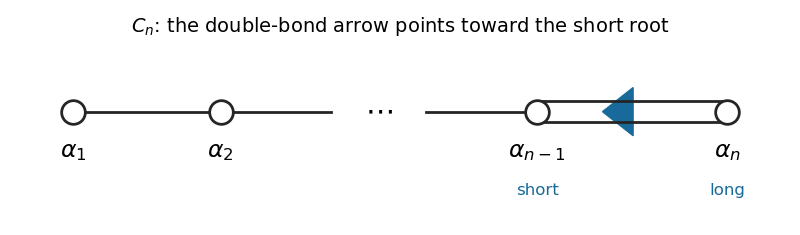

<h1 id="4/a/solution">Solution</h1>

↑ **Parent:** [A](../a.md)

Write an element of the [symplectic Lie algebra](../../../../../../symplectic-lie-algebra.md) in $n\times n$ blocks. Direct multiplication in $AJ+JA^T=0$ gives

$$
A=\begin{pmatrix}P&Q\\R&-P^T\end{pmatrix},\qquad Q^T=Q,\quad R^T=R.
$$

The diagonal [Cartan subalgebra](../../../../../../cartan-subalgebra.md) consists of $H=\operatorname{diag}(h_1,\ldots,h_n,-h_1,\ldots,-h_n)$. Define $\varepsilon_i(H)=h_i$. Under the [Adjoint representation](../../../../../../adjoint-representation-of-a-lie-algebra.md), the off-diagonal [matrix units](../../../../../../matrix-unit.md) in $P$ have [weights](../../../../../../weight-representation-theory.md) $\varepsilon_i-\varepsilon_j$; the symmetric entries in $Q$ have [weights](../../../../../../weight-representation-theory.md) $\varepsilon_i+\varepsilon_j$, including $2\varepsilon_i$ on the diagonal; those in $R$ have the negatives of these weights. All nonzero [root spaces](../../../../../../root-space.md) are one-dimensional, while the zero [weight space](../../../../../../weight-space.md) is the diagonal [Cartan subalgebra](../../../../../../cartan-subalgebra.md). Thus the [Cn root system](../../../../../../cn-root-system.md) is

$$
\boxed{R=\{\pm\varepsilon_i\pm\varepsilon_j:i<j\}\cup\{\pm2\varepsilon_i:1\le i\le n\}.}
$$

Choose the [positive roots](../../../../../../positive-root.md) and [simple roots](../../../../../../simple-root.md) as

$$
\boxed{R^+=\{\varepsilon_i-\varepsilon_j,\varepsilon_i+\varepsilon_j:i<j\}\cup\{2\varepsilon_i\},\qquad
\Delta=\{\alpha_i=\varepsilon_i-\varepsilon_{i+1}:i<n\}\cup\{\alpha_n=2\varepsilon_n\}.}
$$

Their [highest root](../../../../../../highest-root.md) and [Weyl vector](../../../../../../half-sum-of-positive-roots.md) are

$$
\boxed{\theta=2\varepsilon_1=2\alpha_1+\cdots+2\alpha_{n-1}+\alpha_n,\qquad
\rho=\frac12\sum_{\alpha\in R^+}\alpha=\sum_{i=1}^n(n-i+1)\varepsilon_i.}
$$

For the last identity, each pair $i<j$ contributes $2\varepsilon_i$ before division by two, and the long positive root contributes another $\varepsilon_i$ afterward. Successive [simple roots](../../../../../../simple-root.md) have equal length except for $\alpha_n$, whose squared length is twice that of $\alpha_{n-1}$. The [Cn Dynkin diagram](../../../../../../cn-dynkin-diagram.md) is a chain with a double last bond, whose arrow points toward $\alpha_{n-1}$, the short root:

**[Figure 1](#4/a/image-the-cn-dynkin-diagram-with-its-simple-root-labels-and-arrow-toward-the-short-root). The Cn Dynkin diagram with its simple-root labels and arrow toward the short root**.

The displayed schematic is for $n\ge4$; omit intermediate nodes for $n=2,3$. For $n=1$ the diagram has just the single node $\alpha_1=2\varepsilon_1$.

## ↑ Ancestors (11)

1. [A](../a.md)
2. [4](../../4.md)
3. [Paper 1](../../../paper-1-split.md)
4. [Iii](../../../split.md)
5. [2010](../../../../split.md)
6. [Past exam of the mathematics course of the University of Cambridge](../../../../../split.md)
7. [Mathematics course of the University of Cambridge](../../../../../../mathematics-course-of-the-university-of-cambridge.md)
8. [Course of the University of Cambridge](../../../../../../course-of-the-university-of-cambridge.md)
9. [University of Cambridge](../../../../../../university-of-cambridge-split.md)
10. [List of universities](../../../../../../list-of-universities.md)
11. [Codex Wiki](../../../../../../split.md)
