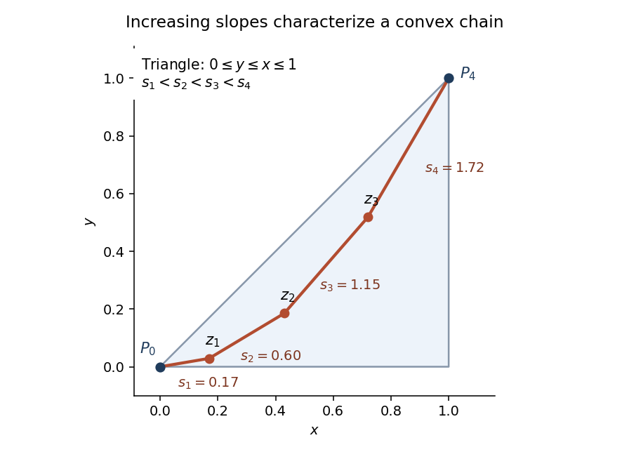

<h1 id="3/i/solution">Solution</h1>

↑ **Parent:** [I](../i.md)

Take the sampled points to be independent with the [uniform distribution](../../../../../../continuous-uniform-distribution.md) on $T=\{(x,y):0\leq y\leq x\leq1\}$. Its area is $1/2$, so its probability density is two. With [probability](../../../../../../probability.md) one there are no coincidences, equal relevant coordinates or collinear triples. We give an exact [first moment method](../../../../../../first-moment-method.md) argument; no tangent construction is needed.

First count the [probability](../../../../../../probability.md) that $k$ labelled points, together with the endpoints, form a [convex chain](../../../../../../convex-chain.md). In their order along the lower boundary, write their coordinates as $(x_i,y_i)$, $1\leq i\leq k$, and put $(x_0,y_0)=(0,0)$, $(x_{k+1},y_{k+1})=(1,1)$. They necessarily satisfy

$$
0=x_0<x_1<\cdots<x_{k+1}=1,\qquad
0=y_0<y_1<\cdots<y_{k+1}=1.
$$

Indeed the lower boundary of the [convex polygon](../../../../../../convex-polygon.md) is the graph of a convex piecewise linear function. Its segment slopes strictly increase; the first is positive because the first point lies above the $x$ axis, making all later slopes positive too.

Set $u_i=x_i-x_{i-1}$ and $v_i=y_i-y_{i-1}$ for $1\leq i\leq k+1$. Both spacing vectors lie in the open [probability simplex](../../../../../../probability-simplex.md), with $\sum_i u_i=\sum_i v_i=1$. The coordinate-monotone region has volume $1/(k!)^2$. The change to the first $k$ spacings in each vector has Jacobian one, and each simplex has uniform volume measure. Simultaneous permutation of all $k+1$ pairs $(u_i,v_i)$ preserves this product volume measure. Except on a null set of ties, the ratios $v_i/u_i$ therefore have all $(k+1)!$ possible orders with equal volume.

Strict increase of these ratios is exactly the [convex chain](../../../../../../convex-chain.md) condition. It also puts the intermediate points below the diagonal: the weighted mean of all slopes is $\sum_i u_i(v_i/u_i)=1$, and each proper initial weighted mean is strictly smaller than one, so $y_j<x_j$ for $j\leq k$. Thus it suffices to impose the slope order on the whole coordinate-monotone region; no additional triangle restriction is needed.

**[Figure 1](#3/i/image-a-convex-chain-in-the-sampling-triangle-has-strictly-increasing-segment-slopes). A convex chain in the sampling triangle has strictly increasing segment slopes**.

The volume for one specified label order is consequently $1/((k!)^2(k+1)!)$. There are $k!$ disjoint orders of the labels, and the joint uniform-triangle density is $2^k$. Hence the [convex-chain probability in a triangle](../../../../../../convex-chain-probability-in-a-triangle.md) is

$$
\boxed{p_k=\frac{2^k}{k!(k+1)!}.}
$$

For example $p_1=1$ and $p_2=1/3$.

Let $C_k$ count the $k$-element subsets of the $n$ sampled points that are [convex chains](../../../../../../convex-chain.md). By [linearity of expectation](../../../../../../linearity-of-expectation.md), $\mathbb EC_k=\binom nkp_k$. If $L_n\geq k$, an optimal chain contains a $k$-vertex subchain, since removing vertices from a [convex polygon](../../../../../../convex-polygon.md) preserves convex position of the remaining vertices. Therefore, by the [first moment method](../../../../../../first-moment-method.md),

$$
\mathbb P(L_n\geq k)\leq\binom nk\frac{2^k}{k!(k+1)!}
\leq\frac{(2n)^k}{(k!)^3}
\leq\left(\frac{2e^3n}{k^3}\right)^k.
$$

We used $\binom nk\leq n^k/k!$, $(k+1)!\geq k!$, and $k!\geq(k/e)^k$, the last following from $\sum_{j=1}^k\log j\geq\int_1^k\log x\,dx$.

Take $k=\lceil4e\,n^{1/3}\rceil$. If $k\leq n$, the last bound is at most $32^{-k}<1/2$; if $k>n$, the event is empty. Every integer [median](../../../../../../median.md) $m_n$ must then satisfy $m_n<k$, and therefore

$$
\boxed{m_n\leq4e\,n^{1/3}.}
$$

The hint's curve $y=x^2$ is a parabola, not a hyperbola. The exact counting argument above proves the upper bound directly. The same chain probability is recorded in [Ambrus and Bárány's analysis of longest convex chains](https://www.renyi.hu/~barany/cikkek/116.pdf).

## ↑ Ancestors (11)

1. [I](../i.md)
2. [3](../../3.md)
3. [Paper 12](../../../paper-12-split.md)
4. [Iii](../../../split.md)
5. [2010](../../../../split.md)
6. [Past exam of the mathematics course of the University of Cambridge](../../../../../split.md)
7. [Mathematics course of the University of Cambridge](../../../../../../mathematics-course-of-the-university-of-cambridge.md)
8. [Course of the University of Cambridge](../../../../../../course-of-the-university-of-cambridge.md)
9. [University of Cambridge](../../../../../../university-of-cambridge-split.md)
10. [List of universities](../../../../../../list-of-universities.md)
11. [Codex Wiki](../../../../../../split.md)
