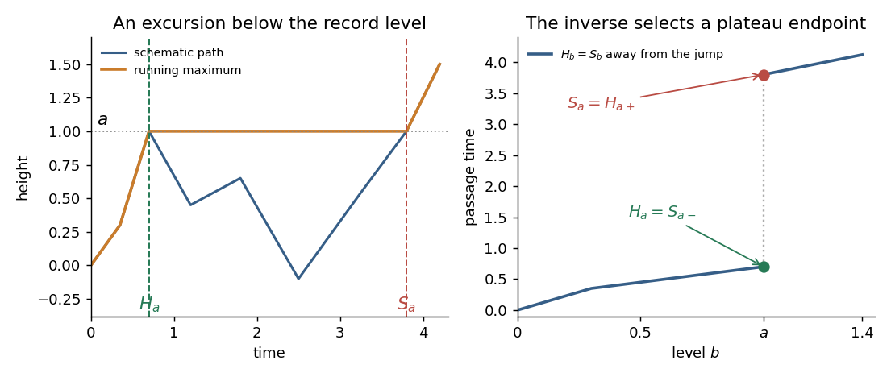

<h1 id="6/b/solution">Solution</h1>

↑ **Parent:** [B](../b.md)

For each deterministic $a>0$, the [Brownian reflection principle](../../../../../../reflection-principle-wiener-process.md) gives

$$
\mathbb P(H_a>t)=\mathbb P\!\left(\sup_{s\leq t}X_s<a\right)
=2\Phi(a/\sqrt t)-1\longrightarrow0,
$$

so $H_a$ is finite [almost surely](../../../../../../almost-sure-convergence.md); $H_0=0$. Here $\Phi$ is the standard normal [cumulative distribution function](../../../../../../cumulative-distribution-function.md). The same reflection formula at levels decreasing to zero gives $\mathbb P(\sup_{s\leq\varepsilon}X_s\leq0)=0$ for every $\varepsilon>0$. Taking a countable intersection over $\varepsilon=1/n$ shows that Brownian motion exceeds zero arbitrarily soon after its start.

By the [Strong Markov property](../../../../../../strong-markov-property.md) at the finite [stopping time](../../../../../../stopping-time.md) $H_a$, the process $X_{H_a+t}-a$ is fresh standard [Brownian motion](../../../../../../brownian-motion-split.md). It therefore exceeds zero arbitrarily soon. Path continuity gives $S_a\geq H_a$, and the preceding fact gives the reverse inequality. Consequently

$$
\boxed{\mathbb P(H_a=S_a)=1\quad\text{for each fixed }a\geq0.}
$$

The exceptional event may depend on $a$; this does not imply simultaneous equality for all levels.

To exhibit the difference, set $A=\max_{0\leq t\leq1}X_t$, a random level. The reflection formula gives $A>0$ almost surely. Also $A>X_1$ almost surely: if $X_1$ were the maximum, the reversed increment process $Y_s=X_1-X_{1-s}$ would be nonnegative throughout $[0,1]$. This process has the law of standard [Brownian motion](../../../../../../brownian-motion-split.md), whose probability of staying nonnegative from zero is zero by reflection and symmetry. The level $A$ is attained at some time strictly before one, so $H_A<1$. It is not exceeded by time one, and continuity with $X_1

**[Figure 1](#6/b/image-a-schematic-excursion-below-a-record-level-separates-the-first-hitting-and-first-exceeding-times). A schematic excursion below a record level separates the first hitting and first exceeding times**.

The illustration shows the pathwise mechanism. The [Brownian running maximum](../../../../../../brownian-running-maximum.md) stays flat during an excursion below an attained record. The non-strict inverse chooses the beginning of that plateau, while the [strict generalized inverse of a nondecreasing function](../../../../../../strict-generalized-inverse-of-a-nondecreasing-function.md) chooses its end. The curve is a schematic of this mechanism, not a claim of piecewise linear Brownian paths. The fixed-level equalities give the [modification of a stochastic process](../../../../../../modification-of-a-stochastic-process.md) relation, while the random-level discrepancy rules out [indistinguishability of stochastic processes](../../../../../../indistinguishability-of-stochastic-processes.md). This is [fixed-level versus simultaneous Brownian passage-time equality](../../../../../../fixed-level-versus-simultaneous-brownian-passage-time-equality.md).

## ↑ Ancestors (11)

1. [B](../b.md)
2. [6](../../6.md)
3. [Paper 28](../../../paper-28-split.md)
4. [Iii](../../../split.md)
5. [2010](../../../../split.md)
6. [Past exam of the mathematics course of the University of Cambridge](../../../../../split.md)
7. [Mathematics course of the University of Cambridge](../../../../../../mathematics-course-of-the-university-of-cambridge.md)
8. [Course of the University of Cambridge](../../../../../../course-of-the-university-of-cambridge.md)
9. [University of Cambridge](../../../../../../university-of-cambridge-split.md)
10. [List of universities](../../../../../../list-of-universities.md)
11. [Codex Wiki](../../../../../../split.md)
