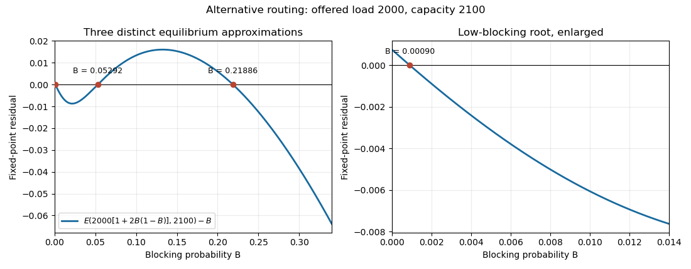

# Paper 30

↑ **Parent:** [Iii](../iii.md)

[https://www.maths.cam.ac.uk/postgrad/part-iii/files/pastpapers/2010/Paper30.pdf](https://www.maths.cam.ac.uk/postgrad/part-iii/files/pastpapers/2010/Paper30.pdf)

**Table of contents**

- [1](#1)
  - [a](#1/a)
    - [Solution](#1/a/solution)
  - [b](#1/b)
    - [Solution](#1/b/solution)
  - [c](#1/c)
    - [Solution](#1/c/solution)
- [2](#2)
  - [a](#2/a)
    - [Solution](#2/a/solution)
  - [b](#2/b)
    - [Solution](#2/b/solution)
- [3](#3)
  - [a](#3/a)
    - [Solution](#3/a/solution)
  - [b](#3/b)
    - [Solution](#3/b/solution)
  - [c](#3/c)
    - [Solution](#3/c/solution)
- [4](#4)
  - [a](#4/a)
    - [Solution](#4/a/solution)
  - [b](#4/b)
    - [Solution](#4/b/solution)

## 1

↑ **Parent:** [Paper 30](paper-30.md)

<h3 id="1/a">a</h3>

↑ **Parent:** [1](#1)

<h4 id="1/a/solution">Solution</h4>

↑ **Parent:** [A](#1/a)

Write the clock states modulo $M$. The [detailed balance equations](../../../markov-process.md#detailed-balance) are $p_m\lambda_m=\nu p_{m-1}$. The product condition makes these equations consistent around the circle, so the [stationary distribution](../../../markov-process.md#stationary-distribution) is

$$
\boxed{p_m=\frac{w_m}{\sum_{k=0}^{M-1}w_k},\qquad w_0=1,\qquad w_m=\prod_{j=1}^{m}\frac{\nu}{\lambda_j}.}
$$

Indeed, the rate of the [time reversal of a continuous-time Markov chain](../../../markov-process.md#time-reversal-of-a-continuous-time-markov-chain) along a clockwise edge is $p_{m+1}\lambda_{m+1}/p_m=\nu$, while its anticlockwise rate is $p_{m-1}\nu/p_m=\lambda_m$. Thus the clock is a [reversible Markov chain](../../../markov-process.md#reversible-markov-chain).

The reversed clockwise transitions can be driven by a single independent rate-$\nu$ [Poisson process](../../../probability-theory.md#poisson-process), since their rate does not depend on the clock state. They correspond to the original anticlockwise transitions. Consequently **the anticlockwise event times form a stationary Poisson process of rate $\nu$**. Its events before a given time are independent of the clock state at that time, which is the relevant [quasireversibility](../../../queueing-theory.md#quasireversibility) property. If clockwise and anticlockwise transitions have the same destination, their direction is retained as an event mark when reversing the process.

<h3 id="1/b">b</h3>

↑ **Parent:** [1](#1)

<h4 id="1/b/solution">Solution</h4>

↑ **Parent:** [B](#1/b)

Let $(m,n)$ denote the clock position and the queue population, including any customer in service. By the [memoryless property](../../../continuous-probability-distribution.md#memorylessness-of-the-exponential-distribution) of the [exponential distribution](../../../continuous-probability-distribution.md#exponential-distribution), the nonzero transition rates are

$$
(m,n)\longrightarrow
\begin{cases}
(m+1,n)&\text{at rate }\nu,\\
(m-1,n+1)&\text{at rate }\lambda_m,\\
(m,n-1)&\text{at rate }\mu\quad(n>0).
\end{cases}
$$

Set $\rho=\nu/\mu<1$. We claim that

$$
\boxed{\pi(m,n)=p_m(1-\rho)\rho^n,\qquad n\geq0,}
$$

where $p_m$ is the clock's [stationary distribution](../../../markov-process.md#stationary-distribution) from part (a). To check [global balance for a continuous-time Markov chain](../../../markov-process.md#global-balance-for-a-continuous-time-markov-chain), divide the incoming probability flux by $\pi(m,n)$. The clockwise contribution is $\nu p_{m-1}/p_m=\lambda_m$. The arrival contribution, present only for $n>0$, is $\lambda_{m+1}(p_{m+1}/p_m)\rho^{-1}=\mu$. The service contribution is $\mu\rho=\nu$. Their sum is the outgoing rate $\nu+\lambda_m+\mu\mathbf1_{\{n>0\}}$.

The proposed [probability distribution](../../../probability-theory.md#probability-distribution) is normalized, so it is the equilibrium law. In particular, the clock position and queue population are [independent random variables](../../../random-variable.md#independent-random-variables) at any fixed equilibrium time, and the population has the [geometric distribution](../../../discrete-probability-distribution.md#geometric-distribution) of a stable [M/M/1 queue](../../../markov-process.md#m-m-1-queue). Independence of these two random variables does not assert independence of the two entire processes.

<h3 id="1/c">c</h3>

↑ **Parent:** [1](#1)

<h4 id="1/c/solution">Solution</h4>

↑ **Parent:** [C](#1/c)

There is now no separate rate-$\nu$ clockwise transition. The only transitions are

$$
(m,n)\longrightarrow(m-1,n+1)\quad\text{at rate }\lambda_m,
\qquad
(m,n)\longrightarrow(m+1,n-1)\quad\text{at rate }\mu\quad(n>0).
$$

Both preserve $m+n$ modulo $M$. The initial state therefore selects the [closed communicating class](../../../markov-process.md#closed-communicating-class) $m+n\equiv0\pmod M$, on which $m\equiv-n\pmod M$. The population is a [birth-death process](../../../markov-process.md#birth-death-process) with birth rate $\lambda_{-n}$ and death rate $\mu$.

Define $a_0=1$ and $a_r=\mu^{-r}\prod_{j=0}^{r-1}\lambda_{-j}$ for $1\leq r<M$. The [detailed balance for a birth-death process](../../../markov-process.md#detailed-balance-for-a-birth-death-process) weights are

$$
w_n=\mu^{-n}\prod_{j=0}^{n-1}\lambda_{-j}.
$$

Writing $n=kM+r$ with $0\leq r<M$, the product condition gives $w_n=a_r\rho^{kM}$. Summing the resulting [geometric series](../../../real-analysis.md#geometric-series) yields

$$
\boxed{\pi(m,kM+r)=\mathbf1_{\{m+r\equiv0\pmod M\}}\frac{(1-\rho^M)a_r\rho^{kM}}{\sum_{s=0}^{M-1}a_s}.}
$$

This is also the law in part (b) conditioned on $m+n\equiv0\pmod M$: the ratio of its weights at consecutive accessible populations is $\lambda_{-n}/\mu$. The stability condition is $\mu>\nu$, which uses the product of the periodic birth rates; it does not require $\mu>\lambda_m$ for every $m$.

## 2

↑ **Parent:** [Paper 30](paper-30.md)

<h3 id="2/a">a</h3>

↑ **Parent:** [2](#2)

<h4 id="2/a/solution">Solution</h4>

↑ **Parent:** [A](#2/a)

A multiclass queue must specify its [service discipline](../../../queueing-theory.md#service-discipline) as well as its arrival and service rates. Here is an ordered-queue model that includes the usual class-independent exponential single-server queue. Let class-$r$ arrivals be independent [Poisson processes](../../../probability-theory.md#poisson-process) of rates $\alpha_r$, and let a class-$r$ service requirement have the [exponential distribution](../../../continuous-probability-distribution.md#exponential-distribution) of rate $\mu_r$. A state is a finite word $x=(c_1,\ldots,c_n)$ of customer classes.

Choose service fractions $\gamma_i(n)\geq0$ with $\sum_{i=1}^n\gamma_i(n)=1$, and insertion probabilities $\delta_i(n)\geq0$ with $\sum_{i=1}^n\delta_i(n)=1$. The customer at position $i$ departs at rate $\mu_{c_i}\gamma_i(n)$; a class-$r$ arrival is inserted at position $i$ at rate $\alpha_r\delta_i(n+1)$. All rates leading to the same word are added. For class-dependent $\mu_r$, impose the [symmetric service discipline](../../../queueing-theory.md#symmetric-service-discipline) $\delta_i(n)=\gamma_i(n)$. If all $\mu_r=\mu$, arbitrary class-independent $\gamma,\delta$ are permitted, including [first come first served](../../../queueing-theory.md#first-come-first-served) with insertion at the tail and service at the head.

Put $\rho_r=\alpha_r/\mu_r$ and $\rho=\sum_r\rho_r$. For $\rho<1$, the equilibrium word law is

$$
\boxed{\pi(c_1,\ldots,c_n)=(1-\rho)\prod_{i=1}^n\rho_{c_i}.}
$$

For the [symmetric service discipline](../../../queueing-theory.md#symmetric-service-discipline), insertion and deletion satisfy [detailed balance for a continuous-time Markov chain](../../../markov-process.md#detailed-balance-for-a-continuous-time-markov-chain) because

$$
\pi(x)\alpha_r\gamma_i(n+1)=\pi(\operatorname{ins}_{i,r}x)\mu_r\gamma_i(n+1).
$$

For the common-service-rate case, use [time reversal of a continuous-time Markov chain](../../../markov-process.md#time-reversal-of-a-continuous-time-markov-chain) instead: the reversed queue inserts with probabilities $\gamma$ and serves with fractions $\delta$. A forward insertion gives a reverse deletion rate $\mu\delta_i$, and a forward deletion gives a reverse insertion rate $\alpha_r\gamma_i$. Forward and reverse total rates both equal $\sum_r\alpha_r+\mu\mathbf1_{\{n>0\}}$, proving [global balance for a continuous-time Markov chain](../../../markov-process.md#global-balance-for-a-continuous-time-markov-chain).

Summing the weights of all words of length $n$ gives $(1-\rho)\rho^n$, so the law is normalized. If $n_r$ counts class-$r$ customers and $n=\sum_r n_r$, the [multinomial coefficient](../../../combinatorics.md#multinomial-coefficient) counting class orderings gives

$$
\boxed{\pi((n_r)_r)=(1-\rho)n!\prod_r\frac{\rho_r^{n_r}}{n_r!}.}
$$

For [processor sharing](../../../queueing-theory.md#processor-sharing), $\gamma_i(n)=\delta_i(n)=1/n$, the class-count vector itself is a [Markov chain](../../../markov-process.md#markov-chain), with arrival rate $\alpha_r$ and departure rate $\mu_r n_r/n$. Under [first come first served](../../../queueing-theory.md#first-come-first-served), the ordered word is generally necessary. Class-dependent service rates combined with [first come first served](../../../queueing-theory.md#first-come-first-served) do not in general have the displayed simple equilibrium law; the discipline assumption matters.

<h3 id="2/b">b</h3>

↑ **Parent:** [2](#2)

<h4 id="2/b/solution">Solution</h4>

↑ **Parent:** [B](#2/b)

Index the queue-class pairs by $a=(j,r)$. Let $\nu_a$ be the external [Poisson process](../../../probability-theory.md#poisson-process) arrival rate, let $p_{ab}$ be the routing probability after class $a$ completes service, and put $p_{a0}=1-\sum_b p_{ab}$ for the exit probability. An open network has a transient routing matrix $P$, equivalently [spectral radius](../../../analysis.md#spectral-radius) less than one. The effective throughputs solve the [traffic equations for a multiclass queueing network](../../../queueing-theory.md#traffic-equations-for-a-multiclass-queueing-network):

$$
\boxed{\lambda_a=\nu_a+\sum_b\lambda_b p_{ba},\qquad \lambda=(I-P^T)^{-1}\nu.}
$$

At each queue use the ordered [multiclass single-server queue](../../../queueing-theory.md#multiclass-single-server-queue) model of part (a), with parameters $\mu_{jr},\gamma_{ji},\delta_{ji}$. An external class-$a$ customer is inserted at position $i$ with rate $\nu_a\delta_{ji}(N_j+1)$. A customer of class $a$ in position $i$ completes at rate $\mu_a\gamma_{ji}(N_j)$: it exits with probability $p_{a0}$ or changes to class $b$ and is inserted at its destination with probability $p_{ab}\delta_{k\ell}(N_k'+1)$. Here $N_k'$ is the destination population after the origin deletion, so this also defines routes returning to the same queue. At each node, either service rates are common to its classes or insertion and service fractions form a [symmetric service discipline](../../../queueing-theory.md#symmetric-service-discipline).

Let $\rho_j=\sum_r\lambda_{jr}/\mu_{jr}<1$. The [product-form stationary distribution of a multiclass queueing network](../../../queueing-theory.md#product-form-stationary-distribution-of-a-multiclass-queueing-network) is

$$
\boxed{\pi((x_j)_j)=\prod_j(1-\rho_j)\prod_{i=1}^{N_j}\frac{\lambda_{j,c_{ji}}}{\mu_{j,c_{ji}}}.}
$$

To prove it by [time reversal of a continuous-time Markov chain](../../../markov-process.md#time-reversal-of-a-continuous-time-markov-chain), interchange each node's insertion and service fractions, and use

$$
\nu_a^*=\lambda_a p_{a0},\qquad
p_{ba}^*=\frac{\lambda_a p_{ab}}{\lambda_b},\qquad
p_{b0}^*=\frac{\nu_b}{\lambda_b}.
$$

Pairs with $\lambda_b=0$ can be deleted. The [traffic equations for a multiclass queueing network](../../../queueing-theory.md#traffic-equations-for-a-multiclass-queueing-network) ensure $\sum_a p_{ba}^*+p_{b0}^*=1$. The ratio of the product weights for an insertion is $\lambda_a/\mu_a$; for a deletion it is its reciprocal. Consequently every routing, entrance, and exit transition satisfies $\pi(x)q(x,x')=\pi(x')q^*(x',x)$. The symmetric or common-rate hypothesis makes each node's total service rate identical forward and backward. Summing the [traffic equations for a multiclass queueing network](../../../queueing-theory.md#traffic-equations-for-a-multiclass-queueing-network) also gives $\sum_a\nu_a^*=\sum_a\nu_a$. Thus the total transition rates match, proving [global balance for a continuous-time Markov chain](../../../markov-process.md#global-balance-for-a-continuous-time-markov-chain); each factor is normalized by part (a).

For the class counts the equilibrium law is

$$
\boxed{\pi((n_{jr})_{jr})=\prod_j(1-\rho_j)N_j!\prod_r\frac{(\lambda_{jr}/\mu_{jr})^{n_{jr}}}{n_{jr}!},\qquad N_j=\sum_r n_{jr}.}
$$

Under [processor sharing](../../../queueing-theory.md#processor-sharing) these counts have explicit transition rates $\nu_a$ for $n\to n+e_a$, $\mu_a n_a/N_j\,p_{a0}$ for $n\to n-e_a$, and $\mu_a n_a/N_j\,p_{ab}$ for $n\to n-e_a+e_b$. Under a closed network, remove external entrances and exits and normalize the same product weights on the conserved customer populations, using a positive solution of the homogeneous [traffic equations for a multiclass queueing network](../../../queueing-theory.md#traffic-equations-for-a-multiclass-queueing-network). That finite-state normalization does not require the open-network conditions $\rho_j<1$.

## 3

↑ **Parent:** [Paper 30](paper-30.md)

<h3 id="3/a">a</h3>

↑ **Parent:** [3](#3)

<h4 id="3/a/solution">Solution</h4>

↑ **Parent:** [A](#3/a)

Start from the [Erlang loss formula](../../../queueing-theory.md#erlang-loss-formula) and reverse the order in its denominator:

$$
\frac1{E(N\nu,NC)}=\sum_{j=0}^{NC}\frac{(NC)!}{(NC-j)!(N\nu)^j}=\sum_{j=0}^{NC}\prod_{\ell=0}^{j-1}\frac{NC-\ell}{N\nu}.
$$

For each fixed $j$, the product tends to $(C/\nu)^j$. If $\nu>C$, it is bounded by this same summable [geometric series](../../../real-analysis.md#geometric-series). Extend the summand by zero for $j>NC$ and apply the [dominated convergence theorem](../../../measure-theory.md#dominated-convergence-theorem) with [counting measure](../../../measure-theory.md#counting-measure) to obtain

$$
\frac1{E(N\nu,NC)}\longrightarrow\sum_{j=0}^\infty(C/\nu)^j=\frac1{1-C/\nu}.
$$

If $\nu\leq C$, retain the first $K+1$ summands. Their limiting sum is at least $K+1$, so the reciprocal tends to infinity as $K$ can be arbitrarily large. This includes $\nu=C$ without a separate normal approximation. Therefore

$$
\boxed{E(N\nu,NC)\longrightarrow\max\{0,1-C/\nu\}.}
$$

Here $C$ and $N$ are positive integers, as appropriate for circuit counts; taking $\lfloor NC\rfloor$ gives the same limit for a positive real capacity scale. This is the [proportional scaling limit of the Erlang loss formula](../../../queueing-theory.md#proportional-scaling-limit-of-the-erlang-loss-formula).

<h3 id="3/b">b</h3>

↑ **Parent:** [3](#3)

<h4 id="3/b/solution">Solution</h4>

↑ **Parent:** [B](#3/b)

For the [link-route incidence matrix](../../../queueing-theory.md#link-route-incidence-matrix) $A$, the [reduced-load approximation](../../../queueing-theory.md#reduced-load-approximation) and [Erlang loss formula](../../../queueing-theory.md#erlang-loss-formula) give

$$
\boxed{B_j=E(a_j,C_j),\qquad a_j=\sum_r A_{jr}\nu_r\prod_{k\ne j}(1-B_k)^{A_{kr}}.}
$$

Introduce $y_j=-\log(1-B_j)$ and accepted route flows $x_r=\nu_r e^{-(A^Ty)_r}$. Multiplying the reduced load by the link's own acceptance probability gives

$$
a_j(1-B_j)=\sum_r A_{jr}x_r=U(y_j,C_j).
$$

These are precisely the [first-order optimality conditions](../../../mathematical-optimization.md#first-order-optimality-condition) for the [convex potential for the Erlang fixed point](../../../queueing-theory.md#convex-potential-for-the-erlang-fixed-point), since

$$
\frac{\partial F}{\partial y_j}=-\sum_r A_{jr}\nu_r e^{-(A^Ty)_r}+U(y_j,C_j).
$$

Each exponential term is a [convex function](../../../real-analysis.md#convex-function), and the integral of the strictly increasing function $U(\cdot,C_j)$ is a [strictly convex function](../../../real-analysis.md#strictly-convex-function). Hence $F$ is a [strictly convex function](../../../real-analysis.md#strictly-convex-function). Moreover $U(z,C_j)\to C_j>0$ as $z\to\infty$, by the saturation of the [carried load of an Erlang loss resource](../../../queueing-theory.md#carried-load-of-an-erlang-loss-resource). Its integrals tend to infinity at least linearly, so $F$ is a [coercive function](../../../real-analysis.md#coercive-function) on the nonnegative orthant and has a unique minimizer.

At $y_j=0$, $U(0,C_j)=0$. If link $j$ is used by any positive-rate route, then $\partial_jF<0$, excluding a boundary minimizer there. An unused link instead minimizes at $y_j=0$ and has zero derivative. Thus the minimizer satisfies the displayed flow equations for every link. Conversely, those equations imply $\nabla F=0$ and therefore minimize the [convex potential for the Erlang fixed point](../../../queueing-theory.md#convex-potential-for-the-erlang-fixed-point). Finally $U(y,C)=a[1-E(a,C)]$ with $y=-\log(1-E(a,C))$ converts the flow equations back to $B_j=E(a_j,C_j)$. **The Erlang fixed point approximation has exactly one solution under fixed routing.**

<h3 id="3/c">c</h3>

↑ **Parent:** [3](#3)

<h4 id="3/c/solution">Solution</h4>

↑ **Parent:** [C](#3/c)

The [alternative routing](../../../queueing-theory.md#alternative-routing) term feeds additional traffic back into the link. We can prove the existence of three solutions rather than relying on an iteration that happens to find different answers. Choose $\nu_N=20N$, $C_N=21N$, and define the continuous residual

$$
G_N(B)=E\bigl(20N[1+2B(1-B)],21N\bigr)-B.
$$

By the [proportional scaling limit of the Erlang loss formula](../../../queueing-theory.md#proportional-scaling-limit-of-the-erlang-loss-formula), at each fixed $B$,

$$
G_N(B)\longrightarrow G_\infty(B)=\max\left\{0,1-\frac{21/20}{1+2B(1-B)}\right\}-B.
$$

At $B=1/100$, the multiplier is $1.0198<21/20$, so $G_\infty(1/100)=-1/100$. At $B=1/8$ it is $39/32$, giving

$$
G_\infty(1/8)=1-\frac{56}{65}-\frac18=\frac7{520}>0.
$$

Also $G_N(0)>0$ and $G_N(1)<0$ for every $N$, since a finite-capacity [Erlang loss formula](../../../queueing-theory.md#erlang-loss-formula) gives a blocking probability strictly between zero and one. For all sufficiently large $N$, the signs at $0,1/100,1/8,1$ therefore alternate. Applying the [intermediate value theorem](../../../calculus.md#intermediate-value-theorem) in the three disjoint intervening intervals proves **at least three distinct fixed points**. This supplies a [fluid scaling proof of multiple Erlang fixed points](../../../queueing-theory.md#fluid-scaling-proof-of-multiple-erlang-fixed-points).

**[Figure 1](#3/c/image-three-fixed-points-of-the-alternative-routing-erlang-approximation). Three fixed points of the alternative-routing Erlang approximation**.

This multiplicity concerns the [Erlang fixed point approximation](../../../queueing-theory.md#erlang-fixed-point-approximation). It does not imply several equilibrium laws for an exact finite [irreducible Markov chain](../../../markov-process.md#irreducible-markov-chain), which has a unique [stationary distribution](../../../markov-process.md#stationary-distribution).

## 4

↑ **Parent:** [Paper 30](paper-30.md)

<h3 id="4/a">a</h3>

↑ **Parent:** [4](#4)

<h4 id="4/a/solution">Solution</h4>

↑ **Parent:** [A](#4/a)

The objective approximates the logarithm of the [product-form stationary distribution of a loss network](../../../queueing-theory.md#product-form-stationary-distribution-of-a-loss-network). To make the approximation precise, multiply arrival rates and capacities by $N$ and write $x=n/N$. The [Stirling formula](../../../real-analysis.md#stirling-formula) gives, uniformly on the feasible compact set,

$$
\log\prod_r\frac{(N\nu_r)^{n_r}}{n_r!}=N H_\nu(n/N)+O(\log N),\qquad H_\nu(x)=\sum_r\bigl[x_r\log\nu_r+x_r-x_r\log x_r\bigr],
$$

with $0\log0=0$. The feasible set is $K=\{x\geq0:Ax\leq C\}$. Positive capacities and a nonempty route for each class make $K$ compact with a strictly positive feasible point. Since $H_\nu$ is a [strictly concave function](../../../real-analysis.md#strictly-concave-function), its maximizer $x^*$ is unique; its infinite inward derivative at $x_r=0$ makes every component positive.

The [Karush-Kuhn-Tucker conditions](../../../mathematical-optimization.md#karush-kuhn-tucker-conditions) give nonnegative link [Lagrange multipliers](../../../mathematical-optimization.md#lagrange-multiplier) $z_j$ satisfying

$$
\boxed{x_r^*=\nu_r e^{-(A^Tz)_r},\qquad z_j\bigl(C_j-(Ax^*)_j\bigr)=0.}
$$

For any neighborhood of $x^*$, continuity and uniqueness give a strictly positive objective gap outside it. There are only polynomially many feasible lattice states, while their weights differ exponentially in $N$. The feasible point $\lfloor Nx^*\rfloor$ has objective tending to $H_\nu(x^*)$. It follows that the stationary law concentrates at $x^*$ on the scale $n/N$; in particular,

$$
\boxed{\frac nN\longrightarrow x^*\text{ in probability},\qquad \mathbb E[n]=Nx^*+o(N).}
$$

Thus NETWORK predicts the dominant occupancy and mean occupancy in a large [loss network](../../../queueing-theory.md#loss-network). For unscaled inputs it gives a continuous approximation to the modal integer state.

It also gives an exact useful change of variables. Substituting $\nu_r=x_r^*e^{(A^Tz)_r}$ into the equilibrium weights yields

$$
\pi_N(n)\propto\mathbf1_{\{An\leq NC\}}e^{z^T(An-NC)}\prod_r\Pr\{\operatorname{Poisson}(Nx_r^*)=n_r\}.
$$

This is [Poisson exponential tilting for a loss network](../../../queueing-theory.md#poisson-exponential-tilting-for-a-loss-network): independent [Poisson random variables](../../../discrete-probability-distribution.md#poisson-distribution) centered at the predicted occupancies, restricted to the feasible region and penalized for slack in positively priced resources. It explains why an unconstrained [Gaussian approximation](../../../convergence-of-random-variables.md#normal-approximation) should not automatically be applied at a saturated capacity boundary.

<h3 id="4/b">b</h3>

↑ **Parent:** [4](#4)

<h4 id="4/b/solution">Solution</h4>

↑ **Parent:** [B](#4/b)

Let $x^*$ maximize SYSTEM. Under the usual positive-capacity, nonempty-route assumptions, the feasible set is compact, contains a positive point, and has a [Slater condition](../../../mathematical-optimization.md#slater-s-condition) point. Strict [concavity](../../../real-analysis.md#concave-function) makes the optimum unique. The condition $U_r'(0)=\infty$ forces $x_r^*>0$: moving from any optimum with a zero component slightly toward a positive feasible point gives an infinite positive directional derivative in that component and only finite losses in the positive components.

By the [Karush-Kuhn-Tucker conditions](../../../mathematical-optimization.md#karush-kuhn-tucker-conditions), there are link [Lagrange multipliers](../../../mathematical-optimization.md#lagrange-multiplier) $p_j^*\geq0$ with

$$
U_r'(x_r^*)=(A^Tp^*)_r,\qquad p_j^*\bigl(C_j-(Ax^*)_j\bigr)=0.
$$

Set the [route congestion price](../../../queueing-theory.md#route-congestion-price) $y_r^*=(A^Tp^*)_r=U_r'(x_r^*)$ and choose

$$
\boxed{\nu_r^*=x_r^*e^{y_r^*}.}
$$

Then $x_r^*=\nu_r^*e^{-y_r^*}$, as required. For USER with fixed $y_r^*$, the substitution $x=\nu_r e^{-y_r^*}$ is a bijection of the nonnegative half-line, and its objective becomes $U_r(x)-y_r^*x$. This is a [strictly concave function](../../../real-analysis.md#strictly-concave-function) whose derivative vanishes at $x_r^*$, so its unique maximizer is $x_r^*$ and the corresponding USER optimizer is $\nu_r^*$.

For NETWORK at $\nu^*$, its objective derivative at $x^*$ is

$$
\log\frac{\nu_r^*}{x_r^*}=y_r^*=(A^Tp^*)_r.
$$

Thus $x^*,p^*$ obey its [Karush-Kuhn-Tucker conditions](../../../mathematical-optimization.md#karush-kuhn-tucker-conditions), with the same feasibility and [complementary slackness](../../../mathematical-optimization.md#complementary-slackness). The NETWORK objective is a [strictly concave function](../../../real-analysis.md#strictly-concave-function), so $x^*$ is also its unique maximizer. **The triple $(x^*,y^*,\nu^*)$ solves all three problems simultaneously.** This is a [user-network decomposition of concave utility maximization](../../../queueing-theory.md#user-network-decomposition-of-concave-utility-maximization).

## ↑ Ancestors (8)

1. [Iii](../iii.md)
2. [2010](../../2010.md)
3. [Past exam of the mathematics course of the University of Cambridge](../../../past-exam-of-the-mathematics-course-of-the-university-of-cambridge.md)
4. [Mathematics course of the University of Cambridge](../../../university-of-cambridge.md#mathematics-course-of-the-university-of-cambridge)
5. [Course of the University of Cambridge](../../../university-of-cambridge.md#course-of-the-university-of-cambridge)
6. [University of Cambridge](../../../university-of-cambridge.md)
7. [List of universities](../../../README.md#list-of-universities)
8. [Codex Wiki](../../../README.md)
