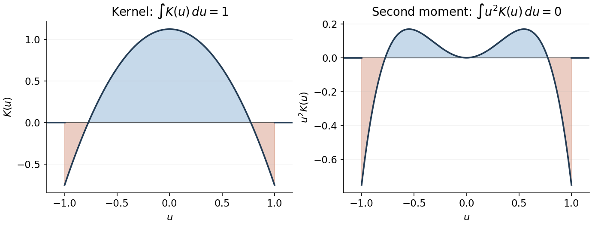

<h1 id="2/solution">Solution</h1>

↑ **Parent:** [2](../2.md)

For a [kernel for density estimation](../../../../../kernel-for-density-estimation.md) $K$ and [smoothing bandwidth](../../../../../smoothing-bandwidth.md) $h>0$, the [kernel density estimator](../../../../../kernel-density-estimation.md) is

$$
\boxed{f_n^K(x,h)=\frac1{nh}\sum_{i=1}^nK\!\left(\frac{x-X_i}{h}\right).}
$$

We use the convention that a [kernel of order ell](../../../../../kernel-of-order-ell.md) has

$$
\int_{\mathbb R}K(u)\,du=1,\qquad \int_{\mathbb R}u^jK(u)\,du=0\ (1\leq j<\ell),\qquad \int_{\mathbb R}|u|^\ell|K(u)|\,du<\infty.
$$

The [kernel for density estimation](../../../../../kernel-for-density-estimation.md) is integrable and can have negative values; requiring nonnegativity would prevent its second moment from vanishing. Some conventions additionally require a nonzero moment of order $\ell$. The construction below covers that convention too.

The [Legendre polynomial kernel construction](../../../../../legendre-polynomial-kernel-construction.md) uses the polynomial reproducing kernel at zero:

$$
\boxed{K_\ell(u)=\mathbf1_{[-1,1]}(u)\sum_{m=0}^{\ell-1}\phi_m(0)\phi_m(u).}
$$

Every [polynomial](../../../../../polynomial-split.md) $p$ of degree at most $\ell-1$ has the expansion $p=\sum_{m=0}^{\ell-1}\langle p,\phi_m\rangle\phi_m$, since the displayed [Legendre polynomials](../../../../../legendre-polynomial.md) have those successive degrees and form an [orthonormal basis](../../../../../orthonormal-basis.md) of this polynomial space. Therefore

$$
\int_{-1}^1K_\ell(u)p(u)\,du=\sum_{m=0}^{\ell-1}\phi_m(0)\langle p,\phi_m\rangle=p(0).
$$

Taking $p=1,u,\ldots,u^{\ell-1}$ proves all the required moment identities. Boundedness and [compact support](../../../../../compact-support.md) give every absolute moment and a finite [L2 norm](../../../../../l2-norm.md). If a nonzero moment of order $\ell$ is required, replace this kernel by

$$
\widetilde K_\ell=K_\ell+(\phi_\ell(0)+1)\phi_\ell\mathbf1_{[-1,1]}.
$$

The lower moments are unchanged by [orthogonality](../../../../../orthogonal-vectors.md). If $a_\ell=\langle u^\ell,\phi_\ell\rangle$, then $a_\ell\ne0$ because otherwise $u^\ell$ would lie in the polynomial space of degree at most $\ell-1$. Evaluating its full Legendre expansion at zero gives $\int u^\ell K_\ell=-\phi_\ell(0)a_\ell$, so $\int u^\ell\widetilde K_\ell=a_\ell\ne0$.

For instance, a simple kernel satisfying the moment conditions needed for three derivatives is

$$
K_3(u)=\frac{9-15u^2}{8}\mathbf1_{[-1,1]}(u),\qquad \int K_3=1,\quad\int uK_3=\int u^2K_3=0,\quad\int K_3^2=\frac98.
$$

Its negative wings cancel its central contribution to the second moment.

**[Figure 1](#2/image-signed-kernel-and-cancellation-of-its-second-moment). Signed kernel and cancellation of its second moment**.

Here is the [third-order pointwise kernel error bound](../../../../../third-order-pointwise-kernel-error-bound.md). Write $B=\|f\|_\infty$ and $M_3=\|f^{(3)}\|_\infty$, and use any square-integrable kernel with unit integral, first two moments zero and $\mu_3=\int|u|^3|K(u)|du<\infty$. A change of variables gives

$$
\mathbb Ef_n^K(x,h)=\int K(u)f(x-hu)\,du.
$$

By the [Taylor theorem with Lagrange remainder](../../../../../taylor-theorem-with-lagrange-remainder.md),

$$
f(x-hu)=f(x)-hu f'(x)+\frac{h^2u^2}{2}f''(x)+R(x,u,h),\qquad |R(x,u,h)|\leq\frac{M_3h^3|u|^3}{6}.
$$

The moment cancellations consequently give the uniform [bias of a kernel density estimator](../../../../../bias-of-a-kernel-density-estimator.md) bound

$$
|\mathbb Ef_n^K(x,h)-f(x)|\leq\frac{M_3\mu_3}{6}h^3.
$$

For the [variance](../../../../../variance-split.md), independence and another change of variables give

$$
\operatorname{Var}(f_n^K(x,h))=\frac1n\operatorname{Var}\!\left(h^{-1}K\!\left(\frac{x-X_1}{h}\right)\right)\leq\frac1{nh}\int K(u)^2f(x-hu)du\leq\frac{B\|K\|_2^2}{nh}.
$$

The [triangle inequality](../../../../../triangle-inequality.md) and [Cauchy-Schwarz inequality](../../../../../cauchy-schwarz-inequality.md) now yield

$$
\mathbb E|f_n^K(x,h)-f(x)|\leq\frac{M_3\mu_3}{6}h^3+\frac{\sqrt B\|K\|_2}{\sqrt{nh}}.
$$

Balancing $h^3$ against $(nh)^{-1/2}$ gives

$$
\boxed{h_n=n^{-1/7},\qquad \sup_{x\in\mathbb R}\mathbb E|f_n^K(x,h_n)-f(x)|\leq\left(\frac{M_3\mu_3}{6}+\sqrt B\|K\|_2\right)n^{-3/7}.}
$$

The constant is independent of both $n$ and $x$. The original PDF has exponent $3/7$; the converted TeX's $3/2$ is a transcription error.

To obtain the final parametric rate, we choose a [flat-top kernel for density estimation](../../../../../flat-top-kernel-for-density-estimation.md). This kernel also satisfies all the preceding moment conditions, so a single kernel works for both constructions, with different bandwidth choices. With the [Fourier transform](../../../../../fourier-transform.md) convention $\widehat g(t)=\int e^{-itx}g(x)dx$, choose a real even $C^\infty$ function $\eta$ equal to one on $[-1,1]$ and zero outside $[-2,2]$, and put

$$
\boxed{K(x)=\frac1{2\pi}\int_{-2}^2e^{itx}\eta(t)\,dt.}
$$

Such a cutoff is explicit: if $\rho(s)=e^{-1/s}$ for $s>0$ and zero otherwise, take $\eta(t)=\rho(2-|t|)/[\rho(2-|t|)+\rho(|t|-1)]$. It is constant near zero, and its endpoint transitions are smooth. Repeated integration by parts shows that $K$ and all its derivatives decay faster than every power, so $K$ lies in the [Schwartz space](../../../../../schwartz-space.md). The [Fourier inversion](../../../../../fourier-inversion-theorem.md) and [moment differentiation of the Fourier transform](../../../../../moment-differentiation-of-the-fourier-transform.md) give

$$
\int K=\eta(0)=1,\qquad \int x^jK(x)dx=i^j\eta^{(j)}(0)=0\quad(j\geq1).
$$

Thus this kernel can be used with $h_n=n^{-1/7}$ for the preceding general bound.

For the sharper example choose the [probability density function](../../../../../probability-density-function.md)

$$
\boxed{f(x)=\frac{1-\cos x}{\pi x^2}\ (x\ne0),\qquad f(0)=\frac1{2\pi},\qquad h_n=1.}
$$

To check this is a density and identify its [Fourier transform](../../../../../fourier-transform.md), direct integration gives

$$
\frac1{2\pi}\int_{-1}^1(1-|t|)e^{itx}dt=\frac1\pi\int_0^1(1-t)\cos(tx)dt=\frac{1-\cos x}{\pi x^2}.
$$

The continuous value at zero is as displayed. This function is nonnegative and integrable, being bounded near zero and $O(x^{-2})$ at infinity. [Fourier inversion](../../../../../fourier-inversion-theorem.md) gives $\widehat f(t)=(1-|t|)_+$, and in particular $\int f=\widehat f(0)=1$. Differentiation of this compact frequency integral also shows that $f$ and $f^{(3)}$ are bounded. Since $\eta=1$ on the support of $\widehat f$, the [convolution theorem](../../../../../convolution-theorem.md) gives

$$
\widehat{K*f}=\eta\widehat f=\widehat f,\qquad K*f=f.
$$

Both sides are continuous, so the equality holds at every $x$. There is therefore exactly zero [bias of a kernel density estimator](../../../../../bias-of-a-kernel-density-estimator.md) at bandwidth one, and the variance bound above gives

$$
\boxed{\sup_{x\in\mathbb R}\mathbb E|f_n^K(x,1)-f(x)|\leq\sqrt B\|K\|_2\,n^{-1/2}.}
$$

This is [parametric-rate kernel estimation of a bandlimited density](../../../../../parametric-rate-kernel-estimation-of-a-bandlimited-density.md). A fixed bandwidth is appropriate because it reproduces this particular density exactly; a generic density would retain a nonzero smoothing bias.

## ↑ Ancestors (10)

1. [2](../2.md)
2. [Paper 31](../../paper-31-split.md)
3. [Iii](../../split.md)
4. [2010](../../../split.md)
5. [Past exam of the mathematics course of the University of Cambridge](../../../../split.md)
6. [Mathematics course of the University of Cambridge](../../../../../mathematics-course-of-the-university-of-cambridge.md)
7. [Course of the University of Cambridge](../../../../../course-of-the-university-of-cambridge.md)
8. [University of Cambridge](../../../../../university-of-cambridge-split.md)
9. [List of universities](../../../../../list-of-universities.md)
10. [Codex Wiki](../../../../../split.md)
