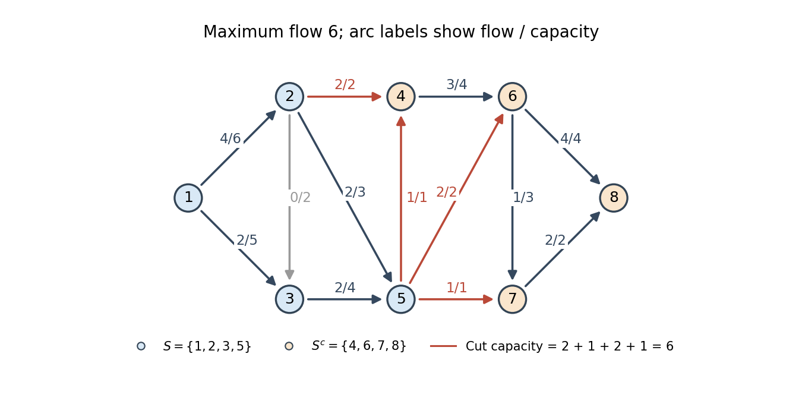

# Paper 35

↑ **Parent:** [Iii](../iii.md)

[https://www.maths.cam.ac.uk/postgrad/part-iii/files/pastpapers/2010/Paper35.pdf](https://www.maths.cam.ac.uk/postgrad/part-iii/files/pastpapers/2010/Paper35.pdf)

**Table of contents**

- [1](#1)
  - [Solution](#1/solution)
  - [a](#1/a)
    - [Solution](#1/a/solution)
  - [b](#1/b)
    - [Solution](#1/b/solution)
- [2](#2)
  - [a](#2/a)
    - [Solution](#2/a/solution)
  - [b](#2/b)
    - [Solution](#2/b/solution)
  - [c](#2/c)
    - [Solution](#2/c/solution)
- [3](#3)
  - [a](#3/a)
    - [Solution](#3/a/solution)
  - [b](#3/b)
    - [Solution](#3/b/solution)
  - [c](#3/c)
    - [Solution](#3/c/solution)
- [4](#4)
  - [Solution](#4/solution)
- [5](#5)
  - [Solution](#5/solution)
  - [a](#5/a)
    - [Solution](#5/a/solution)
  - [b](#5/b)
    - [Solution](#5/b/solution)
- [6](#6)
  - [Solution](#6/solution)
  - [i](#6/i)
    - [Solution](#6/i/solution)
  - [ii](#6/ii)
    - [Solution](#6/ii/solution)
  - [iii](#6/iii)
    - [Solution](#6/iii/solution)

## 1

↑ **Parent:** [Paper 35](paper-35.md)

<h3 id="1/solution">Solution</h3>

↑ **Parent:** [1](#1)

Use the [optimization Lagrangian](../../../mathematical-optimization.md#optimization-lagrangian) with the sensitivity sign convention

$$
\boxed{L_b(x,\lambda)=f(x)-\lambda^T(h(x)-b),\qquad \lambda\in\mathbb R^m.}
$$

For equality constraints the [Lagrange multipliers](../../../mathematical-optimization.md#lagrange-multiplier) have unrestricted signs. The [Lagrangian sufficiency theorem](../../../mathematical-optimization.md#lagrange-sufficiency-theorem) says that if $h(x^*)=b$ and, for some $\lambda^*$, $x^*$ globally minimizes $L_b(\cdot,\lambda^*)$ over $X$, then $x^*$ globally minimizes $f$ subject to the constraint. Indeed every feasible $x$ satisfies

$$
f(x)=L_b(x,\lambda^*)\geq L_b(x^*,\lambda^*)=f(x^*).
$$

This proves the theorem without a [convexity](../../../real-analysis.md#convex-function) or differentiability assumption. Merely finding a stationary point of the [optimization Lagrangian](../../../mathematical-optimization.md#optimization-lagrangian) would not establish its required global minimum.

Let $\phi(u)=\inf\{f(x):x\in X,h(x)=u\}$, with value $+\infty$ when the feasible set is empty, and suppose $\phi(b)$ is finite. The problem has the [Strong Lagrangian property](../../../mathematical-optimization.md#strong-lagrangian-property) if a finite multiplier $\lambda$ satisfies

$$
\boxed{\inf_{x\in X}L_b(x,\lambda)=\phi(b).}
$$

This includes attainment of the dual bound by a multiplier. It does not by itself assert attainment of the primal infimum. For every multiplier, restricting the infimum to feasible $x$ gives $\inf_XL_b(x,\lambda)\leq\phi(b)$, the relevant [weak duality](../../../mathematical-optimization.md#weak-duality). A [non-vertical supporting hyperplane of a value function](../../../mathematical-optimization.md#non-vertical-supporting-hyperplane-of-a-value-function) is a plane

$$
r=\phi(b)+\lambda^T(u-b)
$$

with $\phi(u)\geq\phi(b)+\lambda^T(u-b)$ for every $u$. Its vertical coefficient is nonzero and has been normalized to one; the [epigraph](../../../calculus-of-variations.md#epigraph) lies above it. The two directions of the equivalence are proved in parts (a) and (b).

For the sampling allocation put $A=\sum_i\sqrt{a_iv_i}$. Finite [variance](../../../variance.md) requires every $x_i>0$; interpret the objective at a zero coordinate as $+\infty$. An optimum uses all the budget, because scaling every positive $x_i$ up would otherwise reduce the objective while remaining feasible. The [Cauchy-Schwarz inequality](../../../probability-and-statistics.md#cauchy-schwarz-inequality) gives the global bound

$$
A^2=\left(\sum_i\sqrt{v_i/x_i}\sqrt{a_ix_i}\right)^2\leq\left(\sum_i\frac{v_i}{x_i}\right)\left(\sum_i a_ix_i\right)\leq b\sum_i\frac{v_i}{x_i}.
$$

Equality requires $v_i/x_i$ to be proportional to $a_ix_i$. The budget then determines the unique allocation:

$$
\boxed{x_i^*(b)=\frac bA\sqrt{\frac{v_i}{a_i}},\qquad \phi(b)=\frac{A^2}{b}.}
$$

This is the [optimal cost-constrained stratified sampling allocation](../../../statistical-inference.md#optimal-cost-constrained-stratified-sampling-allocation).

For an inequality $\sum_i a_ix_i\leq b$, our sign convention uses $\lambda\leq0$, so $L_b=f-\lambda(\sum_i a_ix_i-b)$ is a lower bound on $f$ at feasible points. Its coordinate stationary equations are $-v_i/x_i^2-\lambda a_i=0$, and the displayed allocation gives

$$
\boxed{\lambda^*(b)=-\frac{A^2}{b^2}.}
$$

The function $v_i/x_i+(-\lambda^*)a_ix_i$ has a strict global minimum at $x_i^*$: its second derivative is $2v_i/x_i^3>0$ and its value diverges at both endpoints of $(0,\infty)$. Thus the multiplier also supplies the [Lagrangian sufficiency theorem](../../../mathematical-optimization.md#lagrange-sufficiency-theorem) certificate, with the tight inequality giving [complementary slackness](../../../mathematical-optimization.md#complementary-slackness).

Finally, for $b+\delta b>0$,

$$
\phi(b+\delta b)-\phi(b)=-\frac{A^2\delta b}{b(b+\delta b)}=\lambda^*(b)\,\delta b+O((\delta b)^2).
$$

Hence **the first-order change in minimal variance is $\boxed{\lambda^*\delta b}$**. Increased resources decrease the variance. With the alternative convention $L=f+\mu(\sum_i a_ix_i-b)$, the multiplier is $\mu=-\lambda^*>0$ and the sensitivity is $-\mu\delta b$.

<h3 id="1/a">a</h3>

↑ **Parent:** [1](#1)

<h4 id="1/a/solution">Solution</h4>

↑ **Parent:** [A](#1/a)

Suppose the [non-vertical supporting hyperplane of a value function](../../../mathematical-optimization.md#non-vertical-supporting-hyperplane-of-a-value-function) has slope $\lambda$. Every $x\in X$ then satisfies

$$
f(x)\geq\phi(h(x))\geq\phi(b)+\lambda^T(h(x)-b),
$$

so $L_b(x,\lambda)\geq\phi(b)$. Taking the infimum gives $\inf_XL_b\geq\phi(b)$. Conversely, feasible points approaching the infimum of $f$ have $L_b=f$, so $\inf_XL_b\leq\phi(b)$ even if no primal minimizer exists. Therefore

$$
\boxed{\inf_XL_b(x,\lambda)=\phi(b),}
$$

which is the [Strong Lagrangian property](../../../mathematical-optimization.md#strong-lagrangian-property).

<h3 id="1/b">b</h3>

↑ **Parent:** [1](#1)

<h4 id="1/b/solution">Solution</h4>

↑ **Parent:** [B](#1/b)

If the [Strong Lagrangian property](../../../mathematical-optimization.md#strong-lagrangian-property) holds with multiplier $\lambda$, its infimum identity implies, for every $x\in X$,

$$
f(x)-\lambda^T(h(x)-b)\geq\phi(b).
$$

For any feasible right-hand side $u$, take the infimum over $h(x)=u$ to obtain

$$
\boxed{\phi(u)\geq\phi(b)+\lambda^T(u-b).}
$$

The inequality also holds at infeasible $u$, where $\phi(u)=+\infty$, and it is equality at $u=b$. Thus $r=\phi(b)+\lambda^T(u-b)$ is the required [non-vertical supporting hyperplane of a value function](../../../mathematical-optimization.md#non-vertical-supporting-hyperplane-of-a-value-function). This proves the converse and completes the equivalence. Neither implication requires that $X$ be a [convex set](../../../mathematical-optimization.md#convex-set).

## 2

↑ **Parent:** [Paper 35](paper-35.md)

<h3 id="2/a">a</h3>

↑ **Parent:** [2](#2)

<h4 id="2/a/solution">Solution</h4>

↑ **Parent:** [A](#2/a)

Introduce nonnegative [slack variables](../../../mathematical-optimization.md#slack-variable) $s_1,s_2$ and let $z$ denote profit. We display each [simplex tableau](../../../mathematical-optimization.md#simplex-tableau) as coefficients of its row equation, with the coefficient of $z$ in the objective equation implicitly one. Thus a negative coefficient in the last row permits an improving entering variable. The initial [simplex tableau](../../../mathematical-optimization.md#simplex-tableau) is

$$
\begin{array}{c|rrrr|r}
\text{basis}&x_1&x_2&s_1&s_2&\text{RHS}\\\hline
s_1&1&2&1&0&6\\
s_2&2&1&0&1&6\\\hline
z&-3&-4&0&0&0
\end{array}.
$$

Use the [simplex method](../../../mathematical-optimization.md#simplex-method) with $x_2$ entering. The [simplex ratio test](../../../mathematical-optimization.md#simplex-ratio-test) gives ratios $6/2=3$ and $6/1=6$, so $s_1$ leaves. Divide its row by two and eliminate the other $x_2$ entries:

$$
\begin{array}{c|rrrr|r}
\text{basis}&x_1&x_2&s_1&s_2&\text{RHS}\\\hline
x_2&1/2&1&1/2&0&3\\
s_2&3/2&0&-1/2&1&3\\\hline
z&-1&0&2&0&12
\end{array}.
$$

Next $x_1$ enters. The positive-column ratios are $3/(1/2)=6$ and $3/(3/2)=2$, so $s_2$ leaves. After this pivot and a row reordering,

$$
\begin{array}{c|rrrr|r}
\text{basis}&x_1&x_2&s_1&s_2&\text{RHS}\\\hline
x_1&1&0&-1/3&2/3&2\\
x_2&0&1&2/3&-1/3&2\\\hline
z&0&0&5/3&2/3&14
\end{array}.
$$

The last row is $z=14-(5/3)s_1-(2/3)s_2$, so every nonnegative feasible solution has $z\leq14$. Setting the nonbasic variables to zero gives

$$
\boxed{x_1=x_2=2,\qquad z_{\max}=14.}
$$

The equality certificate also shows uniqueness, since both nonbasic objective coefficients are strictly unfavorable.

<h3 id="2/b">b</h3>

↑ **Parent:** [2](#2)

<h4 id="2/b/solution">Solution</h4>

↑ **Parent:** [B](#2/b)

Add the [slack variable](../../../mathematical-optimization.md#slack-variable) $s_3$ for the forgotten constraint. In the optimal [simplex tableau](../../../mathematical-optimization.md#simplex-tableau) from part (a), $x_1+x_2=4-(s_1+s_2)/3$. Hence the new row in canonical form is

$$
s_3-\frac43s_1-\frac43s_2=-1.
$$

Appending it gives

$$
\begin{array}{c|rrrrr|r}
\text{basis}&x_1&x_2&s_1&s_2&s_3&\text{RHS}\\\hline
x_1&1&0&-1/3&2/3&0&2\\
x_2&0&1&2/3&-1/3&0&2\\
s_3&0&0&-4/3&-4/3&1&-1\\\hline
z&0&0&5/3&2/3&0&14
\end{array}.
$$

The objective row remains dual feasible, but $s_3=-1$ makes the basic solution infeasible. Apply the [dual simplex algorithm](../../../numerical-analysis.md#dual-simplex-algorithm): $s_3$ leaves, and the eligible columns are $s_1,s_2$, whose negative coefficients can repair this row. The dual ratio test compares

$$
\frac{5/3}{4/3}=\frac54,\qquad \frac{2/3}{4/3}=\frac12.
$$

Thus $s_2$ enters. Pivoting on $-4/3$ and eliminating its column gives

$$
\begin{array}{c|rrrrr|r}
\text{basis}&x_1&x_2&s_1&s_2&s_3&\text{RHS}\\\hline
x_1&1&0&-1&0&1/2&3/2\\
x_2&0&1&1&0&-1/4&9/4\\
s_2&0&0&1&1&-3/4&3/4\\\hline
z&0&0&1&0&1/2&27/2
\end{array}.
$$

All basic values are nonnegative and the objective equation is $z=27/2-s_1-s_3/2$. Therefore

$$
\boxed{x_1=\frac32,\qquad x_2=\frac94,\qquad z_{\max}=\frac{27}{2},\qquad s_2=\frac34.}
$$

Both binding constraints have zero slack, and the final objective row proves global optimality. The two nonbasic penalties are strictly positive, so this optimum is unique.

<h3 id="2/c">c</h3>

↑ **Parent:** [2](#2)

<h4 id="2/c/solution">Solution</h4>

↑ **Parent:** [C](#2/c)

The old [slack variable](../../../mathematical-optimization.md#slack-variable) $s_3$ is exactly the amount now sold, so rename its column $y$. No further slack is added: the PDF specifies an equality. The feasible equations are otherwise unchanged. If $z_0$ is the old profit, the new profit is $z=z_0+y$. Substituting this into the old objective equation gives

$$
z+s_1-\frac12y=\frac{27}{2}.
$$

This is the [simplex objective update for a priced slack variable](../../../mathematical-optimization.md#simplex-objective-update-for-a-priced-slack-variable). The altered [simplex tableau](../../../mathematical-optimization.md#simplex-tableau) is

$$
\begin{array}{c|rrrrr|r}
\text{basis}&x_1&x_2&s_1&s_2&y&\text{RHS}\\\hline
x_1&1&0&-1&0&1/2&3/2\\
x_2&0&1&1&0&-1/4&9/4\\
s_2&0&0&1&1&-3/4&3/4\\\hline
z&0&0&1&0&-1/2&27/2
\end{array}.
$$

The coefficient $-1/2$ makes $y$ an improving entering variable. Its only positive constraint-row coefficient is $1/2$ in the $x_1$ row, whose ratio is $(3/2)/(1/2)=3$. Thus $x_1$ leaves. The [simplex method](../../../mathematical-optimization.md#simplex-method) pivot gives

$$
\begin{array}{c|rrrrr|r}
\text{basis}&x_1&x_2&s_1&s_2&y&\text{RHS}\\\hline
y&2&0&-2&0&1&3\\
x_2&1/2&1&1/2&0&0&3\\
s_2&3/2&0&-1/2&1&0&3\\\hline
z&1&0&0&0&0&15
\end{array}.
$$

The objective equation $z=15-x_1$ proves optimality. One optimal basic solution is

$$
\boxed{x_1=0,\qquad x_2=3,\qquad y=3,\qquad z_{\max}=15.}
$$

The zero reduced cost of $s_1$ permits alternative optima. In fact all optimal solutions are

$$
\boxed{x_1=0,\qquad 0\leq x_2\leq3,\qquad y=15-4x_2.}
$$

These satisfy both remaining inequalities, and the equality then makes their profit exactly fifteen.

## 3

↑ **Parent:** [Paper 35](paper-35.md)

<h3 id="3/a">a</h3>

↑ **Parent:** [3](#3)

<h4 id="3/a/solution">Solution</h4>

↑ **Parent:** [A](#3/a)

For a finite directed [flow network](../../../graph-theory.md#flow-network) with source $s$, sink $t$ and nonnegative finite [flow network edge capacities](../../../graph-theory.md#flow-network-edge-capacity) $c_e$, the [max-flow min-cut theorem](../../../graph-theory.md#max-flow-min-cut-theorem) states

$$
\boxed{\max_{f\text{ feasible}}|f|=\min_{S:s\in S,\ t\notin S}c(S,S^c).}
$$

Here feasible arc flows satisfy $0\leq f_e\leq c_e$ and [flow conservation](../../../graph-theory.md#flow-conservation) at every vertex except $s,t$. Their [strength of a flow](../../../graph-theory.md#strength-of-a-flow) is the net outflow at $s$. A [cut of a flow network](../../../graph-theory.md#cut-of-a-flow-network) has [cut capacity](../../../graph-theory.md#cut-capacity) equal to the sum of capacities on arcs directed from $S$ to $S^c$.

For any feasible [flow](../../../graph-theory.md#flow) and any such [cut of a flow network](../../../graph-theory.md#cut-of-a-flow-network), summing [flow conservation](../../../graph-theory.md#flow-conservation) over $S$ cancels internal arcs and gives

$$
|f|=\sum_{u\in S,v\notin S}f_{uv}-\sum_{u\notin S,v\in S}f_{uv}\leq\sum_{u\in S,v\notin S}c_{uv}=c(S,S^c).
$$

Thus every flow value is bounded by every cut capacity.

A maximum [flow](../../../graph-theory.md#flow) exists: the feasible arc-flow vectors form a nonempty closed subset of the finite-dimensional compact box $\prod_e[0,c_e]$, and flow value is continuous. Choose one, $f^*$. Its [residual network](../../../graph-theory.md#residual-network) has a forward arc of capacity $c_e-f_e^*$ and a reverse arc of capacity $f_e^*$ for each original arc. If a residual $s$–$t$ [augmenting path](../../../graph-theory.md#augmenting-path) existed, its smallest positive residual capacity would permit increasing forward flows and decreasing reverse flows along the path. This preserves all capacity bounds and internal [flow conservation](../../../graph-theory.md#flow-conservation) while strictly increasing $|f^*|$, a contradiction.

Let $S$ be the vertices reachable from $s$ through positive residual arcs. Then $t\notin S$. Every original arc leaving $S$ is saturated, since otherwise its endpoint would also be reachable. Every original arc entering $S$ carries zero flow, since a positive flow would create a residual reverse arc leaving $S$. Therefore

$$
|f^*|=\sum_{u\in S,v\notin S}c_{uv}=c(S,S^c).
$$

Together with the universal upper bound, this proves both optimality claims and the theorem. This existence argument works for real capacities; it does not assume that arbitrary choices in the [Ford-Fulkerson algorithm](../../../graph-theory.md#ford-fulkerson-algorithm) terminate. For integer capacities, positive augmentations are integral and increase the flow value by at least one, so the algorithm does terminate.

<h3 id="3/b">b</h3>

↑ **Parent:** [3](#3)

<h4 id="3/b/solution">Solution</h4>

↑ **Parent:** [B](#3/b)

Start with zero [flow](../../../graph-theory.md#flow) and apply the [Ford-Fulkerson algorithm](../../../graph-theory.md#ford-fulkerson-algorithm). The following [augmenting paths](../../../graph-theory.md#augmenting-path) and bottlenecks use the capacities in the original PDF diagram:

$$
\begin{array}{c|l|c|c}
\text{step}&\text{path}&\text{increment}&\text{total flow}\\\hline
1&1\to2\to4\to6\to8&2&2\\
2&1\to2\to5\to6\to8&2&4\\
3&1\to3\to5\to7\to8&1&5\\
4&1\to3\to5\to4\to6\to7\to8&1&6
\end{array}.
$$

For example, the second path is limited by the remaining capacity two on $6\to8$ and by capacity two on $5\to6$. After the third augmentation, $7\to8$ has residual capacity one; the fourth path supplies it through $5\to4\to6\to7$. Every displayed increment is the smallest residual capacity of its path.

The resulting arc flows are

$$
\begin{array}{c|rrrrrrrrrrrrr}
\text{arc}&12&13&23&24&25&35&54&46&56&57&67&68&78\\\hline
f&4&2&0&2&2&2&1&3&2&1&1&4&2
\end{array}.
$$

Here $uv$ denotes $u\to v$. These satisfy every capacity bound and [flow conservation](../../../graph-theory.md#flow-conservation). The final [residual network](../../../graph-theory.md#residual-network) has source-reachable set $S=\{1,2,3,5\}$. Its outgoing arcs are $2\to4$, $5\to4$, $5\to6$ and $5\to7$, with capacities $2,1,2,1$, all saturated. Consequently

$$
\boxed{|f|_{\max}=6,\qquad (S,S^c)=(\{1,2,3,5\},\{4,6,7,8\}),\qquad c(S,S^c)=6.}
$$

This is a [minimum cut](../../../graph-theory.md#minimum-cut), and the equal flow and cut values certify optimality by the [max-flow min-cut theorem](../../../graph-theory.md#max-flow-min-cut-theorem). The cut immediately before node eight also has capacity six, so the minimum cut is not unique.

**[Figure 1](#3/b/image-maximum-flow-six-and-a-minimum-cut-with-arc-labels-showing-flow-capacity). Maximum flow six and a minimum cut, with arc labels showing flow/capacity**.

<h3 id="3/c">c</h3>

↑ **Parent:** [3](#3)

<h4 id="3/c/solution">Solution</h4>

↑ **Parent:** [C](#3/c)

Use the [transportation simplex algorithm](../../../mathematical-optimization.md#transportation-simplex-algorithm), with [transportation dual potentials](../../../mathematical-optimization.md#transportation-dual-potentials) $u_i,v_j$ and [reduced costs](../../../mathematical-optimization.md#reduced-cost) $r_{ij}=c_{ij}-u_i-v_j$. On a basic cell choose $u_i+v_j=c_{ij}$. The initial shipment matrix, read from the circled entries in the PDF, is

$$
X^{(0)}=\begin{pmatrix}0&7&5\\5&0&0\\0&7&0\\4&0&8\end{pmatrix},\qquad \operatorname{cost}(X^{(0)})=155.
$$

Its six positive cells form a [transportation spanning tree](../../../mathematical-optimization.md#transportation-spanning-tree). Setting $u_1=0$ gives

$$
u=(0,-8,-4,-3),\qquad v=(11,4,8),\qquad R^{(0)}=\begin{pmatrix}-6&0&0\\0&11&2\\2&0&-1\\0&9&0\end{pmatrix}.
$$

Enter cell $(1,1)$, whose [reduced cost](../../../mathematical-optimization.md#reduced-cost) is $-6$. The [cycle pivot](../../../mathematical-optimization.md#cycle-pivot) has signs

$$
(1,1)^+\to(1,3)^-\to(4,3)^+\to(4,1)^-\to(1,1).
$$

The maximum feasible increment is $\theta=\min(5,4)=4$, so cell $(4,1)$ leaves the basis. The result is

$$
X^{(1)}=\begin{pmatrix}4&7&1\\5&0&0\\0&7&0\\0&0&12\end{pmatrix},\qquad \operatorname{cost}(X^{(1)})=155-6\cdot4=131.
$$

For the new [transportation spanning tree](../../../mathematical-optimization.md#transportation-spanning-tree),

$$
u=(0,-2,-4,-3),\qquad v=(5,4,8),\qquad R^{(1)}=\begin{pmatrix}0&0&0\\0&5&-4\\8&0&-1\\6&9&0\end{pmatrix}.
$$

Enter cell $(2,3)$ with [reduced cost](../../../mathematical-optimization.md#reduced-cost) $-4$. Its [cycle pivot](../../../mathematical-optimization.md#cycle-pivot) is

$$
(2,3)^+\to(2,1)^-\to(1,1)^+\to(1,3)^-\to(2,3).
$$

Now $\theta=\min(5,1)=1$, and cell $(1,3)$ leaves. We obtain

$$
\boxed{X^*=\begin{pmatrix}5&7&0\\4&0&1\\0&7&0\\0&0&12\end{pmatrix},\qquad \operatorname{cost}(X^*)=127.}
$$

Its row sums are $(12,5,7,12)$ and its column sums $(9,14,13)$, as required. The final [transportation dual potentials](../../../mathematical-optimization.md#transportation-dual-potentials) are

$$
u=(0,-2,-4,1),\qquad v=(5,4,4),\qquad R^*=\begin{pmatrix}0&0&4\\0&5&0\\8&0&3\\2&5&0\end{pmatrix}.
$$

All reduced costs are nonnegative, proving optimality. More explicitly, for any feasible shipment matrix $X$,

$$
\sum_{i,j}c_{ij}x_{ij}\geq\sum_i u_i\,\operatorname{supply}_i+\sum_jv_j\,\operatorname{demand}_j=-10-28+12+45+56+52=127.
$$

Our shipments use only zero-reduced-cost cells and attain this lower bound. This supplies an independent [weak duality](../../../mathematical-optimization.md#weak-duality) certificate for the transportation optimum.

## 4

↑ **Parent:** [Paper 35](paper-35.md)

<h3 id="4/solution">Solution</h3>

↑ **Parent:** [4](#4)

Let $t_k\in\{0,1\}$ encode the truth value of $X_k$. For a [Boolean literal](../../../computer-science.md#boolean-literal) $\ell$, write $L_\ell(t)=t_k$ if $\ell=X_k$ and $L_\ell(t)=1-t_k$ if $\ell=\overline X_k$. A clause is true precisely when the sum of its literal values is at least one. Thus the [integer programming formulation of satisfiability](../../../computer-science.md#integer-programming-formulation-of-satisfiability) is the feasibility problem

$$
\boxed{t_k\in\{0,1\},\qquad \sum_{j=1}^{M_i}L_{x_{ij}}(t)\geq1\quad(1\leq i\leq N),}
$$

with objective zero. Every feasible binary vector gives a satisfying assignment of the [Boolean satisfiability problem](../../../computer-science.md#boolean-satisfiability-problem), and conversely. An empty clause gives $0\geq1$ and hence infeasibility.

For [maximum satisfiability](../../../computer-science.md#maximum-satisfiability), introduce binary variables $q_i$ marking clauses selected as satisfied and solve

$$
\boxed{\max\sum_{i=1}^Nq_i,\qquad t_k,q_i\in\{0,1\},\qquad q_i\leq\sum_{j=1}^{M_i}L_{x_{ij}}(t)\quad(1\leq i\leq N).}
$$

A false clause forces $q_i=0$, while a true clause permits $q_i=1$. At an optimum every permitted $q_i$ is one, since increasing it improves the objective without affecting another constraint. Therefore the objective is exactly the maximum number of simultaneously true clauses. Repeated literals cause no difficulty, and a clause containing both signs of a variable is always true.

For the [literal-frequency greedy approximation for MAX-SAT](../../../computer-science.md#literal-frequency-greedy-approximation-for-max-sat), keep only clauses not already satisfied and remove literals made false. Count occurrence in clauses, rather than multiplicity within a clause. At a step let $a$ be the number of current clauses containing the chosen literal $z$, and $b$ the number containing its opposite $\overline z$. Since $z$ has maximum clause frequency among all remaining literals, $b\leq a$.

Setting $z$ true permanently satisfies exactly the $a$ clauses containing it. Some other clauses may become empty and are then permanently lost. Every newly empty clause previously contained $\overline z$, so their number $d$ satisfies

$$
d\leq b\leq a.
$$

A clause containing both signs is satisfied and cannot be one of the lost clauses. Repeat this accounting at every step. Satisfied clauses are removed, so no success is counted twice; each lost nonempty original clause becomes empty at exactly one step. If $G$ is the total number satisfied and $D$ the number of initially nonempty clauses lost, summing the inequalities gives $D\leq G$. Every initially nonempty clause eventually falls into one of these two classes. Writing their number as $N_+$, we get

$$
G+D=N_+,\qquad G\geq N_+/2.
$$

Even an optimal assignment can satisfy at most $N_+$ clauses. Consequently

$$
\boxed{G\geq\frac12N_+\geq\frac12\operatorname{OPT}.}
$$

Thus Greedy is a $1/2$-approximation in the convention stated in the question. The proof also covers initial empty clauses by excluding them from $N_+$; they are unsatisfiable for every algorithm.

## 5

↑ **Parent:** [Paper 35](paper-35.md)

<h3 id="5/solution">Solution</h3>

↑ **Parent:** [5](#5)

A [coalitional game](../../../game-theory.md#transferable-utility-game) with transferable utility has a finite player set $N$ and a [characteristic function of a coalitional game](../../../game-theory.md#characteristic-function-of-a-coalitional-game) $v:2^N\to\mathbb R$, normalized by $v(\varnothing)=0$. The value $v(S)$ is the total payoff the [coalition](../../../game-theory.md#coalition-game-theory) $S$ can secure and redistribute among its members.

An [imputation](../../../game-theory.md#imputation-in-a-coalitional-game) is an efficient, individually rational payoff vector:

$$
\boxed{\sum_{i\in N}x_i=v(N),\qquad x_i\geq v(\{i\})\quad(i\in N).}
$$

The [core of a cooperative game](../../../game-theory.md#core-game-theory) consists of imputations satisfying every coalition constraint:

$$
\boxed{C(v)=\left\{x:\sum_{i\in N}x_i=v(N),\quad \sum_{i\in S}x_i\geq v(S)\text{ for every }S\subseteq N\right\}.}
$$

A [coalition](../../../game-theory.md#coalition-game-theory) assigned less than its characteristic value can leave and make every member better off, by sharing the positive surplus. Conversely a coalition with no such surplus cannot improve every member's payoff simultaneously. This explains the stability represented by the [core of a cooperative game](../../../game-theory.md#core-game-theory).

<h3 id="5/a">a</h3>

↑ **Parent:** [5](#5)

<h4 id="5/a/solution">Solution</h4>

↑ **Parent:** [A](#5/a)

It is useful to prove the general [core of the miners game](../../../game-theory.md#core-of-the-miners-game) calculation when $r$ miners carry one unit: $v(S)=\lfloor|S|/r\rfloor$, with $r\geq2$. Individual rationality gives $x_i\geq0$, and efficiency gives $\sum_i x_i=q:=\lfloor n/r\rfloor$.

If $n<r$, the grand coalition value is zero and the only core allocation is zero. If $n\geq r$, every $r$-person coalition must receive at least one. Sum these inequalities over all $\binom nr$ such coalitions. Each player appears $\binom{n-1}{r-1}$ times, so

$$
\binom{n-1}{r-1}q\geq\binom nr,\qquad \frac{rq}{n}\geq1.
$$

If $r$ does not divide $n$, then $rq<n$, a contradiction. Thus the [core of a cooperative game](../../../game-theory.md#core-game-theory) is empty in these cases.

If $n=r$, every proper coalition has value zero. The core is exactly the simplex of nonnegative allocations with total one. If $n$ is a multiple of $r$ with $n\geq2r$, the averaged inequality is equality. Since each $r$-person coalition sum is at least one, every such sum equals one. For any two players $i,j$, choose $r-1$ other players and compare the two resulting $r$-person coalition sums. They imply $x_i=x_j$. Hence $x_i=1/r$ for all players. This vector belongs to the core because $|S|/r\geq\lfloor|S|/r\rfloor$ for every coalition.

For two miners per lump, therefore,

$$
\boxed{C_2(n)=\begin{cases}
\{(0)\},&n=1,\\
\{(x_1,x_2):x_i\geq0,\ x_1+x_2=1\},&n=2,\\
\{(1/2,\ldots,1/2)\},&n\geq4\text{ even},\\
\varnothing,&n\geq3\text{ odd}.
\end{cases}}
$$

In particular the even case has a small-group exception at $n=2$.

For three miners per lump, the same proof gives

$$
\boxed{C_3(n)=\begin{cases}
\{(0,\ldots,0)\},&n=1,2,\\
\{x\in\mathbb R_+^3:x_1+x_2+x_3=1\},&n=3,\\
\{(1/3,\ldots,1/3)\},&n\geq6,\ 3\mid n,\\
\varnothing,&n\geq4,\ 3\nmid n.
\end{cases}}
$$

Thus divisibility controls the existence of a stable allocation once enough miners are present, while exactly one possible lump leaves freedom to divide its value.

<h3 id="5/b">b</h3>

↑ **Parent:** [5](#5)

<h4 id="5/b/solution">Solution</h4>

↑ **Parent:** [B](#5/b)

Let $L$ be the set of left-shoe owners and $R$ the right-shoe owners. This is the [glove game](../../../game-theory.md#glove-game) with pair price ten, so its [characteristic function of a coalitional game](../../../game-theory.md#characteristic-function-of-a-coalitional-game) is

$$
v(S)=10\min\{|S\cap L|,|S\cap R|\}.
$$

All singleton values are zero. Write $\ell_i\geq0$ for left-owner payoffs and $r_j\geq0$ for right-owner payoffs. Efficiency gives total $10\min(a,b)$, and each mixed pair imposes $\ell_i+r_j\geq10$.

Suppose $a<b$. Removing any right owner leaves at least $a$ right shoes, so the complement coalition still has value $10a$. Its core inequality and efficiency imply $r_j\leq0$. Thus every right owner receives zero. The pair constraints then force $\ell_i\geq10$, and their total is $10a$, so every left owner receives ten. Conversely this allocation gives each coalition $10|S\cap L|$, at least its value, so it is in the core. The argument is symmetric when $a>b$.

When $a=b=k$, sum all $k^2$ mixed-pair inequalities. Their total left side is $k$ times the grand-coalition payoff, namely $10k^2$. Hence every inequality is equality: $\ell_i+r_j=10$ for every pair. Fixing one right owner shows all left payoffs are the same $\theta$, and fixing one left owner shows all right payoffs are $10-\theta$. Individual rationality gives $0\leq\theta\leq10$. Such allocations are sufficient: for a coalition with $u$ left owners and $v$ right owners,

$$
\theta u+(10-\theta)v\geq10\min(u,v),
$$

as is seen by subtracting the right side and factoring either $\theta(u-v)$ or $(10-\theta)(v-u)$.

The [core of a glove game](../../../game-theory.md#core-of-a-glove-game) is therefore

$$
\boxed{\begin{array}{c|cc}
&\text{each left owner}&\text{each right owner}\\\hline
a<b&10&0\\
a>b&0&10\\
a=b&\theta&10-\theta,\quad 0\leq\theta\leq10
\end{array}.}
$$

Payoffs are in pounds. The parameter in the balanced case is common to all owners of a given shoe type.

## 6

↑ **Parent:** [Paper 35](paper-35.md)

<h3 id="6/solution">Solution</h3>

↑ **Parent:** [6](#6)

The payoff $e(x,z)$ is the expected fitness of an individual using strategy $x$ against a population using strategy $z$. The resident $x^*$ is initially common; the mutant $y$ is introduced at small frequency $\epsilon$. Convexity of the strategy set makes their population mixture admissible. If residents have higher expected fitness in every sufficiently small invasion by a fixed mutant, selection works against that mutant: this is an [evolutionarily stable strategy](../../../game-theory.md#evolutionarily-stable-strategy). The allowed upper bound on $\epsilon$ may depend on $y$.

For expected payoffs of mixed strategies, $e(x,z)$ is affine in the population strategy $z$; in a finite matrix game it is $x^TAz$. This property is the basis of the [two-condition criterion for evolutionary stability](../../../game-theory.md#two-condition-criterion-for-evolutionary-stability). For fixed $y\ne x^*$, put

$$
A_y=e(x^*,x^*)-e(y,x^*),\qquad B_y=e(x^*,y)-e(y,y).
$$

Affineness gives the exact invasion difference

$$
e(x^*,(1-\epsilon)x^*+\epsilon y)-e(y,(1-\epsilon)x^*+\epsilon y)=(1-\epsilon)A_y+\epsilon B_y.
$$

If this is positive for all sufficiently small $\epsilon>0$, taking $\epsilon\downarrow0$ gives $A_y\geq0$. If $A_y=0$, the difference is $\epsilon B_y$, so necessarily $B_y>0$. Conversely, if $A_y>0$, it remains positive for sufficiently small $\epsilon$: for example take $\epsilon<A_y/(A_y+|B_y|)$. If $A_y=0$ and $B_y>0$, it is positive for every $\epsilon>0$. Applying this argument separately to every $y$ proves

$$
\boxed{x^*\text{ is ESS}\iff\forall y\ne x^*,\quad A_y\geq0\ \text{and}\ (A_y=0\Rightarrow B_y>0).}
$$

Thus an [evolutionarily stable strategy](../../../game-theory.md#evolutionarily-stable-strategy) is a symmetric [Nash equilibrium](../../../game-theory.md#nash-equilibrium) with an additional condition against tied mutants. For a general nonlinear interaction function on a convex set, affineness would be an additional necessary hypothesis for this particular equivalence; here it follows from the mixed-strategy expected-payoff interpretation. For example, on $X=[0,1]$ take $e(x,z)=xz(x/2-z)$ and resident $x^*=0$. For every $y>0$, $A_y=0$ and $B_y=y^3/2>0$, but at population $\epsilon y$ the mutant earns $\epsilon y^3(1/2-\epsilon)>0$ while the resident earns zero. Thus the two conditions alone would not suffice for an arbitrary nonlinear $e$; the expected-payoff assumption is used explicitly.

For the [Hawk-Dove game](../../../game-theory.md#hawk-dove-game), let $p$ be an individual's Hawk probability and $q$ the population's Hawk probability. The given matrix yields

$$
e(p,q)=\frac{V(1-q)}2+\frac{p(V-Dq)}2,\qquad e(p,q)-e(r,q)=\frac{(p-r)(V-Dq)}2.
$$

We use this formula in each case. In the usual interpretation, resource value $V$ and damage cost $D$ are positive. The parts below also specify the boundary or negative-value alternatives because positivity is not written explicitly in the PDF.

<h3 id="6/i">i</h3>

↑ **Parent:** [6](#6)

<h4 id="6/i/solution">Solution</h4>

↑ **Parent:** [I](#6/i)

Take pure Hawk, $p^*=1$. For every mutant $p<1$, the payoff difference against an all-Hawk population is

$$
e(1,1)-e(p,1)=\frac{(1-p)(V-D)}2>0.
$$

The strict first condition of the [two-condition criterion for evolutionary stability](../../../game-theory.md#two-condition-criterion-for-evolutionary-stability) holds for every mutant. Therefore

$$
\boxed{x^*=(1,0)\text{ is an ESS when }V>D.}
$$

This conclusion holds even without the usual positivity assumption on the two parameters.

<h3 id="6/ii">ii</h3>

↑ **Parent:** [6](#6)

<h4 id="6/ii/solution">Solution</h4>

↑ **Parent:** [Ii](#6/ii)

For $V=D>0$, choose pure Hawk. Every mutant $p<1$ ties it against a resident Hawk population, so the second condition must be checked. The [Hawk-Dove game](../../../game-theory.md#hawk-dove-game) formula gives

$$
e(1,p)-e(p,p)=\frac{(1-p)(V-Dp)}2=\frac V2(1-p)^2>0.
$$

Consequently

$$
\boxed{x^*=(1,0)\text{ is an ESS when }V=D>0.}
$$

The actual invasion advantage is $\epsilon V(1-p)^2/2>0$, despite the tie at invasion frequency zero.

If the equal parameters are negative, pure Dove is instead an [evolutionarily stable strategy](../../../game-theory.md#evolutionarily-stable-strategy): for a mutant $p>0$, $e(0,0)-e(p,0)=-pV/2>0$. If $V=D=0$, every payoff is zero and no resident has a strict advantage over any mutant. Thus the full equal-parameter answer is **Hawk for $V=D>0$, Dove for $V=D<0$, and no ESS for $V=D=0$**.

<h3 id="6/iii">iii</h3>

↑ **Parent:** [6](#6)

<h4 id="6/iii/solution">Solution</h4>

↑ **Parent:** [Iii](#6/iii)

In the usual positive-parameter case $0<V<D$, set $p^*=V/D\in(0,1)$. Every mutant ties the resident against the resident population, because $V-Dp^*=0$. Against a mutant population, however,

$$
e(p^*,p)-e(p,p)=\frac{(p^*-p)(V-Dp)}2=\frac D2(p^*-p)^2>0\quad(p\ne p^*).
$$

The second condition of the [two-condition criterion for evolutionary stability](../../../game-theory.md#two-condition-criterion-for-evolutionary-stability) holds, so

$$
\boxed{x^*=\left(\frac VD,\,1-\frac VD\right)\text{ is an ESS for }0<V<D.}
$$

Indeed its advantage at invasion frequency $\epsilon$ is exactly $\epsilon D(p^*-p)^2/2$. The interior frequency balances the two pure-strategy payoffs in the [Hawk-Dove game](../../../game-theory.md#hawk-dove-game).

For completeness, if $V<D$ but $V<0$, pure Dove is an [evolutionarily stable strategy](../../../game-theory.md#evolutionarily-stable-strategy) by the strict inequality $e(0,0)-e(p,0)=-pV/2>0$ for every mutant $p>0$. If $V=0<D$, that difference is zero, but $e(0,p)-e(p,p)=Dp^2/2>0$, so Dove again satisfies the second condition. Thus for the remaining allowed values **$\boxed{x^*=(0,1)\text{ when }V\leq0<D\text{ or }V<D\leq0}$**; equivalently, Dove works whenever $V<D$ and $V\leq0$.

## ↑ Ancestors (8)

1. [Iii](../iii.md)
2. [2010](../../2010.md)
3. [Past exam of the mathematics course of the University of Cambridge](../../../past-exam-of-the-mathematics-course-of-the-university-of-cambridge.md)
4. [Mathematics course of the University of Cambridge](../../../university-of-cambridge.md#mathematics-course-of-the-university-of-cambridge)
5. [Course of the University of Cambridge](../../../university-of-cambridge.md#course-of-the-university-of-cambridge)
6. [University of Cambridge](../../../university-of-cambridge.md)
7. [List of universities](../../../README.md#list-of-universities)
8. [Codex Wiki](../../../README.md)
