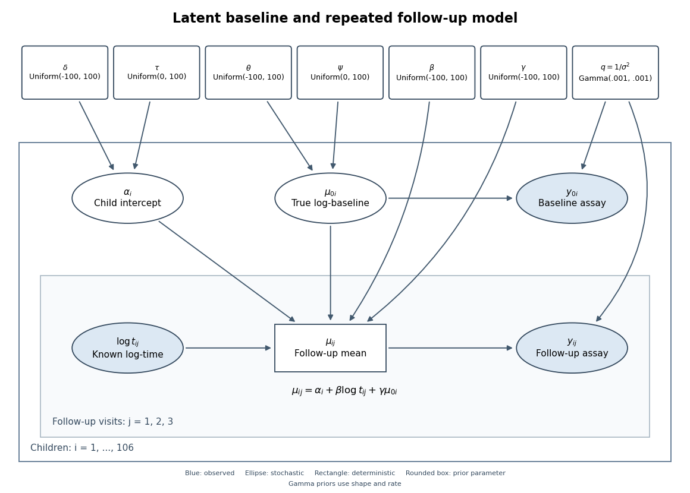

<h1 id="4/e/solution">Solution</h1>

↑ **Parent:** [E](../e.md)

Model 2 is an [errors-in-variables model](../../../../../../errors-in-variables-model.md): the follow-up regression depends on a latent true baseline rather than substituting its noisy observation. A common [normal distribution](../../../../../../normal-distribution.md) for the true baselines provides [partial pooling](../../../../../../partial-pooling.md) and allows uncertainty about each baseline to propagate to the regression coefficients and predictions. Conditional on the shared parameters, the child-specific factorization is

$$
p(\alpha_i\mid\delta,\tau)\,p(\mu_{0i}\mid\theta,\psi)\,p(y_{0i}\mid\mu_{0i},q)
\prod_{j=1}^3p(y_{ij}\mid\alpha_i,\mu_{0i},\beta,\gamma,q,t_{ij}),\qquad q=1/\sigma^2.
$$

The [Directed acyclic graph](../../../../../../directed-acyclic-graph.md) below includes the shared parameters, the two local [latent variables](../../../../../../latent-variable.md), both observed measurements, and the deterministic regression mean. The outer plate repeats over children and the inner plate over follow-up visits. Filled nodes are observed; rectangular mean nodes are deterministic.

<a id="4/e/image-directed-graph-of-the-latent-baseline-random-intercept-model-including-shared-priors-baseline-measurement-error-and-repeated-follow-up-visits"></a>


**[Figure 1](#4/e/image-directed-graph-of-the-latent-baseline-random-intercept-model-including-shared-priors-baseline-measurement-error-and-repeated-follow-up-visits). Directed graph of the latent-baseline random-intercept model, including shared priors, baseline measurement error and repeated follow-up visits**.

One complete adapted [BUGS](../../../../../../bugs.md) specification uses the non-centered form of the [random intercept](../../../../../../random-intercept.md), retaining the original priors and adding proper broad priors for $\theta$ and $\psi$:

```
for (i in 1:N) {
  z[i] ~ dnorm(0, 1)
  alpha[i] <- delta + tau*z[i]
  truebase[i] ~ dnorm(theta, baseprec)
  baseline[i] ~ dnorm(truebase[i], noiseprec)
  for (j in 1:3) {
    followmean[i,j] <- alpha[i] + beta*log(time[i,j]) + gamma*truebase[i]
    followup[i,j] ~ dnorm(followmean[i,j], noiseprec)
  }
}
noiseprec ~ dgamma(0.001, 0.001)
beta ~ dunif(-100, 100)
gamma ~ dunif(-100, 100)
delta ~ dunif(-100, 100)
tau ~ dunif(0, 100)
theta ~ dunif(-100, 100)
psi ~ dunif(0, 100)
baseprec <- 1/(psi*psi)
```

Here $N$ is the number of children, `baseline` and `followup` contain the observed data, and `dnorm` uses precision rather than variance. The priors on the newly introduced population baseline mean and standard deviation are explicit choices, not consequences of the likelihood; sensible alternatives can be checked for sensitivity. The code uses the noisy baseline only in its own measurement likelihood, and uses `truebase` in every follow-up mean.

## ↑ Ancestors (11)

1. [E](../e.md)
2. [4](../../4.md)
3. [Paper 36](../../../paper-36-split.md)
4. [Iii](../../../split.md)
5. [2010](../../../../split.md)
6. [Past exam of the mathematics course of the University of Cambridge](../../../../../split.md)
7. [Mathematics course of the University of Cambridge](../../../../../../mathematics-course-of-the-university-of-cambridge.md)
8. [Course of the University of Cambridge](../../../../../../course-of-the-university-of-cambridge.md)
9. [University of Cambridge](../../../../../../university-of-cambridge-split.md)
10. [List of universities](../../../../../../list-of-universities.md)
11. [Codex Wiki](../../../../../../split.md)
