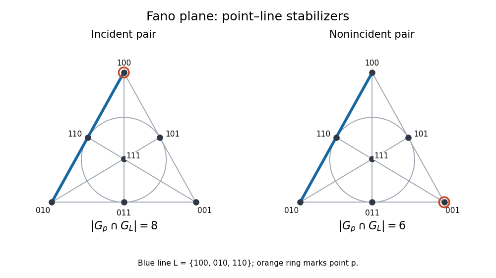

# Paper 4

↑ **Parent:** [Iii](../iii.md)

[https://www.maths.cam.ac.uk/postgrad/part-iii/files/pastpapers/2010/Paper4.pdf](https://www.maths.cam.ac.uk/postgrad/part-iii/files/pastpapers/2010/Paper4.pdf)

**Table of contents**

- [1](#1)
  - [i](#1/i)
    - [Solution](#1/i/solution)
  - [ii](#1/ii)
    - [Solution](#1/ii/solution)
  - [iii](#1/iii)
    - [Solution](#1/iii/solution)
  - [iv](#1/iv)
    - [Solution](#1/iv/solution)
- [2](#2)
  - [i](#2/i)
    - [Solution](#2/i/solution)
  - [ii](#2/ii)
    - [Solution](#2/ii/solution)
- [3](#3)
  - [i](#3/i)
    - [Solution](#3/i/solution)
  - [ii](#3/ii)
    - [Solution](#3/ii/solution)
- [4](#4)
  - [i](#4/i)
    - [Solution](#4/i/solution)
  - [ii](#4/ii)
    - [Solution](#4/ii/solution)
  - [iii](#4/iii)
    - [Solution](#4/iii/solution)
  - [iv](#4/iv)
    - [Solution](#4/iv/solution)
- [5](#5)
  - [Solution](#5/solution)

## 1

↑ **Parent:** [Paper 4](paper-4.md)

<h3 id="1/i">i</h3>

↑ **Parent:** [1](#1)

<h4 id="1/i/solution">Solution</h4>

↑ **Parent:** [I](#1/i)

A [nilpotent group](../../../group-theory.md#nilpotent-group) has a finite [central series](../../../group-theory.md#central-series)

$$
1=Z_0\le Z_1\le\cdots\le Z_c=G,\qquad [G,Z_{j+1}]\le Z_j.
$$

Equivalently the [upper central series](../../../group-theory.md#upper-central-series), defined by $Z_{j+1}/Z_j=Z(G/Z_j)$, reaches $G$.

We first prove the [normalizer condition for nilpotent groups](../../../group-theory.md#normalizer-condition-for-nilpotent-groups). If $H<G$, choose the least $j$ with $Z_j\not\subseteq H$. Then $Z_{j-1}\le H$, and an element $z\in Z_j\setminus H$ satisfies $[z,H]\le Z_{j-1}\le H$. Thus $z$ normalizes $H$, giving $H<N_G(H)$.

Let $P$ be a [Sylow subgroup](../../../finite-group-theory.md#sylow-subgroup) of a finite nilpotent $G$, and write $N=N_G(P)$. If $N<G$, the [normalizer](../../../group-theory.md#normalizer) condition gives some $g\in N_G(N)\setminus N$. The [subgroups](../../../group.md#subgroup) $P$ and $P^g$ are both [Sylow subgroups](../../../finite-group-theory.md#sylow-subgroup) of $N$, so [Sylow theorem](../../../finite-group-theory.md#sylow-theorems) supplies $n\in N$ with $P^{gn}=P$. But then $gn\in N_G(P)=N$, forcing $g\in N$, a contradiction. Therefore every [Sylow subgroup](../../../finite-group-theory.md#sylow-subgroup) is a [normal subgroup](../../../group-theory.md#normal-subgroup) of $G$.

For normal [Sylow subgroups](../../../finite-group-theory.md#sylow-subgroup) $P,Q$ at different primes, $[P,Q]\le P\cap Q=1$. They commute, have coprime orders, and their product has order $|G|$. Multiplication consequently gives an isomorphism from their external [direct product of groups](../../../group-theory.md#direct-product-of-groups) onto $G$.

Conversely, a nontrivial [finite p-group](../../../finite-group-theory.md#finite-p-group) has nontrivial [center of a group](../../../group-theory.md#center-of-a-group): its [class equation](../../../group-theory.md#class-equation) has every noncentral conjugacy-class size divisible by $p$, so $|Z(G)|$ is a positive multiple of $p$. Induction on order, applied to $G/Z(G)$, gives a central series for $G$. Finite direct products of these central series give a central series for the product, padding shorter series by the full factor. Thus the [finite nilpotent group decomposition](../../../group-theory.md#finite-nilpotent-group-decomposition) is

$$
\boxed{G\text{ nilpotent}\ \Longleftrightarrow\
G\cong\prod_{p\mid |G|}P_p.}
$$

<h3 id="1/ii">ii</h3>

↑ **Parent:** [1](#1)

<h4 id="1/ii/solution">Solution</h4>

↑ **Parent:** [Ii](#1/ii)

For a finite group, define the [Frattini subgroup](../../../finite-group-theory.md#frattini-subgroup) by

$$
\Phi(G)=\bigcap_{M\text{ maximal in }G}M;
$$

the intersection is $G$ when there are no [maximal subgroups](../../../group.md#maximal-subgroup), which for a finite group happens only for $G=1$. A second definition is the set of [non-generators](../../../finite-group-theory.md#non-generator-of-a-finite-group): an element $x$ such that $\langle S,x\rangle=G$ always implies $\langle S\rangle=G$.

If $x\in\Phi(G)$ and $H=\langle S\rangle<G$, put $H$ in a [maximal subgroup](../../../group.md#maximal-subgroup) $M$. Then $x\in M$, so $\langle S,x\rangle\le M<G$. Conversely, if $x\notin\Phi(G)$, some [maximal subgroup](../../../group.md#maximal-subgroup) $M$ omits it; maximality gives $\langle M,x\rangle=G$, although $M\ne G$. This proves equivalence.

Every [group automorphism](../../../algebra.md#group-automorphism) permutes [maximal subgroups](../../../group.md#maximal-subgroup), so $\Phi(G)$ is a [characteristic subgroup](../../../algebra.md#characteristic-subgroup), in particular a [normal subgroup](../../../group-theory.md#normal-subgroup). Also

$$
H\Phi(G)=G\quad\Longrightarrow\quad H=G:
$$

a proper $H$ would lie in a [maximal subgroup](../../../group.md#maximal-subgroup) containing both factors.

Set $F=\Phi(G)$ and take a [Sylow subgroup](../../../finite-group-theory.md#sylow-subgroup) $P$ of $F$. For $g\in G$, normality of $F$ makes $P^g$ a [Sylow subgroup](../../../finite-group-theory.md#sylow-subgroup) of $F$. Conjugating inside $F$ therefore gives the [Frattini argument](../../../finite-group-theory.md#frattini-argument) factorization $G=F N_G(P)$. The preceding generating property forces $N_G(P)=G$. Thus every [Sylow subgroup](../../../finite-group-theory.md#sylow-subgroup) of $F$ is normal, and part (i) shows that $F$ is a [nilpotent group](../../../group-theory.md#nilpotent-group).

Now suppose $G$ is a [finite p-group](../../../finite-group-theory.md#finite-p-group). The [normalizer](../../../group-theory.md#normalizer) condition makes every [maximal subgroup](../../../group.md#maximal-subgroup) $M$ normal: $M<N_G(M)$ and maximality force $N_G(M)=G$. The quotient $G/M$ has no proper nontrivial [subgroup](../../../group.md#subgroup), hence is cyclic of prime order; its p-power order makes that prime $p$. Consequently every such $M$ contains

$$
D=[G,G]G^p,
$$

where the two factors are the [commutator subgroup](../../../group-theory.md#commutator-subgroup) and the [subgroup](../../../group.md#subgroup) generated by pth powers. Thus $D\le\Phi(G)$.

The quotient $G/D$ is an [elementary abelian group](../../../group.md#elementary-abelian-group), hence a [vector space](../../../vector-space.md) over $\mathbb F_p$. If $x\notin D$, extend the nonzero [vector](../../../vector-space.md#vector) $xD$ to a [basis](../../../vector-space.md#basis) and choose a [linear functional](../../../linear-algebra.md#linear-functional) nonzero on it. Its kernel pulls back to a [subgroup](../../../group.md#subgroup) of index $p$, a [maximal subgroup](../../../group.md#maximal-subgroup) omitting $x$. Therefore $x\notin\Phi(G)$, proving

$$
\boxed{\Phi(G)\text{ is characteristic and nilpotent},\qquad
\Phi(G)=[G,G]G^p\text{ for finite p-groups}.}
$$

The two factors in the last formula are multiplied; the superscripted expression in the TeX aid is not the formula printed in the PDF.

<h3 id="1/iii">iii</h3>

↑ **Parent:** [1](#1)

<h4 id="1/iii/solution">Solution</h4>

↑ **Parent:** [Iii](#1/iii)

For a subset $S$ of a [finite p-group](../../../finite-group-theory.md#finite-p-group), its images span the [Frattini quotient](../../../finite-group-theory.md#frattini-quotient) precisely when $\langle S\rangle\Phi(G)=G$. By the generating property proved in part (ii), this is equivalent to $\langle S\rangle=G$.

If $S$ is a [minimal generating set of a group](../../../group.md#minimal-generating-set-of-a-group), its images must be an irredundant spanning set in the [vector space](../../../vector-space.md) $G/\Phi(G)$. A linear dependence would express one image using the others; those other images would still span, so the other elements would still generate $G$, a contradiction. Thus the images form a [basis](../../../vector-space.md#basis). Conversely lifts of a [basis](../../../vector-space.md#basis) generate $G$, and deleting a lift destroys spanning and hence generation.

This proves the [Burnside basis theorem](../../../finite-group-theory.md#burnside-basis-theorem), including equality of sizes for every inclusion-minimal [generating set of a group](../../../group.md#generating-set-of-a-group):

$$
\boxed{|S|=\dim_{\mathbb F_p}G/\Phi(G)
=\log_p|G:\Phi(G)|.}
$$

Inclusion-minimal [generating sets of a group](../../../group.md#generating-set-of-a-group) need not have equal sizes in arbitrary finite groups; the elementary-abelian Frattini quotient is the essential p-group feature.

<h3 id="1/iv">iv</h3>

↑ **Parent:** [1](#1)

<h4 id="1/iv/solution">Solution</h4>

↑ **Parent:** [Iv](#1/iv)

Use rightmost-first composition of [permutations](../../../combinatorics.md#permutation), and let

$$
a=(1\,2\,\cdots\,n),\qquad b=(n-1\,n-2\,\cdots\,1).
$$

For $n\ge2$, direct evaluation gives $ab=(1\,n)$. Conjugating this [transposition](../../../combinatorics.md#transposition-permutation) by powers of $a$ yields the [transpositions](../../../combinatorics.md#transposition-permutation) between consecutive letters around the cycle, including $(1\,2),(2\,3),\ldots,(n-1\,n)$.

Put $s_i=(i\,i+1)$. For $i<j$,

$$
(i\,j)=s_i s_{i+1}\cdots s_{j-2}s_{j-1}s_{j-2}\cdots s_{i+1}s_i.
$$

Thus the adjacent [transpositions](../../../combinatorics.md#transposition-permutation) generate every [transposition](../../../combinatorics.md#transposition-permutation), and [permutation cycle](../../../finite-group-theory.md#permutation-cycle) decomposition shows that [transpositions](../../../combinatorics.md#transposition-permutation) generate the [symmetric group](../../../finite-group-theory.md#symmetric-group). Therefore $\langle a,b\rangle=S_n$.

For the final lower bound, associate a [graph](../../../graph.md) to a family of [transpositions](../../../combinatorics.md#transposition-permutation): its vertices are the letters and its edges are the swapped pairs. Every generator preserves every connected component, so generation of $S_n$ requires that [graph](../../../graph.md) to be connected. A connected [graph](../../../graph.md) on $n$ vertices needs at least $n-1$ edges: adding an edge can reduce the number of components by at most one, starting from $n$ isolated vertices. The adjacent [transpositions](../../../combinatorics.md#transposition-permutation) supply exactly $n-1$ edges. Equivalently, [transpositions on a connected graph generate the symmetric group](../../../finite-group-theory.md#transpositions-on-a-connected-graph-generate-the-symmetric-group). Hence

$$
\boxed{\text{The least number of transpositions generating }S_n\text{ is }n-1.}
$$

## 2

↑ **Parent:** [Paper 4](paper-4.md)

<h3 id="2/i">i</h3>

↑ **Parent:** [2](#2)

<h4 id="2/i/solution">Solution</h4>

↑ **Parent:** [I](#2/i)

We prove the [primitive three-cycle criterion](../../../group-theory.md#primitive-three-cycle-criterion) through supports. First, suppose a [subgroup](../../../group.md#subgroup) contains $A_U$, the [alternating group](../../../finite-group-theory.md#alternating-group) on a set $U$ of at least three letters, and a [three-cycle](../../../finite-group-theory.md#three-cycle) with support $E$ meeting $U$.

If $E$ adds one letter, it has two letters in $U$. The group $A_U$ is transitive on unordered pairs of $U$: for three letters its cyclic action permutes the three pairs, and for at least four letters one can adjust the parity of a [permutation](../../../combinatorics.md#permutation) sending one pair to another while preserving its target pair. Conjugating the new cycle, and using inverses, supplies every [three-cycle](../../../finite-group-theory.md#three-cycle) on two old letters and the new letter. Together with $A_U$, these generate $A_{U\cup E}$.

If $E$ adds two letters, write its cycle as $\tau=(a\,b\,c)$ with $a\in U$. Choose $a'\in U\setminus\{a\}$ and conjugate within $A_U$ to obtain $\tau'=(a'\,b\,c)$. Then

$$
\tau(\tau')^{-1}=(a\,b\,a').
$$

The preceding case first adds $b$; applying it again to $\tau$ adds $c$. This proves [connected triple supports generate an alternating group](../../../finite-group-theory.md#connected-triple-supports-generate-an-alternating-group), by successively merging the intersecting triples of a connected support hypergraph. We used that [three-cycles](../../../finite-group-theory.md#three-cycle) generate [alternating groups](../../../finite-group-theory.md#alternating-group): pairs of [transpositions](../../../combinatorics.md#transposition-permutation) with a common letter are [three-cycles](../../../finite-group-theory.md#three-cycle), while a pair of disjoint [transpositions](../../../combinatorics.md#transposition-permutation) is a product of two [three-cycles](../../../finite-group-theory.md#three-cycle).

Now take all conjugates in $G$ of the given [three-cycle](../../../finite-group-theory.md#three-cycle). Their support hypergraph is $G$-invariant, and its connected components form a [block system](../../../group-theory.md#block-system). Transitivity makes their union the whole set. There is an edge, so a component has more than one vertex. A [primitive group action](../../../group-theory.md#primitive-group-action) forces a single component. The preceding merging argument proves

$$
\boxed{A_n\le G.}
$$

For the first family of counterexamples, let

$$
G=PGL_2(p)\curvearrowright\mathbb P^1(\mathbb F_p),\qquad p>3.
$$

Its elements are [Möbius transformations](../../../group-theory.md#mobius-transformation) $x\mapsto(ax+b)/(cx+d)$, modulo nonzero scalar [matrices](../../../vector-space.md#matrix). Any ordered triple of distinct [projective points](../../../projective-space.md#projective-point) is the image of $(\infty,0,1)$ under exactly one such transformation: representatives of the first two target lines form a [basis](../../../vector-space.md#basis), and scaling the two columns sends their sum to the third target line. Thus the action is [sharply three-transitive](../../../group-theory.md#sharp-three-transitivity), hence [two-transitive](../../../group-theory.md#two-transitive-group-action) and primitive. Its degree is $p+1$ and order $p(p^2-1)$. It is divisible by $p$, but

$$
\frac{|A_{p+1}|}{|PGL_2(p)|}=\frac{(p-2)!}{2}>1,
$$

so it cannot contain $A_{p+1}$.

For the second example take

$$
\boxed{p=7,\quad G=PGL_2(8),\quad n=9,\quad |G|=504.}
$$

The same projective-line construction over $\mathbb F_8$ is [sharply three-transitive](../../../group-theory.md#sharp-three-transitivity). Its order is divisible by 7 and is less than $|A_9|=181440$, so it does not contain $A_9$. For a concrete field one can use $\mathbb F_8=\mathbb F_2[u]/(u^3+u+1)$.

<h3 id="2/ii">ii</h3>

↑ **Parent:** [2](#2)

<h4 id="2/ii/solution">Solution</h4>

↑ **Parent:** [Ii](#2/ii)

Use the displayed formula as a right [group action](../../../group-theory.md#group-action): applying $(a,b)$ and then $(c,d)$ gives $(ac,bd)$. It is transitive since $(1,t)$ sends the identity to $t$. An element fixing every $t$ must have $a=b$ by evaluating at the identity, and then $a^{-1}ta=t$ for every $t$. Its kernel is therefore $\{(z,z):z\in Z(T)\}$, which is trivial by the [center of a group](../../../group-theory.md#center-of-a-group) hypothesis.

The identity [stabilizer subgroup](../../../group-theory.md#stabilizer-subgroup) is $\Delta=\{(a,a):a\in T\}$. For every [subgroup](../../../group.md#subgroup) $H$ containing $\Delta$, set

$$
N=\{b:(1,b)\in H\}.
$$

Conjugation by diagonal elements makes $N$ normal in $T$. Multiplying $(a,b)\in H$ by $(a,a)^{-1}$ shows $(1,a^{-1}b)\in H$, so

$$
H=\{(a,b):a^{-1}b\in N\}.
$$

Conversely each [normal subgroup](../../../group-theory.md#normal-subgroup) $N$ gives such an $H$. Thus the [subgroups](../../../group.md#subgroup) strictly between $\Delta$ and $T\times T$ correspond exactly to proper nontrivial [normal subgroups](../../../group-theory.md#normal-subgroup) of $T$.

For a transitive action, blocks containing a chosen point correspond to [subgroups](../../../group.md#subgroup) containing its [stabilizer subgroup](../../../group-theory.md#stabilizer-subgroup): a block is the orbit of that point under its setwise [stabilizer subgroup](../../../group-theory.md#stabilizer-subgroup), and conversely the orbit under an intermediate [subgroup](../../../group.md#subgroup) gives a block. Therefore the [diagonal action on a centerless group](../../../group-theory.md#diagonal-action-on-a-centerless-group) is primitive exactly when $T$ is simple. A nontrivial centerless [simple group](../../../finite-group-theory.md#simple-group) cannot be abelian, because an abelian group's [center of a group](../../../group-theory.md#center-of-a-group) is the whole group. Hence

$$
\boxed{\text{The action is faithful and transitive, and primitive iff }T
\text{ is nonabelian simple}.}
$$

This uses the usual nontrivial degree convention. If one allows a one-point action to count as primitive, $T=1$ is the additional degenerate exception.

For the requested order example use $T=A_5$. Its simplicity follows from its conjugacy-class sizes $1,15,20,12,12$: a [normal subgroup](../../../group-theory.md#normal-subgroup) is a union of classes containing the identity, and no proper nontrivial such sum divides 60. Set $p=59$, a prime. The primitive diagonal action has

$$
\boxed{n=60=p+1,\qquad G=A_5\times A_5,\qquad |G|=3600,\quad59\nmid3600.}
$$

## 3

↑ **Parent:** [Paper 4](paper-4.md)

<h3 id="3/i">i</h3>

↑ **Parent:** [3](#3)

<h4 id="3/i/solution">Solution</h4>

↑ **Parent:** [I](#3/i)

Work in the finite-group setting. If $M$ is maximal in a nonabelian simple $G$, then $M\ne1$: otherwise every nonidentity element would generate $G$, forcing a cyclic group of prime order. Choose a [minimal normal subgroup](../../../group-theory.md#minimal-normal-subgroup) $N\ne1$ of $M$. Every [characteristic subgroup](../../../algebra.md#characteristic-subgroup) of $N$ is normal in $M$, so minimality makes $N$ a [characteristically simple group](../../../algebra.md#characteristically-simple-group). Its [normalizer](../../../group-theory.md#normalizer) contains $M$. By maximality it is $M$ or $G$, and the latter would make $N$ a nontrivial [normal subgroup](../../../group-theory.md#normal-subgroup) of the [simple group](../../../finite-group-theory.md#simple-group) $G$, impossible because $N\le M<G$. This proves the [maximal subgroup normalizer criterion](../../../group.md#maximal-subgroup-normalizer-criterion):

$$
\boxed{M=N_G(N)\text{ for some characteristically simple }N.}
$$

For $A_5$, [stabilizer subgroups](../../../group-theory.md#stabilizer-subgroup) have order 12. [Stabilizer subgroups](../../../group-theory.md#stabilizer-subgroup) of a two-element subset have order $|(S_2\times S_3)\cap A_5|=6$, and are isomorphic to $S_3$; for example $\langle(1\,2\,3),(1\,2)(4\,5)\rangle$. The [normalizer](../../../group-theory.md#normalizer) of a Sylow 5-subgroup has order 10: its [normalizer](../../../group-theory.md#normalizer) in $S_5$ has order $5\cdot4$, and exactly half its [permutations](../../../combinatorics.md#permutation) are even, since a multiplier of order four on $\mathbb F_5$ is an odd four-cycle. This gives a [dihedral group](../../../finite-group-theory.md#dihedral-group) of order 10.

To prove completeness, an intransitive [subgroup](../../../group.md#subgroup) either fixes a point, or its orbits on five letters have sizes two and three. It therefore lies in one of the first two types. A transitive proper [subgroup](../../../group.md#subgroup) $H$ has order divisible by 5. Its number of Sylow 5-subgroups is one or six, since $A_5$ has six and the count is $1$ modulo 5. A count of six would make $30\mid |H|$, forcing an index-two [subgroup](../../../group.md#subgroup) and contradicting [Simplicity of the alternating group A5](../../../finite-group-theory.md#simplicity-of-the-alternating-group-a5). Therefore $H$ normalizes its unique Sylow 5-subgroup and lies in the order-ten [normalizer](../../../group-theory.md#normalizer).

[Stabilizer subgroups](../../../group-theory.md#stabilizer-subgroup) are maximal because their index is prime. The order-ten group is transitive and cannot have a larger proper transitive overgroup by the preceding argument. The order-six group has no fixed point, cannot lie in a [stabilizer subgroup](../../../group-theory.md#stabilizer-subgroup), and cannot lie in the order-ten type because 3 does not divide 10. Thus all three types are maximal. $A_5$ is transitive on points and on unordered pairs, while Sylow conjugacy handles the [normalizers](../../../group-theory.md#normalizer). Consequently

$$
\boxed{A_5:\text{ three maximal-subgroup classes, of orders }6,\ 10,\ 12.}
$$

Now let $G=GL_3(2)$. Choosing independent columns gives $|G|=7\cdot6\cdot4=168$. Its simplicity follows from the elementary projective-transvection proof in part 4(i), which does not use this [subgroup](../../../group.md#subgroup) classification.

A [stabilizer subgroup](../../../group-theory.md#stabilizer-subgroup) and a plane [stabilizer subgroup](../../../group-theory.md#stabilizer-subgroup) each have index seven and order 24. To construct the remaining type, identify $\mathbb F_2^3$ with $\mathbb F_8$ and take the [Singer cycle](../../../finite-group-theory.md#singer-cycle) $P$ of multiplications by nonzero field elements, of order seven. Any [linear map](../../../vector-space.md#linear-map) commuting with a primitive multiplication commutes with all of $\mathbb F_8$, so its [centralizer](../../../group-theory.md#centralizer) is precisely $P$. A [normalizer](../../../group-theory.md#normalizer) sends a primitive element $a$ to another root of its minimum polynomial, namely $a,a^2,a^4$. The Frobenius map $x\mapsto x^2$ realizes those three choices. Hence

$$
N_G(P)=P\rtimes C_3,\qquad |N_G(P)|=21,\qquad n_7(G)=8.
$$

If $7\mid |H|$ for a proper $H<G$, its Sylow count is one or eight. Eight would make $56\mid|H|$, hence $|H|=56$. Its index-three [coset](../../../group-theory.md#coset) action would inject the [simple group](../../../finite-group-theory.md#simple-group) $G$ into $S_3$: the kernel is normal and cannot be all of $G$. This is impossible. Thus $H$ normalizes a unique Sylow 7-subgroup and lies in the order-21 [normalizer](../../../group-theory.md#normalizer).

If $7\nmid |H|$, its order divides 24. In its action on seven nonzero [vectors](../../../vector-space.md#vector), an odd orbit has size one or three. A one-point orbit gives a fixed point. If a three-point orbit is collinear, it is the set of nonzero [vectors](../../../vector-space.md#vector) of an invariant plane. If its three [vectors](../../../vector-space.md#vector) are independent, their nonzero sum is fixed by $H$. Thus $H$ lies in a point or plane [stabilizer subgroup](../../../group-theory.md#stabilizer-subgroup).

The index-seven [stabilizer subgroups](../../../group-theory.md#stabilizer-subgroup) are maximal, and any proper overgroup of the order-21 [normalizer](../../../group-theory.md#normalizer) would again have a unique Sylow 7-subgroup and normalize that same [subgroup](../../../group.md#subgroup), so the [normalizer](../../../group-theory.md#normalizer) is maximal too. The point and plane [stabilizer subgroups](../../../group-theory.md#stabilizer-subgroup) are not conjugate: a [stabilizer subgroup](../../../group-theory.md#stabilizer-subgroup) fixes a point, whereas a plane [stabilizer subgroup](../../../group-theory.md#stabilizer-subgroup) is transitive on its three internal points and its four external points, so fixes no point. Each type is one [conjugacy class](../../../group-theory.md#conjugacy-class). We have proved [maximal subgroups of GL3 over F2](../../../finite-group-theory.md#maximal-subgroups-of-gl3-over-f2):

$$
\boxed{GL_3(2):\text{ three classes, of orders }21,\ 24,\ 24.}
$$

<h3 id="3/ii">ii</h3>

↑ **Parent:** [3](#3)

<h4 id="3/ii/solution">Solution</h4>

↑ **Parent:** [Ii](#3/ii)

The [Fano plane](../../../projective-space.md#fano-plane) has as points the seven nonzero [vectors](../../../vector-space.md#vector) of $\mathbb F_2^3$, because every one-dimensional [vector subspace](../../../vector-space.md#vector-subspace) has just one nonzero [vector](../../../vector-space.md#vector). Its lines are the seven two-dimensional [vector subspaces](../../../vector-space.md#vector-subspace). Every line has three points, every point lies on three lines, two points determine the line $\{u,v,u+v\}$, and two lines meet in one point.

The two order-24 classes are therefore [stabilizer subgroups](../../../group-theory.md#stabilizer-subgroup) of points and of lines. Each is isomorphic to $S_4$: fixing a [vector](../../../vector-space.md#vector) gives the block group $\mathbb F_2^2\rtimes GL_2(2)$, the full affine group on four points; inverse transpose gives the dual line [stabilizer subgroup](../../../group-theory.md#stabilizer-subgroup). Their distinct fixed-point behavior in part (i) distinguishes the two [conjugacy classes](../../../group-theory.md#conjugacy-class).

For a point $p$ and line $L$, $G_p\cap G_L$ stabilizes the ordered pair $(p,L)$. There are $7\cdot3=21$ incident pairs and $7\cdot4=28$ nonincident pairs. A change of [basis](../../../vector-space.md#basis) takes any pair to a fixed model of its type, so each type is a single orbit. [Orbit-stabilizer theorem](../../../group-theory.md#orbit-stabilizer-theorem) gives the [Fano point-line stabilizer intersection](../../../projective-space.md#fano-point-line-stabilizer-intersection):

$$
\boxed{|G_p\cap G_L|=
\begin{cases}
8,&p\in L,\\
6,&p\notin L.
\end{cases}}
$$

Both occur: take $L=\langle e_1,e_2\rangle$ and choose $p=\langle e_1\rangle$ or $p=\langle e_3\rangle$.

**[Figure 1](#3/ii/image-fano-plane-with-incident-and-nonincident-point-line-pairs). Fano plane with incident and nonincident point-line pairs**.

For the extension, identify [vectors](../../../vector-space.md#vector) and covectors by the standard pairing. The [inverse-transpose automorphism](../../../finite-group-theory.md#inverse-transpose-automorphism) exchanges a point with its orthogonal plane and exchanges the two order-24 classes. Thus it is outer. The [Fano plane duality group](../../../projective-space.md#fano-plane-duality-group) $\overline G=G\rtimes\langle\tau\rangle$ has order 336 and acts on points and lines, preserving incidence while allowing their types to be swapped.

The [stabilizer subgroup](../../../group-theory.md#stabilizer-subgroup) of an unordered point-line pair has twice the corresponding ordered-pair [stabilizer subgroup](../../../group-theory.md#stabilizer-subgroup): some element outside $G$ swaps the pair, since duality produces a pair of the same incidence type and $G$ is transitive on such pairs. Hence these [stabilizer subgroups](../../../group-theory.md#stabilizer-subgroup) have orders 16 and 12. Also every outside conjugate of a Sylow 7-subgroup can be moved back by an element of $G$, giving

$$
|N_{\overline G}(P)|=2|N_G(P)|=42.
$$

We prove these exhaust the [maximal subgroups](../../../group.md#maximal-subgroup) other than $G$. Let $K$ be such a [maximal subgroup](../../../group.md#maximal-subgroup) and $H=K\cap G$. Since $K$ is not contained in $G$, $H$ is normal in $K$ and $|K:H|=2$. If $7\mid|H|$, part (i) gives a unique Sylow 7-subgroup $P$ of $H$. It is characteristic in $H$, hence normalized by $K$. Therefore maximality forces $K=N_{\overline G}(P)$.

Suppose $7\nmid|H|$ and $H\ne1$. The classification argument in part (i) says $H$ fixes a point or a line. Because $H$ is normal in $K$, an element outside $G$ swaps its fixed-point and fixed-line sets, so it fixes at least one of each. Write

$$
d=\dim V^H,\qquad d^*=\dim(V^*)^H.
$$

Fixed lines are kernels of fixed nonzero covectors, since the only nonzero scalar is one. Duality gives $2^d-1=2^{d^*}-1$, hence $d=d^*\in\{1,2\}$.

If $d=1$, there is a unique fixed point and unique fixed line; $K$ preserves their unordered pair. If $d=2$, put $W=V^H$ and $A=((V^*)^H)^\perp$. For every $h\in H$, $\ker(h-I)$ contains the plane $W$ and $\operatorname{im}(h-I)$ lies in the line $A$. Over $\mathbb F_2$ there is only one nonzero [linear map](../../../vector-space.md#linear-map) $V/W\to A$, so $H$ has order two. Invertibility forces $A\subseteq W$: for $h=I+v f$ one needs $f(v)=0$. Thus $A$ and $W$ are its unique image point and kernel line. These are canonically swapped by duality, so $K$ again preserves their unordered incident pair.

If $H=1$, then $K$ has order two, generated by an involutory duality $u$. For any point $p$, the pair $\{p,u(p)\}$ is preserved by $u$. Hence $K$ lies in an order-12 or order-16 pair [stabilizer subgroup](../../../group-theory.md#stabilizer-subgroup) and is not maximal. We have exhausted all cases.

The pair [stabilizer subgroups](../../../group-theory.md#stabilizer-subgroup) are themselves maximal: a proper maximal overgroup is one of the just-listed types, and divisibility excludes orders 12 inside 16 or 42, and 16 inside 12 or 42. The order-42 [normalizer](../../../group-theory.md#normalizer) is maximal by the unique-Sylow argument. Incidence types give one [conjugacy class](../../../group-theory.md#conjugacy-class) each; Sylow conjugacy gives one [normalizer](../../../group-theory.md#normalizer) class. Thus, apart from the normal index-two [subgroup](../../../group.md#subgroup) $G$,

$$
\boxed{\overline G:\text{ three maximal-subgroup classes, of orders }12,\ 16,\ 42.}
$$

## 4

↑ **Parent:** [Paper 4](paper-4.md)

<h3 id="4/i">i</h3>

↑ **Parent:** [4](#4)

<h4 id="4/i/solution">Solution</h4>

↑ **Parent:** [I](#4/i)

Let $F=\mathbb F_q$. The [general linear group over a finite field](../../../finite-group-theory.md#general-linear-group-over-a-finite-field) consists of all invertible [linear maps](../../../vector-space.md#linear-map) $F^n\to F^n$, and the [special linear group over a finite field](../../../finite-group-theory.md#special-linear-group-over-a-finite-field) is its determinant-one [subgroup](../../../group.md#subgroup). Counting the ordered [bases](../../../vector-space.md#basis) gives

$$
|GL_n(q)|=\prod_{i=0}^{n-1}(q^n-q^i)
=q^{n(n-1)/2}\prod_{j=1}^{n}(q^j-1).
$$

The [determinant](../../../linear-algebra.md#determinant) map is onto $F^\times$, since $\operatorname{diag}(t,1,\ldots,1)$ has [determinant](../../../linear-algebra.md#determinant) $t$. Its kernel is $SL_n(q)$, so

$$
\boxed{|SL_n(q)|=\frac{|GL_n(q)|}{q-1}.}
$$

For $n>1$, commuting with all the [elementary transvection matrices](../../../vector-space.md#elementary-transvection-matrix) $I+tE_{ij}$ forces a [matrix](../../../vector-space.md#matrix) to be scalar. Therefore the [center of a group](../../../group-theory.md#center-of-a-group) of $SL_n(q)$ consists of $\lambda I$ with $\lambda^n=1$. The multiplicative group of a [finite field](../../../algebra.md#finite-field) is cyclic, so this [center of a group](../../../group-theory.md#center-of-a-group) has size $d=\gcd(n,q-1)$. The [projective special linear group over a finite field](../../../finite-group-theory.md#projective-special-linear-group-over-a-finite-field) consequently has order

$$
|PSL_n(q)|=\frac{q^{n(n-1)/2}\prod_{j=2}^n(q^j-1)}{\gcd(n,q-1)}.
$$

Here is a proof of simplicity which isolates all the required ingredients. First we prove the [Iwasawa simplicity lemma](../../../finite-group-theory.md#iwasawa-simplicity-lemma) in the form needed. Suppose a group $H$ acts faithfully and primitively, is a [perfect group](../../../group-theory.md#perfect-group), and has an abelian [subgroup](../../../group.md#subgroup) $U$ normal in a [stabilizer subgroup](../../../group-theory.md#stabilizer-subgroup) $H_\alpha$, whose conjugates generate $H$. For a nontrivial [normal subgroup](../../../group-theory.md#normal-subgroup) $N$, its orbits form a [block system](../../../group-theory.md#block-system). Faithfulness prevents all these orbits from being singletons, so primitivity makes $N$ transitive. Thus $H=NH_\alpha$. Modulo $N$, each conjugate of $U$ has exactly the same image as $U$, because we may write its conjugating element as $nh$ with $n\in N$ and $h\in H_\alpha$. The quotient $H/N$ is generated by this one abelian image and hence is abelian. Since $H$ is a [perfect group](../../../group-theory.md#perfect-group), $H/N=1$. Thus every nontrivial [normal subgroup](../../../group-theory.md#normal-subgroup) is $H$.

Apply this to the action on [projective points](../../../projective-space.md#projective-point), that is, one-dimensional [vector subspaces](../../../vector-space.md#vector-subspace) of $F^n$. Any ordered pair of distinct lines can be sent to any other by a [linear map](../../../vector-space.md#linear-map) obtained by extending representatives to [bases](../../../vector-space.md#basis). Multiplying one target [basis](../../../vector-space.md#basis) [vector](../../../vector-space.md#vector) by a suitable nonzero scalar adjusts the [determinant](../../../linear-algebra.md#determinant) to one without changing either target line. Thus $SL_n(q)$ is [two-transitive](../../../group-theory.md#two-transitive-group-action) on these points. A [linear map](../../../vector-space.md#linear-map) fixing every line is scalar: it is diagonal on a fixed [basis](../../../vector-space.md#basis), and fixing the lines spanned by $e_i+e_j$ makes all diagonal entries equal. The projective quotient therefore acts faithfully, two-transitively, and primitively.

For the line $\langle e_1\rangle$, use

$$
U=\{I+e_1f:f\in (F^n)^*,\ f(e_1)=0\}.
$$

These [matrices](../../../vector-space.md#matrix) multiply by addition of $f$, so $U$ is abelian. Conjugating by a [matrix](../../../vector-space.md#matrix) preserving $\langle e_1\rangle$ preserves $U$, so it is normal in that [stabilizer subgroup](../../../group-theory.md#stabilizer-subgroup). Its conjugates include every [elementary transvection matrix](../../../vector-space.md#elementary-transvection-matrix) $I+tE_{ij}$.

These [elementary transvection matrices](../../../vector-space.md#elementary-transvection-matrix) generate $SL_n(q)$ by row elimination. For completeness, row addition is elementary, signed row interchange is elementary, and compensating diagonal scalings are elementary because, in a two-dimensional coordinate block,

$$
w(t)=
\begin{pmatrix}1&t\\0&1\end{pmatrix}
\begin{pmatrix}1&0\\-t^{-1}&1\end{pmatrix}
\begin{pmatrix}1&t\\0&1\end{pmatrix}
=\begin{pmatrix}0&t\\-t^{-1}&0\end{pmatrix},
\qquad
w(t)w(-1)=\operatorname{diag}(t,t^{-1}).
$$

Elimination using these operations reduces a determinant-one [matrix](../../../vector-space.md#matrix) to the identity.

It remains to show that these groups are [perfect groups](../../../group-theory.md#perfect-group). In the following [matrix](../../../vector-space.md#matrix) identities use $[x,y]=xyx^{-1}y^{-1}$; the alternative [group commutator](../../../group.md#group-commutator) convention generates the same [commutator subgroup](../../../group-theory.md#commutator-subgroup). If $n\ge3$, distinct indices give the [group commutator](../../../group.md#group-commutator) identity

$$
[I+aE_{ij},I+bE_{jk}]=I+abE_{ik}.
$$

Every elementary generator is therefore a [group commutator](../../../group.md#group-commutator). For $n=2$ and $q>3$, choose $\lambda\in F^\times$ with $\lambda^2\ne1$, and let $D=\operatorname{diag}(\lambda,\lambda^{-1})$. Then

$$
[D,I+tE_{12}]=I+(\lambda^2-1)tE_{12}.
$$

As $t$ varies this supplies all upper [elementary transvection matrices](../../../vector-space.md#elementary-transvection-matrix), and conjugation supplies the lower ones. Thus $SL_n(q)$, and its projective quotient, are perfect in the asserted cases. The preceding simplicity argument now applies.

The two exceptions are genuine: the projective actions identify $PSL_2(2)$ with $S_3$ and $PSL_2(3)$ with $A_4$, of orders 6 and 12 respectively. The first contains its [normal subgroup](../../../group-theory.md#normal-subgroup) of order 3; the second contains the normal Klein four group. We have proved

$$
\boxed{PSL_n(q)\text{ is simple for }n>1,\quad
(n,q)\notin\{(2,2),(2,3)\}.}
$$

<h3 id="4/ii">ii</h3>

↑ **Parent:** [4](#4)

<h4 id="4/ii/solution">Solution</h4>

↑ **Parent:** [Ii](#4/ii)

Replace the [determinant](../../../linear-algebra.md#determinant) condition by preservation of a nondegenerate [alternating bilinear form](../../../linear-algebra.md#alternating-bilinear-form) $B$ on $F^{2m}$. In a [symplectic basis](../../../linear-algebra.md#symplectic-basis) the [symplectic group over a finite field](../../../finite-group-theory.md#symplectic-group-over-a-finite-field) is

$$
Sp_{2m}(q)=\{g\in GL_{2m}(q):g^{\mathsf T}Jg=J\},
\qquad J=\begin{pmatrix}0&I_m\\-I_m&0\end{pmatrix}.
$$

To count [symplectic bases](../../../linear-algebra.md#symplectic-basis), choose the first [vector](../../../vector-space.md#vector) $e$ in $q^{2m}-1$ ways, then choose $f$ with $B(e,f)=1$ in $q^{2m-1}$ ways. Their span is nondegenerate; its [symplectic orthogonal complement](../../../linear-algebra.md#symplectic-orthogonal-complement) has [dimension](../../../vector-space.md#dimension-vector-space) $2m-2$ and supplies the rest of the [basis](../../../vector-space.md#basis). The resulting recurrence gives the [finite symplectic group order](../../../symplectic-geometry.md#finite-symplectic-group-order)

$$
\boxed{|Sp_{2m}(q)|=q^{m^2}\prod_{i=1}^m(q^{2i}-1).}
$$

The elementary replacements are [symplectic transvections](../../../finite-group-theory.md#symplectic-transvection)

$$
T_{v,c}(x)=x+cB(x,v)v,\qquad v\ne0,\ c\in F.
$$

Expanding $B(Tx,Ty)$ shows that the two cross terms cancel and the last term vanishes because $B(v,v)=0$. Thus these maps preserve $B$; their inverses are $T_{v,-c}$.

We need both generation and primitivity to use the argument from part (i). For nonzero [vectors](../../../vector-space.md#vector) $v,w$ with $B(v,w)\ne0$, the [symplectic transvection](../../../finite-group-theory.md#symplectic-transvection) with direction $w-v$ and parameter $1/B(v,w)$ sends $v$ to $w$. When $B(v,w)=0$, choose $z$ nonorthogonal to both and use two such steps. Such $z$ exists because two proper [hyperplanes](../../../vector-space.md#hyperplane) cannot cover a [vector space](../../../vector-space.md): if the two linear forms are independent prescribe both values to be one, and if dependent prescribe either a nonzero value. Hence [symplectic transvections](../../../finite-group-theory.md#symplectic-transvection) act transitively on nonzero [vectors](../../../vector-space.md#vector).

They generate the whole [symplectic group over a finite field](../../../finite-group-theory.md#symplectic-group-over-a-finite-field). Indeed first use them to make a given symplectic transformation fix $e_1$. Its image $f'$ of $f_1$ still satisfies $B(e_1,f')=1$. A [symplectic transvection](../../../finite-group-theory.md#symplectic-transvection) with direction $f_1-f'$ fixes $e_1$ and sends $f'$ to $f_1$ if the pairing is nonzero. If that pairing is zero, pass through $f'+ce_1$ for any $c\ne0$: it has nonzero pairing with both partners, and both required directions lie in $e_1^\perp$. We have now fixed the first [hyperbolic pair](../../../linear-algebra.md#hyperbolic-pair), and induction applies in its nondegenerate orthogonal complement. The final two-dimensional case is exactly the elementary generation of $SL_2(q)=Sp_2(q)$ proved in part (i).

For a fixed [projective point](../../../projective-space.md#projective-point) $\langle e\rangle$, the [symplectic transvections](../../../finite-group-theory.md#symplectic-transvection) $T_{e,c}$ form an abelian [subgroup](../../../group.md#subgroup) normal in its [stabilizer subgroup](../../../group-theory.md#stabilizer-subgroup); conjugation scales $c$ by the square of the scalar multiplying $e$. Their conjugates supply all [symplectic transvections](../../../finite-group-theory.md#symplectic-transvection). A central element commutes with every [symplectic transvection](../../../finite-group-theory.md#symplectic-transvection), so it preserves every direction line and must be scalar. Conversely scalars commute with the whole group. The kernel of the projective action consists of scalar [matrices](../../../vector-space.md#matrix), and preservation of $B$ restricts the scalar to $\lambda^2=1$. Thus the [center of a group](../../../group-theory.md#center-of-a-group) has size $\gcd(2,q-1)$ and the [projective symplectic group over a finite field](../../../finite-group-theory.md#projective-symplectic-group-over-a-finite-field) acts faithfully.

For $m\ge2$ the [stabilizer subgroup](../../../group-theory.md#stabilizer-subgroup) has precisely three orbits: its fixed point, the other points in $e^\perp$, and the points outside $e^\perp$. Transitivity on each follows by extending, respectively, an independent isotropic pair or a [hyperbolic pair](../../../linear-algebra.md#hyperbolic-pair) to a [symplectic basis](../../../linear-algebra.md#symplectic-basis). Write

$$
N=\frac{q^{2m}-1}{q-1},\qquad
h=\frac{q^{2m-1}-1}{q-1}.
$$

A nontrivial proper block through the fixed point would be a union of these [stabilizer subgroup](../../../group-theory.md#stabilizer-subgroup) orbits, hence would have size either $h$ or $q^{2m-1}+1$. A block size divides $N$. But $N-qh=1$, so $h>1$ cannot divide $N$, and $N/2<q^{2m-1}+1<N$, excluding the other size. This proves primitivity. For $m=1$ the projective action is the [two-transitive](../../../group-theory.md#two-transitive-group-action) action of $PSL_2(q)$.

Here is a direct check of [perfectness of finite symplectic groups](../../../finite-group-theory.md#perfectness-of-finite-symplectic-groups), including the small fields where the diagonal [group commutator](../../../group.md#group-commutator) needs replacement. If $q>3$, every [symplectic transvection](../../../finite-group-theory.md#symplectic-transvection) lies in an embedded $SL_2(q)$ on a hyperbolic plane containing its direction, and that [subgroup](../../../group.md#subgroup) is perfect by part (i). Since the [symplectic transvections](../../../finite-group-theory.md#symplectic-transvection) generate, the whole [symplectic group over a finite field](../../../finite-group-theory.md#symplectic-group-over-a-finite-field) is perfect.

For $q=3$ and $m\ge2$, all $T_{v,1}$ are conjugate, so their common image $z$ generates the [abelianization](../../../group-theory.md#abelianization) and satisfies $3z=0$. Choose independent perpendicular [vectors](../../../vector-space.md#vector) $e,f$. The four commuting [symplectic transvections](../../../finite-group-theory.md#symplectic-transvection) with directions $e,f,e+f,e-f$ and parameter one multiply to the identity: the sum of their rank-one [matrices](../../../vector-space.md#matrix) is zero in characteristic 3. Thus also $4z=0$, giving $z=0$.

For $q=2$ and $m\ge3$, use the seven nonzero [vectors](../../../vector-space.md#vector) of a three-dimensional [isotropic subspace of a symplectic vector space](../../../linear-algebra.md#isotropic-subspace-of-a-symplectic-vector-space). Their [symplectic transvections](../../../finite-group-theory.md#symplectic-transvection) commute, and their product is the identity. To see this explicitly, write a [vector](../../../vector-space.md#vector) in three isotropic [basis](../../../vector-space.md#basis) coordinates: in the sum of the outer products $vv^{\mathsf T}$ each diagonal coefficient occurs four times and each off-diagonal coefficient twice, all zero in characteristic 2. The common [abelianization](../../../group-theory.md#abelianization) image $z$ therefore satisfies $2z=7z=0$. Again the group is perfect.

The simplicity argument from part (i) now applies to the projective [symplectic group over a finite field](../../../finite-group-theory.md#symplectic-group-over-a-finite-field). The remaining exceptional group besides $Sp_2(2)$ and $PSp_2(3)$ is $Sp_4(2)$. It is not simple: it is isomorphic to $S_6$. One can verify this identification without assuming it. On $F_2^4$ set

$$
Q_0(x_1,x_2,y_1,y_2)=x_1y_1+x_2y_2,\qquad
Q_a(v)=Q_0(v)+B(a,v).
$$

These are all 16 [quadratic forms](../../../linear-algebra.md#quadratic-form) with polar form $B$; the [Arf invariant of a quadratic form](../../../linear-algebra.md#arf-invariant-of-a-quadratic-form) gives $\operatorname{Arf}(Q_a)=Q_0(a)$. There are six with invariant one. The [symplectic group over a finite field](../../../finite-group-theory.md#symplectic-group-over-a-finite-field) permutes these six forms. Differences of their parameter [vectors](../../../vector-space.md#vector) span $F_2^4$: writing $e_i,f_i$ for the [symplectic basis](../../../linear-algebra.md#symplectic-basis), the six parameters are

$$
e_1+f_1,\ e_1+f_1+e_2,\ e_1+f_1+f_2,\
e_2+f_2,\ e_2+f_2+e_1,\ e_2+f_2+f_1.
$$

Their pairwise differences include each of $e_1,e_2,f_1,f_2$. An element fixing all six forms therefore fixes all linear forms $B(a-b,-)$, hence is the identity. This gives a faithful action on six objects; the group order is 720, so its image is all of $S_6$. Consequently

$$
\boxed{|PSp_{2m}(q)|=\frac{q^{m^2}\prod_{i=1}^m(q^{2i}-1)}{\gcd(2,q-1)},\qquad
PSp_{2m}(q)\text{ simple except }(m,q)=(1,2),(1,3),(2,2).}
$$

<h3 id="4/iii">iii</h3>

↑ **Parent:** [4](#4)

<h4 id="4/iii/solution">Solution</h4>

↑ **Parent:** [Iii](#4/iii)

Choose a complement $W$ to the fixed $k$-dimensional [vector subspace](../../../vector-space.md#vector-subspace) $U$. With column [vectors](../../../vector-space.md#vector) and the decomposition $V=U\oplus W$, its [parabolic stabilizer of a subspace](../../../finite-group-theory.md#parabolic-stabilizer-of-a-subspace) is

$$
P_k=\left\{\begin{pmatrix}A&B\\0&D\end{pmatrix}:
A\in GL_k(q),\ D\in GL_{n-k}(q),\
B\in\operatorname{Hom}(W,U)\right\}.
$$

The arbitrary upper-right block forms a normal [elementary abelian group](../../../group.md#elementary-abelian-group). The block-diagonal [matrices](../../../vector-space.md#matrix) form a complement, acting on it by $B\mapsto ABD^{-1}$. Thus

$$
\boxed{P_k\cong \operatorname{Hom}(W,U)\rtimes
(GL_k(q)\times GL_{n-k}(q)),\qquad
|P_k|=q^{k(n-k)}|GL_k(q)||GL_{n-k}(q)|.}
$$

With row [vectors](../../../vector-space.md#vector) the off-diagonal block is transposed; the [subgroup](../../../group.md#subgroup) description is the same after the convention change.

The [rank of a transitive permutation group](../../../group-theory.md#rank-of-a-transitive-permutation-group) is the number of orbits of a [stabilizer subgroup](../../../group-theory.md#stabilizer-subgroup), not the rank of a [matrix](../../../vector-space.md#matrix). For $Y\in X_k$, the invariant of its $P_k$-orbit is $r=\dim(U\cap Y)$. This invariant is complete. Choose a [basis](../../../vector-space.md#basis) of $U\cap Y$, extend it to a [basis](../../../vector-space.md#basis) of $U$, then add a [basis](../../../vector-space.md#basis) of a complement of $U\cap Y$ in $Y$, and extend the resulting independent [vectors](../../../vector-space.md#vector) to a [basis](../../../vector-space.md#basis) of $V$. For $Y'$ with the same intersection [dimension](../../../vector-space.md#dimension-vector-space) $r$, do the same. The map between these adapted [bases](../../../vector-space.md#basis) preserves $U$ and sends $Y$ to $Y'$.

Each value $r=0,1,\ldots,k$ occurs: in a [basis](../../../vector-space.md#basis) $e_1,\ldots,e_n$ with $U=\langle e_1,\ldots,e_k\rangle$, take

$$
Y_r=\langle e_1,\ldots,e_r,e_{k+1},\ldots,e_{2k-r}\rangle.
$$

The hypothesis $2k\le n$ guarantees all these [vectors](../../../vector-space.md#vector) exist. Hence

$$
\boxed{\operatorname{rank}(GL_n(q)\curvearrowright X_k)=k+1.}
$$

<h3 id="4/iv">iv</h3>

↑ **Parent:** [4](#4)

<h4 id="4/iv/solution">Solution</h4>

↑ **Parent:** [Iv](#4/iv)

The [Grassmann graph](../../../differential-geometry.md#grassmann-graph) is connected, and its distance can be determined directly. Put $C=A\cap B$, $r=\dim C$, and $s=k-r$. Choose [vectors](../../../vector-space.md#vector) so that

$$
A=C\oplus\langle a_1,\ldots,a_s\rangle,\qquad
B=C\oplus\langle b_1,\ldots,b_s\rangle.
$$

The [vectors](../../../vector-space.md#vector) of a [basis](../../../vector-space.md#basis) of $C$, followed by all the $a_i$ and $b_i$, are independent: a relation would identify a [vector](../../../vector-space.md#vector) in the two chosen complements modulo $C$, contradicting $A\cap B=C$. For $0\le j\le s$ define

$$
A_j=C\oplus\langle b_1,\ldots,b_j,a_{j+1},\ldots,a_s\rangle.
$$

Each successive pair has an intersection of [dimension](../../../vector-space.md#dimension-vector-space) $k-1$. Thus $A_0=A$ and $A_s=B$ are joined by a path of length $s$.

For the lower bound, if two vertices $U,V$ are adjacent, their common [vector subspace](../../../vector-space.md#vector-subspace) $D$ has codimension one in each. Both $\dim(U\cap B)$ and $\dim(V\cap B)$ lie between $\dim(D\cap B)$ and $\dim(D\cap B)+1$. Thus one edge can change the [dimension](../../../vector-space.md#dimension-vector-space) of the intersection with $B$ by at most one. It must change from $r$ to $k$ along a path from $A$ to $B$, requiring at least $k-r$ edges. Therefore

$$
\boxed{d(A,B)=k-\dim(A\cap B).}
$$

If two ordered pairs have equal distance, their intersections have equal [dimension](../../../vector-space.md#dimension-vector-space). Construct adapted [bases](../../../vector-space.md#basis) for each pair as above and extend both to [bases](../../../vector-space.md#basis) of the ambient [vector space](../../../vector-space.md). The invertible [linear map](../../../vector-space.md#linear-map) between them sends the first ordered pair to the second. It preserves intersection [dimensions](../../../vector-space.md#dimension-vector-space), so it is a [graph automorphism](../../../graph.md#graph-automorphism). This proves that the [Grassmann graph](../../../differential-geometry.md#grassmann-graph) is [distance-transitive](../../../graph.md#distance-transitive-graph), with the required simultaneous images. Its diameter is $k$, because $2k\le n$ permits two disjoint $k$-dimensional [vector subspaces](../../../vector-space.md#vector-subspace).

## 5

↑ **Parent:** [Paper 4](paper-4.md)

<h3 id="5/solution">Solution</h3>

↑ **Parent:** [5](#5)

A finite [two-transitive group action](../../../group-theory.md#two-transitive-group-action) is transitive on ordered pairs of distinct points. Equivalently, the action is transitive and a point [stabilizer subgroup](../../../group-theory.md#stabilizer-subgroup) is transitive on the remaining points. Its [rank of a transitive permutation group](../../../group-theory.md#rank-of-a-transitive-permutation-group) is two, and the [orbit-stabilizer theorem](../../../group-theory.md#orbit-stabilizer-theorem) gives $n(n-1)\mid |G|$ for degree $n$. Such an action is primitive: a block containing a point and another point must, by the transitivity of the [stabilizer subgroup](../../../group-theory.md#stabilizer-subgroup), contain every point.

These groups illustrate two quite different sources of symmetry. The structural theorem for finite [two-transitive](../../../group-theory.md#two-transitive-group-action) groups says that they have either a regular elementary-abelian [normal subgroup](../../../group-theory.md#normal-subgroup), giving the affine case, or a nonabelian simple [normal subgroup](../../../group-theory.md#normal-subgroup), giving the almost simple case. The full classification of the second case depends on the classification of finite [simple groups](../../../finite-group-theory.md#simple-group); the useful point here is to describe the constructions, actions, and representative families rather than treat two-transitivity as an abstract property of a group without a specified action.

In the affine case let $V$ be a finite [vector space](../../../vector-space.md) over $\mathbb F_p$ and let $H\le GL(V)$ act transitively on $V\setminus\{0\}$. The [affine two-transitive group](../../../group-theory.md#affine-two-transitive-group)

$$
G=V\rtimes H,\qquad (v,h):x\mapsto v+hx,
$$

is transitive by translations, and the [stabilizer subgroup](../../../group-theory.md#stabilizer-subgroup) of zero is exactly $H$, so it is [two-transitive](../../../group-theory.md#two-transitive-group-action). Conversely, if a [two-transitive](../../../group-theory.md#two-transitive-group-action) group has an abelian minimal [normal subgroup](../../../group-theory.md#normal-subgroup) $V$, normal-subgroup orbits and primitivity make $V$ transitive. An abelian transitive faithful [permutation](../../../combinatorics.md#permutation) [subgroup](../../../group.md#subgroup) is regular: an element fixing one point commutes with every element moving that point and hence fixes them all. Minimal normality makes $V$ elementary abelian, since its prime-primary [subgroups](../../../group.md#subgroup) and its [subgroup](../../../group.md#subgroup) of pth powers are characteristic. Conjugation by the [stabilizer subgroup](../../../group-theory.md#stabilizer-subgroup) acts faithfully as linear automorphisms of $V$, and regularity gives $G=V\rtimes G_0$. This recovers precisely the construction above.

Many examples follow at once. The group $AGL_d(q)$ acts on the $q^d$ [vectors](../../../vector-space.md#vector) of $\mathbb F_q^d$; $GL_d(q)$ sends any nonzero [vector](../../../vector-space.md#vector) to any other by a [basis](../../../vector-space.md#basis) map. For $d\ge2$, the [subgroup](../../../group.md#subgroup) $ASL_d(q)$ also gives a [two-transitive](../../../group-theory.md#two-transitive-group-action) action, since the [determinant](../../../linear-algebra.md#determinant) of a [basis](../../../vector-space.md#basis) map can be adjusted on a second [basis](../../../vector-space.md#basis) [vector](../../../vector-space.md#vector) while retaining the prescribed first [vector](../../../vector-space.md#vector). The affine group with linear part $Sp_{2m}(q)$ gives another family: the nonzero-vector transitivity was proved using [symplectic transvections](../../../finite-group-theory.md#symplectic-transvection) in part 4(ii). Here the additive group of $\mathbb F_q^d$, for $q=p^f$, is an [elementary abelian p-group](../../../group.md#elementary-abelian-group) of rank $fd$.

In particular $AGL_1(q)$ consists of $x\mapsto ax+b$ with $a\ne0$. Given distinct $x,y$ and distinct $u,v$, the equations $ax+b=u$, $ay+b=v$ have the unique solution $a=(v-u)/(y-x)$, $b=u-ax$. Thus this action is [sharply two-transitive](../../../group-theory.md#sharp-two-transitivity), of degree $q$ and order $q(q-1)$. Adding [field automorphisms](../../../galois-theory.md#field-automorphism) gives $A\Gamma L_1(q)$, still [two-transitive](../../../group-theory.md#two-transitive-group-action), with elements $x\mapsto ax^{p^i}+b$.

An [almost simple group](../../../finite-group-theory.md#almost-simple-group) lies between a nonabelian [simple group](../../../finite-group-theory.md#simple-group) $T$ and its automorphism group. One must still specify an action: a group can have several [permutation representations](../../../representation-theory.md#permutation-representation) with different degrees or different transitivity properties. The natural actions of $S_n$ for $n\ge2$ and $A_n$ for $n\ge4$ are the most familiar examples of a [two-transitive group action](../../../group-theory.md#two-transitive-group-action). For $n\ge5$, the [simple group](../../../finite-group-theory.md#simple-group) $A_n$, a [normal subgroup](../../../group-theory.md#normal-subgroup), places these groups in the almost simple case; the smaller two-transitive examples belong to the affine case. The [symmetric group](../../../finite-group-theory.md#symmetric-group) sends any ordered distinct pair to any other; for the [alternating group](../../../finite-group-theory.md#alternating-group) one can adjust an odd map by swapping two letters outside the target pair. Thus both are [two-transitive](../../../group-theory.md#two-transitive-group-action) in the indicated ranges.

The projective linear examples are just as concrete. The groups $PSL_n(q)$ and $PGL_n(q)$ act two-transitively on

$$
|\mathbb P^{n-1}(\mathbb F_q)|=\frac{q^n-1}{q-1}
$$

points, by the [basis](../../../vector-space.md#basis) and [determinant](../../../linear-algebra.md#determinant) adjustment argument of part 4(i). Their field-automorphism extensions are also [two-transitive](../../../group-theory.md#two-transitive-group-action). On the [projective line](../../../finite-group-theory.md#projective-line), $PGL_2(q)$ is [sharply three-transitive](../../../group-theory.md#sharp-three-transitivity): three distinct points determine a unique [Möbius transformation](../../../group-theory.md#mobius-transformation). Its degree is $q+1$ and its order is $q(q^2-1)$. For even $q$, $PSL_2(q)=PGL_2(q)$; for odd $q$ the special projective group has half that order and remains [two-transitive](../../../group-theory.md#two-transitive-group-action), but cannot be [three-transitive](../../../group-theory.md#three-transitive-group-action). In projective [dimension](../../../vector-space.md#dimension-vector-space) at least two, triples of distinct points may be collinear or noncollinear, so the natural action is not [three-transitive](../../../group-theory.md#three-transitive-group-action).

The [projective special unitary group over a finite field](../../../finite-group-theory.md#projective-special-unitary-group-over-a-finite-field) $PSU_3(q)$, for $q\ge3$, acts on the isotropic points of a space with a nondegenerate [Hermitian form](../../../linear-algebra.md#hermitian-form) of [dimension](../../../vector-space.md#dimension-vector-space) three over $\mathbb F_{q^2}$. Its degree and order are

$$
q^3+1,\qquad \frac{q^3(q^3+1)(q^2-1)}{\gcd(3,q+1)}.
$$

For two distinct isotropic lines the [Hermitian form](../../../linear-algebra.md#hermitian-form) pairing is nonzero, since a three-dimensional nondegenerate Hermitian space has maximal totally isotropic [dimension](../../../vector-space.md#dimension-vector-space) one. Scale their representatives to form a [hyperbolic pair](../../../linear-algebra.md#hyperbolic-pair) and extend to a [basis](../../../vector-space.md#basis) adapted to the [Hermitian form](../../../linear-algebra.md#hermitian-form). The corresponding isometry sends one ordered pair to another, and a norm-one scalar on the orthogonal one-dimensional complement adjusts its [determinant](../../../linear-algebra.md#determinant) without moving the two lines. Thus the special projective unitary action is [two-transitive](../../../group-theory.md#two-transitive-group-action).

Two further families of [simple groups](../../../finite-group-theory.md#simple-group) have analogous rank-two actions:

$$
\begin{array}{c|c|c|c}
\text{family}&q&\text{degree}&\text{order}\\
Sz(q)&2^{2a+1}\ge8&q^2+1&q^2(q^2+1)(q-1)\\
{}^2G_2(q)&3^{2a+1}\ge27&q^3+1&q^3(q^3+1)(q-1)
\end{array}
$$

The [Suzuki group of Lie type](../../../finite-group-theory.md#suzuki-group-of-lie-type) and the [Ree group of type G2](../../../finite-group-theory.md#ree-group-of-type-g2) have [stabilizer subgroups](../../../group-theory.md#stabilizer-subgroup) containing [subgroups](../../../group.md#subgroup) acting regularly on all the other points in these actions; this gives two-transitivity. For example $Sz(8)$ has degree 65 and order 29120. These are exceptional Lie-type families, distinct from the preceding linear and unitary constructions.

The [symplectic group over a finite field](../../../finite-group-theory.md#symplectic-group-over-a-finite-field) in characteristic two has a particularly illuminating pair of [two-transitive](../../../group-theory.md#two-transitive-group-action) actions which are not their projective-vector actions. For $m\ge3$, $Sp_{2m}(2)$ acts on the two classes of [quadratic forms](../../../linear-algebra.md#quadratic-form) whose polar form is the given [alternating bilinear form](../../../linear-algebra.md#alternating-bilinear-form), distinguished by the [Arf invariant of a quadratic form](../../../linear-algebra.md#arf-invariant-of-a-quadratic-form). Their degrees are

$$
2^{m-1}(2^m+1)\quad\text{and}\quad2^{m-1}(2^m-1).
$$

Transitivity on each class follows by choosing [symplectic bases](../../../linear-algebra.md#symplectic-basis) giving the standard quadratic-form normal forms. Fix a form $Q$. Every other form with the same polar form is $Q_a(x)=Q(x)+B(a,x)$, and has the same [Arf invariant of a quadratic form](../../../linear-algebra.md#arf-invariant-of-a-quadratic-form) exactly when $Q(a)=0$. The [stabilizer subgroup](../../../group-theory.md#stabilizer-subgroup) of $Q$, an [orthogonal group over a finite field](../../../group-theory.md#orthogonal-group-over-a-finite-field), is transitive on its nonzero [isotropic vectors](../../../linear-algebra.md#isotropic-vector): extend such a [vector](../../../vector-space.md#vector) to a [hyperbolic pair](../../../linear-algebra.md#hyperbolic-pair) and map adapted quadratic-form [bases](../../../vector-space.md#basis). It is therefore transitive on the other forms of the same type. This proves two-transitivity of both actions. In particular $Sp_6(2)$ has actions of degrees 28 and 36. The degree-six action of $Sp_4(2)\cong S_6$ in part 4(ii) is the smaller-dimensional precursor.

Finally the [Mathieu groups](../../../finite-group-theory.md#mathieu-group) supply exceptional examples with even higher transitivity:

$$
\begin{array}{c|ccccc}
G&M_{11}&M_{12}&M_{22}&M_{23}&M_{24}\\
\text{degree}&11&12&22&23&24\\
\text{transitivity}&4&5&3&4&5
\end{array}
$$

In particular all five natural actions are [two-transitive](../../../group-theory.md#two-transitive-group-action). Together these examples exhibit affine spaces, projective and Hermitian geometries, symplectic [quadratic forms](../../../linear-algebra.md#quadratic-form), and exceptional finite [simple groups](../../../finite-group-theory.md#simple-group) as different sources of the same pair symmetry.

**The organizing distinction is affine versus almost simple; the action, its degree, and its [stabilizer subgroup](../../../group-theory.md#stabilizer-subgroup) are essential data.** The explicitly verified affine, symmetric, alternating, projective, unitary, and symplectic actions already give many infinite families, while the exceptional families show why no single [matrix](../../../vector-space.md#matrix) construction covers every example.

## ↑ Ancestors (8)

1. [Iii](../iii.md)
2. [2010](../../2010.md)
3. [Past exam of the mathematics course of the University of Cambridge](../../../past-exam-of-the-mathematics-course-of-the-university-of-cambridge.md)
4. [Mathematics course of the University of Cambridge](../../../university-of-cambridge.md#mathematics-course-of-the-university-of-cambridge)
5. [Course of the University of Cambridge](../../../university-of-cambridge.md#course-of-the-university-of-cambridge)
6. [University of Cambridge](../../../university-of-cambridge.md)
7. [List of universities](../../../README.md#list-of-universities)
8. [Codex Wiki](../../../README.md)
