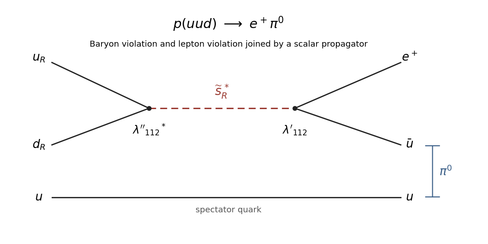

<h1 id="1/solution">Solution</h1>

↑ **Parent:** [1](../1.md)

Use [hypercharge](../../../../../hypercharge.md) normalized by $Q_{\mathrm{em}}=T_3+Y$, and express all matter fermions as left-handed [Weyl spinors](../../../../../weyl-spinor.md). Thus $u^c,d^c,e^c$ denote the charge conjugates of the right-handed [Standard Model fermions](../../../../../standard-model-fermion.md); the superscript $c$ is unrelated to the antiparticle marker $(A)$. Each [chiral superfield](../../../../../chiral-superfield.md) contains a [complex scalar field](../../../../../complex-scalar-field.md) and a [Weyl spinor](../../../../../weyl-spinor.md), while each [vector superfield](../../../../../vector-superfield.md) contains a [gauge boson](../../../../../gauge-boson.md) and a [gaugino](../../../../../gaugino.md). The complete propagating content of the [Minimal supersymmetric Standard Model](../../../../../minimal-supersymmetric-standard-model.md) before [electroweak symmetry breaking](../../../../../electroweak-symmetry-breaking.md) is:

| Sector | Component field | $SU(3)_c\times SU(2)_L\times U(1)_Y$ representation | Spin | Families or copies |
| --- | --- | --- | --- | --- |
| $Q_i$ | $(u_{Li},d_{Li})^{(A)}$, quark [Weyl spinors](../../../../../weyl-spinor.md) | $(\mathbf3,\mathbf2,+1/6)$ | $1/2$ | $3$ |
| $Q_i$ | $(\widetilde u_{Li},\widetilde d_{Li})^{(A)}$, [squarks](../../../../../squark.md) | $(\mathbf3,\mathbf2,+1/6)$ | $0$ | $3$ |
| $U_i^c$ | $(u_i^c)^{(A)}$, quark [Weyl spinor](../../../../../weyl-spinor.md) | $(\overline{\mathbf3},\mathbf1,-2/3)$ | $1/2$ | $3$ |
| $U_i^c$ | $(\widetilde u_i^c)^{(A)}$, [squark](../../../../../squark.md) | $(\overline{\mathbf3},\mathbf1,-2/3)$ | $0$ | $3$ |
| $D_i^c$ | $(d_i^c)^{(A)}$, quark [Weyl spinor](../../../../../weyl-spinor.md) | $(\overline{\mathbf3},\mathbf1,+1/3)$ | $1/2$ | $3$ |
| $D_i^c$ | $(\widetilde d_i^c)^{(A)}$, [squark](../../../../../squark.md) | $(\overline{\mathbf3},\mathbf1,+1/3)$ | $0$ | $3$ |
| $L_i$ | $(\nu_{Li},e_{Li})^{(A)}$, lepton [Weyl spinors](../../../../../weyl-spinor.md) | $(\mathbf1,\mathbf2,-1/2)$ | $1/2$ | $3$ |
| $L_i$ | $(\widetilde\nu_{Li},\widetilde e_{Li})^{(A)}$, [sleptons](../../../../../slepton.md) | $(\mathbf1,\mathbf2,-1/2)$ | $0$ | $3$ |
| $E_i^c$ | $(e_i^c)^{(A)}$, lepton [Weyl spinor](../../../../../weyl-spinor.md) | $(\mathbf1,\mathbf1,+1)$ | $1/2$ | $3$ |
| $E_i^c$ | $(\widetilde e_i^c)^{(A)}$, [slepton](../../../../../slepton.md) | $(\mathbf1,\mathbf1,+1)$ | $0$ | $3$ |
| $H_u$ | $(H_u^+,H_u^0)^{(A)}$, Higgs [complex scalar fields](../../../../../complex-scalar-field.md) | $(\mathbf1,\mathbf2,+1/2)$ | $0$ | $1$ |
| $H_u$ | $(\widetilde H_u^+,\widetilde H_u^0)^{(A)}$, [higgsinos](../../../../../higgsino.md) | $(\mathbf1,\mathbf2,+1/2)$ | $1/2$ | $1$ |
| $H_d$ | $(H_d^0,H_d^-)^{(A)}$, Higgs [complex scalar fields](../../../../../complex-scalar-field.md) | $(\mathbf1,\mathbf2,-1/2)$ | $0$ | $1$ |
| $H_d$ | $(\widetilde H_d^0,\widetilde H_d^-)^{(A)}$, [higgsinos](../../../../../higgsino.md) | $(\mathbf1,\mathbf2,-1/2)$ | $1/2$ | $1$ |
| Color [vector multiplet](../../../../../supersymmetric-vector-multiplet.md) | $G_\mu^a$, [gluons](../../../../../gluon.md) | $(\mathbf8,\mathbf1,0)$ | $1$ | $1$ adjoint, $a=1,\ldots,8$ |
| Color [vector multiplet](../../../../../supersymmetric-vector-multiplet.md) | $\widetilde G^a$, [gluinos](../../../../../gluino.md) | $(\mathbf8,\mathbf1,0)$ | $1/2$ | $1$ adjoint, $a=1,\ldots,8$ |
| Weak [vector multiplet](../../../../../supersymmetric-vector-multiplet.md) | $W_\mu^I$, weak [gauge bosons](../../../../../gauge-boson.md) | $(\mathbf1,\mathbf3,0)$ | $1$ | $1$ adjoint, $I=1,2,3$ |
| Weak [vector multiplet](../../../../../supersymmetric-vector-multiplet.md) | $\widetilde W^I$, [winos](../../../../../wino.md) | $(\mathbf1,\mathbf3,0)$ | $1/2$ | $1$ adjoint, $I=1,2,3$ |
| Hypercharge [vector multiplet](../../../../../supersymmetric-vector-multiplet.md) | $B_\mu$, hypercharge [gauge boson](../../../../../gauge-boson.md) | $(\mathbf1,\mathbf1,0)$ | $1$ | $1$ |
| Hypercharge [vector multiplet](../../../../../supersymmetric-vector-multiplet.md) | $\widetilde B$, [bino](../../../../../bino.md) | $(\mathbf1,\mathbf1,0)$ | $1/2$ | $1$ |

The marker $(A)$ means that conjugate antiparticle states must also be counted: a charged [Weyl spinor](../../../../../weyl-spinor.md) has a particle helicity and a distinct antiparticle helicity, and a [complex scalar field](../../../../../complex-scalar-field.md) has particle and antiparticle excitations. The real adjoint [gauge bosons](../../../../../gauge-boson.md) and adjoint [Majorana fermions](../../../../../majorana-spinor.md) already contain their conjugate states, so no extra marker is attached to them. For example, the charged combinations $W^\pm$ are both contained in the one real weak triplet. There are no right-handed-neutrino [chiral superfields](../../../../../chiral-superfield.md), no gravitino, and no propagating [auxiliary fields](../../../../../auxiliary-field.md) in this field table. The matter sector has $3(6+3+3+2+1)=45$ gauge components; the two [Higgs chiral doublets](../../../../../higgs-chiral-doublet.md) add four. Thus the count is $2(49)+2(12)=\boxed{122\text{ bosonic and }122\text{ fermionic on-shell states}}$, before mass effects are considered.

[R-parity](../../../../../r-parity.md) is the multiplicative discrete quantum number $\boxed{R_p=(-1)^{3(B-L)+2s}}$, with [baryon number](../../../../../baryon-number.md) $B$, [lepton number](../../../../../lepton-number.md) $L$ and spin $s$. Ordinary quarks, leptons, Higgs scalars and [gauge bosons](../../../../../gauge-boson.md) have $R_p=+1$; their [sparticles](../../../../../sparticle.md) have $R_p=-1$. For [superfields](../../../../../superfield.md) the equivalent rule is [matter parity](../../../../../matter-parity.md) $P_M=(-1)^{3(B-L)}$: $Q,U^c,D^c,L,E^c$ are odd, and $H_u,H_d$ and the gauge [superfields](../../../../../superfield.md) are even. With $A\mathbin{\cdot}B=\epsilon_{ab}A^aB^b$ contracting weak indices and implicit color contractions, the renormalizable [R-parity](../../../../../r-parity.md)-conserving [MSSM superpotential](../../../../../mssm-superpotential.md) is

$$
W_{\mathrm{RPC}}=(y_u)_{ij}U_i^c(Q_j\mathbin{\cdot}H_u)+(y_d)_{ij}D_i^c(Q_j\mathbin{\cdot}H_d)+(y_e)_{ij}E_i^c(L_j\mathbin{\cdot}H_d)+\mu H_u\mathbin{\cdot}H_d.
$$

Signs of the three [Yukawa couplings](../../../../../yukawa-interaction.md) can be absorbed into their matrices. Every term has even [matter parity](../../../../../matter-parity.md) and zero [hypercharge](../../../../../hypercharge.md); holomorphy requires the two independent [Higgs chiral doublets](../../../../../higgs-chiral-doublet.md), rather than using $H_u^\dagger$ in a [superpotential](../../../../../superpotential.md).

Conserved [R-parity](../../../../../r-parity.md) forces an even number of odd particles in a process whose incoming particles are all ordinary particles, so colliders produce [sparticles](../../../../../sparticle.md) in pairs or another even multiplicity. Their decay chains end in the stable [lightest supersymmetric particle](../../../../../lightest-supersymmetric-particle.md). A neutral, weakly interacting [lightest supersymmetric particle](../../../../../lightest-supersymmetric-particle.md), commonly a [neutralino](../../../../../neutralino.md) after [electroweak symmetry breaking](../../../../../electroweak-symmetry-breaking.md), escapes the detector and gives missing transverse momentum; it is also a possible [dark matter](../../../../../dark-matter.md) constituent. Stability alone does not establish its relic abundance, and a charged or colored stable [lightest supersymmetric particle](../../../../../lightest-supersymmetric-particle.md) is not the usual viable [dark matter](../../../../../dark-matter.md) candidate. Conserved [R-parity](../../../../../r-parity.md) forbids the renormalizable interactions responsible for the decay below. It does not by itself forbid higher-dimensional [proton-decay operators](../../../../../proton-decay-operator.md): the superpotential operators $QQQL/\Lambda$ and $U^cU^cD^cE^c/\Lambda$ have even [matter parity](../../../../../matter-parity.md). Thus **the renormalizable R-parity-conserving MSSM protects the proton, while ultraviolet physics can still induce its decay**.

The gauge-invariant renormalizable [R-parity](../../../../../r-parity.md)-violating [superpotential](../../../../../superpotential.md) is

$$
W_{\mathrm{RPV}}=\frac12\lambda_{ijk}(L_i\mathbin{\cdot}L_j)E_k^c+\lambda'_{ijk}(L_i\mathbin{\cdot}Q_j)D_k^c+\frac12\lambda''_{ijk}\epsilon_{abc}U_i^{c,a}D_j^{c,b}D_k^{c,c}+\kappa_iL_i\mathbin{\cdot}H_u.
$$

Here $\lambda_{ijk}=-\lambda_{jik}$ and $\lambda''_{ijk}=-\lambda''_{ikj}$ because of the weak and color antisymmetric contractions. The first two trilinear terms and the bilinear term violate [lepton number](../../../../../lepton-number.md), whereas the $U^cD^cD^c$ term violates [baryon number](../../../../../baryon-number.md). The $\lambda,\lambda',\lambda''$ are dimensionless and $\kappa_i$ has mass dimension one.

For a concrete [squark-mediated proton decay](../../../../../squark-mediated-proton-decay.md) channel, take $\lambda''_{112}$ and $\lambda'_{112}$ nonzero. Antisymmetry allows these indices: the exchanged scalar is a strange [squark](../../../../../squark.md), not a repeated down flavor in $\lambda''$. Two quarks in the proton undergo $u_Rd_R\to\widetilde s_R^*\to e^+\bar u$; the spectator $u$ combines with $\bar u$ into the $u\bar u$ component of $\pi^0$. The baryon-violating [Feynman vertex](../../../../../interaction-vertex.md) and lepton-violating [Feynman vertex](../../../../../interaction-vertex.md) give $p\to e^+\pi^0$.

**[Figure 1](#1/image-proton-decay-through-baryon-and-lepton-number-violating-strange-squark-exchange). Proton decay through baryon- and lepton-number-violating strange-squark exchange**.

At momenta small compared with the [squark](../../../../../squark.md) mass $m$, its [scalar propagator](../../../../../scalar-propagator.md) is of order $m^{-2}$. Eliminating it generates a dimension-six four-fermion [proton-decay operator](../../../../../proton-decay-operator.md), schematically $(u^cd^c)^\dagger(eu)$, with coefficient $C\sim\lambda''_{112}{}^*\lambda'_{112}/m^2$. Consequently the dimensionless decay amplitude is of order $Cm_p^2$, and phase space supplies one more power of $m_p$ to the width:

$$
\Gamma_p\sim|C|^2m_p^5\sim|\lambda'\lambda''|^2\frac{m_p^5}{m^4},\qquad \boxed{\tau_p\sim\frac{m^4}{|\lambda'\lambda''|^2m_p^5}}.
$$

This is a dimensional estimate; phase-space constants and hadronic matrix elements change its coefficient, not its fourth-power dependence on $m$. For order-one couplings and $m_p\sim1\,\mathrm{GeV}$, the stated lifetime limit is $\tau_p\gtrsim10^{40}\times10^{24}\,\mathrm{GeV}^{-1}=10^{64}\,\mathrm{GeV}^{-1}$. Therefore $m^4\gtrsim10^{64}\,\mathrm{GeV}^4$, giving $\boxed{m\gtrsim10^{16}\,\mathrm{GeV}}$.

Such a mass is incompatible with the intended weak-scale [MSSM](../../../../../minimal-supersymmetric-standard-model.md) explanation of the [hierarchy problem](../../../../../hierarchy-problem.md): [squarks](../../../../../squark.md) that cancel the Higgs-sector sensitivity to high scales must not introduce a new enormous splitting from their light quark partners. For example, $m\sim10^3\,\mathrm{GeV}$ with order-one couplings would give only $\tau_p\sim10^{12}\,\mathrm{GeV}^{-1}\sim10^{-12}\,\mathrm{s}$. The field content alone does not mathematically prohibit extremely heavy superpartners, but that choice sacrifices the weak-scale [naturalness](../../../../../naturalness-physics.md) motivation. The usual resolution is conserved [R-parity](../../../../../r-parity.md), or sufficiently suppressed simultaneous [baryon number](../../../../../baryon-number.md) and [lepton number](../../../../../lepton-number.md) violation, rather than making the exchanged [squark](../../../../../squark.md) this heavy.

## ↑ Ancestors (10)

1. [1](../1.md)
2. [Paper 40](../../paper-40-split.md)
3. [Iii](../../split.md)
4. [2010](../../../split.md)
5. [Past exam of the mathematics course of the University of Cambridge](../../../../split.md)
6. [Mathematics course of the University of Cambridge](../../../../../mathematics-course-of-the-university-of-cambridge.md)
7. [Course of the University of Cambridge](../../../../../course-of-the-university-of-cambridge.md)
8. [University of Cambridge](../../../../../university-of-cambridge-split.md)
9. [List of universities](../../../../../list-of-universities.md)
10. [Codex Wiki](../../../../../split.md)
