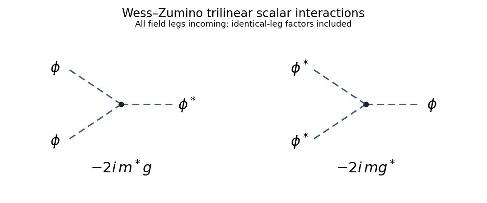

<h1 id="3/solution">Solution</h1>

↑ **Parent:** [3](../3.md)

The [chiral superfield](../../../../../chiral-superfield.md) condition is $\boxed{\bar D_{\dot\alpha}\Phi=0}$ for both dotted components. Use [left Grassmann derivatives](../../../../../left-grassmann-derivative.md) with the displayed [supersymmetric covariant derivatives](../../../../../supersymmetric-covariant-derivative.md). The odd product rule gives $\partial(\theta\sigma^\mu\bar\theta)/\partial\bar\theta^{\dot\alpha}=-(\theta\sigma^\mu)_{\dot\alpha}$, so

$$
\bar D_{\dot\alpha}y^\mu=0,\qquad y^\mu=x^\mu+i\theta\sigma^\mu\bar\theta,\qquad \bar D_{\dot\alpha}=-\left.\frac{\partial}{\partial\bar\theta^{\dot\alpha}}\right|_{y,\theta}.
$$

The chirality constraint therefore says that $\Phi$ is independent of $\bar\theta$ at fixed $y$. The [Grassmann algebra](../../../../../grassmann-algebra.md) has only two independent $\theta$ components, so every cubic product of them vanishes. Its general even scalar [superfield](../../../../../superfield.md) consequently has a scalar coefficient, a term linear in $\theta$ with a [Weyl spinor](../../../../../weyl-spinor.md) coefficient, and one quadratic term. Choosing the conventional component normalization gives the [chiral-superfield component expansion](../../../../../chiral-superfield-component-expansion.md)

$$
\boxed{\Phi(y,\theta,\bar\theta)=\phi(y)+\sqrt2\,\theta^\alpha\psi_\alpha(y)+(\theta\theta)F_{\mathrm{aux}}(y)}.
$$

Here $\phi$ is a [complex scalar field](../../../../../complex-scalar-field.md), $\psi$ an odd [Weyl spinor](../../../../../weyl-spinor.md) and $F_{\mathrm{aux}}$ a complex nonpropagating [auxiliary field](../../../../../auxiliary-field.md). Conversely this expansion is annihilated by $\bar D$ because $y$ and $\theta$ are. At fixed ordinary $x$, the same result is the terminating translation $\Phi=e^{i\theta\sigma^\mu\bar\theta\partial_\mu}[\phi(x)+\sqrt2\theta\psi(x)+(\theta\theta)F_{\mathrm{aux}}(x)]$; this retains the printed contraction convention without changing the order in the barred square.

For a local function of scalar [superfields](../../../../../superfield.md), initially allow $f(\Phi,\Phi^\dagger)$. The chain rule gives

$$
\bar D_{\dot\alpha}f=f_\Phi\bar D_{\dot\alpha}\Phi+f_{\Phi^\dagger}\bar D_{\dot\alpha}\Phi^\dagger=f_{\Phi^\dagger}\bar D_{\dot\alpha}\Phi^\dagger.
$$

For arbitrary chiral component fields the last factor is not constrained to vanish, so chirality requires $f_{\Phi^\dagger}=0$. Thus $\boxed{f\text{ must be holomorphic in the chiral fields}}$ on its domain, with no generic conjugate-field dependence. Its ordinary holomorphic derivatives must exist where its nilpotent expansion is evaluated; a pole or branch point there does not define a regular local [superfield](../../../../../superfield.md). Using $(\theta\psi)^2=-\tfrac12(\theta\theta)(\psi\psi)$ gives the explicit [holomorphic closure of chiral superfields](../../../../../holomorphic-closure-of-chiral-superfields.md):

$$
f(\Phi)=f(\phi)+\sqrt2\theta\,f'(\phi)\psi+(\theta\theta)\left[f'(\phi)F_{\mathrm{aux}}-\frac12f''(\phi)\psi\psi\right].
$$

All three component coefficients are evaluated at $y$. For several [chiral superfields](../../../../../chiral-superfield.md), replace $f'\psi$ by $f_i\psi_i$ and $f''\psi\psi$ by $f_{ij}\psi_i\psi_j$. This requirement concerns a function that is to be chiral for arbitrary field configurations; a special constant field configuration does not impose the same functional constraint.

The ungauged two-derivative [supersymmetric action](../../../../../supersymmetric-action.md) is obtained from a real [Kähler potential](../../../../../kahler-potential.md) and a holomorphic [superpotential](../../../../../superpotential.md):

$$
\boxed{\mathcal L=\int d^2\theta\,d^2\bar\theta\,K(\Phi,\Phi^\dagger)+\left[\int d^2\theta\,W(\Phi)+\mathrm{h.c.}\right]}.
$$

The first integral is a [D-term](../../../../../d-term.md); the second is an [F-term](../../../../../f-term.md). The [Kähler metric](../../../../../kahler-metric.md) $K_{i\bar j}$ must be positive for positive scalar kinetic energy. The auxiliary part is $K_{i\bar j}F_i\bar F_{\bar j}+W_iF_i+\overline W_{\bar j}\bar F_{\bar j}$, so eliminating it gives the [scalar potential](../../../../../scalar-potential.md) $V=K^{i\bar j}W_i\overline W_{\bar j}$ in the bosonic sector.

For the single-field [Wess–Zumino model](../../../../../wess-zumino-model.md), take the canonical [Kähler potential](../../../../../kahler-potential.md) $K=\Phi^\dagger\Phi$ and spacetime signature $(+---)$. Component [superspace integration](../../../../../superspace-integration.md) gives

$$
\mathcal L=\partial_\mu\phi^*\partial^\mu\phi+i\bar\psi\bar\sigma^\mu\partial_\mu\psi+F_{\mathrm{aux}}^*F_{\mathrm{aux}}+\left[W'(\phi)F_{\mathrm{aux}}-\frac12W''(\phi)\psi\psi+\mathrm{h.c.}\right].
$$

Since $W'=m\phi+g\phi^2$ and $W''=m+2g\phi$, the auxiliary equation is $F_{\mathrm{aux}}=-(m\phi+g\phi^2)^*$. Completing its square leaves $-|W'|^2$ in the Lagrangian. Hence the tree-level [effective potential](../../../../../effective-potential.md) is

$$
\boxed{V_{\mathrm{tree}}(\phi,\phi^*)=|m\phi+g\phi^2|^2},\qquad V_{\mathrm{tree}}=|m|^2|\phi|^2+m^*g\phi^*\phi^2+mg^*\phi(\phi^*)^2+|g|^2|\phi|^4.
$$

For nonzero $m,g$, its two zero-energy [supersymmetric vacua](../../../../../supersymmetric-vacuum.md) are $\phi=0$ and $\phi=-m/g$. The potential is nonnegative because it is an absolute square.

The [Trilinear scalar vertices in the Wess–Zumino model](../../../../../trilinear-scalar-vertices-in-the-wess-zumino-model.md) come from

$$
\mathcal L_3=-m^*g\phi^*\phi^2-mg^*\phi(\phi^*)^2.
$$

With all field legs incoming, expanding $e^{iS}$ and differentiating each cubic monomial gives

$$
\boxed{V_{\phi\phi\phi^*}=-2im^*g,\qquad V_{\phi^*\phi^*\phi}=-2img^*}.
$$

The factor $2!$ counts the two identical legs; there is no $1/2!$ in $\mathcal L_3$ to cancel it. A factor enforcing four-momentum conservation is implicit. These labels specify fields in an all-incoming [Feynman rule](../../../../../feynman-rule.md); physical outgoing particles are assigned by crossing. There are no $\phi^3$ or $(\phi^*)^3$ scalar vertices from this on-shell potential.

**[Figure 2](#3/image-conjugate-trilinear-scalar-vertices-and-their-all-incoming-feynman-rules-in-the-wess-zumino-model). Conjugate trilinear scalar vertices and their all-incoming Feynman rules in the Wess–Zumino model**.

Equivalently, if $m,g$ are real and $\phi=(A+iB)/\sqrt2$ with canonically normalized real scalars $A,B$, then $\mathcal L_3=-mgA(A^2+B^2)/\sqrt2$. Differentiation gives $\boxed{V_{AAA}=-3\sqrt2img,\quad V_{ABB}=-\sqrt2img}$, with vanishing $AAB$ and $BBB$ vertices. This is the same pair of complex-field interactions in a real basis.

For the non-renormalization argument, promote $m,g$ to nondynamical chiral [spurions](../../../../../spurion.md). Define one ordinary $U(1)$ and one [R-symmetry](../../../../../r-symmetry.md) by the [Wess–Zumino spurion charge assignment](../../../../../wess-zumino-spurion-charge-assignment.md):

| Quantity | Ordinary $U(1)$ charge $q$ | [R-charge](../../../../../r-charge.md) |
| --- | --- | --- |
| $\theta$ | $0$ | $1$ |
| $\Phi$ | $1$ | $1$ |
| $m$ | $-2$ | $0$ |
| $g$ | $-3$ | $-1$ |
| $W$ | $0$ | $2$ |

Each superpotential term is neutral under the ordinary symmetry. Under the [R-symmetry](../../../../../r-symmetry.md), both terms have charge two, which is canceled by the charge $-2$ of $d^2\theta$. In particular, $m$ is R-neutral as required. The scalar, spinor and auxiliary components of $\Phi$ have [R-charges](../../../../../r-charge.md) $1,0,-1$. These are formal symmetries when the couplings transform as [spurions](../../../../../spurion.md); replacing them by fixed nonzero numbers need not leave an actual continuous field symmetry.

A local loop-corrected [Wilsonian effective action](../../../../../wilsonian-effective-action.md) [superpotential](../../../../../superpotential.md) $F_{\mathrm{eff}}(\Phi,m,g)$ must be holomorphic in all three chiral variables and obey the same charges. The ratio $z=g\Phi/m$ is neutral under both symmetries, while $m\Phi^2$ has the required charges and mass dimension three. Therefore, on a patch with $m\ne0$, the most general symmetry-allowed form is

$$
\boxed{F_{\mathrm{eff}}=m\Phi^2h\left(\frac{g\Phi}{m}\right)},
$$

with $h$ holomorphic on its domain. This form follows directly for a monomial $\Phi^a m^b g^c$: ordinary charge gives $a-2b-3c=0$ and [R-charge](../../../../../r-charge.md) gives $a-c=2$, hence $a=c+2$, $b=1-c$. Each allowed monomial is $g^cm^{1-c}\Phi^{c+2}$ and already has mass dimension three. Charge symmetry alone leaves $h$ undetermined.

To constrain perturbative loops, retain the original elementary [chiral superfield](../../../../../chiral-superfield.md) and a nonzero infrared cutoff, rather than integrating out the entire field. A regular perturbative superpotential can be expanded about $g=0$, so $h(z)=\sum_{n\ge0}c_nz^n$ and

$$
F_{\mathrm{eff}}=\sum_{n\ge0}c_n g^n m^{1-n}\Phi^{n+2}.
$$

Terms with $n\ge2$ have poles at $m=0$. They are excluded by regularity of the local Wilsonian coefficients in the massless limit with the infrared cutoff fixed. At $g=0$ the theory is Gaussian, so the quadratic coefficient remains $c_0=1/2$. The term linear in $g$ is the single original cubic vertex: a diagram with three external fields and only that one interaction vertex has no internal loop. Holomorphy disallows coefficients involving $g^*$ or $m^*$, so it cannot conceal the usual nonholomorphic wave-function corrections in $c_1$. Matching the one-vertex term gives $c_1=1/3$. Thus the [holomorphy argument for superpotential non-renormalization](../../../../../holomorphy-argument-for-superpotential-non-renormalization.md) gives

$$
\boxed{h(z)=\frac12+\frac13z,\qquad F_{\mathrm{eff}}^{\mathrm{pert}}=W_{\mathrm{tree}}}.
$$

The infrared qualification matters: a singular one-particle-irreducible expression or the action after eliminating an entire massive multiplet is not the same local [Wilsonian effective action](../../../../../wilsonian-effective-action.md) for the retained field.

Consequently **the holomorphic superpotential and its parameters m and g receive no perturbative vertex renormalization**. The [Kähler potential](../../../../../kahler-potential.md) does undergo [wave-function renormalization](../../../../../wave-function-renormalization.md). If its quadratic term is $Z\Phi^\dagger\Phi$, then canonical normalization gives $\Phi_c=Z^{1/2}\Phi$ and

$$
\boxed{m_c=m/Z,\qquad g_c=g/Z^{3/2}}.
$$

These canonically normalized running couplings can therefore be renormalized despite the [non-renormalization theorem](../../../../../non-renormalization-theorem.md) for the holomorphic [superpotential](../../../../../superpotential.md). Loop corrections can also change the effective scalar potential through the corrected [Kähler metric](../../../../../kahler-metric.md). The distinction between holomorphic coefficients and canonically normalized couplings is essential to answering the renormalization question.

## ↑ Ancestors (10)

1. [3](../3.md)
2. [Paper 40](../../paper-40-split.md)
3. [Iii](../../split.md)
4. [2010](../../../split.md)
5. [Past exam of the mathematics course of the University of Cambridge](../../../../split.md)
6. [Mathematics course of the University of Cambridge](../../../../../mathematics-course-of-the-university-of-cambridge.md)
7. [Course of the University of Cambridge](../../../../../course-of-the-university-of-cambridge.md)
8. [University of Cambridge](../../../../../university-of-cambridge-split.md)
9. [List of universities](../../../../../list-of-universities.md)
10. [Codex Wiki](../../../../../split.md)
