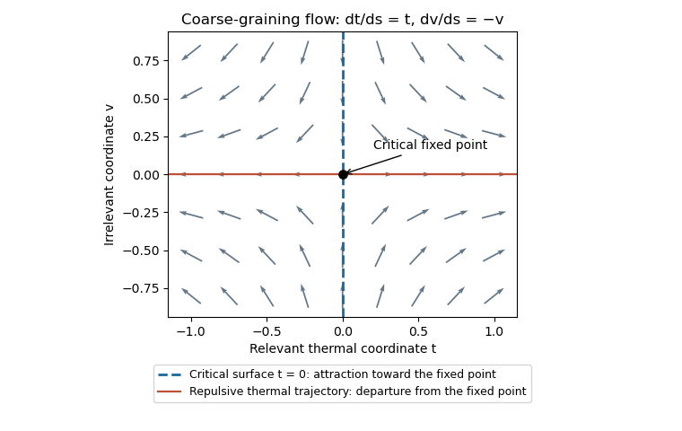

<h1 id="2/solution">Solution</h1>

↑ **Parent:** [2](../2.md)

Use the [connected correlation function](../../../../../connected-correlation-function.md) $G(r)=\langle\sigma_0\sigma_r\rangle-\langle\sigma_0\rangle\langle\sigma_r\rangle$. Away from criticality its large-distance envelope decays exponentially on the [correlation length](../../../../../correlation-length.md) $\xi$, often with an algebraic prefactor. At criticality $\xi$ diverges and a short-range scalar model instead has the power law $G(r)\sim r^{-(D-2+\eta)}$, with [anomalous dimension](../../../../../anomalous-dimension.md) $\eta$.

A [blocking kernel](../../../../../blocking-kernel.md) $K_b(\sigma',\sigma)$ assigns coarse spins to each block of side $b$ lattice spacings, with $\sum_{\sigma'}K_b(\sigma',\sigma)=1$. Define the coarse Hamiltonian by

$$
e^{-\beta H(u',\sigma')-\beta N'C'}=\sum_\sigma K_b(\sigma',\sigma)e^{-\beta H(u,\sigma)-\beta NC}.
$$

The operator basis must be sufficiently complete to include interactions generated by blocking. Summing over coarse spins preserves the [partition function](../../../../../canonical-partition-function.md), while the physical lattice spacing and site count change to $a'=ba$, $N'=b^{-D}N$. After $p$ steps they are $a_p=b^pa$ and $N_p=b^{-pD}N$. Exact blocking preserves the long-distance predictions; truncating the generated interaction space introduces an approximation.

Define the dimensionless free energy per site $F(u,C)=-N^{-1}\log Z(u,C,N)=f(u)+\beta C$. Preservation of $Z$ gives $F(u_0,C_0)=b^{-pD}F(u_p,C_p)$. For one step, removing the explicitly additive constant gives

$$
f(u_j)=b^{-D}f(u_{j+1})+g(u_j),\qquad g(u_j)=\beta\bigl[b^{-D}C_{j+1}-C_j\bigr].
$$

The function $g$ records the additive [free-energy density](../../../../../free-energy-density.md) generated by eliminated degrees of freedom; it is usually regular near a finite blocking step's critical point. Iteration proves

$$
\boxed{f(u_0)=b^{-pD}f(u_p)+\sum_{j=0}^{p-1}b^{-jD}g(u_j).}
$$

This is the [additive free-energy recursion under blocking](../../../../../additive-free-energy-recursion-under-blocking.md). After removing regular backgrounds, its singular part obeys homogeneous scaling.

A [renormalization-group fixed point](../../../../../renormalization-group-fixed-point.md) satisfies $R_b(u^*)=u^*$. Linearizing the map gives scaling coordinates $v_i'=b^{\lambda_i}v_i$. A [relevant operator](../../../../../relevant-operator.md) has $\lambda_i>0$, an [irrelevant operator](../../../../../irrelevant-operator.md) has $\lambda_i<0$, and a marginal operator has $\lambda_i=0$ and needs nonlinear analysis. The [critical surface](../../../../../critical-surface.md) consists of points flowing into the critical fixed point after all relevant directions are tuned. An outgoing or repulsive trajectory lies in the unstable manifold and describes perturbations that grow under coarse-graining.

**[Figure 1](#2/image-renormalization-group-flow-near-a-critical-surface). Renormalization-group flow near a critical surface**.

With relevant thermal and magnetic coordinates $t,h$, the singular [free-energy density](../../../../../free-energy-density.md) obeys $F_s(t,h)=b^{-D}F_s(b^{\lambda_t}t,b^{\lambda_h}h)$. Choose $b=|t|^{-1/\lambda_t}$ to obtain

$$
\boxed{F_s(t,h)=|t|^{D/\lambda_t}f_\pm\left(\frac h{|t|^{\lambda_h/\lambda_t}}\right).}
$$

Here $\lambda_t,\lambda_h$ are the positive scaling eigenvalues, and $f_\pm$ refer to the signs of $t$. Since $\xi(t,h)=b\xi(b^{\lambda_t}t,b^{\lambda_h}h)$, the correlation-length exponent is $\nu=1/\lambda_t$. Two temperature derivatives of $F_s(t,0)$ give $\alpha=2-D/\lambda_t$, establishing the [hyperscaling relation](../../../../../hyperscaling-relation.md)

$$
\boxed{\alpha=2-D\nu.}
$$

The magnetization exponent similarly is $\beta=(D-\lambda_h)/\lambda_t$. These expressions assume no additional dangerous scaling variables.

For the [Gaussian field theory](../../../../../gaussian-field-theory.md), decompose the field into low and high [Fourier modes](../../../../../fourier-mode.md), integrate out $\Lambda/b<|p|<\Lambda$, and restore the cutoff using $x=bx'$ and $\phi(x)=b^{-(D-2)/2}\phi'(x')$. The gradient coefficient remains fixed, the mass coefficient transforms as $m'^2=b^2m^2$, and the uniform source as $h'=b^{(D+2)/2}h$. Hence $\lambda_t=2$, $\lambda_h=(D+2)/2$, and the [Gaussian momentum-shell scaling](../../../../../gaussian-momentum-shell-scaling.md) gives

$$
\boxed{\alpha=\frac{4-D}{2},\qquad\beta=\frac{D-2}{4}.}
$$

The sign convention $+h\phi$ reverses the magnetization's sign but not these exponents. For $2<D<4$, these are Gaussian scaling predictions, not the exponents of a generic interacting scalar critical point: the quartic interaction is relevant there. The free quadratic Hamiltonian also has no stable ordered phase at negative $m^2$, so the quoted $\beta$ is its formal order-parameter scaling index, not a spontaneously magnetized state of the unstabilized Gaussian integral. The relevance distinction is also explained in [Tong's renormalization-group lecture notes](https://www.damtp.cam.ac.uk/user/tong/sft/sfthtml/S3.html).

## ↑ Ancestors (10)

1. [2](../2.md)
2. [Paper 41](../../paper-41-split.md)
3. [Iii](../../split.md)
4. [2010](../../../split.md)
5. [Past exam of the mathematics course of the University of Cambridge](../../../../split.md)
6. [Mathematics course of the University of Cambridge](../../../../../mathematics-course-of-the-university-of-cambridge.md)
7. [Course of the University of Cambridge](../../../../../course-of-the-university-of-cambridge.md)
8. [University of Cambridge](../../../../../university-of-cambridge-split.md)
9. [List of universities](../../../../../list-of-universities.md)
10. [Codex Wiki](../../../../../split.md)
