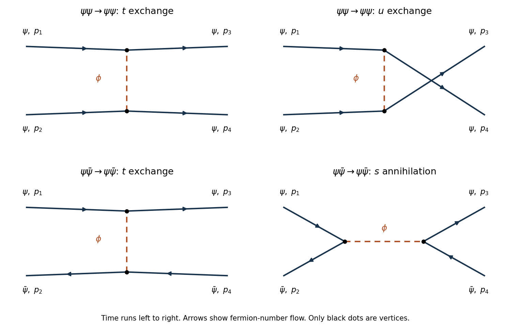

# Paper 42

↑ **Parent:** [Iii](../iii.md)

[https://www.maths.cam.ac.uk/postgrad/part-iii/files/pastpapers/2010/Paper42.pdf](https://www.maths.cam.ac.uk/postgrad/part-iii/files/pastpapers/2010/Paper42.pdf)

**Table of contents**

- [1](#1)
  - [Solution](#1/solution)
- [2](#2)
  - [Solution](#2/solution)
- [3](#3)
  - [a](#3/a)
    - [Solution](#3/a/solution)
  - [b](#3/b)
    - [Solution](#3/b/solution)
- [4](#4)
  - [Solution](#4/solution)

## 1

↑ **Parent:** [Paper 42](paper-42.md)

<h3 id="1/solution">Solution</h3>

↑ **Parent:** [1](#1)

Use $\eta_{\mu\nu}=\operatorname{diag}(1,-1,-1,-1)$ and $\hbar=c=1$. In the [interaction picture](../../../quantum-mechanics.md#interaction-picture), fields evolve with the free [Hamiltonian](../../../classical-mechanics.md#hamiltonian), while interactions enter the state evolution through the [Dyson series](../../../perturbative-quantum-field-theory.md#dyson-series). Write the [Klein-Gordon field](../../../quantum-field-theory.md#klein-gordon-field) as $\phi=\phi^{(+)}+\phi^{(-)}$, with the [positive-frequency part of a quantum field](../../../quantum-field-theory.md#positive-frequency-part-of-a-quantum-field) containing [annihilation operators](../../../quantum-mechanics.md#annihilation-operator) and $\phi^{(-)}=(\phi^{(+)})^\dagger$ containing [creation operators](../../../quantum-mechanics.md#creation-operator). The mode normalization in the PDF corresponds to $[a_{\mathbf p},a^\dagger_{\mathbf q}]=(2\pi)^3\delta^3(\mathbf p-\mathbf q)$ and $E_{\mathbf p}=\sqrt{|\mathbf p|^2+m^2}$.

The [time-ordered product](../../../perturbative-quantum-field-theory.md#time-ordered-product) places fields with the latest time on the left. For two bosonic insertions,

$$
T\{\phi(x)\phi(y)\}=\theta(x^0-y^0)\phi(x)\phi(y)+\theta(y^0-x^0)\phi(y)\phi(x).
$$

The [normal-ordered product](../../../perturbative-quantum-field-theory.md#normal-ordered-product) $:\!\phi(x_1)\cdots\phi(x_n)\!:$ instead moves every [creation operator](../../../quantum-mechanics.md#creation-operator) to the left of every [annihilation operator](../../../quantum-mechanics.md#annihilation-operator), without adding the commutators generated by that rearrangement. Its [vacuum expectation value](../../../quantum-field-theory.md#vacuum-expectation-value) is zero whenever a nonempty set of free-field factors remains.

The mode [commutator](../../../lie-algebra.md#commutator) gives the positive-frequency [Wightman function](../../../quantum-field-theory.md#wightman-function)

$$
D^+(x-y)=[\phi^{(+)}(x),\phi^{(-)}(y)]
=\langle0|\phi(x)\phi(y)|0\rangle
=\int\frac{d^3p}{(2\pi)^3\,2E_{\mathbf p}}e^{-ip\cdot(x-y)}.
$$

Define the [Feynman propagator](../../../quantum-field-theory.md#feynman-propagator) here to be the two-point function itself, rather than that function divided by $i$. Then

$$
\boxed{\Delta_F(x-y)=\langle0|T\{\phi(x)\phi(y)\}|0\rangle
=\theta(x^0-y^0)D^+(x-y)+\theta(y^0-x^0)D^+(y-x).}
$$

Equivalently,

$$
\Delta_F(x-y)=\int\frac{d^4p}{(2\pi)^4}\frac{i\,e^{-ip\cdot(x-y)}}{p^2-m^2+i0}.
$$

The positive-energy pole is below and the negative-energy pole above the real axis. Closing the energy [contour integral](../../../complex-analysis.md#contour-integral) below for positive time separation and above for negative time separation gives the two terms above. Thus this is the [scalar Feynman propagator pole prescription](../../../quantum-field-theory.md#scalar-feynman-propagator-pole-prescription), and $(\Box+m^2)\Delta_F=-i\delta^4$. In particular, $T\{\phi(x)\phi(y)\}=:\!\phi(x)\phi(y)\!:+\Delta_F(x-y)$: the difference between [time ordering](../../../perturbative-quantum-field-theory.md#time-ordering) and [normal ordering](../../../perturbative-quantum-field-theory.md#normal-ordering) is the [Wick contraction](../../../perturbative-quantum-field-theory.md#wick-contraction).

For $n$ free bosonic fields, the [Wick theorem](../../../perturbative-quantum-field-theory.md#wick-s-theorem) states

$$
\boxed{T\{\phi_1\cdots\phi_n\}
=\sum_{P}\left(\prod_{(i,j)\in P}\Delta_F(x_i-x_j)\right)
:\!\prod_{r\notin V(P)}\phi_r\!:,}
$$

where $P$ runs over all sets of disjoint pairs of indices, including the empty set, and $V(P)$ is the set of paired indices. The empty [normal-ordered product](../../../perturbative-quantum-field-theory.md#normal-ordered-product) equals one. This is an operator identity for free fields, understood with smearing or a regulator when products of [operator-valued distributions](../../../quantum-field-theory.md#operator-valued-distribution) require it.

Here is an [inductive proof of the scalar Wick theorem](../../../perturbative-quantum-field-theory.md#inductive-proof-of-the-scalar-wick-theorem). Sort the arguments chronologically so that $x_1^0$ is the latest. For any remaining set $I$, commuting the annihilation part of $\phi_1$ through the creation parts in a [normal-ordered product](../../../perturbative-quantum-field-theory.md#normal-ordered-product) gives

$$
\phi_1:\!\prod_{r\in I}\phi_r\!:
=:\!\phi_1\prod_{r\in I}\phi_r\!:
+\sum_{j\in I}[\phi_1^{(+)},\phi_j^{(-)}]
:\!\prod_{r\in I\setminus\{j\}}\phi_r\!:.
$$

The creation part of $\phi_1$ is already in the correct position. Every commutator on the right is a scalar, so no further operator rearrangement is needed for it. Because $x_1$ is latest, that commutator is $\Delta_F(x_1-x_j)$. Assume the [Wick theorem](../../../perturbative-quantum-field-theory.md#wick-s-theorem) for the other $n-1$ fields and multiply its expansion by $\phi_1$. The first term of the displayed identity gives every pairing in which index 1 is unpaired; the sum gives every pairing in which 1 is paired with exactly one $j$. Each final partial pairing has exactly one such construction. The one-field identity supplies the base case, proving the theorem by [mathematical induction](../../../foundations-of-mathematics.md#mathematical-induction). Applying [time ordering](../../../perturbative-quantum-field-theory.md#time-ordering) restores arbitrary argument order.

Taking the [vacuum expectation value](../../../quantum-field-theory.md#vacuum-expectation-value) retains only complete pairings. Odd free correlators vanish; for example the [free scalar four-point function](../../../perturbative-quantum-field-theory.md#free-scalar-four-point-function) is $\Delta_{12}\Delta_{34}+\Delta_{13}\Delta_{24}+\Delta_{14}\Delta_{23}$. These facts explain why propagators are the edges of [Feynman diagrams](../../../perturbative-quantum-field-theory.md#feynman-diagram).

For the interacting [quartic scalar field theory](../../../scalar-field-theory.md#quartic-interaction), the [interaction Hamiltonian](../../../quantum-field-theory.md#interaction-hamiltonian) density is $\lambda\phi^4/4!$. With a single [time ordering](../../../perturbative-quantum-field-theory.md#time-ordering) acting on external insertions and interaction vertices, the unnormalized numerator expands as

$$
N_n=\sum_{v=0}^{\infty}\frac{(-i\lambda)^v}{v!(4!)^v}
\int d^4z_1\cdots d^4z_v\,
\langle0|T\{\phi(x_1)\cdots\phi(x_n)\phi(z_1)^4\cdots\phi(z_v)^4\}|0\rangle.
$$

Apply the proved [Wick theorem](../../../perturbative-quantum-field-theory.md#wick-s-theorem) term by term. Each complete pairing connects external insertions and four-legged vertices by [Feynman propagators](../../../quantum-field-theory.md#feynman-propagator). There are $4!$ assignments of four distinct incident legs at a vertex, canceling its factorial. Permuting identical integrated vertices cancels the corresponding part of $v!$. Permutations still leaving the labeled graph unchanged give its [Feynman-diagram symmetry factor](../../../perturbative-quantum-field-theory.md#feynman-diagram-symmetry-factor). For example,

$$
N_{4,\mathrm{connected}}^{(1)}=-i\lambda\int d^4z\prod_{r=1}^4\Delta_F(x_r-z),
$$

whereas the two-point [tadpole diagram](../../../perturbative-quantum-field-theory.md#tadpole-diagram) has coefficient $-i\lambda/2$, because choosing the two vertex legs contracted with the labeled external fields gives $4\cdot3$ possibilities and the other two contract with each other.

Thus the position-space rules attach $\Delta_F$ to every edge, $-i\lambda\int d^4z$ to every four-legged [interaction vertex](../../../perturbative-quantum-field-theory.md#interaction-vertex), and divide by the graph's [Feynman-diagram symmetry factor](../../../perturbative-quantum-field-theory.md#feynman-diagram-symmetry-factor). Fourier transformation gives the momentum-space [Feynman rules](../../../perturbative-quantum-field-theory.md#feynman-rule):

$$
\boxed{\text{line: }\frac{i}{p^2-m^2+i0},\qquad
\text{vertex: }-i\lambda,\qquad
\text{loop: }\int\frac{d^4\ell}{(2\pi)^4}.}
$$

Enforce [momentum conservation](../../../classical-mechanics.md#momentum-conservation) at each vertex, retaining the overall four-momentum delta function. External lines of these correlation functions remain unamputated. The unnormalized expression includes [Vacuum Feynman diagrams](../../../perturbative-quantum-field-theory.md#vacuum-feynman-diagram); dividing by $N_0=\langle0|S|0\rangle$ cancels those disconnected vacuum factors. They should not be discarded without that normalization.

There is a time-ordering convention in the printed correlation-function notation worth making explicit. The usual interacting correlator uses the single global [time ordering](../../../perturbative-quantum-field-theory.md#time-ordering) in $N_n$ above. If the displayed $T\{\phi_1\cdots\phi_n\}S$ is read literally with $S$ outside that ordering, the external block and the vertex block are separately time ordered: their cross-contractions are $D^+(x_i-z)$ because each external field stands to the left of every vertex field. The same pairing construction then uses $\Delta_F$ for lines within either block and $D^+$ for lines between blocks; in momentum space the latter is $2\pi\theta(p^0)\delta(p^2-m^2)$. This literal product is different from the conventional globally time-ordered interacting correlator, and does not have the ordinary external [Feynman propagators](../../../quantum-field-theory.md#feynman-propagator) derived above.

## 2

↑ **Parent:** [Paper 42](paper-42.md)

<h3 id="2/solution">Solution</h3>

↑ **Parent:** [2](#2)

The supplied [gamma matrices](../../../algebra.md#gamma-matrices) use the mostly-minus [metric signature](../../../topology.md#metric-signature). The [Pauli matrix multiplication law](../../../algebra.md#pauli-matrix-multiplication-law) gives $\sigma^1\sigma^2\sigma^3=iI_2$, hence block multiplication yields

$$
\boxed{\gamma^5=i\gamma^0\gamma^1\gamma^2\gamma^3=\begin{pmatrix}-I_2&0\\0&I_2\end{pmatrix}.}
$$

The off-diagonal blocks of every $\gamma^\mu$ connect opposite eigenspaces of this diagonal matrix. Explicitly,

$$
\gamma^5\gamma^0=\begin{pmatrix}0&-I_2\\I_2&0\end{pmatrix}
=-\gamma^0\gamma^5,\qquad
\gamma^5\gamma^i=\begin{pmatrix}0&-\sigma^i\\-\sigma^i&0\end{pmatrix}
=-\gamma^i\gamma^5.
$$

Thus $\{\gamma^5,\gamma^\mu\}=0$, and $(\gamma^5)^2=I_4$. The [chiral projectors](../../../relativistic-quantum-field.md#chiral-projector) $(1\mp\gamma^5)/2$ select the upper and lower two-component blocks, respectively.

Write the [Dirac spinor](../../../relativistic-quantum-field.md#dirac-spinor) as $\psi=(\chi_L,\chi_R)^T$. Substituting the block matrices into the [massless Dirac equation](../../../relativistic-quantum-field.md#massless-dirac-equation) gives two independent [Weyl spinor](../../../relativistic-quantum-field.md#weyl-spinor) equations:

$$
\boxed{i(\partial_t-\boldsymbol\sigma\cdot\boldsymbol\nabla)\chi_L=0,\qquad
i(\partial_t+\boldsymbol\sigma\cdot\boldsymbol\nabla)\chi_R=0.}
$$

They are decoupled because the mass term, which would join the two [chirality](../../../relativistic-quantum-field.md#chirality-physics) components, is absent.

For a left-handed [plane wave](../../../quantum-mechanics.md#plane-wave), use $p\cdot x=p^0t-\mathbf p\cdot\mathbf x$. Its coefficient $\xi$ obeys

$$
(p^0I_2+\boldsymbol\sigma\cdot\mathbf p)\xi=0.
$$

Since $(\boldsymbol\sigma\cdot\mathbf p)^2=|\mathbf p|^2 I_2$, the determinant is $(p^0)^2-|\mathbf p|^2$. A nonzero coefficient therefore requires the massless [mass shell](../../../special-relativity.md#mass-shell) $\boxed{p^2=0}$. For positive energy and nonzero $\mathbf p$, put $P=|\mathbf p|=p^0$ and parameterize its direction by angles $\vartheta,\varphi$. Then

$$
\boldsymbol\sigma\cdot\widehat{\mathbf p}
=\begin{pmatrix}\cos\vartheta&e^{-i\varphi}\sin\vartheta\\e^{i\varphi}\sin\vartheta&-\cos\vartheta\end{pmatrix},
\qquad
\chi_-=
\begin{pmatrix}-e^{-i\varphi}\sin(\vartheta/2)\\\cos(\vartheta/2)\end{pmatrix}.
$$

Multiplication gives $(\boldsymbol\sigma\cdot\widehat{\mathbf p})\chi_-=-\chi_-$ and $\chi_-^\dagger\chi_-=1$. Hence the [left-handed massless plane-wave spinor](../../../relativistic-quantum-field.md#left-handed-massless-plane-wave-spinor) can be written

$$
\boxed{\lambda_L(p)=N(p)\begin{pmatrix}-e^{-i\varphi}\sin(\vartheta/2)\\\cos(\vartheta/2)\\0\\0\end{pmatrix},\qquad
\psi_L(x)=\lambda_L(p)e^{-ip\cdot x}.}
$$

Here $N(p)$ is an arbitrary complex normalization; $|N|=\sqrt{2P}$ gives $\lambda_L^\dagger\lambda_L=2P$. Away from the negative $z$ axis one can equivalently take

$$
\chi_-=
\frac1{\sqrt{2P(P+p_z)}}\begin{pmatrix}-p_x+ip_y\\P+p_z\end{pmatrix}.
$$

At $\mathbf p=-P\widehat{\mathbf z}$ choose $(1,0)^T$ instead. These are phase patches for the same one-dimensional kernel. The other frequency branch $p^0=-P$ uses the positive eigenvector $\chi_+=(\cos(\vartheta/2),e^{i\varphi}\sin(\vartheta/2))^T$ for the direction of $\mathbf p$. At $p^\mu=0$, the algebraic equation vanishes and any two-component coefficient is possible, but no momentum direction or [helicity](../../../special-relativity.md#helicity) is defined there.

A spatial rotation by $\alpha$ about $\widehat{\mathbf p}$ acts on the two-component coefficient by $\exp(-i\alpha\boldsymbol\sigma\cdot\widehat{\mathbf p}/2)$. The negative eigenvector therefore acquires the phase $e^{i\alpha/2}$. Since a state with [helicity](../../../special-relativity.md#helicity) $h$ acquires $e^{-i\alpha h}$, the positive-energy left-handed particle has $\boxed{h=-1/2}$. There is only one such spin state at a fixed nonzero momentum, rather than two independent polarizations of the same chiral particle.

The [helicity content of a quantized Weyl field](../../../relativistic-quantum-field.md#helicity-content-of-a-quantized-weyl-field) also includes an antiparticle with opposite [helicity](../../../special-relativity.md#helicity). In the field expansion, the negative-frequency term multiplies an antiparticle [fermionic creation operator](../../../relativistic-quantum-field.md#fermionic-creation-operator), while the positive-frequency term multiplies a particle [fermionic annihilation operator](../../../relativistic-quantum-field.md#fermionic-annihilation-operator). Their adjoint roles give conjugate phases for the corresponding created states, so **a left-handed field creates particles with $h=-1/2$ and antiparticles with $h=+1/2$**. The right-handed [Weyl spinor](../../../relativistic-quantum-field.md#weyl-spinor) has the opposite assignments. Quantizing the full massless [Dirac field](../../../relativistic-quantum-field.md#dirac-field), rather than one chiral component, therefore gives both particle helicities and both antiparticle helicities; every excitation has spin one-half, while chirality determines the helicity of each massless sector.

## 3

↑ **Parent:** [Paper 42](paper-42.md)

<h3 id="3/a">a</h3>

↑ **Parent:** [3](#3)

<h4 id="3/a/solution">Solution</h4>

↑ **Parent:** [A](#3/a)

Keep the printed coupling $g$ symbolic and use the [Dirac adjoint](../../../relativistic-quantum-field.md#dirac-adjoint) $\bar\psi=\psi^\dagger\gamma^0$ and $\gamma^5=i\gamma^0\gamma^1\gamma^2\gamma^3$. Varying the action with respect to the independent adjoint variable gives the [Euler-Lagrange field equation](../../../quantum-field-theory.md#euler-lagrange-field-equation)

$$
\boxed{(i\gamma^\mu\partial_\mu-m-g\phi\gamma^5)\psi=0.}
$$

Varying with respect to $\psi$ and integrating its derivative term by parts gives the corresponding left-acting [adjoint Dirac equation](../../../relativistic-quantum-field.md#adjoint-dirac-equation)

$$
i(\partial_\mu\bar\psi)\gamma^\mu+m\bar\psi+g\phi\bar\psi\gamma^5=0.
$$

Now differentiate the [axial current](../../../relativistic-quantum-field.md#axial-current) $j_5^\mu=\bar\psi\gamma^\mu\gamma^5\psi$. The first equation supplies $\gamma^\mu\partial_\mu\psi=-i(m+g\phi\gamma^5)\psi$, and the second supplies $(\partial_\mu\bar\psi)\gamma^\mu=i\bar\psi(m+g\phi\gamma^5)$. Since $\{\gamma^\mu,\gamma^5\}=0$ and $(\gamma^5)^2=1$,

$$
\begin{aligned}
\partial_\mu j_5^\mu
&=(\partial_\mu\bar\psi)\gamma^\mu\gamma^5\psi
+\bar\psi\gamma^\mu\gamma^5\partial_\mu\psi\\
&=i\bar\psi(m+g\phi\gamma^5)\gamma^5\psi
+i\bar\psi\gamma^5(m+g\phi\gamma^5)\psi.
\end{aligned}
$$

Therefore the [axial-current divergence for a pseudoscalar Yukawa interaction](../../../relativistic-quantum-field.md#axial-current-divergence-for-a-pseudoscalar-yukawa-interaction) is

$$
\boxed{\partial_\mu j_5^\mu=2im\bar\psi\gamma^5\psi+2ig\phi\bar\psi\psi.}
$$

Both the fermion mass and the interaction can break the axial symmetry. This is the classical field-equation identity being asked for, not a claim that quantum composite operators need no [renormalization](../../../perturbative-quantum-field-theory.md#renormalization).

There is a convention issue in the original PDF: its interaction is written without an explicit $i$. The [Hermiticity of a pseudoscalar Dirac bilinear](../../../standard-model.md#hermiticity-of-a-pseudoscalar-dirac-bilinear) follows directly from

$$
(\bar\psi\gamma^5\psi)^\dagger=\psi^\dagger\gamma^5\gamma^0\psi
=-\psi^\dagger\gamma^0\gamma^5\psi=-\bar\psi\gamma^5\psi.
$$

For real $\phi$, the printed interaction is Hermitian if $g^*=-g$, rather than if $g$ is real. The PDF does not specify that $g$ is real, so a consistent physical convention is $g=i g_P$ with real $g_P$. Its interaction is $-i g_P\phi\bar\psi\gamma^5\psi$, and the divergence becomes $2im\bar\psi\gamma^5\psi-2g_P\phi\bar\psi\psi$. If $g$ were instead required to be real, the printed action would be non-Hermitian; the variational formulas above would still be formal calculations, but the variational adjoint equation would not be its Hermitian-conjugate equation. No missing factor is silently inserted into the solution.

<h3 id="3/b">b</h3>

↑ **Parent:** [3](#3)

<h4 id="3/b/solution">Solution</h4>

↑ **Parent:** [B](#3/b)

Use the printed interaction, so the [Dyson series](../../../perturbative-quantum-field-theory.md#dyson-series) contributes $-ig$ per vertex before its spinor matrix. The momentum-space [Feynman rules](../../../perturbative-quantum-field-theory.md#feynman-rule) are

$$
\boxed{D_\phi(q)=\frac{i}{q^2-\mu^2+i0},\qquad
S_\psi(q)=\frac{i(\not q+m)}{q^2-m^2+i0},\qquad
V_{\phi\bar\psi\psi}=-ig\gamma^5.}
$$

Each [interaction vertex](../../../perturbative-quantum-field-theory.md#interaction-vertex) has one pseudoscalar line and one incoming and one outgoing fermion-number line. Conserve [four-momentum](../../../special-relativity.md#four-momentum) at every vertex, integrate each independent loop momentum with $d^4\ell/(2\pi)^4$, and divide by any [Feynman-diagram symmetry factor](../../../perturbative-quantum-field-theory.md#feynman-diagram-symmetry-factor). A closed [fermion loop](../../../perturbative-quantum-field-theory.md#fermion-loop) contributes an extra minus sign. The external wavefunctions are $u$ for incoming fermions, $\bar u$ for outgoing fermions, $\bar v$ for incoming antifermions and $v$ for outgoing antifermions; spinor matrices are multiplied in order along the fermion line. An external pseudoscalar has unit wavefunction factor in standard relativistic normalization. Relative [fermionic signs](../../../perturbative-quantum-field-theory.md#fermionic-sign) also occur when the external contractions are permuted.

The leading scattering amplitudes are of order $g^2$. Label the incoming momenta $p_1,p_2$ and outgoing momenta $p_3,p_4$, all with positive energy and $p_i^2=m^2$. Use the [Mandelstam variables](../../../special-relativity.md#mandelstam-variables) $s=(p_1+p_2)^2$, $t=(p_1-p_3)^2$ and $u=(p_1-p_4)^2$. The [tree scattering with pseudoscalar exchange](../../../standard-model.md#tree-scattering-with-pseudoscalar-exchange) is shown below; dashed edges are pseudoscalar propagators, and arrows indicate fermion-number flow, opposite to the motion of an antifermion.

**[Figure 1](#3/b/image-the-two-pseudoscalar-exchange-tree-diagrams-for-fermion-fermion-scattering-and-the-exchange-and-annihilation-diagrams-for-fermion-antifermion-scattering). The two pseudoscalar-exchange tree diagrams for fermion–fermion scattering and the exchange and annihilation diagrams for fermion–antifermion scattering**.

Define the [scattering amplitude](../../../quantum-mechanics.md#scattering-amplitude) by $\langle f|S-1|i\rangle=i(2\pi)^4\delta^4(p_3+p_4-p_1-p_2)\mathcal M$. Use standard relativistic normalization for external states and spinors. To fix even the overall signs, suppress the positive state-normalization factors and write the creator order of the two-fermion states as $|i\rangle=b_1^\dagger b_2^\dagger|0\rangle$, $|f\rangle=b_3^\dagger b_4^\dagger|0\rangle$, and the fermion-antifermion states as $|i\rangle=b_1^\dagger d_2^\dagger|0\rangle$, $|f\rangle=b_3^\dagger d_4^\dagger|0\rangle$. Spin labels on the $u_i,v_i$ are implicit.

For two fermions, the direct $t$ graph connects $1\to3$ and $2\to4$, while the exchanged $u$ graph connects $1\to4$ and $2\to3$. The [canonical anticommutation relations](../../../quantum-mechanics.md#canonical-anticommutation-relations) give signs $+$ and $-$ for these contractions in the chosen state order. Multiplication of the two vertices and the scalar propagator gives $(-ig)^2i=-ig^2$. Hence

$$
\boxed{\mathcal M_{\psi\psi}=-g^2\left[
\frac{(\bar u_3\gamma^5u_1)(\bar u_4\gamma^5u_2)}{t-\mu^2+i0}
-\frac{(\bar u_4\gamma^5u_1)(\bar u_3\gamma^5u_2)}{u-\mu^2+i0}
\right]+O(g^4).}
$$

Interchanging the labels of either pair of identical external fermions reverses this amplitude, as required for the antisymmetric states of [fermionic Fock space](../../../quantum-mechanics.md#fermionic-fock-space).

For a fermion and an antifermion, the graphs are $t$ exchange and $s$ annihilation. Their signs can be derived without guessing an analogy with the first process. The [normal-ordered product](../../../perturbative-quantum-field-theory.md#normal-ordered-product) of the pseudoscalar bilinear contains terms of the forms

$$
b^\dagger b\,\bar u\gamma^5u,qquad
-d^\dagger d\,\bar v\gamma^5v,qquad
b^\dagger d^\dagger\,\bar u\gamma^5v,qquad
db\,\bar v\gamma^5u.
$$

The minus in the second term is the [antifermion sign of a normal-ordered bilinear](../../../perturbative-quantum-field-theory.md#antifermion-sign-of-a-normal-ordered-bilinear). Between the chosen external states, exchange has sign $-$ and pair annihilation followed by pair creation has sign $+$. Therefore

$$
\boxed{\mathcal M_{\psi\bar\psi}=g^2\left[
\frac{(\bar u_3\gamma^5u_1)(\bar v_2\gamma^5v_4)}{t-\mu^2+i0}
-\frac{(\bar v_2\gamma^5u_1)(\bar u_3\gamma^5v_4)}{s-\mu^2+i0}
\right]+O(g^4).}
$$

Changing an external-state phase can change the common overall sign; it cannot change the relative minus between the two channels. Both amplitudes use the coefficient exactly as printed. For the Hermitian convention $g=i g_P$ discussed in part (a), substitute $g^2=-g_P^2$ throughout, or equivalently use vertex $g_P\gamma^5$ from the outset.

## 4

↑ **Parent:** [Paper 42](paper-42.md)

<h3 id="4/solution">Solution</h3>

↑ **Parent:** [4](#4)

Use the free [Maxwell Lagrangian](../../../electromagnetism.md#maxwell-lagrangian) $\mathcal L=-F_{\mu\nu}F^{\mu\nu}/4$ in mostly-minus signature. In terms of the spatial [electromagnetic four-potential](../../../electromagnetism.md#electromagnetic-four-potential), define $\mathbf E=-\dot{\mathbf A}-\boldsymbol\nabla A_0$ and $\mathbf B=\boldsymbol\nabla\times\mathbf A$. Thus $\mathcal L=(\mathbf E^2-\mathbf B^2)/2$. Taking the Cartesian components of $\mathbf A$ as coordinates gives the [canonical momenta](../../../classical-mechanics.md#canonical-momentum)

$$
\boxed{\Pi^0=0,\qquad \Pi_i=\frac{\partial\mathcal L}{\partial\dot A_i}=\dot A_i+\partial_iA_0=-E_i.}
$$

This sign convention treats $A_i$ here as Cartesian spatial-vector labels; it is not a claim that covariant and contravariant four-vector components coincide.

The temporal momentum vanishes because no $\dot A_0$ occurs. This is the [primary momentum constraint of the electromagnetic potential](../../../quantum-mechanics.md#primary-momentum-constraint-of-the-electromagnetic-potential), so one cannot treat all four components as independent unconstrained oscillators. The [Legendre transformation](../../../convex-optimization.md#convex-conjugate) for the spatial components gives $\Pi_i\dot A_i-\mathcal L=(\boldsymbol\Pi^2+\mathbf B^2)/2-\boldsymbol\Pi\cdot\boldsymbol\nabla A_0$. After integration by parts, the [Hamiltonian](../../../classical-mechanics.md#hamiltonian) is

$$
\boxed{H=\int d^3x\left[\frac12(\boldsymbol\Pi^2+\mathbf B^2)+A_0\boldsymbol\nabla\cdot\boldsymbol\Pi\right].}
$$

Surface terms vanish for decaying fields or the corresponding regulated boundary conditions. The total constrained [Hamiltonian](../../../classical-mechanics.md#hamiltonian) also contains an arbitrary multiplier of $\Pi^0$. Preserving $\Pi^0=0$ under time evolution requires

$$
\dot\Pi^0=-\frac{\delta H}{\delta A_0}=-\boldsymbol\nabla\cdot\boldsymbol\Pi=0,
$$

which is the [Gauss law constraint in gauge theory](../../../relativistic-quantum-field.md#gauss-law-constraint-in-gauge-theory). Both constraints are [first-class constraints](../../../classical-mechanics.md#first-class-constraint); they express the [gauge invariance](../../../relativistic-quantum-field.md#gauge-invariance) $\mathbf A\mapsto\mathbf A+\boldsymbol\nabla\alpha$, $A_0\mapsto A_0-\dot\alpha$. The electric and magnetic fields are unchanged, so different gauge potentials need not describe different physical states.

One consistent [canonical quantization of the electromagnetic field](../../../quantum-mechanics.md#canonical-quantization-of-the-electromagnetic-field) first reduces this redundancy. Choose [Coulomb gauge](../../../electromagnetism.md#coulomb-gauge) $\boldsymbol\nabla\cdot\mathbf A=0$. In the absence of charges, the [Gauss law constraint in gauge theory](../../../relativistic-quantum-field.md#gauss-law-constraint-in-gauge-theory) gives $\nabla^2A_0=0$; decay at infinity sets $A_0=0$. Residual spatially constant gauge parameters do not change $\mathbf A$. The remaining variables are the transverse pairs $\mathbf A^T,\boldsymbol\Pi^T=\dot{\mathbf A}^T$. Their [gauge reduction of the Maxwell Hamiltonian](../../../quantum-mechanics.md#gauge-reduction-of-the-maxwell-hamiltonian) is

$$
\boxed{H_T=\frac12\int d^3x\left[(\boldsymbol\Pi^T)^2+(\boldsymbol\nabla\times\mathbf A^T)^2\right].}
$$

The two transverse coordinates for each nonzero momentum are the physical [degrees of freedom](../../../classical-mechanics.md#degree-of-freedom). Treating the constraints as operator identities while retaining unconstrained componentwise commutators would be inconsistent: differentiating $[A_i^T,\Pi_j^T]=i\delta_{ij}\delta^3$ would give a nonzero right side even though $\partial_iA_i^T=0$.

The reduced [Dirac bracket](../../../classical-mechanics.md#dirac-bracket), promoted to a [canonical commutation relation](../../../quantum-mechanics.md#canonical-commutation-relation), instead gives the [transverse equal-time commutator](../../../quantum-mechanics.md#transverse-equal-time-commutator):

$$
\boxed{[A_i^T(t,\mathbf x),\Pi_j^T(t,\mathbf y)]=i\delta^T_{ij}(\mathbf x-\mathbf y),\qquad
[A_i^T,A_j^T]=[\Pi_i^T,\Pi_j^T]=0,}
$$

where

$$
\delta^T_{ij}(\mathbf r)=\int\frac{d^3k}{(2\pi)^3}e^{i\mathbf k\cdot\mathbf r}
\left(\delta_{ij}-\frac{k_i k_j}{|\mathbf k|^2}\right).
$$

Indeed the spatial [transverse projector of a vector field](../../../relativistic-quantum-field.md#transverse-projector-of-a-vector-field) $P^T_{ij}=\delta_{ij}-k_ik_j/|\mathbf k|^2$ is symmetric, has $P^T\mathbf k=0$ and $(P^T)^2=P^T$. Projecting both entries of the unconstrained canonical bracket onto the transverse subspace therefore produces $P^T\delta^3$, equivalently the constrained [Dirac bracket](../../../classical-mechanics.md#dirac-bracket). The spatial zero mode is excluded by the decay condition; in a finite-volume regulator it must be treated separately.

Choose two orthonormal transverse [photon polarization vectors](../../../quantum-mechanics.md#photon-polarization-vector) $\boldsymbol\epsilon_r(\mathbf k)$, so that

$$
\mathbf k\cdot\boldsymbol\epsilon_r=0,\qquad
\boldsymbol\epsilon_r^*\cdot\boldsymbol\epsilon_s=\delta_{rs},\qquad
\sum_{r=1}^2\epsilon_i^{(r)}\epsilon_j^{(r)*}=P^T_{ij}.
$$

The [canonical transverse photon field](../../../quantum-mechanics.md#canonical-transverse-photon-field) has mode expansion

$$
A_i^T(x)=\sum_{r=1}^2\int\frac{d^3k}{(2\pi)^3\sqrt{2\omega_{\mathbf k}}}
\left[\epsilon_i^{(r)}(\mathbf k)a_r(\mathbf k)e^{-ik\cdot x}
+\epsilon_i^{(r)*}(\mathbf k)a_r^\dagger(\mathbf k)e^{ik\cdot x}\right],
\qquad \omega_{\mathbf k}=|\mathbf k|.
$$

Differentiate in time to obtain $\Pi_i^T$: the annihilation coefficient acquires $-i\omega_{\mathbf k}$ and the creation coefficient $+i\omega_{\mathbf k}$. The oscillator [canonical commutation relations](../../../quantum-mechanics.md#canonical-commutation-relation) are

$$
\boxed{[a_r(\mathbf k),a_s^\dagger(\mathbf q)]=(2\pi)^3\delta_{rs}\delta^3(\mathbf k-\mathbf q),\qquad
[a_r,a_s]=[a_r^\dagger,a_s^\dagger]=0.}
$$

Substitution into $[A_i^T,\Pi_j^T]$ gives $i/2$ times the sum of the two Fourier kernels with phases $\pm i\mathbf k\cdot(\mathbf x-\mathbf y)$. The polarization completeness relation and the evenness of $P^T(\mathbf k)$ make that sum exactly $i\delta^T_{ij}$. This derives, rather than presumes, the correspondence between the oscillator and field commutators.

Substitute the mode expansions into $H_T$. Spatial integration sets paired momenta equal or opposite. The $aa$ and $a^\dagger a^\dagger$ terms from the electric and magnetic energies cancel because $\omega_{\mathbf k}^2=|\mathbf k|^2$ and $\mathbf k\cdot\boldsymbol\epsilon_r=0$. The remaining terms are harmonic-oscillator energies. Removing the state-independent zero-point energy by [normal ordering](../../../perturbative-quantum-field-theory.md#normal-ordering) gives

$$
\boxed{:\!H_T\!:=\sum_{r=1}^2\int\frac{d^3k}{(2\pi)^3}\omega_{\mathbf k}
 a_r^\dagger(\mathbf k)a_r(\mathbf k).}
$$

The corresponding [momentum operator](../../../quantum-mechanics.md#momentum-operator) is $\mathbf P=\sum_r\int d^3k\,\mathbf k\,a_r^\dagger a_r/(2\pi)^3$. These expressions imply $[H_T,a_r^\dagger(\mathbf k)]=\omega_{\mathbf k}a_r^\dagger(\mathbf k)$ and $[\mathbf P,a_r^\dagger(\mathbf k)]=\mathbf k a_r^\dagger(\mathbf k)$.

Define the [Fock vacuum](../../../quantum-field-theory.md#fock-vacuum) by $a_r(\mathbf k)|0\rangle=0$. Applying $a_r^\dagger(\mathbf k)$ creates a **[photon](../../../quantum-mechanics.md#photon) of energy $|\mathbf k|$, momentum $\mathbf k$, and one of two transverse polarizations**. Its mass is zero because $k^2=0$. The relativistically normalized state is $|\mathbf k,r\rangle=\sqrt{2\omega_{\mathbf k}}a_r^\dagger(\mathbf k)|0\rangle$, with inner product $2\omega_{\mathbf k}(2\pi)^3\delta_{rs}\delta^3(\mathbf k-\mathbf q)$. Smearing these momentum eigenstates gives normalizable wave packets. Repeated commuting [bosonic creation operators](../../../quantum-mechanics.md#bosonic-creation-operator) construct the symmetric multiphoton [bosonic Fock space](../../../quantum-field-theory.md#bosonic-fock-space). Circular combinations of the two transverse [photon polarization vectors](../../../quantum-mechanics.md#photon-polarization-vector) transform with opposite phases under rotations about $\mathbf k$, giving the two physical [helicities](../../../special-relativity.md#helicity) $\boxed{h=\pm1}$.

The same physical states can be obtained while retaining manifest Lorentz covariance through [Gupta-Bleuler quantization](../../../relativistic-quantum-field.md#gupta-bleuler-formalism). Add the [Feynman gauge](../../../relativistic-quantum-field.md#feynman-gauge) term $-(\partial_\mu A^\mu)^2/2$ and quantize four auxiliary oscillator polarizations. Their algebra has an indefinite metric, including a negative-norm temporal excitation. Impose $(\partial_\mu A^\mu)^{(+)}|\mathrm{phys}\rangle=0$ and take the [Gupta-Bleuler null-state quotient](../../../relativistic-quantum-field.md#gupta-bleuler-null-state-quotient). Temporal and longitudinal excitations then do not survive as independent physical states. The result agrees with the positive, two-polarization space obtained by [Coulomb gauge](../../../electromagnetism.md#coulomb-gauge) reduction; covariant gauge fixing is a different implementation of the same physical constraint, not four physical photon states.

## ↑ Ancestors (8)

1. [Iii](../iii.md)
2. [2010](../../2010.md)
3. [Past exam of the mathematics course of the University of Cambridge](../../../past-exam-of-the-mathematics-course-of-the-university-of-cambridge.md)
4. [Mathematics course of the University of Cambridge](../../../university-of-cambridge.md#mathematics-course-of-the-university-of-cambridge)
5. [Course of the University of Cambridge](../../../university-of-cambridge.md#course-of-the-university-of-cambridge)
6. [University of Cambridge](../../../university-of-cambridge.md)
7. [List of universities](../../../README.md#list-of-universities)
8. [Codex Wiki](../../../README.md)
